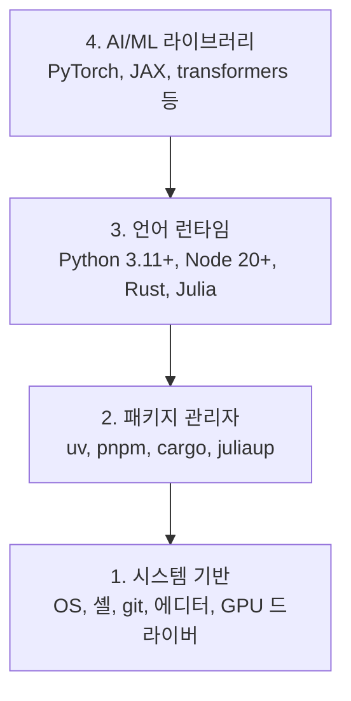

# 개발 환경

> 도구가 사고를 형성합니다. 한 번에, 올바르게 설정하세요.

**유형:** Build
**언어:** Python, Node.js, Rust
**선수 요건:** 없음
**시간:** 약 45분

## 학습 목표

- Python 3.11+, Node.js 20+, Rust 도구 체인을 처음부터 설정하세요
- 재현 가능한 빌드를 위해 가상 환경 및 패키지 관리자를 구성하세요
- CUDA/MPS로 GPU 접근을 확인하고 테스트 텐서 연산을 실행하세요
- 시스템, 패키지, 런타임, AI 라이브러리의 4계층 스택을 이해하세요

## 문제점

Python, TypeScript, Rust, Julia를 사용하여 500개 이상의 강의를 통해 AI 엔지니어링을 배우게 됩니다. 환경이 망가져 있으면 모든 강의가 학습이 아닌 도구와의 싸움이 됩니다.

대부분의 사람들은 환경 설정을 건너뜁니다. 그 후 import 오류, 버전 충돌, 누락된 CUDA 드라이버를 디버깅하는 데 몇 시간을 낭비합니다. 우리는 이 과정을 한 번, 제대로 수행할 것입니다.

## 개념

AI 엔지니어링 환경은 네 개의 계층으로 구성됩니다:



하위 계층부터 설치합니다. 각 계층은 그 아래 계층에 의존합니다.

```figure
s0-env-stack
```

## 구현하기

### 1단계: 시스템 기반

시스템을 확인하고 기본 요소를 설치하세요.

```bash
# macOS
xcode-select --install
brew install git curl wget

# Ubuntu/Debian
sudo apt update && sudo apt install -y build-essential git curl wget unzip

# Windows (WSL2 사용)
wsl --install -d Ubuntu-24.04
```

### 2단계: uv를 사용한 Python

`uv`를 사용합니다. pip보다 10-100배 빠르며 가상 환경을 자동으로 처리합니다.

```bash
curl -LsSf https://astral.sh/uv/install.sh | sh

uv python install 3.12

uv venv
source .venv/bin/activate  # Windows에서는 .venv\Scripts\activate를 사용하세요

uv pip install numpy matplotlib jupyter
```

확인하세요:

```python
import sys
print(f"Python {sys.version}")

import numpy as np
print(f"NumPy {np.__version__}")
a = np.array([1, 2, 3])
print(f"Vector: {a}, dot product with itself: {np.dot(a, a)}")
```

### 3단계: pnpm을 사용한 Node.js

TypeScript 강의(에이전트, MCP 서버, 웹 앱)에 사용됩니다.

```bash
curl -fsSL https://fnm.vercel.app/install | bash
fnm install 22
fnm use 22

npm install -g pnpm

node -e "console.log('Node', process.version)"
```

fnm 설치 프로그램은 `unzip`을 먼저 확인하고, `Not installing fnm due to missing dependencies.`이 없으면 종료합니다. Linux에서는 zip 아카이브를 압축 해제하고, macOS에서는 Homebrew를 통해 설치합니다. macOS는 `unzip`을 기본으로 제공합니다. Ubuntu, Debian, WSL2는 1단계의 apt 라인(`sudo apt install -y unzip`, 해당 단계를 건너뛰었다면)에서 설치합니다.

**macOS / Apple Silicon (M1/M2/M3/M4):** 설치 프로그램이 `Error: Cannot install under Rosetta 2 in ARM default prefix (/opt/homebrew)`으로 중단되면, 터미널이 Rosetta 2 환경에서 실행 중이며(`arch`이 `i386`을 출력함), Homebrew는 네이티브 arm64 빌드입니다. arm64를 강제하여 fnm을 설치하고 셸에 연결한 후, `fnm install 22`의 위 명령들을 다시 실행해 보세요:

```bash
arch -arm64 brew install fnm
echo 'eval "$(fnm env --use-on-cd)"' >> ~/.zshrc
source ~/.zshrc
```

### 4단계: Rust

성능이 중요한 강의(추론, 시스템)에 사용됩니다.

```bash
curl --proto '=https' --tlsv1.2 -sSf https://sh.rustup.rs | sh

rustc --version
cargo --version
```

### 5단계: Julia (선택 사항)

Julia가 빛을 발하는 수학 중심 강의에 사용됩니다.

```bash
curl -fsSL https://install.julialang.org | sh

julia -e 'println("Julia ", VERSION)'
```

### 6단계: GPU 설정 (GPU가 있는 경우)

**NVIDIA (Linux / Windows):**

```bash
nvidia-smi

# CUDA가 포함된 PyTorch 설치
uv pip install torch torchvision torchaudio --index-url https://download.pytorch.org/whl/cu124
```

**macOS / Apple Silicon (M1/M2/M3/M4):** Mac에는 CUDA가 없습니다. 이는 예상된 상황이며 실패가 아닙니다. `--index-url .../cuXXX`을 **사용하지** 마세요. 해당 휠은 Linux/Windows 전용이므로 설치가 실패합니다. Apple의 MPS (Metal) GPU 백엔드가 포함된 일반 빌드를 설치하세요:

```bash
uv pip install torch torchvision torchaudio
```

검증 (모든 플랫폼에서 작동):

```python
import torch
print(f"CUDA available: {torch.cuda.is_available()}")           # macOS에서는 False — 예상된 결과
print(f"MPS available:  {torch.backends.mps.is_available()}")   # Apple Silicon에서는 True
if torch.cuda.is_available():
    print(f"GPU: {torch.cuda.get_device_name(0)}")
```

GPU가 없어도 문제없습니다. 대부분의 강의는 CPU로 작동합니다. 학습이 많은 강의는 Google Colab이나 클라우드 GPU를 사용해 보세요.

### 7단계: 시작하려는 경로 확인

이 강의의 모든 명령은 저장소 루트, 즉 `README.md`과 `phases/`이 포함된 디렉토리에서 실행하세요. 사전 점검은 선택한 경로를 시작하는 데 필요한 것만 확인합니다. 기본 설정으로 이후 도구들을 건너뛰므로, 신규 학습자는 경고의 나열이 아닌 명확한 답변 하나를 볼 수 있습니다.

초보자 전체 시퀀스를 시작하세요:

```bash
python3 phases/00-setup-and-tooling/01-dev-environment/code/verify.py --route beginner
```

또는 원하는 경로만 확인하세요:

```bash
python3 phases/00-setup-and-tooling/01-dev-environment/code/verify.py --route ml-foundations
python3 phases/00-setup-and-tooling/01-dev-environment/code/verify.py --route llm-engineering
python3 phases/00-setup-and-tooling/01-dev-environment/code/verify.py --route agents
python3 phases/00-setup-and-tooling/01-dev-environment/code/verify.py --route mcp
python3 phases/00-setup-and-tooling/01-dev-environment/code/verify.py --route agent-skills
python3 phases/00-setup-and-tooling/01-dev-environment/code/verify.py --route certification
```

이후 강의에서 사용되는 선택적 도구와 의존성을 동일한 사전 점검이 검사하도록 `--show-later`을 추가하세요. 이후 도구가 누락되어도 선택한 경로를 차단하지 않습니다.

실패한 필수 체크마다 감지된 경로 또는 import 오류와 정확한 수정 명령이 포함됩니다. Agent Skills 및 인증 경로에는 수동 호스트 체크도 표시되는데, Python 스크립트로는 AI 호스트가 스킬을 발견했는지, 선택한 스킬 범위가 쓰기 가능한지 증명할 수 없기 때문입니다.

초보자용 사전 점검이 통과하면, 실행 가능한 첫 번째 강의가 정확히 출력됩니다:

```text
Ready to start Beginner course.
Next: python3 phases/01-math-foundations/01-linear-algebra-intuition/code/vectors.py
```

## 사용하기

환경이 점검한 경로를 시작할 준비가 되었습니다. 전체 스택 때문에 첫 강의를 막지 말고, 강의가 요구할 때 후속 도구를 설치하세요. 커리큘럼 전반에서 사용할 도구는 다음과 같습니다:

| 언어 | 사용 위치 | 패키지 관리자 |
|----------|---------|-----------------|
| Python | 1-12단계 (ML, DL, NLP, Vision, Audio, LLM) | uv |
| TypeScript | 13-17단계 (Tools, Agents, Swarms, Infra) | pnpm |
| Rust | 12, 15-17단계 (성능이 중요한 시스템) | cargo |
| Julia | 1단계 (수학 기초) | Pkg |

## 출시하기

이 강의는 누구나 실행하여 설정을 확인할 수 있는 검증 스크립트를 생성합니다.

AI 어시스턴트가 환경 문제를 진단하는 데 도움이 되는 프롬프트는 `outputs/prompt-env-check.md`를 참고하세요.

## 연습 문제

1. 검증 스크립트를 실행하고 모든 실패를 수정하세요
2. 이 강의를 위한 Python 가상 환경을 만들고 PyTorch를 설치하세요
3. 네 언어 모두로 "hello world"를 작성하고 각각 실행하세요
