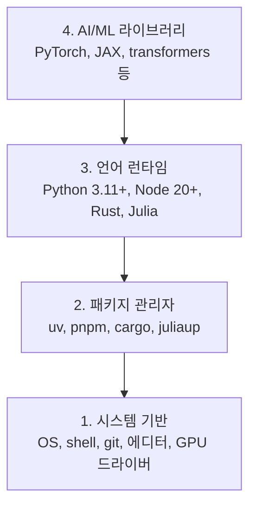

# 개발 환경 구축 (Dev Environment)

> 사용하는 도구가 사고를 형성합니다. 한 번 설정할 때 제대로 설정하세요.

**Type:** Build
**Languages:** Python, Node.js, Rust
**Prerequisites:** None
**Time:** ~45 minutes

## 학습 목표 (Learning Objectives)

- Python 3.11+, Node.js 20+, Rust 툴체인을 기초부터 직접 설치합니다.
- 재현 가능한 빌드를 위해 가상 환경과 패키지 관리자를 구성합니다.
- CUDA/MPS를 통한 GPU 접근성을 검증하고 테스트 텐서 연산을 실행합니다.
- 시스템, 패키지, 런타임, AI 라이브러리로 이어지는 4단계 스택을 이해합니다.

## 문제 상황 (The Problem)

앞으로 500개 이상의 레슨에 걸쳐 Python, TypeScript, Rust, Julia를 사용해 AI 엔지니어링을 학습하게 됩니다. 환경 설정이 제대로 되어 있지 않다면, 모든 레슨이 학습이 아닌 툴링 설정과의 싸움으로 변질됩니다.

대부분의 사람들은 개발 환경 설정을 건너뜁니다. 그리고 import 오류, 버전 충돌, 누락된 CUDA 드라이버를 디버깅하느라 몇 시간을 낭비합니다. 여기서는 처음부터 한 번에, 완벽하게 설정합니다.

## 핵심 개념 (The Concept)

AI 엔지니어링 환경은 4개의 계층으로 구성됩니다:



우리는 아래에서 위로(bottom-up) 설치합니다. 각 계층은 바로 아래 계층에 의존합니다.

```figure
s0-env-stack
```

## 구현하기 (Build It)

### Step 1: 시스템 기반 (System Foundation)

현재 시스템을 확인하고 필수 기본 도구를 설치합니다.

```bash
# macOS
xcode-select --install
brew install git curl wget

# Ubuntu/Debian
sudo apt update && sudo apt install -y build-essential git curl wget

# Windows (WSL2 사용)
wsl --install -d Ubuntu-24.04
```

### Step 2: uv 기반 Python 설정

우리는 `uv`를 사용합니다. `pip`보다 10~100배 빠르며 가상 환경을 자동으로 관리해 줍니다.

```bash
curl -LsSf https://astral.sh/uv/install.sh | sh

uv python install 3.12

uv venv
source .venv/bin/activate  # Windows의 경우 .venv\Scripts\activate

uv pip install numpy matplotlib jupyter
```

설치 검증:

```python
import sys
print(f"Python {sys.version}")

import numpy as np
print(f"NumPy {np.__version__}")
a = np.array([1, 2, 3])
print(f"Vector: {a}, dot product with itself: {np.dot(a, a)}")
```

### Step 3: pnpm 기반 Node.js 설정

TypeScript 레슨(에이전트, MCP 서버, 웹 애플리케이션)을 위해 필요합니다.

```bash
curl -fsSL https://fnm.vercel.app/install | bash
fnm install 22
fnm use 22

npm install -g pnpm

node -e "console.log('Node', process.version)"
```

**macOS / Apple Silicon (M1/M2/M3/M4):** 설치 중 `Error: Cannot install under Rosetta 2 in ARM default prefix (/opt/homebrew)` 오류가 발생한다면, Homebrew는 네이티브 arm64 빌드인데 터미널이 Rosetta 2(`arch` 실행 시 `i386` 출력) 환경에서 실행되고 있는 것입니다. arm64를 강제 지정하여 fnm을 설치하고 쉘에 등록한 다음, 위의 `fnm install 22`부터 다시 실행하세요:

```bash
arch -arm64 brew install fnm
echo 'eval "$(fnm env --use-on-cd)"' >> ~/.zshrc
source ~/.zshrc
```

### Step 4: Rust 설정

고성능 시스템 레슨(추론 엔진, 저수준 시스템)을 위해 필요합니다.

```bash
curl --proto '=https' --tlsv1.2 -sSf https://sh.rustup.rs | sh

rustc --version
cargo --version
```

### Step 5: Julia 설정 (선택 사항)

수학 연산 비중이 높고 Julia의 강점이 드러나는 레슨을 위한 선택 사항입니다.

```bash
curl -fsSL https://install.julialang.org | sh

julia -e 'println("Julia ", VERSION)'
```

### Step 6: GPU 설정 (GPU 보유 시)

**NVIDIA (Linux / Windows):**

```bash
nvidia-smi

# CUDA 지원 PyTorch 설치
uv pip install torch torchvision torchaudio --index-url https://download.pytorch.org/whl/cu124
```

**macOS / Apple Silicon (M1/M2/M3/M4):** Mac에는 CUDA가 없으며, 이는 정상적인 동작입니다. `--index-url .../cuXXX` 플래그를 전달하지 마세요(해당 휠은 Linux/Windows 전용이므로 설치가 실패합니다). Apple의 MPS(Metal) GPU 백엔드가 포함된 기본 빌드를 설치합니다:

```bash
uv pip install torch torchvision torchaudio
```

GPU 환경 검증 (모든 플랫폼 공통):

```python
import torch
print(f"CUDA available: {torch.cuda.is_available()}")           # macOS에서는 False (정상)
print(f"MPS available:  {torch.backends.mps.is_available()}")   # Apple Silicon에서는 True
if torch.cuda.is_available():
    print(f"GPU: {torch.cuda.get_device_name(0)}")
```

GPU가 없더라도 걱정하지 마세요. 대부분의 레슨은 CPU에서도 문제없이 실행됩니다. 대규모 학습 레슨의 경우 Google Colab이나 클라우드 GPU를 활용할 수 있습니다.

### Step 7: 시작할 학습 경로 검증 (Preflight)

본 레슨의 모든 명령어는 `README.md`와 `phases/` 디렉터리가 있는 저장소 루트(repository root)에서 실행하세요. 사전 점검(preflight) 스크립트는 선택한 경로를 시작하는 데 꼭 필요한 항목만 검사합니다. 처음 시작하는 학습자가 수많은 경고 문구에 압도되지 않도록, 이후 레슨에서 쓰일 도구들은 기본적으로 건너뜁니다.

초심자 전체 코스 점검 시작:

```bash
python3 phases/00-setup-and-tooling/01-dev-environment/code/verify.py --route beginner
```

또는 원하는 특정 경로만 선택하여 점검:

```bash
python3 phases/00-setup-and-tooling/01-dev-environment/code/verify.py --route ml-foundations
python3 phases/00-setup-and-tooling/01-dev-environment/code/verify.py --route llm-engineering
python3 phases/00-setup-and-tooling/01-dev-environment/code/verify.py --route agents
python3 phases/00-setup-and-tooling/01-dev-environment/code/verify.py --route mcp
python3 phases/00-setup-and-tooling/01-dev-environment/code/verify.py --route agent-skills
python3 phases/00-setup-and-tooling/01-dev-environment/code/verify.py --route certification
```

이후 레슨에서 쓰이는 선택 도구와 의존성까지 한 번에 점검하고 싶다면 `--show-later` 옵션을 추가하세요. 뒤쪽 레슨의 도구가 없더라도 현재 선택한 학습 경로를 시작하는 데는 전혀 지장이 없습니다.

필수 점검 항목이 실패하면 감지된 경로나 import 에러 내용과 함께 정확한 해결 명령어가 함께 출력됩니다. Agent Skills 및 인증 경로는 AI 호스트가 스킬을 감지했는지, 스킬 디렉터리에 쓰기 권한이 있는지 등을 파이썬 스크립트만으로 완전히 검증할 수 없으므로 수동 확인 안내가 함께 표시됩니다.

초심자 사전 점검을 통과하면 바로 실행해 볼 수 있는 첫 번째 레슨 안내가 출력됩니다:

```text
Ready to start Beginner course.
Next: python3 phases/01-math-foundations/01-linear-algebra-intuition/code/vectors.py
```

## 실무 활용 (Use It)

이제 점검을 마친 경로를 학습할 준비가 완료되었습니다. 전체 기술 스택을 처음부터 모두 설치하느라 첫 레슨 시작을 지체하지 말고, 각 레슨에서 요구할 때 후속 도구들을 순차적으로 설치하세요. 전체 커리큘럼에서 활용되는 언어와 도구는 다음과 같습니다:

| Language | 사용 단계 | 패키지 관리자 |
|----------|---------|-----------------|
| Python | Phases 1-12 (ML, DL, NLP, Vision, Audio, LLM) | uv |
| TypeScript | Phases 13-17 (도구, 에이전트, 스웜, 인프라) | pnpm |
| Rust | Phases 12, 15-17 (고성능 핵심 시스템) | cargo |
| Julia | Phase 1 (수학 기초) | Pkg |

## 결과물 납품 (Ship It)

이 레슨을 통해 누구나 자신의 개발 환경을 검증할 수 있는 환경 검증 스크립트를 확보했습니다.

AI 어시스턴트가 개발 환경 문제를 직접 진단하도록 돕는 프롬프트 템플릿은 `outputs/prompt-env-check.md`를 참고하세요.

## 실습 과제 (Exercises)

1. 환경 검증 스크립트를 실행하고 실패하는 항목이 있다면 해결해 보세요.
2. 이 코스를 위한 전용 Python 가상 환경을 생성하고 PyTorch를 설치해 보세요.
3. 4개 언어(Python, TypeScript, Rust, Julia) 모두로 "hello world"를 작성하고 각각 실행해 보세요.
