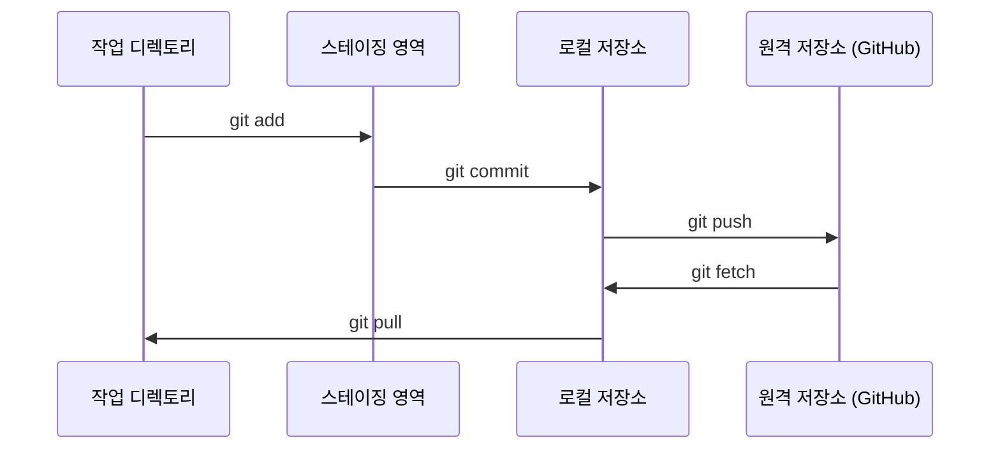

# Git 및 협업

> 버전 관리는 선택 사항이 아닙니다. 여기서 구축하는 모든 실험, 모든 모델, 모든 강의를 추적합니다.

**유형:** Learn
**언어:** --
**선수 요건:** 0단계, 01강
**시간:** 약 30분

## 학습 목표

- git 신원을 설정하고 add, commit, push의 일상적인 워크플로우를 사용해 보세요
- main을 망치지 않도록 격리된 실험을 위해 브랜치를 생성하고 병합해 보세요
- 모델 체크포인트 및 대형 바이너리 파일을 제외하는 `.gitignore`를 작성해 보세요
- `git log`를 사용하여 커밋 히스토리를 탐색하고 프로젝트의 진화를 이해해 보세요

## 문제점

20단계에 걸쳐 수백 개의 코드 파일을 작성하게 됩니다. 버전 관리가 없으면 작업이 손실되고, 되돌릴 수 없는 상태로 망가뜨리며, 다른 사람과 협업할 방법이 없습니다.

Git은 도구입니다. GitHub는 코드가 저장되는 곳입니다. 이 강의는 이 과정에 필요한 내용만 다루며 그 이상은 다루지 않습니다.

## 개념



기억해야 할 세 가지:
1. 자주 저장하기 (`git commit`)
2. 원격 저장소에 푸시하기 (`git push`)
3. 실험을 위해 브랜치 생성하기 (`git checkout -b experiment`)

```figure
s0-commit-dag
```

## 구현하기

### 1단계: git 설정

```bash
git config --global user.name "Your Name"
git config --global user.email "you@example.com"
```

### 2단계: 일상적인 워크플로우

```bash
git status
git add file.py
git commit -m "Add perceptron implementation"
git push origin main
```

### 3단계: 실험을 위한 브랜치 생성

```bash
git checkout -b experiment/new-optimizer

# ... 변경 사항 생성, 커밋 ...

git checkout main
git merge experiment/new-optimizer
```

### 4단계: 이 과정 저장소와 작업하기

이 과정 저장소 자체에는 푸시할 수 없습니다. 유지 관리자만 쓰기 권한을 가지고 있습니다. GitHub에서 먼저 포크하세요 (오른쪽 상단의 Fork 버튼). 그러면 `origin`가 자신의 사본을 가리키게 됩니다:

```bash
git clone https://github.com/YOUR-USERNAME/ai-engineering-from-scratch.git
cd ai-engineering-from-scratch

git checkout -b my-progress
# 강의를 진행하면서 코드를 커밋하세요
git push origin my-progress
```

## 사용하기

이 과정에서는 정확히 아래 명령어만 필요합니다:

| 명령어 | 사용 시점 |
|---------|------|
| `git clone` | 과정 저장소 가져오기 |
| `git add` + `git commit` | 작업 저장 |
| `git push` | GitHub에 백업 |
| `git checkout -b` | main을 망치지 않고 무언가 시도하기 |
| `git log --oneline` | 수행한 작업 확인 |

이것으로 충분합니다. 이 과정에서는 rebase, cherry-pick, submodules가 필요하지 않습니다.

## 연습 문제

1. 이 저장소를 포크(fork)하고, 포크한 저장소를 클론(clone)한 후, `my-progress`라는 브랜치를 생성하고, 파일을 만들어 커밋(commit)하고, 푸시(push)해 보세요
2. 모델 체크포인트 파일(`.pt`, `.pth`, `.safetensors`)을 제외하는 `.gitignore`을 생성해 보세요
3. `git log --oneline`을 사용하여 이 저장소의 커밋 히스토리를 살펴보고, 강의가 추가된 방식을 읽어 보세요

## 핵심 용어

| 용어 | 사람들이 말하는 표현 | 실제 의미 |
|------|----------------|----------------------|
| Commit | "저장" | 특정 시점에서의 프로젝트 전체 스냅샷 |
| Branch | "복사본" | 작업에 따라 앞으로 이동하는 커밋을 가리키는 포인터 |
| Merge | "코드 결합" | 한 브랜치의 변경 사항을 다른 브랜치에 적용하는 것 |
| Remote | "클라우드" | 다른 위치(GitHub, GitLab)에 호스팅된 저장소 복사본 |
