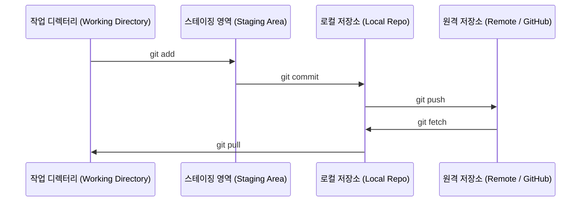

# Git과 협업 (Git & Collaboration)

> 버전 관리는 선택이 아닙니다. 여기서 만들게 될 모든 실험, 모든 모델, 모든 레슨은 버전으로 추적됩니다.

**Type:** Learn
**Languages:** --
**Prerequisites:** Phase 0, Lesson 01
**Time:** ~30 minutes

## 학습 목표 (Learning Objectives)

- Git 사용자 정보를 설정하고 add, commit, push의 일상적인 작업 흐름을 사용합니다.
- main 브랜치를 건드리지 않고 독립적인 실험을 위해 브랜치를 생성하고 병합합니다.
- 모델 체크포인트와 대용량 바이너리 파일을 제외하는 `.gitignore`를 작성합니다.
- `git log`를 활용해 커밋 히스토리를 탐색하고 프로젝트의 발전 과정을 이해합니다.

## 문제 상황 (The Problem)

앞으로 20개 단계에 걸쳐 수백 개의 코드 파일을 작성하게 됩니다. 버전 관리가 없다면 작업한 코드를 잃어버리고, 되돌릴 수 없는 실수를 저지르며, 다른 사람과 협업할 방법이 없어집니다.

Git은 핵심 도구이며, GitHub는 코드가 저장되는 공간입니다. 이 레슨에서는 본 코스를 진행하는 데 꼭 필요한 내용만 명확하게 다룹니다.

## 핵심 개념 (The Concept)



기억해야 할 세 가지:
1. 자주 저장하기 (`git commit`)
2. 원격 저장소에 푸시하기 (`git push`)
3. 새로운 실험은 브랜치에서 진행하기 (`git checkout -b experiment`)

```figure
s0-commit-dag
```

## 구현하기 (Build It)

### Step 1: Git 사용자 정보 설정

```bash
git config --global user.name "Your Name"
git config --global user.email "you@example.com"
```

### Step 2: 일상적인 작업 흐름

```bash
git status
git add file.py
git commit -m "Add perceptron implementation"
git push origin main
```

### Step 3: 실험을 위한 브랜치 생성

```bash
git checkout -b experiment/new-optimizer

# ... 코드 수정 및 커밋 ...

git checkout main
git merge experiment/new-optimizer
```

### Step 4: 이 코스 저장소로 작업하기

메인 코스 저장소에는 직접 푸시할 수 없습니다(메인테이너만 쓰기 권한 보유). 먼저 GitHub에서 Fork(우측 상단 Fork 버튼)하여 `origin`이 본인의 복사본을 가리키도록 설정하세요:

```bash
git clone https://github.com/YOUR-USERNAME/ai-engineering-from-scratch.git
cd ai-engineering-from-scratch

git checkout -b my-progress
# 레슨을 따라 코드를 작성하고 커밋 진행
git push origin my-progress
```

## 실무 활용 (Use It)

이 코스를 진행하는 데 필요한 명령어는 다음과 같습니다:

| 명령어 | 사용 시점 |
|---------|------|
| `git clone` | 코스 저장소 내려받기 |
| `git add` + `git commit` | 작업 내용 저장하기 |
| `git push` | GitHub 원격 저장소에 백업하기 |
| `git checkout -b` | main 브랜치를 망치지 않고 새로운 시도하기 |
| `git log --oneline` | 지금까지의 작업 기록 확인하기 |

이것으로 충분합니다. 본 코스에서는 복잡한 rebase, cherry-pick, submodule까지는 다루지 않아도 괜찮습니다.

## 실습 과제 (Exercises)

1. 이 저장소를 Fork하고, 클론한 뒤 `my-progress` 브랜치를 생성해 파일을 만들고 커밋 후 푸시해 보세요.
2. 모델 체크포인트 파일(`.pt`, `.pth`, `.safetensors`)을 제외하는 `.gitignore` 파일을 작성해 보세요.
3. `git log --oneline`으로 이 저장소의 커밋 기록을 살펴보고 각 레슨이 어떻게 추가되었는지 확인해 보세요.

## 핵심 용어 정리 (Key Terms)

| 용어 | 흔히 하는 표현 | 실제 의미 |
|------|----------------|----------------------|
| Commit | "저장하기" | 특정 시점의 전체 프로젝트 상태를 담은 스냅샷 |
| Branch | "복사본" | 작업을 진행함에 따라 앞으로 나아가는 커밋 포인터 |
| Merge | "코드 합치기" | 한 브랜치의 변경 사항을 가져와 다른 브랜치에 적용하는 작업 |
| Remote | "클라우드" | 외부 서비스(GitHub, GitLab 등)에 호스팅된 저장소 복사본 |
