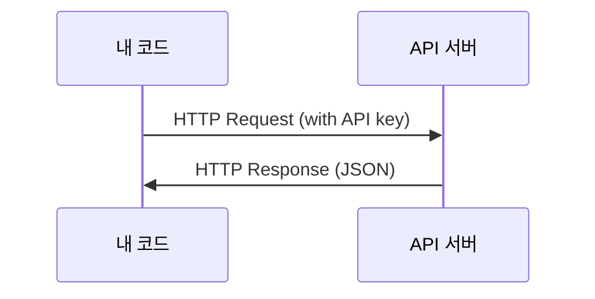

# API 및 키

> 모든 AI API는 동일한 방식으로 작동합니다: 요청을 보내고 응답을 받습니다. 세부 사항은 달라지지만, 패턴은 변하지 않습니다.

**유형:** Build
**언어:** Python, TypeScript
**선수 요건:** 0단계, 01강
**시간:** 약 30분

## 학습 목표

- 환경 변수 및 `.env` 파일을 사용하여 API 키를 안전하게 저장하기
- Anthropic Python SDK와 원시(raw) HTTP를 모두 사용하여 LLM API 호출하기
- 디버깅을 위해 SDK 기반 및 원시 HTTP 요청/응답 형식 비교하기
- 인증 및 속도 제한을 포함한 일반적인 API 오류를 식별하고 처리하기

## 문제점

11단계부터 LLM API(Anthropic, OpenAI, Google)를 호출하게 됩니다. 13-16단계에서는 이러한 API를 루프에서 사용하는 에이전트를 구축합니다. API 키가 작동하는 방식, 이를 안전하게 저장하는 방법, 그리고 첫 번째 API 호출을 수행하는 방법을 알아야 합니다.

## 개념



모든 API 호출에는 다음이 포함됩니다:
1. 엔드포인트(URL)
2. API 키(인증)
3. 요청 본문(원하는 내용)
4. 응답 본문(받게 되는 내용)

```figure
s0-secret-inject
```

## 구현하기

### 1단계: API 키를 안전하게 저장하기

API 키를 코드에 넣지 마세요. 환경 변수를 사용하세요.

```bash
export ANTHROPIC_API_KEY="sk-ant-..."
export OPENAI_API_KEY="sk-..."
```

또는 `.env` 파일을 사용하세요(`.gitignore`에 추가하세요):

```
ANTHROPIC_API_KEY=sk-ant-...
OPENAI_API_KEY=sk-...
```

### 2단계: 첫 번째 API 호출(Python)

```python
import os

import anthropic

client = anthropic.Anthropic()

MODEL = os.environ.get("LLM_MODEL", "claude-sonnet-5")

response = client.messages.create(
    model=MODEL,
    max_tokens=256,
    messages=[{"role": "user", "content": "What is a neural network in one sentence?"}]
)

print(response.content[0].text)
```

`LLM_MODEL`는 Anthropic 모델 ID를 선택하며, 기본값은 날짜가 지정되지 않은 Sonnet 별칭입니다. 다른 제공자(OpenAI, Google 등)도 키와 모델 ID라는 동일한 패턴을 따르지만, 각각 자체 SDK, 엔드포인트 및 요청/응답 스키마를 가지고 있습니다.

### 3단계: 첫 번째 API 호출(TypeScript)

```typescript
import Anthropic from "@anthropic-ai/sdk";

const client = new Anthropic();

const MODEL = process.env.LLM_MODEL ?? "claude-sonnet-5";

const response = await client.messages.create({
  model: MODEL,
  max_tokens: 256,
  messages: [{ role: "user", content: "What is a neural network in one sentence?" }],
});

console.log(response.content[0].text);
```

### 4단계: 원시 HTTP(SDK 없음)

```python
import os
import urllib.request
import json

url = "https://api.anthropic.com/v1/messages"
headers = {
    "Content-Type": "application/json",
    "x-api-key": os.environ["ANTHROPIC_API_KEY"],
    "anthropic-version": "2023-06-01",
}
body = json.dumps({
    "model": os.environ.get("LLM_MODEL", "claude-sonnet-5"),
    "max_tokens": 256,
    "messages": [{"role": "user", "content": "What is a neural network in one sentence?"}],
}).encode()

req = urllib.request.Request(url, data=body, headers=headers, method="POST")
with urllib.request.urlopen(req) as resp:
    result = json.loads(resp.read())
    print(result["content"][0]["text"])
```

이것은 SDK가 내부적으로 수행하는 작업입니다. 원시 HTTP 호출을 이해하면 디버깅에 도움이 됩니다.

## 사용하기

이 과정에서는:

| API | 필요할 때 | 무료 티어 |
|-----|-----------------|-----------|
| Anthropic (Claude) | 11-16단계 (에이전트, 도구) | 가입 시 $5 크레딧 |
| OpenAI | 11단계 (비교) | 가입 시 $5 크레딧 |
| Hugging Face | 4-10단계 (모델, 데이터셋) | 무료 |

지금 당장 모두 필요하지는 않습니다. 강의가 요구할 때 설정해 보세요.

## 출시하기

이 강의는 다음을 생성합니다:
- `outputs/prompt-api-troubleshooter.md` - 일반적인 API 오류 진단

## 연습 문제

1. Anthropic API 키를 얻고 첫 API 호출을 해 보세요
2. raw HTTP 버전을 시도하고 SDK 버전의 응답 형식과 비교해 보세요
3. 의도적으로 잘못된 API 키를 사용하고 오류 메시지를 읽어 보세요

## 핵심 용어

| 용어 | 사람들이 말하는 것 | 실제 의미 |
|------|----------------|----------------------|
| API key | "API의 비밀번호" | 계정을 식별하고 요청을 승인하는 고유 문자열 |
| Rate limit | "속도를 제한하고 있다" | 남용을 방지하고 공정한 사용을 보장하기 위한 분/시간당 최대 요청 수 |
| Token | "단어" (API 컨텍스트) | 과금 단위: 입력 및 출력 토큰은 각각 계산되고 과금됩니다 |
| Streaming | "실시간 응답" | 전체 응답을 기다리는 대신 단어를 하나씩 받아오는 것 |
