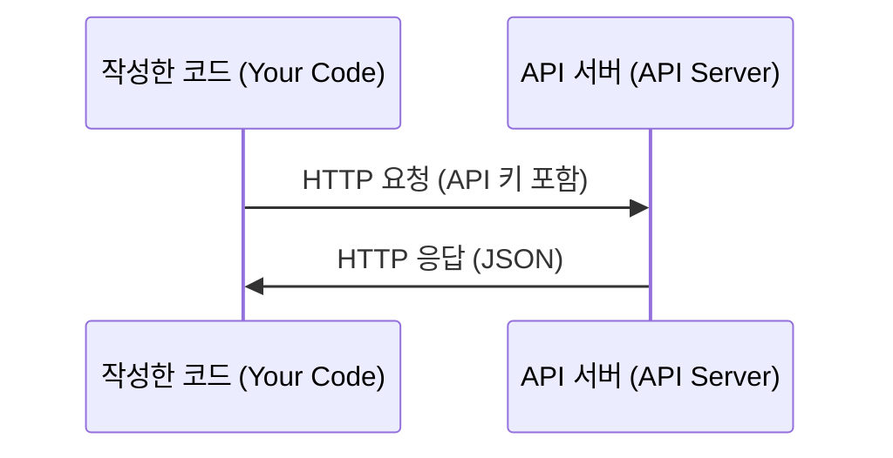

# API 및 키 관리 (APIs & Keys)

> 모든 AI API의 동작 원리는 동일합니다. 요청을 보내고 응답을 받습니다. 세부 사항만 다를 뿐 기본 패턴은 변하지 않습니다.

**Type:** Build
**Languages:** Python, TypeScript
**Prerequisites:** Phase 0, Lesson 01
**Time:** ~30 minutes

## 학습 목표 (Learning Objectives)

- 환경 변수와 `.env` 파일을 활용해 API 키를 안전하게 보관합니다.
- Anthropic Python SDK와 순수 HTTP 호출 두 가지 방식으로 LLM API를 호출합니다.
- 디버깅을 위해 SDK 방식과 순수 HTTP 방식의 요청/응답 형식을 비교합니다.
- 인증 오류 및 요청 한도(rate limits)를 포함한 일반적인 API 에러를 식별하고 처리합니다.

## 문제 상황 (The Problem)

Phase 11부터는 Anthropic, OpenAI, Google과 같은 LLM API를 직접 호출하게 됩니다. Phase 13부터 16까지는 이러한 API를 루프 안에서 호출하는 에이전트를 구축합니다. 따라서 API 키가 어떻게 작동하고, 이를 안전하게 저장하는 방법과 첫 번째 API를 호출하는 방법을 확실히 익혀두어야 합니다.

## 핵심 개념 (The Concept)



모든 API 호출은 다음 4가지로 구성됩니다:
1. 엔드포인트 URL (Endpoint)
2. API 키 (인증 자격 증명)
3. 요청 본문 (전달하려는 데이터)
4. 응답 본문 (서버에서 반환받는 결과 데이터)

```figure
s0-secret-inject
```

## 구현하기 (Build It)

### Step 1: API 키를 안전하게 보관하기

코드 안에 직접 API 키를 하드코딩하지 마세요. 환경 변수를 사용합니다.

```bash
export ANTHROPIC_API_KEY="sk-ant-..."
export OPENAI_API_KEY="sk-..."
```

또는 `.env` 파일을 활용하세요 (반드시 `.gitignore`에 등록해야 합니다):

```
ANTHROPIC_API_KEY=sk-ant-...
OPENAI_API_KEY=sk-...
```

### Step 2: 첫 번째 API 호출 (Python)

```python
import os

import anthropic

client = anthropic.Anthropic()

MODEL = os.environ.get("LLM_MODEL", "claude-sonnet-5")

response = client.messages.create(
    model=MODEL,
    max_tokens=256,
    messages=[{"role": "user", "content": "What is a neural network in one sentence?"}]
)

print(response.content[0].text)
```

`LLM_MODEL`은 Anthropic 모델 ID를 선택하며, 기본값은 별칭 형태의 Sonnet입니다. OpenAI, Google 등 다른 제공업체도 키와 모델 ID를 기반으로 동작하지만, SDK, 엔드포인트 URL, 요청/응답 스키마가 각기 다릅니다.

### Step 3: 첫 번째 API 호출 (TypeScript)

```typescript
import Anthropic from "@anthropic-ai/sdk";

const client = new Anthropic();

const MODEL = process.env.LLM_MODEL ?? "claude-sonnet-5";

const response = await client.messages.create({
  model: MODEL,
  max_tokens: 256,
  messages: [{ role: "user", content: "What is a neural network in one sentence?" }],
});

console.log(response.content[0].text);
```

### Step 4: 순수 HTTP 호출 (SDK 없이 직접 호출)

```python
import os
import urllib.request
import json

url = "https://api.anthropic.com/v1/messages"
headers = {
    "Content-Type": "application/json",
    "x-api-key": os.environ["ANTHROPIC_API_KEY"],
    "anthropic-version": "2023-06-01",
}
body = json.dumps({
    "model": os.environ.get("LLM_MODEL", "claude-sonnet-5"),
    "max_tokens": 256,
    "messages": [{"role": "user", "content": "What is a neural network in one sentence?"}],
}).encode()

req = urllib.request.Request(url, data=body, headers=headers, method="POST")
with urllib.request.urlopen(req) as resp:
    result = json.loads(resp.read())
    print(result["content"][0]["text"])
```

SDK가 내부적으로 수행하는 작업이 바로 이 HTTP 통신입니다. 순수 HTTP 호출 방식을 이해해 두면 네트워크 에러 발생 시 디버깅하기가 훨씬 수월해집니다.

## 실무 활용 (Use It)

본 코스에서 활용하는 주요 API 서비스:

| API | 필요 시점 | 무료 혜택 / 티어 |
|-----|-----------------|-----------|
| Anthropic (Claude) | Phases 11-16 (에이전트, 도구) | 가입 시 $5 크레딧 제공 |
| OpenAI | Phase 11 (비교 실습) | 가입 시 $5 크레딧 제공 |
| Hugging Face | Phases 4-10 (오픈소스 모델, 데이터셋) | 무료 |

모든 API를 지금 당장 발급받을 필요는 없습니다. 해당 레슨에 도달했을 때 준비하세요.

## 결과물 납품 (Ship It)

이 레슨을 통해 제공되는 도구:
- `outputs/prompt-api-troubleshooter.md` - 흔한 API 에러를 진단하는 프롬프트

## 실습 과제 (Exercises)

1. Anthropic API 키를 발급받고 첫 번째 API 호출을 실행해 보세요.
2. 순수 HTTP 방식을 실행해 보고 SDK 방식의 응답 형태와 비교해 보세요.
3. 고의로 잘못된 API 키를 입력해 보고 출력되는 에러 메시지를 확인해 보세요.

## 핵심 용어 정리 (Key Terms)

| 용어 | 흔히 하는 표현 | 실제 의미 |
|------|----------------|----------------------|
| API key | "API 비밀번호" | 계정을 식별하고 요청을 인가(authorize)하는 고유 문자열 |
| Rate limit | "요청 제한" | 과도한 호출을 방지하고 공정한 사용을 보장하기 위한 분당/시간당 최대 요청 수 |
| Token | "단어 단위" (API 문맥) | 과금 단위: 입력 토큰과 출력 토큰이 분리되어 계산 및 청구됨 |
| Streaming | "실시간 응답" | 전체 응답 완성을 기다리지 않고 토큰 단위로 끊어서 실시간 전달받는 방식 |
