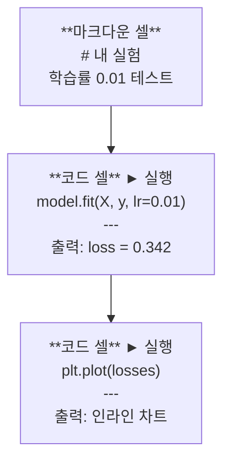
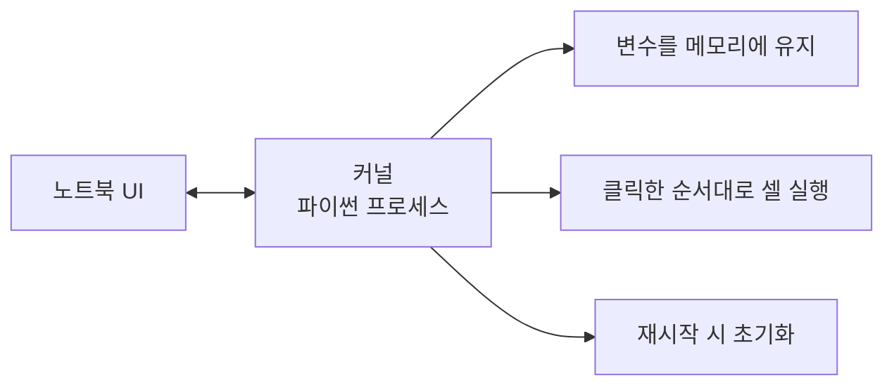

# 주피터 노트북 (Jupyter Notebooks)

> 노트북은 AI 엔지니어링의 실험대입니다. 여기서 아이디어를 프로토타이핑하고, 검증된 코드를 프로덕션으로 옮깁니다.

**Type:** Build
**Languages:** Python
**Prerequisites:** Phase 0, Lesson 01
**Time:** ~30 minutes

## 학습 목표 (Learning Objectives)

- JupyterLab, Jupyter Notebook 또는 VS Code Jupyter 확장을 설치하고 실행합니다.
- 매직 커맨드(`%timeit`, `%%time`, `%matplotlib inline`)를 사용해 코드 성능을 측정하고 인라인 시각화를 구현합니다.
- 노트북과 스크립트의 사용 시점을 구분하고 "노트북에서 탐색하고 스크립트로 제품화(explore in notebooks, ship in scripts)" 워크플로를 적용합니다.
- 순서 뒤바뀜 실행(out-of-order execution), 은닉 상태(hidden state), 메모리 누수 등 흔히 발생하는 노트북 함정을 방지합니다.

## 문제 상황 (The Problem)

거의 모든 AI 논문, 튜토리얼, 캐글(Kaggle) 경진대회에서 주피터 노트북을 사용합니다. 코드를 조각조각 실행하고, 출력을 즉시 확인하며, 설명과 코드를 섞어 작성하면서 빠르게 반복 실험할 수 있기 때문입니다. 노트북 없이 AI를 배우는 것은 연습장 없이 수학 문제를 푸는 것과 같습니다.

하지만 노트북에는 치명적인 함정도 존재합니다. 적합하지 않은 영역까지 모든 곳에 노트북을 남용하는 경우가 많습니다. 언제 노트북을 쓰고 언제 파이썬 스크립트(`.py`)를 써야 하는지 알아야 끔찍한 디버깅의 악몽에서 벗어날 수 있습니다.

## 핵심 개념 (The Concept)

노트북은 일련의 셀(Cell)로 이루어져 있으며, 각 셀은 코드 또는 마크다운 텍스트입니다.



커널(Kernel)은 백그라운드에서 동작하는 독립된 파이썬 프로세스입니다. 셀을 실행하면 커널로 코드가 전송되어 실행된 후 결과가 반환됩니다. 모든 셀은 동일한 커널 메모리를 공유하므로 변수 상태가 유지됩니다.



"클릭한 임의의 순서대로 실행된다"는 특성은 강력한 장점이자 동시에 가장 위험한 함정입니다.

```figure
s0-cell-order
```

## 구현하기 (Build It)

### Step 1: 실행 인터페이스 선택하기

세 가지 옵션 모두 동일한 `.ipynb` 포맷을 사용합니다:

| 인터페이스 | 설치 및 실행 | 추천 대상 |
|-----------|---------|----------|
| JupyterLab | `pip install jupyterlab` 후 `jupyter lab` | 탭, 파일 브라우저, 터미널을 갖춘 완전한 IDE 환경 |
| Jupyter Notebook | `pip install notebook` 후 `jupyter notebook` | 가볍고 단순하게 단일 노트북에 집중할 때 |
| VS Code | "Jupyter" 확장 설치 | 기존 에디터 환경, 강력한 Git 연동 및 디버깅 필요 시 |

셋 중 취향에 맞는 것을 고르세요. AI 실무에서는 **JupyterLab**이 가장 널리 쓰입니다.

```bash
pip install jupyterlab
jupyter lab
```

### Step 2: 필수 단축키 익히기

노트북은 두 가지 모드로 작동합니다. 명령 모드는 `Escape`(왼쪽에 파란색 바), 편집 모드는 `Enter`(초록색 바)를 누릅니다.

**명령 모드 (가장 자주 사용):**

| 단축키 | 동작 |
|-----|--------|
| `Shift+Enter` | 셀 실행 후 다음 셀로 이동 |
| `A` | 위에 셀 추가 (Above) |
| `B` | 아래에 셀 추가 (Below) |
| `DD` | 셀 삭제 (Delete) |
| `M` | 마크다운 셀로 전환 |
| `Y` | 코드 셀로 전환 |
| `Z` | 셀 작업 실행 취소 (Undo) |
| `Ctrl+Shift+H` | 모든 단축키 목록 보기 |

**편집 모드:**

| 단축키 | 동작 |
|-----|--------|
| `Tab` | 자동 완성 |
| `Shift+Tab` | 함수 시그니처 및 문서 팝업 |
| `Ctrl+/` | 주석 토글 |

하루에도 수천 번 누르게 되는 키는 `Shift+Enter`입니다. 이 단축키부터 손에 익히세요.

### Step 3: 셀 유형 이해하기

**코드 셀**은 파이썬 코드를 실행하고 결과를 바로 아래에 보여줍니다:

```python
import numpy as np
data = np.random.randn(1000)
data.mean(), data.std()
```

출력 예시: `(0.0032, 0.9987)`

**마크다운 셀**은 서식화된 텍스트를 렌더링합니다. 진행하는 작업의 이유와 배경을 기록할 때 사용합니다. 제목, 볼드체, 기울임꼴, LaTeX 수식(`$E = mc^2$`), 표, 이미지를 모두 지원합니다.

### Step 4: 매직 커맨드 (Magic Commands)

매직 커맨드는 순수 파이썬 문법이 아니라, 주피터 전용 특수 명령어로 한 줄에 적용되는 `%`(라인 매직) 또는 셀 전체에 적용되는 `%%`(셀 매직)으로 시작합니다.

**코드 실행 시간 측정:**

```python
%timeit np.random.randn(10000)
```

출력 예시: `45.2 us +/- 1.3 us per loop`

```python
%%time
model.fit(X_train, y_train, epochs=10)
```

출력 예시: `Wall time: 2.34 s`

`%timeit`은 코드를 여러 번 실행하여 평균값을 내줍니다. `%%time`은 한 번 실행한 시간을 측정합니다. 작은 연산 벤치마크에는 `%timeit`을, 모델 훈련에는 `%%time`을 사용하세요.

**인라인 차트 활성화:**

```python
%matplotlib inline
```

이 설정을 추가하면 `plt.plot()`이나 `plt.show()` 호출 시 그래프가 별도 창이 아닌 노트북 내부에 바로 렌더링됩니다.

**노트북 안에서 패키지 설치:**

```python
!pip install scikit-learn
```

`!` 접두사를 붙이면 쉘 명령어를 직접 실행할 수 있습니다.

**환경 변수 확인:**

```python
%env CUDA_VISIBLE_DEVICES
```

### Step 5: 풍부한 인라인 출력 표시

노트북은 셀의 마지막 표현식을 자동으로 화면에 출력합니다:

```python
import pandas as pd

df = pd.DataFrame({
    "model": ["Linear", "Random Forest", "Neural Net"],
    "accuracy": [0.72, 0.89, 0.94],
    "training_time": [0.1, 2.3, 45.6]
})
df
```

단순 텍스트 출력이 아닌 깔끔한 HTML 테이블로 렌더링됩니다. 데이터 시각화도 마찬가지입니다:

```python
import matplotlib.pyplot as plt

plt.figure(figsize=(8, 4))
plt.plot([1, 2, 3, 4], [1, 4, 2, 3])
plt.title("Inline Plot")
plt.show()
```

그래프가 셀 바로 아래에 표시되므로 데이터, 그래프, 코드를 한눈에 연결해 파악할 수 있습니다.

이미지 출력:

```python
from IPython.display import Image, display
display(Image(filename="architecture.png"))
```

### Step 6: Google Colab 활용하기

Colab은 클라우드에서 동작하는 무료 주피터 노트북 환경입니다. 별도 설치 없이 GPU 가속, 사전 설치된 라이브러리, 구글 드라이브 연동을 제공합니다.

1. [colab.research.google.com](https://colab.research.google.com) 접속
2. 이 코스의 임의의 `.ipynb` 파일 업로드
3. 런타임 > 런타임 유형 변경 > T4 GPU 선택 (무료)

로컬 주피터와의 차이점:
- 세션 종료 시 로컬 파일이 초기화됨 (구글 드라이브 저장 또는 다운로드 필요)
- numpy, pandas, matplotlib, torch, tensorflow, sklearn 등이 기본 탑재됨
- 파일 업로드/다운로드: `from google.colab import files`
- 드라이브 연동: `from google.colab import drive; drive.mount('/content/drive')`
- 무료 티어 기준 90분 동안 작업이 없으면 세션이 타임아웃됨

## 실무 활용 (Use It)

### 노트북 vs 파이썬 스크립트: 적절한 사용 기준

| 노트북을 사용해야 할 때 | 스크립트(`.py`)를 사용해야 할 때 |
|-------------------|-----------------|
| 데이터셋 탐색 및 전처리 | 모델 훈련 파이프라인 |
| 모델 초기 프로토타이핑 | 재사용 가능한 유틸리티 함수 |
| 실험 결과 시각화 | `if __name__` 엔트리포인트 코드 |
| 작업 내용과 로직 설명 | 배치(Batch) 스케줄링 실행 코드 |
| 빠른 가설 검증 | 프로덕션 배포용 코드 |
| 강의 실습 및 학습 | 패키지 및 라이브러리 개발 |

황금률: **탐색은 노트북에서, 배포는 스크립트로 (explore in notebooks, ship in scripts).**

실무 표준 워크플로:
1. 노트북에서 데이터를 시각화하고 탐색합니다.
2. 노트북에서 모델 구조를 빠르게 프로토타이핑합니다.
3. 검증이 끝나면 재사용할 로직을 `.py` 모듈 파일로 추출합니다.
4. 추가 실험을 진행할 때는 그 `.py` 모듈을 노트북에서 다시 import하여 사용합니다.

### 흔히 저지르는 함정과 해결책

**1. 순서 뒤바뀜 실행 (Out-of-order execution)**
5번 셀을 실행하고, 2번 셀을 수정한 뒤 7번 셀을 실행하는 경우입니다. 내 화면에서는 정상 작동하지만 위에서부터 순서대로 실행하면 에러가 납니다. 해결책: 공유하기 전에 반드시 `Kernel > Restart & Run All`을 실행해 처음부터 끝까지 통과하는지 검증하세요.

**2. 은닉 상태 (Hidden state)**
셀을 삭제했지만 그 셀이 생성했던 변수가 여전히 커널 메모리에 남아 있는 경우입니다. 코드는 깨끗해 보이지만 유령 셀에 의존하고 있는 상태입니다. 해결책: 커널을 주기적으로 재시작하세요.

**3. 메모리 누수 (Memory leaks)**
대용량 4GB 데이터셋을 불러와 학습하고, 다시 다른 데이터셋을 불러오면 이전 메모리가 해제되지 않고 누적됩니다. 해결책: `del 변수명` 후 `import gc; gc.collect()`를 호출하거나 커널을 재시작하세요.

## 결과물 납품 (Ship It)

이 레슨을 통해 제공되는 산출물:
- `outputs/prompt-notebook-helper.md`: 노트북 디버깅을 돕는 프롬프트 템플릿

## 실습 과제 (Exercises)

1. JupyterLab을 열고 새 노트북을 생성한 뒤, `%timeit`을 사용하여 100,000개 난수 배열을 생성할 때 리스트 컴프리헨션과 NumPy의 실행 속도를 비교해 보세요.
2. 마크다운 셀과 코드 셀을 함께 구성하여 CSV 데이터를 읽고, 데이터프레임을 출력하며 차트를 그리는 노트북을 작성해 보세요. 작성 후 `Kernel > Restart & Run All`로 검증하세요.
3. `code/notebook_tips.py`의 코드를 복사하여 Google Colab 노트북에 붙여넣고, 무료 GPU 런타임에서 실행해 보세요.

## 핵심 용어 정리 (Key Terms)

| 용어 | 흔히 하는 표현 | 실제 의미 |
|------|----------------|----------------------|
| Kernel (커널) | "코드 실행 엔진" | 셀을 실행하고 변수를 메모리에 유지하는 별도의 독립 파이썬 프로세스 |
| Cell (셀) | "코드 블록" | 노트북에서 독립적으로 실행 가능한 단위 (코드 셀 또는 마크다운 셀) |
| Magic command | "주피터 명령어" | 노트북 환경을 제어하기 위해 `%` 또는 `%%` 접두사로 시작하는 특수 명령어 |
| `.ipynb` | "노트북 파일" | 셀 내용, 실행 결과, 메타데이터를 담고 있는 JSON 포맷 파일 (IPython Notebook 약자) |

## 참고 자료 (Further Reading)

- [JupyterLab 공식 문서](https://jupyterlab.readthedocs.io/)
- [Google Colab FAQ](https://research.google.com/colaboratory/faq.html)
- [28가지 주피터 노트북 팁과 단축키](https://www.dataquest.io/blog/jupyter-notebook-tips-tricks-shortcuts/)
