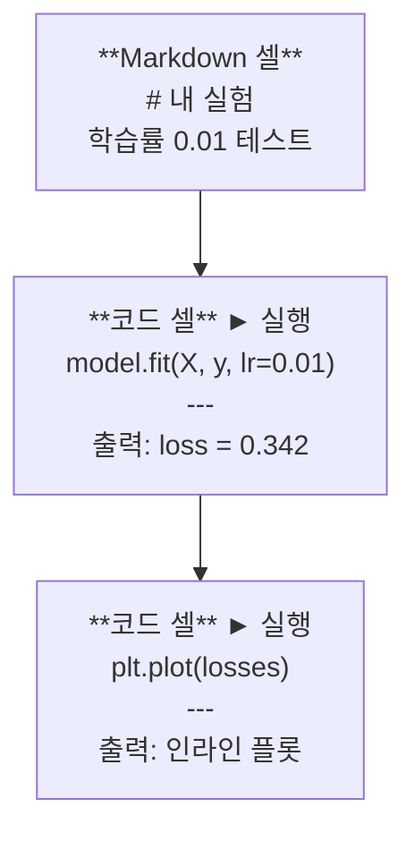
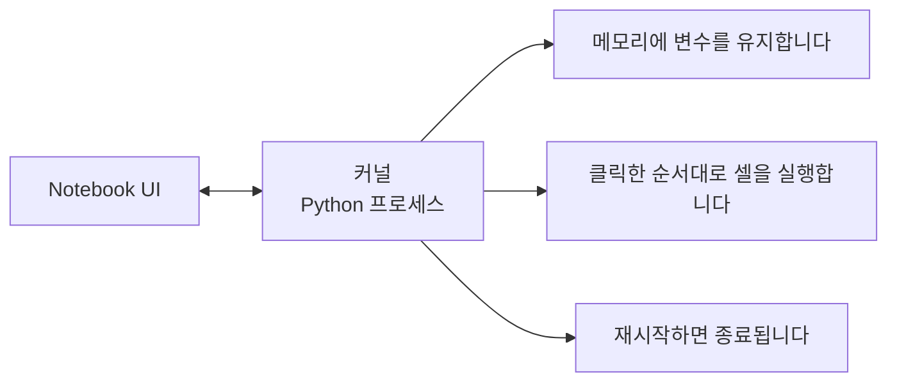

# Jupyter Notebook

> Notebook은 AI 엔지니어링의 실험대입니다. 여기서 프로토타입을 만들고, 잘 작동하는 것을 프로덕션으로 이동해 보세요.

**유형:** Build
**언어:** Python
**선수 요건:** 0단계, 01강
**시간:** 약 30분

## 학습 목표

- JupyterLab, Jupyter Notebook, 또는 Jupyter 확장 프로그램이 설치된 VS Code를 설치하고 실행해 보세요
- 매직 명령어(`%timeit`, `%%time`, `%matplotlib inline`)를 사용하여 벤치마크하고 인라인으로 시각화해 보세요
- Notebook과 스크립트를 사용하는 시점을 구분하고, "Notebook에서 탐색하고 스크립트로 출시하기" 워크플로우를 적용해 보세요
- 순서대로 실행되지 않는 실행, 숨겨진 상태, 메모리 누수 등 흔한 Notebook 함정을 식별하고 피하세요

## 문제점

모든 AI 논문, 튜토리얼, Kaggle 대회에서 Jupyter Notebook을 사용합니다. 코드를 조각으로 실행하고, 인라인으로 출력 결과를 보고, 코드와 설명을 혼합하며, 빠르게 반복할 수 있습니다. Notebook 없이 AI를 배우려 한다면, 계산 연습장 없이 수학 숙제를 하는 것과 같습니다.

하지만 Notebook에는 실제 함정이 있습니다. Notebook이 매우 잘하지 못하는 것까지 모든 것에 사용하는 사람들이 있습니다. Notebook을 사용할 때와 스크립트를 사용할 때를 아는 것은 나중에 디버깅 악몽을 피하는 데 도움이 됩니다.

## 개념

Notebook은 셀의 목록입니다. 각 셀은 코드 또는 텍스트입니다.



커널은 백그라운드에서 실행되는 Python 프로세스입니다. 셀을 실행하면 코드를 커널로 보내고, 커널이 이를 실행한 후 결과를 반환합니다. 모든 셀은 동일한 커널을 공유하므로 변수가 셀 간에 유지됩니다.



"클릭한 순서대로"라는 부분은 초능력이자 함정입니다.

```figure
s0-cell-order
```

## 구현하기

### 1단계: 인터페이스 선택

세 가지 옵션, 하나의 형식:

| 인터페이스 | 설치 | 최적 용도 |
|-----------|---------|----------|
| JupyterLab | `pip install jupyterlab` 후 `jupyter lab` | 완전한 IDE 경험, 다중 탭, 파일 브라우저, 터미널 |
| Jupyter Notebook | `pip install notebook` 후 `jupyter notebook` | 단순하고 경량, 한 번에 하나의 노트북 |
| VS Code | "Jupyter" 확장 프로그램 설치 | 이미 사용 중인 에디터, git 통합, 디버깅 |

세 가지 모두 동일한 `.ipynb` 파일을 읽고 씁니다. 마음에 드는 것을 선택해 보세요. AI 작업에서는 JupyterLab이 가장 흔합니다.

```bash
pip install jupyterlab
jupyter lab
```

### 2단계: 중요한 키보드 단축키

두 가지 모드에서 작업합니다. `Escape`를 눌러 명령 모드(왼쪽에 파란 바)로, `Enter`를 눌러 편집 모드(초록 바)로 전환해 보세요.

**명령 모드 (가장 많이 사용됨):**

| 키 | 동작 |
|-----|--------|
| `Shift+Enter` | 셀 실행, 다음 셀로 이동 |
| `A` | 위에 셀 삽입 |
| `B` | 아래에 셀 삽입 |
| `DD` | 셀 삭제 |
| `M` | 마크다운으로 변환 |
| `Y` | 코드로 변환 |
| `Z` | 셀 작업 실행 취소 |
| `Ctrl+Shift+H` | 모든 단축키 표시 |

**편집 모드:**

| 키 | 동작 |
|-----|--------|
| `Tab` | 자동 완성 |
| `Shift+Tab` | 함수 시그니처 표시 |
| `Ctrl+/` | 주석 토글 |

`Shift+Enter`는 하루에 천 번은 사용할 단축키입니다. 가장 먼저 익혀 보세요.

### 3단계: 셀 유형

**코드 셀**은 Python을 실행하고 출력 결과를 표시합니다:

```python
import numpy as np
data = np.random.randn(1000)
data.mean(), data.std()
```

출력: `(0.0032, 0.9987)`

**마크다운 셀**은 형식화된 텍스트를 렌더링합니다. 무엇을 하고 왜 하는지 문서화하는 데 사용해 보세요. 헤더, 굵게, 이탤릭, LaTeX 수식 (`$E = mc^2$`), 표 및 이미지를 지원합니다.

### 4단계: 매직 명령

이것은 Python이 아닙니다. `%` (라인 매직) 또는 `%%` (셀 매직)으로 시작하는 Jupyter 전용 명령입니다.

**코드 시간 측정:**

```python
%timeit np.random.randn(10000)
```

출력: `45.2 us +/- 1.3 us per loop`

```python
%%time
model.fit(X_train, y_train, epochs=10)
```

출력: `Wall time: 2.34 s`

`%timeit`는 코드를 여러 번 실행하고 평균을 계산합니다. `%%time`는 한 번만 실행합니다. 마이크로 벤치마크에는 `%timeit`를, 학습 실행에는 `%%time`를 사용해 보세요.

**인라인 플롯 활성화:**

```python
%matplotlib inline
```

이제 모든 `plt.plot()` 또는 `plt.show()`가 노트북에 직접 렌더링됩니다.

**노트북을 벗어나지 않고 패키지 설치하기:**

```python
!pip install scikit-learn
```

`!` 접두사를 사용하면 모든 셸 명령을 실행할 수 있습니다.

**환경 변수 확인하기:**

```python
%env CUDA_VISIBLE_DEVICES
```

### 5단계: 인라인으로 풍부한 출력 표시하기

노트북은 셀의 마지막 표현식을 자동으로 표시합니다. 하지만 이를 제어할 수도 있습니다:

```python
import pandas as pd

df = pd.DataFrame({
    "model": ["Linear", "Random Forest", "Neural Net"],
    "accuracy": [0.72, 0.89, 0.94],
    "training_time": [0.1, 2.3, 45.6]
})
df
```

이것은 텍스트 덤프가 아닌 형식화된 HTML 테이블을 렌더링합니다. 플롯도 동일합니다:

```python
import matplotlib.pyplot as plt

plt.figure(figsize=(8, 4))
plt.plot([1, 2, 3, 4], [1, 4, 2, 3])
plt.title("Inline Plot")
plt.show()
```

플롯이 셀 바로 아래에 나타납니다. 이것이 노트북이 AI 작업에서 지배적인 이유입니다. 데이터, 플롯, 코드를 함께 볼 수 있기 때문입니다.

이미지의 경우:

```python
from IPython.display import Image, display
display(Image(filename="architecture.png"))
```

### 6단계: Google Colab

Colab은 클라우드의 무료 Jupyter 노트북입니다. GPU, 사전 설치된 라이브러리, Google Drive 통합을 제공합니다. 설정이 필요 없습니다.

1. [colab.research.google.com](https://colab.research.google.com)로 이동하세요
2. 이 과정의 모든 `.ipynb` 파일을 업로드하세요
3. 실행 환경 > 실행 환경 유형 변경 > T4 GPU (무료)

Colab이 로컬 Jupyter와 다른 점:
- 파일은 세션 간에 유지되지 않습니다 (Drive에 저장하거나 다운로드하세요)
- 사전 설치됨: numpy, pandas, matplotlib, torch, tensorflow, sklearn
- 파일 업로드/다운로드를 위해 `from google.colab import files`를 사용하세요
- 영구 저장을 위해 `from google.colab import drive; drive.mount('/content/drive')`를 사용하세요
- 90분간 활동이 없으면 세션이 만료됩니다 (무료 티어)

## 사용하기

### 노트북 vs 스크립트: 언제 무엇을 사용해야 하는가

| 노트북을 사용하는 경우 | 스크립트를 사용하는 경우 |
|-------------------|-----------------|
| 데이터셋 탐색 | 학습 파이프라인 |
| 모델 프로토타이핑 | 재사용 가능한 유틸리티 |
| 결과 시각화 | `if __name__`가 포함된 모든 것 |
| 작업 설명 | 스케줄에 따라 실행되는 코드 |
| 빠른 실험 | 프로덕션 코드 |
| 과정 연습 문제 | 패키지 및 라이브러리 |

규칙: **노트북에서 탐색하고, 스크립트로 출시하기**입니다.

AI에서 흔한 워크플로우입니다:
1. 노트북에서 데이터를 탐색합니다
2. 노트북에서 모델을 프로토타입합니다
3. 동작하면 코드를 `.py` 파일로 이동합니다
4. 추가 실험을 위해 해당 `.py` 파일을 노트북으로 다시 가져옵니다

### 흔한 함정

**순서 없는 실행.** 셀 5, 셀 2, 셀 7 순으로 실행합니다. 노트북은 내 머신에서 작동하지만, 누군가 위에서 아래로 실행하면 깨집니다. 해결 방법: 공유하기 전에 Kernel > Restart & Run All을 실행합니다.

**숨겨진 상태.** 셀을 삭제했지만 그 셀이 만든 변수는 여전히 메모리에 남아 있습니다. 노트북은 깔끔해 보이지만 고스트 셀에 의존합니다. 해결 방법: 커널을 정기적으로 재시작합니다.

**메모리 누수.** 4GB 데이터셋을 로드하고, 모델을 학습하고, 다른 데이터셋을 로드합니다. 아무것도 해제되지 않습니다. 해결 방법: `del variable_name` 및 `gc.collect()`을 사용하거나, 커널을 재시작합니다.

## 출시하기

이 강의는 다음을 생성합니다:
- 노트북 문제를 디버깅하기 위한 `outputs/prompt-notebook-helper.md`

## 연습 문제

1. JupyterLab을 열고 노트북을 만든 후, `%timeit`를 사용하여 100,000개의 랜덤 숫자 배열을 생성할 때 리스트 컴프리헨션과 numpy를 비교해 보세요
2. CSV를 로드하고, 데이터프레임을 표시하며, 차트를 플롯하는 마크다운 및 코드 셀이 포함된 노트북을 만드세요. 그런 다음 Kernel > Restart & Run All을 실행하여 위에서 아래로 작동하는지 확인하세요
3. `code/notebook_tips.py`의 코드를 가져와 Colab 노트북에 붙여넣고, 무료 GPU로 실행해 보세요

## 핵심 용어

| 용어 | 사람들이 말하는 것 | 실제 의미 |
|------|----------------|----------------------|
| 커널 | "내 코드를 실행하는 것" | 셀을 실행하고 변수를 메모리에 유지하는 독립적인 Python 프로세스 |
| 셀 | "코드 블록" | 노트북 내에서 독립적으로 실행 가능한 단위로, 코드 또는 마크다운 |
| 매직 명령 | "Jupyter 트릭" | `%` 또는 `%%`이 접두어로 붙어 노트북 환경을 제어하는 특수 명령 |
| `.ipynb` | "노트북 파일" | 셀, 출력 및 메타데이터를 포함하는 JSON 파일. IPython Notebook의 약자 |

## 추가 읽기

- 전체 기능 세트에 대한 [JupyterLab Docs](https://jupyterlab.readthedocs.io/)
- [Google Colab FAQ](https://research.google.com/colaboratory/faq.html)에서 Colab 전용 제한 및 기능을 확인해 보세요
- [28 Jupyter Notebook Tips](https://www.dataquest.io/blog/jupyter-notebook-tips-tricks-shortcuts/)에서 파워 유저 단축키를 확인해 보세요
