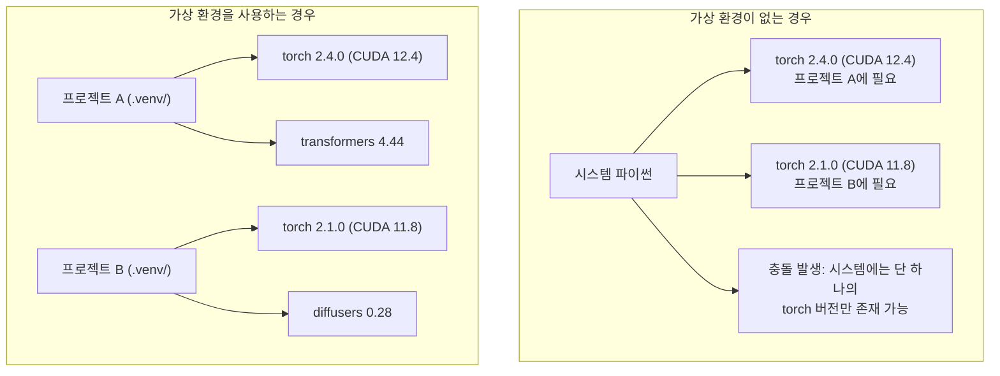

# 파이썬 가상 환경 (Python Environments)

> 의존성 지옥은 현실입니다. 가상 환경이 유일한 치료제입니다.

**Type:** Build
**Languages:** Shell
**Prerequisites:** Phase 0, Lesson 01
**Time:** ~30 minutes

## 학습 목표 (Learning Objectives)

- `uv`, `venv`, 또는 `conda`를 사용해 격리된 가상 환경을 구축합니다.
- 선택적 의존성 그룹이 포함된 `pyproject.toml`을 작성하고 재현성을 위한 락파일(lockfile)을 생성합니다.
- 전역 설치, pip와 conda 혼용, CUDA 버전 불일치 등 자주 발생하는 문제를 진단하고 해결합니다.
- 의존성 충돌이 발생하는 프로젝트를 위해 단계별(per-phase) 환경 분리 전략을 수립합니다.

## 문제 상황 (The Problem)

어떤 미세 조정(fine-tuning) 프로젝트를 위해 PyTorch 2.4를 설치했다고 가정해 봅시다. 다음 주에 시작할 다른 프로젝트는 CUDA 빌드 호환성 때문에 반드시 PyTorch 2.1이 필요합니다. 시스템 전역(global)에서 버전을 업그레이드하면 첫 번째 프로젝트가 깨지고, 다운그레이드하면 두 번째 프로젝트가 동작하지 않습니다.

이것이 바로 의존성 지옥(Dependency Hell)입니다. AI/ML 분야에서는 다음과 같은 이유로 이 문제가 일상적으로 발생합니다:

- PyTorch, JAX, TensorFlow가 각기 다른 자체 CUDA 바인딩을 제공합니다.
- 모델 라이브러리마다 프레임워크 버전을 특정 버전으로 고정(pinning)합니다.
- 전역 `pip install`은 기존에 설치된 패키지를 경고 없이 덮어씁니다.
- CUDA 11.8 빌드는 CUDA 12.x 드라이버와 호환되지 않을 수 있습니다.

해결책은 명확합니다. 모든 프로젝트가 고유한 패키지를 갖는 **독립된 가상 환경**을 사용하는 것입니다.

## 핵심 개념 (The Concept)



```figure
s0-env-isolation
```

## 구현하기 (Build It)

### 옵션 1: uv venv (권장)

`uv`는 가장 빠른 파이썬 패키지 관리자입니다(pip 대비 10~100배 속도). 가상 환경 생성, 파이썬 버전 관리, 의존성 해결을 단 하나의 도구로 처리합니다.

```bash
curl -LsSf https://astral.sh/uv/install.sh | sh

uv python install 3.12

cd your-project
uv venv
source .venv/bin/activate
```

패키지 설치:

```bash
uv pip install torch numpy
```

단 한 번의 명령어로 `pyproject.toml` 기반 프로젝트 생성:

```bash
uv init my-ai-project
cd my-ai-project
uv add torch numpy matplotlib
```

### 옵션 2: venv (파이썬 내장 도구)

`uv`를 설치할 수 없는 환경이라면 파이썬 기본 내장 모듈인 `venv`를 사용할 수 있습니다:

```bash
python3 -m venv .venv
source .venv/bin/activate  # Linux/macOS
.venv\Scripts\activate     # Windows

pip install torch numpy
```

`uv`보다는 느리지만 파이썬이 설치된 곳이라면 어디서나 동작합니다.

### 옵션 3: conda (시스템 라이브러리 격리가 필요할 때)

Conda는 파이썬 패키지뿐만 아니라 CUDA 툴킷, cuDNN, C/C++ 라이브러리 등 비(非)파이썬 의존성까지 관리해 줍니다. 다음과 같은 경우에 적합합니다:

- 시스템 전체를 건드리지 않고 특정 버전의 CUDA 툴킷이 필요할 때
- 시스템 패키지 설치 권한이 없는 공유 서버/클러스터를 사용할 때
- 특정 라이브러리의 설치 안내 문서가 conda 사용을 명시할 때

```bash
# miniconda 설치
curl -LsSf https://repo.anaconda.com/miniconda/Miniconda3-latest-Linux-x86_64.sh -o miniconda.sh
bash miniconda.sh -b

conda create -n myproject python=3.12
conda activate myproject

conda install pytorch torchvision torchaudio pytorch-cuda=12.4 -c pytorch -c nvidia
```

한 가지 중요한 규칙: 어떤 가상 환경에 conda를 쓰기 시작했다면 해당 환경 내 모든 패키지는 가급적 conda로만 설치하세요. conda 환경에 `pip install`을 무분별하게 섞어 쓰면 디버깅하기 매우 까다로운 의존성 꼬임이 발생합니다.

### 본 코스를 위한 전략: 단계별(Per-Phase) 가상 환경

전체 코스를 위해 단 하나의 거대한 가상 환경을 만드는 것은 권장하지 않습니다. 단계마다 요구되는 의존성이 서로 충돌할 수 있기 때문입니다.

권장 디렉터리 구성:

```
ai-engineering-from-scratch/
├── .venv/                    <-- Phase 0-3을 위한 가벼운 기본 공통 환경
├── phases/
│   ├── 04-neural-networks/
│   │   └── .venv/            <-- PyTorch 중심 환경
│   ├── 05-cnns/
│   │   └── .venv/            <-- 동일한 PyTorch 환경 공유
│   ├── 08-transformers/
│   │   └── .venv/            <-- 다른 버전의 transformers 라이브러리가 필요할 때
│   └── 11-llm-apis/
│       └── .venv/            <-- PyTorch 없이 경량 API SDK 위주 환경
```

`code/env_setup.sh` 스크립트를 실행하면 본 코스를 위한 기본 가상 환경이 자동으로 구성됩니다.

## pyproject.toml 기초

모든 현대적인 파이썬 프로젝트는 `pyproject.toml`을 가져야 합니다. 기존의 `setup.py`, `setup.cfg`, `requirements.txt`를 단일 파일로 대체합니다.

```toml
[project]
name = "ai-engineering-from-scratch"
version = "0.1.0"
requires-python = ">=3.11"
dependencies = [
    "numpy>=1.26",
    "matplotlib>=3.8",
    "jupyter>=1.0",
    "scikit-learn>=1.4",
]

[project.optional-dependencies]
torch = ["torch>=2.3", "torchvision>=0.18"]
llm = ["anthropic>=0.39", "openai>=1.50"]
```

원하는 조합으로 설치:

```bash
uv pip install -e ".[torch]"    # 기본 패키지 + PyTorch
uv pip install -e ".[llm]"      # 기본 패키지 + LLM SDK
uv pip install -e ".[torch,llm]" # 전체 설치
```

## 락파일 (Lockfiles)

락파일은 간접 의존성(transitive dependencies)을 포함한 모든 패키지의 버전을 정확한 고정값으로 기록합니다. 이를 통해 재현성을 보장하며, 팀원 누구나 동일한 환경을 완벽히 재현할 수 있습니다.

```bash
# uv add 사용 시 uv.lock 파일이 자동 생성됨
uv add numpy

# pip-tools 방식
uv pip compile pyproject.toml -o requirements.lock
uv pip install -r requirements.lock
```

락파일은 반드시 Git에 커밋해야 합니다.

## 자주 하는 실수와 주의점

### 1. 전역(Global)에 설치하는 실수

```bash
pip install torch  # 나쁨: 시스템 기본 파이썬에 설치됨

source .venv/bin/activate
pip install torch  # 좋음: 격리된 가상 환경에 설치됨
```

어떤 파이썬 경로를 사용하는지 확인하세요:

```bash
which python       # /usr/bin/python이 아니라 .venv/bin/python이어야 함
which pip          # .venv/bin/pip이어야 함
```

### 2. pip와 conda 무분별한 혼용

```bash
conda create -n myenv python=3.12
conda activate myenv
conda install pytorch -c pytorch
pip install some-other-package   # 나쁨: conda의 의존성 추적 그래프가 깨질 수 있음
conda install some-other-package # 좋음: 가급적 conda로 일관되게 관리
```

conda에 없는 패키지라서 어쩔 수 없이 pip를 써야 한다면, conda 패키지를 모두 설치한 후 맨 마지막에 pip 패키지를 설치하세요.

### 3. 활성화(activate)를 잊는 실수

```bash
python train.py           # 시스템 파이썬이 실행되어 모듈 not found 에러 발생
source .venv/bin/activate
python train.py           # 가상 환경 파이썬이 실행되어 정상 동작
```

터미널 프롬프트 앞에 환경 이름이 붙어 있는지 확인하세요:

```
(.venv) $ python train.py
```

### 4. .venv 디렉터리를 Git에 커밋하는 실수

```bash
echo ".venv/" >> .gitignore
```

가상 환경 폴더는 수백 MB에서 수 GB에 달하며 다른 OS나 머신 간에 호환되지 않습니다. 가상 환경 폴더 대신 `pyproject.toml`과 락파일을 커밋하세요.

### 5. CUDA 버전 불일치

```bash
nvidia-smi                # 그래픽 드라이버가 지원하는 CUDA 버전 (예: 12.4)
python -c "import torch; print(torch.version.cuda)"  # PyTorch가 빌드된 CUDA 버전

# 이 둘은 반드시 호환되어야 합니다.
# PyTorch의 CUDA 버전 <= 드라이버가 지원하는 CUDA 버전이어야 합니다.
```

## 실무 활용 (Use It)

환경 구성 스크립트를 실행하여 코스 기본 환경을 설정합니다:

```bash
bash phases/00-setup-and-tooling/06-python-environments/code/env_setup.sh
```

저장소 루트에 `.venv`가 생성되고 핵심 라이브러리 설치와 정상 동작 여부가 검증됩니다.

## 실습 과제 (Exercises)

1. `env_setup.sh`를 실행하고 모든 점검 항목이 통과하는지 확인하세요.
2. 두 번째 가상 환경을 만들고 다른 버전의 NumPy를 설치한 뒤 두 환경이 완벽히 격리되어 있는지 비교해 보세요.
3. PyTorch와 Anthropic SDK를 동시에 필요로 하는 프로젝트용 `pyproject.toml`을 작성해 보세요.
4. 가상 환경을 활성화하지 않은 상태에서 고의로 패키지를 전역 설치해 보고, 파일이 어디에 위치하는지 확인한 뒤 삭제해 보세요.

## 핵심 용어 정리 (Key Terms)

| 용어 | 흔히 하는 표현 | 실제 의미 |
|------|----------------|----------------------|
| 가상 환경 (Virtual env) | "venv" | 시스템 파이썬과 격리되어 자체 인터프리터와 패키지를 가지는 전용 디렉터리 |
| 락파일 (Lockfile) | "고정된 의존성" | 모든 패키지와 정확한 하위 버전을 명시하여 다른 머신에서도 동일한 설치를 보장하는 파일 |
| pyproject.toml | "새로운 setup.py" | setup.py, setup.cfg, requirements.txt를 일원화한 파이썬 공식 표준 설정 파일 |
| 간접 의존성 (Transitive dependency) | "의존성의 의존성" | 패키지 B가 C를 필요로 할 때, B를 의존하는 A를 설치하면 C도 함께 설치되는 관계 |
| CUDA 버전 불일치 | "GPU 인식 오류" | PyTorch 빌드 시 사용된 CUDA 버전과 호스트의 GPU 드라이버 버전이 맞지 않는 상태 |
