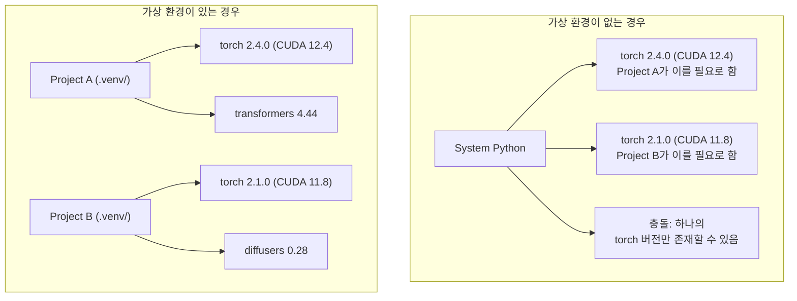

# Python 환경

> 의존 지옥은 실재합니다. 가상 환경이 그 해답입니다.

**유형:** Build
**언어:** Shell
**선수 요건:** 0단계, 01강
**시간:** 약 30분

## 학습 목표

- `uv`, `venv`, 또는 `conda`를 사용하여 격리된 가상 환경을 생성해 보세요
- 선택적 의존성 그룹을 포함하는 `pyproject.toml`를 작성하고 재현성을 위해 잠금 파일(lockfile)을 생성해 보세요
- 일반적인 함정(전역 설치, pip/conda 혼합, CUDA 버전 불일치)을 진단하고 수정해 보세요
- 의존성이 충돌하는 프로젝트를 위해 단계별 환경 전략을 구현해 보세요

## 문제점

미세 조정 프로젝트용 PyTorch 2.4를 설치했습니다. 다음 주, 다른 프로젝트는 CUDA 빌드가 고정되어 있어 PyTorch 2.1이 필요합니다. 전역적으로 업그레이드하면 첫 번째 프로젝트가 깨집니다. 다운그레이드하면 두 번째 프로젝트가 깨집니다.

이것이 의존 지옥입니다. AI/ML 작업에서 이는 다음과 같은 이유로 자주 발생합니다:

- PyTorch, JAX, TensorFlow는 각각 자체 CUDA 바인딩을 제공합니다
- 모델 라이브러리는 특정 프레임워크 버전을 고정합니다
- 전역 `pip install`는 이전에 있던 모든 것을 덮어씁니다
- CUDA 11.8 빌드는 CUDA 12.x 드라이버와 작동하지 않습니다 (그 반대도 마찬가지입니다)

해결책: 모든 프로젝트는 자체 패키지를 가진 자체 격리된 환경을 갖습니다.

## 개념



```figure
s0-env-isolation
```

## 구현하기

### 옵션 1: uv venv (권장)

`uv`는 가장 빠른 Python 패키지 관리자입니다 (pip보다 10-100배 빠름). 가상 환경, Python 버전, 의존성 해결을 하나의 도구로 처리합니다.

```bash
curl -LsSf https://astral.sh/uv/install.sh | sh

uv python install 3.12

cd your-project
uv venv
source .venv/bin/activate
```

패키지 설치:

```bash
uv pip install torch numpy
```

`pyproject.toml`를 사용하여 한 단계로 프로젝트를 생성합니다:

```bash
uv init my-ai-project
cd my-ai-project
uv add torch numpy matplotlib
```

### 옵션 2: venv (기본 내장)

`uv`를 설치할 수 없는 경우, Python은 `venv`을 기본으로 제공합니다:

```bash
python3 -m venv .venv
source .venv/bin/activate  # Linux/macOS
.venv\Scripts\activate     # Windows

pip install torch numpy
```

`uv`보다 느리지만, Python이 설치된 모든 환경에서 작동합니다.

### 옵션 3: conda (필요한 경우)

Conda는 CUDA 툴킷, cuDNN, C 라이브러리 등 Python이 아닌 의존성을 관리합니다. 다음 상황에서 사용하세요:

- 시스템 전체에 설치하지 않고 특정 CUDA 툴킷 버전이 필요한 경우
- 시스템 패키지를 설치할 수 없는 공유 클러스터를 사용하는 경우
- 라이브러리의 설치 지침이 "conda를 사용하라"고 명시하는 경우

```bash
# miniconda 설치 (전체 Anaconda가 아님)
curl -LsSf https://repo.anaconda.com/miniconda/Miniconda3-latest-Linux-x86_64.sh -o miniconda.sh
bash miniconda.sh -b

conda create -n myproject python=3.12
conda activate myproject

conda install pytorch torchvision torchaudio pytorch-cuda=12.4 -c pytorch -c nvidia
```

규칙 하나: conda를 환경에 사용한다면, 해당 환경의 모든 패키지도 conda로 관리하세요. conda 환경에 `pip install`를 섞으면 디버깅하기 어려운 의존성 충돌이 발생합니다.

### 이 과정에 대한 전략: 단계별 환경

과정 전체를 위해 하나의 환경을 만들 수 있습니다. 그렇게 하지 마세요. 각 단계는 서로 다른 (때로는 충돌하는) 의존성을 필요로 합니다.

전략:

```
ai-engineering-from-scratch/
├── .venv/                    <-- shared lightweight env for phases 0-3
├── phases/
│   ├── 04-neural-networks/
│   │   └── .venv/            <-- PyTorch env
│   ├── 05-cnns/
│   │   └── .venv/            <-- same PyTorch env (symlink or shared)
│   ├── 08-transformers/
│   │   └── .venv/            <-- might need different transformer versions
│   └── 11-llm-apis/
│       └── .venv/            <-- API SDKs, no torch needed
```

`code/env_setup.sh`의 스크립트가 이 과정의 기본 환경을 생성합니다.

## pyproject.toml 기초

모든 Python 프로젝트는 `pyproject.toml`를 가져야 합니다. 이 파일 하나로 `setup.py`, `setup.cfg`, `requirements.txt`를 대체합니다.

```toml
[project]
name = "ai-engineering-from-scratch"
version = "0.1.0"
requires-python = ">=3.11"
dependencies = [
    "numpy>=1.26",
    "matplotlib>=3.8",
    "jupyter>=1.0",
    "scikit-learn>=1.4",
]

[project.optional-dependencies]
torch = ["torch>=2.3", "torchvision>=0.18"]
llm = ["anthropic>=0.39", "openai>=1.50"]
```

그 후 설치합니다:

```bash
uv pip install -e ".[torch]"    # base + PyTorch
uv pip install -e ".[llm]"     # base + LLM SDK
uv pip install -e ".[torch,llm]" # 전체
```

## 락파일(Lockfiles)

락파일은 모든 의존성 (전달적 의존성 포함)을 정확한 버전으로 고정합니다. 이는 재현성을 보장합니다: 락파일에서 설치하는 사람은 누구나 정확히 동일한 패키지를 얻습니다.

```bash
# uv는 uv add를 사용할 때 uv.lock을 자동으로 생성합니다
uv add numpy

# pip-tools 방식
uv pip compile pyproject.toml -o requirements.lock
uv pip install -r requirements.lock
```

잠금 파일을 git에 커밋하세요. 누군가 저장소를 클론하면 잠금 파일에서 설치하여 동일한 버전을 얻게 됩니다.

## 자주 발생하는 실수

### 1. 전역 설치

```bash
pip install torch  # 나쁜 예: 시스템 Python에 설치됩니다

source .venv/bin/activate
pip install torch  # 좋은 예: 가상 환경에 설치됩니다
```

패키지가 어디에 설치되는지 확인하세요:

```bash
which python       # .venv/bin/python가 표시되어야 하며, /usr/bin/python이 아니어야 합니다
which pip           # .venv/bin/pip가 표시되어야 합니다
```

### 2. pip와 conda를 혼합하여 사용

```bash
conda create -n myenv python=3.12
conda activate myenv
conda install pytorch -c pytorch
pip install some-other-package   # 나쁜 예: conda의 의존성 추적 기능을 망가뜨릴 수 있습니다
conda install some-other-package # 좋은 예: 모든 것을 conda가 관리하도록 하세요
```

conda 내에서 pip를 사용해야 한다면 (일부 패키지는 pip 전용입니다), 모든 conda 패키지를 먼저 설치한 후 pip 패키지를 마지막에 설치하세요.

### 3. 활성화하는 것을 잊어버림

```bash
python train.py           # 시스템 Python을 사용하며, 패키지가 누락됩니다
source .venv/bin/activate
python train.py           # 프로젝트 Python을 사용하며, 패키지를 찾을 수 있습니다
```

셸 프롬프트에 환경 이름이 표시되어야 합니다:

```
(.venv) $ python train.py
```

### 4. .venv를 git에 커밋

```bash
echo ".venv/" >> .gitignore
```

가상 환경은 200MB~2GB 크기입니다. 이는 로컬 전용이며 기계 간에 이식할 수 없습니다. `pyproject.toml`과 잠금 파일을 대신 커밋하세요.

### 5. CUDA 버전 불일치

```bash
nvidia-smi                # 드라이버 CUDA 버전(예: 12.4)을 표시합니다
python -c "import torch; print(torch.version.cuda)"  # PyTorch CUDA 버전을 표시합니다

# 이 두 버전은 호환되어야 합니다.
# PyTorch CUDA 버전은 드라이버 CUDA 버전보다 같거나 낮아야 합니다.
```

## 사용하기

코스 환경 생성을 위해 설정 스크립트를 실행하세요:

```bash
bash phases/00-setup-and-tooling/06-python-environments/code/env_setup.sh
```

이 스크립트는 저장소 루트에 `.venv`을 생성하며, 핵심 의존성이 설치되고 검증됩니다.

## 연습 문제

1. `env_setup.sh`을 실행하여 모든 검사가 통과하는지 확인하세요
2. 두 번째 가상 환경을 생성하고, numpy의 다른 버전을 설치한 후 두 환경이 격리되어 있음을 확인하세요
3. PyTorch와 Anthropic SDK가 모두 필요한 프로젝트에 대한 `pyproject.toml`을 작성하세요
4. 의도적으로 패키지를 전역에 설치(venv를 활성화하지 않은 상태)하여 어디에 설치되는지 확인한 후, 이를 제거하세요

## 핵심 용어

| 용어 | 사람들이 말하는 표현 | 실제 의미 |
|------|----------------|----------------------|
| 가상 환경 | "venv" | 시스템 Python과 분리된, Python 인터프리터와 패키지를 포함하는 격리된 디렉토리 |
| 잠금 파일 | "고정된 의존성" | 모든 패키지와 그 정확한 버전을 나열하여, 여러 머신에서 동일한 설치를 보장하는 파일 |
| pyproject.toml | "새로운 setup.py" | setup.py/setup.cfg/requirements.txt를 대체하는 표준 Python 프로젝트 구성 파일 |
| 전달 의존성 | "의존성의 의존성" | 패키지 B가 C에 의존하며, B에 의존하는 A를 설치하면 C는 A의 전달 의존성이 됩니다 |
| CUDA 불일치 | "GPU가 작동하지 않음" | PyTorch가 GPU 드라이버가 지원하는 CUDA 버전과 다른 CUDA 버전으로 컴파일됨 |
