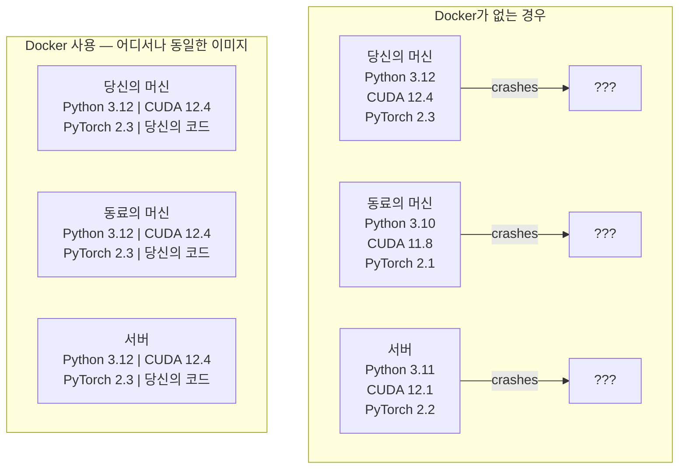

# AI를 위한 Docker

> 컨테이너는 "내 머신에서는 잘 돌아가는데"라는 문제를 과거의 일로 만듭니다.

**유형:** Build
**언어:** Docker
**선수 요건:** 0단계, 01강 및 03강
**시간:** 약 60분

## 학습 목표

- Dockerfile을 사용하여 CUDA, PyTorch 및 AI 라이브러리를 포함하는 GPU 지원 Docker 이미지를 빌드해 보세요
- 호스트 디렉터리를 볼륨으로 마운트하여 컨테이너 재빌드 시 모델, 데이터셋 및 코드를 유지해 보세요
- NVIDIA Container Toolkit을 설정하여 컨테이너 내부에서 GPU를 노출해 보세요
- Docker Compose를 사용하여 다중 서비스 AI 애플리케이션(추론 서버 + 벡터 데이터베이스)을 오케스트레이션(Orchestration)해 보세요

## 문제점

당신은 노트북에서 PyTorch 2.3, CUDA 12.4, Python 3.12를 사용하여 모델을 학습했습니다. 동료는 PyTorch 2.1, CUDA 11.8, Python 3.10을 사용합니다. 당신의 모델은 동료의 머신에서 충돌합니다. 당신의 Dockerfile은 두 머신 모두에서 작동합니다.

AI 프로젝트는 의존성 악몽입니다. 일반적인 스택에는 Python, PyTorch, CUDA 드라이버, cuDNN, 시스템 수준의 C 라이브러리 및 flash-attn과 같이 정확한 컴파일러 버전이 필요한 특수 패키지가 포함됩니다. Docker는 이 모든 것을 단일 이미지로 패키징하여 어디서나 동일하게 실행됩니다.

## 개념

Docker는 코드, 런타임, 라이브러리 및 시스템 도구를 컨테이너라는 격리된 단위로 감쌉니다. 이를 경량 가상 머신이라고 생각할 수 있지만, 자체 커널을 실행하는 대신 호스트 OS 커널을 공유하므로 몇 분 대신 몇 초 만에 시작됩니다.



### 대부분의 프로젝트보다 AI 프로젝트가 Docker를 더 필요로 하는 이유

1. **GPU 드라이버는 취약합니다.** CUDA 12.4 코드는 CUDA 11.8에서 실행되지 않습니다. Docker는 NVIDIA Container Toolkit을 통해 호스트 GPU 드라이버를 공유하면서 CUDA 툴킷을 컨테이너 내부에 격리합니다.

2. **모델 가중치는 큽니다.** 7B 파라미터 모델은 fp16에서 14 GB입니다. 재빌드할 때마다 다시 다운로드하는 것은 원하지 않습니다. Docker 볼륨을 사용하면 호스트의 models 디렉터리를 마운트할 수 있습니다.

3. **다중 서비스 아키텍처가 일반적입니다.** 실제 AI 애플리케이션은 단순한 Python 스크립트가 아닙니다. 추론 서버, RAG용 벡터 데이터베이스, 웹 프론트엔드 등이 포함됩니다. Docker Compose는 이 모든 것을 한 명령으로 오케스트레이션합니다.

### 핵심 용어

| 용어 | 의미 |
|------|---------------|
| 이미지 | 읽기 전용 템플릿입니다. 레시피에 해당합니다. Dockerfile로 빌드됩니다. |
| 컨테이너 | 이미지의 실행 인스턴스입니다. 주방에 해당합니다. |
| Dockerfile | 이미지를 빌드하기 위한 지침입니다. 레이어별로 구성됩니다. |
| 볼륨 | 컨테이너 재시작 후에도 유지되는 영구 저장소입니다. |
| docker-compose | YAML로 다중 컨테이너 애플리케이션을 정의하는 도구입니다. |

### AI에서의 일반적인 컨테이너 패턴

```
Dev Container
  Full toolkit. Editor support. Jupyter. Debugging tools.
  Used during development and experimentation.

Training Container
  Minimal. Just the training script and dependencies.
  Runs on GPU clusters. No editor, no Jupyter.

Inference Container
  Optimized for serving. Small image. Fast cold start.
  Runs behind a load balancer in production.
```

```figure
s0-image-layers
```

## 구현하기

### 1단계: Docker 설치

```bash
# macOS
brew install --cask docker
open /Applications/Docker.app

# Ubuntu
curl -fsSL https://get.docker.com | sh
sudo usermod -aG docker $USER
# 그룹 변경이 적용되도록 로그아웃 후 다시 로그인하세요
```

검증:

```bash
docker --version
docker run hello-world
```

### 2단계: NVIDIA Container Toolkit 설치 (NVIDIA GPU가 있는 Linux)

이 도구를 사용하면 Docker 컨테이너가 GPU에 접근할 수 있습니다. macOS 및 Windows (WSL2) 사용자는 이 단계를 건너뛰어도 됩니다. Docker Desktop은 해당 플랫폼에서 GPU 패스스루를 다르게 처리합니다.

```bash
distribution=$(. /etc/os-release;echo $ID$VERSION_ID)
curl -fsSL https://nvidia.github.io/libnvidia-container/gpgkey | sudo gpg --dearmor -o /usr/share/keyrings/nvidia-container-toolkit-keyring.gpg
curl -s -L https://nvidia.github.io/libnvidia-container/$distribution/libnvidia-container.list | \
    sed 's#deb https://#deb [signed-by=/usr/share/keyrings/nvidia-container-toolkit-keyring.gpg] https://#g' | \
    sudo tee /etc/apt/sources.list.d/nvidia-container-toolkit.list

sudo apt-get update
sudo apt-get install -y nvidia-container-toolkit
sudo nvidia-ctk runtime configure --runtime=docker
sudo systemctl restart docker
```

컨테이너 내부에서 GPU 접근을 테스트하세요:

```bash
docker run --rm --gpus all nvidia/cuda:12.4.1-base-ubuntu22.04 nvidia-smi
```

GPU 정보를 확인하면 툴킷이 정상적으로 작동하고 있습니다.

### 3단계: 기본 이미지 이해하기

적절한 기본 이미지를 선택하면 디버깅 시간을 몇 시간 절약할 수 있습니다.

```
nvidia/cuda:12.4.1-devel-ubuntu22.04
  Full CUDA toolkit. Compilers included.
  Use for: building packages that need nvcc (flash-attn, bitsandbytes)
  Size: ~4 GB

nvidia/cuda:12.4.1-runtime-ubuntu22.04
  CUDA runtime only. No compilers.
  Use for: running pre-built code
  Size: ~1.5 GB

pytorch/pytorch:2.6.0-cuda12.4-cudnn9-runtime
  PyTorch pre-installed on top of CUDA.
  Use for: skipping the PyTorch install step
  Size: ~6 GB

python:3.12-slim
  No CUDA. CPU only.
  Use for: inference on CPU, lightweight tools
  Size: ~150 MB
```

### 4단계: AI 개발용 Dockerfile 작성

Dockerfile은 `code/Dockerfile`에 있습니다. 이를 단계별로 살펴보세요:

```dockerfile
FROM --platform=linux/amd64 nvidia/cuda:12.4.1-devel-ubuntu22.04

ENV DEBIAN_FRONTEND=noninteractive
ENV PYTHONUNBUFFERED=1

RUN apt-get update && apt-get install -y --no-install-recommends \
    software-properties-common \
    git \
    curl \
    build-essential \
    && add-apt-repository -y ppa:deadsnakes/ppa \
    && apt-get update && apt-get install -y --no-install-recommends \
    python3.12 \
    python3.12-venv \
    python3.12-dev \
    && rm -rf /var/lib/apt/lists/*

RUN update-alternatives --install /usr/bin/python python /usr/bin/python3.12 1

RUN curl -sSL https://raw.githubusercontent.com/pypa/get-pip/3b73145063be545b649ad9ca83ea8da5fc915a4f/public/get-pip.py -o /tmp/get-pip.py \
    && echo "a341e1a43e38001c551a1508a73ff23636a11970b61d901d9a1cad2a18f57055  /tmp/get-pip.py" | sha256sum -c - \
    && python /tmp/get-pip.py \
    && rm /tmp/get-pip.py \
    && update-alternatives --install /usr/bin/pip pip /usr/local/bin/pip3.12 1

RUN python -m pip install --no-cache-dir --upgrade pip setuptools wheel

RUN python -m pip install --no-cache-dir \
    torch==2.6.0+cu124 \
    torchvision==0.21.0+cu124 \
    torchaudio==2.6.0+cu124 \
    --index-url https://download.pytorch.org/whl/cu124

RUN python -m pip install --no-cache-dir \
    numpy \
    pandas \
    scikit-learn \
    matplotlib \
    jupyter \
    transformers \
    datasets \
    accelerate \
    safetensors

WORKDIR /workspace

VOLUME ["/workspace", "/models"]

EXPOSE 8888

CMD ["python"]
```

빌드하세요:

```bash
docker build -t ai-dev -f phases/00-setup-and-tooling/07-docker-for-ai/code/Dockerfile .
```

첫 빌드에는 시간이 오래 걸립니다 (CUDA 기본 이미지 + PyTorch 다운로드). 이후 빌드에서는 캐시된 레이어를 사용합니다.

**macOS / Apple Silicon (M1/M2/M3/M4):** `FROM` 줄의 `--platform=linux/amd64`이 Mac에서 이 빌드가 성공하도록 만드는 요소입니다. CUDA 기본 이미지에는 arm64 변형도 포함되어 있으며, Apple Silicon에서는 Docker Desktop이 이를 자동으로 선택합니다. 하지만 PyTorch는 `cu124` 휠을 x86_64 전용으로만 공개하므로, `pip install torch==2.6.0+cu124` 레이어는 `No matching distribution found for torch==2.6.0+cu124` 오류로 실패합니다. 플랫폼을 고정하면 x86_64 이미지를 가져와 에뮬레이션으로 실행합니다: 빌드 속도가 느려지고 컨테이너에 GPU가 없습니다 (Mac에서는 어차피 CUDA가 없습니다). Mac에서는 아래 `docker run` 명령에서 `--gpus all`을 제거하세요. Apple Silicon에서 GPU 작업을 하려면, 01강의 MPS 빌드를 사용하여 강의를 네이티브로 실행하고, 이 이미지는 NVIDIA GPU가 있는 x86_64 Linux 호스트용으로 유지하세요.

실행하세요:

```bash
docker run --rm -it --gpus all \
    -v $(pwd):/workspace \
    -v ~/models:/models \
    ai-dev python -c "import torch; print(f'PyTorch {torch.__version__}, CUDA: {torch.cuda.is_available()}')"
```

컨테이너 내부에서 Jupyter를 실행하세요:

```bash
docker run --rm -it --gpus all \
    -v $(pwd):/workspace \
    -v ~/models:/models \
    -p 8888:8888 \
    ai-dev jupyter notebook --ip=0.0.0.0 --port=8888 --no-browser --allow-root
```

### 5단계: 데이터 및 모델을 위한 볼륨 마운트

AI 작업에서 볼륨 마운트는 매우 중요합니다. 볼륨 마운트가 없으면, 컨테이너가 중지될 때 14 GB 모델 다운로드가 사라집니다.

```bash
# 코드 마운트하기
-v $(pwd):/workspace

# 공유 모델 디렉토리 마운트하기
-v ~/models:/models

# 데이터셋 마운트하기
-v ~/datasets:/data
```

훈련 스크립트 내부에서 마운트된 경로에서 로드하세요:

```python
from transformers import AutoModel

model = AutoModel.from_pretrained("/models/llama-7b")
```

모델은 호스트 파일 시스템에 있습니다. 재다운로드 없이 컨테이너를 원하는 만큼 자주 재빌드하세요.

### 6단계: 다중 서비스 AI 애플리케이션을 위한 Docker Compose

실제 RAG (검색 증강 생성)(RAG (Retrieval-Augmented Generation)) 애플리케이션은 추론 서버와 벡터 데이터베이스가 필요합니다. Docker Compose는 한 명령으로 둘 다 실행합니다.

`code/docker-compose.yml`을 참조하세요:

```yaml
services:
  ai-dev:
    build:
      context: .
      dockerfile: Dockerfile
    deploy:
      resources:
        reservations:
          devices:
            - driver: nvidia
              count: all
              capabilities: [gpu]
    volumes:
      - ../../../:/workspace
      - ~/models:/models
      - ~/datasets:/data
    ports:
      - "8888:8888"
    stdin_open: true
    tty: true
    command: jupyter notebook --ip=0.0.0.0 --port=8888 --no-browser --allow-root

  qdrant:
    image: qdrant/qdrant:v1.12.5
    ports:
      - "6333:6333"
      - "6334:6334"
    volumes:
      - qdrant_data:/qdrant/storage

volumes:
  qdrant_data:
```

모든 것을 시작하세요:

```bash
cd phases/00-setup-and-tooling/07-docker-for-ai/code
docker compose up -d
```

이제 AI 개발 컨테이너는 서비스 이름으로 `http://qdrant:6333`의 벡터 데이터베이스에 접근할 수 있습니다. Docker Compose는 공유 네트워크를 자동으로 생성합니다.

AI 컨테이너 내부에서 연결을 테스트하세요:

```python
from qdrant_client import QdrantClient

client = QdrantClient(host="qdrant", port=6333)
print(client.get_collections())
```

모든 것을 중지하세요:

```bash
docker compose down
```

qdrant 볼륨도 삭제하려면 `-v`을 추가하세요:

```bash
docker compose down -v
```

### 7단계: AI 작업에 유용한 Docker 명령

```bash
# 실행 중인 컨테이너 목록 보기
docker ps

# 모든 이미지와 그 크기 목록 보기
docker images

# 미사용 이미지 제거 (디스크 공간 확보)
docker system prune -a

# 실행 중인 컨테이너 내부에서 GPU 사용량 확인
docker exec -it <container_id> nvidia-smi

# 컨테이너에서 호스트로 파일 복사
docker cp <container_id>:/workspace/results.csv ./results.csv

# 컨테이너 로그 보기
docker logs -f <container_id>
```

## 사용하기

이제 재현 가능한 AI 개발 환경을 갖게 되었습니다. 이 과정의 나머지 부분에서는:

- `docker compose up`를 사용하여 개발 환경과 벡터 데이터베이스를 함께 시작해 보세요
- 코드, 모델, 데이터를 볼륨으로 마운트하여 재빌드 시 손실이 없도록 해 보세요
- 강의에서 새로운 Python 패키지가 필요할 경우, Dockerfile에 추가하고 재빌드해 보세요
- Dockerfile을 팀원과 공유해 보세요. 팀원들은 정확히 동일한 환경을 얻게 됩니다.

### GPU가 없나요?

`--gpus all` 플래그와 NVIDIA 배포 블록을 제거해 보세요. CPU 기반 강의에서는 컨테이너가 여전히 작동합니다. PyTorch는 CUDA의 부재를 감지하고 자동으로 CPU로 전환합니다.

## 연습 문제

1. Dockerfile을 빌드하고 컨테이너 내부에서 `python -c "import torch; print(torch.__version__)"`를 실행해 보세요
2. docker-compose 스택을 시작하고 AI 컨테이너에서 `http://qdrant:6333/collections`로 Qdrant에 접근할 수 있는지 확인해 보세요
3. Dockerfile에 `flask`를 추가하고, 재빌드한 후 포트 5000에서 간단한 API 서버를 실행해 보세요. `-p 5000:5000`로 포트를 매핑해 보세요
4. `docker images`로 이미지 크기를 측정해 보세요. 기본 이미지를 `devel`에서 `runtime`로 변경하고 크기를 비교해 보세요

## 핵심 용어

| 용어 | 사람들이 말하는 표현 | 실제 의미 |
|------|----------------|----------------------|
| 컨테이너 | "경량 VM" | 호스트 커널을 사용하며 자체 파일 시스템과 네트워크를 가진 격리된 프로세스 |
| 이미지 레이어 | "캐시된 단계" | 각 Dockerfile 지시문이 레이어를 생성합니다. 변경되지 않은 레이어는 캐시되므로 재빌드가 빠릅니다. |
| NVIDIA Container Toolkit | "Docker에서의 GPU" | `--gpus` 플래그를 통해 호스트 GPU를 컨테이너에 노출하는 런타임 훅 |
| 볼륨 마운트 | "공유 폴더" | 호스트의 디렉터리를 컨테이너에 매핑한 것. 컨테이너가 중지된 후에도 변경 사항이 유지됩니다. |
| 기본 이미지 | "시작점" | Dockerfile이 그 위에 빌드하는 `FROM` 이미지입니다. 사전 설치된 항목을 결정합니다. |
