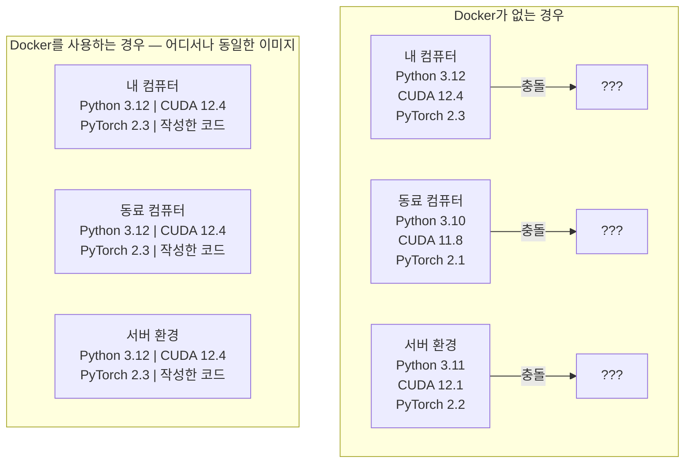

# AI를 위한 도커 (Docker for AI)

> 컨테이너는 "내 컴퓨터에서는 잘 되는데..."라는 말을 과거의 유물로 만듭니다.

**Type:** Build
**Languages:** Docker
**Prerequisites:** Phase 0, Lessons 01 and 03
**Time:** ~60 minutes

## 학습 목표 (Learning Objectives)

- Dockerfile을 사용하여 CUDA, PyTorch, AI 라이브러리가 포함된 GPU 가속 Docker 이미지를 빌드합니다.
- 호스트 디렉터리를 볼륨으로 마운트하여 컨테이너 재생성 시에도 모델, 데이터셋, 코드가 유지되도록 설정합니다.
- 컨테이너 내부에서 GPU를 인식할 수 있도록 NVIDIA Container Toolkit을 구성합니다.
- Docker Compose를 활용하여 추론 서버와 벡터 데이터베이스 등 멀티 서비스 AI 애플리케이션을 오케스트레이션합니다.

## 문제 상황 (The Problem)

내 노트북(PyTorch 2.3, CUDA 12.4, Python 3.12)에서 모델을 학습시켰습니다. 동료의 컴퓨터 환경은 PyTorch 2.1, CUDA 11.8, Python 3.10입니다. 내 모델은 동료의 컴퓨터에서 실행되지 않고 충돌합니다. 하지만 잘 작성된 Dockerfile은 두 컴퓨터 모두에서 완벽히 동작합니다.

AI 프로젝트는 의존성 관리의 난이도가 극히 높습니다. Python, PyTorch, CUDA 드라이버, cuDNN, 시스템 C 라이브러리뿐 아니라 특정 컴파일러 버전을 요구하는 flash-attn 같은 특수 패키지가 얽혀 있기 때문입니다. Docker는 이 모든 요소를 어디서나 동일하게 동작하는 단일 이미지로 패키징해 줍니다.

## 핵심 개념 (The Concept)

Docker는 코드, 런타임, 라이브러리, 시스템 도구를 '컨테이너(Container)'라는 격리된 단위로 묶어줍니다. 가상 머신(VM)과 유사하지만 자체 OS 커널을 실행하지 않고 호스트 OS 커널을 공유하므로 몇 분이 아닌 수 초 만에 시작됩니다.



### AI 프로젝트에서 특히 Docker가 중요한 이유

1. **GPU 드라이버는 민감합니다.** CUDA 12.4 코드는 CUDA 11.8에서 동작하지 않습니다. Docker는 컨테이너 내부에 CUDA 툴킷을 격리하면서 NVIDIA Container Toolkit을 통해 호스트의 GPU 드라이버를 안전하게 공유합니다.
2. **모델 가중치(Weights)는 대용량입니다.** 7B 파라미터 모델은 fp16 기준 약 14GB에 달합니다. 컨테이너를 다시 빌드할 때마다 이를 매번 다운로드할 수는 없습니다. Docker 볼륨 마운트를 사용하면 호스트 머신의 모델 디렉터리를 연결하여 재다운로드를 방지할 수 있습니다.
3. **멀티 서비스 아키텍처가 기본입니다.** 실제 AI 애플리케이션은 파이썬 스크립트 하나로 끝나지 않습니다. 추론 서버, RAG 검색을 위한 벡터 데이터베이스, 웹 프론트엔드가 함께 동작합니다. Docker Compose를 사용하면 단 한 줄의 명령어로 이 모든 것을 실행할 수 있습니다.

### 핵심 용어

| 용어 | 의미 |
|------|---------------|
| 이미지 (Image) | 읽기 전용 템플릿. Dockerfile로부터 빌드되는 조리법(Recipe). |
| 컨테이너 (Container) | 이미지가 실행 중인 인스턴스. 실제 요리가 이루어지는 주방. |
| Dockerfile | 이미지를 단계별(Layer)로 빌드하기 위한 지침서. |
| 볼륨 (Volume) | 컨테이너가 중지되거나 삭제되어도 데이터가 유지되는 영구 저장소. |
| docker-compose | 여러 개의 컨테이너를 YAML 파일로 정의하고 실행하는 도구. |

### AI 환경에서의 일반적인 컨테이너 패턴

```
개발용 컨테이너 (Dev Container)
  전체 도구 세트 탑재. 에디터 연동, Jupyter, 디버깅 도구 포함.
  개발 및 실험 단계에서 사용.

학습용 컨테이너 (Training Container)
  최소화된 크기. 학습 스크립트와 필수 라이브러리만 포함.
  GPU 클러스터에서 배치 실행. 에디터나 Jupyter 미포함.

추론용 컨테이너 (Inference Container)
  서빙에 최적화. 가벼운 용량, 빠른 콜드 스타트(Cold Start).
  프로덕션 환경에서 로드 밸런서 뒤에 배치.
```

```figure
s0-image-layers
```

## 구현하기 (Build It)

### Step 1: Docker 설치하기

```bash
# macOS
brew install --cask docker
open /Applications/Docker.app

# Ubuntu
curl -fsSL https://get.docker.com | sh
sudo usermod -aG docker $USER
# 그룹 변경 사항 적용을 위해 로그아웃 후 다시 로그인
```

설치 검증:

```bash
docker --version
docker run hello-world
```

### Step 2: NVIDIA Container Toolkit 설치 (Linux + NVIDIA GPU 환경)

컨테이너가 호스트의 GPU에 접근할 수 있도록 해 줍니다. macOS 및 Windows(WSL2) 사용자는 건너뛰어도 됩니다(Docker Desktop이 자체적으로 GPU 패스스루를 처리합니다).

```bash
distribution=$(. /etc/os-release;echo $ID$VERSION_ID)
curl -fsSL https://nvidia.github.io/libnvidia-container/gpgkey | sudo gpg --dearmor -o /usr/share/keyrings/nvidia-container-toolkit-keyring.gpg
curl -s -L https://nvidia.github.io/libnvidia-container/$distribution/libnvidia-container.list | \
    sed 's#deb https://#deb [signed-by=/usr/share/keyrings/nvidia-container-toolkit-keyring.gpg] https://#g' | \
    sudo tee /etc/apt/sources.list.d/nvidia-container-toolkit.list

sudo apt-get update
sudo apt-get install -y nvidia-container-toolkit
sudo nvidia-ctk runtime configure --runtime=docker
sudo systemctl restart docker
```

컨테이너 내부에서 GPU 인식 테스트:

```bash
docker run --rm --gpus all nvidia/cuda:12.4.1-base-ubuntu22.04 nvidia-smi
```

GPU 정보가 출력되면 정상적으로 구성된 것입니다.

### Step 3: 베이스 이미지 이해하기

적절한 베이스 이미지를 선택하면 수많은 빌드 디버깅 시간을 절약할 수 있습니다.

```
nvidia/cuda:12.4.1-devel-ubuntu22.04
  완전한 CUDA 툴킷과 C/C++ 컴파일러(nvcc) 포함.
  용도: flash-attn, bitsandbytes 등 직접 컴파일이 필요한 패키지 빌드 시.
  크기: 약 4 GB

nvidia/cuda:12.4.1-runtime-ubuntu22.04
  CUDA 런타임만 포함 (컴파일러 제외).
  용도: 사전 빌드된 바이너리 실행 시.
  크기: 약 1.5 GB

pytorch/pytorch:2.6.0-cuda12.4-cudnn9-runtime
  CUDA 위에 PyTorch가 사전 설치됨.
  용도: PyTorch 설치 단계를 건너뛰고 바로 실행할 때.
  크기: 약 6 GB

python:3.12-slim
  CUDA 없음 (CPU 전용).
  용도: CPU 기반 추론, 가벼운 도구 실행 시.
  크기: 약 150 MB
```

### Step 4: AI 개발용 Dockerfile 작성

`code/Dockerfile`의 내용을 살펴봅니다:

```dockerfile
FROM nvidia/cuda:12.4.1-devel-ubuntu22.04

ENV DEBIAN_FRONTEND=noninteractive
ENV PYTHONUNBUFFERED=1

RUN apt-get update && apt-get install -y --no-install-recommends \
    software-properties-common \
    git \
    curl \
    build-essential \
    && add-apt-repository -y ppa:deadsnakes/ppa \
    && apt-get update && apt-get install -y --no-install-recommends \
    python3.12 \
    python3.12-venv \
    python3.12-dev \
    && rm -rf /var/lib/apt/lists/*

RUN update-alternatives --install /usr/bin/python python /usr/bin/python3.12 1

RUN curl -sSL https://raw.githubusercontent.com/pypa/get-pip/3b73145063be545b649ad9ca83ea8da5fc915a4f/public/get-pip.py -o /tmp/get-pip.py \
    && echo "a341e1a43e38001c551a1508a73ff23636a11970b61d901d9a1cad2a18f57055  /tmp/get-pip.py" | sha256sum -c - \
    && python /tmp/get-pip.py \
    && rm /tmp/get-pip.py \
    && update-alternatives --install /usr/bin/pip pip /usr/local/bin/pip3.12 1

RUN python -m pip install --no-cache-dir --upgrade pip setuptools wheel

RUN python -m pip install --no-cache-dir \
    torch==2.6.0+cu124 \
    torchvision==0.21.0+cu124 \
    torchaudio==2.6.0+cu124 \
    --index-url https://download.pytorch.org/whl/cu124

RUN python -m pip install --no-cache-dir \
    numpy \
    pandas \
    scikit-learn \
    matplotlib \
    jupyter \
    transformers \
    datasets \
    accelerate \
    safetensors

WORKDIR /workspace

VOLUME ["/workspace", "/models"]

EXPOSE 8888

CMD ["python"]
```

이미지 빌드:

```bash
docker build -t ai-dev -f phases/00-setup-and-tooling/07-docker-for-ai/code/Dockerfile .
```

컨테이너 실행 및 PyTorch 동작 확인:

```bash
docker run --rm -it --gpus all \
    -v $(pwd):/workspace \
    -v ~/models:/models \
    ai-dev python -c "import torch; print(f'PyTorch {torch.__version__}, CUDA: {torch.cuda.is_available()}')"
```

컨테이너 내부에서 Jupyter 실행:

```bash
docker run --rm -it --gpus all \
    -v $(pwd):/workspace \
    -v ~/models:/models \
    -p 8888:8888 \
    ai-dev jupyter notebook --ip=0.0.0.0 --port=8888 --no-browser --allow-root
```

### Step 5: 데이터와 모델을 위한 볼륨 마운트

볼륨 마운트는 AI 작업에서 핵심적인 요소입니다. 마운트를 설정하지 않으면 컨테이너 종료 시 수십 GB에 달하는 모델 파일이 모두 사라집니다.

```bash
# 로컬 코드 마운트
-v $(pwd):/workspace

# 공용 모델 디렉터리 마운트
-v ~/models:/models

# 데이터셋 디렉터리 마운트
-v ~/datasets:/data
```

학습 스크립트 내부에서는 마운트된 경로로부터 모델을 불러옵니다:

```python
from transformers import AutoModel

model = AutoModel.from_pretrained("/models/llama-7b")
```

모델 파일은 호스트 파일시스템에 안전하게 유지되므로 컨테이너를 몇 번을 다시 빌드하더라도 모델을 재다운로드할 필요가 없습니다.

### Step 6: Docker Compose 기반 멀티 서비스 AI 앱 구성

실제 RAG(검색 증강 생성) 애플리케이션은 추론 서버와 벡터 데이터베이스를 함께 필요로 합니다. `code/docker-compose.yml`을 살펴봅니다:

```yaml
services:
  ai-dev:
    build:
      context: .
      dockerfile: Dockerfile
    deploy:
      resources:
        reservations:
          devices:
            - driver: nvidia
              count: all
              capabilities: [gpu]
    volumes:
      - ../../../:/workspace
      - ~/models:/models
      - ~/datasets:/data
    ports:
      - "8888:8888"
    stdin_open: true
    tty: true
    command: jupyter notebook --ip=0.0.0.0 --port=8888 --no-browser --allow-root

  qdrant:
    image: qdrant/qdrant:v1.12.5
    ports:
      - "6333:6333"
      - "6334:6334"
    volumes:
      - qdrant_data:/qdrant/storage

volumes:
  qdrant_data:
```

전체 서비스 시작:

```bash
cd phases/00-setup-and-tooling/07-docker-for-ai/code
docker compose up -d
```

이제 `ai-dev` 컨테이너 내부에서는 서비스 이름을 통해 `http://qdrant:6333`으로 벡터 DB에 통신할 수 있습니다. Docker Compose가 가상 네트워크를 자동으로 구성해 주기 때문입니다.

전체 서비스 종료:

```bash
docker compose down
```

벡터 데이터 볼륨까지 완전히 삭제하려면 `-v` 플래그를 추가합니다:

```bash
docker compose down -v
```

### Step 7: 자주 쓰는 Docker 유용한 명령어

```bash
# 실행 중인 컨테이너 목록
docker ps

# 보유한 이미지 목록 및 용량 확인
docker images

# 사용하지 않는 리소스 정리 (디스크 공간 확보)
docker system prune -a

# 실행 중인 컨테이너 내부 GPU 모니터링
docker exec -it <container_id> nvidia-smi

# 컨테이너와 호스트 간 파일 복사
docker cp <container_id>:/workspace/results.csv ./results.csv

# 컨테이너 로그 실시간 확인
docker logs -f <container_id>
```

## 실무 활용 (Use It)

이제 언제 어디서나 동일하게 재현되는 AI 개발 환경이 준비되었습니다.

- `docker compose up`으로 개발 환경과 벡터 DB를 단번에 실행할 수 있습니다.
- 코드, 모델, 데이터셋을 볼륨으로 마운트하여 컨테이너 재생성 시에도 작업을 안전하게 보존합니다.
- 새로운 패키지가 필요할 때 Dockerfile에 추가하고 이미지를 다시 빌드합니다.
- 팀원에게 Dockerfile만 전달하면 완전히 동일한 실행 환경을 공유할 수 있습니다.

### GPU가 없는 경우

`--gpus all` 옵션과 Docker Compose의 nvidia deploy 블록을 제거하면 CPU 모드로 완벽히 작동합니다. PyTorch는 CUDA가 없을 때 자동으로 CPU 모드로 전환됩니다.

## 실습 과제 (Exercises)

1. Dockerfile을 빌드하고 컨테이너 내부에서 `python -c "import torch; print(torch.__version__)"`를 실행해 보세요.
2. docker-compose 스택을 실행하고 AI 컨테이너에서 `http://qdrant:6333/collections`로 Qdrant 벡터 DB에 접속 가능한지 확인해 보세요.
3. Dockerfile에 `flask` 패키지를 추가하여 다시 빌드한 뒤, 5000번 포트로 간단한 웹 서버를 띄우고 `-p 5000:5000`으로 호스트와 연결해 보세요.
4. `docker images`로 이미지 용량을 확인하고, 베이스 이미지를 `devel`에서 `runtime`으로 변경했을 때 이미지 크기가 얼마나 줄어드는지 비교해 보세요.

## 핵심 용어 정리 (Key Terms)

| 용어 | 흔히 하는 표현 | 실제 의미 |
|------|----------------|----------------------|
| 컨테이너 (Container) | "가벼운 VM" | 호스트 커널을 공유하며 자체 파일시스템과 네트워크를 갖는 격리된 프로세스 |
| 이미지 레이어 (Image layer) | "캐시된 빌드 단계" | Dockerfile의 각 명령어가 생성하는 읽기 전용 레이어로, 변경되지 않은 레이어는 캐시되어 빠른 재빌드를 지원 |
| NVIDIA Container Toolkit | "도커 안의 GPU" | `--gpus` 플래그를 통해 호스트의 GPU를 컨테이너 내부에 노출해 주는 런타임 훅 |
| 볼륨 마운트 (Volume mount) | "공유 폴더" | 호스트의 디렉터리를 컨테이너 내부에 연결하여 컨테이너 종료 후에도 데이터가 유지되도록 하는 저장소 설정 |
| 베이스 이미지 (Base image) | "시작 이미지" | Dockerfile의 `FROM` 절에 지정되어 기본 OS와 라이브러리를 결정짓는 템플릿 |
