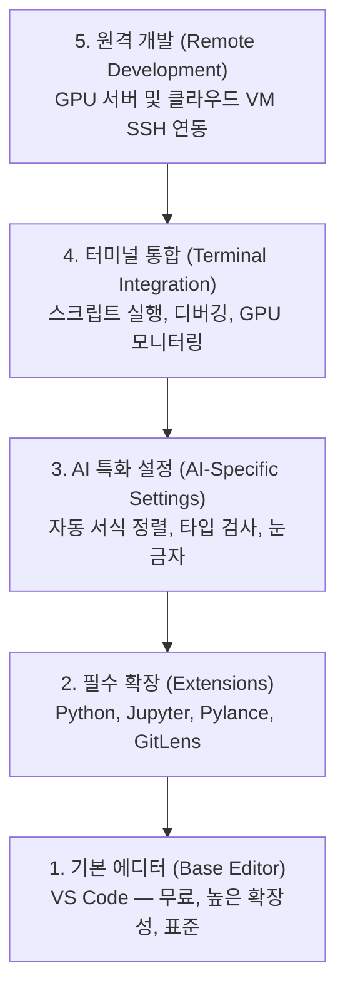

# 에디터 환경 설정 (Editor Setup)

> 에디터는 당신의 코파일럿(부조종사)입니다. 방해되지 않고 능력을 최대한 발휘하도록 한 번에 제대로 설정하세요.

**Type:** Build
**Languages:** --
**Prerequisites:** Phase 0, Lesson 01
**Time:** ~20 minutes

## 학습 목표 (Learning Objectives)

- Python, Jupyter, 린팅, 원격 SSH 개발에 필수적인 확장 프로그램과 함께 VS Code를 설치합니다.
- AI 워크플로에 맞춰 저장 시 자동 서식 지정(format-on-save), 정적 타입 검사, 노트북 출력 스크롤을 구성합니다.
- 원격 GPU 머신의 코드를 로컬 환경처럼 원활하게 편집하고 디버깅할 수 있도록 Remote SSH를 구성합니다.
- Cursor, Windsurf, Neovim 등 대안 에디터들의 장단점과 AI 실무 적합성을 평가합니다.

## 문제 상황 (The Problem)

앞으로 수천 시간을 에디터 안에서 파이썬 코드를 작성하고, 노트북을 돌리며, 학습 루프를 디버깅하고, 원격 GPU 머신에 SSH 접속하는 데 쓰게 됩니다. 설정이 부실한 에디터는 모든 작업에 마찰을 일으킵니다. 자동 완성 부재, 타입 힌트 누락, 인라인 에러 미표시, 수동 코드 정렬, 불편한 터미널 전환으로 고통받게 됩니다.

제대로 된 설정에는 단 20분이면 충분합니다. 이 설정을 건너뛰면 매일 20분의 시간을 허비하게 됩니다.

## 핵심 개념 (The Concept)

AI 엔지니어링을 위한 에디터 환경은 다음 5가지 계층으로 구성됩니다:



```figure
s0-lsp-roundtrip
```

## 구현하기 (Build It)

### Step 1: VS Code 설치

VS Code를 권장합니다. 무료이며 모든 OS를 지원하고, 일급 주피터 노트북 지원과 방대한 AI 개발 확장 생태계를 갖추고 있습니다.

[code.visualstudio.com](https://code.visualstudio.com/)에서 다운로드합니다.

터미널에서 설치 검증:

```bash
code --version
```

macOS에서 `code` 명령어를 찾지 못한다면, VS Code를 열고 `Cmd+Shift+P`를 누른 뒤 "Shell Command: Install 'code' command in PATH"를 실행하세요.

### Step 2: 필수 확장 프로그램 설치

VS Code 내장 터미널(모든 플랫폼 공통 단축키: `` Ctrl+` ``)을 열고 다음 명령어들을 실행합니다:

```bash
code --install-extension ms-python.python
code --install-extension ms-python.vscode-pylance
code --install-extension ms-toolsai.jupyter
code --install-extension eamodio.gitlens
code --install-extension ms-vscode-remote.remote-ssh
code --install-extension ms-python.debugpy
code --install-extension ms-python.black-formatter
code --install-extension charliermarsh.ruff
```

각 확장의 역할:

| 확장 프로그램 | 추천 이유 |
|-----------|-----|
| Python | 파이썬 언어 지원, 가상 환경 자동 감지, 실행 및 디버깅 |
| Pylance | 빠른 정적 타입 검사, 인텔리센스 자동 완성, 모듈 임포트 해결 |
| Jupyter | VS Code 내부에서 노트북 직접 실행 및 변수 탐색기 제공 |
| GitLens | 코드 라인별 커밋 작성자 확인(git blame), 변경 이력 추적 |
| Remote SSH | 원격 GPU 서버의 폴더를 로컬 창에서 열어 원격 개발 수행 |
| Debugpy | 파이썬 코드 단계별 디버깅 지원 |
| Black Formatter | 저장 시 자동 정렬로 코드 스타일 일관성 유지 |
| Ruff | 초고속 린터, 잠재적인 버그와 문법 오류 사전 감지 |

이 레슨의 `code/.vscode/extensions.json` 파일에 전체 추천 목록이 들어 있습니다.

### Step 3: 실무 설정 구성 (`settings.json`)

`설정 > 설정 열기 (JSON)`를 실행하거나 `code/.vscode/settings.json` 내용을 적용합니다:

```jsonc
{
    "python.analysis.typeCheckingMode": "basic",
    "editor.formatOnSave": true,
    "editor.rulers": [88, 120],
    "notebook.output.scrolling": true,
    "files.autoSave": "afterDelay"
}
```

설정 이유:
- **typeCheckingMode: basic**: 텐서 형상(shape) 불일치나 API 매개변수 오류를 실행 전에 정적 검사로 잡아줍니다.
- **formatOnSave**: 저장할 때마다 Black이 자동으로 코드를 정리해 주어 서식 정렬에 신경 쓸 필요가 없습니다.
- **rulers [88, 120]**: Black의 기본 줄바꿈 기준선(88)과 긴 주석/독스트링을 감지하는 기준선(120)을 시각적으로 표시합니다.
- **notebook.output.scrolling**: 훈련 루프에서 수천 줄의 로그가 출력될 때 노트북 화면이 과도하게 길어지는 것을 방지합니다.
- **autoSave**: 저장을 잊어버려 이전 코드가 그대로 실행되는 실수를 방지합니다.

### Step 4: 통합 터미널 최적화

```jsonc
{
    "terminal.integrated.defaultProfile.osx": "zsh",
    "terminal.integrated.defaultProfile.linux": "bash",
    "terminal.integrated.fontSize": 13,
    "terminal.integrated.scrollback": 10000
}
```

유용한 터미널 단축키:

| 기능 | macOS | Linux/Windows |
|--------|-------|---------------|
| 터미널 토글 | `` Ctrl+` `` | `` Ctrl+` `` |
| 새 터미널 생성 | `` Ctrl+Shift+` `` | `` Ctrl+Shift+` `` |
| 터미널 분할 (Split) | `Cmd+\` | `Ctrl+Shift+5` |

터미널 분할 기능을 활용하면 한쪽에서는 훈련 스크립트를 실행하고, 다른 한쪽에서는 `watch -n 1 nvidia-smi`로 GPU 상태를 실시간 모니터링할 수 있습니다.

### Step 5: 원격 개발 (GPU 머신 SSH 연동)

AI 실무에서 가장 중요한 기능입니다. 대규모 모델 훈련은 주로 클라우드 VM이나 원격 GPU 서버에서 수행됩니다. Remote SSH를 사용하면 원격 서버의 파일시스템을 로컬 에디터 창에 띄워 놓고 로컬 파일 다루듯 개발할 수 있습니다.

설정 방법:
1. Remote SSH 확장 설치
2. `Ctrl+Shift+P`를 누르고 "Remote-SSH: Connect to Host" 선택
3. `user@원격서버IP` 입력
4. VS Code가 원격 머신에 서버 컴포넌트를 자동 설치하고 연동 완료

비밀번호 없는 편리한 접속을 위해 SSH 키를 등록해 두세요:

```bash
ssh-keygen -t ed25519 -C "your-email@example.com"
ssh-copy-id user@your-gpu-box-ip
```

`~/.ssh/config`에 호스트 별칭 등록:

```
Host gpu-box
    HostName 203.0.113.50
    User ubuntu
    IdentityFile ~/.ssh/id_ed25519
    ForwardAgent yes
```

이제 `Remote-SSH: Connect to Host > gpu-box`만 클릭하면 즉시 연결됩니다.

## 대안 에디터 비교

### Cursor
[cursor.com](https://cursor.com)은 AI 코드 생성 엔진이 내장된 VS Code 포크(Fork) 에디터입니다. VS Code 확장 생태계 및 설정을 그대로 지원하므로, 본 레슨의 `settings.json`과 `extensions.json`이 완전히 호환됩니다.

### Windsurf
[windsurf.com](https://windsurf.com) 역시 AI-first 기반의 VS Code 포크 에디터로, 동일한 확장 프로그램 및 Remote SSH 환경을 지원합니다.

### Vim / Neovim
이미 Neovim에 익숙하고 생산성이 높다면 기존 환경을 유지해도 좋습니다. Pyright, nvim-lspconfig, molten-nvim 등을 연동할 수 있습니다. 하지만 아직 Vim을 써보지 않았다면 AI 엔지니어링 학습과 에디터 러닝커브가 겹쳐 학습 효율이 떨어질 수 있으므로 VS Code나 Cursor를 추천합니다.

## 실무 활용 (Use It)

설정이 완료된 일상 개발 워크플로:
1. VS Code에서 프로젝트를 열거나 Remote SSH로 GPU 서버에 접속합니다.
2. 자동 완성과 인라인 타입 검사 지원을 받으며 파이썬 코드를 작성합니다.
3. Jupyter 확장을 통해 노트북 셀을 즉시 실행하고 시각화합니다.
4. 통합 터미널에서 스크립트 실행, `uv pip install`, GPU 상태 점검을 진행합니다.
5. GitLens로 변경 사항을 꼼꼼히 리뷰한 후 커밋합니다.

## 실습 과제 (Exercises)

1. VS Code 및 Step 2에 나열된 모든 필수 확장을 설치하세요.
2. 이 레슨의 `settings.json`을 본인의 VS Code 설정에 적용하세요.
3. 파이썬 파일을 열어 Pylance 타입 힌트와 저장 시 Black 자동 서식 정렬이 정상 동작하는지 확인하세요.
4. 접근 가능한 원격 머신이 있다면 Remote SSH를 구성하고 원격 폴더를 직접 열어보세요.

## 핵심 용어 정리 (Key Terms)

| 용어 | 흔히 하는 표현 | 실제 의미 |
|------|----------------|----------------------|
| LSP | "자동 완성 엔진" | Language Server Protocol: 에디터가 언어 분석 서버로부터 타입 정보, 완성 목록, 에러 진단을 제공받는 표준 규격 |
| Pylance | "파이썬 플러그인" | Pyright 엔진 기반의 마이크로소프트 공식 파이썬 언어 서버 |
| Remote SSH | "서버에서 작업하기" | 원격 머신에 경량 에이전트를 띄워 로컬 에디터 인터페이스로 원격 개발을 수행하는 기술 |
| Format on save | "저장 시 자동 정렬" | 파일 저장 이벤트 발생 시 Black, Ruff 등의 포매터를 실행하여 일관된 코드 스타일을 유지하는 기능 |
