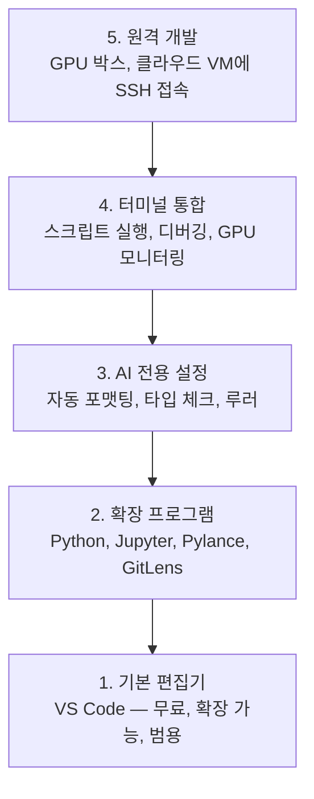

# 편집기 설정

> 편집기는 당신의 조종사입니다. 한 번만 설정하면 방해가 되지 않고 제 역할을 수행하도록 시작하세요.

**유형:** Build
**언어:** --
**선수 요건:** 0단계, 01강
**시간:** 약 20분

## 학습 목표

- Python, Jupyter, 린팅, 원격 SSH를 위한 필수 확장 프로그램이 포함된 VS Code 설치
- AI 워크플로우를 위해 저장 시 자동 포맷팅, 타입 체크, 노트북 출력 스크롤 설정
- 원격 GPU 머신에서 코드를 마치 로컬인 것처럼 편집하고 디버깅하기 위해 Remote SSH 설정
- AI 작업을 위한 편집기 대안(Cursor, Windsurf, Neovim) 및 그 트레이드오프 평가

## 문제점

당신은 Python 작성, 노트북 실행, 학습 루프 디버깅, GPU 박스에 SSH 접속 등 편집기 안에서 수천 시간을 보낼 것입니다. 설정이 잘못된 편집기는 모든 세션을 마찰로 만듭니다: 자동완성 없음, 타입 힌트 없음, 인라인 오류 없음, 수동 포맷팅, 그리고 불친절한 터미널 워크플로우.

올바른 설정은 20분이 걸립니다. 이를 건너뛰면 매일 20분이 낭비됩니다.

## 개념

AI 엔지니어링 편집기 설정에는 다섯 가지가 필요합니다:



```figure
s0-lsp-roundtrip
```

## 구현하기

### 1단계: VS Code 설치

VS Code는 권장되는 편집기입니다. 무료이며 모든 OS에서 실행되고, Jupyter 노트북에 대한 일급 지원이 있으며, 확장 프로그램 생태계는 AI 작업에 필요한 모든 것을 커버합니다.

[code.visualstudio.com](https://code.visualstudio.com/)에서 다운로드하세요.

터미널에서 확인하세요:

```bash
code --version
```

macOS에서 `code`이 발견되지 않으면, VS Code를 열고 `Cmd+Shift+P`를 누른 후 "Shell Command"를 입력하고 "Install 'code' command in PATH"를 선택하세요.

### 2단계: 필수 확장 프로그램 설치

VS Code에서 통합 터미널을 열고 (`` Ctrl+` `` 모든 플랫폼에서) AI 작업에 중요한 확장 프로그램을 설치해 보세요:

```bash
code --install-extension ms-python.python
code --install-extension ms-python.vscode-pylance
code --install-extension ms-toolsai.jupyter
code --install-extension eamodio.gitlens
code --install-extension ms-vscode-remote.remote-ssh
code --install-extension ms-python.debugpy
code --install-extension ms-python.black-formatter
code --install-extension charliermarsh.ruff
```

각 확장 프로그램의 기능:

| 확장 프로그램 | 이유 |
|-----------|-----|
| Python | 언어 지원, 가상 환경 감지, 실행/디버깅 |
| Pylance | 빠른 타입 체크, 자동완성, 임포트 해석 |
| Jupyter | VS Code 내에서 노트북 실행, 변수 탐색기 |
| GitLens | 누가 무엇을 변경했는지 확인, 인라인 git blame |
| Remote SSH | 원격 GPU 서버의 폴더를 로컬처럼 열기 |
| Debugpy | Python용 단계별 디버깅 |
| Black Formatter | 저장 시 자동 포맷팅, 일관된 스타일 |
| Ruff | 빠른 린팅, 흔한 실수 포착 |

이 강의의 `code/.vscode/extensions.json` 파일에는 전체 권장 목록이 포함되어 있습니다. 프로젝트 폴더를 열면 VS Code가 설치를 요청합니다.

### 3단계: 설정 구성

이 강의의 `code/.vscode/settings.json`에서 설정을 복사하거나, `Settings > Open Settings (JSON)`을 통해 수동으로 적용하세요.

AI 작업에 중요한 주요 설정:

```jsonc
{
    "python.analysis.typeCheckingMode": "basic",
    "editor.formatOnSave": true,
    "editor.rulers": [88, 120],
    "notebook.output.scrolling": true,
    "files.autoSave": "afterDelay"
}
```

이 설정들이 중요한 이유:

- **기본 타입 체크**: 실행 전에 잘못된 인자 타입을 포착합니다. 텐서 모양 불일치 및 잘못된 API 파라미터로 인한 디버깅 시간을 절약합니다.
- **저장 시 포맷팅**: 포맷팅에 대해 다시 생각할 필요가 없습니다. Black이 처리합니다.
- **88 및 120의 눈금선**: Black은 88에서 줄 바꿈을 합니다. 120 마커는 문서 문자열과 주석이 너무 길어지는 시점을 보여줍니다.
- **노트북 출력 스크롤링**: 학습 루프는 수천 줄을 출력합니다. 스크롤링이 없으면 출력 패널이 폭발합니다.
- **자동 저장**: 저장을 잊어버릴 것입니다. 학습 스크립트가 오래된 코드를 실행하게 됩니다. 자동 저장이 이를 방지합니다.

### 4단계: 터미널 통합

VS Code의 통합 터미널은 학습 스크립트를 실행하고, GPU를 모니터링하며, 환경을 관리하는 곳입니다.

제대로 설정하세요:

```jsonc
{
    "terminal.integrated.defaultProfile.osx": "zsh",
    "terminal.integrated.defaultProfile.linux": "bash",
    "terminal.integrated.fontSize": 13,
    "terminal.integrated.scrollback": 10000
}
```

유용한 단축키:

| 작업 | macOS | Linux/Windows |
|--------|-------|---------------|
| 터미널 토글 | `` Ctrl+` `` | `` Ctrl+` `` |
| 새 터미널 | `` Ctrl+Shift+` `` | `` Ctrl+Shift+` `` |
| 터미널 분할 | `Cmd+\` | `Ctrl+Shift+5` |

터미널 분할은 유용합니다: 하나는 스크립트 실행용, 하나는 `nvidia-smi -l 1` 또는 `watch -n 1 nvidia-smi`로 GPU 모니터링용입니다.

### 5단계: 원격 개발 (GPU 서버에 SSH 접속)

AI 작업에서 가장 중요한 확장 프로그램입니다. 원격 머신(클라우드 VM, 랩 서버, Lambda, Vast.ai)에서 학습을 실행하게 됩니다. 원격 SSH를 사용하면 원격 파일 시스템을 열 수 있고, 파일을 편집하고, 터미널을 실행하고, 모든 것이 로컬인 것처럼 디버깅할 수 있습니다.

설정:

1. Remote SSH 확장 프로그램 설치 (2단계에서 완료).
2. `Ctrl+Shift+P` (또는 `Cmd+Shift+P`)를 누르고 "Remote-SSH: Connect to Host"를 입력하세요.
3. `user@your-gpu-box-ip`을 입력하세요.
4. VS Code는 서버 구성 요소를 원격 머신에 자동으로 설치합니다.

비밀번호 없는 접근을 위해 SSH 키를 설정하세요:

```bash
ssh-keygen -t ed25519 -C "your-email@example.com"
ssh-copy-id user@your-gpu-box-ip
```

편리함을 위해 `~/.ssh/config`에 호스트를 추가하세요:

```
Host gpu-box
    HostName 203.0.113.50
    User ubuntu
    IdentityFile ~/.ssh/id_ed25519
    ForwardAgent yes
```

이제 `Remote-SSH: Connect to Host > gpu-box`이 즉시 연결됩니다.

## 대안

### Cursor

[cursor.com](https://cursor.com)는 AI 코드 생성 기능이 내장된 VS Code 포크입니다. 동일한 확장 프로그램 생태계와 설정 형식을 사용합니다. Cursor를 사용한다면, 이 강의의 모든 내용이 여전히 적용됩니다. 동일한 `settings.json`과 `extensions.json`을 가져오세요.

### Windsurf

[windsurf.com](https://windsurf.com)는 또 다른 AI 우선 VS Code 포크입니다. 상황은 동일합니다: 동일한 확장 프로그램, 동일한 설정 형식, 동일한 Remote SSH 지원.

### Vim/Neovim

이미 Vim이나 Neovim을 사용하며 생산적으로 작업한다면, 그대로 유지하세요. AI Python 작업에 필요한 최소 설정은 다음과 같습니다:

- **pyright** 또는 **pylsp**로 타입 체크 (Mason 또는 수동 설치로)
- **nvim-lspconfig**로 언어 서버 통합
- **jupyter-vim** 또는 **molten-nvim**로 노트북 유사 실행
- **telescope.nvim**로 파일/심볼 검색
- **none-ls.nvim**에 black과 ruff를 사용하여 포맷팅/린팅

이미 Vim을 사용하지 않는다면, 지금 시작하지 마세요. 학습 곡선이 AI 엔지니어링 학습과 경쟁하게 됩니다. VS Code를 사용하세요.

## 사용하기

이 설정으로, 일일 워크플로우는 다음과 같습니다:

1. VS Code에서 프로젝트 폴더를 열거나, Remote SSH로 GPU 서버에 연결해 보세요.
2. 에디터에서 Python을 작성하며 자동완성, 타입 힌트, 인라인 오류를 활용해 보세요.
3. Jupyter 확장 프로그램을 사용해 Jupyter 노트북을 인라인으로 실행해 보세요.
4. 통합 터미널을 사용해 학습 스크립트, `uv pip install`, GPU 모니터링을 수행해 보세요.
5. 커밋하기 전에 GitLens로 변경 사항을 검토해 보세요.

## 연습 문제

1. VS Code와 2단계에 나열된 모든 확장 프로그램을 설치해 보세요.
2. 이 강의의 `settings.json`을 VS Code 설정에 복사해 보세요.
3. Python 파일을 열고 Pylance가 타입 힌트를 표시하고 Black이 저장 시에 포맷하는지 확인해 보세요.
4. 원격 머신에 접근할 수 있다면 Remote SSH를 설정하고 그 머신에 있는 폴더를 열어 보세요.

## 핵심 용어

| 용어 | 사람들이 말하는 표현 | 실제 의미 |
|------|----------------|----------------------|
| LSP | "자동완성 엔진" | Language Server Protocol: 에디터가 언어별 서버로부터 타입 정보, 자동완성, 진단을 가져오기 위한 표준 |
| Pylance | "Python 플러그인" | Pyright를 사용해 타입 체크와 IntelliSense를 수행하는 Microsoft의 Python 언어 서버 |
| Remote SSH | "서버에서 작업하기" | 원격 머신에 경량 서버를 실행하고 UI를 로컬 에디터로 스트리밍하는 VS Code 확장 프로그램 |
| 저장 시 포맷 | "자동 prettier" | 에디터가 저장할 때마다 포매터(Black, Ruff)를 실행하므로 코드 스타일이 항상 일관됩니다 |
