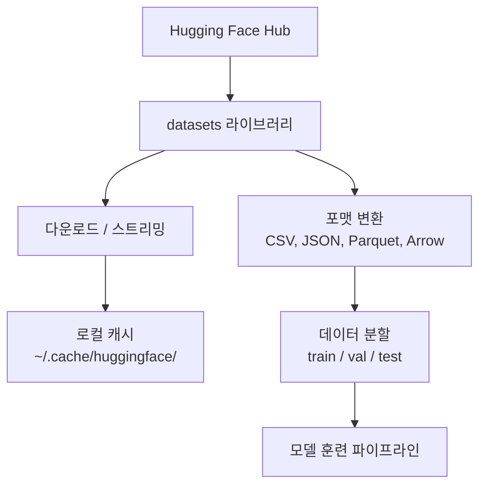

# 데이터 관리 (Data Management)

> 데이터는 AI의 연료입니다. 데이터를 어떻게 관리하느냐가 개발 속도를 결정합니다.

**Type:** Build
**Language:** Python
**Prerequisites:** Phase 0, Lesson 01
**Time:** ~45 minutes

## 학습 목표 (Learning Objectives)

- Hugging Face `datasets` 라이브러리를 사용해 데이터셋을 로드하고, 스트리밍하며, 로컬에 캐시합니다.
- CSV, JSON, Parquet, Arrow 포맷 간의 차이점과 성능 트레이드오프를 비교하고 변환합니다.
- 고정된 시드(random seed)를 활용하여 재현 가능한 훈련/검증/테스트 데이터 분할(split)을 생성합니다.
- `.gitignore`, Git LFS, DVC를 사용하여 대용량 모델 가중치와 데이터셋 파일을 효율적으로 관리합니다.

## 문제 상황 (The Problem)

모든 AI 프로젝트의 시작점은 데이터입니다. 적합한 데이터셋을 탐색하고, 내려받고, 필요한 포맷으로 변환하며, 훈련 및 검증용으로 분할하고, 실험의 재현성을 위해 버전을 관리해야 합니다. 이 과정을 매번 수작업으로 진행하면 느리고 실수하기 쉽습니다. 일관되고 자동화된 워크플로가 필요합니다.

## 핵심 개념 (The Concept)



Hugging Face의 `datasets` 라이브러리는 AI 데이터 관리를 위한 업계 표준입니다. 다운로드, 캐싱, 포맷 변환, 스트리밍 처리를 기본으로 제공합니다.

```figure
s0-data-pipeline
```

## 구현하기 (Build It)

### Step 1: datasets 라이브러리 설치

```bash
pip install datasets huggingface_hub
```

### Step 2: 데이터셋 로드

```python
from datasets import load_dataset

dataset = load_dataset("stanfordnlp/imdb")
print(dataset)
print(dataset["train"][0])
```

IMDB 영화 리뷰 데이터셋을 다운로드합니다. 최초 다운로드 이후에는 `~/.cache/huggingface/datasets/`의 로컬 캐시에서 즉시 불러옵니다.

### Step 3: 대용량 데이터셋 스트리밍

디스크 용량을 초과하는 대용량 데이터셋의 경우 전체를 다운로드하지 않고 행(row) 단위로 스트리밍할 수 있습니다.

```python
dataset = load_dataset("wikimedia/wikipedia", "20220301.en", split="train", streaming=True)

for i, example in enumerate(dataset):
    print(example["title"])
    if i >= 4:
        break
```

스트리밍 모드는 `IterableDataset`을 반환하며 데이터가 도착하는 대로 실시간 처리하므로 데이터셋 크기와 무관하게 메모리 사용량이 일정하게 유지됩니다.

### Step 4: 데이터 포맷 비교 및 변환

`datasets` 라이브러리는 내부적으로 Apache Arrow 포맷을 사용합니다. 필요에 따라 다양한 포맷으로 상호 변환할 수 있습니다:

```python
dataset = load_dataset("stanfordnlp/imdb", split="train")

dataset.to_csv("imdb_train.csv")
dataset.to_json("imdb_train.json")
dataset.to_parquet("imdb_train.parquet")
```

포맷별 비교:

| 포맷 | 파일 크기 | 읽기 속도 | 추천 용도 |
|--------|------|-----------|----------|
| CSV | 큼 | 느림 | 사람의 육안 확인, 스프레드시트 호환 |
| JSON | 큼 | 느림 | API 통신, 중첩 구조 데이터 |
| Parquet | 작음 (압축) | 빠름 | 대규모 데이터 저장, 컬럼 기반 쿼리 |
| Arrow | 작음 | 가장 빠름 | 제로카피 인메모리 처리 (`datasets` 내부 포맷) |

AI 엔지니어링 실무에서는 **저장용으로는 Parquet**, **메모리 연산용으로는 Arrow**가 가장 우수합니다. CSV와 JSON은 시스템 간 데이터 교환 목적으로 주로 사용됩니다.

### Step 5: 데이터셋 분할 (Data Splits)

모든 머신러닝 프로젝트는 세 가지 분할을 필요로 합니다:
- **Train (학습)**: 모델이 가중치를 학습하는 데이터 (통상 80%)
- **Validation (검증)**: 학습 도중 과적합 여부와 진행 상황을 확인하는 데이터 (통상 10%)
- **Test (평가)**: 학습이 완료된 후 최종 일반화 성능을 평가하는 데이터 (통상 10%)

직접 분할할 때는 반드시 랜덤 시드를 고정하여 재현성을 확보해야 합니다:

```python
dataset = load_dataset("stanfordnlp/imdb", split="train")

split = dataset.train_test_split(test_size=0.2, seed=42)
train_val = split["train"].train_test_split(test_size=0.125, seed=42)

train_ds = train_val["train"]
val_ds = train_val["test"]
test_ds = split["test"]

print(f"Train: {len(train_ds)}, Val: {len(val_ds)}, Test: {len(test_ds)}")
```

### Step 6: 모델 다운로드 및 캐시 관리

`huggingface_hub` 라이브러리를 통해 모델 가중치 파일을 다운로드하고 로컬에 캐시할 수 있습니다:

```python
from huggingface_hub import hf_hub_download, snapshot_download

model_path = hf_hub_download(
    repo_id="sentence-transformers/all-MiniLM-L6-v2",
    filename="config.json"
)
print(f"Cached at: {model_path}")

model_dir = snapshot_download("sentence-transformers/all-MiniLM-L6-v2")
print(f"Full model at: {model_dir}")
```

모델은 `~/.cache/huggingface/hub/`에 저장되며 이후 실행 시 네트워크 요청 없이 로컬에서 즉각 로드됩니다.

### Step 7: 대용량 파일 관리 전략

대용량 모델 가중치와 원시 데이터셋은 절대 Git 저장소에 직접 커밋하지 않습니다.

**옵션 A: .gitignore 등록 (가장 단순한 방법)**

```
*.bin
*.safetensors
*.pt
*.onnx
data/*.parquet
data/*.csv
models/
```

**옵션 B: Git LFS (Git 대용량 파일 스토리지)**

```bash
git lfs install
git lfs track "*.bin"
git lfs track "*.safetensors"
git add .gitattributes
```

Git LFS는 포인터 파일만 저장소에 남기고 실제 대용량 파일은 별도 스토리지에 보관합니다.

**옵션 C: DVC (Data Version Control)**

```bash
pip install dvc
dvc init
dvc add data/training_set.parquet
git add data/training_set.parquet.dvc data/.gitignore
git commit -m "Track training data with DVC"
```

DVC는 메타데이터(`.dvc`)만 Git으로 관리하고 실제 데이터는 S3, GCS 등 원격 객체 스토리지에 동기화합니다.

| 접근 방식 | 복잡도 | 적합한 환경 |
|----------|-----------|----------|
| .gitignore | 낮음 | 개인 프로젝트, 언제든 다시 내려받을 수 있는 공개 데이터 |
| Git LFS | 중간 | Git 중심으로 소규모 모델 가중치를 팀과 공유할 때 |
| DVC | 높음 | 완전한 실험 재현성, 대규모 데이터셋, 엔터프라이즈 팀 협업 |

본 코스에서는 **`.gitignore`** 설정만으로도 충분합니다.

## 본 코스에서 다루는 주요 데이터셋

| 데이터셋 | 사용 레슨 | 크기 | 학습 목적 |
|---------|---------|------|----------------|
| IMDB | 토큰화, 분류 | 84 MB | 텍스트 이진 분류 기초 |
| WikiText | 언어 모델링 | 181 MB | Next-token 예측 학습 |
| SQuAD | QA 시스템 | 35 MB | 질의응답 및 스팬(Span) 추출 |
| MNIST | 비전 기초 | 21 MB | 이미지 분류의 기초 |
| COCO (일부) | 멀티모달 | 다양함 | 이미지-텍스트 쌍 처리 |

지금 한 번에 모든 데이터를 내려받을 필요는 없습니다. 각 레슨에서 필요할 때마다 안내됩니다.

## 실무 활용 (Use It)

데이터 유틸리티 스크립트를 실행하여 데이터 다운로드 및 변환 파이프라인을 검증합니다:

```bash
python code/data_utils.py
```

## 결과물 납품 (Ship It)

이 레슨을 통해 제공되는 산출물:
- `code/data_utils.py`: 재사용 가능한 데이터 로딩 및 캐싱 유틸리티
- `outputs/prompt-data-helper.md`: 특정 태스크에 맞는 최적의 데이터셋을 찾아주는 프롬프트

## 실습 과제 (Exercises)

1. `glue` 데이터셋의 `mrpc` 설정을 로드하고 처음 5개 샘플의 구성을 확인해 보세요.
2. `c4` 데이터셋을 스트리밍 모드로 불러와 10초 동안 몇 개의 샘플을 읽을 수 있는지 측정해 보세요.
3. 데이터셋을 Parquet 포맷으로 변환한 뒤 CSV 포맷과 용량 차이를 비교해 보세요.
4. 고정 시드를 사용하여 70/15/15 비율로 Train/Validation/Test 분할을 생성해 보세요.

## 핵심 용어 정리 (Key Terms)

| 용어 | 흔히 하는 표현 | 실제 의미 |
|------|----------------|----------------------|
| 데이터셋 분할 (Data split) | "학습 데이터셋" | 머신러닝 생애주기의 각 단계(학습, 검증, 평가)에 맞게 분리된 데이터 부분집합 |
| 스트리밍 (Streaming) | "지연 로딩" | 전체 파일을 다운로드하지 않고 원격지로부터 한 행씩 순차적으로 가져와 처리하는 방식 |
| Parquet | "압축된 CSV" | 대규모 분석과 압축 효율에 최적화된 컬럼 지향(columnar) 파일 포맷 |
| Arrow | "고속 데이터프레임" | 복사 없는(zero-copy) 메모리 공유와 고속 연산에 최적화된 컬럼 포맷 |
| Git LFS | "대용량 Git" | 대용량 바이너리 파일을 Git 외부 저장소에 격리 보관하고 링크만 추적하는 확장 도구 |
| DVC | "데이터용 Git" | 데이터와 모델의 버전을 코드처럼 커밋하고 클라우드 스토리지에 동기화하는 도구 |
| Cache (캐시) | "다운로드 완료본" | 반복 다운로드를 방지하기 위해 로컬(`~/.cache/huggingface/`)에 저장해 둔 사본 |
