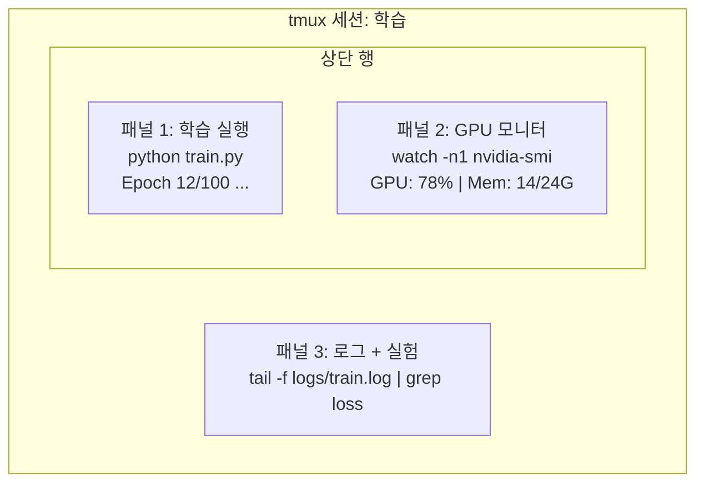

# 터미널 및 셸

> 터미널은 AI 엔지니어가 생활하는 곳입니다. 여기서 편안함을 느껴 보세요.

**유형:** Learn
**언어:** --
**선수 요건:** 0단계, 01강
**시간:** 약 35분

## 학습 목표

- 파이핑, 리다이렉트 및 `grep`을 사용하여 명령줄에서 학습 로그를 필터링하고 처리해 보세요
- 동시 학습 및 GPU 모니터링을 위해 여러 패널을 가진 영속적인 tmux 세션을 생성해 보세요
- `htop`, `nvtop` 및 `nvidia-smi`를 사용하여 시스템 및 GPU 자원을 모니터링해 보세요
- SSH, `scp` 및 `rsync`를 사용하여 로컬 및 원격 머신 간에 파일을 전송해 보세요

## 문제점

터미널에서 보내는 시간은 어떤 에디터에서 보내는 시간보다 많습니다. 학습 실행, GPU 모니터링, 로그 추적, 원격 SSH 세션, 환경 관리. 모든 AI 워크플로우는 셸을 거칩니다. 여기서 느리면 모든 곳에서 느려집니다.

이 강의는 AI 작업에 중요한 터미널 기술을 다룹니다. Unix의 역사에 대한 내용은 없습니다. Bash 스크립팅에 대한 심층적인 내용도 없습니다. 필요한 것만 다룹니다.

## 개념



세 가지가 동시에 실행 중입니다. 하나의 터미널에서요. 분리(detach)하여 집으로 돌아가고, SSH로 다시 접속하여 재연결(reattach)할 수 있습니다. 학습은 계속 실행됩니다.

```figure
s0-shell-pipeline
```

## 구현하기

### 1단계: 셸을 파악하세요

실행 중인 셸을 확인하세요:

```bash
echo $SHELL
```

대부분의 시스템은 `bash` 또는 `zsh`를 사용합니다. 둘 다 잘 작동합니다. 이 과정의 명령은 둘 중 어느 쪽에서도 작동합니다.

알아야 할 주요 사항:

```bash
# 이동하기
cd ~/projects/ai-engineering-from-scratch
pwd
ls -la

# 히스토리 검색 (가장 유용한 단축키)
# Ctrl+R을 누른 후 이전 명령의 일부 입력
# Ctrl+R을 다시 눌러 매칭 항목 순환

# 터미널 지우기
clear   # 또는 Ctrl+L

# 실행 중인 명령 취소
# Ctrl+C

# 실행 중인 명령 일시 정지 (fg로 재개)
# Ctrl+Z
```

### 2단계: 파이프와 리다이렉트

파이프는 명령을 서로 연결합니다. 로그 처리, 출력 필터링, 도구 체이닝은 이렇게 수행합니다. 이 기능은 매우 자주 사용하게 됩니다.

```bash
# 로그에서 "loss"가 몇 번 나타나는지 세기
cat train.log | grep "loss" | wc -l

# 학습 출력에서 손실(loss) 값만 추출
grep "loss:" train.log | awk '{print $NF}' > losses.txt

# 로그 파일이 실시간으로 업데이트되는 것을 모니터링하며 오류 필터링
tail -f train.log | grep --line-buffered "ERROR"

# 최종 정확도 순으로 실험 정렬
grep "final_accuracy" results/*.log | sort -t= -k2 -n -r

# stdout와 stderr를 각각 다른 파일로 리다이렉트
python train.py > output.log 2> errors.log

# 둘 다 같은 파일로 리다이렉트
python train.py > train_full.log 2>&1
```

필요한 세 가지 리다이렉트:

| 기호 | 기능 |
|--------|-------------|
| `>` | stdout를 파일에 쓰기 (덮어쓰기) |
| `>>` | stdout를 파일에 추가 |
| `2>` | stderr를 파일에 쓰기 |
| `2>&1` | stderr를 stdout와 같은 위치로 보내기 |
| `\|` | 한 명령의 stdout를 다음 명령의 stdin으로 보내기 |

### 3단계: 백그라운드 프로세스

학습은 수 시간이 걸립니다. 터미널을 계속 열어두지 않아도 됩니다.

```bash
# 백그라운드에서 실행 (출력은 터미널로 계속 전송)
python train.py &

# 백그라운드에서 실행, 종료 신호에 면역 (터미널을 닫아도 종료되지 않음)
nohup python train.py > train.log 2>&1 &

# 백그라운드에서 실행 중인 작업 확인
jobs
ps aux | grep train.py

# 백그라운드 작업을 포그라운드로 가져오기
fg %1

# 백그라운드 프로세스 종료
kill %1
# 또는 PID를 찾아서 종료
kill $(pgrep -f "train.py")
```

`&`, `nohup`, `screen`/`tmux`의 차이:

| 방법 | 터미널 종료 후에도 살아남는가? | 재연결 가능한가? |
|--------|-------------------------|---------------|
| `command &` | 아니요 | 아니요 |
| `nohup command &` | 예 | 아니요 (로그 파일 확인) |
| `screen` / `tmux` | 예 | 예 |

몇 분 이상 걸리는 작업에는 tmux를 사용하세요.

### 4단계: tmux

tmux는 여러 패널을 가진 영구적인 터미널 세션을 생성할 수 있습니다. 이는 학습 실행을 관리하는 데 가장 유용한 도구입니다.

```bash
# 설치
# macOS
brew install tmux
# Ubuntu
sudo apt install tmux

# 이름이 지정된 세션 시작
tmux new -s training

# 수평 분할
# Ctrl+B 후 "

# 수직 분할
# Ctrl+B 후 %

# 패널 간 이동
# Ctrl+B 후 화살표 키

# 분리 (세션은 계속 실행됨)
# Ctrl+B 후 d

# 재연결
tmux attach -t training

# 세션 목록 표시
tmux ls

# 세션 종료
tmux kill-session -t training
```

일반적인 AI 워크플로우 세션:

```bash
tmux new -s train

# 패널 1: 학습 시작
python train.py --epochs 100 --lr 1e-4

# Ctrl+B, "로 분할한 후 GPU 모니터 실행
watch -n1 nvidia-smi

# Ctrl+B, %로 수직 분할한 후 로그를 꼬리(tail)로 보기
tail -f logs/experiment.log

# 이제 Ctrl+B, d로 분리하세요
# SSH로 나가고, 커피를 마신 후 돌아오세요
# tmux attach -t train
```

### 5단계: htop과 nvtop으로 모니터링

```bash
# 시스템 프로세스 (top보다 더 좋음)
htop

# GPU 프로세스 (NVIDIA GPU가 있는 경우)
# 설치: sudo apt install nvtop (Ubuntu) 또는 brew install nvtop (macOS)
nvtop

# nvtop 없이 빠른 GPU 확인
nvidia-smi

# GPU 사용량이 매초 업데이트되는 것을 확인하세요
watch -n1 nvidia-smi

# GPU를 사용하는 프로세스를 확인하세요
nvidia-smi --query-compute-apps=pid,name,used_memory --format=csv
```

`htop`에서 사용하는 주요 키 바인딩:
- `F6` 또는 `>`를 사용하여 열 순으로 정렬 (메모리 누수를 찾기 위해 메모리 순으로 정렬)
- `F5`를 사용하여 트리 보기 전환 (자식 프로세스 확인)
- `F9`를 사용하여 프로세스 종료
- `/`를 사용하여 프로세스 이름 검색

### 6단계: 원격 GPU 서버에 SSH로 접속하기

클라우드 GPU(Lambda, RunPod, Vast.ai)를 대여할 때 SSH로 연결합니다.

```bash
# 기본 연결
ssh user@gpu-box-ip

# 특정 키를 사용하여 연결
ssh -i ~/.ssh/my_gpu_key user@gpu-box-ip

# 원격 서버로 파일 복사
scp model.pt user@gpu-box-ip:~/models/

# 원격 서버에서 파일 복사
scp user@gpu-box-ip:~/results/metrics.json ./

# 전체 디렉터리 동기화 (많은 파일에 대해 더 빠름)
rsync -avz ./data/ user@gpu-box-ip:~/data/

# 포트 포워딩 (원격 Jupyter/TensorBoard를 로컬에서 접근)
ssh -L 8888:localhost:8888 user@gpu-box-ip
# 이제 브라우저에서 localhost:8888을 열어 보세요

# 편리함을 위한 SSH 설정
# ~/.ssh/config에 추가:
# Host gpu
#     HostName 192.168.1.100
#     User ubuntu
#     IdentityFile ~/.ssh/gpu_key
#
# 이후에는 단순히:
# ssh gpu
```

### 7단계: AI 작업을 위한 유용한 별칭

`~/.bashrc` 또는 `~/.zshrc`에 다음을 추가하세요:

```bash
source phases/00-setup-and-tooling/10-terminal-and-shell/code/shell_aliases.sh
```

원하는 별칭만 복사해도 됩니다. 주요 별칭:

```bash
# GPU 상태를 한눈에 보기
alias gpu='nvidia-smi --query-gpu=index,name,utilization.gpu,memory.used,memory.total,temperature.gpu --format=csv,noheader'

# 모든 Python 학습 프로세스 종료
alias killtraining='pkill -f "python.*train"'

# 가상 환경 빠른 활성화
alias ae='source .venv/bin/activate'

# 학습 손실(loss) 모니터링
alias watchloss='tail -f logs/*.log | grep --line-buffered "loss"'
```

전체 별칭 목록은 `code/shell_aliases.sh`를 참고하세요.

### 8단계: AI 터미널의 일반적인 패턴

실무에서 반복적으로 나타나는 패턴입니다:

```bash
# 훈련을 실행하고, 모든 것을 기록하며, 완료되면 알림을 보내세요
python train.py 2>&1 | tee train.log; echo "DONE" | mail -s "Training complete" you@email.com

# 두 실험 로그를 나란히 비교해 보세요
diff <(grep "accuracy" exp1.log) <(grep "accuracy" exp2.log)

# 가장 큰 모델 파일을 찾아 디스크 공간을 정리해 보세요
find . -name "*.pt" -o -name "*.safetensors" | xargs du -h | sort -rh | head -20

# Hugging Face에서 모델을 다운로드해 보세요
wget https://huggingface.co/model/resolve/main/model.safetensors

# 데이터셋을 tar로 압축 해제해 보세요
tar xzf dataset.tar.gz -C ./data/

# 모든 Python 파일의 줄 수를 세어 프로젝트의 크기를 확인해 보세요
find . -name "*.py" | xargs wc -l | tail -1

# 디스크 공간을 점검해 보세요 (훈련 데이터는 디스크를 빠르게 채웁니다)
df -h
du -sh ./data/*

# 훈련 전 환경 변수를 점검해 보세요
env | grep -i cuda
env | grep -i torch
```

## 사용하기

이 과정 동안 각 도구가 언제 사용되는지 설명합니다:

| 도구 | 사용 시점 |
|------|----------------|
| tmux | 모든 훈련 실행 (3단계 이상) |
| `tail -f` + `grep` | 훈련 로그 모니터링 |
| `nohup` / `&` | 빠른 백그라운드 작업 |
| `htop` / `nvtop` | 느린 훈련, OOM 오류 디버깅 |
| SSH + `rsync` | 클라우드 GPU 작업 |
| 파이프 및 리다이렉트 | 실험 결과 처리 |
| 별칭 | 반복적인 명령어 시간 절약 |

## 연습 문제

1. tmux를 설치하고 세 개의 패널이 있는 세션을 만들어, 한 패널에서 `htop`를, 다른 패널에서 `watch -n1 date`를, 세 번째 패널에서 Python 스크립트를 실행하세요. 분리(detach)하고 다시 연결(reattach)해 보세요.
2. `code/shell_aliases.sh`의 별칭을 셸 설정에 추가하고 `source ~/.zshrc` (또는 `~/.bashrc`)로 다시 로드하세요.
3. `for i in $(seq 1 100); do echo "epoch $i loss: $(echo "scale=4; 1/$i" | bc)"; sleep 0.1; done > fake_train.log`를 사용하여 가짜 훈련 로그를 만든 후, `grep`, `tail`, `awk`를 사용하여 손실 값만 추출해 보세요.
4. 접근 권한이 있는 서버의 SSH 설정 항목을 만들어 보세요 (또는 `localhost`를 사용하여 구문을 연습해 보세요).

## 핵심 용어

| 용어 | 사람들이 말하는 표현 | 실제 의미 |
|------|----------------|----------------------|
| 셸 | "터미널" | 명령어를 해석하는 프로그램 (bash, zsh, fish) |
| tmux | "터미널 멀티플렉서" | 하나의 창에서 여러 터미널 세션을 실행하고 분리/재연결할 수 있게 해주는 프로그램 |
| 파이프 | "막대 기호" | 한 명령의 출력을 다른 명령의 입력으로 보내는 `\|` 연산자 |
| PID | "프로세스 ID" | 모든 실행 중인 프로세스에 할당된 고유 번호로, 모니터링이나 종료에 사용됨 |
| nohup | "No hangup" | 종료 신호에 면역인 명령을 실행하므로, 터미널을 닫아도 프로세스가 종료되지 않습니다 |
| SSH | "서버에 연결" | Secure Shell, 원격 머신에서 명령을 실행하기 위한 암호화 프로토콜 |
