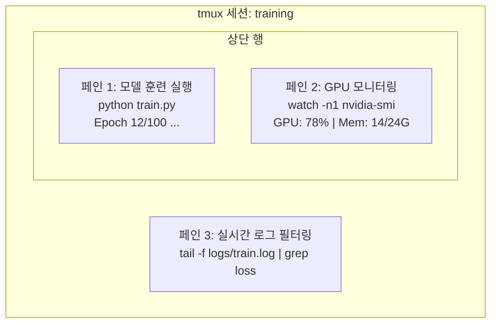

# 터미널과 쉘 활용 (Terminal & Shell)

> 터미널은 AI 엔지니어가 가장 많은 시간을 보내는 공간입니다. 여기서 편안해져야 합니다.

**Type:** Learn
**Languages:** --
**Prerequisites:** Phase 0, Lesson 01
**Time:** ~35 minutes

## 학습 목표 (Learning Objectives)

- 파이프(`|`), 리다이렉션(`>`, `>>`), `grep`을 사용하여 커맨드라인에서 훈련 로그를 필터링하고 가공합니다.
- 모델 훈련과 GPU 모니터링을 동시에 수행할 수 있도록 멀티 페인을 갖춘 영구 세션(tmux)을 생성하고 관리합니다.
- `htop`, `nvtop`, `nvidia-smi`를 활용하여 시스템 및 GPU 자원 사용량을 실시간으로 모니터링합니다.
- SSH, `scp`, `rsync`를 사용해 로컬 컴퓨터와 원격 GPU 서버 간에 안전하게 파일을 전송하고 동기화합니다.

## 문제 상황 (The Problem)

AI 엔지니어는 어떤 에디터보다 터미널 안에서 더 많은 시간을 보냅니다. 모델 훈련 실행, GPU 자원 모니터링, 실시간 로그 추적, 원격 SSH 접속, 가상 환경 관리 등 모든 AI 워크플로가 쉘을 통과합니다. 터미널 조작이 느리면 전체 개발 속도가 느려집니다.

이 레슨에서는 AI 실무에 필수적인 핵심 터미널 기술만 압축하여 다룹니다.

## 핵심 개념 (The Concept)



단 하나의 터미널 창 안에서 3개의 작업이 동시에 실행됩니다. 언제든 세션에서 분리(detach)하여 터미널을 닫고 퇴근한 뒤, 집에서 다시 SSH로 원격 접속하여 원래 세션(attach)으로 돌아와도 훈련은 멈추지 않고 계속 실행됩니다.

```figure
s0-shell-pipeline
```

## 구현하기 (Build It)

### Step 1: 기본 쉘 탐색

현재 실행 중인 쉘 확인:

```bash
echo $SHELL
```

대부분 `bash` 또는 `zsh`를 사용하며 본 코스의 모든 명령어는 둘 다 호환됩니다.

필수 조작:
- `cd`, `pwd`, `ls -la`: 디렉터리 이동 및 목록 확인
- `Ctrl+R`: 커맨드 히스토리 역방향 검색 (가장 중요한 단축키)
- `clear` 또는 `Ctrl+L`: 화면 지우기
- `Ctrl+C`: 현재 실행 중인 프로세스 강제 종료
- `Ctrl+Z`: 현재 프로세스 일시 정지 (백그라운드 전환 후 `fg`로 재개)

### Step 2: 파이프(`|`)와 리다이렉션(`>`, `>>`)

파이프는 명령어의 출력을 다음 명령어의 입력으로 연결합니다. 로그 분석과 도구 체이닝에 매일 쓰입니다.

```bash
# 로그 파일에서 "loss"가 등장한 횟수 계산
cat train.log | grep "loss" | wc -l

# 훈련 로그에서 손실(loss) 값만 추출하여 파일로 저장
grep "loss:" train.log | awk '{print $NF}' > losses.txt

# 로그 파일을 실시간으로 추적하며 ERROR 문구만 필터링
tail -f train.log | grep --line-buffered "ERROR"

# 실험 결과 파일들을 정확도 순으로 역정렬
grep "final_accuracy" results/*.log | sort -t= -k2 -n -r

# 표준 출력(stdout)과 에러 출력(stderr)을 별도 파일로 분리 저장
python train.py > output.log 2> errors.log

# 표준 출력과 에러 출력을 하나의 파일로 통합 저장
python train.py > train_full.log 2>&1
```

핵심 리다이렉션 기호:

| 기호 | 역할 |
|--------|-------------|
| `>` | 표준 출력을 파일에 덮어쓰기 (Overwrite) |
| `>>` | 표준 출력을 파일 끝에 추가하기 (Append) |
| `2>` | 표준 에러(stderr)를 파일에 저장 |
| `2>&1` | 표준 에러를 표준 출력 대상과 동일한 곳으로 전달 |
| `\|` | 앞 명령어의 출력을 뒷 명령어의 입력으로 전달 |

### Step 3: 백그라운드 프로세스 관리

대규모 모델 훈련은 몇 시간씩 걸립니다. 터미널 창을 계속 켜둘 필요가 없습니다.

```bash
# 백그라운드 실행 (터미널 닫으면 종료됨)
python train.py &

# 터미널을 닫아도 죽지 않는 백그라운드 실행
nohup python train.py > train.log 2>&1 &

# 백그라운드 작업 확인
jobs
ps aux | grep train.py

# 백그라운드 작업을 포그라운드로 가져오기
fg %1

# 프로세스 종료
kill %1
# 또는 PID 직접 지정 종료
kill $(pgrep -f "train.py")
```

| 방식 | 터미널 닫혀도 유지? | 다시 창으로 돌아오기(Reattach)? |
|--------|-------------------------|---------------|
| `command &` | 아니오 | 아니오 |
| `nohup command &` | 예 | 아니오 (로그 파일로 확인) |
| `tmux` | 예 | **예 (완벽 지원)** |

몇 분 이상 걸리는 작업은 **tmux**를 사용하는 것이 정답입니다.

### Step 4: tmux 활용법

```bash
# 설치
# macOS: brew install tmux
# Ubuntu: sudo apt install tmux

# 이름 지정하여 새 세션 시작
tmux new -s training

# 상하 화면 분할: Ctrl+B 누른 후 "
# 좌우 화면 분할: Ctrl+B 누른 후 %
# 페인 간 이동: Ctrl+B 누른 후 방향키
# 세션 유지한 채 분리(Detach): Ctrl+B 누른 후 d

# 분리된 세션으로 다시 진입 (Reattach)
tmux attach -t training

# 세션 목록 조회
tmux ls

# 세션 종료
tmux kill-session -t training
```

### Step 5: htop과 nvtop 모니터링

```bash
# CPU 및 메모리 프로세스 모니터링
htop

# GPU 프로세스 및 VRAM 모니터링
nvtop

# 1초마다 갱신되는 GPU 상태 확인
watch -n1 nvidia-smi

# 어떤 프로세스가 GPU를 점유하고 있는지 확인
nvidia-smi --query-compute-apps=pid,name,used_memory --format=csv
```

### Step 6: 원격 GPU 서버 SSH 접속 및 파일 전송

```bash
# 기본 접속
ssh user@gpu-box-ip

# 원격 서버로 단일 파일 복사
scp model.pt user@gpu-box-ip:~/models/

# 원격 서버에서 파일 내려받기
scp user@gpu-box-ip:~/results/metrics.json ./

# 디렉터리 동기화 (대용량 파일이나 많은 파일 전송 시 추천)
rsync -avz ./data/ user@gpu-box-ip:~/data/

# 포트 포워딩 (원격지의 Jupyter나 TensorBoard를 로컬 브라우저로 열기)
ssh -L 8888:localhost:8888 user@gpu-box-ip
```

`~/.ssh/config`에 별칭을 등록하면 매번 IP와 키 경로를 칠 필요 없이 `ssh gpu`로 즉시 접속할 수 있습니다.

### Step 7: 유용한 AI 쉘 단축어 (Alias)

`code/shell_aliases.sh` 내용을 `~/.bashrc` 또는 `~/.zshrc`에 추가해 사용하세요:

```bash
# GPU 상태 한 줄 요약
alias gpu='nvidia-smi --query-gpu=index,name,utilization.gpu,memory.used,memory.total,temperature.gpu --format=csv,noheader'

# 모든 파이썬 훈련 프로세스 일괄 종료
alias killtraining='pkill -f "python.*train"'

# 가상 환경 원클릭 활성화
alias ae='source .venv/bin/activate'

# 실시간 손실(loss) 모니터링
alias watchloss='tail -f logs/*.log | grep --line-buffered "loss"'
```

## 실무 활용 (Use It)

| 도구 | 사용 시점 |
|------|----------------|
| tmux | 장시간 모델 훈련 실행 시 (Phase 3 이후 필수) |
| `tail -f` + `grep` | 훈련 진행 상황 및 에러 로그 실시간 감시 |
| `htop` / `nvtop` | 느린 훈련 루프 병목 및 OOM(메모리 부족) 에러 분석 |
| SSH + `rsync` | 클라우드 GPU 인스턴스 파일 전송 및 동기화 |
| 파이프 + 리다이렉션 | 실험 지표 및 로그 데이터 추출 가공 |

## 실습 과제 (Exercises)

1. tmux를 설치하고 3개 페인으로 분할하여 한쪽엔 `htop`, 다른 쪽엔 `watch -n1 date`, 마지막 쪽엔 파이썬 스크립트를 띄운 후 detach/attach를 연습해 보세요.
2. `code/shell_aliases.sh`에 정의된 별칭을 본인의 쉘 설정 파일에 추가하고 `source ~/.zshrc`로 적용해 보세요.
3. 100회 루프를 돌며 가상의 손실 로그를 출력하는 쉘 스크립트를 작성하고, `grep`과 `awk`를 사용해 손실 수치만 별도 텍스트 파일로 추출해 보세요.
4. 자주 접속하는 서버(또는 연습용 localhost)를 `~/.ssh/config`에 등록하고 별칭으로 접속해 보세요.

## 핵심 용어 정리 (Key Terms)

| 용어 | 흔히 하는 표현 | 실제 의미 |
|------|----------------|----------------------|
| 쉘 (Shell) | "터미널" | 사용자가 입력한 명령어를 해석하여 OS 커널에 전달하는 인터페이스 프로그램 (bash, zsh 등) |
| tmux | "터미널 분할 도구" | 단일 창에서 여러 세션을 분할 관리하고, 백그라운드 유지 및 재접속을 지원하는 터미널 다중화 도구 |
| 파이프 (Pipe) | "막대기 기호 (`\|`)" | 한 프로세스의 출력 결과를 다른 프로세스의 입력으로 곧바로 연결해 주는 IPC 메커니즘 |
| PID | "프로세스 번호" | 운영체제가 실행 중인 각 프로세스를 식별하기 위해 부여하는 고유 정수 ID |
| nohup | "종료 방지" | 터미널 종료 신호(SIGHUP)를 무시하여 백그라운드 작업이 계속 실행되도록 보장하는 명령어 |
| SSH | "서버 원격 접속" | 원격 머신에 안전하게 암호화 통신으로 접속하여 명령을 수행하는 네트워크 프로토콜 |
