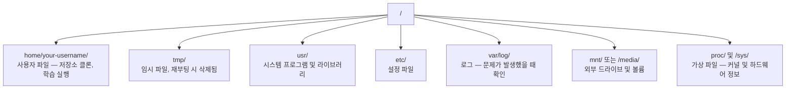

# AI를 위한 Linux

> 대부분의 AI는 Linux에서 실행됩니다. 막히지 않을 만큼 충분히 알아야 합니다.

**유형:** Learn
**언어:** --
**선수 요건:** 0단계, 01강
**시간:** 약 30분

## 학습 목표

- Linux 파일 시스템을 탐색하고 명령줄에서 필수적인 파일 작업을 수행합니다
- `chmod`과 `chown`을 사용하여 파일 권한을 관리하고 "Permission denied" 오류를 해결합니다
- `apt`을 사용하여 시스템 패키지를 설치하고 AI 작업을 위해 새로운 GPU 장비를 설정합니다
- 원격 머신에서 작업하는 개발자들이 자주 겪는 macOS와 Linux의 차이점을 식별합니다

## 문제점

macOS나 Windows에서 개발합니다. 하지만 클라우드 GPU 장비에 SSH로 접속하거나, Lambda 인스턴스를 대여하거나, EC2 머신을 띄우면 Ubuntu에 도착합니다. 터미널이 유일한 인터페이스입니다. Finder도, Explorer도, GUI도 없습니다. 파일 시스템을 탐색하고, 패키지를 설치하고, 명령줄에서 프로세스를 관리할 수 없다면, "Linux에서 파일을 압축 해제하는 방법"을 구글링하느라 유휴 GPU 시간을 낭비하며 비용을 지불하게 됩니다.

이것은 생존 가이드입니다. AI 작업을 위해 원격 Linux 머신에서 작동하는 데 필요한 것만 정확히 다룹니다. 그 이상은 없습니다.

## 파일 시스템 구조

Linux는 모든 것을 단일 루트 `/` 아래에 조직합니다. `C:\`이나 `/Volumes`는 없습니다. 실제로 만지게 될 디렉토리는 다음과 같습니다:



홈 디렉토리는 `~` 또는 `/home/your-username`입니다. 거의 모든 작업이 여기서 이루어집니다.

## 필수 명령어

이 15개 명령어는 원격 GPU 장비에서 수행하는 작업의 95%를 커버합니다.

### 이동하기

```bash
pwd                         # 현재 위치는 어디일까요?
ls                          # 여기에는 무엇이 있을까요?
ls -la                      # 여기에는 무엇이 있으며, 숨겨진 파일의 세부 정보도 포함하나요?
cd /path/to/dir             # 거기로 이동
cd ~                        # 홈으로 이동
cd ..                       # 한 단계 위로 이동
```

### 파일 및 디렉터리

```bash
mkdir my-project            # 디렉터리 생성
mkdir -p a/b/c              # 한 번에 중첩 디렉터리 생성

cp file.txt backup.txt      # 파일 복사
cp -r src/ src-backup/      # 디렉터리 복사 (재귀)

mv old.txt new.txt          # 파일 이름 변경
mv file.txt /tmp/           # 파일 이동

rm file.txt                 # 파일 삭제 (휴지통 없음, 완전히 삭제됨)
rm -rf my-dir/              # 디렉터리 및 내부 모든 항목 삭제
```

`rm -rf`는 영구적입니다. 되돌릴 수 없습니다. Enter를 누르기 전에 경로를 다시 확인하세요.

### 파일 읽기

```bash
cat file.txt                # 파일 전체 출력
head -20 file.txt           # 첫 20줄
tail -20 file.txt           # 마지막 20줄
tail -f log.txt             # 로그 파일을 실시간으로 추적 (Ctrl+C로 중지)
less file.txt               # 파일 스크롤 (q로 종료)
```

### 검색

```bash
grep "error" training.log           # "error"가 포함된 줄 찾기
grep -r "learning_rate" .           # 현재 디렉터리의 모든 파일 검색
grep -i "cuda" config.yaml          # 대소문자 구분 없는 검색

find . -name "*.py"                 # 현재 디렉터리 아래 모든 Python 파일 찾기
find . -name "*.ckpt" -size +1G     # 1GB보다 큰 체크포인트(Checkpoint) 파일 찾기
```

## 권한

Linux의 모든 파일은 소유자와 권한 비트를 가집니다. 스크립트가 실행되지 않거나 디렉터리에 쓸 수 없을 때 이 문제를 겪게 됩니다.

```bash
ls -l train.py
# -rwxr-xr-- 1 user group 2048 Mar 19 10:00 train.py
#  ^^^             소유자 권한: 읽기, 쓰기, 실행
#     ^^^          그룹 권한: 읽기, 실행
#        ^^        기타 모든 사용자: 읽기 전용
```

공통 해결 방법:

```bash
chmod +x train.sh           # 스크립트를 실행 가능하게 만들기
chmod 755 deploy.sh         # 소유자: 전체 권한, 기타 사용자: 읽기+실행
chmod 644 config.yaml       # 소유자: 읽기+쓰기, 기타 사용자: 읽기 전용

chown user:group file.txt   # 파일 소유자 변경 (sudo 필요)
```

"Permission denied" 메시지가 표시되면 거의 항상 권한 문제입니다. `chmod +x` 또는 `sudo`로 대부분의 경우를 해결할 수 있습니다.

## 패키지 관리 (apt)

Ubuntu는 `apt`를 사용합니다. 시스템 수준의 소프트웨어를 설치하는 방법입니다.

```bash
sudo apt update             # 패키지 목록 업데이트 (항상 먼저 수행하세요)
sudo apt install -y htop    # 패키지 설치 (-y는 확인 생략)
sudo apt install -y build-essential  # C 컴파일러, make 등. 많은 Python 패키지에 필요합니다
sudo apt install -y tmux    # 터미널 멀티플렉서 (연결 끊김 후에도 세션 유지)

apt list --installed        # 설치된 패키지 확인
sudo apt remove htop        # 제거
```

새 GPU 서버에 설치할 공통 패키지:

```bash
sudo apt update && sudo apt install -y \
    build-essential \
    git \
    curl \
    wget \
    tmux \
    htop \
    unzip \
    python3-venv
```

## 사용자와 sudo

일반적으로 일반 사용자로 로그인되어 있습니다. 일부 작업은 root(관리자) 권한이 필요합니다.

```bash
whoami                      # 현재 사용자 확인
sudo command                # root 권한으로 단일 명령 실행
sudo su                     # root로 전환 (exit로 복귀, sparingly 사용)
```

클라우드 GPU 인스턴스에서는 일반적으로 유일한 사용자이며 이미 sudo 권한을 가지고 있습니다. 모든 것을 root로 실행하지 마세요. 필요할 때만 sudo를 사용하세요.

## 프로세스와 systemd

학습이 멈추거나 실행 중인 프로세스를 확인해야 할 때:

```bash
htop                        # 인터랙티브 프로세스 뷰어 (q로 종료)
ps aux | grep python        # 실행 중인 Python 프로세스 찾기
kill 12345                  # PID 12345 프로세스를 우아하게(stop gracefully) 종료
kill -9 12345               # 강제 종료 (우아한 종료가 작동하지 않을 때 사용)
nvidia-smi                  # GPU 프로세스 및 메모리 사용량
```

systemd는 서비스(백그라운드 데몬)를 관리합니다. 추론 서버를 실행할 경우 사용하게 됩니다:

```bash
sudo systemctl start nginx          # 서비스 시작
sudo systemctl stop nginx           # 서비스 중지
sudo systemctl restart nginx        # 서비스 재시작
sudo systemctl status nginx         # 실행 중인지 확인
sudo systemctl enable nginx         # 부팅 시 자동 시작
```

## 디스크 공간

GPU 박스는 디스크 공간이 제한적인 경우가 많습니다. 모델과 데이터셋이 공간을 빠르게 채웁니다.

```bash
df -h                       # 마운트된 모든 드라이브의 디스크 사용량
df -h /home                 # /home의 디스크 사용량

du -sh *                    # 현재 디렉토리의 각 항목 크기
du -sh ~/.cache             # 캐시 크기 (pip, huggingface 모델이 여기에 저장됩니다)
du -sh /data/checkpoints/   # 체크포인트(Checkpoint)의 크기를 확인

# 가장 큰 공간 점유자 찾기
du -h --max-depth=1 / 2>/dev/null | sort -hr | head -20
```

공통적인 공간 절약 방법:

```bash
# pip 캐시 지우기
pip cache purge

# apt 캐시 지우기
sudo apt clean

# 필요하지 않은 오래된 체크포인트(Checkpoint) 제거
rm -rf checkpoints/epoch_01/ checkpoints/epoch_02/
```

## 네트워킹

명령줄에서 모델을 다운로드하고, 파일을 전송하며, API를 호출합니다.

```bash
# 파일 다운로드
wget https://example.com/model.bin                   # 파일 다운로드
curl -O https://example.com/data.tar.gz              # curl로 동일한 작업 수행
curl -s https://api.example.com/health | python3 -m json.tool  # API 호출, JSON 예쁘게 출력

# 머신 간 파일 전송
scp model.bin user@remote:/data/                     # 파일을 원격 머신으로 복사
scp user@remote:/data/results.csv .                  # 파일을 원격에서 로컬로 복사
scp -r user@remote:/data/checkpoints/ ./local-dir/   # 디렉토리 복사

# 디렉토리 동기화 (대규모 전송 시 scp보다 빠르며, 실패 시 재개 가능)
rsync -avz --progress ./data/ user@remote:/data/
rsync -avz --progress user@remote:/results/ ./results/
```

대용량 파일에는 `scp` 대신 `rsync`을 사용하세요. 변경된 바이트만 전송하며 연결이 끊어졌을 때 처리합니다.

## tmux: 세션 유지

원격 박스에 SSH로 접속할 때, 노트북을 닫으면 훈련 실행이 종료됩니다. tmux는 이를 방지합니다.

```bash
tmux new -s train           # "train"이라는 이름의 새 세션 시작
# ... 훈련을 시작한 후:
# Ctrl+B, 그 다음 D            # 분리 (훈련은 계속 실행됨)

tmux ls                     # 세션 목록 표시
tmux attach -t train        # 세션에 재연결

# tmux 내부에서:
# Ctrl+B, 그 다음 %            # 창을 수직으로 분할
# Ctrl+B, 그 다음 "            # 창을 수평으로 분할
# Ctrl+B, 그 다음 화살표 키   # 창 간 전환
```

긴 학습 작업은 항상 tmux 내부에서 실행하세요. 항상입니다.

## Windows 사용자를 위한 WSL2

Windows를 사용 중이라면, WSL2는 듀얼 부팅 없이 실제 Linux 환경을 제공합니다.

```bash
# PowerShell (관리자 권한)에서
wsl --install -d Ubuntu-24.04

# 재시작 후, 시작 메뉴에서 Ubuntu를 열기
sudo apt update && sudo apt upgrade -y
```

WSL2는 실제 Linux 커널을 실행합니다. 이 강의의 모든 내용은 그 안에서 작동합니다. Windows 파일은 WSL 내부에서 `/mnt/c/Users/YourName/`에 위치합니다.

GPU 패스스루는 Windows 쪽에 NVIDIA 드라이버가 설치되어 있어야 작동합니다. Windows NVIDIA 드라이버(Linux용이 아닌)를 설치하면, WSL2 내부에서 CUDA를 사용할 수 있습니다.

## 주의 사항: macOS에서 Linux로

macOS에서 온 경우 발목을 잡을 수 있는 것들:

| macOS | Linux | 비고 |
|-------|-------|-------|
| `brew install` | `sudo apt install` | 패키지 이름이 때때로 다릅니다. `brew install htop`와 `sudo apt install htop`는 동일하게 작동하지만, `brew install readline`와 `sudo apt install libreadline-dev`는 그렇지 않습니다. |
| `open file.txt` | `xdg-open file.txt` | 하지만 원격 서버에서는 GUI가 없습니다. `cat` 또는 `less`를 사용하세요. |
| `pbcopy` / `pbpaste` | 사용 불가 | SSH를 통해 클립보드와 파이프하는 기능은 존재하지 않습니다. |
| `~/.zshrc` | `~/.bashrc` | macOS는 기본 셸이 zsh입니다. 대부분의 Linux 서버는 bash를 사용합니다. |
| `/opt/homebrew/` | `/usr/bin/`, `/usr/local/bin/` | 바이너리 파일이 다른 위치에 있습니다. |
| `sed -i '' 's/a/b/' file` | `sed -i 's/a/b/' file` | macOS의 sed는 `-i` 뒤에 빈 문자열이 필요합니다. Linux는 필요하지 않습니다. |
| 대소문자 구분 없는 파일 시스템 | 대소문자 구분하는 파일 시스템 | Linux에서는 `Model.py`과 `model.py`가 서로 다른 두 파일입니다. |
| 줄 끝 `\n` | 줄 끝 `\n` | 동일합니다. 하지만 Windows는 `\r\n`를 사용하며, 이는 bash 스크립트를 깨뜨립니다. `dos2unix`를 실행하여 수정하세요. |

## 빠른 참조 카드

```
Navigation:     pwd, ls, cd, find
Files:          cp, mv, rm, mkdir, cat, head, tail, less
Search:         grep, find
Permissions:    chmod, chown, sudo
Packages:       apt update, apt install
Processes:      htop, ps, kill, nvidia-smi
Services:       systemctl start/stop/restart/status
Disk:           df -h, du -sh
Network:        curl, wget, scp, rsync
Sessions:       tmux new/attach/detach
```

```figure
s0-process-fork
```

## 연습 문제

1. 임의 Linux 머신에 SSH로 접속하거나(또는 WSL2를 열고) 홈 디렉토리로 이동하세요. 프로젝트 폴더를 만들고, `touch`를 사용하여 그 안에 빈 파일 세 개를 만든 후, `ls -la`로 나열해 보세요.
2. apt로 `htop`을 설치하고 실행하여, 가장 많은 메모리를 사용하는 프로세스를 확인해 보세요.
3. tmux 세션을 시작하고 그 안에서 `sleep 300`을 실행한 후, 세션을 분리(detach)하고 목록을 나열한 뒤 다시 연결(reattach)해 보세요.
4. `df -h`을 사용하여 사용 가능한 디스크 공간을 확인한 후, `du -sh ~/.cache/*`을 사용하여 캐시에서 공간을 차지하는 항목을 찾아보세요.
5. `scp`을 사용하여 로컬 머신에서 원격 머신으로 파일을 전송한 후, `rsync`을 사용하여 동일한 전송을 수행하고 경험을 비교해 보세요.
