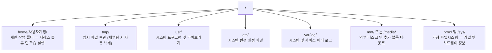

# AI 엔지니어를 위한 리눅스 (Linux for AI)

> 대부분의 AI 워크로드는 Linux 위에서 동작합니다. 막힘없이 작업할 수 있을 정도의 필수 지식은 갖추어야 합니다.

**Type:** Learn
**Languages:** --
**Prerequisites:** Phase 0, Lesson 01
**Time:** ~30 minutes

## 학습 목표 (Learning Objectives)

- Linux 파일 시스템 계층 구조를 이해하고 커맨드라인에서 필수 파일 조작을 능숙하게 수행합니다.
- `chmod`와 `chown`을 사용하여 파일 권한을 관리하고 "Permission denied" 에러를 해결합니다.
- `apt` 패키지 관리자를 통해 시스템 수준의 필수 소프트웨어를 설치하고 새로운 GPU 서버를 셋업합니다.
- 원격 Linux 머신 작업 시 macOS/Windows 사용자가 자주 겪는 환경 차이점을 식별하고 대처합니다.

## 문제 상황 (The Problem)

평소에는 macOS나 Windows에서 코드를 작성하더라도, 클라우드 GPU 인스턴스(Lambda, EC2, RunPod 등)에 SSH 접속하는 순간 마주하는 환경은 Ubuntu Linux입니다. 터미널이 유일한 인터페이스이며 GUI(탐색기, Finder)는 존재하지 않습니다. 커맨드라인으로 디렉터리를 탐색하고, 패키지를 설치하며, 프로세스를 다루지 못하면 비싼 GPU 대여 요금을 켜둔 채 구글링으로 시간을 낭비하게 됩니다.

이 문서는 원격 Linux GPU 환경에서 생존하고 생산성을 유지하기 위한 실전 가이드입니다.

## 파일 시스템 구조

Linux는 단 하나의 루트(`/`) 아래에 모든 것을 계층형으로 관리합니다(`C:\` 드라이브 개념이 없습니다).



모든 일상적인 작업은 사용자의 홈 디렉터리(`~` 또는 `/home/username`) 안에서 이루어집니다.

## 핵심 필수 명령어

원격 GPU 서버 작업의 95%를 차지하는 필수 명령어들입니다.

### 디렉터리 탐색 및 이동

```bash
pwd                         # 현재 위치 확인
ls                          # 현재 디렉터리 파일 목록
ls -la                      # 숨김 파일 포함 상세 목록 확인
cd /path/to/dir             # 해당 경로로 이동
cd ~                        # 홈 디렉터리로 이동
cd ..                       # 상위 디렉터리로 이동
```

### 파일 및 디렉터리 조작

```bash
mkdir my-project            # 디렉터리 생성
mkdir -p a/b/c              # 하위 디렉터리까지 한 번에 생성

cp file.txt backup.txt      # 파일 복사
cp -r src/ src-backup/      # 디렉터리 전체 복사 (재귀적)

mv old.txt new.txt          # 파일 이름 변경
mv file.txt /tmp/           # 파일 이동

rm file.txt                 # 파일 삭제 (휴지통 없이 즉시 삭제)
rm -rf my-dir/              # 디렉터리와 내부 파일 강제 일괄 삭제
```

`rm -rf`는 실행 취소(Undo)가 불가능하므로 엔터를 누르기 전 경로를 반드시 재확인하세요.

### 파일 내용 확인

```bash
cat file.txt                # 파일 전체 내용 출력
head -20 file.txt           # 파일 앞부분 20줄 출력
tail -20 file.txt           # 파일 뒷부분 20줄 출력
tail -f log.txt             # 로그 파일 실시간 스트리밍 확인 (Ctrl+C로 종료)
less file.txt               # 긴 파일 스크롤 뷰어로 보기 (종료는 q)
```

### 검색

```bash
grep "error" training.log           # "error"가 포함된 행 찾기
grep -r "learning_rate" .           # 현재 디렉터리 내 모든 파일에서 검색
grep -i "cuda" config.yaml          # 대소문자 구분 없이 검색

find . -name "*.py"                 # 모든 파이썬 파일 경로 찾기
find . -name "*.ckpt" -size +1G     # 1GB 이상인 체크포인트 파일 찾기
```

## 파일 권한 관리

Linux의 모든 파일과 디렉터리는 소유자와 접근 권한 비트(읽기 r, 쓰기 w, 실행 x)를 가집니다.

```bash
ls -l train.py
# -rwxr-xr-- 1 user group 2048 Mar 19 10:00 train.py
#  ^^^             소유자 권한: 읽기, 쓰기, 실행 (rwx)
#     ^^^          그룹 권한: 읽기, 실행 (r-x)
#        ^^        기타 사용자 권한: 읽기 전용 (r--)
```

자주 쓰는 권한 변경:

```bash
chmod +x train.sh           # 쉘 스크립트에 실행 권한 부여
chmod 755 deploy.sh         # 소유자 전체, 그 외는 읽기+실행 권한
chmod 644 config.yaml       # 소유자 읽기+쓰기, 그 외는 읽기 전용

chown user:group file.txt   # 소유자/그룹 변경 (sudo 필요)
```

"Permission denied" 오류가 발생하면 대부분 권한 문제입니다. `chmod +x`나 필요 시 `sudo`를 사용하여 해결합니다.

## 패키지 관리 (`apt`)

Ubuntu 계열 시스템은 `apt`를 사용하여 시스템 패키지를 설치합니다:

```bash
sudo apt update             # 패키지 인덱스 최신 갱신 (항상 가장 먼저 실행)
sudo apt install -y htop    # 패키지 설치 (-y는 설치 확인 자동 승인)
sudo apt install -y build-essential  # C 컴파일러 및 빌드 도구 (파이썬 확장 패키지에 필수)
sudo apt install -y tmux    # 터미널 세션 유지 도구
```

새로운 GPU 서버를 대여했을 때 실행하는 필수 패키지 설치:

```bash
sudo apt update && sudo apt install -y \
    build-essential \
    git \
    curl \
    wget \
    tmux \
    htop \
    unzip \
    python3-venv
```

## 프로세스 및 자원 관리

훈련이 멈추었거나 백그라운드 프로세스를 확인할 때:

```bash
htop                        # 대화형 시스템 모니터 (종료: q)
ps aux | grep python        # 실행 중인 파이썬 프로세스 조회
kill 12345                  # PID 12345 프로세스 안전 종료
kill -9 12345               # 프로세스 강제 종료
nvidia-smi                  # GPU 상태 및 VRAM 점유 프로세스 확인
```

## 디스크 용량 관리

GPU 인스턴스는 대용량 모델 가중치와 데이터셋 때문에 디스크가 빠르게 소진됩니다.

```bash
df -h                       # 마운트된 모든 디스크 여유 공간 확인
df -h /home                 # 홈 파티션 여유 공간 확인

du -sh *                    # 현재 디렉터리 내 항목별 용량 확인
du -sh ~/.cache             # pip, Hugging Face 모델 캐시 용량 확인

# 디스크를 가장 많이 차지하는 상위 20개 폴더 검색
du -h --max-depth=1 / 2>/dev/null | sort -hr | head -20
```

공간 정리 팁:

```bash
pip cache purge             # pip 캐시 비우기
sudo apt clean              # apt 다운로드 패키지 캐시 정리
rm -rf checkpoints/epoch_01/ checkpoints/epoch_02/  # 불필요한 이전 체크포인트 정리
```

## 네트워크 및 파일 전송

```bash
# 파일 다운로드
wget https://example.com/model.bin
curl -O https://example.com/data.tar.gz

# 머신 간 파일 복사
scp model.bin user@remote:/data/                    # 로컬에서 원격으로 복사
scp user@remote:/data/results.csv .                 # 원격에서 로컬로 다운로드
scp -r user@remote:/data/checkpoints/ ./local-dir/  # 디렉터리 전체 복사

# rsync 디렉터리 동기화 (대용량 전송 시 scp보다 훨씬 빠르고 이어받기 지원)
rsync -avz --progress ./data/ user@remote:/data/
```

## 세션 유지 (tmux)

원격 서버 작업 중 노트북 화면을 닫거나 네트워크가 끊겨도 훈련이 중단되지 않도록 항상 tmux 세션 안에서 실행하세요:

```bash
tmux new -s train           # train 세션 생성
# 훈련 스크립트 실행 후 Ctrl+B 누른 뒤 D로 Detach
tmux attach -t train        # 다시 접속 후 작업 복귀
```

## Windows 사용자를 위한 WSL2

Windows 사용자는 WSL2를 통해 완전한 Ubuntu Linux 환경을 구축할 수 있습니다:

```bash
# Windows PowerShell(관리자 권한)에서 실행
wsl --install -d Ubuntu-24.04
```

Windows의 NVIDIA 드라이버만 설치되어 있으면 WSL2 내부에서 자동으로 CUDA GPU 가속이 동작합니다.

## macOS와 Linux의 주요 차이점 주의사항

| 구분 | macOS | Linux (Ubuntu) | 설명 |
|-------|-------|----------------|-------|
| 패키지 설치 | `brew install` | `sudo apt install` | 패키지 이름이 다를 수 있음 |
| 클립보드 | `pbcopy`, `pbpaste` | 원격 SSH 환경에서는 미지원 | 로컬 클립보드와 분리됨 |
| 기본 쉘 | `zsh` (`~/.zshrc`) | `bash` (`~/.bashrc`) | 기본 쉘 설정 파일이 다름 |
| sed 문법 | `sed -i '' 's/a/b/'` | `sed -i 's/a/b/'` | macOS는 빈 문자열 인자 필요 |
| 대소문자 구분 | 파일시스템 기본 대소문자 미구분 | **대소문자 엄격 구분** | `Model.py`와 `model.py`는 완전히 다른 파일 |
| 줄바꿈 문자 | `\n` (LF) | `\n` (LF) | Windows는 `\r\n`(CRLF)이므로 쉘 실행 시 에러 발생 가능 |

```figure
s0-process-fork
```

## 실습 과제 (Exercises)

1. 원격 Linux 머신(또는 로컬 WSL2)에 접속하여 프로젝트 폴더를 만들고 `touch`로 빈 파일 3개를 생성한 뒤 `ls -la`로 확인해 보세요.
2. `apt`로 `htop`을 설치하고 실행하여 가장 많은 메모리를 차지하는 프로세스를 찾아보세요.
3. tmux 세션을 만들어 `sleep 300`을 실행하고 detach한 뒤, 세션 목록을 확인하고 다시 attach해 보세요.
4. `df -h`로 디스크 공간을 확인하고, `du -sh ~/.cache/*`로 캐시 폴더의 용량을 점검해 보세요.
5. 로컬 머신에서 원격 머신으로 `scp`와 `rsync`를 각각 사용해 파일을 전송해 보고 차이점을 체감해 보세요.

## 핵심 용어 정리 (Key Terms)

| 용어 | 흔히 하는 표현 | 실제 의미 |
|------|----------------|----------------------|
| 루트 (`/`) | "C 드라이브" | Linux 파일시스템 계층 트리의 최상위 시작점 |
| sudo | "관리자 권한으로 실행" | SuperUser DO: 일반 사용자가 일시적으로 root 관리자 권한을 획득하여 명령을 실행하는 명령어 |
| apt | "우분투 앱스토어" | Debian/Ubuntu 계열의 표준 시스템 패키지 설치 및 관리 도구 |
| chmod | "권한 주기" | Change Mode: 파일 및 디렉터리의 읽기, 쓰기, 실행 권한을 변경하는 명령어 |
| rsync | "스마트 복사" | 변경된 블록만 전송하고 압축을 지원하는 효율적인 원격 파일 동기화 도구 |
| WSL2 | "윈도우 안의 리눅스" | Windows Subsystem for Linux: Windows 상에서 실제 Linux 커널을 구동하는 가상화 환경 |
