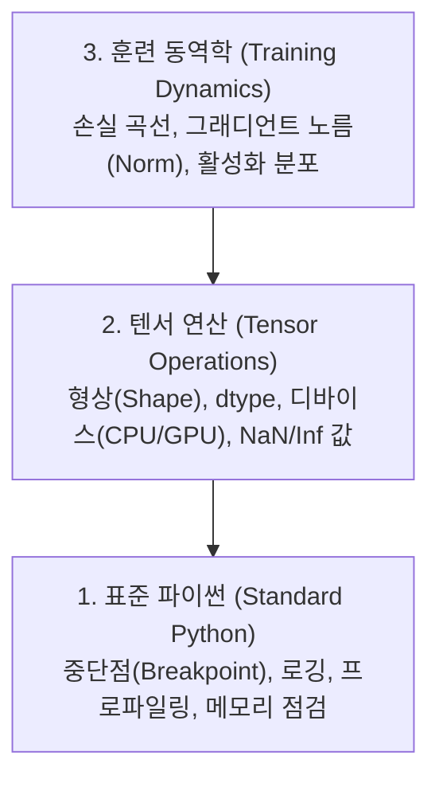

# 디버깅 및 프로파일링 (Debugging and Profiling)

> 가장 치명적인 AI 버그는 프로그램이 튕기지 않습니다. 쓰레기 데이터로 조용히 8시간 동안 학습하며 겉보기에만 아름다운 손실 곡선을 출력할 뿐입니다.

**Type:** Build
**Language:** Python
**Prerequisites:** Lesson 1 (Dev Environment), basic PyTorch familiarity
**Time:** ~60 minutes

## 학습 목표 (Learning Objectives)

- 훈련 중간에 조건부 `breakpoint()`와 `debug_print`를 사용하여 텐서의 형태(shape), 데이터 타입(dtype), NaN 값을 조사합니다.
- `cProfile`, `line_profiler`, `tracemalloc`을 활용해 훈련 루프의 성능 병목과 메모리 누수를 진단합니다.
- 차원 불일치(shape mismatch), NaN 손실, 데이터 누수(data leakage), 디바이스 불일치 등 AI 고유의 버그를 탐지합니다.
- TensorBoard를 설정하여 손실 곡선, 가중치 히스토그램, 그래디언트 분포를 시각화합니다.

## 문제 상황 (The Problem)

AI 코드는 일반 소프트웨어와 전혀 다르게 실패합니다. 웹 애플리케이션은 예외가 발생하면 스택 트레이스를 뿜으며 즉시 중단됩니다. 하지만 잘못 구성된 AI 훈련 루프는 에러 하나 없이 8시간 동안 동작하며 $200 어치의 GPU 비용을 태우고, 모든 입력에 대해 데이터의 평균값만 뱉는 쓸모없는 모델을 만들어냅니다. 텐서가 엉뚱한 디바이스(CPU)에 머물렀거나, `.detach()`를 빠뜨렸거나, 평가용 정답 라벨이 입력 피처로 누수되었기 때문입니다.

시간과 컴퓨팅 자원을 낭비하기 전에 이러한 침묵의 버그(Silent Failures)를 사전에 잡아내는 디버깅 도구가 필요합니다.

## 핵심 개념 (The Concept)

AI 디버깅은 3단계 계층으로 접근합니다:



많은 초심자들이 3단계(TensorBoard 화면 응시)로 바로 건너뜁니다. 하지만 AI 버그의 80%는 1단계와 2단계에서 발생합니다.

```figure
s0-flame-hot
```

## 구현하기 (Build It)

### Part 1: 출력 디버깅 (Print Debugging의 진가)

print 디버깅을 가볍게 여겨서는 안 됩니다. 텐서 연산 코드에서는 형상, 데이터 타입, 디바이스, 값의 범위를 한눈에 종합적으로 확인해야 하므로 정밀한 출력문이 가장 빠른 해결책이 됩니다.

```python
def debug_print(name, tensor):
    print(f"{name}: shape={tensor.shape}, dtype={tensor.dtype}, "
          f"device={tensor.device}, "
          f"min={tensor.min().item():.4f}, max={tensor.max().item():.4f}, "
          f"mean={tensor.mean().item():.4f}, "
          f"has_nan={tensor.isnan().any().item()}")
```

의심스러운 연산 직후마다 호출하세요. 버그를 찾은 후 제거하면 됩니다.

### Part 2: 조건부 중단점 (`breakpoint()` & pdb)

파이썬 내장 디버거는 AI 작업에서 과소평가되어 있습니다. 조건부로 `breakpoint()`를 걸어두면 이상 상태가 감지되었을 때만 대화형 쉘로 진입할 수 있습니다.

```python
def training_step(model, batch, criterion, optimizer):
    inputs, labels = batch
    outputs = model(inputs)
    loss = criterion(outputs, labels)

    if loss.item() > 100 or torch.isnan(loss):
        breakpoint()

    loss.backward()
    optimizer.step()
```

디버거 진입 시 유용한 커맨드:
- `p outputs.shape`: 출력 텐서 형태 확인
- `p loss.item()`: 손실값 확인
- `p torch.isnan(outputs).sum()`: NaN 원소 개수 확인
- `p model.fc1.weight.grad`: 그래디언트 텐서 확인
- `c`: 계속 실행, `q`: 디버깅 중단

10,000 스텝 동안 매번 멈출 수는 없습니다. 오직 문제가 생긴 스텝에서만 멈추도록 조건부 디버깅을 활용하세요.

### Part 3: 표준 로깅 (Logging)

장시간 돌아가는 훈련 루프는 print 대신 파일 로깅을 적용해야 합니다:

```python
import logging

logging.basicConfig(
    level=logging.INFO,
    format="%(asctime)s [%(levelname)s] %(message)s",
    handlers=[
        logging.FileHandler("training.log"),
        logging.StreamHandler()
    ]
)
logger = logging.getLogger(__name__)

logger.info("훈련 시작: lr=%.4f, batch_size=%d", lr, batch_size)
logger.warning("손실 급등 감지: %.4f (step %d)", loss.item(), step)
logger.error("스텝 %d에서 NaN 손실 발생, 훈련 중단", step)
```

새벽 3시에 훈련이 실패했을 때 화면 위로 스크롤되어 날아간 터미널 출력 대신 타임스탬프가 찍힌 로그 파일이 있어야 원인을 분석할 수 있습니다.

### Part 4: 구간별 실행 시간 측정 (Timing)

어디서 병목이 발생하는지 알아야 최적화할 수 있습니다:

```python
import time

class Timer:
    def __init__(self, name=""):
        self.name = name

    def __enter__(self):
        self.start = time.perf_counter()
        return self

    def __exit__(self, *args):
        elapsed = time.perf_counter() - self.start
        print(f"[{self.name}] {elapsed:.4f}s")

with Timer("데이터 로딩"):
    batch = next(dataloader_iter)

with Timer("순전파 (forward pass)"):
    outputs = model(batch)

with Timer("역전파 (backward pass)"):
    loss.backward()
```

흔히 발견되는 사실: 전체 훈련 시간의 60%를 데이터 로딩에서 잡아먹는 경우가 많습니다. 이 경우 GPU를 업그레이드할 것이 아니라 DataLoader의 `num_workers > 0` 설정을 해야 합니다.

### Part 5: cProfile과 line_profiler

```bash
python -m cProfile -s cumtime train.py
```

누적 소요 시간 순으로 함수 호출 트리를 분석할 수 있습니다.

### Part 6: 메모리 프로파일링 및 OOM 해결

PyTorch GPU 메모리 요약 확인:

```python
import torch

if torch.cuda.is_available():
    print(torch.cuda.memory_summary())
    print(f"할당된 메모리: {torch.cuda.memory_allocated() / 1e9:.2f} GB")
    print(f"캐시된 예약 메모리: {torch.cuda.memory_reserved() / 1e9:.2f} GB")
```

OOM(CUDA Out of Memory) 발생 시 조치 순서:
1. **배치 크기(Batch size) 축소** (가장 먼저 시도)
2. `del 중간변수` 후 `torch.cuda.empty_cache()` 호출
3. 혼합 정밀도(Mixed Precision, `torch.cuda.amp.autocast`) 적용으로 메모리 사용량 절반 축소
4. 심층 네트워크의 경우 그래디언트 체크포인팅(Gradient Checkpointing) 활성화

### Part 7: 흔한 AI 버그 감지 패턴

#### 1. 차원 불일치 (Shape Mismatch)
모델의 레이어 간 입력/출력 텐서 형상이 어긋나는 문제입니다. Forward Hook을 등록하여 레이어별 텐서 차원 변화를 일괄 추적할 수 있습니다.

#### 2. NaN 손실 (Exploding Gradients)
학습률이 너무 높거나, log(0), 0으로 나누기 연산이 포함되었을 때 발생합니다:

```python
def detect_nan(model, loss, step):
    if torch.isnan(loss):
        print(f"스텝 {step}에서 NaN 손실 발생!")
        for name, param in model.named_parameters():
            if param.grad is not None:
                if torch.isnan(param.grad).any():
                    print(f"  {name} 파라미터에서 NaN 그래디언트 발견")
        return True
    return False
```

#### 3. 데이터 누수 (Data Leakage)
테스트셋의 데이터가 훈련셋에 중복 포함되었거나, 시계열 데이터에서 미래 정보가 과거 예측에 반영되는 경우입니다. ID 기반 교차 집합 검사로 방지합니다.

#### 4. 잘못된 디바이스 (Wrong Device)
일부 텐서가 GPU로 이동하지 않고 조용히 CPU에 남아 있으면 연산마다 병목이 발생하거나 런타임 에러가 발생합니다.

### Part 8: TensorBoard 시각화

```bash
pip install tensorboard
```

```python
from torch.utils.tensorboard import SummaryWriter

writer = SummaryWriter("runs/experiment_1")

for step in range(num_steps):
    loss = train_step(model, batch)
    writer.add_scalar("loss/train", loss.item(), step)
    writer.add_scalar("lr", optimizer.param_groups[0]["lr"], step)

writer.close()
```

대시보드 실행:

```bash
tensorboard --logdir=runs
```

지표 해석 가이드:
- **손실이 줄어들지 않음**: 학습률이 너무 낮거나 모델 표현력 부족
- **손실이 심하게 진동함**: 학습률이 과도하게 높음
- **Train loss는 계속 감소하는데 Val loss가 상승**: 과적합(Overfitting) 발생
- **가중치 분포가 0으로 수렴**: 그래디언트 소실(Vanishing gradient)
- **그래디언트 분포가 급격히 발산**: 그래디언트 클리핑(Gradient clipping) 필요

## 실무 활용 (Use It)

표준 디버깅 체크리스트:
1. **훈련 시작 전**: 샘플 배치 1개로 `check_shapes`를 실행하여 입출력 차원이 기대치와 일치하는지 확인합니다.
2. **초기 10스텝**: 손실값, 출력값, 그래디언트에 `debug_print`를 적용해 NaN/Inf가 없고 합리적인 수치 범위인지 확인합니다.
3. **훈련 진행 중**: TensorBoard로 손실 곡선과 가중치 히스토그램을 주기적으로 관찰합니다.
4. **문제 발생 시**: 실패 직전 위치에 조건부 `breakpoint()`를 걸고 인터랙티브하게 검사합니다.

## 결과물 납품 (Ship It)

디버깅 유틸리티 스크립트 실행:

```bash
python phases/00-setup-and-tooling/12-debugging-and-profiling/code/debug_tools.py
```

AI 특화 버그 진단을 돕는 프롬프트 템플릿은 `outputs/prompt-debug-ai-code.md`를 참고하세요.

## 실습 과제 (Exercises)

1. `debug_tools.py`를 실행해 보고, 더미 모델의 순전파에 0으로 나누기 연산을 고의로 추가하여 NaN 감지기가 작동하는지 확인해 보세요.
2. `cProfile`을 이용해 모델 훈련 루프를 프로파일링하고 가장 실행 시간이 오래 걸리는 병목 함수를 찾아보세요.
3. 간단한 모델을 훈련하면서 TensorBoard를 띄워 과적합(overfitting) 현상이 그래프에서 어떻게 나타나는지 관찰해 보세요.
4. 훈련 루프 내부에 `breakpoint()`를 삽입하고 디버거 콘솔에서 텐서의 shape, device, grad 속성을 직접 조회해 보세요.
