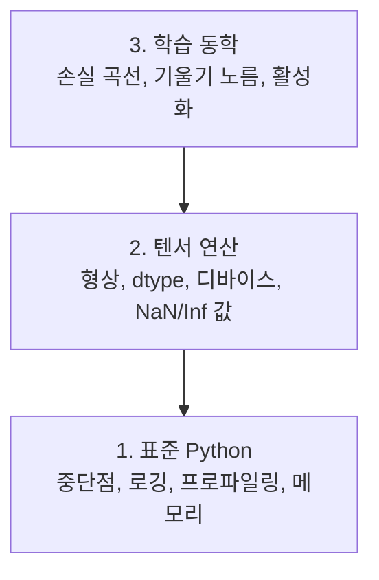

# 디버깅 및 프로파일링

> 최악의 AI 버그는 크래시를 일으키지 않습니다. 쓰레기 데이터로 조용히 학습하고 아름다운 손실 곡선을 보고합니다.

**유형:** Build
**언어:** Python
**선수 요건:** 01강 (개발 환경), PyTorch 기초 지식
**시간:** 약 60분

## 학습 목표

- 조건부 `breakpoint()` 및 `debug_print`를 사용하여 학습 중 텐서 형상, dtype, NaN 값을 검사해 보세요
- `cProfile`, `line_profiler`, `tracemalloc`로 학습 루프를 프로파일링하여 병목 현상을 찾아보세요
- 형상 불일치, NaN 손실, 데이터 누수, 잘못된 디바이스 텐서 등 일반적인 AI 버그를 감지하세요
- TensorBoard를 설정하여 손실 곡선, 가중치 히스토그램, 기울기 분포를 시각화하세요

## 문제점

AI 코드는 일반 코드와 다른 방식으로 실패합니다. 웹 앱은 스택 트레이스와 함께 크래시됩니다. 설정이 잘못된 학습 루프는 8시간 동안 실행되어 GPU 비용 $200을 소진하고, 모든 입력의 평균을 예측하는 모델을 생성합니다. 코드는 절대 오류를 발생시키지 않았습니다. 버그는 잘못된 디바이스에 있는 텐서, 잊어버린 `.detach()`, 또는 특징에 유입된 레이블이었습니다.

시간과 컴퓨팅 자원을 낭비하기 전에 이러한 조용한 실패를 포착하는 디버깅 도구가 필요합니다.

## 개념

AI 디버깅은 세 가지 수준에서 작동합니다:



대부분의 사람들은 바로 3단계(TensorBoard를 바라보는 것)로 넘어갑니다. 하지만 AI 버그의 80%는 1단계와 2단계에 있습니다.

```figure
s0-flame-hot
```

## 구현하기

### 1부: 출력 디버깅 (네, 효과가 있습니다)

출력 디버깅은 무시되곤 합니다. 그렇게 해서는 안 됩니다. 텐서 코드에서는 형상, dtype, 값 범위를 한 번에 확인해야 하므로, 디버거로 한 단계씩 진행하는 것보다 타겟팅된 print 문이 더 효과적입니다.

```python
def debug_print(name, tensor):
    print(f"{name}: shape={tensor.shape}, dtype={tensor.dtype}, "
          f"device={tensor.device}, "
          f"min={tensor.min().item():.4f}, max={tensor.max().item():.4f}, "
          f"mean={tensor.mean().item():.4f}, "
          f"has_nan={tensor.isnan().any().item()}")
```

모든 의심스러운 연산 후에 이 함수를 호출하세요. 버그가 발견되면 print 문을 제거하세요. 간단합니다.

### 2부: Python 디버거 (pdb 및 breakpoint)

내장 디버거는 AI 작업에서 과소평가되는 도구입니다. `breakpoint()`를 학습 루프에 넣고 텐서를 인터랙티브하게 검사해 보세요.

```python
def training_step(model, batch, criterion, optimizer):
    inputs, labels = batch
    outputs = model(inputs)
    loss = criterion(outputs, labels)

    if loss.item() > 100 or torch.isnan(loss):
        breakpoint()

    loss.backward()
    optimizer.step()
```

디버거가 실행되면 유용한 명령어는 다음과 같습니다:

- `p outputs.shape`로 형태(shape)를 확인합니다
- `p loss.item()`로 손실(loss) 값을 확인합니다
- `p torch.isnan(outputs).sum()`로 NaN을 계산합니다
- `p model.fc1.weight.grad`로 기울기(gradient)를 확인합니다
- `c`로 계속 실행하고, `q`로 종료합니다

이것은 조건부 디버깅입니다. 문제가 있는 것처럼 보일 때만 멈추게 됩니다. 10,000단계 학습 실행에서는 이것이 중요합니다.

### 3부: Python 로깅

디버깅이 간단한 검사를 넘어서면 print 문장을 로깅으로 대체하세요.

```python
import logging

logging.basicConfig(
    level=logging.INFO,
    format="%(asctime)s [%(levelname)s] %(message)s",
    handlers=[
        logging.FileHandler("training.log"),
        logging.StreamHandler()
    ]
)
logger = logging.getLogger(__name__)

logger.info("Starting training: lr=%.4f, batch_size=%d", lr, batch_size)
logger.warning("Loss spike detected: %.4f at step %d", loss.item(), step)
logger.error("NaN loss at step %d, stopping", step)
```

로깅은 타임스탬프, 심각도 수준, 파일 출력을 제공합니다. 새벽 3시에 학습 실행이 실패하면 스크롤되어 사라진 터미널 출력 대신 로그 파일이 필요합니다.

### 4부: 코드 섹션 시간 측정

시간이 어디에 쓰이는지 아는 것은 최적화의 첫 단계입니다.

```python
import time

class Timer:
    def __init__(self, name=""):
        self.name = name

    def __enter__(self):
        self.start = time.perf_counter()
        return self

    def __exit__(self, *args):
        elapsed = time.perf_counter() - self.start
        print(f"[{self.name}] {elapsed:.4f}s")

with Timer("data loading"):
    batch = next(dataloader_iter)

with Timer("forward pass"):
    outputs = model(batch)

with Timer("backward pass"):
    loss.backward()
```

흔한 발견: 데이터 로딩이 학습 시간의 60%를 차지합니다. 해결책은 더 빠른 GPU가 아니라 DataLoader에 `num_workers > 0`를 사용하는 것입니다.

### 5부: cProfile 및 line_profiler

수동 타이머 이상의 정보가 필요할 때:

```bash
python -m cProfile -s cumtime train.py
```

누적 시간 순으로 정렬된 모든 함수 호출을 표시합니다. 라인별 프로파일링은:

```bash
pip install line_profiler
```

```python
@profile
def train_step(model, data, target):
    output = model(data)
    loss = F.cross_entropy(output, target)
    loss.backward()
    return loss

# kernprof -l -v train.py로 실행하세요
```

### 6부: 메모리 프로파일링

#### tracemalloc를 사용한 CPU 메모리

```python
import tracemalloc

tracemalloc.start()

# 여기에 코드를 넣으세요
model = build_model()
data = load_dataset()

snapshot = tracemalloc.take_snapshot()
top_stats = snapshot.statistics("lineno")
for stat in top_stats[:10]:
    print(stat)
```

#### memory_profiler를 사용한 CPU 메모리

```bash
pip install memory_profiler
```

```python
from memory_profiler import profile

@profile
def load_data():
    raw = read_csv("data.csv")       # 여기서 메모리 급증을 확인하세요
    processed = preprocess(raw)       # 그리고 여기서
    return processed
```

`python -m memory_profiler your_script.py`로 실행하여 라인별 메모리 사용량을 확인하세요.

#### PyTorch를 사용한 GPU 메모리

```python
import torch

if torch.cuda.is_available():
    print(torch.cuda.memory_summary())

    print(f"Allocated: {torch.cuda.memory_allocated() / 1e9:.2f} GB")
    print(f"Cached: {torch.cuda.memory_reserved() / 1e9:.2f} GB")
```

OOM (Out of Memory)에 도달했을 때:

1. 배치 크기(batch size)를 줄이세요 (항상 먼저 시도할 것)
2. `torch.cuda.empty_cache()`를 사용하여 캐시된 메모리를 해제하세요
3. `del tensor`를 사용한 후 `torch.cuda.empty_cache()`를 사용하여 큰 중간 값을 처리하세요
4. 혼합 정밀도(mixed precision)(`torch.cuda.amp`)를 사용하여 메모리 사용량을 절반으로 줄이세요
5. 매우 깊은 모델에는 활성화 체크포인팅(Activation Checkpointing)을 사용하세요

### 7부: 흔한 AI 버그와 이를 포착하는 방법

#### 모양 불일치

가장 흔한 버그입니다. 모델이 `[batch, channels, height, width]`을 기대하는데 텐서의 모양이 `[batch, features]`인 경우입니다.

```python
def check_shapes(model, sample_input):
    print(f"Input: {sample_input.shape}")
    hooks = []

    def make_hook(name):
        def hook(module, inp, out):
            in_shape = inp[0].shape if isinstance(inp, tuple) else inp.shape
            out_shape = out.shape if hasattr(out, "shape") else type(out)
            print(f"  {name}: {in_shape} -> {out_shape}")
        return hook

    for name, module in model.named_modules():
        hooks.append(module.register_forward_hook(make_hook(name)))

    with torch.no_grad():
        model(sample_input)

    for h in hooks:
        h.remove()
```

샘플 배치를 사용하여 한 번 실행해 보세요. 모델 내의 모든 모양 변환을 매핑합니다.

#### NaN 손실

NaN 손실은 무언가가 폭발했음을 의미합니다. 흔한 원인은 다음과 같습니다:

- 학습률이 너무 높음
- 사용자 정의 손실 함수에서 0으로 나누는 연산
- 0 또는 음수의 로그
- RNN에서의 기울기 폭발

```python
def detect_nan(model, loss, step):
    if torch.isnan(loss):
        print(f"NaN loss at step {step}")
        for name, param in model.named_parameters():
            if param.grad is not None:
                if torch.isnan(param.grad).any():
                    print(f"  NaN gradient in {name}")
                if torch.isinf(param.grad).any():
                    print(f"  Inf gradient in {name}")
        return True
    return False
```

#### 데이터 누수

모델이 테스트 세트에서 99%의 정확도를 얻습니다. 훌륭해 보입니다. 이는 버그입니다.

```python
def check_data_leakage(train_set, test_set, id_column="id"):
    train_ids = set(train_set[id_column].tolist())
    test_ids = set(test_set[id_column].tolist())
    overlap = train_ids & test_ids
    if overlap:
        print(f"DATA LEAKAGE: {len(overlap)} samples in both train and test")
        return True
    return False
```

시간적 누수(temporal leakage)도 확인하세요. 미래 데이터를 사용하여 과거를 예측하는 경우입니다. 분할하기 전에 타임스탬프 순으로 정렬하세요.

#### 잘못된 디바이스

서로 다른 디바이스(CPU vs GPU)에 있는 텐서는 런타임 오류를 일으킵니다. 하지만 때로는 텐서가 조용히 CPU에 남아 있고 나머지 모든 것은 GPU에 있어서, 학습이 단순히 느리게 실행되기도 합니다.

```python
def check_devices(model, *tensors):
    model_device = next(model.parameters()).device
    print(f"Model device: {model_device}")
    for i, t in enumerate(tensors):
        if t.device != model_device:
            print(f"  WARNING: tensor {i} on {t.device}, model on {model_device}")
```

### 8부: TensorBoard 기초

TensorBoard는 학습 과정에서 시간에 따라 내부에서 일어나는 일을 보여줍니다.

```bash
pip install tensorboard
```

```python
from torch.utils.tensorboard import SummaryWriter

writer = SummaryWriter("runs/experiment_1")

for step in range(num_steps):
    loss = train_step(model, batch)

    writer.add_scalar("loss/train", loss.item(), step)
    writer.add_scalar("lr", optimizer.param_groups[0]["lr"], step)

    if step % 100 == 0:
        for name, param in model.named_parameters():
            writer.add_histogram(f"weights/{name}", param, step)
            if param.grad is not None:
                writer.add_histogram(f"grads/{name}", param.grad, step)

writer.close()
```

실행하세요:

```bash
tensorboard --logdir=runs
```

확인해야 할 사항:

- **손실이 감소하지 않음**: 학습률이 너무 낮거나 모델 아키텍처 문제
- **손실이 심하게 진동함**: 학습률이 너무 높음
- **손실이 NaN으로 이동**: 수치적 불안정성 (위 NaN 섹션 참조)
- **학습 손실은 감소하는데 검증 손실은 증가**: 과적합
- **가중치 히스토그램이 0으로 붕괴**: 기울기 소실
- **기울기 히스토그램이 폭발**: 기울기 클리핑이 필요함

### 9부: VS Code 디버거

인터랙티브 디버깅을 위해 VS Code를 `launch.json`으로 설정하세요:

```json
{
    "version": "0.2.0",
    "configurations": [
        {
            "name": "Debug Training",
            "type": "debugpy",
            "request": "launch",
            "program": "${file}",
            "console": "integratedTerminal",
            "justMyCode": false
        }
    ]
}
```

거터(gutter)를 클릭하여 중단점을 설정하세요. 변수 패널을 사용하여 텐서 속성을 검사하세요. 디버그 콘솔을 사용하면 실행 중 임의의 Python 표현식을 실행할 수 있습니다.

각 변환을 확인하고 싶은 데이터 전처리 파이프라인을 단계별로 실행하는 데 유용합니다.

## 사용하기

대부분의 AI 버그를 포착하는 디버깅 워크플로우는 다음과 같습니다:

1. **학습 전**: `check_shapes`을 샘플 배치로 실행합니다. 입력 및 출력 차원이 기대한 대로 일치하는지 확인합니다.
2. **첫 10단계**: 손실, 출력, 기울기에 `debug_print`을 사용합니다. NaN이 없고 값이 합리적인 범위에 있는지 확인합니다.
3. **학습 중**: 손실, 학습률, 기울기 노름을 기록합니다. TensorBoard로 시각화합니다.
4. **무언가 고장났을 때**: 실패 지점에서 `breakpoint()`을 떨어뜨립니다. 텐서를 인터랙티브하게 검사합니다.
5. **성능 확인**: 데이터 로딩, 순전파, 역전파 시간을 측정합니다. OOM에 가까울 경우 메모리를 프로파일링합니다.

## 출시하기

디버깅 툴킷 스크립트를 실행합니다:

```bash
python phases/00-setup-and-tooling/12-debugging-and-profiling/code/debug_tools.py
```

AI 특유의 버그를 진단하는 데 도움이 되는 프롬프트는 `outputs/prompt-debug-ai-code.md`을 참고하세요.

## 연습 문제

1. `debug_tools.py`을 실행하고 각 섹션의 출력을 읽어보세요. 더미 모델을 수정하여 NaN을 발생시켜 보세요 (힌트: 순전파에서 0으로 나누기) 그리고 디텍터가 이를 잡아내는 것을 지켜보세요.
2. `cProfile`으로 학습 루프를 프로파일링하고 가장 느린 함수를 식별합니다.
3. `tracemalloc`을 사용하여 데이터 로딩 파이프라인에서 가장 많은 메모리를 할당하는 줄을 찾습니다.
4. 간단한 학습 실행에 TensorBoard를 설정하고 모델이 과적합되는지 식별합니다.
5. 학습 루프 안에서 `breakpoint()`을 사용합니다. 디버거 프롬프트로 텐서 차원, 장치, 기울기 값을 검사하는 연습을 해 보세요.
