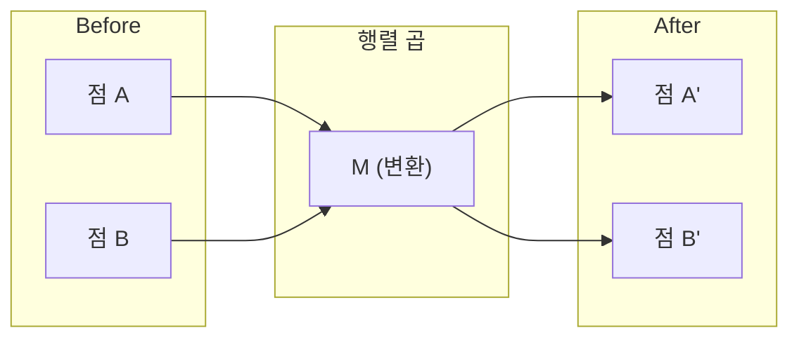
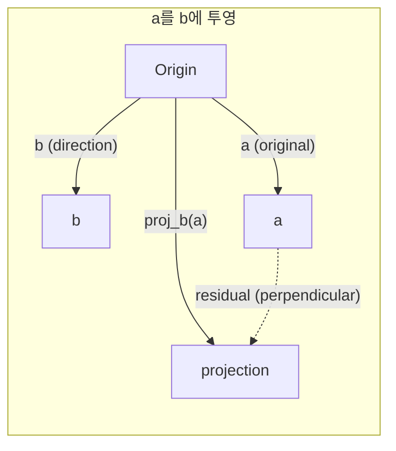

# 선형대수 직관

> 모든 AI 모델은 화려한 모자를 쓴 행렬 연산일 뿐입니다.

**유형:** Learn
**언어:** Python, Julia
**선수 요건:** 0단계
**시간:** 약 60분

## 학습 목표

- Python에서 벡터 및 행렬 연산(덧셈, 내적, 행렬 곱)을 처음부터 구현해 보세요
- 내적, 투영, 그람-슈미트 과정이 기하학적으로 무엇을 하는지 설명해 보세요
- 행 감소(row reduction)를 사용하여 벡터 집합의 선형 독립성, 랭크(rank), 기저(basis)를 결정해 보세요
- 선형대수 개념을 AI 응용 분야인 임베딩(embedding), 어텐션 점수, LoRA와 연결해 보세요

## 문제점

어떤 ML 논문을 열어도 첫 페이지에서 벡터, 행렬, 내적, 변환을 볼 수 있습니다. 선형대수 직관이 없으면 이것들은 단순한 기호일 뿐입니다. 직관이 있으면 신경망이 실제로 무엇을 하는지, 즉 공간에서 점을 이동하는 것을 볼 수 있습니다.

수학자가 될 필요는 없습니다. 이러한 연산이 기하학적으로 무엇을 의미하는지 보고, 직접 코딩해 보세요.

## 개념

### 벡터는 점(그리고 방향)입니다

벡터는 단순히 숫자의 목록입니다. 하지만 그 숫자는 의미를 지닙니다. 공간에서의 좌표인 것이죠.

**2D 벡터 [3, 2]:**

| x | y | 점 |
|---|---|-------|
| 3 | 2 | 벡터는 평면에서 원점 (0,0)에서 (3, 2)를 가리킵니다 |

이 벡터의 크기는 sqrt(3^2 + 2^2) = sqrt(13)이며, 오른쪽 위를 가리킵니다.

AI에서 벡터는 모든 것을 표현합니다:
- 단어 → 768개의 숫자로 이루어진 벡터 (임베딩 공간에서의 "의미")
- 이미지 → 수백만 개의 픽셀 값으로 이루어진 벡터
- 사용자 → 선호도로 이루어진 벡터

### 행렬은 변환입니다

행렬은 하나의 벡터를 다른 벡터로 변환합니다. 회전, 스케일링, 늘리기, 투영을 수행할 수 있습니다.



AI에서 행렬은 모델 그 자체입니다:
- 신경망 가중치 → 입력을 출력으로 변환하는 행렬
- 어텐션 점수 → 무엇을 집중할지 결정하는 행렬
- 임베딩(Embedding) → 단어를 벡터로 매핑하는 행렬

### 내적은 유사도를 측정합니다

두 벡터의 내적은 두 벡터가 얼마나 유사한지 알려줍니다.

```
a · b = a₁×b₁ + a₂×b₂ + ... + aₙ×bₙ

Same direction:      a · b > 0  (similar)
Perpendicular:       a · b = 0  (unrelated)
Opposite direction:  a · b < 0  (dissimilar)
```

이것은 검색 엔진, 추천 시스템, RAG (검색 증강 생성)(RAG (Retrieval-Augmented Generation))가 작동하는 방식 그 자체입니다 -- 높은 내적 값을 가진 벡터를 찾습니다.

### 선형 독립

집합 내의 어떤 벡터도 다른 벡터들의 조합으로 표현될 수 없다면, 그 벡터들은 선형 독립입니다. v1, v2, v3가 독립적이면, 이들은 3차원 공간을 생성합니다. 만약 하나가 다른 벡터들의 조합이라면, 이들은 평면만 생성합니다.

AI에서 중요한 이유: 특징(feature) 행렬은 선형 독립적인 열을 가져야 합니다. 두 특징이 완벽하게 상관관계가 있다면 (선형 종속), 모델은 그 효과를 구분할 수 없습니다. 이는 회귀 분석에서 다중 공선성(multicollinearity)을 유발합니다 -- 가중치 행렬이 불안정해지고, 작은 입력 변화가 극심한 출력 변동을 일으킵니다.

**구체적인 예:**

```
v1 = [1, 0, 0]
v2 = [0, 1, 0]
v3 = [2, 1, 0]   # v3 = 2*v1 + v2
```

v01강 v2는 독립적입니다 -- 둘 중 하나가 다른 하나의 스칼라 배수나 조합이 아닙니다. 하지만 v3 = 2*v1 + v2이므로, {v1, v2, v3}는 종속 집합입니다. 이 세 벡터는 모두 xy 평면에 위치합니다. 어떻게 조합하든 [0, 0, 1]에 도달할 수 없습니다. 세 개의 벡터가 있지만 자유도는 두 차원뿐입니다.

데이터셋에서: 만약 feature_3 = 2*feature_1 + feature_2라면, feature_3를 추가해도 모델에 새로운 정보는 전혀 없습니다. 더 나쁜 것은, 정규 방정식(normal equations)이 특이 행렬(singular)이 되어 가중치에 대한 유일한 해가 존재하지 않게 된다는 점입니다.

### 기저와 랭크

기저(basis)는 전체 공간을 생성하는 최소한의 선형 독립 벡터 집합입니다. 기저 벡터의 개수가 공간의 차원입니다.

3차원 공간의 표준 기저는 {[1,0,0], [0,1,0], [0,0,1]}입니다. 하지만 3차원 공간 내의 임의의 세 독립 벡터는 유효한 기저를 형성합니다. 기저의 선택은 좌표계의 선택입니다.

행렬의 랭크(rank) = 선형 독립적인 열의 개수 = 선형 독립적인 행의 개수. 만약 랭크 < min(행 수, 열 수)라면, 행렬은 랭크 결손(rank-deficient)입니다. 이는 다음을 의미합니다:
- 시스템이 무수히 많은 해를 가지거나(또는 해가 없음)
- 변환 과정에서 정보가 손실됨
- 행렬이 역전되지 않음

| 상황 | 계수 | ML에서의 의미 |
|-----------|------|---------------------|
| 완전 계수 (계수 = min(m, n)) | 최대 가능 | 유일한 최소제곱 해가 존재합니다. 모델이 잘 조건 지어져 있습니다. |
| 계수 결손 (계수 < min(m, n)) | 최대 미만 | 특징이 중복됩니다. 무수히 많은 가중치 해가 존재합니다. 정규화가 필요합니다. |
| 계수 1 | 1 | 모든 열이 하나의 벡터의 스케일 복사본입니다. 모든 데이터가 직선 위에 위치합니다. |
| 계수 결손 근접 (작은 특이값) | 수치적으로 낮음 | 행렬이 조건이 나쁩니다. 미세한 입력 잡음이 큰 출력 변화를 유발합니다. SVD 절단이나 릿지 회귀를 사용하세요. |

### 투영

벡터 **a**를 벡터 **b**에 투영하면 **b** 방향의 **a** 성분을 얻습니다:

```
proj_b(a) = (a dot b / b dot b) * b
```

잔차(a - proj_b(a))는 b에 수직입니다. 이 직교 분해는 최소제곱 적합의 기초입니다.

투영은 ML 전반에 걸쳐 존재합니다:
- 선형 회귀는 관측값에서 열 공간까지의 거리를 최소화합니다 -- 해는 투영 그 자체입니다
- PCA는 데이터를 최대 분산 방향으로 투영합니다
- 트랜스포머의 어텐션은 쿼리를 키에 투영하여 계산합니다



**예시:** a = [3, 4], b = [1, 0]

proj_b(a) = (3*1 + 4*0) / (1*1 + 0*0) * [1, 0] = 3 * [1, 0] = [3, 0]

투영은 y 성분을 제거합니다. 이는 가장 단순한 형태의 차원 축소입니다 -- 중요하지 않은 방향을 버리세요.

### 그람-슈미트 과정

임의의 독립 벡터 집합을 표준 기저로 변환합니다. 표준 기저는 모든 벡터의 길이가 1이고 모든 쌍이 수직임을 의미합니다.

알고리즘:
1. 첫 번째 벡터를 취하고 정규화하세요
2. 두 번째 벡터를 취하고 첫 번째 벡터에 대한 투영을 뺀 후 정규화하세요
3. 세 번째 벡터를 취하고 이전 모든 벡터에 대한 투영을 뺀 후 정규화하세요
4. 남은 벡터에 대해 반복하세요

```
Input:  v1, v2, v3, ... (linearly independent)

u1 = v1 / |v1|

w2 = v2 - (v2 dot u1) * u1
u2 = w2 / |w2|

w3 = v3 - (v3 dot u1) * u1 - (v3 dot u2) * u2
u3 = w3 / |w3|

Output: u1, u2, u3, ... (orthonormal basis)
```

QR 분해는 내부적으로 이렇게 작동합니다. Q는 정규 직교 기저이고, R은 투영 계수를 포착합니다. QR 분해는 다음에 사용됩니다:
- 선형 시스템 풀기 (가우스 소거법보다 더 안정적)
- 고유값 계산 (QR 알고리즘)
- 최소 제곱 회귀 (표준 수치 방법)

```figure
eigen-directions
```

## **구현하기**

### 1단계: Python으로 벡터从零부터 만들기

```python
class Vector:
    def __init__(self, components):
        self.components = list(components)
        self.dim = len(self.components)

    def __add__(self, other):
        return Vector([a + b for a, b in zip(self.components, other.components)])

    def __sub__(self, other):
        return Vector([a - b for a, b in zip(self.components, other.components)])

    def dot(self, other):
        return sum(a * b for a, b in zip(self.components, other.components))

    def magnitude(self):
        return sum(x**2 for x in self.components) ** 0.5

    def normalize(self):
        mag = self.magnitude()
        return Vector([x / mag for x in self.components])

    def cosine_similarity(self, other):
        return self.dot(other) / (self.magnitude() * other.magnitude())

    def __repr__(self):
        return f"Vector({self.components})"


a = Vector([1, 2, 3])
b = Vector([4, 5, 6])

print(f"a + b = {a + b}")
print(f"a · b = {a.dot(b)}")
print(f"|a| = {a.magnitude():.4f}")
print(f"cosine similarity = {a.cosine_similarity(b):.4f}")
```

### 2단계: Python으로 행렬从零부터 만들기

```python
class Matrix:
    def __init__(self, rows):
        self.rows = [list(row) for row in rows]
        self.shape = (len(self.rows), len(self.rows[0]))

    def __matmul__(self, other):
        if isinstance(other, Vector):
            return Vector([
                sum(self.rows[i][j] * other.components[j] for j in range(self.shape[1]))
                for i in range(self.shape[0])
            ])
        rows = []
        for i in range(self.shape[0]):
            row = []
            for j in range(other.shape[1]):
                row.append(sum(
                    self.rows[i][k] * other.rows[k][j]
                    for k in range(self.shape[1])
                ))
            rows.append(row)
        return Matrix(rows)

    def transpose(self):
        return Matrix([
            [self.rows[j][i] for j in range(self.shape[0])]
            for i in range(self.shape[1])
        ])

    def __repr__(self):
        return f"Matrix({self.rows})"


rotation_90 = Matrix([[0, -1], [1, 0]])
point = Vector([3, 1])

rotated = rotation_90 @ point
print(f"Original: {point}")
print(f"Rotated 90°: {rotated}")
```

### 3단계: AI에서 왜 이것이 중요한지

```python
import random

random.seed(42)
weights = Matrix([[random.gauss(0, 0.1) for _ in range(3)] for _ in range(2)])
input_vector = Vector([1.0, 0.5, -0.3])

output = weights @ input_vector
print(f"Input (3D): {input_vector}")
print(f"Output (2D): {output}")
print("This is what a neural network layer does -- matrix multiplication.")
```

### 4단계: Julia 버전

```julia
a = [1.0, 2.0, 3.0]
b = [4.0, 5.0, 6.0]

println("a + b = ", a + b)
println("a · b = ", a ⋅ b)       # Julia는 유니코드 연산자를 지원합니다
println("|a| = ", √(a ⋅ a))
println("cosine = ", (a ⋅ b) / (√(a ⋅ a) * √(b ⋅ b)))

# 행렬-벡터 곱
W = [0.1 -0.2 0.3; 0.4 0.5 -0.1]
x = [1.0, 0.5, -0.3]
println("Wx = ", W * x)
println("This is a neural network layer.")
```

### 5단계: Python으로 선형 독립성과 투영从零부터 만들기

```python
def is_linearly_independent(vectors):
    n = len(vectors)
    dim = len(vectors[0].components)
    mat = Matrix([v.components[:] for v in vectors])
    rows = [row[:] for row in mat.rows]
    rank = 0
    for col in range(dim):
        pivot = None
        for row in range(rank, len(rows)):
            if abs(rows[row][col]) > 1e-10:
                pivot = row
                break
        if pivot is None:
            continue
        rows[rank], rows[pivot] = rows[pivot], rows[rank]
        scale = rows[rank][col]
        rows[rank] = [x / scale for x in rows[rank]]
        for row in range(len(rows)):
            if row != rank and abs(rows[row][col]) > 1e-10:
                factor = rows[row][col]
                rows[row] = [rows[row][j] - factor * rows[rank][j] for j in range(dim)]
        rank += 1
    return rank == n


def project(a, b):
    scalar = a.dot(b) / b.dot(b)
    return Vector([scalar * x for x in b.components])


def gram_schmidt(vectors):
    orthonormal = []
    for v in vectors:
        w = v
        for u in orthonormal:
            proj = project(w, u)
            w = w - proj
        if w.magnitude() < 1e-10:
            continue
        orthonormal.append(w.normalize())
    return orthonormal


v1 = Vector([1, 0, 0])
v2 = Vector([1, 1, 0])
v3 = Vector([1, 1, 1])
basis = gram_schmidt([v1, v2, v3])
for i, u in enumerate(basis):
    print(f"u{i+1} = {u}")
    print(f"  |u{i+1}| = {u.magnitude():.6f}")

print(f"u1 · u2 = {basis[0].dot(basis[1]):.6f}")
print(f"u1 · u3 = {basis[0].dot(basis[2]):.6f}")
print(f"u2 · u3 = {basis[1].dot(basis[2]):.6f}")
```

## **사용하기**

이제 NumPy로 같은 작업을 해 보세요 -- 실제 실무에서 사용하게 될 방식입니다:

```python
import numpy as np

a = np.array([1, 2, 3], dtype=float)
b = np.array([4, 5, 6], dtype=float)

print(f"a + b = {a + b}")
print(f"a · b = {np.dot(a, b)}")
print(f"|a| = {np.linalg.norm(a):.4f}")
print(f"cosine = {np.dot(a, b) / (np.linalg.norm(a) * np.linalg.norm(b)):.4f}")

W = np.random.randn(2, 3) * 0.1
x = np.array([1.0, 0.5, -0.3])
print(f"Wx = {W @ x}")
```

### NumPy로 랭크, 투영 및 QR 계산

```python
import numpy as np

A = np.array([[1, 2], [2, 4]])
print(f"Rank: {np.linalg.matrix_rank(A)}")

a = np.array([3, 4])
b = np.array([1, 0])
proj = (np.dot(a, b) / np.dot(b, b)) * b
print(f"Projection of {a} onto {b}: {proj}")

Q, R = np.linalg.qr(np.random.randn(3, 3))
print(f"Q is orthogonal: {np.allclose(Q @ Q.T, np.eye(3))}")
print(f"R is upper triangular: {np.allclose(R, np.triu(R))}")
```

### PyTorch -- 텐서는 오토그라드(Autodiff)가 있는 벡터입니다

```python
import torch

x = torch.randn(3, requires_grad=True)
y = torch.tensor([1.0, 0.0, 0.0])

similarity = torch.dot(x, y)
similarity.backward()

print(f"x = {x.data}")
print(f"y = {y.data}")
print(f"dot product = {similarity.item():.4f}")
print(f"d(dot)/dx = {x.grad}")
```

x에 대한 내적의 기울기는 단순히 y입니다. PyTorch는 이를 자동으로 계산했습니다. 신경망의 모든 연산은 행렬 곱, 내적, 투영 같은 연산으로 구성되며, 오토그라드(Autodiff)는 이 모든 연산에 대한 기울기를 추적합니다.

NumPy가 한 줄로 처리하는 것을从零부터 직접 만들었습니다. 이제 내부적으로 일어나는 일을 이해하게 되었습니다.

## **출시하기**

이 강의는 다음을 생성합니다:
- `outputs/prompt-linear-algebra-tutor.md` -- AI 어시스턴트가 기하학적 직관을 통해 선형 대수를 가르치기 위한 프롬프트

## **연결 고리**

이 강의의 모든 내용은 현대 AI의 특정 부분과 연결됩니다:

| 개념 | 나타나는 위치 |
|---------|------------------|
| 내적 | 트랜스포머의 어텐션 점수, RAG의 코사인 유사도 |
| 행렬 곱 | 모든 신경망 레이어, 모든 선형 변환 |
| 선형 독립성 | 특징 선택, 다중 공선성 회피 |
| 랭크 | 시스템의 풀이 가능성 결정, LoRA (저랭크 적응)(LoRA (Low-Rank Adaptation)) |
| 투영 | 선형 회귀 (열 공간에 투영), PCA |
| Gram-Schmidt / QR | 수치 솔버, 고유값 계산 |
| 정규 직교 기저 | 안정적인 수치 연산, 화이트닝 변환 |

LoRA는 특별히 언급할 가치가 있습니다. LoRA는 가중치 업데이트를 저랭크 행렬로 분해하여 대규모 언어 모델을 미세 조정합니다. 4096x4096 크기의 가중치 행렬(1600만 매개변수)을 업데이트하는 대신, LoRA는 4096x16강 16x4096 크기의 두 행렬(131,000 매개변수)을 업데이트합니다. 랭크 16 제약 조건은 LoRA가 가중치 업데이트가 전체 4096차원 공간의 16차원 부분 공간에 위치한다고 가정한다는 의미입니다. 이는 선형 대수가 실제로 작동하는 방식입니다.

## 연습 문제

1. 두 벡터 사이의 각도를 도 단위 반환하는 `Vector.angle_between(other)`를 구현해 보세요
2. x 좌표를 2배로, y 좌표를 3배로 만드는 2D 스케일링 행렬을 생성한 후, 벡터 [1, 1]에 적용해 보세요
3. 5개의 랜덤한 단어 유사 벡터(차원 50)가 주어졌을 때, 코사인 유사도를 사용하여 가장 유사한 두 벡터를 찾아보세요
4. Gram-Schmidt의 출력값이 실제로 정규 직교하는지 검증해 보세요: 모든 쌍의 내적이 0이고 모든 벡터의 크기가 1인지 확인하세요
5. 랭크가 2인 3x3 행렬을 생성하세요. `rank()` 방법을 사용하여 검증한 후, 열(column)이 생성하는 기하학적 객체를 설명해 보세요.
6. 벡터 [1, 2, 3]을 [1, 1, 1]에 투영해 보세요. 결과가 기하학적으로 무엇을 의미하는지 설명해 보세요.

## 핵심 용어

| 용어 | 사람들이 말하는 것 | 실제 의미 |
|------|----------------|----------------------|
| 벡터(Vector) | "화살표" | n차원 공간에서 점이나 방향을 나타내는 숫자의 목록 |
| 행렬(Matrix) | "숫자의 표" | 벡터를 한 공간에서 다른 공간으로 매핑하는 변환 |
| 내적(Dot product) | "곱하고 합산하기" | 두 벡터가 얼마나 정렬되어 있는지를 측정하는 지표 -- 유사성 검색의 핵심 |
| 임베딩(Embedding) | "AI 마법" | 무언가(단어, 이미지, 사용자)의 의미를 나타내는 벡터 |
| 선형 독립(Linear independence) | "겹치지 않음" | 집합 내의 어떤 벡터도 다른 벡터들의 조합으로 표현할 수 없음 |
| 랭크(Rank) | "차원의 수" | 행렬 내 선형 독립인 열(또는 행)의 개수 |
| 투영(Projection) | "그림자" | 한 벡터가 다른 벡터의 방향에 대해 가지는 성분 |
| 기저(Basis) | "좌표 축" | 공간을 생성하는 최소한의 독립적인 벡터 집합 |
| 정규직교 | "수직 단위 벡터" | 서로 수직이며 각각의 길이가 1인 벡터 |
