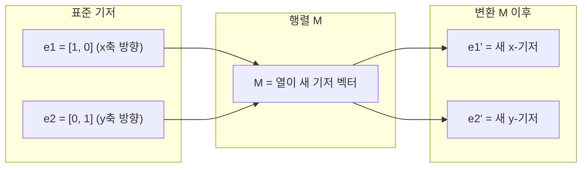
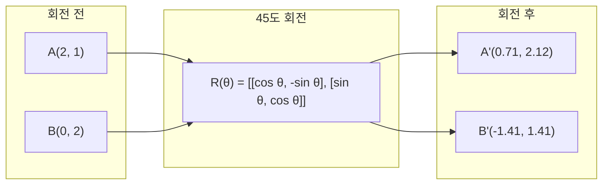
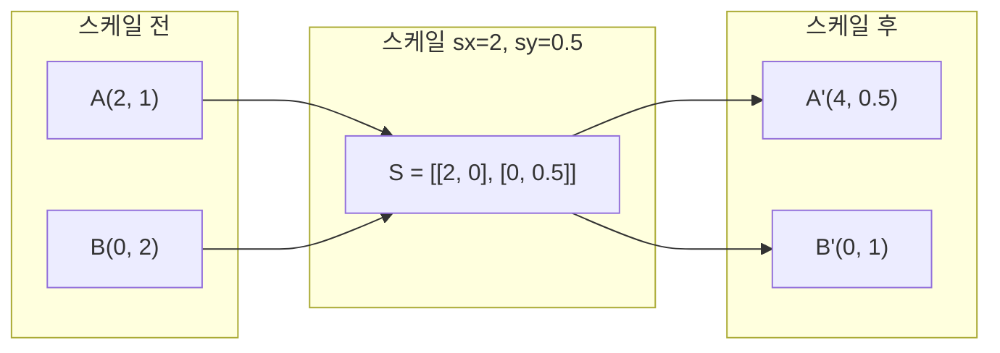
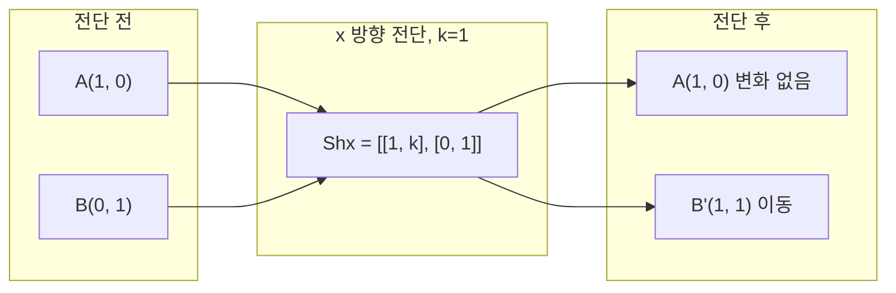
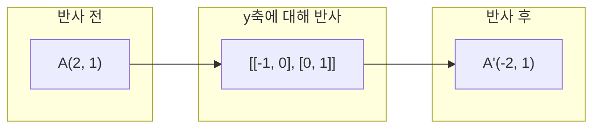
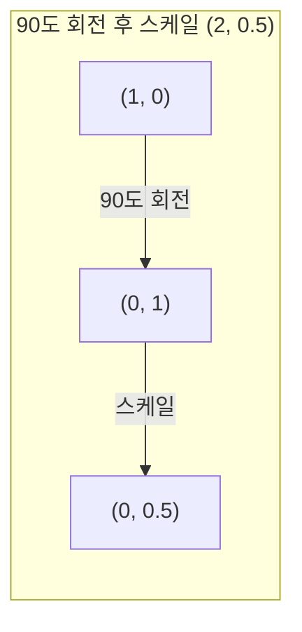
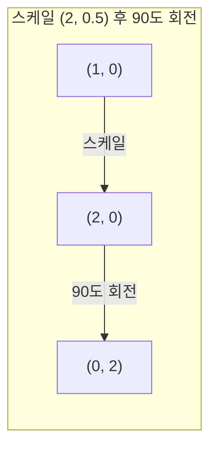

# 행렬 변환 (Matrix Transformations)

> 행렬은 공간을 다시 빚는 기계입니다. 모든 점에 무엇을 하는지 알면, 그 변환 전체를 이해합니다.

**Type:** Build
**Languages:** Python, Julia
**Prerequisites:** Phase 1, Lessons 01-02 (Linear Algebra Intuition, Vectors & Matrices Operations)
**Time:** ~75 minutes

## 학습 목표 (Learning Objectives)

- 회전, 스케일, 전단(shear), 반사 행렬을 구성하고 2D·3D 점에 적용합니다
- 행렬 곱으로 여러 변환을 합성하고 순서가 중요함을 검증합니다
- 특성방정식으로부터 2x2 행렬의 고유값·고유벡터를 계산합니다
- 고유값이 PCA 방향, RNN 안정성, spectral clustering 행동을 왜 결정하는지 설명합니다

## 문제 상황 (The Problem)

PCA에 대해 읽으면 "공분산 행렬의 고유벡터를 찾아라"가 나옵니다. 모델 안정성에 대해 읽으면 "모든 고유값의 크기가 1보다 작은지 확인하라"가 나옵니다. 데이터 증강에 대해 읽으면 "랜덤 회전을 적용하라"가 나옵니다. 행렬이 공간에 기하적으로 무엇을 하는지 이해하기 전에는 이 말이 전혀 와닿지 않습니다.

행렬은 숫자 격자만이 아닙니다. 공간 기계입니다. 회전 행렬은 점을 돌립니다. 스케일 행렬은 늘립니다. 전단 행렬은 기울입니다. 신경망이 데이터에 적용하는 모든 변환은 이런 연산이거나 그 합성입니다. 이 레슨은 그 연산들을 구체화합니다.

## 핵심 개념 (The Concept)

### 변환으로서의 행렬

2D의 모든 선형 변환은 2x2 행렬로 쓸 수 있습니다. 행렬은 기저 벡터 [1, 0]과 [0, 1]이 어디로 가는지를 정확히 알려 줍니다. 나머지는 따라옵니다.



### 회전 (Rotation)

각도 theta만큼의 2D 회전은 거리와 각도를 그대로 둡니다. 모든 점을 원호를 따라 움직입니다.



3D에서는 축을 중심으로 회전합니다. 축마다 회전 행렬이 있습니다:

```
Rz(theta) = | cos  -sin  0 |     Rotate around z-axis
            | sin   cos  0 |     (x-y plane spins, z stays)
            |  0     0   1 |

Rx(theta) = | 1   0     0    |   Rotate around x-axis
            | 0  cos  -sin   |   (y-z plane spins, x stays)
            | 0  sin   cos   |

Ry(theta) = |  cos  0  sin |     Rotate around y-axis
            |   0   1   0  |     (x-z plane spins, y stays)
            | -sin  0  cos |
```

### 스케일 (Scaling)

스케일은 각 축을 독립적으로 늘리거나 줄입니다.



### 전단 (Shearing)

전단은 한 축을 고정한 채 다른 축을 기울입니다. 직사각형을 평행사변형으로 바꿉니다.



전단 행렬:
- `Shx = [[1, k], [0, 1]]` — x를 k * y만큼 이동
- `Shy = [[1, 0], [k, 1]]` — y를 k * x만큼 이동

### 반사 (Reflection)

반사는 축이나 직선에 대해 점을 거울처럼 뒤집습니다.



반사 행렬:
- y축에 대해 반사: `[[-1, 0], [0, 1]]`
- x축에 대해 반사: `[[1, 0], [0, -1]]`

### 합성: 변환 연결하기

변환 A 다음에 B를 적용하는 것은 행렬을 곱하는 것과 같습니다: `result = B @ A @ point`. 순서가 중요합니다. 회전 후 스케일은 스케일 후 회전과 다른 결과를 냅니다.



합성: `S @ R = [[0, -2], [0.5, 0]]`



합성: `R @ S = [[0, -0.5], [2, 0]]`

결과가 다릅니다. 행렬 곱은 교환법칙이 성립하지 않습니다.

### 고유값과 고유벡터

대부분의 벡터는 행렬을 만나면 방향이 바뀝니다. 고유벡터는 특별합니다: 행렬은 이들을 스케일만 하고 회전시키지는 않습니다. 그 스케일 인자가 고유값입니다.

```
A @ v = lambda * v

v is the eigenvector (direction that survives)
lambda is the eigenvalue (how much it stretches)

Example: A = | 2  1 |
             | 1  2 |

Eigenvector [1, 1] with eigenvalue 3:
  A @ [1,1] = [3, 3] = 3 * [1, 1]     (same direction, scaled by 3)

Eigenvector [1, -1] with eigenvalue 1:
  A @ [1,-1] = [1, -1] = 1 * [1, -1]  (same direction, unchanged)
```

행렬은 [1, 1] 방향으로 공간을 3배 늘리고 [1, -1]은 그대로 둡니다. 다른 모든 방향은 이 둘의 혼합입니다.

### 고유분해 (Eigendecomposition)

행렬이 선형 독립인 고유벡터를 n개 가지면 다음과 같이 분해할 수 있습니다:

```
A = V @ D @ V^(-1)

V = matrix whose columns are eigenvectors
D = diagonal matrix of eigenvalues
V^(-1) = inverse of V

This says: rotate into eigenvector coordinates, scale along each axis, rotate back.
```

### 고유값이 중요한 이유

**PCA.** 공분산 행렬의 고유벡터가 주성분입니다. 고유값은 각 성분이 포착하는 분산의 양을 알려 줍니다. 고유값으로 정렬해 상위 k개를 남기면 차원 축소가 됩니다.

**안정성.** 순환 네트워크와 동역학 시스템에서 크기가 1보다 큰 고유값은 출력을 폭발시킵니다. 1보다 작으면 사라집니다. 이것이 한 문장으로 말한 vanishing/exploding gradient 문제입니다.

**스펙트럼 방법.** 그래프 신경망은 인접 행렬의 고유값을 씁니다. Spectral clustering은 라플라시안의 고유값을 씁니다. 고유벡터가 그래프의 구조를 드러냅니다.

### 부피 스케일 인자로서의 행렬식

변환 행렬의 행렬식은 면적(2D) 또는 부피(3D)를 얼마나 스케일하는지를 알려 줍니다.

```
det = 1:   area preserved (rotation)
det = 2:   area doubled
det = 0:   space crushed to lower dimension (singular)
det = -1:  area preserved but orientation flipped (reflection)

| det(Rotation) | = 1        (always)
| det(Scale sx, sy) | = sx * sy
| det(Shear) | = 1           (area preserved)
| det(Reflection) | = -1     (orientation flipped)
```

```figure
matrix-transform
```

## 구현하기 (Build It)

### Step 1: 처음부터 변환 행렬 (Python)

```python
import math

def rotation_2d(theta):
    c, s = math.cos(theta), math.sin(theta)
    return [[c, -s], [s, c]]

def scaling_2d(sx, sy):
    return [[sx, 0], [0, sy]]

def shearing_2d(kx, ky):
    return [[1, kx], [ky, 1]]

def reflection_x():
    return [[1, 0], [0, -1]]

def reflection_y():
    return [[-1, 0], [0, 1]]

def mat_vec_mul(matrix, vector):
    return [
        sum(matrix[i][j] * vector[j] for j in range(len(vector)))
        for i in range(len(matrix))
    ]

def mat_mul(a, b):
    rows_a, cols_b = len(a), len(b[0])
    cols_a = len(a[0])
    return [
        [sum(a[i][k] * b[k][j] for k in range(cols_a)) for j in range(cols_b)]
        for i in range(rows_a)
    ]

point = [1.0, 0.0]
angle = math.pi / 4

rotated = mat_vec_mul(rotation_2d(angle), point)
print(f"Rotate (1,0) by 45 deg: ({rotated[0]:.4f}, {rotated[1]:.4f})")

scaled = mat_vec_mul(scaling_2d(2, 3), [1.0, 1.0])
print(f"Scale (1,1) by (2,3): ({scaled[0]:.1f}, {scaled[1]:.1f})")

sheared = mat_vec_mul(shearing_2d(1, 0), [1.0, 1.0])
print(f"Shear (1,1) kx=1: ({sheared[0]:.1f}, {sheared[1]:.1f})")

reflected = mat_vec_mul(reflection_y(), [2.0, 1.0])
print(f"Reflect (2,1) across y: ({reflected[0]:.1f}, {reflected[1]:.1f})")
```

### Step 2: 변환의 합성

```python
R = rotation_2d(math.pi / 2)
S = scaling_2d(2, 0.5)

rotate_then_scale = mat_mul(S, R)
scale_then_rotate = mat_mul(R, S)

point = [1.0, 0.0]
result1 = mat_vec_mul(rotate_then_scale, point)
result2 = mat_vec_mul(scale_then_rotate, point)

print(f"Rotate 90 then scale: ({result1[0]:.2f}, {result1[1]:.2f})")
print(f"Scale then rotate 90: ({result2[0]:.2f}, {result2[1]:.2f})")
print(f"Same? {result1 == result2}")
```

### Step 3: 처음부터 고유값 (2x2)

2x2 행렬 `[[a, b], [c, d]]`에서 고유값은 특성방정식 `lambda^2 - (a+d)*lambda + (ad - bc) = 0`을 풉니다.

```python
def eigenvalues_2x2(matrix):
    a, b = matrix[0]
    c, d = matrix[1]
    trace = a + d
    det = a * d - b * c
    discriminant = trace ** 2 - 4 * det
    if discriminant < 0:
        real = trace / 2
        imag = (-discriminant) ** 0.5 / 2
        return (complex(real, imag), complex(real, -imag))
    sqrt_disc = discriminant ** 0.5
    return ((trace + sqrt_disc) / 2, (trace - sqrt_disc) / 2)

def eigenvector_2x2(matrix, eigenvalue):
    a, b = matrix[0]
    c, d = matrix[1]
    if abs(b) > 1e-10:
        v = [b, eigenvalue - a]
    elif abs(c) > 1e-10:
        v = [eigenvalue - d, c]
    else:
        if abs(a - eigenvalue) < 1e-10:
            v = [1, 0]
        else:
            v = [0, 1]
    mag = (v[0] ** 2 + v[1] ** 2) ** 0.5
    return [v[0] / mag, v[1] / mag]

A = [[2, 1], [1, 2]]
vals = eigenvalues_2x2(A)
print(f"Matrix: {A}")
print(f"Eigenvalues: {vals[0]:.4f}, {vals[1]:.4f}")

for val in vals:
    vec = eigenvector_2x2(A, val)
    result = mat_vec_mul(A, vec)
    scaled = [val * vec[0], val * vec[1]]
    print(f"  lambda={val:.1f}, v={[round(x,4) for x in vec]}")
    print(f"    A@v = {[round(x,4) for x in result]}")
    print(f"    l*v = {[round(x,4) for x in scaled]}")
```

### Step 4: 부피 스케일 인자로서의 행렬식

```python
def det_2x2(matrix):
    return matrix[0][0] * matrix[1][1] - matrix[0][1] * matrix[1][0]

print(f"det(rotation 45) = {det_2x2(rotation_2d(math.pi/4)):.4f}")
print(f"det(scale 2,3)   = {det_2x2(scaling_2d(2, 3)):.1f}")
print(f"det(shear kx=1)  = {det_2x2(shearing_2d(1, 0)):.1f}")
print(f"det(reflect y)   = {det_2x2(reflection_y()):.1f}")

singular = [[1, 2], [2, 4]]
print(f"det(singular)     = {det_2x2(singular):.1f}")
print("Singular: columns are proportional, space collapses to a line.")
```

## 실용 활용 (Use It)

NumPy는 이 모든 것을 최적화된 루틴으로 처리합니다.

```python
import numpy as np

theta = np.pi / 4
R = np.array([[np.cos(theta), -np.sin(theta)],
              [np.sin(theta),  np.cos(theta)]])

point = np.array([1.0, 0.0])
print(f"Rotate (1,0) by 45 deg: {R @ point}")

S = np.diag([2.0, 3.0])
composed = S @ R
print(f"Scale(2,3) after Rotate(45): {composed @ point}")

A = np.array([[2, 1], [1, 2]], dtype=float)
eigenvalues, eigenvectors = np.linalg.eig(A)
print(f"\nEigenvalues: {eigenvalues}")
print(f"Eigenvectors (columns):\n{eigenvectors}")

for i in range(len(eigenvalues)):
    v = eigenvectors[:, i]
    lam = eigenvalues[i]
    print(f"  A @ v{i} = {A @ v}, lambda * v{i} = {lam * v}")

print(f"\ndet(R) = {np.linalg.det(R):.4f}")
print(f"det(S) = {np.linalg.det(S):.1f}")

B = np.array([[3, 1], [0, 2]], dtype=float)
vals, vecs = np.linalg.eig(B)
D = np.diag(vals)
V = vecs
reconstructed = V @ D @ np.linalg.inv(V)
print(f"\nEigendecomposition A = V @ D @ V^-1:")
print(f"Original:\n{B}")
print(f"Reconstructed:\n{reconstructed}")
```

### NumPy로 3D 회전

```python
def rotation_3d_z(theta):
    c, s = np.cos(theta), np.sin(theta)
    return np.array([[c, -s, 0], [s, c, 0], [0, 0, 1]])

def rotation_3d_x(theta):
    c, s = np.cos(theta), np.sin(theta)
    return np.array([[1, 0, 0], [0, c, -s], [0, s, c]])

point_3d = np.array([1.0, 0.0, 0.0])
rotated_z = rotation_3d_z(np.pi / 2) @ point_3d
rotated_x = rotation_3d_x(np.pi / 2) @ point_3d

print(f"\n3D point: {point_3d}")
print(f"Rotate 90 around z: {np.round(rotated_z, 4)}")
print(f"Rotate 90 around x: {np.round(rotated_x, 4)}")
```

## 배포할 산출물 (Ship It)

이 레슨은 PCA(Phase 2)와 신경망 가중치 분석을 위한 기하적 기초를 만듭니다. 여기서 만든 고유값/고유벡터 코드는 프로덕션 ML 시스템의 차원 축소, spectral clustering, 안정성 분석을 구동하는 것과 같은 알고리즘입니다.

## 연습 문제 (Exercises)

1. 단위 정사각형(꼭짓점 [0,0], [1,0], [1,1], [0,1])에 회전, 스케일, 전단을 적용하세요. 각각에 대해 변환된 꼭짓점을 출력하세요. 회전이 꼭짓점 사이 거리를 보존하는지 검증하세요.

2. 행렬 [[4, 2], [1, 3]]의 고유값을 특성방정식으로 손으로 구하세요. 그다음 처음부터 만든 함수와 NumPy로 검증하세요.

3. 세 변환의 합성(30도 회전, [1.5, 0.8] 스케일, kx=0.3 전단)을 만들고 원 위에 배치한 8개 점에 적용하세요. 전후 좌표를 출력하세요. 합성 행렬의 행렬식이 개별 행렬식의 곱과 같은지 검증하세요.

## 핵심 용어 (Key Terms)

| 용어 | 사람들이 말하는 것 | 실제 의미 |
|------|----------------|----------------------|
| 회전 행렬 | "돌린다" | 거리와 각도를 보존하며 점을 원호를 따라 옮기는 직교 행렬. 행렬식은 항상 1. |
| 스케일 행렬 | "키운다" | 각 축을 독립적으로 늘리거나 줄이는 대각 행렬. 행렬식은 스케일 인자의 곱. |
| 전단 행렬 | "비스듬히 민다" | 한 좌표를 다른 좌표에 비례해 밀어 직사각형을 평행사변형으로 바꿈. 행렬식은 1. |
| 반사 | "거울처럼 뒤집는다" | 축이나 평면에 대해 공간을 뒤집는 행렬. 행렬식은 -1. |
| 합성 (Composition) | "두 가지를 한다" | 변환 행렬을 곱해 연산을 연결. 순서가 중요: B @ A는 A를 먼저, 그다음 B. |
| 고유벡터 | "특별한 방향" | 행렬이 스케일만 하고 회전시키지 않는 방향. 변환의 지문. |
| 고유값 | "얼마나 늘리는가" | 행렬이 고유벡터를 스케일하는 스칼라. 음수(뒤집기)나 복소수(회전)일 수 있음. |
| 고유분해 | "행렬을 분해한다" | 행렬을 V @ D @ V^(-1)로 써, 근본적인 스케일 방향과 크기로 분리. |
| 행렬식 | "행렬에서 나온 하나의 숫자" | 변환이 면적(2D) 또는 부피(3D)를 스케일하는 인자. 0이면 변환이 되돌릴 수 없음. |
| 특성방정식 | "고유값이 나오는 곳" | det(A - lambda * I) = 0. 근이 고유값인 다항식. |

## 더 읽을거리 (Further Reading)

- [3Blue1Brown: Linear Transformations](https://www.3blue1brown.com/lessons/linear-transformations) -- 행렬이 공간을 어떻게 다시 빚는지에 대한 시각적 직관
- [3Blue1Brown: Eigenvectors and Eigenvalues](https://www.3blue1brown.com/lessons/eigenvalues) -- 고유벡터의 기하적 의미에 대한 최고의 시각 설명
- [MIT 18.06 Lecture 21: Eigenvalues and Eigenvectors](https://ocw.mit.edu/courses/18-06-linear-algebra-spring-2010/) -- Gilbert Strang의 고전 강의
