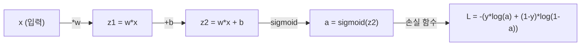
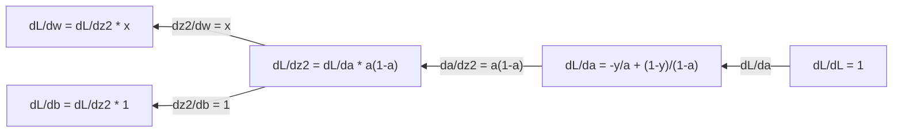
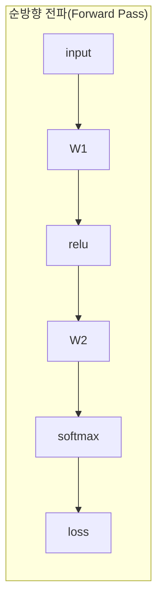
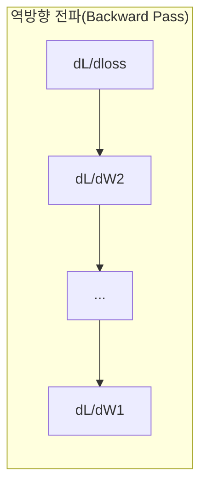

# 머신러닝을 위한 미적분학

> 미분은 어느 방향이 내리막인지 알려줍니다. 신경망이 학습하는 데 필요한 것은 오직 이것뿐입니다.

**유형:** Learn
**언어:** Python
**선수 요건:** 1단계, 01-03강
**시간:** 약 60분

## 학습 목표

- 일반적인 ML 함수(x^2, 시그모이드, 교차 엔트로피)에 대한 수치적 및 해석적 미분을 계산해 보세요
- 1D 및 2D에서 손실 함수를 최소화하기 위해 경사 하강법(Gradient Descent)을 처음부터 구현해 보세요
- 선형 회귀 모델의 기울기(Gradient)를 유도하고 수동 가중치 업데이트로 이를 학습해 보세요
- 헤시안(Hessian) 행렬, 테일러 급수 근사 및 최적화 방법과의 연관성을 설명해 보세요

## 문제점

수백만 개의 가중치(Weight)를 가진 신경망이 있습니다. 각 가중치는 하나의 노브(knob)입니다. 모델이 조금 더 덜 틀리도록 모든 노브를 어느 방향으로 돌려야 하는지 파악해야 합니다. 미적분학이 그 방향을 알려줍니다.

미적분학이 없다면, 신경망을 학습한다는 것은 무작위 변경을 시도하며 최상의 결과를 바라는 것과 같습니다. 미분을 사용하면 각 가중치가 오차에 어떻게 영향을 미치는지 정확히 알 수 있습니다. 매번 모든 노브를 올바른 방향으로 돌릴 수 있습니다.

## 개념

### 미분이란 무엇인가요?

미분은 변화율을 측정합니다. 함수 y = f(x)에 대해, 미분 f'(x)는 x를 아주 작은 양만큼 움직였을 때 y가 얼마나 변하는지 알려줍니다.

기하학적으로, 미분은 한 점에서의 접선 기울기입니다.

**f(x) = x^2:**

| x | f(x) | f'(x) (기울기) |
|---|------|---------------|
| 0 | 0    | 0 (평평함, 바닥) |
| 1 | 1    | 2 |
| 2 | 4    | 4 (이 점에서의 접선 기울기) |
| 3 | 9    | 6 |

x=2일 때, 기울기는 4입니다. x를 오른쪽으로 아주 조금 움직이면, y는 그 양의 약 4배만큼 증가합니다. x=0일 때, 기울기는 0입니다. 그릇의 바닥에 있는 것입니다.

형식적 정의:

```
f'(x) = lim   f(x + h) - f(x)
        h->0  -----------------
                     h
```

코드에서는 극한(limit)을 건너뛰고 매우 작은 h를 사용합니다. 이것이 수치적 미분입니다.

### 편미분: 한 번에 하나의 변수

실제 함수는 입력이 많습니다. 신경망 손실은 수천 개의 가중치에 의존합니다. 편미분은 하나의 변수를 제외한 모든 변수를 상수로 두고, 그 변수에 대해 미분합니다.

```
f(x, y) = x^2 + 3xy + y^2

df/dx = 2x + 3y     (treat y as a constant)
df/dy = 3x + 2y     (treat x as a constant)
```

각 편미분은 다음 질문에 답합니다: 이 가중치 하나만 살짝 조정하면 손실이 어떻게 변할까요?

### 기울기: 모든 편미분의 벡터

기울기는 모든 편미분을 하나의 벡터로 모은 것입니다. 함수 f(x, y, z)에 대해 기울기는 다음과 같습니다:

```
grad f = [ df/dx, df/dy, df/dz ]
```

기울기는 가장 가파른 상승 방향을 가리킵니다. 함수를 최소화하려면 반대 방향으로 이동합니다.

**f(x,y) = x^2 + y^2의 등고선 그래프:**

이 함수는 동심원을 등고선으로 하는 그릇 모양을 형성합니다. 최소값은 (0, 0)에 있습니다.

| 점 | grad f | -grad f (하강 방향) |
|-------|--------|----------------------------|
| (1, 1) | [2, 2] (상승 방향, 최소값에서 멀어짐) | [-2, -2] (하강 방향, 최소값으로 향함) |
| (0, 0) | [0, 0] (평평함, 최소값 위치) | [0, 0] |

이것이 그림으로 본 경사 하강법입니다. 기울기를 계산하고, 부호를 반전시키고, 한 단계 이동합니다.

### 최적화와의 연결

신경망 학습은 최적화입니다. 모델이 얼마나 틀렸는지를 측정하는 손실 함수 L(w1, w2, ..., wn)가 있으며, 이를 최소화해야 합니다.

```
Gradient descent update rule:

  w_new = w_old - learning_rate * dL/dw

For every weight:
  1. Compute the partial derivative of loss with respect to that weight
  2. Subtract a small multiple of it from the weight
  3. Repeat
```

학습률이 단계 크기를 제어합니다. 너무 크면 오버슈트(overshoot)가 발생하고, 너무 작으면 느리게 진행됩니다.

**손실 지형 (1D 단면):**

손실 함수 L(w)는 가중치 w가 변함에 따라 봉우리와 골짜기를 가진 곡선을 형성합니다.

| 특징 | 설명 |
|---------|-------------|
| 전역 최소값 | 곡선 전체의 가장 낮은 점 -- 최선의 해 |
| 지역 최소값 | 이웃보다 낮지만 전체적으로 가장 낮지는 않은 골짜기 |
| 기울기 | 경사 하강법은 어떤 시작점에서든 기울기를 따라 하강합니다 |

경사 하강법은 기울기를 따라 하강합니다. 지역 최소값에 갇힐 수 있지만, 고차원 공간(수백만 개의 가중치)에서는 이것이 실무적으로 거의 문제가 되지 않습니다.

### 수치적 미분 vs 해석적 미분

미분을 계산하는 두 가지 방법이 있습니다.

분석적: 미적분 규칙을 손으로 적용합니다. f(x) = x^2의 경우, 도함수는 f'(x) = 2x입니다. 정확하고 빠릅니다.

수치적: 정의를 사용하여 근사합니다. 아주 작은 h에 대해 f(x+h)와 f(x-h)를 계산한 후 차이를 사용합니다.

```
Numerical (central difference):

f'(x) ~= f(x + h) - f(x - h)
          -----------------------
                  2h

h = 0.0001 works well in practice
```

수치적 도함수는 느리지만 모든 함수에 대해 작동합니다. 분석적 도함수는 빠르지만 공식을 유도해야 합니다. 신경망 프레임워크는 세 번째 접근법을 사용합니다: 기계적으로 정확한 도함수를 계산하는 자동 미분입니다. 이는 3단계에서 확인할 수 있습니다.

### 단순 함수에 대한 손으로 계산한 도함수

ML에서 반복적으로 보게 될 도함수입니다.

```
Function        Derivative       Used in
--------        ----------       -------
f(x) = x^2     f'(x) = 2x      Loss functions (MSE)
f(x) = wx + b  f'(w) = x        Linear layer (gradient w.r.t. weight)
                f'(b) = 1        Linear layer (gradient w.r.t. bias)
                f'(x) = w        Linear layer (gradient w.r.t. input)
f(x) = e^x     f'(x) = e^x     Softmax, attention
f(x) = ln(x)   f'(x) = 1/x     Cross-entropy loss
f(x) = 1/(1+e^-x)  f'(x) = f(x)(1-f(x))   Sigmoid activation
```

f(x) = x^2의 경우:

```
f(x) = x^2    f'(x) = 2x

  x    f(x)   f'(x)   meaning
  -2    4      -4      slope tilts left (decreasing)
  -1    1      -2      slope tilts left (decreasing)
   0    0       0      flat (minimum!)
   1    1       2      slope tilts right (increasing)
   2    4       4      slope tilts right (increasing)
```

x=3, b=1인 f(w) = wx + b의 경우:

```
f(w) = 3w + 1    f'(w) = 3

The derivative with respect to w is just x.
If x is big, a small change in w causes a big change in output.
```

### 연쇄 법칙

함수가 합성될 때, 연쇄 법칙은 미분하는 방법을 알려줍니다.

```
If y = f(g(x)), then dy/dx = f'(g(x)) * g'(x)

Example: y = (3x + 1)^2
  outer: f(u) = u^2       f'(u) = 2u
  inner: g(x) = 3x + 1    g'(x) = 3
  dy/dx = 2(3x + 1) * 3 = 6(3x + 1)
```

신경망은 함수의 연쇄입니다: 입력 -> 선형 -> 활성화 -> 선형 -> 활성화 -> 손실. 역전파는 출력에서 입력으로 연쇄 법칙을 반복적으로 적용하는 것입니다. 이것이 전체 알고리즘입니다.

### 헤시안 행렬

기울기는 기울기를 알려줍니다. 헤시안은 곡률을 알려줍니다.

헤시안은 2계 편미분의 행렬입니다. 함수 f(x1, x2, ..., xn)에 대해 헤시안의 (i, j) 항목은 다음과 같습니다:

```
H[i][j] = d^2f / (dx_i * dx_j)
```

2변수 함수 f(x, y)의 경우:

```
H = | d^2f/dx^2    d^2f/dxdy |
    | d^2f/dydx    d^2f/dy^2 |
```

**임계점(기울기 = 0인 지점)에서 헤시안이 알려주는 내용:**

| 헤시안 속성 | 의미 | 예시 표면 |
|-----------------|---------|-----------------|
| 양정치 (모든 고유값 > 0) | 국소 최소값 | 위로 향하는 그릇 |
| 음정치 (모든 고유값 < 0) | 국소 최대값 | 아래로 향하는 그릇 |
| 부정정치 (혼합 고유값) | 안장점 | 말 안장 모양 |

**예시:** f(x, y) = x^2 - y^2 (안장 함수)

```
df/dx = 2x       df/dy = -2y
d^2f/dx^2 = 2    d^2f/dy^2 = -2    d^2f/dxdy = 0

H = | 2   0 |
    | 0  -2 |

Eigenvalues: 2 and -2 (one positive, one negative)
--> Saddle point at (0, 0)
```

f(x, y) = x^2 + y^2 (그릇)과 비교합니다:

```
H = | 2  0 |
    | 0  2 |

Eigenvalues: 2 and 2 (both positive)
--> Local minimum at (0, 0)
```

**ML에서 헤시안이 중요한 이유:**

뉴턴 방법은 헤시안을 사용하여 경사 하강법보다 더 나은 최적화 단계를 취합니다. 단순히 기울기를 따르는 대신 곡률을 고려합니다:

```
Newton's update:    w_new = w_old - H^(-1) * gradient
Gradient descent:   w_new = w_old - lr * gradient
```

뉴턴 방법은 헤시안이 기울기를 "재조정"하기 때문에 더 빠르게 수렴합니다 -- 가파른 방향은 더 작은 스텝을, 평평한 방향은 더 큰 스텝을 얻습니다.

단점: N개의 매개변수를 가진 신경망의 헤시안은 N x N 크기입니다. 100만 개의 매개변수를 가진 모델은 1조 개의 항목을 가진 행렬이 필요합니다. 그래서 우리는 근사치를 사용합니다.

| 방법 | 사용 내용 | 비용 | 수렴 속도 |
|--------|-------------|------|-------------|
| 경사 하강법 | 1차 도함수만 사용 | 스텝당 O(N) | 느림 (선형) |
| 뉴턴 방법 | 완전한 헤시안 | 스텝당 O(N^3) | 빠름 (2차) |
| L-BFGS | 기울기 이력으로부터의 근사 헤시안 | 스텝당 O(N) | 중간 (초선형) |
| Adam | 매개변수별 적응형 비율 (대각선 헤시안 근사) | 스텝당 O(N) | 중간 |
| 자연 기울기 | 피셔 정보 행렬 (통계적 헤시안) | 스텝당 O(N^2) | 빠름 |

실제로, Adam은 딥러닝의 기본 옵티마이저입니다. 매개변수별 기울기의 이동 평균과 분산을 추적하여 2차 정보를 저렴하게 근사합니다.

### 테일러 급수 근사

모든 매끄러운 함수는 다항식으로 국소적으로 근사할 수 있습니다:

```
f(x + h) = f(x) + f'(x)*h + (1/2)*f''(x)*h^2 + (1/6)*f'''(x)*h^3 + ...
```

포함하는 항이 많을수록 근사 품질이 좋아집니다 -- 단, 점 x 근처에서만 유효합니다.

**ML에서 테일러 급수가 중요한 이유:**

- **1차 테일러 = 경사 하강법.** f(x + h) ~ f(x) + f'(x)*h를 사용하면 선형 근사를 수행하는 것입니다. 경사 하강법은 이 선형 모델을 최소화하여 h = -lr * f'(x)를 선택합니다.

- **2차 테일러 = 뉴턴 방법.** f(x + h) ~ f(x) + f'(x)*h + (1/2)*f''(x)*h^2를 사용하면 2차 모델을 얻습니다. 이를 최소화하면 h = -f'(x)/f''(x)가 됩니다 -- 뉴턴 스텝입니다.

- **손실 함수 설계.** MSE와 교차 엔트로피는 매끄럽기 때문에 테일러 전개가 잘 작동합니다. 이는 우연이 아닙니다. 매끄러운 손실 함수는 최적화를 예측 가능하게 만듭니다.

```
Approximation order    What it captures    Optimization method
-------------------    -----------------   -------------------
0th order (constant)   Just the value      Random search
1st order (linear)     Slope               Gradient descent
2nd order (quadratic)  Curvature           Newton's method
Higher orders          Finer structure     Rarely used in ML
```

핵심 통찰: 모든 기울기 기반 최적화는 실제로 손실 함수를 국소적으로 근사하고, 그 근사의 최솟값으로 스텝을 이동하는 것입니다.

### ML에서의 적분

도함수는 변화율을 알려줍니다. 적분은 누적량 -- 곡선 아래 면적 --을 계산합니다.

ML에서는 적분을 손으로 계산하는 경우가 거의 없지만, 이 개념은 모든 곳에 존재합니다:

**확률.** 밀도 p(x)를 가진 연속 확률 변수의 경우:
```
P(a < X < b) = integral from a to b of p(x) dx
```
a와 b 사이의 확률 밀도 곡선 아래 면적은 그 범위에 포함될 확률입니다.

**기댓값.** 확률로 가중치를 부여한 평균 결과:
```
E[f(X)] = integral of f(x) * p(x) dx
```
데이터 분포에 대한 기댓값 손실은 적분입니다. 학습은 이의 경험적 근사값을 최소화합니다.

**KL 발산.** 두 분포가 얼마나 다른지 측정합니다:
```
KL(p || q) = integral of p(x) * log(p(x) / q(x)) dx
```
변분 오토인코더 (VAE)(VAE (Variational Autoencoder)), 지식 증류(Knowledge Distillation), 베이지안 추론(Inference)에 사용됩니다.

**정규화 상수.** 베이지안 추론(Inference)에서는:
```
p(w | data) = p(data | w) * p(w) / integral of p(data | w) * p(w) dw
```
분모는 모든 가능한 매개변수(Parameter) 값에 대한 적분입니다. 이는 종종 계산이 불가능하며, MCMC와 변분 추론과 같은 근사 기법을 사용하는 이유입니다.

| 적분 개념 | ML에서 나타나는 위치 |
|-----------------|----------------------|
| 곡선 아래 면적 | 밀도 함수로부터의 확률 |
| 기댓값 | 손실 함수(Loss Function), 위험 최소화 |
| KL 발산 | 변분 오토인코더 (VAE)(VAE (Variational Autoencoder)), 정책 최적화, 지식 증류(Knowledge Distillation) |
| 정규화(Normalization) | 베이지안 사후 확률, 소프트맥스(Softmax) 분모 |
| 주변 가능성 | 모델 비교, 증거 하한 (ELBO) |

### 계산 그래프에서의 다변량 연쇄 법칙

연쇄 법칙은 선형의 스칼라 함수에만 적용되지 않습니다. 신경망에서는 변수가 분산되고 병합됩니다. 간단한 순방향 전파에서 미분값이 흐르는 방식은 다음과 같습니다:



역방향 전파는 오른쪽에서 왼쪽으로 기울기(Gradient)를 계산합니다:



각 화살표는 지역 미분값을 곱합니다. 모든 매개변수에 대한 기울기는 손실(loss)에서 해당 매개변수까지의 경로에 있는 모든 지역 미분값의 곱입니다. 경로가 분기되고 합쳐질 때, 기여도를 합산합니다(다변량 연쇄 법칙).

역전파(Backpropagation)는 계산 그래프를 출력에서 입력으로 연쇄 법칙을 체계적으로 적용하는 것입니다.

### 자코비안(Jacobian) 행렬

함수가 벡터를 벡터로 매핑할 때(신경망 레이어처럼), 그 미분값은 행렬입니다. 자코비안(Jacobian)은 모든 입력에 대한 모든 출력의 모든 부분 미분값을 포함합니다.

f: R^n -> R^m에 대해, 자코비안(Jacobian) J는 m x n 행렬입니다:

| | x1 | x2 | ... | xn |
|---|---|---|---|---|
| f1 | df1/dx1 | df1/dx2 | ... | df1/dxn |
| f2 | df2/dx1 | df2/dx2 | ... | df2/dxn |
| ... | ... | ... | ... | ... |
| fm | dfm/dx1 | dfm/dx2 | ... | dfm/dxn |

신경망에서 자코비안(Jacobian)을 손으로 계산하지는 않습니다. PyTorch가 이를 처리합니다. 하지만 자코비안(Jacobian)의 존재를 알면 역전파(Backpropagation)에서의 형태를 이해하는 데 도움이 됩니다: 레이어가 R^n을 R^m으로 매핑하면, 그 자코비안(Jacobian)은 m x n입니다. 기울기는 이 행렬의 전치(transpose)를 통해 역방향으로 흐릅니다.

### 신경망에서 이것이 중요한 이유

신경망의 모든 가중치(Weight)는 기울기(Gradient)를 받습니다. 기울기는 손실(loss)을 줄이기 위해 그 가중치(Weight)를 어떻게 조정해야 하는지 알려줍니다.





각 가중치(Weight) 업데이트:
- `W1 = W1 - lr * dL/dW1`
- `W2 = W2 - lr * dL/dW2`

순방향 전파(Forward Pass)는 예측값과 손실(loss)을 계산합니다. 역방향 전파(Backward Pass)는 모든 가중치(Weight)에 대한 손실(loss)의 기울기(Gradient)를 계산합니다. 그런 다음 모든 가중치(Weight)는 작은 하강 단계를 취합니다. 수백만 번 반복하세요. 이것이 딥러닝입니다.

```figure
derivative-tangent
```

## 구현하기

### 1단계: 처음부터 수치적 미분 계산

```python
def numerical_derivative(f, x, h=1e-7):
    return (f(x + h) - f(x - h)) / (2 * h)

def f(x):
    return x ** 2

for x in [-2, -1, 0, 1, 2]:
    numerical = numerical_derivative(f, x)
    analytical = 2 * x
    print(f"x={x:2d}  f'(x) numerical={numerical:.6f}  analytical={analytical:.1f}")
```

수치적 미분은 분석적 미분과 소수점 이하 많은 자리까지 일치합니다.

### 2단계: 부분 미분과 기울기

```python
def numerical_gradient(f, point, h=1e-7):
    gradient = []
    for i in range(len(point)):
        point_plus = list(point)
        point_minus = list(point)
        point_plus[i] += h
        point_minus[i] -= h
        partial = (f(point_plus) - f(point_minus)) / (2 * h)
        gradient.append(partial)
    return gradient

def f_multi(point):
    x, y = point
    return x**2 + 3*x*y + y**2

grad = numerical_gradient(f_multi, [1.0, 2.0])
print(f"Numerical gradient at (1,2): {[f'{g:.4f}' for g in grad]}")
print(f"Analytical gradient at (1,2): [2*1+3*2, 3*1+2*2] = [{2*1+3*2}, {3*1+2*2}]")
```

### 3단계: f(x) = x^2의 최솟값을 찾기 위한 경사 하강법(Gradient Descent)

```python
x = 5.0
lr = 0.1
for step in range(20):
    grad = 2 * x
    x = x - lr * grad
    print(f"step {step:2d}  x={x:8.4f}  f(x)={x**2:10.6f}")
```

x=5에서 시작하면, 각 단계는 x=0 (최솟값)에 더 가까워집니다.

### 4단계: 2D 함수에 대한 경사 하강법

```python
def f_2d(point):
    x, y = point
    return x**2 + y**2

point = [4.0, 3.0]
lr = 0.1
for step in range(30):
    grad = numerical_gradient(f_2d, point)
    point = [p - lr * g for p, g in zip(point, grad)]
    loss = f_2d(point)
    if step % 5 == 0 or step == 29:
        print(f"step {step:2d}  point=({point[0]:7.4f}, {point[1]:7.4f})  f={loss:.6f}")
```

### 5단계: 수치 미분과 해석적 미분 비교

```python
import math

test_functions = [
    ("x^2",      lambda x: x**2,          lambda x: 2*x),
    ("x^3",      lambda x: x**3,          lambda x: 3*x**2),
    ("sin(x)",   lambda x: math.sin(x),   lambda x: math.cos(x)),
    ("e^x",      lambda x: math.exp(x),   lambda x: math.exp(x)),
    ("1/x",      lambda x: 1/x,           lambda x: -1/x**2),
]

x = 2.0
print(f"{'Function':<12} {'Numerical':>12} {'Analytical':>12} {'Error':>12}")
print("-" * 50)
for name, f, df in test_functions:
    num = numerical_derivative(f, x)
    ana = df(x)
    err = abs(num - ana)
    print(f"{name:<12} {num:12.6f} {ana:12.6f} {err:12.2e}")
```

### 6단계: 헤시안(Hessian)을 수치적으로 계산하기

```python
def hessian_2d(f, x, y, h=1e-5):
    fxx = (f(x + h, y) - 2 * f(x, y) + f(x - h, y)) / (h ** 2)
    fyy = (f(x, y + h) - 2 * f(x, y) + f(x, y - h)) / (h ** 2)
    fxy = (f(x + h, y + h) - f(x + h, y - h) - f(x - h, y + h) + f(x - h, y - h)) / (4 * h ** 2)
    return [[fxx, fxy], [fxy, fyy]]

def saddle(x, y):
    return x ** 2 - y ** 2

def bowl(x, y):
    return x ** 2 + y ** 2

H_saddle = hessian_2d(saddle, 0.0, 0.0)
H_bowl = hessian_2d(bowl, 0.0, 0.0)
print(f"Saddle Hessian: {H_saddle}")  # [[2, 0], [0, -2]] -- 부호가 혼합됨
print(f"Bowl Hessian:   {H_bowl}")    # [[2, 0], [0, 2]]  -- 모두 양수
```

안장(saddle) 함수의 헤시안은 고유값이 2와 -2로 부호가 혼합되어 안장점임을 확인합니다. 그릇(bowl) 함수의 헤시안은 고유값이 2와 2로 모두 양수이므로 최솟값임을 확인합니다.

### 7단계: 테일러 근사(Taylor approximation)의 실제 적용

```python
import math

def taylor_approx(f, f_prime, f_double_prime, x0, h, order=2):
    result = f(x0)
    if order >= 1:
        result += f_prime(x0) * h
    if order >= 2:
        result += 0.5 * f_double_prime(x0) * h ** 2
    return result

x0 = 0.0
for h in [0.1, 0.5, 1.0, 2.0]:
    true_val = math.sin(h)
    t1 = taylor_approx(math.sin, math.cos, lambda x: -math.sin(x), x0, h, order=1)
    t2 = taylor_approx(math.sin, math.cos, lambda x: -math.sin(x), x0, h, order=2)
    print(f"h={h:.1f}  sin(h)={true_val:.4f}  order1={t1:.4f}  order2={t2:.4f}")
```

x0=0 근처에서 sin(x) ~ x (1차 테일러 근사)입니다. h가 작을 때는 근사가 매우 우수하지만, h가 크면 근사가 무너집니다. 이것이 경사 하강법이 작은 학습률로 가장 잘 작동하는 이유입니다. 각 단계는 선형 근사가 정확하다고 가정하기 때문입니다.

### 8단계: 신경망에서 이것이 중요한 이유

```python
import random

random.seed(42)

w = random.gauss(0, 1)
b = random.gauss(0, 1)
lr = 0.01

xs = [1.0, 2.0, 3.0, 4.0, 5.0]
ys = [3.0, 5.0, 7.0, 9.0, 11.0]

for epoch in range(200):
    total_loss = 0
    dw = 0
    db = 0
    for x, y in zip(xs, ys):
        pred = w * x + b
        error = pred - y
        total_loss += error ** 2
        dw += 2 * error * x
        db += 2 * error
    dw /= len(xs)
    db /= len(xs)
    total_loss /= len(xs)
    w -= lr * dw
    b -= lr * db
    if epoch % 40 == 0 or epoch == 199:
        print(f"epoch {epoch:3d}  w={w:.4f}  b={b:.4f}  loss={total_loss:.6f}")

print(f"\nLearned: y = {w:.2f}x + {b:.2f}")
print(f"Actual:  y = 2x + 1")
```

모든 경사 기반 학습 루프는 이 패턴을 따릅니다: 예측, 손실 계산, 기울기 계산, 가중치 업데이트.

## 사용하기

NumPy를 사용하면 동일한 연산이 더 빠르고 간결합니다:

```python
import numpy as np

x = np.array([1, 2, 3, 4, 5], dtype=float)
y = np.array([3, 5, 7, 9, 11], dtype=float)

w, b = np.random.randn(), np.random.randn()
lr = 0.01

for epoch in range(200):
    pred = w * x + b
    error = pred - y
    loss = np.mean(error ** 2)
    dw = np.mean(2 * error * x)
    db = np.mean(2 * error)
    w -= lr * dw
    b -= lr * db

print(f"Learned: y = {w:.2f}x + {b:.2f}")
```

지금까지 경사 하강법을 처음부터 직접 구축했습니다. PyTorch는 기울기 계산을 자동화하지만, 업데이트 루프는 동일합니다.

## 연습 문제

1. `numerical_derivative`을 두 번 호출하여 `numerical_second_derivative(f, x)`을 구현해 보세요. x=2에서 x^3의 2차 도함수가 12임을 확인하세요.
2. 경사 하강법을 사용하여 f(x, y) = (x - 3)^2 + (y + 1)^2의 최솟값을 찾아보세요. (0, 0)에서 시작하세요. 답은 (3, -1)로 수렴해야 합니다.
3. 경사 하강법 루프에 모멘텀(momentum)을 추가하세요: 과거 기울기를 누적하는 속도 벡터를 유지합니다. f(x) = x^4 - 3x^2에서 모멘텀이 있을 때와 없을 때의 수렴 속도를 비교해 보세요.

## 핵심 용어

| 용어 | 사람들이 말하는 것 | 실제 의미 |
|------|----------------|----------------------|
| 도함수(Derivative) | "기울기" | 한 점에서의 함수 변화율입니다. 입력이 한 단위 변할 때 출력이 얼마나 변하는지 알려줍니다. |
| 편미분(Partial derivative) | "한 변수의 도함수" | 다른 모든 변수는 고정된 상태에서 한 변수에 대한 도함수입니다. |
| 기울기(Gradient) | "가장 가파른 상승 방향" | 모든 편미분으로 이루어진 벡터입니다. 함수를 가장 빠르게 증가시키는 방향을 가리킵니다. |
| 경사 하강법(Gradient Descent) | "내리막길로 이동" | 매개변수에서 기울기(학습률 곱)를 빼서 손실을 줄입니다. 신경망 학습의 핵심입니다. |
| 학습률(Learning Rate) | "보폭 크기" | 각 경사 하강법 단계의 크기를 제어하는 스칼라 값입니다. 너무 크면 발산하고, 너무 작으면 수렴이 느려집니다. |
| 연쇄 법칙(Chain Rule) | "미분값 곱하기" | 합성 함수를 미분하는 규칙입니다: df/dx = df/dg * dg/dx. 역전파의 수학적 기초입니다. |
| 야코비안(Jacobian) | "미분 행렬" | 함수가 벡터를 벡터로 매핑할 때, 야코비안은 입력에 대한 출력의 모든 편미분으로 이루어진 행렬입니다. |
| 수치 미분(Numerical Derivative) | "유한 차분" | 두 인접한 지점에서 함수를 평가하고 그 사이의 기울기를 계산하여 미분값을 근사하는 방법입니다. |
| 역전파(Backpropagation) | "역방향 모드 자동 미분" | 연쇄 법칙을 사용하여 출력에서 입력으로 레이어별로 기울기를 계산하는 방법입니다. 신경망이 학습하는 방식입니다. |
| 헤시안(Hessian) | "2차 미분 행렬" | 모든 2차 편미분으로 이루어진 행렬입니다. 함수의 곡률을 설명합니다. 임계점에서의 헤시안이 양정치(positive definite)이면 국소 최소값을 의미합니다. |
| 테일러 급수(Taylor Series) | "다항식 근사" | 미분값을 사용하여 특정 지점 근처에서 함수를 근사합니다: f(x+h) ~ f(x) + f'(x)h + (1/2)f''(x)h^2 + ... 경사 하강법과 뉴턴 방법이 작동하는 이유를 이해하는 기초입니다. |
| 적분(Integral) | "곡선 아래 면적" | 특정 범위에 걸쳐 양을 누적하는 것입니다. ML에서는 적분이 확률, 기대값, KL 발산을 정의합니다. |

## 추가 읽기

- [3Blue1Brown: Essence of Calculus](https://www.3blue1brown.com/topics/calculus) - 미분, 적분, 연쇄 법칙에 대한 시각적 직관
- [Stanford CS231n: Backpropagation](https://cs231n.github.io/optimization-2/) - 신경망 레이어를 통해 기울기가 흐르는 방식
