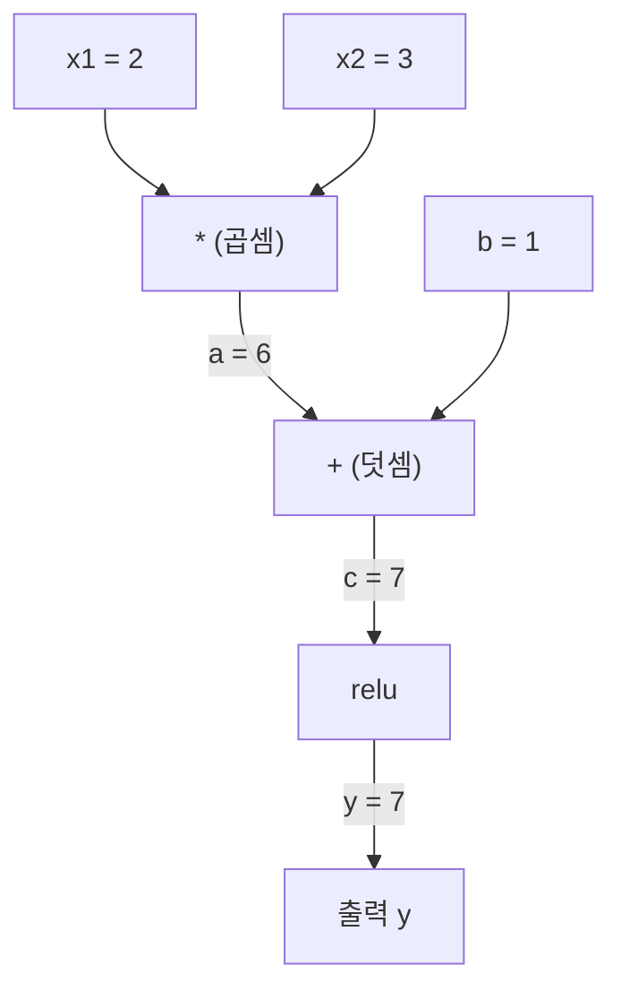
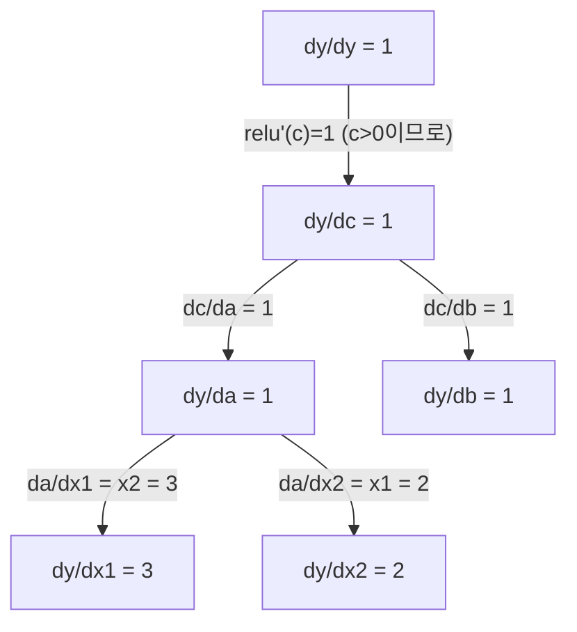

# 연쇄법칙과 자동미분 (Chain Rule & Automatic Differentiation)

> 연쇄법칙은 학습하는 모든 신경망 뒤의 엔진입니다.

**Type:** Build
**Language:** Python
**Prerequisites:** Phase 1, Lesson 04 (Derivatives & Gradients)
**Time:** ~90 minutes

## 학습 목표 (Learning Objectives)

- 연산을 기록하고 역모드 자동미분으로 기울기를 계산하는 최소 autograd 엔진(Value 클래스)을 만듭니다
- 위상 정렬을 사용해 계산 그래프에서 순전파·역전파를 구현합니다
- 처음부터 만든 autograd 엔진만으로 XOR에서 다층 퍼셉트론을 구성하고 학습합니다
- 수치 유한 차분과 비교하는 기울기 검사로 자동미분 정확성을 검증합니다

## 문제 상황 (The Problem)

간단한 함수의 도함수는 계산할 수 있습니다. 하지만 신경망은 간단한 함수가 아닙니다. 수백 개의 함수가 합성된 것입니다: 행렬 곱, 편향 더하기, 활성화, 다시 행렬 곱, softmax, cross-entropy 손실. 출력은 함수의 함수의 함수입니다.

네트워크를 학습하려면 모든 가중치에 대한 손실의 기울기가 필요합니다. 수백만 파라미터를 손으로 하는 것은 불가능합니다. 수치적으로(유한 차분) 하면 너무 느립니다.

연쇄법칙은 수학을 줍니다. 자동미분은 알고리즘을 줍니다. 둘이 합쳐지면 임의로 합성된 함수를 통해, 단일 순전파에 비례하는 시간에 정확한 기울기를 계산할 수 있습니다.

이것이 PyTorch, TensorFlow, JAX가 동작하는 방식입니다. 축소판을 처음부터 만듭니다.

## 핵심 개념 (The Concept)

### 연쇄법칙 (The Chain Rule)

`y = f(g(x))`이면, x에 대한 y의 도함수는:

```
dy/dx = dy/dg * dg/dx = f'(g(x)) * g'(x)
```

사슬을 따라 도함수를 곱합니다. 각 고리가 국소 도함수를 기여합니다.

예: `y = sin(x^2)`

```
g(x) = x^2       g'(x) = 2x
f(g) = sin(g)     f'(g) = cos(g)

dy/dx = cos(x^2) * 2x
```

더 깊은 합성에서는 사슬이 길어집니다:

```
y = f(g(h(x)))

dy/dx = f'(g(h(x))) * g'(h(x)) * h'(x)
```

신경망의 모든 레이어가 이 사슬의 한 고리입니다.

### 계산 그래프 (Computational Graphs)

계산 그래프는 연쇄법칙을 시각적으로 만듭니다. 모든 연산이 노드가 됩니다. 데이터는 그래프를 따라 앞으로 흐릅니다. 기울기는 뒤로 흐릅니다.

**순전파 (값 계산):**



**역전파 (기울기 계산):**



역전파는 모든 노드에서 연쇄법칙을 적용해, 출력에서 입력으로 기울기를 전파합니다.

### 순모드 vs 역모드

그래프를 통해 연쇄법칙을 적용하는 방법은 두 가지입니다.

**순모드(forward mode)**는 입력에서 시작해 도함수를 앞으로 밉니다. `dx/dx = 1`을 계산하고 각 연산을 통해 전파합니다. 입력이 적고 출력이 많을 때 좋습니다.

```
Forward mode: seed dx/dx = 1, propagate forward

  x = 2       (dx/dx = 1)
  a = x^2     (da/dx = 2x = 4)
  y = sin(a)  (dy/dx = cos(a) * da/dx = cos(4) * 4 = -2.615)
```

**역모드(reverse mode)**는 출력에서 시작해 기울기를 뒤로 당깁니다. `dy/dy = 1`을 계산하고 각 연산을 역순으로 전파합니다. 입력이 많고 출력이 적을 때 좋습니다.

```
Reverse mode: seed dy/dy = 1, propagate backward

  y = sin(a)  (dy/dy = 1)
  a = x^2     (dy/da = cos(a) = cos(4) = -0.654)
  x = 2       (dy/dx = dy/da * da/dx = -0.654 * 4 = -2.615)
```

신경망은 입력이 수백만 개(가중치)이고 출력이 하나(손실)입니다. 역모드는 한 번의 역전파로 모든 기울기를 계산합니다. 그래서 역전파가 역모드를 씁니다.

| 모드 | 시드 | 방향 | 최적인 경우 |
|------|------|-----------|-----------|
| 순모드 | `dx_i/dx_i = 1` | 입력 → 출력 | 입력 적음, 출력 많음 |
| 역모드 | `dy/dy = 1` | 출력 → 입력 | 입력 많음, 출력 적음 (신경망) |

### 순모드를 위한 쌍대 수 (Dual Numbers)

순모드는 쌍대 수로 우아하게 구현할 수 있습니다. 쌍대 수는 `a + b*epsilon` 형태이며 `epsilon^2 = 0`입니다.

```
Dual number: (value, derivative)

(2, 1) means: value is 2, derivative w.r.t. x is 1

Arithmetic rules:
  (a, a') + (b, b') = (a+b, a'+b')
  (a, a') * (b, b') = (a*b, a'*b + a*b')
  sin(a, a')         = (sin(a), cos(a)*a')
```

입력 변수에 도함수 1을 시드합니다. 도함수는 모든 연산을 통해 자동으로 전파됩니다.

### Autograd 엔진 만들기

Autograd 엔진에는 세 가지가 필요합니다:

1. **값 래핑.** 모든 숫자를 값과 기울기를 저장하는 객체로 감쌉니다.
2. **그래프 기록.** 모든 연산이 입력과 국소 기울기 함수를 기록합니다.
3. **역전파.** 그래프를 위상 정렬한 뒤 역순으로 걸어가며 각 노드에서 연쇄법칙을 적용합니다.

이것이 정확히 PyTorch의 `autograd`가 하는 일입니다. `torch.Tensor` 클래스가 값을 감싸고, `requires_grad=True`일 때 연산을 기록하며, `.backward()`를 호출하면 기울기를 계산합니다.

### PyTorch Autograd의 내부 동작

PyTorch 코드를 쓸 때:

```python
x = torch.tensor(2.0, requires_grad=True)
y = x ** 2 + 3 * x + 1
y.backward()
print(x.grad)  # 7.0 = 2*x + 3 = 2*2 + 3
```

PyTorch 내부에서는:

1. `requires_grad=True`인 `x`에 대한 `Tensor` 노드를 만듭니다
2. 모든 연산(`**`, `*`, `+`)이 새 노드를 만들고 역방향 함수를 기록합니다
3. `y.backward()`가 기록된 그래프를 통해 역모드 자동미분을 트리거합니다
4. 각 노드의 `grad_fn`이 국소 기울기를 계산해 부모 노드에 전달합니다
5. 기울기는 `.grad` 속성에 더하기로 누적됩니다(덮어쓰지 않음)

그래프는 동적입니다(define-by-run). 매 순전파마다 새 그래프가 만들어집니다. 그래서 PyTorch는 모델 안에 제어 흐름(if/else, 루프)을 지원합니다.

```figure
chain-rule
```

## 구현하기 (Build It)

### Step 1: Value 클래스

```python
class Value:
    def __init__(self, data, children=(), op=''):
        self.data = data
        self.grad = 0.0
        self._backward = lambda: None
        self._prev = set(children)
        self._op = op

    def __repr__(self):
        return f"Value(data={self.data:.4f}, grad={self.grad:.4f})"
```

모든 `Value`는 숫자 데이터, 기울기(처음엔 0), 역방향 함수, 그리고 자신을 만든 자식 노드에 대한 포인터를 저장합니다.

### Step 2: 기울기 추적이 있는 산술 연산

```python
    def __add__(self, other):
        other = other if isinstance(other, Value) else Value(other)
        out = Value(self.data + other.data, (self, other), '+')
        def _backward():
            self.grad += out.grad
            other.grad += out.grad
        out._backward = _backward
        return out

    def __mul__(self, other):
        other = other if isinstance(other, Value) else Value(other)
        out = Value(self.data * other.data, (self, other), '*')
        def _backward():
            self.grad += other.data * out.grad
            other.grad += self.data * out.grad
        out._backward = _backward
        return out

    def relu(self):
        out = Value(max(0, self.data), (self,), 'relu')
        def _backward():
            self.grad += (1.0 if out.data > 0 else 0.0) * out.grad
        out._backward = _backward
        return out
```

각 연산은 국소 기울기를 계산하고 상류 기울기(`out.grad`)를 곱하는 방법을 아는 클로저를 만듭니다. `+=`는 값이 여러 연산에 쓰일 경우를 처리합니다.

### Step 3: 역전파

```python
    def backward(self):
        topo = []
        visited = set()
        def build_topo(v):
            if v not in visited:
                visited.add(v)
                for child in v._prev:
                    build_topo(child)
                topo.append(v)
        build_topo(self)

        self.grad = 1.0
        for v in reversed(topo):
            v._backward()
```

위상 정렬은 노드의 기울기가 자식으로 전파되기 전에 완전히 계산되도록 보장합니다. 시드 기울기는 1.0입니다(dy/dy = 1).

### Step 4: 완전한 엔진을 위한 더 많은 연산

기본 Value 클래스는 덧셈, 곱셈, relu를 처리합니다. 실제 autograd 엔진에는 더 필요합니다. 신경망을 만들려면 다음 연산이 필요합니다:

```python
    def __neg__(self):
        return self * -1

    def __sub__(self, other):
        return self + (-other)

    def __radd__(self, other):
        return self + other

    def __rmul__(self, other):
        return self * other

    def __rsub__(self, other):
        return other + (-self)

    def __pow__(self, n):
        out = Value(self.data ** n, (self,), f'**{n}')
        def _backward():
            self.grad += n * (self.data ** (n - 1)) * out.grad
        out._backward = _backward
        return out

    def __truediv__(self, other):
        return self * (other ** -1) if isinstance(other, Value) else self * (Value(other) ** -1)

    def exp(self):
        import math
        e = math.exp(self.data)
        out = Value(e, (self,), 'exp')
        def _backward():
            self.grad += e * out.grad
        out._backward = _backward
        return out

    def log(self):
        import math
        out = Value(math.log(self.data), (self,), 'log')
        def _backward():
            self.grad += (1.0 / self.data) * out.grad
        out._backward = _backward
        return out

    def tanh(self):
        import math
        t = math.tanh(self.data)
        out = Value(t, (self,), 'tanh')
        def _backward():
            self.grad += (1 - t ** 2) * out.grad
        out._backward = _backward
        return out
```

**각 연산이 중요한 이유:**

| 연산 | 역방향 규칙 | 사용되는 곳 |
|-----------|--------------|---------|
| `__sub__` | add + neg 재사용 | 손실 계산 (pred - target) |
| `__pow__` | n * x^(n-1) | 다항 활성화, MSE (error^2) |
| `__truediv__` | mul + pow(-1) 재사용 | 정규화, 학습률 스케일 |
| `exp` | exp(x) * upstream | Softmax, 로그 가능도 |
| `log` | (1/x) * upstream | Cross-entropy 손실, 로그 확률 |
| `tanh` | (1 - tanh^2) * upstream | 고전적 활성화 함수 |

영리한 부분: `__sub__`와 `__truediv__`는 기존 연산으로 정의됩니다. 연쇄법칙이 아래의 add/mul/pow를 통해 합성되므로 올바른 기울기를 공짜로 얻습니다.

### Step 5: 처음부터 미니 MLP

완전한 Value 클래스로 신경망을 만들 수 있습니다. PyTorch 없음. NumPy 없음. Value와 연쇄법칙만.

```python
import random

class Neuron:
    def __init__(self, n_inputs):
        self.w = [Value(random.uniform(-1, 1)) for _ in range(n_inputs)]
        self.b = Value(0.0)

    def __call__(self, x):
        act = sum((wi * xi for wi, xi in zip(self.w, x)), self.b)
        return act.tanh()

    def parameters(self):
        return self.w + [self.b]

class Layer:
    def __init__(self, n_inputs, n_outputs):
        self.neurons = [Neuron(n_inputs) for _ in range(n_outputs)]

    def __call__(self, x):
        return [n(x) for n in self.neurons]

    def parameters(self):
        return [p for n in self.neurons for p in n.parameters()]

class MLP:
    def __init__(self, sizes):
        self.layers = [Layer(sizes[i], sizes[i+1]) for i in range(len(sizes)-1)]

    def __call__(self, x):
        for layer in self.layers:
            x = layer(x)
        return x[0] if len(x) == 1 else x

    def parameters(self):
        return [p for layer in self.layers for p in layer.parameters()]
```

`Neuron`은 `tanh(w1*x1 + w2*x2 + ... + b)`를 계산합니다. `Layer`는 뉴런의 목록입니다. `MLP`는 레이어를 쌓습니다. 모든 가중치가 `Value`이므로 `loss.backward()`를 호출하면 모든 파라미터로 기울기가 전파됩니다.

**XOR에서 학습:**

```python
random.seed(42)
model = MLP([2, 4, 1])  # 2 inputs, 4 hidden neurons, 1 output

xs = [[0, 0], [0, 1], [1, 0], [1, 1]]
ys = [-1, 1, 1, -1]  # XOR pattern (using -1/1 for tanh)

for step in range(100):
    preds = [model(x) for x in xs]
    loss = sum((p - y) ** 2 for p, y in zip(preds, ys))

    for p in model.parameters():
        p.grad = 0.0
    loss.backward()

    lr = 0.05
    for p in model.parameters():
        p.data -= lr * p.grad

    if step % 20 == 0:
        print(f"step {step:3d}  loss = {loss.data:.4f}")

print("\nPredictions after training:")
for x, y in zip(xs, ys):
    print(f"  input={x}  target={y:2d}  pred={model(x).data:6.3f}")
```

이것이 micrograd입니다. 자동미분을 갖춘 순수 Python의 완전한 신경망 학습 루프입니다. 모든 상용 딥러닝 프레임워크가 대규모로 같은 일을 합니다.

### Step 6: 기울기 검사 (Gradient checking)

자동미분이 올바른지 어떻게 알까요? 수치 도함수와 비교합니다. 이것이 기울기 검사입니다.

```python
def gradient_check(build_expr, x_val, h=1e-7):
    x = Value(x_val)
    y = build_expr(x)
    y.backward()
    autodiff_grad = x.grad

    y_plus = build_expr(Value(x_val + h)).data
    y_minus = build_expr(Value(x_val - h)).data
    numerical_grad = (y_plus - y_minus) / (2 * h)

    diff = abs(autodiff_grad - numerical_grad)
    return autodiff_grad, numerical_grad, diff
```

복잡한 식에서 테스트:

```python
def expr(x):
    return (x ** 3 + x * 2 + 1).tanh()

ad, num, diff = gradient_check(expr, 0.5)
print(f"Autodiff:  {ad:.8f}")
print(f"Numerical: {num:.8f}")
print(f"Difference: {diff:.2e}")
# Difference should be < 1e-5
```

새 연산을 구현할 때 기울기 검사가 필수입니다. 역전파에 버그가 있으면 수치 검사가 잡습니다. 진지한 딥러닝 구현은 개발 중 기울기 검사를 돌립니다.

**기울기 검사를 언제 쓸까:**

| 상황 | 기울기 검사? |
|-----------|-------------------|
| Autograd에 새 연산 추가 | 예, 항상 |
| 수렴하지 않는 학습 루프 디버깅 | 예, 먼저 기울기 확인 |
| 프로덕션 학습 | 아니요, 너무 느림 (파라미터당 순전파 2배) |
| Autograd 코드 단위 테스트 | 예, 자동화 |

### Step 7: 수동 계산과 검증

```python
x1 = Value(2.0)
x2 = Value(3.0)
a = x1 * x2          # a = 6.0
b = a + Value(1.0)    # b = 7.0
y = b.relu()          # y = 7.0

y.backward()

print(f"y = {y.data}")          # 7.0
print(f"dy/dx1 = {x1.grad}")   # 3.0 (= x2)
print(f"dy/dx2 = {x2.grad}")   # 2.0 (= x1)
```

수동 확인: `y = relu(x1*x2 + 1)`. `x1*x2 + 1 = 7 > 0`이므로 relu는 항등입니다.
`dy/dx1 = x2 = 3`. `dy/dx2 = x1 = 2`. 엔진이 일치합니다.

## 실용 활용 (Use It)

### PyTorch와 검증

```python
import torch

x1 = torch.tensor(2.0, requires_grad=True)
x2 = torch.tensor(3.0, requires_grad=True)
a = x1 * x2
b = a + 1.0
y = torch.relu(b)
y.backward()

print(f"PyTorch dy/dx1 = {x1.grad.item()}")  # 3.0
print(f"PyTorch dy/dx2 = {x2.grad.item()}")  # 2.0
```

같은 기울기입니다. 수학이 같기 때문에 — 연쇄법칙에 의한 역모드 자동미분 — 엔진이 PyTorch와 같은 결과를 냅니다.

### 더 복잡한 식

```python
a = Value(2.0)
b = Value(-3.0)
c = Value(10.0)
f = (a * b + c).relu()  # relu(2*(-3) + 10) = relu(4) = 4

f.backward()
print(f"df/da = {a.grad}")  # -3.0 (= b)
print(f"df/db = {b.grad}")  #  2.0 (= a)
print(f"df/dc = {c.grad}")  #  1.0
```

## 배포할 산출물 (Ship It)

이 레슨이 만드는 것:
- `outputs/skill-autodiff.md` — autograd 시스템을 만들고 디버깅하기 위한 스킬
- `code/autodiff.py` — 확장할 수 있는 최소 autograd 엔진

여기서 만든 Value 클래스는 Phase 3의 신경망 학습 루프의 기초입니다.

## 연습 문제 (Exercises)

1. Value 클래스에 `__pow__`를 추가해 `x ** n`을 계산할 수 있게 하세요. `x=2`에서 `d/dx(x^3)`가 `12.0`인지 검증하세요.

2. 활성화 함수로 `tanh`를 추가하세요. `tanh'(0) = 1`이고 `tanh'(2) = 0.0707`(근사)인지 검증하세요.

3. 단일 뉴런의 계산 그래프를 만드세요: `y = relu(w1*x1 + w2*x2 + b)`. 다섯 개 기울기를 모두 계산하고 PyTorch와 검증하세요.

4. 쌍대 수로 순모드 자동미분을 구현하세요. `Dual` 클래스를 만들고 역모드 엔진과 같은 도함수를 주는지 검증하세요.

## 핵심 용어 (Key Terms)

| 용어 | 사람들이 말하는 것 | 실제 의미 |
|------|----------------|----------------------|
| 연쇄법칙 | "도함수를 곱하라" | 합성 함수의 도함수는 각 함수의 국소 도함수를 올바른 점에서 평가한 곱과 같음 |
| 계산 그래프 | "네트워크 다이어그램" | 노드가 연산이고 간선이 값(앞) 또는 기울기(뒤)를 나르는 방향성 비순환 그래프 |
| 순모드 | "도함수를 앞으로 밀어라" | 입력에서 출력으로 도함수를 전파하는 자동미분. 입력 변수당 한 패스. |
| 역모드 | "역전파" | 출력에서 입력으로 기울기를 전파하는 자동미분. 출력 변수당 한 패스. |
| Autograd | "자동 기울기" | 값에 대한 연산을 기록하고 그래프를 만든 뒤 연쇄법칙으로 정확한 기울기를 계산하는 시스템 |
| 쌍대 수 | "값 + 도함수" | a + b*epsilon (epsilon^2 = 0) 형태의 수로, 산술을 통해 도함수 정보를 운반 |
| 위상 정렬 | "의존성 순서" | 모든 노드가 의존성 뒤에 오도록 그래프 노드를 정렬. 올바른 기울기 전파에 필요. |
| 기울기 누적 | "덮어쓰지 말고 더하라" | 값이 여러 연산에 들어가면 기울기는 들어오는 모든 기울기 기여의 합 |
| 동적 그래프 | "실행하며 정의" | 매 순전파마다 다시 만들어지는 계산 그래프. 모델 안 Python 제어 흐름 허용 (PyTorch 스타일) |
| 기울기 검사 | "수치 검증" | 자동미분 기울기를 수치 유한 차분 기울기와 비교해 정확성 검증. 디버깅에 필수. |
| MLP | "다층 퍼셉트론" | 하나 이상의 은닉 레이어를 가진 신경망. 각 뉴런은 가중 합 + 편향 후 활성화를 적용. |
| 뉴런 | "가중 합 + 활성화" | 기본 단위: output = activation(w1*x1 + w2*x2 + ... + b). 가중치와 편향이 학습 가능 파라미터. |

## 더 읽을거리 (Further Reading)

- [3Blue1Brown: Backpropagation calculus](https://www.youtube.com/watch?v=tIeHLnjs5U8) -- 신경망에서 연쇄법칙의 시각적 설명
- [PyTorch Autograd mechanics](https://pytorch.org/docs/stable/notes/autograd.html) -- 실제 시스템이 어떻게 동작하는지
- [Baydin et al., Automatic Differentiation in Machine Learning: a Survey](https://arxiv.org/abs/1502.05767) -- 포괄적 참고 문헌
