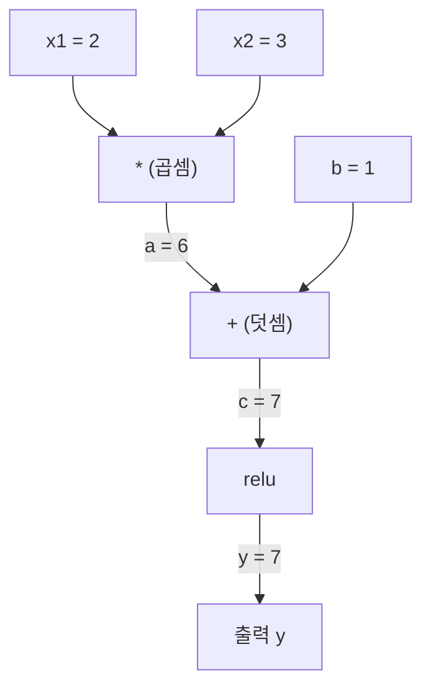

# 연쇄 법칙과 자동 미분

> 연쇄 법칙은 학습하는 모든 신경망의 엔진입니다.

**유형:** Build
**언어:** Python
**선수 요건:** 1단계, 04강 (미분과 기울기)
**시간:** 약 90분

## 학습 목표

- 연산을 기록하고 역방향 모드 오토디프(autodiff)로 기울기를 계산하는 최소한의 오토그라드(Autograd) 엔진(`Value` 클래스)을 구축해 보세요
- 위상 정렬(topological sort)을 사용하여 계산 그래프를 통해 순방향 및 역방향 전파를 구현해 보세요
- 처음부터 구축한 오토그라드 엔진만 사용하여 XOR에 다층 퍼셉트론을 구성하고 학습해 보세요
- 수치적 유한 차분(finite differences)과 비교하는 기울기 검사로 오토디프의 정확성을 검증해 보세요

## 문제점

단순한 함수의 미분은 계산할 수 있습니다. 하지만 신경망은 단순한 함수가 아닙니다. 수백 개의 함수가 합성된 것입니다: 행렬 곱, 편향 더하기, 활성화 적용, 다시 행렬 곱, 소프트맥스(Softmax), 교차 엔트로피(Cross-Entropy) 손실. 출력은 함수의 함수의 함수입니다.

네트워크를 학습하려면 모든 가중치(Weight)에 대한 손실(Loss)의 기울기가 필요합니다. 수백만 개의 매개변수(Parameter)에 대해 이를 수작업으로 수행하는 것은 불가능합니다. 수치적으로 수행하는 것(유한 차분)은 너무 느립니다.

연쇄 법칙은 수학적 근거를 제공합니다. 자동 미분은 알고리즘을 제공합니다. 둘을 결합하면 임의의 함수 합성을 통해 순방향 전파와 비례하는 시간에 정확한 기울기를 계산할 수 있습니다.

PyTorch, TensorFlow, JAX가 작동하는 방식입니다. 축약본을 처음부터 구축해 보세요.

## 개념

### 연쇄 법칙

`y = f(g(x))`인 경우, `x`에 대한 `y`의 미분은 다음과 같습니다:

```
dy/dx = dy/dg * dg/dx = f'(g(x)) * g'(x)
```

연쇄를 따라 미분값을 곱합니다. 각 연결 고리는 지역 미분값을 기여합니다.

예시: `y = sin(x^2)`

```
g(x) = x^2       g'(x) = 2x
f(g) = sin(g)     f'(g) = cos(g)

dy/dx = cos(x^2) * 2x
```

더 깊은 합성의 경우, 연쇄가 확장됩니다:

```
y = f(g(h(x)))

dy/dx = f'(g(h(x))) * g'(h(x)) * h'(x)
```

신경망의 모든 레이어는 이 연쇄의 한 연결 고리입니다.

### 계산 그래프

계산 그래프는 연쇄 법칙을 시각적으로 보여줍니다. 모든 연산이 노드가 됩니다. 데이터는 그래프를 따라 앞으로 흐릅니다. 기울기는 뒤로 흐릅니다.

**순방향 전파 (값 계산):**



**역방향 전파 (기울기 계산):**


역방향 전파는 모든 노드에서 연쇄 법칙을 적용하여, 출력에서 입력으로 기울기를 전파합니다.

### 순방향 모드 vs 역방향 모드

그래프를 통해 연쇄 법칙을 적용하는 방법은 두 가지가 있습니다.

**순방향 모드**는 입력에서 시작하여 미분값을 앞으로 밀어냅니다. `dx/dx = 1`를 계산하고 각 연산을 통해 전파합니다. 입력이 적고 출력이 많을 때 적합합니다.

```
Forward mode: seed dx/dx = 1, propagate forward

  x = 2       (dx/dx = 1)
  a = x^2     (da/dx = 2x = 4)
  y = sin(a)  (dy/dx = cos(a) * da/dx = cos(4) * 4 = -2.615)
```

**역방향 모드**는 출력에서 시작하여 기울기를 뒤로 당깁니다. `dy/dy = 1`를 계산하고 각 연산을 역순으로 전파합니다. 입력이 많고 출력이 적을 때 적합합니다.

```
Reverse mode: seed dy/dy = 1, propagate backward

  y = sin(a)  (dy/dy = 1)
  a = x^2     (dy/da = cos(a) = cos(4) = -0.654)
  x = 2       (dy/dx = dy/da * da/dx = -0.654 * 4 = -2.615)
```

신경망은 수백만 개의 입력(가중치)과 하나의 출력(손실)을 가집니다. 역방향 모드는 한 번의 역방향 전파로 모든 기울기를 계산합니다. 이것이 역전파가 역방향 모드를 사용하는 이유입니다.

| 모드 | 시드 | 방향 | 최적의 경우 |
|------|------|-----------|-----------|
| 순방향 | `dx_i/dx_i = 1` | 입력에서 출력으로 | 입력이 적고 출력이 많을 때 |
| 역방향 | `dy/dy = 1` | 출력에서 입력으로 | 입력이 많고 출력이 적을 때 (신경망) |

### 전진 모드용 이중수

전진 모드는 이중수를 사용해 우아하게 구현할 수 있습니다. 이중수는 `a + b*epsilon`의 형태를 가지며, 여기서 `epsilon^2 = 0`입니다.

```
Dual number: (value, derivative)

(2, 1) means: value is 2, derivative w.r.t. x is 1

Arithmetic rules:
  (a, a') + (b, b') = (a+b, a'+b')
  (a, a') * (b, b') = (a*b, a'*b + a*b')
  sin(a, a')         = (sin(a), cos(a)*a')
```

입력 변수에 미분값 1을 시드(seed)로 설정합니다. 미분값은 모든 연산을 통해 자동으로 전파됩니다.

### 오토그라드 엔진 구축하기

오토그라드 엔진은 세 가지 요소를 필요로 합니다:

1. **값 래핑.** 모든 숫자를 값과 기울기를 저장하는 객체로 래핑합니다.
2. **그래프 기록.** 모든 연산은 입력값과 지역 기울기 함수를 기록합니다.
3. **역전파.** 그래프를 위상 정렬한 후 역순으로 순회하며 각 노드에서 연쇄 법칙을 적용합니다.

이것은 PyTorch의 `autograd`이 정확히 수행하는 작업입니다. `torch.Tensor` 클래스는 값을 래핑하고, `requires_grad=True`일 때 연산을 기록하며, `.backward()`을 호출할 때 기울기를 계산합니다.

### PyTorch 오토그라드의 내부 작동 원리

PyTorch 코드를 작성할 때:

```python
x = torch.tensor(2.0, requires_grad=True)
y = x ** 2 + 3 * x + 1
y.backward()
print(x.grad)  # 7.0 = 2*x + 3 = 2*2 + 3
```

PyTorch는 내부적으로:

1. `x`에 대해 `requires_grad=True`인 `Tensor` 노드를 생성합니다
2. 모든 연산 (`**`, `*`, `+`)은 새로운 노드를 생성하고 역전파 함수를 기록합니다
3. `y.backward()`은 기록된 그래프를 통해 역 모드 자동 미분을 트리거합니다
4. 각 노드의 `grad_fn`은 지역 기울기를 계산하고 이를 부모 노드에 전달합니다
5. 기울기는 `.grad` 속성에 덧셈을 통해 누적됩니다 (대체되지 않음)

그래프는 동적입니다 (define-by-run). 매번 전진 패스마다 새로운 그래프가 구축됩니다. 이 때문에 PyTorch는 모델 내부에서 제어 흐름(if/else, 루프)을 지원합니다.

```figure
chain-rule
```

## 구현하기

### 1단계: Value 클래스

```python
class Value:
    def __init__(self, data, children=(), op=''):
        self.data = data
        self.grad = 0.0
        self._backward = lambda: None
        self._prev = set(children)
        self._op = op

    def __repr__(self):
        return f"Value(data={self.data:.4f}, grad={self.grad:.4f})"
```

각 `Value`은 수치 데이터, 기울기(초기값은 0), 역전파 함수, 그리고 자신을 생성한 자식 노드에 대한 포인터를 저장합니다.

### 2단계: 기울기 추적을 포함한 산술 연산

```python
    def __add__(self, other):
        other = other if isinstance(other, Value) else Value(other)
        out = Value(self.data + other.data, (self, other), '+')
        def _backward():
            self.grad += out.grad
            other.grad += out.grad
        out._backward = _backward
        return out

    def __mul__(self, other):
        other = other if isinstance(other, Value) else Value(other)
        out = Value(self.data * other.data, (self, other), '*')
        def _backward():
            self.grad += other.data * out.grad
            other.grad += self.data * out.grad
        out._backward = _backward
        return out

    def relu(self):
        out = Value(max(0, self.data), (self,), 'relu')
        def _backward():
            self.grad += (1.0 if out.data > 0 else 0.0) * out.grad
        out._backward = _backward
        return out
```

각 연산은 지역 기울기를 계산하고 상류 기울기(`out.grad`)와 곱하는 방법을 아는 클로저를 생성합니다. `+=`은 값이 여러 연산에서 사용되는 경우를 처리합니다.

### 3단계: 역전파

```python
    def backward(self):
        topo = []
        visited = set()
        def build_topo(v):
            if v not in visited:
                visited.add(v)
                for child in v._prev:
                    build_topo(child)
                topo.append(v)
        build_topo(self)

        self.grad = 1.0
        for v in reversed(topo):
            v._backward()
```

위상 정렬(topological sort)은 모든 노드의 기울기가 자식 노드로 전파되기 전에 완전히 계산되도록 보장합니다. 시드 기울기는 1.0 (dy/dy = 1)입니다.

### 4단계: 완전한 엔진을 위한 추가 연산

기본 Value 클래스는 덧셈, 곱셈, relu를 처리합니다. 실제 오토그라드 엔진은 더 많은 연산이 필요합니다. 신경망을 구축하는 데 필요한 연산은 다음과 같습니다:

```python
    def __neg__(self):
        return self * -1

    def __sub__(self, other):
        return self + (-other)

    def __radd__(self, other):
        return self + other

    def __rmul__(self, other):
        return self * other

    def __rsub__(self, other):
        return other + (-self)

    def __pow__(self, n):
        out = Value(self.data ** n, (self,), f'**{n}')
        def _backward():
            self.grad += n * (self.data ** (n - 1)) * out.grad
        out._backward = _backward
        return out

    def __truediv__(self, other):
        return self * (other ** -1) if isinstance(other, Value) else self * (Value(other) ** -1)

    def exp(self):
        import math
        e = math.exp(self.data)
        out = Value(e, (self,), 'exp')
        def _backward():
            self.grad += e * out.grad
        out._backward = _backward
        return out

    def log(self):
        import math
        out = Value(math.log(self.data), (self,), 'log')
        def _backward():
            self.grad += (1.0 / self.data) * out.grad
        out._backward = _backward
        return out

    def tanh(self):
        import math
        t = math.tanh(self.data)
        out = Value(t, (self,), 'tanh')
        def _backward():
            self.grad += (1 - t ** 2) * out.grad
        out._backward = _backward
        return out
```

**각 연산이 중요한 이유:**

| 연산 | 역전파 규칙 | 사용처 |
|-----------|--------------|---------|
| `__sub__` | add + neg 재사용 | 손실 계산 (pred - target) |
| `__pow__` | n * x^(n-1) | 다항식 활성화 함수, MSE (error^2) |
| `__truediv__` | mul + pow(-1) 재사용 | 정규화, 학습률 스케일링 |
| `exp` | exp(x) * upstream | Softmax, 로그 우도 |
| `log` | (1/x) * upstream | 교차 엔트로피 손실, 로그 확률 |
| `tanh` | (1 - tanh^2) * upstream | 고전적인 활성화 함수 |

 clever한 부분: `__sub__`와 `__truediv__`은 기존 연산으로 정의됩니다. 체인 룰이 underlying add/mul/pow 연산을 통해 합성되므로, 정확한 기울기를 무료로 얻을 수 있습니다.

### 5단계: 미니 MLP를 처음부터 구축하기

완전한 Value 클래스를 사용하면 신경망을 구축할 수 있습니다. PyTorch도, NumPy도 필요 없습니다. Value와 체인 룰만 있으면 됩니다.

```python
import random

class Neuron:
    def __init__(self, n_inputs):
        self.w = [Value(random.uniform(-1, 1)) for _ in range(n_inputs)]
        self.b = Value(0.0)

    def __call__(self, x):
        act = sum((wi * xi for wi, xi in zip(self.w, x)), self.b)
        return act.tanh()

    def parameters(self):
        return self.w + [self.b]

class Layer:
    def __init__(self, n_inputs, n_outputs):
        self.neurons = [Neuron(n_inputs) for _ in range(n_outputs)]

    def __call__(self, x):
        return [n(x) for n in self.neurons]

    def parameters(self):
        return [p for n in self.neurons for p in n.parameters()]

class MLP:
    def __init__(self, sizes):
        self.layers = [Layer(sizes[i], sizes[i+1]) for i in range(len(sizes)-1)]

    def __call__(self, x):
        for layer in self.layers:
            x = layer(x)
        return x[0] if len(x) == 1 else x

    def parameters(self):
        return [p for layer in self.layers for p in layer.parameters()]
```

`Neuron`는 `tanh(w1*x1 + w2*x2 + ... + b)`을 계산합니다. `Layer`는 뉴런의 리스트입니다. `MLP`는 레이어를 쌓습니다. 모든 가중치는 `Value`이므로, `loss.backward()`를 호출하면 모든 매개변수에 기울기가 전파됩니다.

**XOR 학습:**

```python
random.seed(42)
model = MLP([2, 4, 1])  # 입력 2개, 은닉 뉴런 4개, 출력 1개

xs = [[0, 0], [0, 1], [1, 0], [1, 1]]
ys = [-1, 1, 1, -1]  # XOR 패턴 (tanh를 위해 -1/1 사용)

for step in range(100):
    preds = [model(x) for x in xs]
    loss = sum((p - y) ** 2 for p, y in zip(preds, ys))

    for p in model.parameters():
        p.grad = 0.0
    loss.backward()

    lr = 0.05
    for p in model.parameters():
        p.data -= lr * p.grad

    if step % 20 == 0:
        print(f"step {step:3d}  loss = {loss.data:.4f}")

print("\nPredictions after training:")
for x, y in zip(xs, ys):
    print(f"  input={x}  target={y:2d}  pred={model(x).data:6.3f}")
```

이것이 micrograd입니다. 자동 미분을 사용하는 순수 Python 기반의 완전한 신경망 학습 루프입니다. 모든 상용 딥러닝 프레임워크는 대규모로 동일한 작업을 수행합니다.

### 6단계: 기울기 검사

오토디프가 정확한지 어떻게 알 수 있을까요? 수치 미분과 비교해 보세요. 이것이 기울기 검사입니다.

```python
def gradient_check(build_expr, x_val, h=1e-7):
    x = Value(x_val)
    y = build_expr(x)
    y.backward()
    autodiff_grad = x.grad

    y_plus = build_expr(Value(x_val + h)).data
    y_minus = build_expr(Value(x_val - h)).data
    numerical_grad = (y_plus - y_minus) / (2 * h)

    diff = abs(autodiff_grad - numerical_grad)
    return autodiff_grad, numerical_grad, diff
```

복잡한 표현으로 테스트해 보세요:

```python
def expr(x):
    return (x ** 3 + x * 2 + 1).tanh()

ad, num, diff = gradient_check(expr, 0.5)
print(f"Autodiff:  {ad:.8f}")
print(f"Numerical: {num:.8f}")
print(f"Difference: {diff:.2e}")
# 차이가 < 1e-5이어야 합니다
```

새로운 연산을 구현할 때 기울기 체크는 필수입니다. 역전파(backward pass)에 버그가 있다면 수치적 체크가 이를 잡아냅니다. 모든 serious deep learning 구현은 개발 과정에서 기울기 체크를 수행합니다.

**기울기 체크를 사용해야 하는 경우:**

| 상황 | 기울기 체크 여부 |
|-----------|-------------------|
| 오토그라드(autograd)에 새 연산 추가 | 예, 항상 |
| 수렴하지 않는 학습 루프 디버깅 | 예, 먼저 기울기를 확인 |
| 프로덕션 학습 | 아니요, 너무 느림 (매개변수당 forward pass 2회) |
| 오토그라드 코드 단위 테스트 | 예, 자동화 |

### 7단계: 수동 계산과 검증

```python
x1 = Value(2.0)
x2 = Value(3.0)
a = x1 * x2          # a = 6.0
b = a + Value(1.0)    # b = 7.0
y = b.relu()          # y = 7.0

y.backward()

print(f"y = {y.data}")          # 7.0
print(f"dy/dx1 = {x1.grad}")   # 3.0 (= x2)
print(f"dy/dx2 = {x2.grad}")   # 2.0 (= x1)
```

수동 체크: `y = relu(x1*x2 + 1)`. `x1*x2 + 1 = 7 > 0`이므로 relu는 항등 함수입니다.
`dy/dx1 = x2 = 3`. `dy/dx2 = x1 = 2`. 엔진이 일치합니다.

## 사용하기

### PyTorch와 검증

```python
import torch

x1 = torch.tensor(2.0, requires_grad=True)
x2 = torch.tensor(3.0, requires_grad=True)
a = x1 * x2
b = a + 1.0
y = torch.relu(b)
y.backward()

print(f"PyTorch dy/dx1 = {x1.grad.item()}")  # 3.0
print(f"PyTorch dy/dx2 = {x2.grad.item()}")  # 2.0
```

기울기가 동일합니다. 수식이 같기 때문에(연쇄 법칙을 통한 역모드 오토디프) 엔진이 PyTorch와 동일한 결과를 계산합니다.

### 더 복잡한 표현식

```python
a = Value(2.0)
b = Value(-3.0)
c = Value(10.0)
f = (a * b + c).relu()  # relu(2*(-3) + 10) = relu(4) = 4

f.backward()
print(f"df/da = {a.grad}")  # -3.0 (= b)
print(f"df/db = {b.grad}")  #  2.0 (= a)
print(f"df/dc = {c.grad}")  #  1.0
```

## 출시하기

이 강의에서 생성되는 것:
- `outputs/skill-autodiff.md` -- 오토그라드 시스템을 구축하고 디버깅하는 스킬
- `code/autodiff.py` -- 확장할 수 있는 최소한의 오토그라드 엔진

여기서 구축한 Value 클래스는 3단계의 신경망 학습 루프의 기초가 됩니다.

## 연습 문제

1. Value 클래스에 `__pow__`를 추가하여 `x ** n`를 계산할 수 있게 하세요. `x=2`에서 `d/dx(x^3)`가 `12.0`과 동일한지 검증하세요.

2. 활성화 함수로 `tanh`를 추가하세요. `tanh'(0) = 1`과 `tanh'(2) = 0.0707` (근사값)를 검증하세요.

3. 단일 뉴런의 계산 그래프를 구축하세요: `y = relu(w1*x1 + w2*x2 + b)`. 모든 5개의 기울기를 계산하고 PyTorch와 검증하세요.

4. 듀얼 숫자를 사용하여 순방향 모드 오토디프를 구현하세요. `Dual` 클래스를 만들고 역모드 엔진과 동일한 미분값을 제공하는지 검증하세요.

## 핵심 용어

| 용어 | 사람들이 말하는 것 | 실제 의미 |
|------|----------------|----------------------|
| 연쇄 법칙 | "미분값을 곱한다" | 합성 함수의 미분값은 각 함수의 국소 미분값을 올바른 지점에서 평가한 후 곱한 값과 같습니다 |
| 계산 그래프 | "네트워크 다이어그램" | 노드가 연산이고, 간선이 값(순방향) 또는 기울기(역방향)를 전달하는 방향성 비순환 그래프 |
| 순방향 모드 | "미분값을 앞으로 밀어 넣는다" | 입력에서 출력으로 미분값을 전파하는 자동 미분입니다. 입력 변수당 한 번의 패스를 수행합니다. |
| 역방향 모드 | "역전파" | 출력에서 입력으로 기울기를 전파하는 자동 미분입니다. 출력 변수당 한 번의 패스를 수행합니다. |
| 오토그라드 | "자동 기울기" | 값에 대한 연산을 기록하고, 그래프를 구축하며, 연쇄 법칙을 통해 정확한 기울기를 계산하는 시스템 |
| 쌍수 | "값 + 미분값" | a + b*epsilon (epsilon^2 = 0) 형태의 수로, 산술 연산을 통해 미분 정보를 전달합니다 |
| 위상 정렬 | "의존성 순서" | 모든 노드가 그 의존성을 가진 모든 노드 뒤에 오도록 그래프 노드를 정렬합니다. 올바른 기울기 전파에 필수적입니다. |
| 기울기 누적 | "더하기, 대체하지 않기" | 값이 여러 연산에 입력될 때, 그 값의 기울기는 모든 입력 기울기 기여분의 합입니다 |
| 동적 그래프 | "실행 시 정의" | 매 순방향 패스마다 재구축되는 계산 그래프로, 모델 내부에서 Python 제어 흐름을 허용합니다 (PyTorch 스타일) |
| 기울기 검사 | "수치적 검증" | 자동 미분 기울기를 수치적 유한 차분 기울기와 비교하여 정확성을 검증합니다. 디버깅에 필수적입니다. |
| MLP | "다층 퍼셉트론" | 하나 이상의 은닉층을 가진 신경망입니다. 각 뉴런은 가중 합에 편향을 더한 후 활성화 함수를 적용합니다. |
| 뉴런 | "가중 합 + 활성화" | 기본 단위: 출력 = 활성화(w1*x1 + w2*x2 + ... + b). 가중치와 편향은 학습 가능한 매개변수입니다. |

## 추가 읽기

- [3Blue1Brown: Backpropagation calculus](https://www.youtube.com/watch?v=tIeHLnjs5U8) -- 신경망에서 연쇄 법칙에 대한 시각적 설명
- [PyTorch Autograd mechanics](https://pytorch.org/docs/stable/notes/autograd.html) -- 실제 시스템이 작동하는 방식
- [Baydin et al., Automatic Differentiation in Machine Learning: a Survey](https://arxiv.org/abs/1502.05767) -- 종합적인 참고 자료
