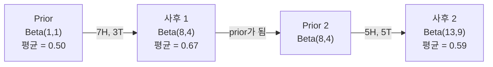

# 베이즈 정리 (Bayes' Theorem)

> 확률은 무엇을 기대하는지에 관한 것입니다. 베이즈 정리는 무엇을 배우는지에 관한 것입니다.

**Type:** Build
**Language:** Python
**Prerequisites:** Phase 1, Lesson 06 (Probability Fundamentals)
**Time:** ~75 minutes

## 학습 목표 (Learning Objectives)

- prior, likelihood, evidence로부터 사후 확률을 계산하는 데 베이즈 정리를 적용합니다
- Laplace smoothing과 로그 공간 계산으로 Naive Bayes 텍스트 분류기를 처음부터 만듭니다
- MLE와 MAP 추정을 비교하고 MAP가 L2 정규화에 해당함을 설명합니다
- A/B 테스트를 위해 Beta-Binomial 켤레 prior로 순차적 베이즈 업데이트를 구현합니다

## 문제 상황 (The Problem)

의학적 검사가 99% 정확합니다. 양성으로 나왔습니다. 실제로 질병이 있을 확률은?

대부분 99%라고 말합니다. 진짜 답은 질병이 얼마나 드문지에 달립니다. 1만 명 중 1명이 걸린다면, 양성 결과는 아플 확률이 약 1%에 불과합니다. 양성 결과의 나머지 99%는 건강한 사람의 거짓 양성입니다.

속임수 질문이 아닙니다. 이것이 베이즈 정리입니다. 모든 스팸 필터, 모든 의료 진단, 불확실성을 정량화하는 모든 머신러닝 모델이 이 정확한 추론을 사용합니다. 믿음에서 시작합니다. 증거를 봅니다. 업데이트합니다.

이것을 이해하지 못한 채 ML 시스템을 만들면 모델 출력을 오해하고, 나쁜 임계값을 설정하며, 과도하게 확신하는 예측을 배포하게 됩니다.

## 핵심 개념 (The Concept)

### 결합 확률에서 베이즈로 (From joint probability to Bayes)

Lesson 06에서 이미 조건부 확률이 다음과 같음을 알고 있습니다:

```
P(A|B) = P(A and B) / P(B)
```

대칭적으로:

```
P(B|A) = P(A and B) / P(A)
```

두 식은 같은 분자 P(A and B)를 공유합니다. 등치로 놓고 정리하면:

```
P(A and B) = P(A|B) * P(B) = P(B|A) * P(A)

Therefore:

P(A|B) = P(B|A) * P(A) / P(B)
```

이것이 베이즈 정리입니다. 네 양, 하나의 식.

### 네 부분 (The four parts)

| 부분 | 이름 | 의미 |
|------|------|---------------|
| P(A\|B) | Posterior (사후) | 증거 B를 본 뒤 A에 대한 업데이트된 믿음 |
| P(B\|A) | Likelihood (가능도) | A가 참일 때 증거 B가 얼마나 가능한지 |
| P(A) | Prior (사전) | 어떤 증거도 보기 전 A에 대한 믿음 |
| P(B) | Evidence (증거) | 모든 가능성 하에서 B를 볼 총 확률 |

증거 항 P(B)는 정규화 역할을 합니다. 전확률의 법칙으로 전개할 수 있습니다:

```
P(B) = P(B|A) * P(A) + P(B|not A) * P(not A)
```

### 의료 검사 예제 (Medical test example)

질병이 1만 명 중 1명에게 영향을 줍니다. 검사는 99% 정확합니다(아픈 사람의 99%를 잡고, 1%의 거짓 양성을 냅니다).

```
P(sick)          = 0.0001     (prior: disease is rare)
P(positive|sick) = 0.99       (likelihood: test catches it)
P(positive|healthy) = 0.01    (false positive rate)

P(positive) = P(positive|sick) * P(sick) + P(positive|healthy) * P(healthy)
            = 0.99 * 0.0001 + 0.01 * 0.9999
            = 0.000099 + 0.009999
            = 0.010098

P(sick|positive) = P(positive|sick) * P(sick) / P(positive)
                 = 0.99 * 0.0001 / 0.010098
                 = 0.0098
                 = 0.98%
```

1% 미만입니다. prior가 지배합니다. 상태가 드물면 정확한 검사도 대부분 거짓 양성을 냅니다. 의사가 확진 검사를 주문하는 이유입니다.

### 스팸 필터 예제 (Spam filter example)

"lottery"라는 단어가 든 이메일을 받았습니다. 스팸일까요?

```
P(spam)                = 0.3      (30% of email is spam)
P("lottery"|spam)      = 0.05     (5% of spam emails contain "lottery")
P("lottery"|not spam)  = 0.001    (0.1% of legitimate emails contain "lottery")

P("lottery") = 0.05 * 0.3 + 0.001 * 0.7
             = 0.015 + 0.0007
             = 0.0157

P(spam|"lottery") = 0.05 * 0.3 / 0.0157
                  = 0.955
                  = 95.5%
```

한 단어가 확률을 30%에서 95.5%로 옮깁니다. 실제 스팸 필터는 수백 개 단어에 걸쳐 동시에 베이즈를 적용합니다.

### Naive Bayes: 독립 가정 (independence assumption)

Naive Bayes는 클래스가 주어졌을 때 모든 특성이 조건부 독립이라고 가정해 여러 특성으로 확장합니다:

```
P(class | feature_1, feature_2, ..., feature_n)
  = P(class) * P(feature_1|class) * P(feature_2|class) * ... * P(feature_n|class)
    / P(feature_1, feature_2, ..., feature_n)
```

"naive"한 부분이 독립 가정입니다. 텍스트에서 단어 출현은 독립이 아닙니다("New"와 "York"는 상관됩니다). 하지만 분류기는 보정된 확률이 아니라 클래스 순위만 필요하므로 가정은 놀랍도록 잘 작동합니다.

분모가 모든 클래스에 같으므로 건너뛰고 분자만 비교할 수 있습니다:

```
score(class) = P(class) * product of P(feature_i | class)
```

점수가 가장 높은 클래스를 고릅니다.

### 최대가능도추정 (Maximum likelihood estimation, MLE)

학습 데이터에서 P(feature|class)를 어떻게 얻을까요? 셉니다.

```
P("free"|spam) = (number of spam emails containing "free") / (total spam emails)
```

이것이 MLE입니다: 관측 데이터를 가장 가능하게 만드는 파라미터 값을 고릅니다. 가능도 함수를 최대화하며, 이산 카운트에서는 상대 빈도로 줄어듭니다.

문제: 학습 중 스팸에 한 번도 안 나온 단어는 MLE가 확률 0을 줍니다. 미지의 단어 하나가 전체 곱을 죽입니다. Laplace smoothing으로 고칩니다:

```
P(word|class) = (count(word, class) + 1) / (total_words_in_class + vocabulary_size)
```

모든 카운트에 1을 더하면 확률이 절대 0이 되지 않습니다.

### 최대사후추정 (Maximum a posteriori, MAP)

MLE는 묻습니다: 어떤 파라미터가 P(data|parameters)를 최대화하는가?

MAP는 묻습니다: 어떤 파라미터가 P(parameters|data)를 최대화하는가?

베이즈 정리에 의해:

```
P(parameters|data) proportional to P(data|parameters) * P(parameters)
```

MAP는 파라미터 자체에 대한 prior를 더합니다. 파라미터가 작아야 한다고 믿으면 큰 값을 벌하는 prior로 인코딩합니다. 이것은 ML의 L2 정규화와 동일합니다. Ridge 회귀의 "ridge" 패널티는 말 그대로 가중치에 대한 가우시안 prior입니다.

| 추정 | 최적화 | ML 대응 |
|------------|-----------|---------------|
| MLE | P(data\|params) | 정규화 없는 학습 |
| MAP | P(data\|params) * P(params) | L2 / L1 정규화 |

### 베이즈 vs 빈도주의: 실질적 차이 (Bayesian vs frequentist)

빈도주의자는 파라미터를 고정된 미지수로 취급합니다. "이 실험을 여러 번 반복하면 무엇이 일어날까?"를 묻습니다.

베이즈주의자는 파라미터를 분포로 취급합니다. "관측한 것을 바탕으로 파라미터에 대해 무엇을 믿는가?"를 묻습니다.

ML 시스템을 만들 때의 실질적 차이:

| 측면 | Frequentist | Bayesian |
|--------|-------------|----------|
| 출력 | 점 추정 | 값에 대한 분포 |
| 불확실성 | 신뢰구간(절차에 대해) | 신용구간(파라미터에 대해) |
| 소량 데이터 | 과적합 가능 | Prior가 정규화로 작용 |
| 계산 | 보통 더 빠름 | 종종 샘플링(MCMC) 필요 |

대부분의 프로덕션 ML은 빈도주의적입니다(SGD, 점 추정). 베이즈 방법은 보정된 불확실성이 필요할 때(의료 결정, 안전 중요 시스템) 또는 데이터가 부족할 때(few-shot, cold start) 빛납니다.

### ML에서 베이즈적 사고가 중요한 이유

연결은 비유보다 깊습니다:

**Prior는 정규화입니다.** 가중치에 대한 가우시안 prior는 L2 정규화입니다. Laplace prior는 L1입니다. 정규화 항을 더할 때마다 어떤 파라미터 값을 기대하는지에 대한 베이즈적 진술을 하는 것입니다.

**사후는 불확실성입니다.** 단일 예측 확률은 그 추정에 모델이 얼마나 확신하는지 말해주지 않습니다. 베이즈 방법은 분포를 줍니다: "P(spam)이 0.8에서 0.95 사이라고 생각한다."

**베이즈 업데이트는 온라인 학습입니다.** 오늘의 사후가 내일의 prior가 됩니다. 모델이 새 데이터를 보면 처음부터 재학습하지 않고 믿음을 점진적으로 업데이트합니다.

**모델 비교는 베이즈적입니다.** Bayesian information criterion(BIC), 주변 가능도, Bayes factor는 모두 과적합 없이 모델 간 선택에 베이즈 추론을 사용합니다.

```figure
bayes-update
```

## 구현하기 (Build It)

### Step 1: 베이즈 정리 함수 (Bayes theorem function)

```python
def bayes(prior, likelihood, false_positive_rate):
    evidence = likelihood * prior + false_positive_rate * (1 - prior)
    posterior = likelihood * prior / evidence
    return posterior

result = bayes(prior=0.0001, likelihood=0.99, false_positive_rate=0.01)
print(f"P(sick|positive) = {result:.4f}")
```

### Step 2: Naive Bayes 분류기

```python
import math
from collections import defaultdict

class NaiveBayes:
    def __init__(self, smoothing=1.0):
        self.smoothing = smoothing
        self.class_counts = defaultdict(int)
        self.word_counts = defaultdict(lambda: defaultdict(int))
        self.class_word_totals = defaultdict(int)
        self.vocab = set()

    def train(self, documents, labels):
        for doc, label in zip(documents, labels):
            self.class_counts[label] += 1
            words = doc.lower().split()
            for word in words:
                self.word_counts[label][word] += 1
                self.class_word_totals[label] += 1
                self.vocab.add(word)

    def predict(self, document):
        words = document.lower().split()
        total_docs = sum(self.class_counts.values())
        vocab_size = len(self.vocab)
        best_class = None
        best_score = float("-inf")
        for cls in self.class_counts:
            score = math.log(self.class_counts[cls] / total_docs)
            for word in words:
                count = self.word_counts[cls].get(word, 0)
                total = self.class_word_totals[cls]
                score += math.log((count + self.smoothing) / (total + self.smoothing * vocab_size))
            if score > best_score:
                best_score = score
                best_class = cls
        return best_class
```

로그 확률은 underflow를 막습니다. 작은 확률을 많이 곱하면 부동소수점에는 너무 작은 수가 됩니다. 로그 확률의 합은 수치적으로 안정하며 수학적으로 동등합니다.

### Step 3: 스팸 데이터로 학습 (Train on spam data)

```python
train_docs = [
    "win free money now",
    "free lottery ticket winner",
    "claim your prize today free",
    "urgent offer free cash",
    "congratulations you won free",
    "meeting tomorrow at noon",
    "project update attached",
    "can we schedule a call",
    "quarterly report review",
    "lunch on thursday sounds good",
    "team standup notes attached",
    "please review the pull request",
]

train_labels = [
    "spam", "spam", "spam", "spam", "spam",
    "ham", "ham", "ham", "ham", "ham", "ham", "ham",
]

classifier = NaiveBayes()
classifier.train(train_docs, train_labels)

test_messages = [
    "free money waiting for you",
    "meeting rescheduled to friday",
    "you won a free prize",
    "please review the attached report",
]

for msg in test_messages:
    print(f"  '{msg}' -> {classifier.predict(msg)}")
```

### Step 4: 학습된 확률 살펴보기 (Inspect the learned probabilities)

```python
def show_top_words(classifier, cls, n=5):
    vocab_size = len(classifier.vocab)
    total = classifier.class_word_totals[cls]
    probs = {}
    for word in classifier.vocab:
        count = classifier.word_counts[cls].get(word, 0)
        probs[word] = (count + classifier.smoothing) / (total + classifier.smoothing * vocab_size)
    sorted_words = sorted(probs.items(), key=lambda x: x[1], reverse=True)
    for word, prob in sorted_words[:n]:
        print(f"    {word}: {prob:.4f}")

print("\nTop spam words:")
show_top_words(classifier, "spam")
print("\nTop ham words:")
show_top_words(classifier, "ham")
```

## 실용 활용 (Use It)

Scikit-learn은 프로덕션급 Naive Bayes 구현을 제공합니다:

```python
from sklearn.feature_extraction.text import CountVectorizer
from sklearn.naive_bayes import MultinomialNB
from sklearn.metrics import classification_report

vectorizer = CountVectorizer()
X_train = vectorizer.fit_transform(train_docs)
clf = MultinomialNB()
clf.fit(X_train, train_labels)

X_test = vectorizer.transform(test_messages)
predictions = clf.predict(X_test)
for msg, pred in zip(test_messages, predictions):
    print(f"  '{msg}' -> {pred}")
```

같은 알고리즘입니다. CountVectorizer가 토큰화와 어휘 구축을 처리합니다. MultinomialNB가 smoothing과 로그 확률을 내부에서 처리합니다. 처음부터 만든 버전이 40줄로 같은 일을 합니다.

## 배포할 산출물 (Ship It)

여기서 만든 NaiveBayes 클래스는 전체 파이프라인을 보여줍니다: 토큰화, Laplace smoothing으로 확률 추정, 로그 공간 예측. `code/bayes.py`의 코드는 Python 표준 라이브러리 외 의존성 없이 end-to-end로 실행됩니다.

### 켤레 Prior (Conjugate Priors)

Prior와 사후가 같은 분포족에 속하면 prior를 "켤레(conjugate)"라고 합니다. 베이즈 업데이트가 대수적으로 깔끔해집니다 -- 수치 적분 없이 닫힌 형태 사후를 얻습니다.

| Likelihood | Conjugate Prior | Posterior | Example |
|-----------|----------------|-----------|---------|
| Bernoulli | Beta(a, b) | Beta(a + successes, b + failures) | Coin flip bias estimation |
| Normal (known variance) | Normal(mu_0, sigma_0) | Normal(weighted mean, smaller variance) | Sensor calibration |
| Poisson | Gamma(a, b) | Gamma(a + sum of counts, b + n) | Modeling arrival rates |
| Multinomial | Dirichlet(alpha) | Dirichlet(alpha + counts) | Topic modeling, language models |

왜 중요한가: 켤레 prior가 없으면 사후를 근사하려면 Monte Carlo 샘플링이나 변분 추론이 필요합니다. 켤레 prior가 있으면 숫자 두 개만 업데이트하면 됩니다.

Beta 분포는 실무에서 가장 흔한 켤레 prior입니다. Beta(a, b)는 확률 파라미터에 대한 믿음을 나타냅니다. 평균은 a/(a+b)입니다. a+b가 클수록 분포가 더 집중(확신)됩니다.

Beta prior의 특수 경우:
- Beta(1, 1) = 균등. 파라미터에 대한 의견이 없습니다.
- Beta(10, 10) = 0.5에 뾰족. 파라미터가 0.5 근처라고 강하게 믿습니다.
- Beta(1, 10) = 0 쪽으로 치우침. 파라미터가 작다고 믿습니다.

업데이트 규칙은 극히 단순합니다:

```
Prior:     Beta(a, b)
Data:      s successes, f failures
Posterior: Beta(a + s, b + f)
```

적분 없음. 샘플링 없음. 덧셈만.

### 순차적 베이즈 업데이트 (Sequential Bayesian Updating)

베이즈 추론은 본질적으로 순차적입니다. 오늘의 사후가 내일의 prior가 됩니다. 실제 시스템이 모든 과거 데이터를 재처리하지 않고 점진적으로 학습하는 방식입니다.

구체적 예: 동전이 공정한지 추정하기.

**Day 1: 아직 데이터 없음.**
Beta(1, 1)로 시작합니다 -- 균등 prior. 의견이 없습니다.
- Prior 평균: 0.5
- Prior는 [0, 1]에 걸쳐 평평함

**Day 2: 앞면 7, 뒷면 3을 관측.**
사후 = Beta(1 + 7, 1 + 3) = Beta(8, 4)
- 사후 평균: 8/12 = 0.667
- 증거가 동전이 앞면으로 편향되었음을 시사

**Day 3: 앞면 5, 뒷면 5를 더 관측.**
어제의 사후를 오늘의 prior로 사용.
사후 = Beta(8 + 5, 4 + 5) = Beta(13, 9)
- 사후 평균: 13/22 = 0.591
- 균형 잡힌 새 데이터가 추정을 0.5 쪽으로 되돌림



관측 순서는 중요하지 않습니다. Beta(1,1)을 앞면 12·뒷면 8로 한 번에 업데이트하면 Beta(13, 9) -- 같은 결과입니다. 순차 업데이트와 배치 업데이트는 수학적으로 동등합니다. 하지만 순차 업데이트는 원시 데이터를 저장하지 않고도 각 단계에서 결정을 내릴 수 있게 합니다.

이것이 프로덕션 ML의 온라인 학습 기초입니다. 밴딧의 Thompson sampling, 증분 추천 시스템, 스트리밍 이상 탐지기 모두 이 패턴을 사용합니다.

### A/B 테스트와의 연결 (Connection to A/B Testing)

A/B 테스트는 위장한 베이즈 추론입니다.

설정: 두 버튼 색을 테스트합니다. Variant A(파랑)와 Variant B(초록). 어느 쪽이 더 많은 클릭을 받는지 알고 싶습니다.

베이즈 A/B 테스트:

1. **Prior.** 두 variant 모두 Beta(1, 1)로 시작. 사전 선호 없음.
2. **Data.** Variant A: 1000 조회 중 50 클릭. Variant B: 1000 조회 중 65 클릭.
3. **사후.**
   - A: Beta(1 + 50, 1 + 950) = Beta(51, 951). 평균 = 0.051
   - B: Beta(1 + 65, 1 + 935) = Beta(66, 936). 평균 = 0.066
4. **결정.** P(B > A)를 계산 -- B의 진짜 전환율이 A보다 높을 확률.

P(B > A)를 해석적으로 계산하기는 어렵습니다. 하지만 Monte Carlo면 쉽습니다:

```
1. Draw 100,000 samples from Beta(51, 951)  -> samples_A
2. Draw 100,000 samples from Beta(66, 936)  -> samples_B
3. P(B > A) = fraction of samples where B > A
```

P(B > A) > 0.95이면 variant B를 배포합니다. 0.05와 0.95 사이면 데이터를 계속 모읍니다. P(B > A) < 0.05이면 variant A를 배포합니다.

빈도주의 A/B 테스트 대비 장점:
- 직접적인 확률 진술을 얻습니다: "B가 더 나을 확률이 97%"
- p-value 혼란이 없습니다. "귀무가설을 기각하지 못함" 식의 회피가 없습니다.
- 거짓 양성률을 부풀리지 않고 언제든 결과를 확인할 수 있습니다("peeking problem" 없음)
- 사전 지식을 반영할 수 있습니다(예: 이전 테스트가 전환율이 보통 3-8%임을 시사)

| 측면 | Frequentist A/B | Bayesian A/B |
|--------|----------------|--------------|
| 출력 | p-value | P(B > A) |
| 해석 | "A=B라면 이 데이터가 얼마나 놀라운가?" | "B가 A보다 나을 가능성은?" |
| 조기 중단 | 거짓 양성 부풀림 | 어느 시점이든 안전(잘 고른 prior와 올바른 모델 가정 하에) |
| 사전 지식 | 사용하지 않음 | Beta prior로 인코딩 |
| 결정 규칙 | p < 0.05 | P(B > A) > 임계값 |

## 연습 문제 (Exercises)

1. **다중 검사.** 환자가 독립적인 검사에서 두 번 양성(둘 다 99% 정확, 유병률 1만 명 중 1명). 두 검사 후 P(sick)는? 첫 검사의 사후를 두 번째 검사의 prior로 사용하세요.

2. **Smoothing 영향.** smoothing 값 0.01, 0.1, 1.0, 10.0으로 스팸 분류기를 실행하세요. 상위 단어 확률이 어떻게 변하나요? smoothing=0이고 ham에만 나오는 단어는?

3. **특성 추가.** NaiveBayes 클래스에 단어 카운트와 함께 메시지 길이(짧음/김)도 특성으로 쓰도록 확장하세요. 학습 데이터에서 P(short|spam)과 P(short|ham)을 추정해 예측 점수에 넣으세요.

4. **손으로 MAP.** 관측 데이터(동전 10번 중 앞면 7)에서 Beta(2,2) prior로 편향의 MAP 추정을 계산하세요. MLE 추정(7/10)과 비교하세요.

## 핵심 용어 (Key Terms)

| 용어 (Term) | 흔히 하는 말 | 실제 의미 |
|------|----------------|----------------------|
| Prior | "처음 추측" | 증거를 관측하기 전 P(가설). ML에서는 정규화 항. |
| Likelihood | "데이터가 얼마나 잘 맞는지" | P(증거\|가설). 특정 가설 하에서 관측 데이터가 얼마나 가능한지. |
| Posterior | "업데이트된 믿음" | P(가설\|증거). Prior에 가능도를 곱한 뒤 정규화. |
| Evidence | "정규화 상수" | 모든 가설에 걸친 P(data). 사후가 합 1이 되게 함. |
| Naive Bayes | "그 단순한 텍스트 분류기" | 클래스가 주어졌을 때 특성이 독립이라고 가정하는 분류기. 거짓 가정에도 잘 작동. |
| Laplace smoothing | "1을 더하는 smoothing" | 미지의 데이터로 인한 0 확률을 막기 위해 모든 특성에 작은 카운트를 더함. |
| MLE | "빈도만 쓰면 된다" | P(data\|parameters)를 최대화하는 파라미터 선택. Prior 없음. 소량 데이터에서 과적합 가능. |
| MAP | "Prior 있는 MLE" | P(data\|parameters) * P(parameters)를 최대화. 정규화된 MLE와 동등. |
| Log-probability | "로그 공간에서 작업" | 작은 수를 많이 곱할 때 부동소수점 underflow를 피하려고 P 대신 log(P) 사용. |
| False positive | "잘못된 경보" | 검사는 양성인데 진짜 상태는 음성. 기저율 오류를 유발. |

## 더 읽을거리 (Further Reading)

- [3Blue1Brown: Bayes' theorem](https://www.youtube.com/watch?v=HZGCoVF3YvM) - 의료 검사 예제로 시각적 설명
- [Stanford CS229: Generative Learning Algorithms](https://cs229.stanford.edu/notes2022fall/cs229-notes2.pdf) - Naive Bayes와 판별 모델과의 연결
- [Think Bayes](https://greenteapress.com/wp/think-bayes/) - 무료 책, Python 코드로 베이즈 통계
- [scikit-learn Naive Bayes](https://scikit-learn.org/stable/modules/naive_bayes.html) - 프로덕션 구현과 각 변형 사용 시기
