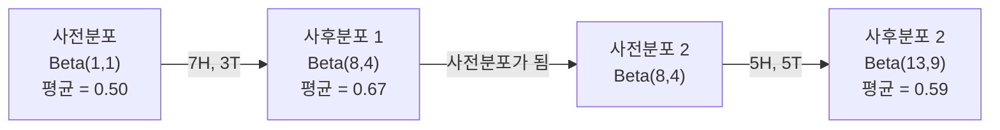

# 베이즈 정리

> 확률은 기대에 관한 것입니다. 베이즈 정리는 학습에 관한 것입니다.

**유형:** Build
**언어:** Python
**선수 요건:** 1단계, 06강 (확률 기초)
**시간:** 약 75분

## 학습 목표

- 사전 확률, 우도, 증거로부터 사후 확률을 계산하기 위해 베이즈 정리를 적용해 보세요
- 라플라스 스무딩과 로그 공간 연산을 사용하여 나이브 베이즈 텍스트 분류기를 처음부터 구축해 보세요
- MLE와 MAP 추정법을 비교하고, MAP가 L2 정규화와 어떻게 대응되는지 설명해 보세요
- A/B 테스트를 위해 베타-이항 공액 사전 확률을 사용하여 순차적 베이즈 업데이트를 구현해 보세요

## 문제점

의료 검사의 정확도는 99%입니다. 양성 판정을 받았습니다. 실제로 질병이 있을 확률은 얼마일까요?

대부분의 사람들은 99%라고 답합니다. 실제 답은 질병이 얼마나 희귀한지에 따라 달라집니다. 10,000명 중 1명만 질병이 있다면, 양성 결과는 약 1%의 질병 확률만 의미합니다. 나머지 99%의 양성 결과는 건강한 사람들의 오탐(false alarms)입니다.

이는 함정 질문이 아닙니다. 바로 베이즈 정리입니다. 모든 스팸 필터, 모든 의료 진단, 불확실성을 정량화하는 모든 머신러닝 모델은 이 정확한 추론을 사용합니다. 당신은 믿음을 시작합니다. 증거를 봅니다. 그리고 업데이트합니다.

이것을 이해하지 못한 채 ML 시스템을 구축하면, 모델 출력을 잘못 해석하고, 나쁜 임계값을 설정하며, 과도하게 확신하는 예측을 출시하게 될 것입니다.

## 개념

### 결합 확률에서 베이즈로

06강에서 조건부 확률은 다음과 같다는 것을 이미 알고 있습니다:

```
P(A|B) = P(A and B) / P(B)
```

그리고 대칭적으로:

```
P(B|A) = P(A and B) / P(A)
```

두 표현은 동일한 분자 P(A and B)를 공유합니다. 이들을 같게 놓고 재배열하면:

```
P(A and B) = P(A|B) * P(B) = P(B|A) * P(A)

Therefore:

P(A|B) = P(B|A) * P(A) / P(B)
```

이것이 베이즈 정리입니다. 네 개의 양, 하나의 방정식.

### 네 부분

| 부분 | 이름 | 의미 |
|------|------|---------------|
| P(A\|B) | 사후 확률 | 증거 B를 본 후 A에 대한 업데이트된 믿음 |
| P(B\|A) | 우도 | A가 참일 때 증거 B가 얼마나 확률적인지 |
| P(A) | 사전 확률 | 증거를 보기 전 A에 대한 당신의 믿음 |
| P(B) | 증거 | 모든 가능성 하에서 B를 보게 될 총 확률 |

증거 항 P(B)는 정규화 인자(normalizer)로 작용합니다. 전확률 법칙(law of total probability)을 사용하여 이를 확장할 수 있습니다:

```
P(B) = P(B|A) * P(A) + P(B|not A) * P(not A)
```

### 의료 검사 예시

질병이 10,000명 중 1명에게 영향을 미칩니다. 검사는 99% 정확합니다(99%의 환자들을 잡아내며, 1%의 확률로 위양성(false positives)을 발생시킵니다).

```
P(sick)          = 0.0001     (prior: disease is rare)
P(positive|sick) = 0.99       (likelihood: test catches it)
P(positive|healthy) = 0.01    (false positive rate)

P(positive) = P(positive|sick) * P(sick) + P(positive|healthy) * P(healthy)
            = 0.99 * 0.0001 + 0.01 * 0.9999
            = 0.000099 + 0.009999
            = 0.010098

P(sick|positive) = P(positive|sick) * P(sick) / P(positive)
                 = 0.99 * 0.0001 / 0.010098
                 = 0.0098
                 = 0.98%
```

1% 미만입니다. 사전 확률이 지배적입니다. 조건이 희소할 때, 정확한 검사라도 대부분 위양성을 생성합니다. 이것이 의사가 확인 검사를 주문하는 이유입니다.

### 스팸 필터 예시

"lottery"라는 단어를 포함하는 이메일을 받았습니다. 스팸일까요?

```
P(spam)                = 0.3      (30% of email is spam)
P("lottery"|spam)      = 0.05     (5% of spam emails contain "lottery")
P("lottery"|not spam)  = 0.001    (0.1% of legitimate emails contain "lottery")

P("lottery") = 0.05 * 0.3 + 0.001 * 0.7
             = 0.015 + 0.0007
             = 0.0157

P(spam|"lottery") = 0.05 * 0.3 / 0.0157
                  = 0.955
                  = 95.5%
```

한 단어가 확률을 30%에서 95.5%로 변화시킵니다. 실제 스팸 필터는 수백 개의 단어에 대해 동시에 Bayes를 적용합니다.

### Naive Bayes: 독립성 가정

Naive Bayes는 모든 특징(features)이 클래스가 주어졌을 때 조건부 독립이라고 가정하여 이를 여러 특징으로 확장합니다:

```
P(class | feature_1, feature_2, ..., feature_n)
  = P(class) * P(feature_1|class) * P(feature_2|class) * ... * P(feature_n|class)
    / P(feature_1, feature_2, ..., feature_n)
```

"naive" 부분은 독립성 가정을 의미합니다. 텍스트에서 단어 출현은 독립적이지 않습니다("New"와 "York"는 상관관계가 있습니다). 하지만 분류기가 클래스를 순위를 매기기만 필요하고 보정된(calibrated) 확률을 생성할 필요가 없기 때문에, 이 가정은 실제로 놀라울 정도로 잘 작동합니다.

분모는 모든 클래스에 대해 동일하므로, 이를 생략하고 분자만 비교할 수 있습니다:

```
score(class) = P(class) * product of P(feature_i | class)
```

가장 높은 점수를 가진 클래스를 선택하세요.

### 최대 우도 추정(MLE)

학습 데이터에서 P(feature|class)를 어떻게 얻나요? 세세요.

```
P("free"|spam) = (number of spam emails containing "free") / (total spam emails)
```

이것이 MLE입니다: 관측된 데이터를 가장 가능성 있게 만드는 매개변수 값을 선택합니다. 이산 개수에 대해 상대적 빈도로 환원되는 우도 함수(likelihood function)를 최대화하고 있습니다.

문제: 학습 중 스팸에 단어가 한 번도 나타나지 않으면, MLE는 그 단어에 확률 0을 부여합니다. 한 번도 보지 못한 단어가 전체 곱을 죽입니다. Laplace smoothing으로 이를 수정하세요:

```
P(word|class) = (count(word, class) + 1) / (total_words_in_class + vocabulary_size)
```

모든 개수에 1을 더하면 확률이 절대 0이 되지 않습니다.

### 최대 사후 확률(MAP)

MLE는 묻습니다: 어떤 매개변수가 P(data|parameters)를 최대화합니까?

MAP는 묻습니다: 어떤 매개변수가 P(parameters|data)를 최대화합니까?

베이즈 정리에 따르면:

```
P(parameters|data) proportional to P(data|parameters) * P(parameters)
```

MAP는 매개변수 자체에 대한 사전 확률을 추가합니다. 매개변수가 작아야 한다고 믿는다면, 큰 값을 페널티하는 사전 확률로 이를 인코딩합니다. 이는 ML의 L2 정규화와 동일합니다. 릿지 회귀의 "ridge" 페널티는 가중치에 대한 가우시안 사전 확률 그 자체입니다.

| 추정 | 최적화 대상 | ML 대응 |
|------------|-----------|---------------|
| MLE | P(data\|params) | 정규화 없는 학습 |
| MAP | P(data\|params) * P(params) | L2 / L1 정규화 |

### 베이즈 vs 빈도론: 실질적인 차이

빈도론자는 매개변수를 고정된 미지수로 취급합니다. "이 실험을 여러 번 반복하면 어떻게 될까?"라고 묻습니다.

베이즈론자는 매개변수를 분포로 취급합니다. "관찰한 것을 고려하면, 매개변수에 대해 무엇을 믿는가?"라고 묻습니다.

ML 시스템을 구축할 때의 실질적인 차이:

| 측면 | 빈도론 | 베이즈론 |
|--------|-------------|----------|
| 출력 | 점 추정 | 값에 대한 분포 |
| 불확실성 | 신뢰 구간 (절차에 대한) | 신뢰 구간 (매개변수에 대한) |
| 작은 데이터 | 과적합될 수 있음 | 사전 확률이 정규화 역할을 함 |
| 계산 | 보통 더 빠름 | 종종 샘플링(MCMC)이 필요 |

대부분의 프로덕션 ML은 빈도론적입니다(SGD, 점 추정). 베이즈 방법은 보정된 불확실성이 필요할 때(의료 결정, 안전 크리티컬 시스템)나 데이터가 희소할 때(소수 예시 학습, 콜드 스타트) 빛을 발합니다.

### ML에서 베이즈적 사고가 중요한 이유

연결은 단순한 비유보다 더 깊습니다:

**사전 확률은 정규화입니다.** 가중치에 대한 가우시안 사전 확률은 L2 정규화입니다. 라플라스 사전 확률은 L1입니다. 정규화 항을 추가할 때마다, 기대하는 매개변수 값에 대한 베이즈적 진술을 하는 것입니다.

**사후 확률은 불확실성입니다.** 단일 예측 확률은 모델이 그 추정치에 대해 얼마나 확신하는지 알려주지 않습니다. 베이즈 방법은 분포를 제공합니다: "P(spam)은 0.08강 0.95 사이라고 생각합니다."

**베이즈 업데이트는 온라인 학습입니다.** 오늘의 사후 확률이 내일의 사전 확률이 됩니다. 모델이 새로운 데이터를 볼 때, 처음부터 다시 학습하는 대신 신념을 점진적으로 업데이트합니다.

**모델 비교는 베이지안입니다.** 베이지안 정보 기준(BIC), 주변 확률(marginal likelihood), 베이지안 팩터는 모두 베이지안 추론을 사용하여 과적합 없이 모델을 선택합니다.

```figure
bayes-update
```

## 구현하기

### 1단계: 베이즈 정리 함수

```python
def bayes(prior, likelihood, false_positive_rate):
    evidence = likelihood * prior + false_positive_rate * (1 - prior)
    posterior = likelihood * prior / evidence
    return posterior

result = bayes(prior=0.0001, likelihood=0.99, false_positive_rate=0.01)
print(f"P(sick|positive) = {result:.4f}")
```

### 2단계: 나이브 베이즈 분류기

```python
import math
from collections import defaultdict

class NaiveBayes:
    def __init__(self, smoothing=1.0):
        self.smoothing = smoothing
        self.class_counts = defaultdict(int)
        self.word_counts = defaultdict(lambda: defaultdict(int))
        self.class_word_totals = defaultdict(int)
        self.vocab = set()

    def train(self, documents, labels):
        for doc, label in zip(documents, labels):
            self.class_counts[label] += 1
            words = doc.lower().split()
            for word in words:
                self.word_counts[label][word] += 1
                self.class_word_totals[label] += 1
                self.vocab.add(word)

    def predict(self, document):
        words = document.lower().split()
        total_docs = sum(self.class_counts.values())
        vocab_size = len(self.vocab)
        best_class = None
        best_score = float("-inf")
        for cls in self.class_counts:
            score = math.log(self.class_counts[cls] / total_docs)
            for word in words:
                count = self.word_counts[cls].get(word, 0)
                total = self.class_word_totals[cls]
                score += math.log((count + self.smoothing) / (total + self.smoothing * vocab_size))
            if score > best_score:
                best_score = score
                best_class = cls
        return best_class
```

로그 확률은 언더플로우를 방지합니다. 작은 확률들을 많이 곱하면 부동 소수점 숫자로는 너무 작아집니다. 로그 확률을 합산하는 것은 수치적으로 안정적이며 수학적으로 동등합니다.

### 3단계: 스팸 데이터로 학습

```python
train_docs = [
    "win free money now",
    "free lottery ticket winner",
    "claim your prize today free",
    "urgent offer free cash",
    "congratulations you won free",
    "meeting tomorrow at noon",
    "project update attached",
    "can we schedule a call",
    "quarterly report review",
    "lunch on thursday sounds good",
    "team standup notes attached",
    "please review the pull request",
]

train_labels = [
    "spam", "spam", "spam", "spam", "spam",
    "ham", "ham", "ham", "ham", "ham", "ham", "ham",
]

classifier = NaiveBayes()
classifier.train(train_docs, train_labels)

test_messages = [
    "free money waiting for you",
    "meeting rescheduled to friday",
    "you won a free prize",
    "please review the attached report",
]

for msg in test_messages:
    print(f"  '{msg}' -> {classifier.predict(msg)}")
```

### 4단계: 학습된 확률 확인

```python
def show_top_words(classifier, cls, n=5):
    vocab_size = len(classifier.vocab)
    total = classifier.class_word_totals[cls]
    probs = {}
    for word in classifier.vocab:
        count = classifier.word_counts[cls].get(word, 0)
        probs[word] = (count + classifier.smoothing) / (total + classifier.smoothing * vocab_size)
    sorted_words = sorted(probs.items(), key=lambda x: x[1], reverse=True)
    for word, prob in sorted_words[:n]:
        print(f"    {word}: {prob:.4f}")

print("\nTop spam words:")
show_top_words(classifier, "spam")
print("\nTop ham words:")
show_top_words(classifier, "ham")
```

## 사용하기

Scikit-learn은 프로덕션-ready한 나이브 베이즈 구현을 제공합니다:

```python
from sklearn.feature_extraction.text import CountVectorizer
from sklearn.naive_bayes import MultinomialNB
from sklearn.metrics import classification_report

vectorizer = CountVectorizer()
X_train = vectorizer.fit_transform(train_docs)
clf = MultinomialNB()
clf.fit(X_train, train_labels)

X_test = vectorizer.transform(test_messages)
predictions = clf.predict(X_test)
for msg, pred in zip(test_messages, predictions):
    print(f"  '{msg}' -> {pred}")
```

동일한 알고리즘입니다. CountVectorizer는 토큰화와 어휘 구축을 처리합니다. MultinomialNB는 내부적으로 스무딩과 로그 확률을 처리합니다. 처음부터 작성한 버전은 40줄로 동일한 작업을 수행합니다.

## 출시하기

여기서 구축한 NaiveBayes 클래스는 토큰화, 라플라스 스무딩을 통한 확률 추정, 로그 공간 예측 등 전체 파이프라인을 보여줍니다. `code/bayes.py`의 코드는 Python 표준 라이브러리 외의 의존성 없이 엔드투엔드로 실행됩니다.

### 공액 사전 분포

사전 분포와 사후 분포가 동일한 분포 계열에 속할 때, 사전 분포를 "공액(conjugate)"이라고 부릅니다. 이는 베이지안 업데이트를 대수적으로 깔끔하게 만듭니다. 수치 적분 없이 닫힌 형태의 사후 분포를 얻을 수 있습니다.

| 가능도 | 공액 사전 분포 | 사후 분포 | 예시 |
|-----------|----------------|-----------|---------|
| 베르누이 | Beta(a, b) | Beta(a + 성공 횟수, b + 실패 횟수) | 동전 던지기 편향 추정 |
| 정규 분포 (분산 알려진 경우) | Normal(mu_0, sigma_0) | Normal(가중 평균, 더 작은 분산) | 센서 보정 |
| 포아송 | Gamma(a, b) | Gamma(a + 합계, b + n) | 도착률 모델링 |
| 다항 분포 | Dirichlet(alpha) | Dirichlet(alpha + counts) | 주제 모델링, 언어 모델 |

이것이 중요한 이유: 공액 사전분포(conjugate priors)가 없으면 사후분포를 근사하기 위해 몬테카를로 샘플링(Monte Carlo sampling)이나 변분 추론(variational inference)을 사용해야 합니다. 공액 사전분포를 사용하면 두 개의 숫자만 업데이트하면 됩니다.

베타 분포(Beta distribution)는 실무에서 가장 흔한 공액 사전분포입니다. Beta(a, b)는 확률 매개변수에 대한 당신의 믿음을 나타냅니다. 평균은 a/(a+b)입니다. a+b가 클수록 분포는 더 집중되어(더 확신하게) 됩니다.

베타 사전분포의 특수한 경우:
- Beta(1, 1) = 균일 분포. 매개변수에 대해 의견이 없습니다.
- Beta(10, 10) = 0.5에서 피크. 매개변수가 0.5 근처라고 강하게 믿습니다.
- Beta(1, 10) = 0 쪽으로 치우침. 매개변수가 작다고 믿습니다.

업데이트 규칙은 매우 간단합니다:

```
Prior:     Beta(a, b)
Data:      s successes, f failures
Posterior: Beta(a + s, b + f)
```

적분도 없고, 샘플링도 없습니다. 그냥 더하기입니다.

### 순차적 베이지안 업데이트

베이지안 추론은 본질적으로 순차적입니다. 오늘의 사후분포는 내일의 사전분포가 됩니다. 이는 모든 역사적 데이터를 다시 처리하지 않고 점진적으로 학습하는 실제 시스템의 방식입니다.

구체적인 예: 동전이 공정한지 추정하기.

**1일차: 데이터가 아직 없음.**
Beta(1, 1) -- 균일 사전분포로 시작합니다. 의견이 없습니다.
- 사전분포 평균: 0.5
- 사전분포는 [0, 1] 구간에서 평평합니다

**2일차: 앞면 7번, 뒷면 3번 관측.**
사후분포 = Beta(1 + 7, 1 + 3) = Beta(8, 4)
- 사후분포 평균: 8/12 = 0.667
- 증거는 동전이 앞면으로 치우쳐 있음을 시사합니다

**3일차: 앞면 5번, 뒷면 5번 더 관측.**
어제의 사후분포를 오늘의 사전분포로 사용합니다.
사후분포 = Beta(8 + 5, 4 + 5) = Beta(13, 9)
- 사후분포 평균: 13/22 = 0.591
- 균형 잡힌 새로운 데이터가 추정치를 0.5 쪽으로 되돌렸습니다



관측 순서는 중요하지 않습니다. 12번의 앞면과 8번의 뒷면을 한 번에 반영하여 Beta(1,1)을 업데이트하면 Beta(13, 9)가 되며, 이는 순차적 업데이트와 동일한 결과입니다. 순차적 업데이트와 배치 업데이트는 수학적으로 동등합니다. 하지만 순차적 업데이트를 사용하면 원시 데이터를 저장하지 않고도 각 단계에서 결정을 내릴 수 있습니다.

이것은 프로덕션 ML 시스템에서의 온라인 학습의 기초입니다. 밴디트 문제의 톰슨 샘플링, 점진적 추천 시스템, 스트리밍 이상 탐지기는 모두 이 패턴을 사용합니다.

### A/B 테스트와의 연결

A/B 테스트는 변장한 베이지안 추론입니다.

설정: 두 가지 버튼 색상을 테스트합니다. 변형 A(파랑)와 변형 B(초록)입니다. 어느 쪽이 더 많은 클릭을 받는지 알고 싶습니다.

베이지안 A/B 테스트:

1. **사전 분포.** 두 변형 모두 Beta(1, 1)로 시작합니다. 사전 선호도는 없습니다.
2. **데이터.** 변형 A: 1000번의 노출 중 50번의 클릭. 변형 B: 1000번의 노출 중 65번의 클릭.
3. **사후 분포.**
   - A: Beta(1 + 50, 1 + 950) = Beta(51, 951). 평균 = 0.051
   - B: Beta(1 + 65, 1 + 935) = Beta(66, 936). 평균 = 0.066
4. **결정.** P(B > A)를 계산합니다. 즉, B의 실제 전환율이 A보다 높을 확률입니다.

P(B > A)를 분석적으로 계산하는 것은 어렵습니다. 하지만 몬테 카를로 방법은 이를 간단하게 만듭니다:

```
1. Draw 100,000 samples from Beta(51, 951)  -> samples_A
2. Draw 100,000 samples from Beta(66, 936)  -> samples_B
3. P(B > A) = fraction of samples where B > A
```

P(B > A) > 0.95라면 변형 B를 출시합니다. 0.05와 0.95 사이라면 데이터를 계속 수집합니다. P(B > A) < 0.05라면 변형 A를 출시합니다.

빈도주의 A/B 테스트 대비 장점:
- 직접적인 확률 진술을 얻을 수 있습니다: "B가 더 좋을 확률은 97%입니다"
- p-값 혼란이 없습니다. "귀무가설을 기각하지 못한다"는 모호한 표현도 없습니다.
- 언제든 결과를 확인할 수 있으며, 오탐율(false positive rate)이 팽창하지 않습니다("peeking problem" 없음).
- 사전 지식을 반영할 수 있습니다(예: 이전 테스트에서 전환율이 보통 3-8%라고 제안됨).

| 측면 | 빈도주의 A/B | 베이지안 A/B |
|--------|----------------|--------------|
| 출력 | p-값 | P(B > A) |
| 해석 | "A=B라면 이 데이터가 얼마나 놀라운가?" | "B가 A보다 좋을 가능성이 얼마나 높은가?" |
| 조기 종료 | 오탐을 부풀림 | (잘 선택된 사전과 올바르게 지정된 모델이 주어지면) 모든 시점에서 안전 |
| 사전 지식 | 사용되지 않음 | Beta 사전으로 인코딩 |
| 결정 규칙 | p < 0.05 | P(B > A) > 임계값 |

## 연습 문제

1. **다중 테스트.** 한 환자가 독립적인 두 테스트에서 모두 양성 판정을 받았습니다 (두 테스트 모두 정확도 99%, 질병 유병률 1/10,000). 두 테스트 후 P(질병)는 얼마일까요? 첫 번째 테스트의 사후 확률을 두 번째 테스트의 사전 확률로 사용해 보세요.

2. **스무딩 영향.** 스무딩 값을 0.01, 0.1, 1.0, 10.0으로 설정하여 스팸 분류기를 실행해 보세요. 상위 단어 확률은 어떻게 변할까요? 스무딩=0이고 해(ham)에만 나타나는 단어가 있을 때는 어떻게 될까요?

3. **특징 추가.** NaiveBayes 클래스를 확장하여 단어 수와 함께 메시지 길이(짧은/긴)를 특징으로 사용하세요. 학습 데이터에서 P(짧은|스팸)과 P(짧은|해)를 추정하고 예측 점수에 포함하세요.

4. **MAP 손으로 계산.** 관측된 데이터 (10번의 코인 던지기 중 7번 앞면)가 주어졌을 때, Beta(2,2) 사전 확률을 사용하여 편향(bias)의 MAP 추정값을 계산하세요. MLE 추정값 (7/10)과 비교해 보세요.

## 핵심 용어

| 용어 | 사람들이 말하는 것 | 실제 의미 |
|------|----------------|----------------------|
| 사전 확률 | "내 초기 추정" | 증거를 관측하기 전의 P(가설). ML에서는 정규화 항입니다. |
| 가능도 | "데이터가 얼마나 잘 맞는지" | P(증거\|가설). 특정 가설 하에서 관측된 데이터가 얼마나 확률적인지 나타냅니다. |
| 사후 확률 | "내 업데이트된 믿음" | P(가설\|증거). 사전 확률에 가능도를 곱한 후 정규화한 값입니다. |
| 증거 | "정규화 상수" | 모든 가설에 걸친 P(데이터). 사후 확률의 합이 1이 되도록 보장합니다. |
| 나이브 베이즈 | "그 단순한 텍스트 분류기" | 클래스가 주어졌을 때 특징들이 독립적이라고 가정하는 분류기입니다. 잘못된 가정에도 잘 작동합니다. |
| 라플라스 스무딩 | "Add-one 스무딩" | unseen 데이터로 인한 확률 0을 방지하기 위해 모든 특징에 작은 개수를 더하는 기법입니다. |
| MLE | "그냥 빈도를 사용하세요" | P(데이터\|매개변수)를 최대화하는 매개변수를 선택합니다. 사전 확률이 없으며, 작은 데이터에서는 과적합될 수 있습니다. |
| MAP | "사전 확률을 포함한 MLE" | P(data\|parameters) * P(parameters)를 최대화하는 매개변수를 선택합니다. 정규화된 MLE와 동일합니다. |
| 로그 확률 | "로그 공간에서 작업" | 작은 수를 많이 곱할 때 부동 소수점 언더플로우를 피하기 위해 P 대신 log(P)를 사용합니다. |
| 오탐 | "잘못된 경보" | 테스트 결과가 양성이지만 실제 상태는 음성입니다. 기저율 오류를 유발합니다. |

## 추가 읽기

- [3Blue1Brown: Bayes' theorem](https://www.youtube.com/watch?v=HZGCoVF3YvM) - 의료 검사 예시를 통한 시각적 설명
- [Stanford CS229: Generative Learning Algorithms](https://cs229.stanford.edu/main_notes.pdf) - 나이브 베이즈와 판별 모델과의 연결
- [Think Bayes](https://greenteapress.com/wp/think-bayes/) - 무료 도서, Python 코드를 활용한 베이지안 통계
- [scikit-learn Naive Bayes](https://scikit-learn.org/stable/modules/naive_bayes.html) - 프로덕션 구현 및 각 변형의 사용 시점
