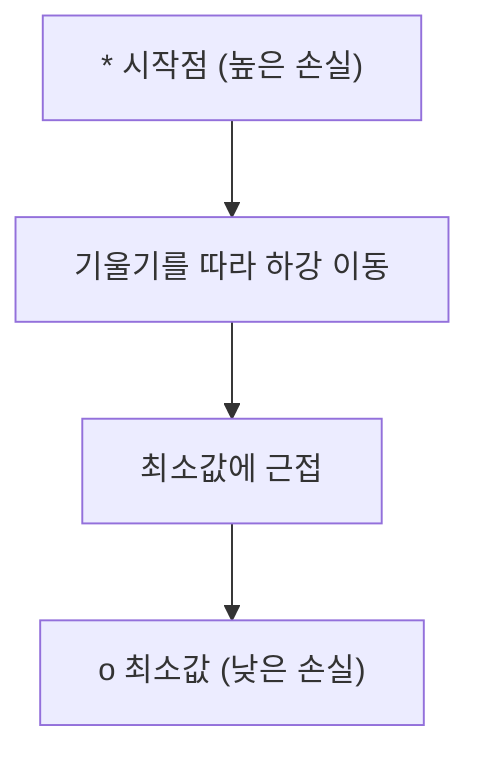
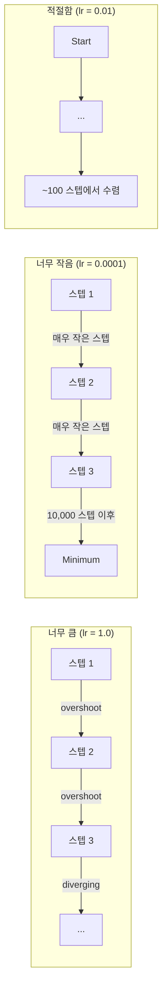
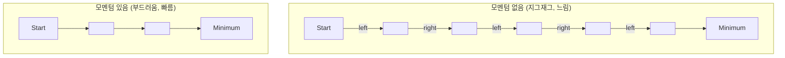
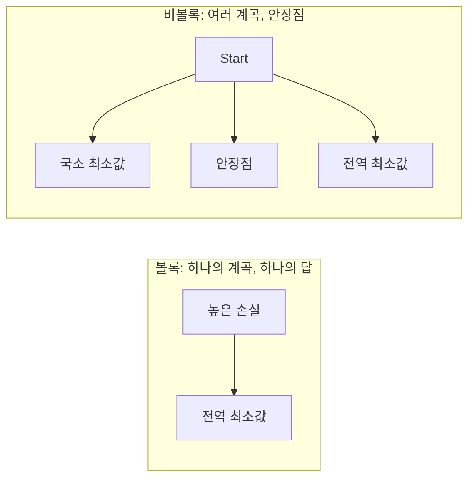
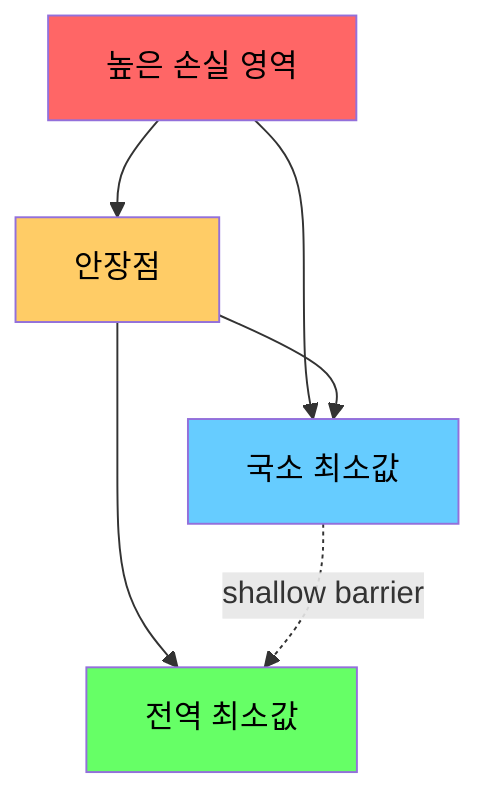

# 최적화

> 신경망을 학습하는 것은 본질적으로 계곡의 바닥을 찾는 것과 같습니다.

**유형:** Build
**언어:** Python
**선수 요건:** 1단계, 04-05강 (미분, 기울기)
**시간:** 약 75분

## 학습 목표

- 바닐라 경사 하강법, 모멘텀이 포함된 SGD, Adam을 처음부터 구현해 보세요
- 로젠브록 함수(Rosenbrock function)에서 옵티마이저의 수렴을 비교하고, Adam이 가중치별로 학습률을 적응시키는 이유를 설명해 보세요
- 볼록 손실 지형과 비볼록 손실 지형을 구분하고, 고차원에서의 안장점(saddle points)의 역할을 설명해 보세요
- 학습 안정성을 위해 학습률 스케줄(단계적 감쇠, 코사인 어닐링, 워밍업)을 구성해 보세요

## 문제점

손실 함수가 있습니다. 이 함수는 모델이 얼마나 틀렸는지 알려줍니다. 기울기가 있습니다. 기울기는 손실을 더 악화시키는 방향을 알려줍니다. 이제 하강하는 전략이 필요합니다.

소박한 접근법은 간단합니다. 기울기의 반대 방향으로 이동합니다. 학습률이라는 숫자로 단계 크기를 조정합니다. 반복합니다. 이것이 경사 하강법이며, 작동합니다. 하지만 "작동한다"에는 주의점이 있습니다. 학습률이 너무 크면 계곡을 완전히 넘어서 벽 사이를 튀어 다니게 됩니다. 너무 작으면 수천 번의 불필요한 단계를 거쳐 답으로 기어가게 됩니다. 안장점에 도달하면 최소값을 찾지 못했음에도 이동이 멈추게 됩니다.

딥러닝의 모든 옵티마이저는 동일한 질문에 대한 답입니다: 계곡의 바닥에 더 빠르고 더 신뢰할 수 있게 도달하는 방법은 무엇일까요?

## 개념

### 최적화의 의미

최적화란 함수를 최소화(또는 최대화)하는 입력값을 찾는 것입니다. 머신러닝에서는 함수가 손실이고, 입력은 모델의 가중치입니다. 학습은 최적화입니다.

```
minimize L(w) where:
  L = loss function
  w = model weights (could be millions of parameters)
```

### 경사 하강법 (바닐라)

가장 단순한 옵티마이저입니다. 모든 가중치에 대한 손실의 기울기를 계산합니다. 각 가중치를 기울기의 반대 방향으로 이동합니다. 학습률로 단계 크기를 조정합니다.

```
w = w - lr * gradient
```

이것이 전체 알고리즘입니다. 한 줄입니다.



### 학습률: 가장 중요한 하이퍼파라미터

학습률은 스텝 크기를 제어합니다. 수렴에 관한 모든 것을 결정합니다.



적절한 학습률에 대한 공식은 없습니다. 실험을 통해 찾아야 합니다. 일반적인 시작점: Adam은 0.001, 모멘텀이 있는 SGD는 0.01입니다.

### SGD vs 배치 vs 미니배치

바닐라 경사 하강법(Gradient Descent)은 한 스텝을 진행하기 전에 전체 데이터셋에 대한 기울기를 계산합니다. 이를 배치 경사 하강법이라고 합니다. 안정적이지만 느립니다.

확률적 경사 하강법 (SGD)(Stochastic Gradient Descent (SGD))은 단일 랜덤 샘플에 대한 기울기를 계산하고 즉시 스텝을 진행합니다. 노이즈가 많지만 빠릅니다.

미니배치 경사 하강법은 절충안입니다. 작은 배치 (32, 64, 128, 256 샘플)에 대한 기울기를 계산한 후 스텝을 진행합니다. 실제로 모든 사람이 사용하는 방식입니다.

| 변형 | 배치 크기 | 기울기 품질 | 스텝당 속도 | 노이즈 |
|---------|-----------|-----------------|---------------|-------|
| 배치 GD | 전체 데이터셋 | 정확 | 느림 | 없음 |
| SGD | 1 샘플 | 매우 노이즈 많음 | 빠름 | 높음 |
| 미니배치 | 32-256 | 좋은 추정 | 균형 | 중간 |

SGD와 미니배치의 노이즈는 버그가 아닙니다. 얕은 지역 최소값과 안장점을 벗어나는 데 도움이 됩니다.

### 모멘텀: 언덕을 굴러 내려가는 공

바닐라 경사 하강법은 현재 기울기만 고려합니다. 기울기가 지그재그로 움직이면 (좁은 골짜기에서 흔함) 진행이 느려집니다. 모멘텀은 과거 기울기를 속도 항에 누적하여 이를 해결합니다.

```
v = beta * v + gradient
w = w - lr * v
```

비유: 언덕을 굴러 내려가는 공. 모든 돌출부에서 멈추고 다시 시작하지 않습니다. 일관된 방향으로 속도를 축적하고 진동을 감쇠합니다.



`beta` (일반적으로 0.9)는 히스토리를 얼마나 유지할지 제어합니다. 베타가 높을수록 모멘텀이 커지고 경로가 매끄러워지지만, 방향 변화에 대한 반응은 느려집니다.

### Adam: 적응형 학습률

각 가중치마다 서로 다른 학습률이 필요합니다. 큰 기울기를 거의 받지 않는 가중치는 마침내 큰 기울기를 받을 때 더 큰 스텝을 취해야 합니다. 항상 거대한 기울기를 받는 가중치는 더 작은 스텝을 취해야 합니다.

Adam (Adaptive Moment Estimation)은 각 가중치에 대해 두 가지를 추적합니다:

1. 1차 모멘트 (m): 기울기의 이동 평균 (모멘텀과 유사)
2. 2차 모멘트 (v): 기울기 제곱의 이동 평균 (기울기 크기)

```
m = beta1 * m + (1 - beta1) * gradient
v = beta2 * v + (1 - beta2) * gradient^2

m_hat = m / (1 - beta1^t)    bias correction
v_hat = v / (1 - beta2^t)    bias correction

w = w - lr * m_hat / (sqrt(v_hat) + epsilon)
```

`sqrt(v_hat)`으로 나누는 것이 핵심 통찰입니다. 큰 기울기를 가진 가중치는 큰 수로 나누어지므로 (작은 유효 스텝)가 됩니다. 작은 기울기를 가진 가중치는 작은 수로 나누어지므로 (큰 유효 스텝)가 됩니다. 각 가중치는 자체적인 적응형 학습률을 얻습니다.

기본 하이퍼파라미터: `lr=0.001, beta1=0.9, beta2=0.999, epsilon=1e-8`. 이 기본값은 대부분의 문제에 잘 작동합니다.

### 학습률 스케줄

고정된 학습률은 절충안입니다. 학습 초기에는 빠른 진행을 위해 큰 스텝을 원합니다. 학습 후기에는 최소값 근처에서 미세 조정을 위해 작은 스텝을 원합니다.

일반적인 스케줄:

| 스케줄 | 공식 | 사용 사례 |
|----------|---------|----------|
| 단계적 감쇠 | N 에포크마다 lr = lr * factor | 단순하며, 수동 제어 |
| 지수적 감쇠 | lr = lr_0 * decay^t | 매끄러운 감소 |
| 코사인 어닐링 | lr = lr_min + 0.5 * (lr_max - lr_min) * (1 + cos(pi * t / T)) | 트랜스포머, 현대적 학습 |
| 워밍업 + 감쇠 | 선형적으로 증가한 후 감쇠 | 대규모 모델, 초기 불안정성 방지 |

### 볼록 대 비볼록

볼록 함수는 하나의 최소값을 가집니다. 경사 하강법은 항상 이를 찾습니다. `f(x) = x^2`와 같은 2차 함수는 볼록합니다.

신경망 손실 함수는 비볼록입니다. 많은 국소 최소값, 안장점, 평평한 영역을 가집니다.



실제로 고차원 신경망에서 국소 최소값은 거의 문제가 되지 않습니다. 대부분의 국소 최소값은 전역 최소값에 가까운 손실 값을 가집니다. 안장점(일부 방향에서는 평평하고 다른 방향에서는 곡률이 있는 점)이 진정한 장애물입니다. 모멘텀과 미니배치에서 발생하는 잡음은 이를 벗어나는 데 도움이 됩니다.

### 손실 지형 시각화

손실은 모든 가중치의 함수입니다. 100만 개의 가중치를 가진 모델의 경우, 손실 지형은 1,000,001차원 공간에 존재합니다. 가중치 공간에서 두 개의 랜덤 방향을 선택하고 해당 방향을 따라 손실을 플롯하여 2D 표면을 생성하는 방식으로 이를 시각화합니다.



날카로운 최소값은 일반화 성능이 낮습니다. 평평한 최소값은 일반화 성능이 좋습니다. 이는 모멘텀을 사용한 SGD가 최종 테스트 정확도에서 Adam보다 종종 더 좋은 성능을 내는 이유 중 하나입니다. SGD의 잡음은 날카로운 최소값에 고착되는 것을 방지합니다.

```figure
gradient-descent
```

## 구현하기

### 1단계: 테스트 함수 정의

Rosenbrock 함수는经典的인 최적화 벤치마크입니다. 그 최소값은 찾기 쉽지만 따라가기 어려운 좁은 곡선 계곡 내부의 (1, 1)에 위치합니다.

```
f(x, y) = (1 - x)^2 + 100 * (y - x^2)^2
```

```python
def rosenbrock(params):
    x, y = params
    return (1 - x) ** 2 + 100 * (y - x ** 2) ** 2

def rosenbrock_gradient(params):
    x, y = params
    df_dx = -2 * (1 - x) + 200 * (y - x ** 2) * (-2 * x)
    df_dy = 200 * (y - x ** 2)
    return [df_dx, df_dy]
```

### 2단계: 기본 경사 하강법

```python
class GradientDescent:
    def __init__(self, lr=0.001):
        self.lr = lr

    def step(self, params, grads):
        return [p - self.lr * g for p, g in zip(params, grads)]
```

### 3단계: 모멘텀을 사용한 SGD

```python
class SGDMomentum:
    def __init__(self, lr=0.001, momentum=0.9):
        self.lr = lr
        self.momentum = momentum
        self.velocity = None

    def step(self, params, grads):
        if self.velocity is None:
            self.velocity = [0.0] * len(params)
        self.velocity = [
            self.momentum * v + g
            for v, g in zip(self.velocity, grads)
        ]
        return [p - self.lr * v for p, v in zip(params, self.velocity)]
```

### 4단계: Adam

```python
class Adam:
    def __init__(self, lr=0.001, beta1=0.9, beta2=0.999, epsilon=1e-8):
        self.lr = lr
        self.beta1 = beta1
        self.beta2 = beta2
        self.epsilon = epsilon
        self.m = None
        self.v = None
        self.t = 0

    def step(self, params, grads):
        if self.m is None:
            self.m = [0.0] * len(params)
            self.v = [0.0] * len(params)

        self.t += 1

        self.m = [
            self.beta1 * m + (1 - self.beta1) * g
            for m, g in zip(self.m, grads)
        ]
        self.v = [
            self.beta2 * v + (1 - self.beta2) * g ** 2
            for v, g in zip(self.v, grads)
        ]

        m_hat = [m / (1 - self.beta1 ** self.t) for m in self.m]
        v_hat = [v / (1 - self.beta2 ** self.t) for v in self.v]

        return [
            p - self.lr * mh / (vh ** 0.5 + self.epsilon)
            for p, mh, vh in zip(params, m_hat, v_hat)
        ]
```

### 5단계: 실행 및 비교

```python
def optimize(optimizer, func, grad_func, start, steps=5000):
    params = list(start)
    history = [params[:]]
    for _ in range(steps):
        grads = grad_func(params)
        params = optimizer.step(params, grads)
        history.append(params[:])
    return history

start = [-1.0, 1.0]

gd_history = optimize(GradientDescent(lr=0.0005), rosenbrock, rosenbrock_gradient, start)
sgd_history = optimize(SGDMomentum(lr=0.0001, momentum=0.9), rosenbrock, rosenbrock_gradient, start)
adam_history = optimize(Adam(lr=0.01), rosenbrock, rosenbrock_gradient, start)

for name, history in [("GD", gd_history), ("SGD+M", sgd_history), ("Adam", adam_history)]:
    final = history[-1]
    loss = rosenbrock(final)
    print(f"{name:6s} -> x={final[0]:.6f}, y={final[1]:.6f}, loss={loss:.8f}")
```

예상 출력: Adam이 가장 빠르게 수렴합니다. 모멘텀을 사용한 SGD는 더 매끄러운 경로를 따릅니다. 기본 경사 하강법(GD)은 좁은 계곡을 따라 느린 진전을 보입니다.

## 사용하기

실제로는 PyTorch 또는 JAX 옵티마이저를 사용하세요. 이들은 매개변수 그룹, 가중치 감쇠, 기울기 클리핑 및 GPU 가속을 처리합니다.

```python
import torch

model = torch.nn.Linear(784, 10)

sgd = torch.optim.SGD(model.parameters(), lr=0.01, momentum=0.9)
adam = torch.optim.Adam(model.parameters(), lr=0.001)
adamw = torch.optim.AdamW(model.parameters(), lr=0.001, weight_decay=0.01)

scheduler = torch.optim.lr_scheduler.CosineAnnealingLR(adam, T_max=100)
```

경험칙:

- Adam (lr=0.001)으로 시작하세요. 튜닝 없이 대부분의 문제에 잘 작동합니다.
- 최종 정확도가 가장 중요하고 더 많은 튜닝을 감당할 수 있다면 모멘텀을 사용한 SGD (lr=0.01, momentum=0.9)로 전환하세요.
- 트랜스포머에는 AdamW (가중치 감쇠가 분리된 Adam)를 사용하세요.
- 몇 에포크(Epoch)보다 긴 학습 실행에는 항상 학습률 스케줄을 사용하세요.
- 학습이 불안정하면 학습률을 낮추세요. 학습이 너무 느리면 높여보세요.

## 출시하기

이 강의는 올바른 옵티마이저를 선택하기 위한 프롬프트를 생성합니다. `outputs/prompt-optimizer-guide.md`를 참고하세요.

여기서 구축한 옵티마이저 클래스는 3단계에서 신경망을 처음부터 학습할 때 다시 등장합니다.

## 연습 문제

1. **학습률 스윕.** 로젠브록 함수에 대해 학습률 [0.0001, 0.0005, 0.001, 0.005, 0.01]을 사용하여 바닐라 경사 하강법을 실행하세요. 각 학습률에 대해 5000 스텝 후의 최종 손실을 플롯하거나 출력하세요. 여전히 수렴하는 가장 큰 학습률을 찾아보세요.

2. **모멘텀 비교.** 로젠브록 함수에 대해 모멘텀 값 [0.0, 0.5, 0.9, 0.99]을 사용하여 SGD를 실행하세요. 모든 스텝에서 손실을 추적하세요. 어떤 모멘텀 값이 가장 빠르게 수렴하나요? 어떤 값이 오버슈팅하나요?

3. **안장점 탈출.** 함수 `f(x, y) = x^2 - y^2` (원점에 안장점)를 정의하세요. (0.01, 0.01)에서 시작하세요. 바닐라 GD, 모멘텀이 있는 SGD, Adam의 동작을 비교하세요. 어떤 옵티마이저가 안장점을 탈출하나요?

4. **학습률 감쇠 구현.** GradientDescent 클래스에 지수 감쇠 스케줄을 추가하세요: `lr = lr_0 * 0.999^step`. 로젠브록 함수에서 감쇠가 있는 경우와 없는 경우의 수렴을 비교하세요.

## 핵심 용어

| 용어 | 사람들이 말하는 표현 | 실제 의미 |
|------|----------------|----------------------|
| 경사 하강법 | "내려가기" | 학습률로 스케일링된 기울기를 가중치에서 빼서 가중치를 업데이트합니다. 가장 기본적인 옵티마이저입니다. |
| 학습률 | "보폭 크기" | 각 업데이트가 가중치를 얼마나 이동하는지 제어하는 스칼라 값입니다. 너무 크면 발산하고, 너무 작으면 연산 자원을 낭비합니다. |
| 모멘텀 | "계속 굴러가기" | 과거의 기울기를 속도 벡터에 누적합니다. 진동을 감쇠하고 일관된 방향에서의 이동을 가속합니다. |
| SGD | "무작위 샘플링" | 확률적 경사 하강법 (SGD)(Stochastic Gradient Descent (SGD)). 전체 데이터셋 대신 무작위 하위 집합에서 기울기를 계산합니다. 실무에서는 거의 항상 미니배치 SGD를 의미합니다. |
| 미니배치 | "데이터 청크" | 기울기를 추정하기 위해 사용하는 훈련 데이터의 작은 하위 집합 (32-256 샘플)입니다. 속도와 기울기 정확도의 균형을 맞춥니다. |
| Adam | "기본 옵티마이저" | Adam 옵티마이저(Adam (Optimizer)). 적응적 모멘텀 추정. 기울기와 기울기의 제곱에 대한 가중치별 이동 평균을 추적하여 각 가중치에 고유한 학습률을 부여합니다. |
| 편향 보정 | "콜드 스타트 수정" | Adam의 1차 및 2차 모멘트는 0으로 초기화됩니다. 편향 보정은 초기 단계에서 (1 - beta^t)로 나누어 이를 보정합니다. |
| 학습률 스케줄(Learning Rate Schedule) | "시간에 따라 lr 변경" | 학습 중에 학습률을 조정하는 함수입니다. 초기에는 큰 단계, 후기에는 작은 단계를 사용합니다. |
| 볼록 함수 | "하나의 골짜기" | 모든 지역 최소값이 전역 최소값인 함수입니다. 경사 하강법(Gradient Descent)은 항상 이를 찾습니다. 신경망 손실 함수는 볼록하지 않습니다. |
| 안장점 | "평평하지만 최소값은 아님" | 기울기(Gradient)는 0이지만 일부 방향에서는 최소값이고 다른 방향에서는 최대값인 점입니다. 고차원에서 흔합니다. |
| 손실 지형 | "지형" | 가중치 공간에 대해 손실 함수를 플롯한 것입니다. 두 개의 랜덤 방향으로 슬라이스하여 시각화합니다. |
| 수렴 | "도달하기" | 옵티마이저(Optimizer)가 추가 단계가 손실을 의미 있게 줄이지 못하는 지점에 도달한 상태입니다. |

## 추가 읽기

- [Sebastian Ruder: An overview of gradient descent optimization algorithms](https://ruder.io/optimizing-gradient-descent/) - 주요 옵티마이저(Optimizer)에 대한 종합적인 조사
- [Why Momentum Really Works (Distill)](https://distill.pub/2017/momentum/) - 모멘텀 동역학의 인터랙티브 시각화
- [Adam: A Method for Stochastic Optimization (Kingma & Ba, 2014)](https://arxiv.org/abs/1412.6980) - 원본 Adam 논문, 읽기 쉽고 짧습니다
- [Visualizing the Loss Landscape of Neural Nets (Li et al., 2018)](https://arxiv.org/abs/1712.09913) - 날카로운 최소값과 평평한 최소값을 보여준 논문
