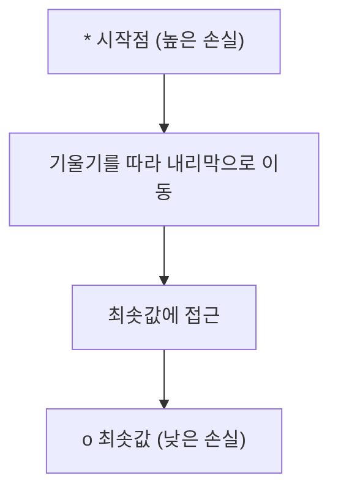
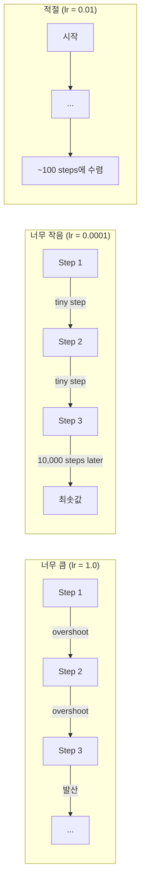
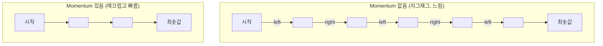
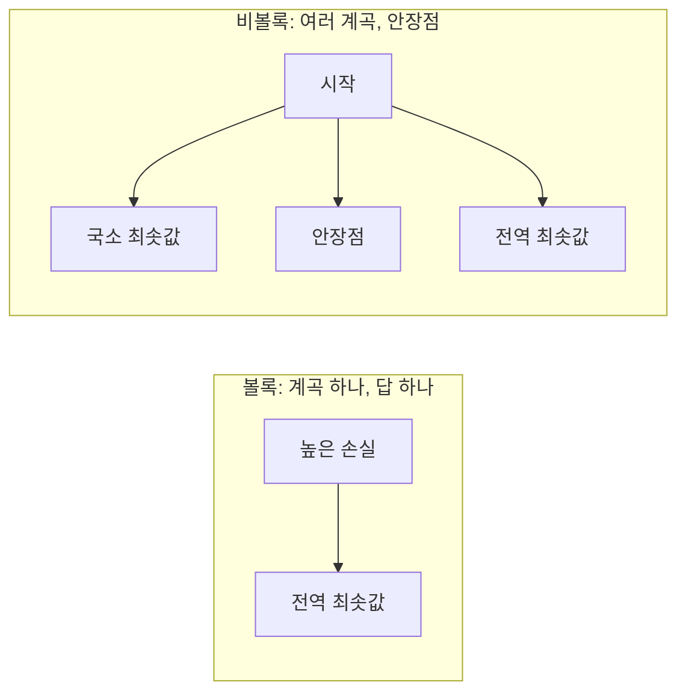
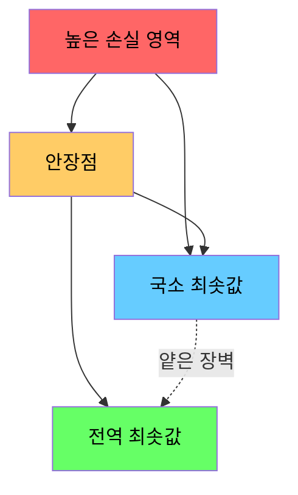

# 최적화 (Optimization)

> 신경망을 학습시키는 것은 계곡의 바닥을 찾는 일에 다름없습니다.

**Type:** Build
**Language:** Python
**Prerequisites:** Phase 1, Lessons 04-05 (Derivatives, Gradients)
**Time:** ~75 minutes

## 학습 목표 (Learning Objectives)

- Vanilla gradient descent, momentum SGD, Adam을 처음부터 구현합니다
- Rosenbrock 함수에서 옵티마이저 수렴을 비교하고 Adam이 가중치별 학습률을 적응시키는 이유를 설명합니다
- 볼록 vs 비볼록 손실 지형을 구분하고 고차원에서 안장점의 역할을 설명합니다
- 학습 안정성을 위해 학습률 스케줄(step decay, cosine annealing, warmup)을 구성합니다

## 문제 상황 (The Problem)

손실 함수가 있습니다. 모델이 얼마나 틀렸는지 알려줍니다. 기울기가 있습니다. 손실을 더 나쁘게 만드는 방향을 알려줍니다. 이제 내리막으로 걸어가는 전략이 필요합니다.

순진한 접근은 단순합니다: 기울기 반대 방향으로 움직입니다. 학습률이라는 수로 스텝을 스케일합니다. 반복합니다. 이것이 경사하강법이고, 작동합니다. 하지만 "작동"에는 주의사항이 있습니다. 학습률이 너무 크면 계곡을 통째로 지나쳐 벽 사이를 튕깁니다. 너무 작으면 수천 번의 불필요한 스텝으로 답에 기어갑니다. 안장점에 걸리면 최솟값을 찾지 못했는데도 멈춥니다.

딥러닝의 모든 옵티마이저는 같은 질문에 대한 답입니다: 계곡 바닥에 더 빠르고 안정적으로 어떻게 도달하는가?

## 핵심 개념 (The Concept)

### 최적화가 의미하는 것 (What optimization means)

최적화는 함수를 최소화(또는 최대화)하는 입력 값을 찾는 것입니다. 머신러닝에서 함수는 손실입니다. 입력은 모델의 가중치입니다. 학습은 최적화입니다.

```
minimize L(w) where:
  L = loss function
  w = model weights (could be millions of parameters)
```

### 경사하강법 (Gradient descent, vanilla)

가장 단순한 옵티마이저. 모든 가중치에 대한 손실의 기울기를 계산합니다. 각 가중치를 기울기 반대 방향으로 움직입니다. 학습률로 스텝을 스케일합니다.

```
w = w - lr * gradient
```

전체 알고리즘이 이것입니다. 한 줄.



### 학습률: 가장 중요한 하이퍼파라미터 (Learning rate)

학습률은 스텝 크기를 제어합니다. 수렴에 관한 모든 것을 결정합니다.



올바른 학습률에 대한 공식은 없습니다. 실험으로 찾습니다. 흔한 출발점: Adam은 0.001, momentum SGD는 0.01.

### SGD vs batch vs mini-batch

Vanilla 경사하강법은 한 스텝을 밟기 전에 전체 데이터셋에 대해 기울기를 계산합니다. 이를 batch gradient descent라고 합니다. 안정적이지만 느립니다.

Stochastic gradient descent(SGD)는 단일 무작위 샘플에서 기울기를 계산하고 즉시 스텝합니다. 시끄럽지만 빠릅니다.

Mini-batch gradient descent는 중간입니다. 작은 배치(32, 64, 128, 256 샘플)에 대해 기울기를 계산한 뒤 스텝합니다. 실제로 모두가 쓰는 방식입니다.

| 변형 | 배치 크기 | 기울기 품질 | 스텝당 속도 | 노이즈 |
|---------|-----------|-----------------|---------------|-------|
| Batch GD | 전체 데이터셋 | Exact | Slow | None |
| SGD | 1 sample | Very noisy | Fast | High |
| Mini-batch | 32-256 | Good estimate | Balanced | Moderate |

SGD와 mini-batch의 노이즈는 버그가 아닙니다. 얕은 국소 최솟값과 안장점을 탈출하는 데 도움이 됩니다.

### Momentum: 내리막을 구르는 공 (the ball rolling downhill)

Vanilla 경사하강법은 현재 기울기만 봅니다. 기울기가 지그재그하면(좁은 계곡에서 흔함) 진전이 느립니다. Momentum은 과거 기울기를 속도 항에 누적해 이를 고칩니다.

```
v = beta * v + gradient
w = w - lr * v
```

비유: 내리막을 구르는 공. 매 요철마다 멈추고 다시 시작하지 않습니다. 일관된 방향에서 속도를 모으고 진동을 감쇠합니다.



`beta`(보통 0.9)는 얼마나 많은 이력을 유지할지 제어합니다. beta가 높을수록 momentum이 크고 경로가 매끄럽지만 방향 변화에 대한 반응이 느립니다.

### Adam: 적응적 학습률 (adaptive learning rates)

서로 다른 가중치는 서로 다른 학습률이 필요합니다. 큰 기울기를 거의 안 받는 가중치는 마침내 받을 때 더 큰 스텝을 밟아야 합니다. 거대한 기울기를 계속 받는 가중치는 더 작은 스텝을 밟아야 합니다.

Adam(Adaptive Moment Estimation)은 가중치마다 두 가지를 추적합니다:

1. First moment (m): 기울기의 이동 평균 (momentum과 유사)
2. Second moment (v): 제곱 기울기의 이동 평균 (기울기 크기)

```
m = beta1 * m + (1 - beta1) * gradient
v = beta2 * v + (1 - beta2) * gradient^2

m_hat = m / (1 - beta1^t)    bias correction
v_hat = v / (1 - beta2^t)    bias correction

w = w - lr * m_hat / (sqrt(v_hat) + epsilon)
```

`sqrt(v_hat)`로 나누는 것이 핵심 통찰입니다. 큰 기울기를 가진 가중치는 큰 수로 나뉩니다(작은 유효 스텝). 작은 기울기를 가진 가중치는 작은 수로 나뉩니다(큰 유효 스텝). 각 가중치가 자신만의 적응 학습률을 갖습니다.

기본 하이퍼파라미터: `lr=0.001, beta1=0.9, beta2=0.999, epsilon=1e-8`. 대부분의 문제에 잘 작동합니다.

### 학습률 스케줄 (Learning rate schedules)

고정 학습률은 타협입니다. 학습 초반에는 빠른 진전을 위해 큰 스텝을 원합니다. 후반에는 최솟값 근처에서 미세 조정을 위해 작은 스텝을 원합니다.

흔한 스케줄:

| Schedule | Formula | Use case |
|----------|---------|----------|
| Step decay | lr = lr * factor every N epochs | Simple, manual control |
| Exponential decay | lr = lr_0 * decay^t | Smooth reduction |
| Cosine annealing | lr = lr_min + 0.5 * (lr_max - lr_min) * (1 + cos(pi * t / T)) | Transformers, modern training |
| Warmup + decay | Linear ramp up, then decay | Large models, prevents early instability |

### 볼록 vs 비볼록 (Convex vs non-convex)

볼록 함수는 최솟값이 하나입니다. 경사하강법은 항상 찾습니다. `f(x) = x^2` 같은 이차함수는 볼록입니다.

신경망 손실 함수는 비볼록입니다. 많은 국소 최솟값, 안장점, 평탄한 영역이 있습니다.



실무에서 고차원 신경망의 국소 최솟값은 거의 문제가 되지 않습니다. 대부분의 국소 최솟값은 전역 최솟값에 가까운 손실 값을 갖습니다. 안장점(어떤 방향에서는 평평하고 다른 방향에서는 굽은)이 진짜 장애물입니다. Momentum과 mini-batch의 노이즈가 탈출을 돕습니다.

### 손실 지형 시각화 (Loss landscape visualization)

손실은 모든 가중치의 함수입니다. 가중치 100만 개인 모델에서 손실 지형은 1,000,001차원 공간에 있습니다. 가중치 공간에서 두 무작위 방향을 고르고 그 방향을 따라 손실을 그려 2D 표면으로 시각화합니다.



날카로운 최솟값은 일반화가 나쁩니다. 평탄한 최솟값은 일반화가 좋습니다. Momentum SGD가 최종 테스트 정확도에서 Adam을 종종 이기는 이유 중 하나입니다: 노이즈가 날카로운 최솟값에 정착하는 것을 막습니다.

```figure
gradient-descent
```

## 구현하기 (Build It)

### Step 1: 테스트 함수 정의 (Define a test function)

Rosenbrock 함수는 고전적 최적화 벤치마크입니다. 최솟값은 (1, 1)에 있으며, 찾기 쉽지만 따라가기 어려운 좁고 굽은 계곡 안에 있습니다.

```
f(x, y) = (1 - x)^2 + 100 * (y - x^2)^2
```

```python
def rosenbrock(params):
    x, y = params
    return (1 - x) ** 2 + 100 * (y - x ** 2) ** 2

def rosenbrock_gradient(params):
    x, y = params
    df_dx = -2 * (1 - x) + 200 * (y - x ** 2) * (-2 * x)
    df_dy = 200 * (y - x ** 2)
    return [df_dx, df_dy]
```

### Step 2: Vanilla 경사하강법

```python
class GradientDescent:
    def __init__(self, lr=0.001):
        self.lr = lr

    def step(self, params, grads):
        return [p - self.lr * g for p, g in zip(params, grads)]
```

### Step 3: Momentum SGD

```python
class SGDMomentum:
    def __init__(self, lr=0.001, momentum=0.9):
        self.lr = lr
        self.momentum = momentum
        self.velocity = None

    def step(self, params, grads):
        if self.velocity is None:
            self.velocity = [0.0] * len(params)
        self.velocity = [
            self.momentum * v + g
            for v, g in zip(self.velocity, grads)
        ]
        return [p - self.lr * v for p, v in zip(params, self.velocity)]
```

### Step 4: Adam

```python
class Adam:
    def __init__(self, lr=0.001, beta1=0.9, beta2=0.999, epsilon=1e-8):
        self.lr = lr
        self.beta1 = beta1
        self.beta2 = beta2
        self.epsilon = epsilon
        self.m = None
        self.v = None
        self.t = 0

    def step(self, params, grads):
        if self.m is None:
            self.m = [0.0] * len(params)
            self.v = [0.0] * len(params)

        self.t += 1

        self.m = [
            self.beta1 * m + (1 - self.beta1) * g
            for m, g in zip(self.m, grads)
        ]
        self.v = [
            self.beta2 * v + (1 - self.beta2) * g ** 2
            for v, g in zip(self.v, grads)
        ]

        m_hat = [m / (1 - self.beta1 ** self.t) for m in self.m]
        v_hat = [v / (1 - self.beta2 ** self.t) for v in self.v]

        return [
            p - self.lr * mh / (vh ** 0.5 + self.epsilon)
            for p, mh, vh in zip(params, m_hat, v_hat)
        ]
```

### Step 5: 실행하고 비교 (Run and compare)

```python
def optimize(optimizer, func, grad_func, start, steps=5000):
    params = list(start)
    history = [params[:]]
    for _ in range(steps):
        grads = grad_func(params)
        params = optimizer.step(params, grads)
        history.append(params[:])
    return history

start = [-1.0, 1.0]

gd_history = optimize(GradientDescent(lr=0.0005), rosenbrock, rosenbrock_gradient, start)
sgd_history = optimize(SGDMomentum(lr=0.0001, momentum=0.9), rosenbrock, rosenbrock_gradient, start)
adam_history = optimize(Adam(lr=0.01), rosenbrock, rosenbrock_gradient, start)

for name, history in [("GD", gd_history), ("SGD+M", sgd_history), ("Adam", adam_history)]:
    final = history[-1]
    loss = rosenbrock(final)
    print(f"{name:6s} -> x={final[0]:.6f}, y={final[1]:.6f}, loss={loss:.8f}")
```

기대 출력: Adam이 가장 빨리 수렴합니다. Momentum SGD는 더 매끄러운 경로를 따릅니다. Vanilla GD는 좁은 계곡을 따라 느리게 진전합니다.

## 실용 활용 (Use It)

실무에서는 PyTorch나 JAX 옵티마이저를 쓰세요. 파라미터 그룹, weight decay, gradient clipping, GPU 가속을 처리합니다.

```python
import torch

model = torch.nn.Linear(784, 10)

sgd = torch.optim.SGD(model.parameters(), lr=0.01, momentum=0.9)
adam = torch.optim.Adam(model.parameters(), lr=0.001)
adamw = torch.optim.AdamW(model.parameters(), lr=0.001, weight_decay=0.01)

scheduler = torch.optim.lr_scheduler.CosineAnnealingLR(adam, T_max=100)
```

경험 법칙:

- Adam(lr=0.001)으로 시작하세요. 튜닝 없이 대부분의 문제에 작동합니다.
- 최고의 최종 정확도가 필요하고 더 많은 튜닝을 감수할 수 있으면 Momentum SGD(lr=0.01, momentum=0.9)로 전환하세요.
- 트랜스포머에는 AdamW(decoupled weight decay가 있는 Adam)를 쓰세요.
- 몇 epoch보다 긴 학습에는 항상 학습률 스케줄을 쓰세요.
- 학습이 불안정하면 학습률을 낮추세요. 너무 느리면 올리세요.

## 배포할 산출물 (Ship It)

이 레슨은 올바른 옵티마이저를 고르는 프롬프트를 만듭니다. `outputs/prompt-optimizer-guide.md`를 보세요.

여기서 만든 옵티마이저 클래스는 Phase 3에서 신경망을 처음부터 학습할 때 다시 나타납니다.

## 연습 문제 (Exercises)

1. **학습률 스윕.** Rosenbrock 함수에서 vanilla 경사하강법을 학습률 [0.0001, 0.0005, 0.001, 0.005, 0.01]로 실행하세요. 각 경우 5000 스텝 후 최종 손실을 그리거나 출력하세요. 여전히 수렴하는 가장 큰 학습률을 찾으세요.

2. **Momentum 비교.** Rosenbrock에서 momentum 값 [0.0, 0.5, 0.9, 0.99]로 SGD를 실행하세요. 매 스텝의 손실을 추적하세요. 어떤 momentum이 가장 빨리 수렴하나요? 어떤 것이 overshoot하나요?

3. **안장점 탈출.** 함수 `f(x, y) = x^2 - y^2`(원점에 안장점)를 정의하세요. (0.01, 0.01)에서 시작하세요. Vanilla GD, Momentum SGD, Adam의 행동을 비교하세요. 어느 것이 안장점을 탈출하나요?

4. **학습률 decay 구현.** GradientDescent 클래스에 지수 decay 스케줄을 추가하세요: `lr = lr_0 * 0.999^step`. Rosenbrock에서 decay 유무의 수렴을 비교하세요.

## 핵심 용어 (Key Terms)

| 용어 (Term) | 흔히 하는 말 | 실제 의미 |
|------|----------------|----------------------|
| Gradient descent | "내리막으로 가라" | 학습률로 스케일한 기울기를 빼 가중치를 업데이트. 가장 기본적인 옵티마이저. |
| Learning rate | "스텝 크기" | 각 업데이트가 가중치를 얼마나 멀리 옮길지 제어하는 스칼라. 너무 크면 발산. 너무 작으면 계산 낭비. |
| Momentum | "계속 굴러가라" | 과거 기울기를 속도 벡터에 누적. 진동을 감쇠하고 일관된 방향에서 가속. |
| SGD | "무작위 샘플링" | Stochastic gradient descent. 전체 데이터셋 대신 무작위 부분집합에서 기울기 계산. 실무에서는 거의 항상 mini-batch SGD. |
| Mini-batch | "데이터 덩어리" | 기울기를 추정하는 데 쓰는 작은 학습 데이터 부분집합(32-256 샘플). 속도와 기울기 정확도의 균형. |
| Adam | "기본 옵티마이저" | Adaptive Moment Estimation. 기울기와 제곱 기울기의 가중치별 이동 평균을 추적해 각 가중치에 자체 학습률을 줌. |
| Bias correction | "콜드 스타트 수정" | Adam의 1차·2차 moment가 0으로 초기화됨. 초기 스텝에서 (1 - beta^t)로 나눠 보정. |
| Learning rate schedule | "시간에 따라 lr 변경" | 학습 중 학습률을 조정하는 함수. 초반 큰 스텝, 후반 작은 스텝. |
| Convex function | "계곡 하나" | 임의의 국소 최솟값이 전역 최솟값인 함수. 경사하강법이 항상 찾음. 신경망 손실은 볼록이 아님. |
| Saddle point | "평평하지만 최솟값 아님" | 기울기가 0이지만 어떤 방향에서는 최솟값, 다른 방향에서는 최댓값인 점. 고차원에서 흔함. |
| Loss landscape | "지형" | 가중치 공간 위에 그린 손실 함수. 두 무작위 방향을 따라 슬라이스해 시각화. |
| Convergence | "도달하기" | 추가 스텝이 손실을 의미 있게 줄이지 못하는 지점에 옵티마이저가 도달함. |

## 더 읽을거리 (Further Reading)

- [Sebastian Ruder: An overview of gradient descent optimization algorithms](https://ruder.io/optimizing-gradient-descent/) - 주요 옵티마이저 종합 서베이
- [Why Momentum Really Works (Distill)](https://distill.pub/2017/momentum/) - momentum 동역학의 인터랙티브 시각화
- [Adam: A Method for Stochastic Optimization (Kingma & Ba, 2014)](https://arxiv.org/abs/1412.6980) - 원본 Adam 논문, 짧고 읽기 쉬움
- [Visualizing the Loss Landscape of Neural Nets (Li et al., 2018)](https://arxiv.org/abs/1712.09913) - sharp vs flat minima를 보여 준 논문
