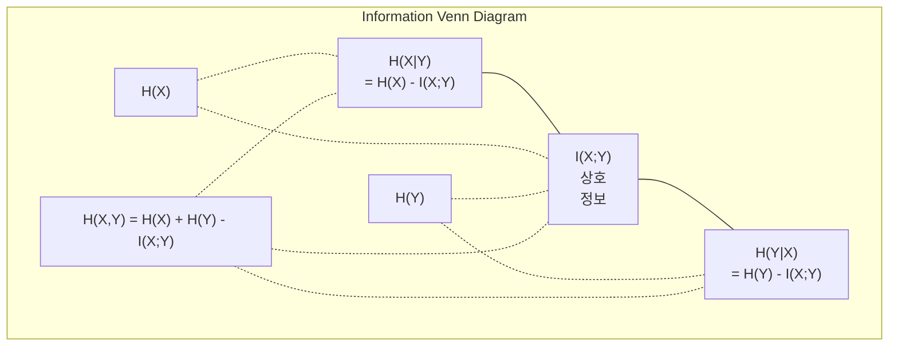

# 정보 이론

> 정보 이론은 놀라움을 측정합니다. 손실 함수는 이를 기반으로 구축됩니다.

**유형:** Learn
**언어:** Python
**선수 요건:** 1단계, 06강 (확률)
**시간:** 약 60분

## 학습 목표

- 엔트로피, 교차 엔트로피, KL 발산을 처음부터 계산하고 그 관계를 설명해 보세요
- 교차 엔트로피 손실을 최소화하는 것이 로그 우도를 최대화하는 것과 동등한 이유를 유도해 보세요
- 특징과 타겟 간의 상호 정보를 계산하여 특징의 중요도를 순위에 매겨 보세요
- 퍼플렉시티를 언어 모델이 선택하는 유효 어휘 크기로 설명해 보세요

## 문제점

훈련하는 모든 분류 모델에서 `CrossEntropyLoss()`를 호출합니다. 모든 언어 모델 논문에서 "퍼플렉시티"를 봅니다. VAE, 증류, RLHF에서 KL 발산에 대해 읽습니다. 이들은 분리된 개념이 아닙니다. 모두 같은 아이디어가 다른 옷을 입고 있는 것입니다.

정보 이론은 불확실성, 압축, 예측에 대해 추론하는 언어를 제공합니다. 클로드 샤논은 1948년 통신 문제를 해결하기 위해 이를 발명했습니다. 신경망을 훈련하는 것은 통신 문제임이 밝혀졌습니다. 모델은 학습된 가중치라는 잡음 채널을 통해 올바른 레이블을 전송하려고 시도하고 있습니다.

이 강의는 모든 공식을 처음부터 구축하여 그 출처와 작동 원리를 확인해 보세요.

## 개념

### 정보량 (놀라움)

드문 일이 발생하면 더 많은 정보를 담고 있습니다. 동전이 앞면이 나오는 것? 놀랍지 않습니다. 로또 당첨? 매우 놀랍습니다.

확률 p를 가진 사건의 정보량은 다음과 같습니다:

```
I(x) = -log(p(x))
```

로그의 밑을 2로 사용하면 비트를 얻습니다. 자연 로그를 사용하면 내트를 얻습니다. 같은 아이디어, 다른 단위입니다.

```
Event              Probability    Surprise (bits)
Fair coin heads    0.5            1.0
Rolling a 6        0.167          2.58
1-in-1000 event    0.001          9.97
Certain event      1.0            0.0
```

확정된 사건은 정보량이 0입니다. 이미 발생할 것을 알고 있었습니다.

### 엔트로피 (평균 놀라움)

엔트로피는 분포의 모든 가능한 결과에 걸친 기대 놀라움입니다.

```
H(P) = -sum( p(x) * log(p(x)) )  for all x
```

공정한 동전은 이진 변수에 대해 최대 엔트로피를 가집니다: 1비트입니다. 편향된 동전(99% 앞면)은 엔트로피가 낮습니다: 0.08비트입니다. 이미 결과를 알고 있으므로, 각 던지기는 거의 아무런 정보를 제공하지 않습니다.

```
Fair coin:    H = -(0.5 * log2(0.5) + 0.5 * log2(0.5)) = 1.0 bit
Biased coin:  H = -(0.99 * log2(0.99) + 0.01 * log2(0.01)) = 0.08 bits
```

엔트로피는 분포의 줄일 수 없는 불확실성을 측정합니다. 이 값 아래로는 압축할 수 없습니다.

### 교차 엔트로피(Cross-Entropy) (매일 사용하는 손실 함수)

교차 엔트로피는 실제 분포 P에서 온 사건을 분포 Q로 인코딩할 때의 평균 놀라움(surprise)을 측정합니다.

```
H(P, Q) = -sum( p(x) * log(q(x)) )  for all x
```

P는 실제 분포(라벨)입니다. Q는 모델의 예측입니다. Q가 P와 완벽하게 일치하면 교차 엔트로피는 엔트로피와 같습니다. 불일치가 발생하면 값이 커집니다.

분류에서는 P가 원-핫(one-hot) 벡터입니다(참 클래스의 확률은 1, 나머지는 0). 이를 통해 교차 엔트로피는 다음과 같이 단순화됩니다:

```
H(P, Q) = -log(q(true_class))
```

이것이 분류를 위한 교차 엔트로피 손실 공식 전체입니다. 참 클래스의 예측 확률을 최대화하세요.

### KL 발산(KL Divergence) (분포 간 거리)

KL 발산은 P 대신 Q를 사용할 때 추가적으로 발생하는 놀라움(surprise)의 양을 측정합니다.

```
D_KL(P || Q) = sum( p(x) * log(p(x) / q(x)) )  for all x
             = H(P, Q) - H(P)
```

교차 엔트로피는 엔트로피에 KL 발산을 더한 값입니다. 학습 중 실제 분포의 엔트로피는 상수이므로, 교차 엔트로피를 최소화하는 것은 KL 발산을 최소화하는 것과 같습니다. 모델의 분포를 실제 분포로 밀어붙이는 것입니다.

KL 발산은 대칭이 아닙니다: D_KL(P || Q) != D_KL(Q || P). 이는 진정한 거리 지표가 아닙니다.

### 상호 정보(Mutual Information)

상호 정보는 한 변수를 알면 다른 변수에 대해 얼마나 많은 것을 알 수 있는지를 측정합니다.

```
I(X; Y) = H(X) - H(X|Y)
        = H(X) + H(Y) - H(X, Y)
```

X와 Y가 독립이면 상호 정보는 0입니다. 하나를 알면 다른 것에 대해 아무것도 알 수 없습니다. 완벽하게 상관관계가 있으면 상호 정보는 어느 한 변수의 엔트로피와 같습니다.

특성 선택에서 특성(feature)과 타겟(target) 간의 상호 정보가 높으면 그 특성은 유용합니다. 상호 정보가 낮으면 잡음(noise)입니다.

### 조건부 엔트로피(Conditional Entropy)

H(Y|X)는 X를 관측한 후 Y에 대해 남아 있는 불확실성의 양을 측정합니다.

```
H(Y|X) = H(X,Y) - H(X)
```

두 가지 극단적인 경우:
- X가 Y를 완전히 결정한다면, H(Y|X) = 0입니다. X를 알면 Y에 대한 모든 불확실성이 사라집니다. 예: X = 섭씨 온도, Y = 화씨 온도.
- X가 Y에 대해 아무것도 알려주지 않는다면, H(Y|X) = H(Y)입니다. X를 알더라도 불확실성이 전혀 줄어들지 않습니다. 예: X = 동전 던지기, Y = 내일의 날씨.

조건부 엔트로피는 항상 비음수이며 H(Y)를 초과하지 않습니다:

```
0 <= H(Y|X) <= H(Y)
```

머신러닝에서 조건부 엔트로피는 결정 트리(decision tree)에 나타납니다. 각 분할에서 알고리즘은 H(Y|X)를 최소화하는 특징(feature) X를 선택합니다. 이는 레이블 Y에 대한 불확실성을 가장 많이 제거하는 특징입니다.

### 결합 엔트로피(Joint Entropy)

H(X,Y)는 X와 Y의 결합 분포의 엔트로피입니다.

```
H(X,Y) = -sum sum p(x,y) * log(p(x,y))   for all x, y
```

주요 속성:

```
H(X,Y) <= H(X) + H(Y)
```

X와 Y가 독립일 때 등호가 성립합니다. 두 변수가 정보를 공유하면 결합 엔트로피는 개별 엔트로피의 합보다 작습니다. "누락된" 엔트로피는 정확히 상호 정보(mutual information)입니다.



관계식:
- H(X,Y) = H(X) + H(Y|X) = H(Y) + H(X|Y)
- I(X;Y) = H(X) - H(X|Y) = H(Y) - H(Y|X)
- H(X,Y) = H(X) + H(Y) - I(X;Y)

### 상호 정보 (심층 분석)

상호 정보 I(X;Y)는 하나의 변수를 알 때 다른 변수에 대한 불확실성이 얼마나 감소하는지를 정량화합니다.

```
I(X;Y) = H(X) - H(X|Y)
       = H(Y) - H(Y|X)
       = H(X) + H(Y) - H(X,Y)
       = sum sum p(x,y) * log(p(x,y) / (p(x) * p(y)))
```

속성:
- I(X;Y) >= 0이 항상 성립합니다. 무언가를 관측함으로써 정보를 잃지는 않습니다.
- X와 Y가 독립일 때만 I(X;Y) = 0입니다.
- I(X;Y) = I(Y;X)입니다. KL 발산(KL divergence)과 달리 대칭적입니다.
- I(X;X) = H(X)입니다. 변수는 자기 자신과 모든 정보를 공유합니다.

**특징 선택을 위한 상호 정보.** ML에서는 타겟에 대해 정보량이 많은 특징을 원합니다. 상호 정보는 특징을 순위 매기기 위한 원리 있는 방법을 제공합니다:

1. 각 특징 X_i에 대해 I(X_i; Y)를 계산합니다. 여기서 Y는 타겟 변수입니다.
2. MI 점수에 따라 특징을 순위 매깁니다.
3. 상위 k개의 특징을 유지합니다.

이 방법은 특성과 타겟 간의 모든 관계에 적용됩니다 -- 선형, 비선형, 단조, 또는 그 외의 관계. 상관계수는 선형 관계만 포착합니다. 상호 정보량은 모든 것을 포착합니다.

| 방법 | 포착하는 관계 | 계산 비용 | 범주형 처리 여부 |
|--------|---------|-------------------|---------------------|
| 피어슨 상관계수 | 선형 관계 | O(n) | 불가 |
| 스피어만 상관계수 | 단조 관계 | O(n log n) | 불가 |
| 상호 정보량 | 모든 통계적 의존성 | O(n log n) (분할(bin) 사용 시) | 가능 |

### 레이블 스무딩과 교차 엔트로피

표준 분류는 하드 타겟을 사용합니다: [0, 0, 1, 0]. 참 클래스는 확률 1을, 나머지는 0을 받습니다. 레이블 스무딩은 이를 소프트 타겟으로 대체합니다:

```
soft_target = (1 - epsilon) * hard_target + epsilon / num_classes
```

epsilon = 0.1이고 클래스가 4개인 경우:
- 하드 타겟:  [0, 0, 1, 0]
- 소프트 타겟:  [0.025, 0.025, 0.925, 0.025]

정보 이론적 관점에서, 레이블 스무딩은 타겟 분포의 엔트로피를 증가시킵니다. 하드 원핫(one-hot) 타겟은 엔트로피가 0입니다 -- 불확실성이 없습니다. 소프트 타겟은 양의 엔트로피를 가집니다.

이것이 도움이 되는 이유:
- 모델이 로짓을 극단적인 값으로 밀어붙이는 것을 방지합니다 (교차 엔트로피 하에서 원핫 타겟을 완벽하게 일치시키려면 무한한 로짓이 필요할 것입니다)
- 정규화(regularization) 역할을 합니다: 모델은 100% 확신할 수 없습니다
- 보정(calibration)을 개선합니다: 예측된 확률이 실제 불확실성을 더 잘 반영합니다
- 학습과 추론 동작 간의 격차를 줄입니다

레이블 스무딩을 적용한 교차 엔트로피 손실은 다음과 같습니다:

```
L = (1 - epsilon) * CE(hard_target, prediction) + epsilon * H_uniform(prediction)
```

두 번째 항은 균일 분포에서 멀리 떨어진 예측에 페널티를 부여합니다 -- 확신도에 대한 직접적인 정규화입니다.

### 교차 엔트로피가 분류 손실인 이유

세 가지 관점, 동일한 결론.

**정보 이론적 관점.** 교차 엔트로피는 모델의 분포를 사용하여 참 분포 대신 얼마나 많은 비트를 낭비하는지 측정합니다. 이를 최소화하면 모델이 현실의 가장 효율적인 인코더가 됩니다.

**최대 우도 관점.** 참 클래스가 y_i인 N개의 학습 샘플에 대해:

```
Likelihood     = product( q(y_i) )
Log-likelihood = sum( log(q(y_i)) )
Negative log-likelihood = -sum( log(q(y_i)) )
```

마지막 줄은 교차 엔트로피(Cross-Entropy) 손실입니다. 교차 엔트로피를 최소화하는 것은 모델 하에서 학습 데이터의 우도를 최대화하는 것과 같습니다.

**기울기 관점.** 로짓(Logits)에 대한 교차 엔트로피의 기울기는 단순히 (예측값 - 실제값)입니다. 깔끔하고 안정적이며 계산이 빠릅니다. 이 때문에 소프트맥스(Softmax)와 완벽하게 짝을 이룹니다.

### 비트와 내트

차이점은 로그의 밑(base)뿐입니다.

```
log base 2   -> bits      (information theory tradition)
log base e   -> nats      (machine learning convention)
log base 10  -> hartleys  (rarely used)
```

1 내트(nat) = 1/ln(2) 비트 = 1.4427 비트입니다. PyTorch와 TensorFlow는 기본적으로 자연 로그(내트)를 사용합니다.

### 퍼플렉시티(Perplexity)

퍼플렉시티는 교차 엔트로피의 지수값입니다. 모델이 균등한 확률의 선택지 중 몇 개 사이에서 불확실성을 느끼는지, 즉 유효한 선택지 수를 알려줍니다.

```
Perplexity = 2^H(P,Q)   (if using bits)
Perplexity = e^H(P,Q)   (if using nats)
```

퍼플렉시티가 50인 언어 모델은 평균적으로 50개의 가능한 다음 토큰(Token) 중 하나를 균등하게 선택해야 할 때만큼 혼란스러운 상태입니다. 값이 낮을수록 좋습니다.

GPT-2는 일반적인 벤치마크에서 약 30의 퍼플렉시티를 달성했습니다. 현대 모델들은 잘 표현된 도메인에서는 한 자릿수 퍼플렉시티를 기록합니다.

```figure
entropy-kl
```

## 구현하기

### 1단계: 정보량과 엔트로피

```python
import math

def information_content(p, base=2):
    if p <= 0 or p > 1:
        return float('inf') if p <= 0 else 0.0
    return -math.log(p) / math.log(base)

def entropy(probs, base=2):
    return sum(
        p * information_content(p, base)
        for p in probs if p > 0
    )

fair_coin = [0.5, 0.5]
biased_coin = [0.99, 0.01]
fair_die = [1/6] * 6

print(f"Fair coin entropy:   {entropy(fair_coin):.4f} bits")
print(f"Biased coin entropy: {entropy(biased_coin):.4f} bits")
print(f"Fair die entropy:    {entropy(fair_die):.4f} bits")
```

### 2단계: 교차 엔트로피와 KL 발산

```python
def cross_entropy(p, q, base=2):
    total = 0.0
    for pi, qi in zip(p, q):
        if pi > 0:
            if qi <= 0:
                return float('inf')
            total += pi * (-math.log(qi) / math.log(base))
    return total

def kl_divergence(p, q, base=2):
    return cross_entropy(p, q, base) - entropy(p, base)

true_dist = [0.7, 0.2, 0.1]
good_model = [0.6, 0.25, 0.15]
bad_model = [0.1, 0.1, 0.8]

print(f"Entropy of true dist:     {entropy(true_dist):.4f} bits")
print(f"CE (good model):          {cross_entropy(true_dist, good_model):.4f} bits")
print(f"CE (bad model):           {cross_entropy(true_dist, bad_model):.4f} bits")
print(f"KL divergence (good):     {kl_divergence(true_dist, good_model):.4f} bits")
print(f"KL divergence (bad):      {kl_divergence(true_dist, bad_model):.4f} bits")
```

### 3단계: 분류 손실로서의 교차 엔트로피

```python
def softmax(logits):
    max_logit = max(logits)
    exps = [math.exp(z - max_logit) for z in logits]
    total = sum(exps)
    return [e / total for e in exps]

def cross_entropy_loss(true_class, logits):
    probs = softmax(logits)
    return -math.log(probs[true_class])

logits = [2.0, 1.0, 0.1]
true_class = 0

probs = softmax(logits)
loss = cross_entropy_loss(true_class, logits)

print(f"Logits:      {logits}")
print(f"Softmax:     {[f'{p:.4f}' for p in probs]}")
print(f"True class:  {true_class}")
print(f"Loss:        {loss:.4f} nats")
print(f"Perplexity:  {math.exp(loss):.2f}")
```

### 4단계: 교차 엔트로피는 음의 로그 우도와 같습니다

```python
import random

random.seed(42)

n_samples = 1000
n_classes = 3
true_labels = [random.randint(0, n_classes - 1) for _ in range(n_samples)]
model_logits = [[random.gauss(0, 1) for _ in range(n_classes)] for _ in range(n_samples)]

ce_loss = sum(
    cross_entropy_loss(label, logits)
    for label, logits in zip(true_labels, model_logits)
) / n_samples

nll = -sum(
    math.log(softmax(logits)[label])
    for label, logits in zip(true_labels, model_logits)
) / n_samples

print(f"Cross-entropy loss:      {ce_loss:.6f}")
print(f"Negative log-likelihood: {nll:.6f}")
print(f"Difference:              {abs(ce_loss - nll):.2e}")
```

### 5단계: 상호 정보량

```python
def mutual_information(joint_probs, base=2):
    rows = len(joint_probs)
    cols = len(joint_probs[0])

    margin_x = [sum(joint_probs[i][j] for j in range(cols)) for i in range(rows)]
    margin_y = [sum(joint_probs[i][j] for i in range(rows)) for j in range(cols)]

    mi = 0.0
    for i in range(rows):
        for j in range(cols):
            pxy = joint_probs[i][j]
            if pxy > 0:
                mi += pxy * math.log(pxy / (margin_x[i] * margin_y[j])) / math.log(base)
    return mi

independent = [[0.25, 0.25], [0.25, 0.25]]
dependent = [[0.45, 0.05], [0.05, 0.45]]

print(f"MI (independent): {mutual_information(independent):.4f} bits")
print(f"MI (dependent):   {mutual_information(dependent):.4f} bits")
```

## 사용하기

실제로 사용할 때와 같이 NumPy를 이용해 동일한 개념을 적용해 보세요:

```python
import numpy as np

def np_entropy(p):
    p = np.asarray(p, dtype=float)
    mask = p > 0
    result = np.zeros_like(p)
    result[mask] = p[mask] * np.log(p[mask])
    return -result.sum()

def np_cross_entropy(p, q):
    p, q = np.asarray(p, dtype=float), np.asarray(q, dtype=float)
    mask = p > 0
    return -(p[mask] * np.log(q[mask])).sum()

def np_kl_divergence(p, q):
    return np_cross_entropy(p, q) - np_entropy(p)

true = np.array([0.7, 0.2, 0.1])
pred = np.array([0.6, 0.25, 0.15])
print(f"Entropy:    {np_entropy(true):.4f} nats")
print(f"Cross-ent:  {np_cross_entropy(true, pred):.4f} nats")
print(f"KL div:     {np_kl_divergence(true, pred):.4f} nats")
```

`torch.nn.CrossEntropyLoss()`이 내부적으로 수행하는 내용을 처음부터 직접 구축했습니다. 이제 학습 중 손실이 감소하는 이유를 알 수 있습니다: 모델의 예측 분포가 낭비된 정보량(내트 단위)으로 측정된 실제 분포에 가까워지고 있기 때문입니다.

## 연습 문제

1. 영어 알파벳의 엔트로피를 균등 분포(26개 문자)를 가정하여 계산해 보세요. 그 후 실제 문자 빈도를 사용하여 추정해 보세요. 어느 값이 더 높으며 그 이유는 무엇인가요?

2. 모델이 실제 클래스가 1인 샘플에 대해 로짓 [5.0, 2.0, 0.5]를 출력합니다. 손으로 교차 엔트로피 손실을 계산한 후, `cross_entropy_loss` 함수로 검증해 보세요. 어떤 로짓이 손실을 0으로 만드나요?

3. KL 발산이 대칭적이지 않음을 보여주세요. 두 분포 P와 Q를 선택하여 D_KL(P || Q)와 D_KL(Q || P)를 계산해 보세요. 두 값이 다른 이유를 설명해 보세요.

4. 토큰 예측 시퀀스에 대한 퍼플렉시티(perplexity)를 계산하는 함수를 만들어 보세요. (true_token_index, predicted_logits) 쌍의 리스트가 주어지면 시퀀스의 퍼플렉시티를 반환합니다.

## 핵심 용어

| 용어 | 사람들이 말하는 것 | 실제 의미 |
|------|----------------|----------------------|
| 정보량 | "놀람(Surprise)" | 이벤트 인코딩에 필요한 비트(또는 nats) 수: -log(p) |
| 엔트로피 | "무작위성(Randomness)" | 분포의 모든 결과에 걸친 평균 놀람. 줄일 수 없는 불확실성을 측정합니다. |
| 교차 엔트로피 | "손실 함수" | 모델 분포 Q를 사용하여 실제 분포 P의 이벤트를 인코딩할 때의 평균 놀람. |
| KL 발산 | "분포 간 거리" | P 대신 Q를 사용함으로써 낭비되는 추가 비트. 교차 엔트로피에서 엔트로피를 뺀 값과 같습니다. 대칭이 아닙니다. |
| 상호 정보량 | "X와 Y가 얼마나 관련되어 있는가" | Y를 알 때 X에 대한 불확실성이 감소하는 정도. 0이면 독립입니다. |
| 소프트맥스(Softmax) | "로짓을 확률로 변환" | 지수화하고 정규화합니다. 임의의 실수 벡터를 유효한 확률 분포로 매핑합니다. |
| 퍼플렉시티(Perplexity) | "모델이 얼마나 혼란스러운가" | 교차 엔트로피의 지수. 모델이 각 단계에서 선택하는 유효 어휘 크기입니다. |
| 비트 | "섀넌의 단위" | 밑이 2인 로그로 측정된 정보량. 1비트는 공정한 동전 던지기를 해결합니다. |
| Nats | "ML의 단위" | 자연 로그로 측정된 정보량. PyTorch와 TensorFlow가 기본적으로 사용합니다. |
| 음의 로그 우도(Negative log-likelihood) | "NLL 손실" | 원-핫(one-hot) 레이블에 대해 교차 엔트로피 손실과 동일합니다. 이를 최소화하면 올바른 예측의 확률이 최대화됩니다. |

## 추가 읽기

- [Shannon 1948: A Mathematical Theory of Communication](https://people.math.harvard.edu/~ctm/home/text/others/shannon/entropy/entropy.pdf) - 원본 논문, 여전히 읽기 쉬움
- [Visual Information Theory (Chris Olah)](https://colah.github.io/posts/2015-09-Visual-Information/) - 엔트로피와 KL 발산에 대한 최고의 시각적 설명
- [PyTorch CrossEntropyLoss docs](https://pytorch.org/docs/stable/generated/torch.nn.CrossEntropyLoss.html) - 방금 만든 것을 프레임워크가 어떻게 구현하는지
