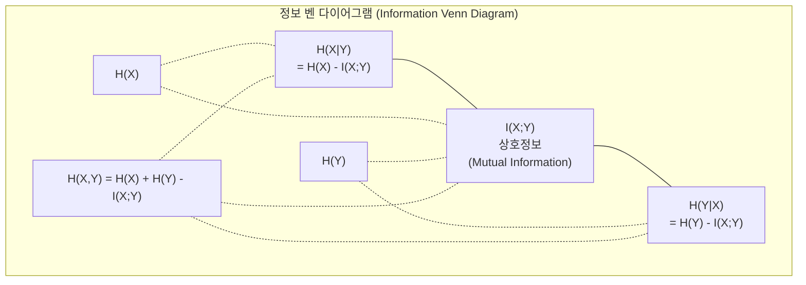

# 정보 이론 (Information Theory)

> 정보 이론은 놀라움을 측정합니다. 손실 함수는 그 위에 세워집니다.

**Type:** Learn
**Language:** Python
**Prerequisites:** Phase 1, Lesson 06 (Probability)
**Time:** ~60 minutes

## 학습 목표 (Learning Objectives)

- 엔트로피, 교차 엔트로피, KL 발산을 처음부터 계산하고 관계를 설명합니다
- 교차 엔트로피 손실 최소화가 로그 가능도 최대화와 동등한 이유를 유도합니다
- 특성과 타깃 사이의 상호정보를 계산해 특성 중요도를 순위화합니다
- Perplexity를 언어 모델이 고르는 유효 어휘 크기로 설명합니다

## 문제 상황 (The Problem)

학습하는 모든 분류 모델에서 `CrossEntropyLoss()`를 호출합니다. 모든 언어 모델 논문에서 "perplexity"를 봅니다. VAE, distillation, RLHF에서 KL 발산에 대해 읽습니다. 이것들은 서로 단절된 개념이 아닙니다. 다른 모자를 쓴 같은 아이디어입니다.

정보 이론은 불확실성, 압축, 예측에 대해 추론하는 언어를 줍니다. Claude Shannon이 1948년에 통신 문제를 풀려고 발명했습니다. 알고 보니 신경망을 학습시키는 것도 통신 문제입니다: 모델이 학습된 가중치라는 노이즈 채널을 통해 올바른 라벨을 전송하려 합니다.

이 레슨은 모든 공식을 처음부터 만들어, 어디서 왔는지와 왜 작동하는지 보이게 합니다.

## 핵심 개념 (The Concept)

### 정보량 (Information Content / Surprise)

일어날 법하지 않은 일이 일어나면 더 많은 정보를 담습니다. 동전이 앞면? 놀랍지 않음. 복권 당첨? 매우 놀랍음.

확률 p인 사건의 정보량은:

```
I(x) = -log(p(x))
```

로그 밑 2는 비트(bits)를 줍니다. 자연로그는 내트(nats)를 줍니다. 같은 아이디어, 다른 단위.

```
Event              Probability    Surprise (bits)
Fair coin heads    0.5            1.0
Rolling a 6        0.167          2.58
1-in-1000 event    0.001          9.97
Certain event      1.0            0.0
```

확실한 사건은 정보가 0입니다. 이미 일어날 것을 알고 있었습니다.

### 엔트로피 (Entropy / Average Surprise)

엔트로피는 분포의 모든 가능한 결과에 걸친 기댓값 놀라움입니다.

```
H(P) = -sum( p(x) * log(p(x)) )  for all x
```

공정한 동전은 이진 변수에 대해 최대 엔트로피: 1비트. 편향된 동전(앞면 99%)은 낮은 엔트로피: 0.08비트. 이미 무엇이 일어날지 알므로 각 던지기가 거의 아무것도 알려주지 않습니다.

```
Fair coin:    H = -(0.5 * log2(0.5) + 0.5 * log2(0.5)) = 1.0 bit
Biased coin:  H = -(0.99 * log2(0.99) + 0.01 * log2(0.01)) = 0.08 bits
```

엔트로피는 분포의 줄일 수 없는 불확실성을 측정합니다. 그 아래로 압축할 수 없습니다.

### 교차 엔트로피 (Cross-Entropy / The Loss Function You Use Every Day)

교차 엔트로피는 실제로 P에서 온 사건을 Q 분포로 인코딩할 때의 평균 놀라움을 측정합니다.

```
H(P, Q) = -sum( p(x) * log(q(x)) )  for all x
```

P는 참 분포(라벨)입니다. Q는 모델의 예측입니다. Q가 P와 완벽히 일치하면 교차 엔트로피는 엔트로피와 같습니다. 불일치는 더 크게 만듭니다.

분류에서 P는 one-hot 벡터입니다(참 클래스가 확률 1, 나머지는 0). 교차 엔트로피는 다음으로 단순화됩니다:

```
H(P, Q) = -log(q(true_class))
```

이것이 분류용 교차 엔트로피 손실 공식 전부입니다. 정답 클래스의 예측 확률을 최대화하세요.

### KL 발산 (KL Divergence / Distance Between Distributions)

KL 발산은 P 대신 Q를 써서 얻는 추가 놀라움을 측정합니다.

```
D_KL(P || Q) = sum( p(x) * log(p(x) / q(x)) )  for all x
             = H(P, Q) - H(P)
```

교차 엔트로피는 엔트로피 더하기 KL 발산입니다. 학습 중 참 분포의 엔트로피는 상수이므로, 교차 엔트로피 최소화는 KL 발산 최소화와 같습니다. 모델 분포를 참 분포 쪽으로 미는 것입니다.

KL 발산은 대칭이 아닙니다: D_KL(P || Q) != D_KL(Q || P). 진짜 거리 측도가 아닙니다.

### 상호정보 (Mutual Information)

상호정보는 한 변수를 아는 것이 다른 변수에 대해 얼마나 알려주는지 측정합니다.

```
I(X; Y) = H(X) - H(X|Y)
        = H(X) + H(Y) - H(X, Y)
```

X와 Y가 독립이면 상호정보는 0입니다. 하나를 알아도 다른 것에 대해 아무것도 모릅니다. 완벽하게 상관되면 상호정보는 어느 한쪽의 엔트로피와 같습니다.

특성 선택에서 특성과 타깃 사이의 높은 상호정보는 특성이 유용함을 의미합니다. 낮은 상호정보는 노이즈임을 의미합니다.

### 조건부 엔트로피 (Conditional Entropy)

H(Y|X)는 X를 관측한 뒤 Y에 대해 남는 불확실성을 측정합니다.

```
H(Y|X) = H(X,Y) - H(X)
```

두 극단:
- X가 Y를 완전히 결정하면 H(Y|X) = 0. X를 알면 Y에 대한 모든 불확실성이 사라집니다. 예: X = 섭씨 온도, Y = 화씨 온도.
- X가 Y에 대해 아무것도 안 알려주면 H(Y|X) = H(Y). X를 알아도 불확실성이 전혀 줄지 않습니다. 예: X = 동전 던지기, Y = 내일 날씨.

조건부 엔트로피는 항상 비음수이며 H(Y)를 넘지 않습니다:

```
0 <= H(Y|X) <= H(Y)
```

머신러닝에서 조건부 엔트로피는 결정 트리에 나타납니다. 각 분할에서 알고리즘은 H(Y|X)를 최소화하는 특성 X를 고릅니다 -- 라벨 Y에 대한 불확실성을 가장 많이 제거하는 특성.

### 결합 엔트로피 (Joint Entropy)

H(X,Y)는 X와 Y를 함께 본 결합 분포의 엔트로피입니다.

```
H(X,Y) = -sum sum p(x,y) * log(p(x,y))   for all x, y
```

핵심 성질:

```
H(X,Y) <= H(X) + H(Y)
```

X와 Y가 독립일 때 등식이 성립합니다. 정보를 공유하면 결합 엔트로피는 개별 엔트로피 합보다 작습니다. "빠진" 엔트로피가 바로 상호정보입니다.



관계:
- H(X,Y) = H(X) + H(Y|X) = H(Y) + H(X|Y)
- I(X;Y) = H(X) - H(X|Y) = H(Y) - H(Y|X)
- H(X,Y) = H(X) + H(Y) - I(X;Y)

### 상호정보 심화 (Mutual Information Deep Dive)

상호정보 I(X;Y)는 한 변수를 아는 것이 다른 변수에 대한 불확실성을 얼마나 줄이는지 정량화합니다.

```
I(X;Y) = H(X) - H(X|Y)
       = H(Y) - H(Y|X)
       = H(X) + H(Y) - H(X,Y)
       = sum sum p(x,y) * log(p(x,y) / (p(x) * p(y)))
```

성질:
- I(X;Y) >= 0 항상. 무언가를 관측해 정보를 잃지 않습니다.
- X와 Y가 독립일 때만 I(X;Y) = 0.
- I(X;Y) = I(Y;X). KL 발산과 달리 대칭입니다.
- I(X;X) = H(X). 변수는 자신과 모든 정보를 공유합니다.

**특성 선택을 위한 상호정보.** ML에서 타깃에 대해 정보적인 특성을 원합니다. 상호정보는 특성을 순위화하는 원칙적 방법을 줍니다:

1. 각 특성 X_i에 대해 타깃 Y와의 I(X_i; Y)를 계산합니다.
2. MI 점수로 특성을 순위화합니다.
3. 상위 k개 특성을 유지합니다.

특성과 타깃 사이의 어떤 관계든 -- 선형, 비선형, 단조, 비단조 -- 작동합니다. 상관관계는 선형 관계만 잡습니다. MI는 모든 것을 잡습니다.

| Method | Detects | Computational cost | Handles categorical? |
|--------|---------|-------------------|---------------------|
| Pearson correlation | Linear relationships | O(n) | No |
| Spearman correlation | Monotonic relationships | O(n log n) | No |
| Mutual information | Any statistical dependency | O(n log n) with binning | Yes |

### Label Smoothing과 교차 엔트로피

표준 분류는 hard target을 씁니다: [0, 0, 1, 0]. 참 클래스가 확률 1, 나머지는 0. Label smoothing은 이를 soft target으로 바꿉니다:

```
soft_target = (1 - epsilon) * hard_target + epsilon / num_classes
```

epsilon = 0.1, 클래스 4개일 때:
- Hard target:  [0, 0, 1, 0]
- Soft target:  [0.025, 0.025, 0.925, 0.025]

정보 이론 관점에서 label smoothing은 타깃 분포의 엔트로피를 높입니다. Hard one-hot 타깃은 엔트로피 0 -- 불확실성이 없습니다. Soft 타깃은 양의 엔트로피를 갖습니다.

도움이 되는 이유:
- 모델이 로짓을 극단 값으로 몰아가게 막음(교차 엔트로피 하에서 one-hot을 완벽히 맞추려면 무한 로짓이 필요)
- 정규화로 작용: 모델이 100% 확신할 수 없음
- 보정 개선: 예측 확률이 진짜 불확실성을 더 잘 반영
- 학습과 추론 행동 사이의 간극 감소

Label smoothing이 있는 교차 엔트로피 손실:

```
L = (1 - epsilon) * CE(hard_target, prediction) + epsilon * H_uniform(prediction)
```

둘째 항은 균등에서 먼 예측을 벌합니다 -- 확신에 대한 직접 정규화.

### 교차 엔트로피가 THE 분류 손실인 이유

세 관점, 같은 결론.

**정보 이론 관점.** 교차 엔트로피는 참 분포 대신 모델 분포를 써서 낭비하는 비트 수를 측정합니다. 최소화하면 모델이 현실의 가장 효율적인 인코더가 됩니다.

**최대가능도 관점.** 참 클래스 y_i를 가진 N개 학습 샘플에 대해:

```
Likelihood     = product( q(y_i) )
Log-likelihood = sum( log(q(y_i)) )
Negative log-likelihood = -sum( log(q(y_i)) )
```

마지막 줄이 교차 엔트로피 손실입니다. 교차 엔트로피 최소화 = 모델 하에서 학습 데이터의 가능도 최대화.

**기울기 관점.** 로짓에 대한 교차 엔트로피의 기울기는 단순히 (predicted - true)입니다. 깔끔하고, 안정적이며, 계산이 빠릅니다. Softmax와 완벽하게 짝을 이루는 이유입니다.

### Bits vs Nats

차이는 로그 밑뿐입니다.

```
log base 2   -> bits      (information theory tradition)
log base e   -> nats      (machine learning convention)
log base 10  -> hartleys  (rarely used)
```

1 nat = 1/ln(2) bits = 1.4427 bits. PyTorch와 TensorFlow는 기본적으로 자연로그(nats)를 사용합니다.

### Perplexity

Perplexity는 교차 엔트로피의 지수입니다. 모델이 불확실해하는 동등하게 가능한 선택의 유효 개수를 알려줍니다.

```
Perplexity = 2^H(P,Q)   (if using bits)
Perplexity = e^H(P,Q)   (if using nats)
```

Perplexity 50인 언어 모델은 평균적으로 50개 가능한 다음 토큰에서 균등하게 고르는 것만큼 혼란스럽습니다. 낮을수록 좋습니다.

GPT-2는 흔한 벤치마크에서 perplexity ~30을 달성했습니다. 잘 표현된 도메인에서 현대 모델은 한 자릿수입니다.

```figure
entropy-kl
```

## 구현하기 (Build It)

### Step 1: 정보량과 엔트로피 (Information content and entropy)

```python
import math

def information_content(p, base=2):
    if p <= 0 or p > 1:
        return float('inf') if p <= 0 else 0.0
    return -math.log(p) / math.log(base)

def entropy(probs, base=2):
    return sum(
        p * information_content(p, base)
        for p in probs if p > 0
    )

fair_coin = [0.5, 0.5]
biased_coin = [0.99, 0.01]
fair_die = [1/6] * 6

print(f"Fair coin entropy:   {entropy(fair_coin):.4f} bits")
print(f"Biased coin entropy: {entropy(biased_coin):.4f} bits")
print(f"Fair die entropy:    {entropy(fair_die):.4f} bits")
```

### Step 2: 교차 엔트로피와 KL 발산 (Cross-entropy and KL divergence)

```python
def cross_entropy(p, q, base=2):
    total = 0.0
    for pi, qi in zip(p, q):
        if pi > 0:
            if qi <= 0:
                return float('inf')
            total += pi * (-math.log(qi) / math.log(base))
    return total

def kl_divergence(p, q, base=2):
    return cross_entropy(p, q, base) - entropy(p, base)

true_dist = [0.7, 0.2, 0.1]
good_model = [0.6, 0.25, 0.15]
bad_model = [0.1, 0.1, 0.8]

print(f"Entropy of true dist:     {entropy(true_dist):.4f} bits")
print(f"CE (good model):          {cross_entropy(true_dist, good_model):.4f} bits")
print(f"CE (bad model):           {cross_entropy(true_dist, bad_model):.4f} bits")
print(f"KL divergence (good):     {kl_divergence(true_dist, good_model):.4f} bits")
print(f"KL divergence (bad):      {kl_divergence(true_dist, bad_model):.4f} bits")
```

### Step 3: 분류 손실로서의 교차 엔트로피 (Cross-entropy as classification loss)

```python
def softmax(logits):
    max_logit = max(logits)
    exps = [math.exp(z - max_logit) for z in logits]
    total = sum(exps)
    return [e / total for e in exps]

def cross_entropy_loss(true_class, logits):
    probs = softmax(logits)
    return -math.log(probs[true_class])

logits = [2.0, 1.0, 0.1]
true_class = 0

probs = softmax(logits)
loss = cross_entropy_loss(true_class, logits)

print(f"Logits:      {logits}")
print(f"Softmax:     {[f'{p:.4f}' for p in probs]}")
print(f"True class:  {true_class}")
print(f"Loss:        {loss:.4f} nats")
print(f"Perplexity:  {math.exp(loss):.2f}")
```

### Step 4: 교차 엔트로피 = 음의 로그 가능도 (Cross-entropy equals negative log-likelihood)

```python
import random

random.seed(42)

n_samples = 1000
n_classes = 3
true_labels = [random.randint(0, n_classes - 1) for _ in range(n_samples)]
model_logits = [[random.gauss(0, 1) for _ in range(n_classes)] for _ in range(n_samples)]

ce_loss = sum(
    cross_entropy_loss(label, logits)
    for label, logits in zip(true_labels, model_logits)
) / n_samples

nll = -sum(
    math.log(softmax(logits)[label])
    for label, logits in zip(true_labels, model_logits)
) / n_samples

print(f"Cross-entropy loss:      {ce_loss:.6f}")
print(f"Negative log-likelihood: {nll:.6f}")
print(f"Difference:              {abs(ce_loss - nll):.2e}")
```

### Step 5: 상호정보 (Mutual information)

```python
def mutual_information(joint_probs, base=2):
    rows = len(joint_probs)
    cols = len(joint_probs[0])

    margin_x = [sum(joint_probs[i][j] for j in range(cols)) for i in range(rows)]
    margin_y = [sum(joint_probs[i][j] for i in range(rows)) for j in range(cols)]

    mi = 0.0
    for i in range(rows):
        for j in range(cols):
            pxy = joint_probs[i][j]
            if pxy > 0:
                mi += pxy * math.log(pxy / (margin_x[i] * margin_y[j])) / math.log(base)
    return mi

independent = [[0.25, 0.25], [0.25, 0.25]]
dependent = [[0.45, 0.05], [0.05, 0.45]]

print(f"MI (independent): {mutual_information(independent):.4f} bits")
print(f"MI (dependent):   {mutual_information(dependent):.4f} bits")
```

## 실용 활용 (Use It)

실무에서 쓸 방식으로, 같은 개념을 NumPy로:

```python
import numpy as np

def np_entropy(p):
    p = np.asarray(p, dtype=float)
    mask = p > 0
    result = np.zeros_like(p)
    result[mask] = p[mask] * np.log(p[mask])
    return -result.sum()

def np_cross_entropy(p, q):
    p, q = np.asarray(p, dtype=float), np.asarray(q, dtype=float)
    mask = p > 0
    return -(p[mask] * np.log(q[mask])).sum()

def np_kl_divergence(p, q):
    return np_cross_entropy(p, q) - np_entropy(p)

true = np.array([0.7, 0.2, 0.1])
pred = np.array([0.6, 0.25, 0.15])
print(f"Entropy:    {np_entropy(true):.4f} nats")
print(f"Cross-ent:  {np_cross_entropy(true, pred):.4f} nats")
print(f"KL div:     {np_kl_divergence(true, pred):.4f} nats")
```

`torch.nn.CrossEntropyLoss()`가 내부에서 하는 일을 처음부터 만들었습니다. 이제 학습 중 손실이 왜 내려가는지 압니다: 낭비된 정보(nats)로 측정할 때 모델의 예측 분포가 참 분포에 가까워지고 있습니다.

## 연습 문제 (Exercises)

1. 균등 분포를 가정한 영어 알파벳(26글자)의 엔트로피를 계산하세요. 그런 다음 실제 글자 빈도로 추정하세요. 어느 쪽이 더 높고 왜인가요?

2. 모델이 참 클래스 1인 샘플에 대해 로짓 [5.0, 2.0, 0.5]를 출력합니다. 손으로 교차 엔트로피 손실을 계산한 뒤 `cross_entropy_loss` 함수로 검증하세요. 손실 0을 주는 로짓은 무엇인가요?

3. KL 발산이 대칭이 아님을 보이세요. 두 분포 P와 Q를 골라 D_KL(P || Q)와 D_KL(Q || P)를 계산하세요. 왜 다른지 설명하세요.

4. 토큰 예측 시퀀스에 대해 perplexity를 계산하는 함수를 만드세요. (true_token_index, predicted_logits) 쌍의 리스트가 주어지면 시퀀스의 perplexity를 반환하세요.

## 핵심 용어 (Key Terms)

| 용어 (Term) | 흔히 하는 말 | 실제 의미 |
|------|----------------|----------------------|
| Information content | "놀라움" | 사건을 인코딩하는 데 필요한 비트(또는 내트) 수: -log(p) |
| Entropy | "무작위성" | 분포의 모든 결과에 걸친 평균 놀라움. 줄일 수 없는 불확실성 측정. |
| Cross-entropy | "손실 함수" | 참 분포 P의 사건을 모델 분포 Q로 인코딩할 때의 평균 놀라움. |
| KL divergence | "분포 간 거리" | P 대신 Q를 써서 낭비하는 추가 비트. 교차 엔트로피 빼기 엔트로피. 비대칭. |
| Mutual information | "X와 Y가 얼마나 관련" | Y를 알 때 X에 대한 불확실성 감소. 0이면 독립. |
| Softmax | "로짓을 확률로" | 지수화하고 정규화. 임의의 실수 벡터를 유효 확률 분포로 사상. |
| Perplexity | "모델이 얼마나 혼란스러운지" | 교차 엔트로피의 지수. 각 단계에서 모델이 고르는 유효 어휘 크기. |
| Bits | "Shannon의 단위" | 로그 밑 2로 측정한 정보. 한 비트는 공정한 동전 한 번을 해소. |
| Nats | "ML의 단위" | 자연로그로 측정한 정보. PyTorch와 TensorFlow 기본. |
| Negative log-likelihood | "NLL loss" | One-hot 라벨에서 교차 엔트로피 손실과 동일. 최소화하면 정답 예측 확률 최대화. |

## 더 읽을거리 (Further Reading)

- [Shannon 1948: A Mathematical Theory of Communication](https://people.math.harvard.edu/~ctm/home/text/others/shannon/entropy/entropy.pdf) - 원본 논문, 여전히 읽을 만함
- [Visual Information Theory (Chris Olah)](https://colah.github.io/posts/2015-09-Visual-Information/) - 엔트로피와 KL 발산의 최고 시각 설명
- [PyTorch CrossEntropyLoss docs](https://pytorch.org/docs/stable/generated/torch.nn.CrossEntropyLoss.html) - 방금 만든 것을 프레임워크가 어떻게 구현하는지
