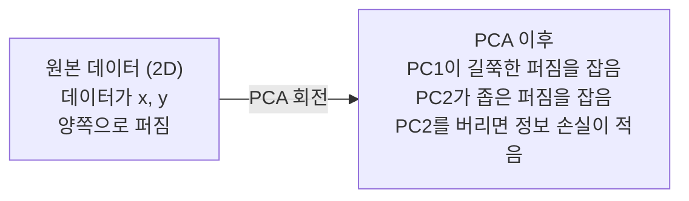

# 차원 축소 (Dimensionality Reduction)

> 고차원 데이터에는 구조가 있습니다. 올바른 각도에서 보면 찾을 수 있습니다.

**Type:** Build
**Language:** Python
**Prerequisites:** Phase 1, Lessons 01 (Linear Algebra Intuition), 02 (Vectors, Matrices & Operations), 03 (Eigenvalues & Eigenvectors), 06 (Probability & Distributions)
**Time:** ~90 minutes

## 학습 목표 (Learning Objectives)

- PCA를 처음부터 구현합니다: 데이터 중심화, 공분산 행렬 계산, 고유분해, 투영
- 설명된 분산 비율과 elbow method로 주성분 개수를 고릅니다
- MNIST 숫자를 2D로 시각화할 때 PCA, t-SNE, UMAP을 비교하고 트레이드오프를 설명합니다
- 표준 PCA가 다루지 못하는 비선형 데이터 구조를 분리하기 위해 RBF 커널 PCA를 적용합니다

## 문제 상황 (The Problem)

샘플당 784개 특성이 있는 데이터셋이 있습니다. 손글씨 숫자의 픽셀 값일 수도, 유전자 발현 수준일 수도, 사용자 행동 신호일 수도 있습니다. 784차원을 시각화할 수 없습니다. 그릴 수 없습니다. 심지어 생각할 수도 없습니다.

하지만 그 784개 특성의 대부분은 중복입니다. 실제 정보는 훨씬 작은 표면에 있습니다. 손글씨 "7"을 기술하는 데 784개의 독립 숫자가 필요하지 않습니다. 몇 개면 됩니다: 획의 각도, 가로획의 길이, 얼마나 기울었는지. 나머지는 노이즈입니다.

차원 축소는 그 더 작은 표면을 찾습니다. 784차원 데이터를 2, 10, 또는 50차원으로 압축하면서 중요한 구조를 유지합니다.

## 핵심 개념 (The Concept)

### 차원의 저주 (The curse of dimensionality)

고차원 공간은 직관에 반합니다. 차원이 커지면 세 가지가 깨집니다.

**거리가 무의미해집니다.** 고차원에서 임의의 두 점 사이 거리는 같은 값으로 수렴합니다. 모든 점이 다른 모든 점과 대략 같은 거리면 최근접 이웃 탐색이 작동을 멈춥니다.

```
Dimension    Avg distance ratio (max/min between random points)
2            ~5.0
10           ~1.8
100          ~1.2
1000         ~1.02
```

**부피가 모서리에 집중됩니다.** d차원 단위 초입방체는 2^d개 모서리를 가집니다. 100차원에서 거의 모든 부피가 중심에서 먼 모서리에 있습니다. 데이터 점이 가장자리로 퍼지고 모델은 내부에서 데이터에 굶주립니다.

**지수적으로 더 많은 데이터가 필요합니다.** 공간에서 같은 샘플 밀도를 유지하려면 2D에서 20D로 갈 때 데이터가 10^18배 더 필요합니다. 절대 충분치 않습니다. 차원을 줄이면 데이터 밀도가 다시 다룰 수 있는 수준이 됩니다.

### PCA: 중요한 방향 찾기 (find the directions that matter)

주성분 분석(PCA)은 데이터가 가장 많이 변하는 축을 찾습니다. 좌표계를 회전해 첫 축이 가장 많은 분산을 잡고, 둘째가 그다음, 이런 식입니다.

알고리즘:

```
1. Center the data        (subtract the mean from each feature)
2. Compute covariance     (how features move together)
3. Eigendecomposition     (find the principal directions)
4. Sort by eigenvalue     (biggest variance first)
5. Project               (keep top k eigenvectors, drop the rest)
```

왜 고유분해인가? 공분산 행렬은 대칭이고 양의 준정부호입니다. 고유벡터는 특성 공간의 직교 방향입니다. 고유값은 각 방향이 얼마나 많은 분산을 잡는지 알려줍니다. 가장 큰 고유값을 가진 고유벡터가 최대 분산 방향을 가리킵니다.



- **PCA 이전:** 데이터 구름이 x·y 축 양쪽에 대각선으로 퍼짐
- **PCA 이후:** 좌표계가 회전해 PC1이 최대 분산 방향(길쭉한 퍼짐)에, PC2가 최소 분산 방향(좁은 퍼짐)에 정렬
- **차원 축소:** PC2를 버리면 데이터를 PC1에 투영하며, 정보 손실이 매우 적음

### 설명된 분산 비율 (Explained variance ratio)

각 주성분은 총 분산의 일부를 잡습니다. 설명된 분산 비율이 얼마나인지 알려줍니다.

```
Component    Eigenvalue    Explained ratio    Cumulative
PC1          4.73          0.473              0.473
PC2          2.51          0.251              0.724
PC3          1.12          0.112              0.836
PC4          0.89          0.089              0.925
...
```

누적 설명 분산이 0.95에 도달하면, 그 개수의 성분이 정보의 95%를 잡음을 압니다. 그 이후는 대부분 노이즈입니다.

### 성분 개수 고르기 (Choosing the number of components)

세 전략:

1. **임계값.** 분산의 90-95%를 설명할 만큼 성분을 유지합니다.
2. **Elbow method.** 성분당 설명 분산을 그립니다. 급격한 하락을 찾습니다.
3. **하류 성능.** PCA를 전처리로 씁니다. k를 스윕하고 모델 정확도를 측정합니다. 정확도가 plateau하는 곳이 최선의 k입니다.

### t-SNE: 이웃 보존 (preserve neighborhoods)

t-Distributed Stochastic Neighbor Embedding(t-SNE)은 시각화용으로 설계되었습니다. 고차원 데이터를 2D(또는 3D)로 사상하면서 어떤 점이 서로 가까운지를 보존합니다.

직관: 원본 공간에서 거리에 기반해 점 쌍에 대한 확률 분포를 계산합니다. 가까운 점은 높은 확률. 먼 점은 낮은 확률. 그런 다음 같은 확률 분포가 성립하는 2D 배치를 찾습니다. 784차원에서 이웃이던 점이 2D에서도 이웃으로 남습니다.

t-SNE의 핵심 성질:
- 비선형. PCA가 못하는 복잡한 매니폴드를 펼 수 있습니다.
- 확률적. 실행마다 다른 레이아웃이 나옵니다.
- Perplexity 파라미터가 고려할 이웃 수를 제어합니다(전형적 범위: 5-50).
- 출력에서 클러스터 간 거리는 의미가 없습니다. 클러스터 자체만 의미가 있습니다.
- 큰 데이터셋에서 느립니다. 기본적으로 O(n^2).

### UMAP: 더 빠르고 더 나은 전역 구조 (faster, better global structure)

Uniform Manifold Approximation and Projection(UMAP)은 t-SNE와 비슷하게 작동하지만 두 가지 이점이 있습니다:
- 더 빠름. 모든 쌍별 거리를 계산하는 대신 근사 최근접 이웃 그래프를 사용합니다.
- 더 나은 전역 구조. 출력에서 클러스터의 상대 위치가 t-SNE보다 의미 있는 경향이 있습니다.

UMAP은 고차원 공간에서 가중 그래프("fuzzy topological representation")를 만든 뒤, 이 그래프를 가능한 한 잘 보존하는 저차원 레이아웃을 찾습니다.

핵심 파라미터:
- `n_neighbors`: 지역 구조를 정의하는 이웃 수(perplexity와 유사). 높을수록 전역 구조를 더 보존.
- `min_dist`: 출력에서 점이 얼마나 촘촘히 묶이는지. 낮을수록 더 밀집한 클러스터.

### 무엇을 언제 쓸지 (When to use which)

| Method | Use case | Preserves | Speed |
|--------|----------|-----------|-------|
| PCA | Preprocessing before training | Global variance | Fast (exact), works on millions of samples |
| PCA | Quick exploratory visualization | Linear structure | Fast |
| t-SNE | Publication-quality 2D plots | Local neighborhoods | Slow (< 10k samples ideal) |
| UMAP | 2D visualization at scale | Local + some global structure | Medium (handles millions) |
| PCA | Feature reduction for models | Variance-ranked features | Fast |
| t-SNE / UMAP | Understanding cluster structure | Cluster separation | Medium to slow |

경험 법칙: 전처리와 데이터 압축에는 PCA를 쓰세요. 2D에서 구조를 시각화해야 하면 t-SNE 또는 UMAP을 쓰세요.

### Kernel PCA

표준 PCA는 선형 부분공간을 찾습니다. 좌표계를 회전하고 축을 버립니다. 하지만 데이터가 비선형 매니폴드에 있으면? 2D의 원은 어떤 직선으로도 분리할 수 없습니다. 표준 PCA는 도움이 되지 않습니다.

Kernel PCA는 커널 함수가 유도하는 고차원 특성 공간에서 PCA를 적용하되, 그 공간의 좌표를 명시적으로 계산하지 않습니다. 이것이 커널 트릭입니다 -- SVM 뒤의 같은 아이디어.

알고리즘:
1. 커널 행렬 K를 계산, K_ij = k(x_i, x_j)
2. 특성 공간에서 커널 행렬을 중심화
3. 중심화된 커널 행렬을 고유분해
4. 상위 고유벡터(1/sqrt(eigenvalue)로 스케일)가 투영

흔한 커널 함수:

| Kernel | Formula | Good for |
|--------|---------|----------|
| RBF (Gaussian) | exp(-gamma * \|\|x - y\|\|^2) | Most nonlinear data, smooth manifolds |
| Polynomial | (x . y + c)^d | Polynomial relationships |
| Sigmoid | tanh(alpha * x . y + c) | Neural network-like mappings |

Kernel PCA vs 표준 PCA를 언제 쓸지:

| Criterion | Standard PCA | Kernel PCA |
|-----------|-------------|------------|
| Data structure | Linear subspace | Nonlinear manifold |
| Speed | O(min(n^2 d, d^2 n)) | O(n^2 d + n^3) |
| Interpretability | Components are linear combinations of features | Components lack direct feature interpretation |
| Scalability | Works on millions of samples | Kernel matrix is n x n, memory-limited |
| Reconstruction | Direct inverse transform | Requires pre-image approximation |

고전적 예: 2D의 동심원. 점의 두 고리, 하나가 다른 안에. 표준 PCA는 둘 다 같은 직선에 투영합니다 -- 분류에 쓸모없음. RBF 커널 PCA는 안쪽 원과 바깥 원을 다른 영역으로 사상해 선형 분리 가능하게 만듭니다.

### 재구성 오차 (Reconstruction Error)

차원 축소가 얼마나 좋은가? 784차원을 50으로 압축했습니다. 무엇을 잃었나요?

재구성 오차 측정:
1. 데이터를 k차원에 투영: X_reduced = X @ W_k
2. 재구성: X_hat = X_reduced @ W_k^T
3. MSE 계산: mean((X - X_hat)^2)

PCA에서 재구성 오차는 설명 분산과 깔끔한 관계가 있습니다:

```
Reconstruction error = sum of eigenvalues NOT included
Total variance = sum of ALL eigenvalues
Fraction lost = (sum of dropped eigenvalues) / (sum of all eigenvalues)
```

각 성분의 설명된 분산 비율:

```
explained_ratio_k = eigenvalue_k / sum(all eigenvalues)
```

성분 수에 대한 누적 설명 분산을 그리면 "elbow" 곡선을 얻습니다. 올바른 성분 수는 다음인 곳입니다:
- 곡선이 평평해짐(수익 체감)
- 누적 분산이 임계값(보통 0.90 또는 0.95)을 넘음
- 하류 과제 성능이 plateau

재구성 오차는 k를 고르는 것 이상에 유용합니다. 이상 탐지에 쓸 수 있습니다: 재구성 오차가 큰 샘플은 학습된 부분공간에 맞지 않는 이상치입니다. 이것이 프로덕션 시스템의 PCA 기반 이상 탐지의 기초입니다.

```figure
pca-axes
```

## 구현하기 (Build It)

### Step 1: PCA를 처음부터 (PCA from scratch)

```python
import numpy as np

class PCA:
    def __init__(self, n_components):
        self.n_components = n_components
        self.components = None
        self.mean = None
        self.eigenvalues = None
        self.explained_variance_ratio_ = None

    def fit(self, X):
        self.mean = np.mean(X, axis=0)
        X_centered = X - self.mean

        cov_matrix = np.cov(X_centered, rowvar=False)

        eigenvalues, eigenvectors = np.linalg.eigh(cov_matrix)

        sorted_idx = np.argsort(eigenvalues)[::-1]
        eigenvalues = eigenvalues[sorted_idx]
        eigenvectors = eigenvectors[:, sorted_idx]

        self.components = eigenvectors[:, :self.n_components].T
        self.eigenvalues = eigenvalues[:self.n_components]
        total_var = np.sum(eigenvalues)
        self.explained_variance_ratio_ = self.eigenvalues / total_var

        return self

    def transform(self, X):
        X_centered = X - self.mean
        return X_centered @ self.components.T

    def fit_transform(self, X):
        self.fit(X)
        return self.transform(X)
```

### Step 2: 합성 데이터로 테스트 (Test on synthetic data)

```python
np.random.seed(42)
n_samples = 500

t = np.random.uniform(0, 2 * np.pi, n_samples)
x1 = 3 * np.cos(t) + np.random.normal(0, 0.2, n_samples)
x2 = 3 * np.sin(t) + np.random.normal(0, 0.2, n_samples)
x3 = 0.5 * x1 + 0.3 * x2 + np.random.normal(0, 0.1, n_samples)

X_synthetic = np.column_stack([x1, x2, x3])

pca = PCA(n_components=2)
X_reduced = pca.fit_transform(X_synthetic)

print(f"Original shape: {X_synthetic.shape}")
print(f"Reduced shape:  {X_reduced.shape}")
print(f"Explained variance ratios: {pca.explained_variance_ratio_}")
print(f"Total variance captured: {sum(pca.explained_variance_ratio_):.4f}")
```

### Step 3: 2D의 MNIST 숫자 (MNIST digits in 2D)

```python
from sklearn.datasets import fetch_openml

mnist = fetch_openml("mnist_784", version=1, as_frame=False, parser="auto")
X_mnist = mnist.data[:5000].astype(float)
y_mnist = mnist.target[:5000].astype(int)

pca_mnist = PCA(n_components=50)
X_pca50 = pca_mnist.fit_transform(X_mnist)
print(f"50 components capture {sum(pca_mnist.explained_variance_ratio_):.2%} of variance")

pca_2d = PCA(n_components=2)
X_pca2d = pca_2d.fit_transform(X_mnist)
print(f"2 components capture {sum(pca_2d.explained_variance_ratio_):.2%} of variance")
```

### Step 4: sklearn과 비교 (Compare with sklearn)

```python
from sklearn.decomposition import PCA as SklearnPCA
from sklearn.manifold import TSNE

sklearn_pca = SklearnPCA(n_components=2)
X_sklearn_pca = sklearn_pca.fit_transform(X_mnist)

print(f"\nOur PCA explained variance:     {pca_2d.explained_variance_ratio_}")
print(f"Sklearn PCA explained variance: {sklearn_pca.explained_variance_ratio_}")

diff = np.abs(np.abs(X_pca2d) - np.abs(X_sklearn_pca))
print(f"Max absolute difference: {diff.max():.10f}")

tsne = TSNE(n_components=2, perplexity=30, random_state=42)
X_tsne = tsne.fit_transform(X_mnist)
print(f"\nt-SNE output shape: {X_tsne.shape}")
```

### Step 5: UMAP 비교 (UMAP comparison)

```python
try:
    from umap import UMAP

    reducer = UMAP(n_components=2, n_neighbors=15, min_dist=0.1, random_state=42)
    X_umap = reducer.fit_transform(X_mnist)
    print(f"UMAP output shape: {X_umap.shape}")
except ImportError:
    print("Install umap-learn: pip install umap-learn")
```

## 실용 활용 (Use It)

분류기 전 전처리로 PCA:

```python
from sklearn.decomposition import PCA as SklearnPCA
from sklearn.linear_model import LogisticRegression
from sklearn.model_selection import train_test_split
from sklearn.metrics import accuracy_score

X_train, X_test, y_train, y_test = train_test_split(
    X_mnist, y_mnist, test_size=0.2, random_state=42
)

results = {}
for k in [10, 30, 50, 100, 200]:
    pca_k = SklearnPCA(n_components=k)
    X_tr = pca_k.fit_transform(X_train)
    X_te = pca_k.transform(X_test)

    clf = LogisticRegression(max_iter=1000, random_state=42)
    clf.fit(X_tr, y_train)
    acc = accuracy_score(y_test, clf.predict(X_te))
    var_captured = sum(pca_k.explained_variance_ratio_)
    results[k] = (acc, var_captured)
    print(f"k={k:>3d}  accuracy={acc:.4f}  variance={var_captured:.4f}")
```

성능은 784차원보다 훨씬 전에 plateau합니다. 그 plateau가 운영 지점입니다.

## 배포할 산출물 (Ship It)

이 레슨이 만드는 것:
- `outputs/skill-dimensionality-reduction.md` - 주어진 과제에 맞는 차원 축소 기법을 고르는 스킬

## 연습 문제 (Exercises)

1. PCA 클래스가 `inverse_transform`을 지원하도록 수정하세요. 10, 50, 200개 성분에서 MNIST 숫자를 재구성하세요. 각 경우의 재구성 오차(원본과의 평균 제곱 차이)를 출력하세요.

2. 같은 MNIST 부분집합에 perplexity 5, 30, 100으로 t-SNE를 실행하세요. 출력이 어떻게 변하는지 설명하세요. Perplexity가 클러스터 밀도를 왜 바꾸나요?

3. 50개 특성 중 5개만 정보적인 데이터셋을 만드세요(`sklearn.datasets.make_classification`). PCA를 적용하고 설명 분산 곡선이 데이터가 실질적으로 5차원임을 올바르게 식별하는지 확인하세요.

## 핵심 용어 (Key Terms)

| 용어 (Term) | 흔히 하는 말 | 실제 의미 |
|------|----------------|----------------------|
| Curse of dimensionality | "특성이 너무 많음" | 차원이 커질수록 거리, 부피, 데이터 밀도가 모두 직관에 반하게 행동. 모델은 보상하려면 지수적으로 더 많은 데이터가 필요. |
| PCA | "차원 줄이기" | 좌표계를 회전해 축이 최대 분산 방향에 정렬되게 한 뒤, 저분산 축을 버림. |
| Principal component | "중요한 방향" | 공분산 행렬의 고유벡터. 데이터가 가장 많이 변하는 특성 공간의 방향. |
| Explained variance ratio | "이 성분이 가진 정보량" | 한 주성분이 잡는 총 분산의 비율. 상위 k개 비율을 합하면 k개 성분이 얼마나 보존하는지 알 수 있음. |
| Covariance matrix | "특성이 어떻게 상관되는지" | 항목 (i,j)가 특성 i와 j가 함께 움직이는 정도를 측정하는 대칭 행렬. 대각 항목은 개별 분산. |
| t-SNE | "그 클러스터 플롯" | 쌍별 이웃 확률을 보존해 고차원 데이터를 2D로 사상하는 비선형 방법. 시각화용, 전처리용이 아님. |
| UMAP | "더 빠른 t-SNE" | 위상 데이터 분석 기반의 비선형 방법. 지역과 일부 전역 구조를 보존. t-SNE보다 확장성이 좋음. |
| Perplexity | "t-SNE 노브" | 각 점이 고려하는 유효 이웃 수를 제어. 낮은 perplexity는 매우 지역적 구조에 초점. 높은 perplexity는 더 넓은 패턴을 잡음. |
| Manifold | "데이터가 사는 표면" | 고차원 공간에 임베드된 저차원 표면. 3D에서 구겨진 종이는 2D 매니폴드. |

## 더 읽을거리 (Further Reading)

- [A Tutorial on Principal Component Analysis](https://arxiv.org/abs/1404.1100) (Shlens) - PCA를 기초부터 명확히 유도
- [How to Use t-SNE Effectively](https://distill.pub/2016/misread-tsne/) (Wattenberg et al.) - t-SNE 함정과 파라미터 선택의 인터랙티브 가이드
- [UMAP documentation](https://umap-learn.readthedocs.io/) - UMAP 저자의 이론과 실무 가이드
