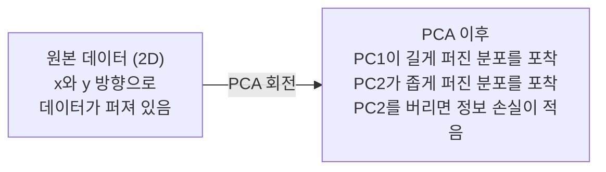

# 차원 축소

> 고차원 데이터에는 구조가 있습니다. 올바른 각도에서 바라보면 그 구조를 발견할 수 있습니다.

**유형:** Build
**언어:** Python
**선수 요건:** 1단계, 01강 (선형대수 직관), 02강 (벡터, 행렬 및 연산), 03강 (고유값 및 고유벡터), 06강 (확률 및 분포)
**시간:** 약 90분

## 학습 목표

- PCA를 처음부터 구현해 보세요: 데이터를 중심화하고, 공분산 행렬을 계산하며, 고유분해하고, 투영합니다.
- 설명된 분산 비율과 팔꿈치 방법을 사용하여 주성분 수를 선택해 보세요.
- MNIST 숫자를 2D로 시각화하기 위해 PCA, t-SNE, UMAP을 비교하고 각각의 장단점을 설명해 보세요.
- RBF 커널을 사용하여 표준 PCA가 처리할 수 없는 비선형 데이터 구조를 분리하는 커널 PCA를 적용해 보세요.

## 문제점

샘플당 784개의 특성을 가진 데이터셋이 있습니다. 손글씨 숫자의 픽셀 값일 수도 있고, 유전자 발현 수준일 수도 있으며, 사용자 행동 신호일 수도 있습니다. 784차원을 시각화할 수 없습니다. 플롯을 그릴 수도 없습니다. 심지어 생각하기도 어렵습니다.

하지만 이 784개의 특성 대부분은 중복됩니다. 실제 정보는 훨씬 더 작은 표면에 존재합니다. 손글씨 "7"을 설명하는 데는 784개의 독립적인 숫자가 필요하지 않습니다. 몇 개면 충분합니다: 획의 각도, 가로획의 길이, 기울어진 정도. 나머지는 잡음입니다.

차원 축소는 그 더 작은 표면을 찾아냅니다. 784차원 데이터를 중요한 구조를 유지하면서 2, 10, 또는 50차원으로 압축합니다.

## 개념

### 차원의 저주

고차원 공간은 직관적이지 않습니다. 차원이 증가하면 세 가지가 무너집니다.

**거리가 무의미해집니다.** 고차원에서는 임의의 두 점 사이의 거리가 동일한 값으로 수렴합니다. 모든 점이 다른 모든 점과 대략 같은 거리라면, 최근접 이웃 검색이 작동하지 않게 됩니다.

```
Dimension    Avg distance ratio (max/min between random points)
2            ~5.0
10           ~1.8
100          ~1.2
1000         ~1.02
```

**부피가 모서리에 집중됩니다.** d차원 단위 초입방체는 2^d개의 모서리를 가집니다. 100차원에서는 거의 모든 부피가 중심에서 멀리 떨어진 모서리에 존재합니다. 데이터 포인트가 가장자리로 퍼져 나가며, 모델은 내부 영역의 데이터를 갈구합니다.

**데이터가 지수적으로 더 많이 필요합니다.** 공간 내 샘플 밀도를 유지하려면, 2D에서 20D로 갈 때 데이터가 10^18배 더 필요합니다. 충분한 데이터를 가질 수 없습니다. 차원을 줄이면 데이터 밀도가 작업 가능한 수준으로 돌아옵니다.

### PCA: 중요한 방향을 찾기

주성분 분석 (PCA)(Principal Component Analysis (PCA))은 데이터가 가장 크게 변하는 축을 찾습니다. 좌표계를 회전시켜 첫 번째 축이 가장 큰 분산을 포착하고, 두 번째 축이 그 다음으로 큰 분산을 포착하도록 합니다.

알고리즘:

```
1. Center the data        (subtract the mean from each feature)
2. Compute covariance     (how features move together)
3. Eigendecomposition     (find the principal directions)
4. Sort by eigenvalue     (biggest variance first)
5. Project               (keep top k eigenvectors, drop the rest)
```

왜 고유분해(eigendecomposition)를 사용하나요? 공분산 행렬은 대칭이고 양의 준반 definiteness를 가집니다. 고유벡터는 특징 공간(feature space)에서 직교하는 방향입니다. 고유값은 각 방향이 포착하는 분산의 양을 알려줍니다. 가장 큰 고유값을 가진 고유벡터는 최대 분산의 방향을 가리킵니다.



- **PCA 전:** 데이터 클라우드가 x축과 y축을 따라 대각선으로 퍼져 있습니다
- **PCA 후:** 좌표계가 회전되어 PC1이 최대 분산 방향(길게 퍼진 분포)과 정렬되고, PC2가 최소 분산 방향(좁게 퍼진 분포)과 정렬됩니다
- **차원 축소:** PC2를 버리면 데이터를 PC1에 투영하며, 정보 손실이 매우 적습니다

### 설명된 분산 비율

각 주성분은 전체 분산의 일부 비율을 포착합니다. 설명된 분산 비율은 그 양을 알려줍니다.

```
Component    Eigenvalue    Explained ratio    Cumulative
PC1          4.73          0.473              0.473
PC2          2.51          0.251              0.724
PC3          1.12          0.112              0.836
PC4          0.89          0.089              0.925
...
```

누적 설명된 분산이 0.95에 도달하면, 많은 주성분이 정보의 95%를 포착한다는 것을 알 수 있습니다. 그 이후는 대부분 잡음입니다.

### 주성분 수 선택하기

세 가지 전략:

1. **임계값.** 분산의 90-95%를 설명할 만큼 충분한 주성분을 유지합니다.
2. **팔꿈치 방법.** 각 구성 요소의 설명된 분산을 플롯합니다. 급격한 감소 지점을 찾아 보세요.
3. **하류 성능.** PCA를 전처리 단계로 사용하세요. k 값을 스윕(sweep)하고 모델의 정확도를 측정합니다. 정확도가 평평해(plateau)되는 지점의 k가 최선입니다.

### t-SNE: 이웃 관계 보존

t-분포 확률적 이웃 임베딩(t-SNE)은 시각화를 위해 설계되었습니다. 고차원 데이터를 2D(또는 3D)로 매핑하면서 어떤 점들이 서로 가까운지 보존합니다.

직관: 원본 공간에서 점 쌍의 거리에 기반한 확률 분포를 계산합니다. 가까운 점들은 높은 확률을, 먼 점들은 낮은 확률을 가집니다. 그 후 동일한 확률 분포가 성립하는 2D 배치를 찾습니다. 784차원에서 이웃이었던 점들은 2D에서도 이웃으로 남습니다.

t-SNE의 주요 특성:
- 비선형입니다. PCA가 처리할 수 없는 복잡한 다양체를 펼칠 수 있습니다.
- 확률적입니다. 실행마다 다른 레이아웃이 생성됩니다.
- 퍼플렉시티 매개변수는 고려할 이웃의 수를 제어합니다(일반적인 범위: 5-50).
- 출력에서 클러스터 간 거리는 의미가 없습니다. 오직 클러스터 자체만 의미가 있습니다.
- 대규모 데이터셋에서는 느립니다. 기본값은 O(n^2)입니다.

### UMAP: 더 빠르고, 더 나은 전역 구조

균일 다양체 근사 및 투사(UMAP)는 t-SNE와 유사하게 작동하지만 두 가지 장점이 있습니다:
- 더 빠릅니다. 모든 쌍별 거리를 계산하는 대신 근사 최근접 이웃 그래프를 사용합니다.
- 더 나은 전역 구조. 출력에서 클러스터의 상대적 위치는 t-SNE보다 더 의미가 있는 경향이 있습니다.

UMAP는 고차원 공간에서 가중 그래프("퍼지 위상 표현")를 구축한 후, 이 그래프를 최대한 보존하는 저차원 레이아웃을 찾습니다.

주요 매개변수:
- `n_neighbors`: 지역 구조를 정의하는 이웃의 수(퍼플렉티와 유사). 값이 높을수록 더 많은 전역 구조가 보존됩니다.
- `min_dist`: 출력에서 점들이 얼마나 밀집되어 배치되는지. 값이 낮을수록 더 밀집된 클러스터가 생성됩니다.

### 언제 무엇을 사용해야 하는가

| 방법 | 사용 사례 | 보존 대상 | 속도 |
|--------|----------|-----------|-------|
| PCA | 학습 전 전처리 | 전역 분산 | 빠름 (정확), 수백만 샘플에서 작동 |
| PCA | 빠른 탐색적 시각화 | 선형 구조 | 빠름 |
| t-SNE | 출판 품질의 2D 플롯 | 지역적 근접성 | 느림 (1만 샘플 미만 권장) |
| UMAP | 대규모 2D 시각화 | 지역적 + 일부 전역적 구조 | 중간 (수백만 처리 가능) |
| PCA | 모델용 특징 감소 | 분순위에 따른 특징 | 빠름 |
| t-SNE / UMAP | 클러스터 구조 이해 | 클러스터 분리 | 중간~느림 |

경험칙: 전처리 및 데이터 압축에는 PCA를 사용하세요. 2D에서 구조를 시각화해야 할 때는 t-SNE나 UMAP을 사용하세요.

### 커널 PCA

표준 PCA는 선형 부분 공간을 찾습니다. 좌표계를 회전하고 축을 제거합니다. 하지만 데이터가 비선형 다양체(nonlinear manifold) 위에 있다면 어떻게 될까요? 2D의 원은 어떤 선으로도 분리할 수 없습니다. 표준 PCA는 도움이 되지 않습니다.

커널 PCA는 커널 함수가 유도하는 고차원 특징 공간에서 PCA를 적용하며, 그 공간의 좌표를 명시적으로 계산하지 않습니다. 이는 커널 트릭(kernel trick)으로, SVM의 기본 아이디어와 동일합니다.

알고리즘:
1. K_ij = k(x_i, x_j)인 커널 행렬 K를 계산합니다
2. 커널 행렬을 특징 공간에서 중심화합니다
3. 중심화된 커널 행렬의 고유분해를 수행합니다
4. 상위 고유벡터(고유값의 제곱근으로 나눈 값)가 투영이 됩니다

일반적인 커널 함수:

| 커널 | 공식 | 적합한 경우 |
|--------|---------|----------|
| RBF (가우시안) | exp(-gamma * \|\|x - y\|\|^2) | 대부분의 비선형 데이터, 매끄러운 다양체 |
| 다항식 | (x . y + c)^d | 다항식 관계 |
| 시그모이드 | tanh(alpha * x . y + c) | 신경망 유사 매핑 |

커널 PCA와 표준 PCA의 사용 시점:

| 기준 | 표준 PCA | 커널 PCA |
|-----------|-------------|------------|
| 데이터 구조 | 선형 부분 공간 | 비선형 다양체 |
| 속도 | O(min(n^2 d, d^2 n)) | O(n^2 d + n^3) |
| 해석 가능성 | 구성 요소는 특징의 선형 결합 | 구성 요소는 직접적인 특징 해석이 부족 |
| 확장성 | 수백만 개의 샘플에서 작동 | 커널 행렬이 n x n이며, 메모리 제한이 있음 |
| 재구성 | 직접 역변환 | 사전 이미지 근사(pre-image approximation)가 필요 |

클래식한 예시: 2D의 동심원입니다. 하나의 원이 다른 원 안에 있는 두 개의 점 링입니다. 표준 PCA는 두 원을 같은 선에 투영하므로 분류에 쓸모가 없습니다. RBF 커널을 사용한 커널 PCA는 안쪽 원과 바깥쪽 원을 서로 다른 영역에 매핑하여 선형 분리 가능하게 만듭니다.

### 재구성 오차

차원 축소가 얼마나 잘 작동하나요? 784개 차원을 50개로 압축했습니다. 무엇을 잃어버렸나요?

재구성 오차를 측정해 보세요:
1. 데이터를 k개 차원으로 투영합니다: X_reduced = X @ W_k
2. 재구성합니다: X_hat = X_reduced @ W_k^T
3. MSE를 계산합니다: mean((X - X_hat)^2)

PCA의 경우, 재구성 오차는 설명된 분산(explained variance)과 명확한 관계를 가집니다:

```
Reconstruction error = sum of eigenvalues NOT included
Total variance = sum of ALL eigenvalues
Fraction lost = (sum of dropped eigenvalues) / (sum of all eigenvalues)
```

각 구성 요소의 설명된 분산 비율은 다음과 같습니다:

```
explained_ratio_k = eigenvalue_k / sum(all eigenvalues)
```

누적 설명된 분산을 구성 요소 수에 대해 플롯하면 "팔꿈치(elbow)" 곡선을 얻을 수 있습니다. 적절한 구성 요소 수는 다음 조건을 만족하는 지점입니다:
- 곡선이 평평해짐 (수익 체감)
- 누적 분산이 임계값(보통 0.90 또는 0.95)을 넘김
- 하류(downstream) 작업 성능이 정체됨

재구성 오차는 k를 선택하는 것 외에도 유용합니다. 이상치 탐지에 사용할 수 있습니다: 재구성 오차가 높은 샘플은 학습된 부분 공간에 맞지 않는 이상치입니다. 이는 프로덕션 시스템에서 PCA 기반 이상치 탐지의 기초가 됩니다.

```figure
pca-axes
```

## 구현하기

### 1단계: PCA를 처음부터 구현

```python
import numpy as np

class PCA:
    def __init__(self, n_components):
        self.n_components = n_components
        self.components = None
        self.mean = None
        self.eigenvalues = None
        self.explained_variance_ratio_ = None

    def fit(self, X):
        self.mean = np.mean(X, axis=0)
        X_centered = X - self.mean

        cov_matrix = np.cov(X_centered, rowvar=False)

        eigenvalues, eigenvectors = np.linalg.eigh(cov_matrix)

        sorted_idx = np.argsort(eigenvalues)[::-1]
        eigenvalues = eigenvalues[sorted_idx]
        eigenvectors = eigenvectors[:, sorted_idx]

        self.components = eigenvectors[:, :self.n_components].T
        self.eigenvalues = eigenvalues[:self.n_components]
        total_var = np.sum(eigenvalues)
        self.explained_variance_ratio_ = self.eigenvalues / total_var

        return self

    def transform(self, X):
        X_centered = X - self.mean
        return X_centered @ self.components.T

    def fit_transform(self, X):
        self.fit(X)
        return self.transform(X)
```

### 2단계: 합성 데이터로 테스트

```python
np.random.seed(42)
n_samples = 500

t = np.random.uniform(0, 2 * np.pi, n_samples)
x1 = 3 * np.cos(t) + np.random.normal(0, 0.2, n_samples)
x2 = 3 * np.sin(t) + np.random.normal(0, 0.2, n_samples)
x3 = 0.5 * x1 + 0.3 * x2 + np.random.normal(0, 0.1, n_samples)

X_synthetic = np.column_stack([x1, x2, x3])

pca = PCA(n_components=2)
X_reduced = pca.fit_transform(X_synthetic)

print(f"Original shape: {X_synthetic.shape}")
print(f"Reduced shape:  {X_reduced.shape}")
print(f"Explained variance ratios: {pca.explained_variance_ratio_}")
print(f"Total variance captured: {sum(pca.explained_variance_ratio_):.4f}")
```

### 3단계: 2D의 MNIST 숫자

```python
from sklearn.datasets import fetch_openml

mnist = fetch_openml("mnist_784", version=1, as_frame=False, parser="auto")
X_mnist = mnist.data[:5000].astype(float)
y_mnist = mnist.target[:5000].astype(int)

pca_mnist = PCA(n_components=50)
X_pca50 = pca_mnist.fit_transform(X_mnist)
print(f"50 components capture {sum(pca_mnist.explained_variance_ratio_):.2%} of variance")

pca_2d = PCA(n_components=2)
X_pca2d = pca_2d.fit_transform(X_mnist)
print(f"2 components capture {sum(pca_2d.explained_variance_ratio_):.2%} of variance")
```

### 4단계: sklearn과 비교

```python
from sklearn.decomposition import PCA as SklearnPCA
from sklearn.manifold import TSNE

sklearn_pca = SklearnPCA(n_components=2)
X_sklearn_pca = sklearn_pca.fit_transform(X_mnist)

print(f"\nOur PCA explained variance:     {pca_2d.explained_variance_ratio_}")
print(f"Sklearn PCA explained variance: {sklearn_pca.explained_variance_ratio_}")

diff = np.abs(np.abs(X_pca2d) - np.abs(X_sklearn_pca))
print(f"Max absolute difference: {diff.max():.10f}")

tsne = TSNE(n_components=2, perplexity=30, random_state=42)
X_tsne = tsne.fit_transform(X_mnist)
print(f"\nt-SNE output shape: {X_tsne.shape}")
```

### 5단계: UMAP 비교

```python
try:
    from umap import UMAP

    reducer = UMAP(n_components=2, n_neighbors=15, min_dist=0.1, random_state=42)
    X_umap = reducer.fit_transform(X_mnist)
    print(f"UMAP output shape: {X_umap.shape}")
except ImportError:
    print("Install umap-learn: pip install umap-learn")
```

## 사용하기

분류기(classifier) 전의 전처리로서 PCA:

```python
from sklearn.decomposition import PCA as SklearnPCA
from sklearn.linear_model import LogisticRegression
from sklearn.model_selection import train_test_split
from sklearn.metrics import accuracy_score

X_train, X_test, y_train, y_test = train_test_split(
    X_mnist, y_mnist, test_size=0.2, random_state=42
)

results = {}
for k in [10, 30, 50, 100, 200]:
    pca_k = SklearnPCA(n_components=k)
    X_tr = pca_k.fit_transform(X_train)
    X_te = pca_k.transform(X_test)

    clf = LogisticRegression(max_iter=1000, random_state=42)
    clf.fit(X_tr, y_train)
    acc = accuracy_score(y_test, clf.predict(X_te))
    var_captured = sum(pca_k.explained_variance_ratio_)
    results[k] = (acc, var_captured)
    print(f"k={k:>3d}  accuracy={acc:.4f}  variance={var_captured:.4f}")
```

성능은 784개 차원보다 훨씬 전에 정체됩니다. 그 정체점이 운영 지점입니다.

## 출시하기

이 강의는 다음을 생성합니다:
- `outputs/skill-dimensionality-reduction.md` - 주어진 작업에 적합한 차원 축소 기법을 선택하는 스킬

## 연습 문제

1. PCA 클래스를 수정하여 `inverse_transform`을 지원하세요. 10, 50, 200개의 구성 요소로 MNIST 숫자를 재구성하세요. 각각의 재구성 오차(원본과의 평균 제곱 차이)를 출력하세요.

2. 동일한 MNIST 하위 집합에 대해 퍼플렉시티 값이 5, 30, 100인 t-SNE를 실행하세요. 출력 결과가 어떻게 변하는지 설명하세요. 퍼플렉시티가 클러스터 밀집도에 영향을 미치는 이유는 무엇인가요?

3. 50개의 특징 중 5개만 정보량이 있는 데이터셋을 사용하세요(`sklearn.datasets.make_classification`을 사용하여 생성하세요). PCA를 적용하여 설명된 분산 곡선이 데이터가 효과적으로 5차원임을 정확히 식별하는지 확인하세요.

## 핵심 용어

| 용어 | 사람들이 말하는 것 | 실제 의미 |
|------|----------------|----------------------|
| 차원의 저주(Curse of dimensionality) | "특징이 너무 많다" | 차원이 증가하면 거리, 부피, 데이터 밀도가 모두 직관적으로 예상치 못한 방식으로 거동합니다. 모델은 이를 보상하기 위해 지수적으로 더 많은 데이터를 필요로 합니다. |
| PCA | "차원을 줄인다" | 좌표계를 회전하여 축이 최대 분산 방향과 정렬되게 한 후, 낮은 분산을 가진 축을 제거합니다. |
| 주성분(Principal component) | "중요한 방향" | 공분산 행렬의 고유벡터입니다. 특징 공간에서 데이터가 가장 많이 변하는 방향입니다. |
| 설명된 분산 비율(Explained variance ratio) | "이 구성 요소가 얼마나 많은 정보를 가지는가" | 하나의 주성분이 포착한 전체 분산의 비율입니다. 상위 k개의 비율을 합산하여 k개의 구성 요소가 얼마나 많은 정보를 보존하는지 확인하세요. |
| 공분산 행렬(Covariance matrix) | "특징이 어떻게 상관되는가" | (i,j) 항목이 특징 i와 특징 j가 함께 움직이는 정도를 측정하는 대칭 행렬입니다. 대각 항목은 개별 분산입니다. |
| t-SNE | "그 클러스터 플롯" | 쌍별 이웃 확률을 보존하여 고차원 데이터를 2D로 매핑하는 비선형 방법입니다. 시각화에는 적합하지만 전처리에는 적합하지 않습니다. |
| UMAP | "더 빠른 t-SNE" | 위상 데이터 분석에 기반한 비선형 방법입니다. 지역 구조와 일부 전역 구조를 모두 보존합니다. t-SNE보다 확장성이 더 좋습니다. |
| 퍼플렉시티(Perplexity) | "t-SNE의 조절旋钮" | 각 점이 고려하는 이웃의 유효 개수를 제어합니다. 낮은 퍼플렉시티는 매우 지역적인 구조에 집중합니다. 높은 퍼플렉시티는 더 넓은 패턴을 포착합니다. |
| 매니폴드 | "데이터가 존재하는 표면" | 고차원 공간에 내장된 저차원 표면입니다. 3D 공간에서 구겨진 종이 한 장은 2D 매니폴드입니다. |

## 추가 읽기

- [A Tutorial on Principal Component Analysis](https://arxiv.org/abs/1404.1100) (Shlens) - PCA를 기초부터 명확하게 유도한 자료
- [How to Use t-SNE Effectively](https://distill.pub/2016/misread-tsne/) (Wattenberg et al.) - t-SNE의 함정과 파라미터 선택에 대한 인터랙티브 가이드
- [UMAP documentation](https://umap-learn.readthedocs.io/) - UMAP 저자들이 제공하는 이론 및 실용적 가이드
