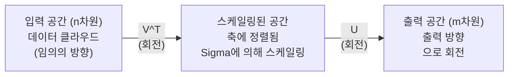
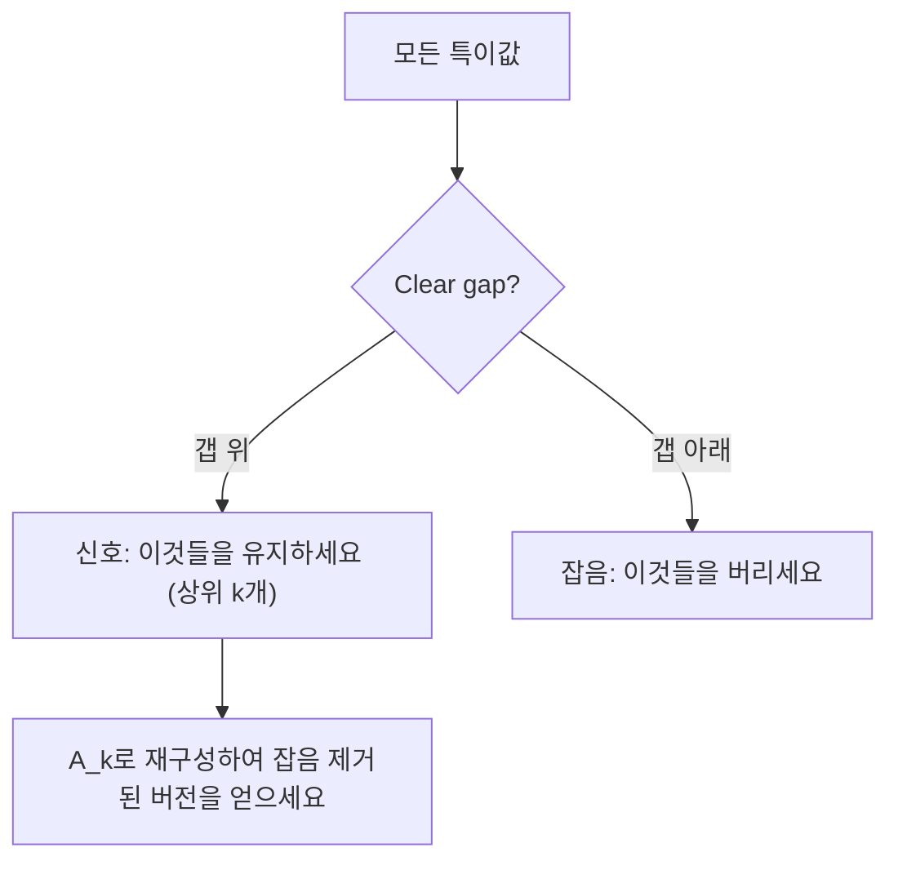

# Singular Value Decomposition

> SVD는 선형 대수의 만능 도구입니다. 모든 행렬은 SVD를 가지고 있으며, 모든 데이터 과학자에게는 SVD가 필요합니다.

**유형:** Build
**언어:** Python, Julia
**선수 요건:** 1단계, 01강 (선형 대수 직관), 02강 (벡터 및 행렬 연산), 03강 (행렬 변환)
**시간:** 약 120분

## 학습 목표

- 멱 반복(power iteration)을 통해 SVD를 구현하고, U, Sigma, V^T의 기하학적 의미를 설명해 보세요
- 이미지 압축을 위해 절단 SVD(truncated SVD)를 적용하고, 압축률과 재구성 오차를 측정해 보세요
- SVD를 통해 Moore-Penrose 유사역(pseudoinverse)을 계산하여 과잉 결정 least-squares 시스템을 풀어 보세요
- SVD를 PCA, 추천 시스템(latent factors), NLP의 Latent Semantic Analysis와 연결해 보세요

## 문제점

1000x2000 크기의 행렬이 있습니다. 사용자-영화 평점일 수도 있고, 문서-단어 빈도 표일 수도 있으며, 이미지의 픽셀 값일 수도 있습니다. 이 행렬을 압축하거나, 노이즈를 제거하거나, 숨겨진 구조를 찾거나, least-squares 시스템을 풀어야 합니다. 고유분해(eigendecomposition)는 정방 행렬에만 적용됩니다. 정방 행렬이라도 선형 독립적인 고유벡터의 완전한 집합이 필요합니다.

SVD는 모든 행렬에 적용됩니다. 어떤 모양이든, 어떤 랭크든, 조건이 없습니다. 행렬이 공간에 수행하는 기하학적 구조를 드러내는 세 가지 요소로 분해합니다. 선형 대수 전체에서 가장 일반적이고 가장 유용한 분해입니다.

## 개념

### SVD가 기하학적으로 수행하는 작업

모든 행렬은 모양에 관계없이 세 가지 연산을 순서대로 수행합니다: 회전, 스케일링, 회전. SVD는 이 분해를 명시적으로 만듭니다.

```
A = U * Sigma * V^T

      m x n     m x m    m x n    n x n
     (any)    (rotate)  (scale)  (rotate)
```

임의의 행렬 A가 주어지면, SVD는 이를 다음과 같이 분해합니다:
- V^T는 입력 공간(n차원)의 벡터를 회전시킵니다
- Sigma는 각 축을 따라 스케일링합니다 (늘리거나 줄임)
- U는 결과를 출력 공간(m차원)으로 회전시킵니다



이렇게 생각해 보세요. SVD에 행렬을 넘겨주면, SVD는 이렇게 알려줍니다: "이 행렬은 입력 구형을 먼저 V^T로 회전한 다음, Sigma로 타원체로 늘리고, 그 타원체를 U로 회전합니다." 특이값은 타원체 축의 길이입니다.

### 전체 분해

m x n 형태의 행렬 A의 경우:

```
A = U * Sigma * V^T

where:
  U     is m x m, orthogonal (U^T U = I)
  Sigma is m x n, diagonal (singular values on the diagonal)
  V     is n x n, orthogonal (V^T V = I)

The singular values sigma_1 >= sigma_2 >= ... >= sigma_r > 0
where r = rank(A)
```

U의 열은 좌 특이 벡터(left singular vectors)라고 불립니다. V의 열은 우 특이 벡터(right singular vectors)라고 불립니다. Sigma의 대각선 요소는 특이값(singular values)이라고 불립니다. 특이값은 항상 비음수이며, 관례적으로 내림차순으로 정렬됩니다.

### 좌 특이 벡터, 특이값, 우 특이 벡터

SVD의 각 구성 요소는 고유한 기하학적 의미를 가집니다.

**우 특이 벡터 (V의 열):** 이들은 입력 공간 (R^n)에 대한 정규 직교 기저를 형성합니다. 이들은 행렬이 출력 공간의 직교 방향으로 매핑하는 입력 공간의 방향입니다. 이를 정의역의 자연스러운 좌표계라고 생각해 보세요.

**특이값 (Sigma의 대각선):** 이들은 스케일링 인자입니다. i번째 특이값은 행렬이 i번째 우 특이 벡터를 따라 벡터를 얼마나 늘리는지 알려줍니다. 특이값이 0이라는 것은 행렬이 그 방향을 완전히 압축한다는 의미입니다.

**좌 특이 벡터 (U의 열):** 이들은 출력 공간 (R^m)에 대한 정규 직교 기저를 형성합니다. i번째 좌 특이 벡터는 i번째 우 특이 벡터가 (스케일링 후) 도달하는 출력 공간의 방향입니다.

이들 간의 관계:

```
A * v_i = sigma_i * u_i

The matrix A takes the i-th right singular vector v_i,
scales it by sigma_i, and maps it to the i-th left singular vector u_i.
```

이것은 모든 행렬이 하는 일을 좌표 단위로 그려줍니다.

### 외적 형태

SVD는 랭크 1 행렬의 합으로 작성할 수 있습니다:

```
A = sigma_1 * u_1 * v_1^T + sigma_2 * u_2 * v_2^T + ... + sigma_r * u_r * v_r^T

Each term sigma_i * u_i * v_i^T is a rank-1 matrix (an outer product).
The full matrix is the sum of r such matrices, where r is the rank.
```

이 형태는 저랭크 근사(low-rank approximation)의 기초입니다. 각 항은 하나의 구조층을 추가합니다. 첫 번째 항은 가장 중요한 패턴을 포착합니다. 두 번째 항은 그 다음으로 중요한 패턴을 포착합니다. 이런 식으로 이어집니다. 이 합을 잘라내면 주어진 랭크에서 가능한 최상의 근사를 얻을 수 있습니다.

```
Rank-1 approx:    A_1 = sigma_1 * u_1 * v_1^T
                  (captures the dominant pattern)

Rank-2 approx:    A_2 = sigma_1 * u_1 * v_1^T + sigma_2 * u_2 * v_2^T
                  (captures the two most important patterns)

Rank-k approx:    A_k = sum of top k terms
                  (optimal by the Eckart-Young theorem)
```

### 고유분해(eigendecomposition)와의 관계

SVD와 고유분해는 밀접하게 연결되어 있습니다. A의 특이값과 벡터는 A^T A와 A A^T의 고유값 및 고유벡터에서 직접 유래합니다.

```
A^T A = V * Sigma^T * U^T * U * Sigma * V^T
      = V * Sigma^T * Sigma * V^T
      = V * D * V^T

where D = Sigma^T * Sigma is a diagonal matrix with sigma_i^2 on the diagonal.

So:
- The right singular vectors (V) are eigenvectors of A^T A
- The singular values squared (sigma_i^2) are eigenvalues of A^T A

Similarly:
A A^T = U * Sigma * V^T * V * Sigma^T * U^T
      = U * Sigma * Sigma^T * U^T

So:
- The left singular vectors (U) are eigenvectors of A A^T
- The eigenvalues of A A^T are also sigma_i^2
```

이 연결은 세 가지를 알려줍니다:
1. 특이값은 항상 실수이며 음수가 아닙니다 (양반의 행렬의 고유값의 제곱근이기 때문입니다).
2. A^T A의 고유분해를 통해 SVD를 계산할 수 있지만, 이는 조건수를 제곱하여 수치적 정밀도를 손실하게 됩니다. 전용 SVD 알고리즘은 이를 피합니다.
3. A가 정방 행렬이고 대칭 양반일 경우, SVD와 고유분해는 동일한 것입니다.

### 절단 SVD: 저랭크 근사

Eckart-Young-Mirsky 정리에 따르면, A의 최적 랭크-k 근사 (Frobenius 노름과 스펙트럼 노름 모두에서)는 상위 k개의 특이값과 그에 대응하는 벡터만 유지함으로써 얻어집니다:

```
A_k = U_k * Sigma_k * V_k^T

where:
  U_k     is m x k  (first k columns of U)
  Sigma_k is k x k  (top-left k x k block of Sigma)
  V_k     is n x k  (first k columns of V)

Approximation error = sigma_{k+1}  (in spectral norm)
                    = sqrt(sigma_{k+1}^2 + ... + sigma_r^2)  (in Frobenius norm)
```

이것은 단순히 "좋은" 근사가 아닙니다. 랭크 k의 최선의 가능한 근사임이 증명되어 있습니다. A에 더 가까운 다른 랭크-k 행렬은 존재하지 않습니다.

| 구성 요소 | 상대적 크기 | 랭크-3 근사에 포함 여부 |
|-----------|-------------------|------------------------|
| sigma_1 | 가장 큼 | 예 |
| sigma_2 | 큼 | 예 |
| sigma_3 | 중간~큼 | 예 |
| sigma_4 | 중간 | 아니오 (오차) |
| sigma_5 | 중간~작음 | 아니오 (오차) |
| sigma_6 | 작음 | 아니오 (오차) |
| sigma_7 | 매우 작음 | 아니오 (오차) |
| sigma_8 | 극소 | 아니오 (오차) |

상위 3개를 유지: A_3는 세 개의 가장 큰 특이값을 포착합니다. 오차는 나머지 값들 (sigma_4부터 sigma_8까지)입니다.

특이값이 빠르게 감소하면, 작은 k가 행렬의 대부분을 포착합니다. 감소가 느리면, 행렬은 저랭크 구조를 가지지 않습니다.

### SVD를 이용한 이미지 압축

그레이스케일 이미지는 픽셀 강도의 행렬입니다. 800x600 이미지는 480,000개의 값을 가집니다. SVD를 사용하면 훨씬 적은 값으로 이를 근사할 수 있습니다.

```
Original image: 800 x 600 = 480,000 values

SVD with rank k:
  U_k:      800 x k values
  Sigma_k:  k values
  V_k:      600 x k values
  Total:    k * (800 + 600 + 1) = k * 1401 values

  k=10:   14,010 values   (2.9% of original)
  k=50:   70,050 values  (14.6% of original)
  k=100: 140,100 values  (29.2% of original)

  The compression ratio improves as k gets smaller,
  but visual quality degrades.
```

핵심 통찰: 자연 이미지에서는 특이값이 빠르게 감소합니다. 첫 몇 개의 특이값은 넓은 구조(형태, 기울기)를 포착합니다. 이후의 특이값은 세밀한 디테일과 잡음을 포착합니다. 랭크 50에서 절단하면 원본과 거의 동일한 이미지를 생성하면서 저장 공간을 85% 줄일 수 있습니다.

### 추천 시스템을 위한 SVD

Netflix Prize가 이 기법을 유명하게 만들었습니다. 사용자-영화 평점 행렬이 있으며, 대부분의 항목이 비어 있습니다.

```
             Movie1  Movie2  Movie3  Movie4  Movie5
  User1      [  5      ?       3       ?       1  ]
  User2      [  ?      4       ?       2       ?  ]
  User3      [  3      ?       5       ?       ?  ]
  User4      [  ?      ?       ?       4       3  ]

  ? = unknown rating
```

아이디어: 이 평점 행렬은 낮은 랭크를 가집니다. 사용자의 취향은 완전히 독립적이지 않습니다. 대부분의 선호도를 설명하는 몇 가지 잠재 요인(액션 대 드라마, 오래된 것 대 새로운 것, 지적인 것 대 본능적인 것)이 존재합니다.

(채워진) 평점 행렬에 SVD를 적용하면 다음과 같이 분해됩니다:
- U: 잠재 요인 공간에서의 사용자 프로필
- Sigma: 각 잠재 요인의 중요도
- V^T: 잠재 요인 공간에서의 영화 프로필

사용자의 영화에 대한 예측 평점은 사용자 프로필과 영화 프로필의 내적(특이값으로 가중치 적용)입니다. 낮은 랭크 근사화는 비어 있는 항목을 채워 넣습니다.

실제로는 결측 데이터를 직접 처리하는 Simon Funk의 점진적 SVD나 ALS(교대 최소 제곱) 변형 등을 사용합니다. 하지만 핵심 아이디어는 동일합니다: SVD를 통한 잠재 요인 분해.

### NLP에서의 SVD: 잠재 의미 분석

잠재 의미 분석(LSA), 잠재 의미 인덱싱(LSI)이라고도 불리는 기법은 용어-문서 행렬에 SVD를 적용합니다.

```
             Doc1   Doc2   Doc3   Doc4
  "cat"      [  3      0      1      0  ]
  "dog"      [  2      0      0      1  ]
  "fish"     [  0      4      1      0  ]
  "pet"      [  1      1      1      1  ]
  "ocean"    [  0      3      0      0  ]

After SVD with rank k=2:

  Each document becomes a point in 2D "concept space."
  Each term becomes a point in the same 2D space.
  Documents about similar topics cluster together.
  Terms with similar meanings cluster together.

  "cat" and "dog" end up near each other (land pets).
  "fish" and "ocean" end up near each other (water concepts).
  Doc1 and Doc3 cluster if they share similar topics.
```

LSA는 원시 텍스트에서 의미적 유사성을 포착하는 최초의 성공적인 방법 중 하나였습니다. 동의어인 용어들이 유사한 문서에 나타나는 경향이 있으므로, SVD가 이를 동일한 잠재 차원 그룹으로 묶기 때문에 작동합니다. 현대의 워드 임베딩(Word2Vec, GloVe)은 이 아이디어의 후손으로 볼 수 있습니다.

### 잡음 감소를 위한 SVD

잡음이 있는 데이터는 신호가 상위 특이값에 집중되어 있고, 잡음은 모든 특이값에 퍼져 있습니다. 절단하면 잡음 바닥을 제거합니다.

**깨끗한 신호 특이값:**

| 구성 요소 | 크기 | 유형 |
|-----------|-----------|------|
| sigma_1 | 매우 큼 | 신호 |
| sigma_2 | 큼 | 신호 |
| sigma_3 | 중간 | 신호 |
| sigma_4 | 거의 0 | 무시 가능 |
| sigma_5 | 거의 0 | 무시 가능 |

**잡음 신호의 특이값 (잡음이 모든 값에 더해짐):**

| 구성 요소 | 크기 | 유형 |
|-----------|-----------|------|
| sigma_1 | 매우 큼 | 신호 |
| sigma_2 | 큼 | 신호 |
| sigma_3 | 중간 | 신호 |
| sigma_4 | 작음 | 잡음 |
| sigma_5 | 작음 | 잡음 |
| sigma_6 | 작음 | 잡음 |
| sigma_7 | 작음 | 잡음 |



이 방법은 신호 처리, 과학적 측정 및 데이터 정리에 사용됩니다. 가산 잡음으로 오염된 행렬이 있을 때마다, 절단 SVD는 신호와 잡음을 분리하는 원리 있는 방법입니다.

### SVD를 통한 유사역행렬

무어-펜로즈 유사역행렬 A+는 행렬 역전을 비정방 및 특이 행렬로 일반화합니다. SVD는 이를 계산하는 것을 간단하게 만듭니다.

```
If A = U * Sigma * V^T, then:

A+ = V * Sigma+ * U^T

where Sigma+ is formed by:
  1. Transpose Sigma (swap rows and columns)
  2. Replace each non-zero diagonal entry sigma_i with 1/sigma_i
  3. Leave zeros as zeros

For A (m x n):      A+ is (n x m)
For Sigma (m x n):  Sigma+ is (n x m)
```

유사역행렬은 최소 제곱 문제를 해결합니다. Ax = b가 정확한 해를 가지지 않는 경우 (과결정 시스템), x = A+ b는 최소 제곱 해입니다 (||Ax - b||를 최소화).

```
Overdetermined system (more equations than unknowns):

  [1  1]         [3]
  [2  1] x   =   [5]       No exact solution exists.
  [3  1]         [6]

  x_ls = A+ b = V * Sigma+ * U^T * b

  This gives the x that minimizes the sum of squared residuals.
  Same result as the normal equations (A^T A)^(-1) A^T b,
  but numerically more stable.
```

### 수치적 안정성 장점

A^T A의 고유분해를 계산하면 특이값이 제곱됩니다 (A^T A의 고유값은 sigma_i^2입니다). 이는 조건수를 제곱하여 수치적 오차를 증폭시킵니다.

```
Example:
  A has singular values [1000, 1, 0.001]
  Condition number of A: 1000 / 0.001 = 10^6

  A^T A has eigenvalues [10^6, 1, 10^{-6}]
  Condition number of A^T A: 10^6 / 10^{-6} = 10^{12}

  Computing SVD directly: works with condition number 10^6
  Computing via A^T A:     works with condition number 10^{12}
                           (6 extra digits of precision lost)
```

현대 SVD 알고리즘 (Golub-Kahan 쌍대각화)은 A^T A를 형성하지 않고 A에 직접 작동합니다. 이것이 `np.linalg.svd(A)`보다 `np.linalg.eig(A.T @ A)`을 항상 선호해야 하는 이유입니다.

### PCA와의 연결

PCA는 중심화된 데이터에 대한 SVD입니다. 이는 비유가 아닙니다. 문자 그대로 동일한 계산입니다.

```
Given data matrix X (n_samples x n_features), centered (mean subtracted):

Covariance matrix: C = (1/(n-1)) * X^T X

PCA finds eigenvectors of C. But:

  X = U * Sigma * V^T    (SVD of X)

  X^T X = V * Sigma^2 * V^T

  C = (1/(n-1)) * V * Sigma^2 * V^T

So the principal components are exactly the right singular vectors V.
The explained variance for each component is sigma_i^2 / (n-1).

In sklearn, PCA is implemented using SVD, not eigendecomposition.
It is faster and more numerically stable.
```

이것은 10강에서 차원 축소 대해 배운 모든 것이 내부적으로 SVD라는 것을 의미합니다. PCA는 머신러닝에서 SVD의 가장 일반적인 적용입니다.

```figure
svd-rank-reconstruction
```

## 구현하기

### 1단계: 파워 반복을 사용하여 처음부터 SVD 구현

아이디어: 가장 큰 특이값과 그 벡터를 찾기 위해 A^T A (또는 A A^T)에 대해幂 반복(power iteration)을 사용합니다. 그런 다음 행렬을 축소(deflate)하고 다음 특이값에 대해 반복합니다.

```python
import numpy as np

def power_iteration(M, num_iters=100):
    n = M.shape[1]
    v = np.random.randn(n)
    v = v / np.linalg.norm(v)

    for _ in range(num_iters):
        Mv = M @ v
        v = Mv / np.linalg.norm(Mv)

    eigenvalue = v @ M @ v
    return eigenvalue, v

def svd_from_scratch(A, k=None):
    m, n = A.shape
    if k is None:
        k = min(m, n)

    sigmas = []
    us = []
    vs = []

    A_residual = A.copy().astype(float)

    for _ in range(k):
        AtA = A_residual.T @ A_residual
        eigenvalue, v = power_iteration(AtA, num_iters=200)

        if eigenvalue < 1e-10:
            break

        sigma = np.sqrt(eigenvalue)
        u = A_residual @ v / sigma

        sigmas.append(sigma)
        us.append(u)
        vs.append(v)

        A_residual = A_residual - sigma * np.outer(u, v)

    U = np.column_stack(us) if us else np.empty((m, 0))
    S = np.array(sigmas)
    V = np.column_stack(vs) if vs else np.empty((n, 0))

    return U, S, V
```

### 2단계: NumPy와 비교 테스트

```python
np.random.seed(42)
A = np.random.randn(5, 4)

U_ours, S_ours, V_ours = svd_from_scratch(A)
U_np, S_np, Vt_np = np.linalg.svd(A, full_matrices=False)

print("Our singular values:", np.round(S_ours, 4))
print("NumPy singular values:", np.round(S_np, 4))

A_reconstructed = U_ours @ np.diag(S_ours) @ V_ours.T
print(f"Reconstruction error: {np.linalg.norm(A - A_reconstructed):.8f}")
```

### 3단계: 이미지 압축 데모

```python
def compress_image_svd(image_matrix, k):
    U, S, Vt = np.linalg.svd(image_matrix, full_matrices=False)
    compressed = U[:, :k] @ np.diag(S[:k]) @ Vt[:k, :]
    return compressed

image = np.random.seed(42)
rows, cols = 200, 300
image = np.random.randn(rows, cols)

for k in [1, 5, 10, 20, 50]:
    compressed = compress_image_svd(image, k)
    error = np.linalg.norm(image - compressed) / np.linalg.norm(image)
    original_size = rows * cols
    compressed_size = k * (rows + cols + 1)
    ratio = compressed_size / original_size
    print(f"k={k:>3d}  error={error:.4f}  storage={ratio:.1%}")
```

### 4단계: 잡음 감소

```python
np.random.seed(42)
clean = np.outer(np.sin(np.linspace(0, 4*np.pi, 100)),
                 np.cos(np.linspace(0, 2*np.pi, 80)))
noise = 0.3 * np.random.randn(100, 80)
noisy = clean + noise

U, S, Vt = np.linalg.svd(noisy, full_matrices=False)
denoised = U[:, :5] @ np.diag(S[:5]) @ Vt[:5, :]

print(f"Noisy error:    {np.linalg.norm(noisy - clean):.4f}")
print(f"Denoised error: {np.linalg.norm(denoised - clean):.4f}")
print(f"Improvement:    {(1 - np.linalg.norm(denoised - clean) / np.linalg.norm(noisy - clean)):.1%}")
```

### 5단계: 유사역행렬(Pseudoinverse)

```python
A = np.array([[1, 1], [2, 1], [3, 1]], dtype=float)
b = np.array([3, 5, 6], dtype=float)

U, S, Vt = np.linalg.svd(A, full_matrices=False)
S_inv = np.diag(1.0 / S)
A_pinv = Vt.T @ S_inv @ U.T

x_svd = A_pinv @ b
x_lstsq = np.linalg.lstsq(A, b, rcond=None)[0]
x_pinv = np.linalg.pinv(A) @ b

print(f"SVD pseudoinverse solution:  {x_svd}")
print(f"np.linalg.lstsq solution:   {x_lstsq}")
print(f"np.linalg.pinv solution:    {x_pinv}")
```

## 사용하기

완전한 작동 데모는 `code/svd.py`에 있습니다. 실행하여 이미지 압축, 추천 시스템, 잠재 의미 분석, 잡음 감소에 SVD가 적용되는 것을 확인해 보세요.

```bash
python svd.py
```

Julia 버전은 `code/svd.jl`에서 Julia의 기본 `svd()` 함수와 `LinearAlgebra` 패키지를 사용하여 동일한 개념을 시연합니다.

```bash
julia svd.jl
```

## 출시하기

이 강의는 다음을 생성합니다:
- `outputs/skill-svd.md` - 실제 프로젝트에서 SVD를 언제, 어떻게 적용해야 하는지 아는 스킬

## 연습 문제

1. 幂 반복(power iteration)을 사용하지 않고 SVD를 처음부터 구현하세요. 대신 A^T A의 고유분해(eigendecomposition)를 계산하여 V와 특이값을 얻고, U = A V Sigma^{-1}을 계산하세요.幂 반복 버전 및 NumPy와 수치적 정확도를 비교하세요.

2. 실제 그레이스케일 이미지를 로드(또는 그레이스케일로 변환)하세요. 랭크 1, 5, 10, 25, 50, 100에서 압축하세요. 각 랭크에 대해 압축 비율과 상대 오차를 계산하세요. 이미지가 시각적으로 허용 가능한 수준이 되는 랭크를 찾으세요.

3. 작은 추천 시스템을 구축하세요. 일부 알려진 항목이 포함된 10x8 사용자-영화 평점 행렬을 만드세요. 누락된 항목은 행 평균으로 채우세요. SVD를 계산하고 랭크 3 근사치를 재구성하세요. 재구성된 행렬을 사용하여 누락된 평점을 예측하세요. 예측이 합리적인지 확인하세요.

4. 3개의 합성 주제를 가진 100x50 문서-용어 행렬을 만드세요. 각 주제에는 5개의 관련 용어가 있습니다. 잡음을 추가하세요. SVD를 적용하고 상위 3개의 특이값이 나머지보다 훨씬 큰지 확인하세요. 문서를 3D 잠재 공간에 투영하고 같은 주제의 문서들이 함께 군집(cluster)되는지 확인하세요.

5. 깨끗한 저랭크 행렬(랭크 3, 크기 50x40)을 생성하고 다양한 수준(sigma = 0.1, 0.5, 1.0, 2.0)의 가우시안 잡음을 추가하세요. 각 잡음 수준에 대해 k를 1부터 40까지 스윕(sweep)하며 깨끗한 행렬에 대한 재구성 오차를 측정하여 최적의 절단 랭크를 찾으세요. 잡음 수준에 따라 최적의 k가 어떻게 변하는지 플롯하세요.

## 핵심 용어

| 용어 | 사람들이 말하는 것 | 실제 의미 |
|------|----------------|----------------------|
| SVD | "임의의 행렬을 분해" | A를 U Sigma V^T로 분해합니다. 여기서 U와 V는 직교 행렬이며, Sigma는 비음수 항목을 가진 대각 행렬입니다. 모든 크기의 모든 행렬에 대해 작동합니다. |
| 특이값 (Singular value) | "이 성분이 얼마나 중요한지" | Sigma의 i번째 대각 항목입니다. 행렬이 i번째 주 방향을 따라 얼마나 확장하는지 측정합니다. 항상 비음수이며, 내림차순으로 정렬됩니다. |
| 좌 특이 벡터 (Left singular vector) | "출력 방향" | U의 열입니다. i번째 우 특이 벡터가 (sigma_i로 스케일링된 후) 매핑되는 출력 공간의 방향입니다. |
| 우 특이 벡터 (Right singular vector) | "입력 방향" | V의 열입니다. 행렬이 (sigma_i로 스케일링된 후) i번째 좌 특이 벡터로 매핑하는 입력 공간의 방향입니다. |
| 절단 SVD (Truncated SVD) | "저랭크 근사" | 상위 k개의 특이값과 해당 벡터만 유지합니다. 원본 행렬에 대해 증명 가능한 최적의 랭크-k 근사를 생성합니다 (Eckart-Young 정리). |
| 랭크 (Rank) | "진짜 차원 수" | 비영 특이값의 개수입니다. 행렬이 실제로 사용하는 독립적인 방향의 수를 알려줍니다. |
| 유사역행렬 (Pseudoinverse) | "일반화된 역행렬" | V Sigma+ U^T. 비영 특이값은 역으로 계산하고, 영 특이값은 영으로 유지합니다. 비정방 행렬이나 특이 행렬에 대한 최소제곱 문제를 해결합니다. |
| 조건수 (Condition number) | "오류에 얼마나 민감한지" | sigma_max / sigma_min. 큰 조건수는 작은 입력 변화가 큰 출력 변화를 일으킨다는 의미입니다. SVD는 이를 직접적으로 드러냅니다. |
| 잠재 요인 (Latent factor) | "숨겨진 변수" | SVD가 발견한 저랭크 공간의 차원입니다. 추천 시스템에서는 잠재 요인이 장르 선호도에 해당할 수 있습니다. NLP에서는 주제(topic)에 해당할 수 있습니다. |
| 프로베니우스 노름 (Frobenius norm) | "행렬의 전체 크기" | 제곱된 항목들의 합에 대한 제곱근입니다. 제곱된 특이값들의 합에 대한 제곱근과 같습니다. 근사 오차를 측정하는 데 사용됩니다. |
| Eckart-Young 정리 | "SVD가 최상의 압축을 제공" | 임의의 목표 랭크 k에 대해, 절단 SVD는 모든 가능한 랭크-k 행렬 중 근사 오차를 최소화합니다. |
| 거듭제곱 반복법 | "가장 큰 고유벡터를 찾기" | 랜덤 벡터에 행렬을 반복적으로 곱하고 정규화합니다. 가장 큰 고유값을 가진 고유벡터로 수렴합니다. 많은 SVD 알고리즘의 구성 요소입니다. |

## 추가 읽기

- [Gilbert Strang: Linear Algebra and Its Applications, Chapter 7](https://math.mit.edu/~gs/linearalgebra/) - SVD의 상세한 설명 및 응용
- [3Blue1Brown: But what is the SVD?](https://www.youtube.com/watch?v=vSczTbgc8Rc) - SVD의 기하학적 직관
- [We Recommend a Singular Value Decomposition](https://www.ams.org/publicoutreach/feature-column/fcarc-svd) - 미국수학회의 접근하기 쉬운 개요
- [Netflix Prize and Matrix Factorization](https://sifter.org/~simon/journal/20061211.html) - 추천 시스템에서의 SVD에 대한 Simon Funk의 원본 블로그 게시물
- [Latent Semantic Analysis](https://en.wikipedia.org/wiki/Latent_semantic_analysis) - SVD의 원본 NLP 응용
- [Numerical Linear Algebra by Trefethen and Bau](https://people.maths.ox.ac.uk/trefethen/text.html) - SVD 알고리즘 및 수치적 특성을 이해하기 위한 표준 자료
