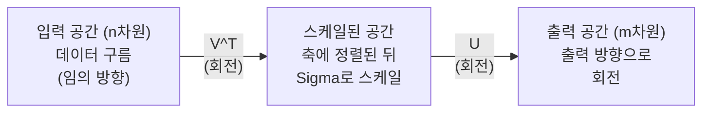
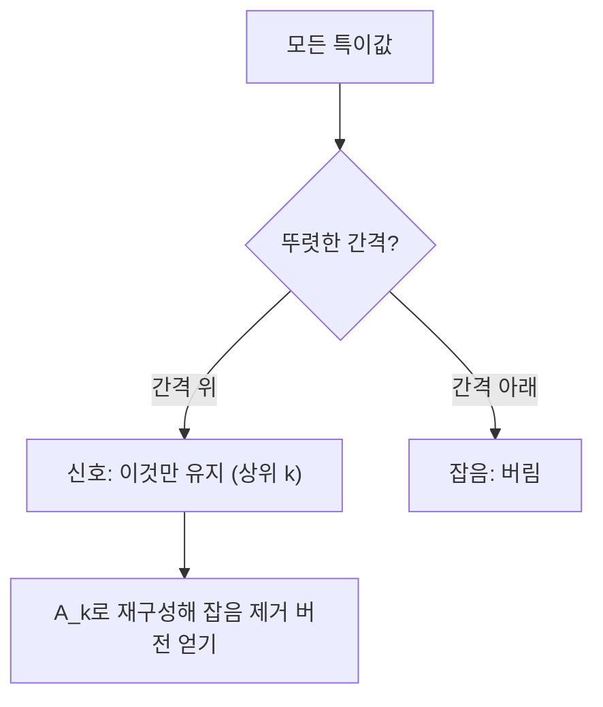

# 특이값 분해 (Singular Value Decomposition)

> SVD는 선형대수의 만능 도구입니다. 모든 행렬에 SVD가 있고, 모든 데이터 과학자에게 SVD가 필요합니다.

**Type:** Build
**Languages:** Python, Julia
**Prerequisites:** Phase 1, Lessons 01 (Linear Algebra Intuition), 02 (Vectors & Matrices Operations), 03 (Matrix Transformations)
**Time:** ~120 minutes

## 학습 목표 (Learning Objectives)

- 거듭제곱 반복법으로 SVD를 구현하고 U, Sigma, V^T의 기하학적 의미를 설명합니다
- 절단 SVD로 이미지를 압축하고 압축률 대비 재구성 오차를 측정합니다
- SVD로 무어-펜로즈 의사역행렬을 구해 과결정 최소제곱 문제를 풉니다
- SVD를 PCA, 추천 시스템(잠재 요인), NLP의 잠재 의미 분석과 연결합니다

## 문제 상황 (The Problem)

1000x2000 행렬이 있습니다. 사용자-영화 평점일 수도, 문서-용어 빈도표일 수도, 이미지 픽셀 값일 수도 있습니다. 압축하거나, 잡음을 제거하거나, 숨은 구조를 찾거나, 최소제곱 문제를 풀어야 합니다. 고유값 분해는 정사각 행렬에만 됩니다. 그마저도 선형독립인 고유벡터 집합이 충분해야 합니다.

SVD는 어떤 행렬에도 됩니다. 모양과 랭크에 제한이 없고, 조건도 없습니다. 행렬을 세 요인으로 분해해 그 행렬이 공간에 하는 일을 기하학적으로 드러냅니다. 선형대수에서 가장 일반적이고 가장 유용한 인수분해입니다.

## 핵심 개념 (The Concept)

### SVD가 기하학적으로 하는 일

모양이 어떻든 모든 행렬은 회전, 스케일, 회전을 순서대로 수행합니다. SVD는 이 분해를 명시합니다.

```
A = U * Sigma * V^T

      m x n     m x m    m x n    n x n
     (any)    (rotate)  (scale)  (rotate)
```

임의의 행렬 A에 대해 SVD는 다음으로 인수분해합니다.
- V^T는 입력 공간(n차원)의 벡터를 회전합니다
- Sigma는 각 축을 따라 스케일합니다(늘리거나 줄임)
- U는 결과를 출력 공간(m차원)으로 회전합니다



이렇게 생각하세요. SVD에 행렬을 넘기면 "이 행렬은 입력의 구를 먼저 V^T로 돌리고, Sigma로 타원에 늘린 뒤, U로 그 타원을 다시 돌린다"고 알려 줍니다. 특이값은 그 타원 축의 길이입니다.

### 전체 분해

모양이 m x n인 행렬 A에 대해:

```
A = U * Sigma * V^T

where:
  U     is m x m, orthogonal (U^T U = I)
  Sigma is m x n, diagonal (singular values on the diagonal)
  V     is n x n, orthogonal (V^T V = I)

The singular values sigma_1 >= sigma_2 >= ... >= sigma_r > 0
where r = rank(A)
```

U의 열을 왼쪽 특이벡터, V의 열을 오른쪽 특이벡터, Sigma의 대각 성분을 특이값이라 합니다. 특이값은 항상 비음수이며 관례상 내림차순으로 정렬합니다.

### 왼쪽 특이벡터, 특이값, 오른쪽 특이벡터

SVD의 각 성분은 서로 다른 기하학적 의미를 가집니다.

**오른쪽 특이벡터 (V의 열):** 입력 공간(R^n)의 정규직교 기저입니다. 행렬이 출력 공간의 직교 방향으로 보내는 입력 방향입니다. 정의역의 자연 좌표계로 생각하면 됩니다.

**특이값 (Sigma의 대각):** 스케일 인자입니다. i번째 특이값은 i번째 오른쪽 특이벡터 방향으로 행렬이 벡터를 얼마나 늘리는지 알려 줍니다. 특이값이 0이면 그 방향을 완전히 뭉갭니다.

**왼쪽 특이벡터 (U의 열):** 출력 공간(R^m)의 정규직교 기저입니다. i번째 왼쪽 특이벡터는 (스케일 후) i번째 오른쪽 특이벡터가 도착하는 출력 방향입니다.

이들 사이의 관계:

```
A * v_i = sigma_i * u_i

The matrix A takes the i-th right singular vector v_i,
scales it by sigma_i, and maps it to the i-th left singular vector u_i.
```

이렇게 하면 임의의 행렬이 하는 일을 좌표별로 볼 수 있습니다.

### 외적 형태

SVD는 랭크-1 행렬의 합으로 쓸 수 있습니다.

```
A = sigma_1 * u_1 * v_1^T + sigma_2 * u_2 * v_2^T + ... + sigma_r * u_r * v_r^T

Each term sigma_i * u_i * v_i^T is a rank-1 matrix (an outer product).
The full matrix is the sum of r such matrices, where r is the rank.
```

이 형태가 저랭크 근사의 기초입니다. 각 항이 구조의 한 층을 더합니다. 첫 항이 가장 중요한 패턴을 잡고, 둘째가 그다음을 잡습니다. 이 합을 자르면 주어진 랭크에서 가능한 최선의 근사가 됩니다.

```
Rank-1 approx:    A_1 = sigma_1 * u_1 * v_1^T
                  (captures the dominant pattern)

Rank-2 approx:    A_2 = sigma_1 * u_1 * v_1^T + sigma_2 * u_2 * v_2^T
                  (captures the two most important patterns)

Rank-k approx:    A_k = sum of top k terms
                  (optimal by the Eckart-Young theorem)
```

### 고유값 분해와의 관계

SVD와 고유값 분해는 깊게 연결됩니다. A의 특이값과 특이벡터는 A^T A와 A A^T의 고유값·고유벡터에서 바로 나옵니다.

```
A^T A = V * Sigma^T * U^T * U * Sigma * V^T
      = V * Sigma^T * Sigma * V^T
      = V * D * V^T

where D = Sigma^T * Sigma is a diagonal matrix with sigma_i^2 on the diagonal.

So:
- The right singular vectors (V) are eigenvectors of A^T A
- The singular values squared (sigma_i^2) are eigenvalues of A^T A

Similarly:
A A^T = U * Sigma * V^T * V * Sigma^T * U^T
      = U * Sigma * Sigma^T * U^T

So:
- The left singular vectors (U) are eigenvectors of A A^T
- The eigenvalues of A A^T are also sigma_i^2
```

이 연결이 알려 주는 세 가지:
1. 특이값은 항상 실수이고 비음수입니다(양의 준정부호 행렬 고유값의 제곱근).
2. A^T A의 고유값 분해로 SVD를 구할 수는 있지만, 조건수를 제곱해 수치 정밀도를 잃습니다. 전용 SVD 알고리즘은 이를 피합니다.
3. A가 정사각이고 대칭 양의 준정부호이면 SVD와 고유값 분해는 같습니다.

### 절단 SVD: 저랭크 근사

Eckart-Young-Mirsky 정리에 따르면 A에 대한 최선의 랭크-k 근사(프로베니우스·스펙트럴 노름 모두)는 상위 k개 특이값과 해당 벡터만 남기는 것입니다.

```
A_k = U_k * Sigma_k * V_k^T

where:
  U_k     is m x k  (first k columns of U)
  Sigma_k is k x k  (top-left k x k block of Sigma)
  V_k     is n x k  (first k columns of V)

Approximation error = sigma_{k+1}  (in spectral norm)
                    = sqrt(sigma_{k+1}^2 + ... + sigma_r^2)  (in Frobenius norm)
```

그냥 "괜찮은" 근사가 아닙니다. 랭크 k에서 증명 가능하게 최선입니다. 다른 어떤 랭크-k 행렬도 A에 더 가깝지 않습니다.

| Component | Relative magnitude | Kept in rank-3 approx? |
|-----------|-------------------|------------------------|
| sigma_1 | Largest | Yes |
| sigma_2 | Large | Yes |
| sigma_3 | Medium-large | Yes |
| sigma_4 | Medium | No (error) |
| sigma_5 | Medium-small | No (error) |
| sigma_6 | Small | No (error) |
| sigma_7 | Very small | No (error) |
| sigma_8 | Tiny | No (error) |

상위 3개만 남기면: A_3는 가장 큰 세 특이값을 잡고, 오차는 나머지(sigma_4부터 sigma_8)입니다.

특이값이 빨리 줄면 작은 k로 행렬의 대부분을 잡습니다. 천천히 줄면 저랭크 구조가 없습니다.

### SVD로 이미지 압축

그레이스케일 이미지는 픽셀 강도 행렬입니다. 800x600 이미지는 480,000개 값입니다. SVD로 훨씬 적은 수로 근사할 수 있습니다.

```
Original image: 800 x 600 = 480,000 values

SVD with rank k:
  U_k:      800 x k values
  Sigma_k:  k values
  V_k:      600 x k values
  Total:    k * (800 + 600 + 1) = k * 1401 values

  k=10:   14,010 values   (2.9% of original)
  k=50:   70,050 values  (14.6% of original)
  k=100: 140,100 values  (29.2% of original)

  The compression ratio improves as k gets smaller,
  but visual quality degrades.
```

핵심 통찰: 자연 이미지는 특이값이 빠르게 감소합니다. 처음 몇 개가 큰 구조(형태, 그라데이션)를 잡고, 나중은 세부와 잡음을 잡습니다. 랭크 50에서 자르면 원본과 거의 같아 보이면서 저장 공간을 약 85% 줄이는 경우가 많습니다.

### 추천 시스템을 위한 SVD

Netflix Prize로 유명해졌습니다. 사용자-영화 평점 행렬이 있고 대부분 항목이 비어 있습니다.

```
             Movie1  Movie2  Movie3  Movie4  Movie5
  User1      [  5      ?       3       ?       1  ]
  User2      [  ?      4       ?       2       ?  ]
  User3      [  3      ?       5       ?       ?  ]
  User4      [  ?      ?       ?       4       3  ]

  ? = unknown rating
```

아이디어: 이 평점 행렬은 저랭크입니다. 사용자 취향이 완전히 독립이지 않습니다. 액션 vs 드라마, 옛날 vs 최신, 지적 vs 감각 같은 소수의 잠재 요인이 선호를 대부분 설명합니다.

(채워 넣은) 평점 행렬에 SVD를 하면:
- U: 잠재 요인 공간의 사용자 프로필
- Sigma: 각 잠재 요인의 중요도
- V^T: 잠재 요인 공간의 영화 프로필

사용자 예측 평점은 사용자 프로필과 영화 프로필의 내적(특이값으로 가중)입니다. 저랭크 근사가 빈 칸을 채웁니다.

실무에서는 결측을 직접 다루는 Simon Funk의 증분 SVD나 ALS(교대 최소제곱) 변형을 씁니다. 핵심 아이디어는 같습니다: SVD를 통한 잠재 요인 분해.

### NLP에서의 SVD: 잠재 의미 분석

잠재 의미 분석(LSA), 또는 잠재 의미 색인(LSI)은 용어-문서 행렬에 SVD를 적용합니다.

```
             Doc1   Doc2   Doc3   Doc4
  "cat"      [  3      0      1      0  ]
  "dog"      [  2      0      0      1  ]
  "fish"     [  0      4      1      0  ]
  "pet"      [  1      1      1      1  ]
  "ocean"    [  0      3      0      0  ]

After SVD with rank k=2:

  Each document becomes a point in 2D "concept space."
  Each term becomes a point in the same 2D space.
  Documents about similar topics cluster together.
  Terms with similar meanings cluster together.

  "cat" and "dog" end up near each other (land pets).
  "fish" and "ocean" end up near each other (water concepts).
  Doc1 and Doc3 cluster if they share similar topics.
```

LSA는 원시 텍스트에서 의미 유사성을 잡는 초기의 성공 방법 중 하나였습니다. 동의어가 비슷한 문서에 나타나는 경향이 있어 SVD가 같은 잠재 차원으로 묶기 때문입니다. 현대 단어 임베딩(Word2Vec, GloVe)은 이 아이디어의 후손으로 볼 수 있습니다.

### 잡음 제거를 위한 SVD

잡음 있는 데이터는 신호가 상위 특이값에 모이고 잡음이 모든 특이값에 퍼집니다. 자르면 잡음 바닥을 제거합니다.

**깨끗한 신호 특이값:**

| Component | Magnitude | Type |
|-----------|-----------|------|
| sigma_1 | Very large | Signal |
| sigma_2 | Large | Signal |
| sigma_3 | Medium | Signal |
| sigma_4 | Near zero | Negligible |
| sigma_5 | Near zero | Negligible |

**잡음 신호 특이값 (잡음이 전체에 더해짐):**

| Component | Magnitude | Type |
|-----------|-----------|------|
| sigma_1 | Very large | Signal |
| sigma_2 | Large | Signal |
| sigma_3 | Medium | Signal |
| sigma_4 | Small | Noise |
| sigma_5 | Small | Noise |
| sigma_6 | Small | Noise |
| sigma_7 | Small | Noise |



신호 처리, 과학 측정, 데이터 정리에 쓰입니다. 가산 잡음으로 망가진 행렬이 있을 때 절단 SVD는 신호와 잡음을 가르는 원칙적인 방법입니다.

### SVD로 의사역행렬

무어-펜로즈 의사역행렬 A+는 비가사각·특이 행렬까지 역행렬을 일반화합니다. SVD로 계산이 단순해집니다.

```
If A = U * Sigma * V^T, then:

A+ = V * Sigma+ * U^T

where Sigma+ is formed by:
  1. Transpose Sigma (swap rows and columns)
  2. Replace each non-zero diagonal entry sigma_i with 1/sigma_i
  3. Leave zeros as zeros

For A (m x n):      A+ is (n x m)
For Sigma (m x n):  Sigma+ is (n x m)
```

의사역행렬은 최소제곱 문제를 풉니다. Ax = b에 정확한 해가 없으면(과결정 계), x = A+ b가 최소제곱해(||Ax - b|| 최소화)입니다.

```
Overdetermined system (more equations than unknowns):

  [1  1]         [3]
  [2  1] x   =   [5]       No exact solution exists.
  [3  1]         [6]

  x_ls = A+ b = V * Sigma+ * U^T * b

  This gives the x that minimizes the sum of squared residuals.
  Same result as the normal equations (A^T A)^(-1) A^T b,
  but numerically more stable.
```

### 수치 안정성 이점

A^T A의 고유값 분해는 특이값을 제곱합니다(A^T A의 고유값이 sigma_i^2). 조건수가 제곱되어 수치 오차가 증폭됩니다.

```
Example:
  A has singular values [1000, 1, 0.001]
  Condition number of A: 1000 / 0.001 = 10^6

  A^T A has eigenvalues [10^6, 1, 10^{-6}]
  Condition number of A^T A: 10^6 / 10^{-6} = 10^{12}

  Computing SVD directly: works with condition number 10^6
  Computing via A^T A:     works with condition number 10^{12}
                           (6 extra digits of precision lost)
```

현대 SVD 알고리즘(Golub-Kahan 이중대각화)은 A에 직접 작용하며 A^T A를 만들지 않습니다. 그래서 `np.linalg.eig(A.T @ A)`보다 항상 `np.linalg.svd(A)`를 선호해야 합니다.

### PCA와의 연결

PCA는 중심화된 데이터에 대한 SVD입니다. 비유가 아니라 문자 그대로 같은 계산입니다.

```
Given data matrix X (n_samples x n_features), centered (mean subtracted):

Covariance matrix: C = (1/(n-1)) * X^T X

PCA finds eigenvectors of C. But:

  X = U * Sigma * V^T    (SVD of X)

  X^T X = V * Sigma^2 * V^T

  C = (1/(n-1)) * V * Sigma^2 * V^T

So the principal components are exactly the right singular vectors V.
The explained variance for each component is sigma_i^2 / (n-1).

In sklearn, PCA is implemented using SVD, not eigendecomposition.
It is faster and more numerically stable.
```

즉 Lesson 10에서 배운 차원 축소의 내부는 SVD입니다. PCA는 머신러닝에서 SVD의 가장 흔한 응용입니다.

```figure
svd-rank-reconstruction
```

## 구현하기 (Build It)

### Step 1: 거듭제곱 반복법으로 SVD를 처음부터

아이디어: 가장 큰 특이값과 벡터를 찾으려면 A^T A(또는 A A^T)에 거듭제곱 반복을 씁니다. 그다음 행렬을 디플레이트하고 다음 특이값에 대해 반복합니다.

```python
import numpy as np

def power_iteration(M, num_iters=100):
    n = M.shape[1]
    v = np.random.randn(n)
    v = v / np.linalg.norm(v)

    for _ in range(num_iters):
        Mv = M @ v
        v = Mv / np.linalg.norm(Mv)

    eigenvalue = v @ M @ v
    return eigenvalue, v

def svd_from_scratch(A, k=None):
    m, n = A.shape
    if k is None:
        k = min(m, n)

    sigmas = []
    us = []
    vs = []

    A_residual = A.copy().astype(float)

    for _ in range(k):
        AtA = A_residual.T @ A_residual
        eigenvalue, v = power_iteration(AtA, num_iters=200)

        if eigenvalue < 1e-10:
            break

        sigma = np.sqrt(eigenvalue)
        u = A_residual @ v / sigma

        sigmas.append(sigma)
        us.append(u)
        vs.append(v)

        A_residual = A_residual - sigma * np.outer(u, v)

    U = np.column_stack(us) if us else np.empty((m, 0))
    S = np.array(sigmas)
    V = np.column_stack(vs) if vs else np.empty((n, 0))

    return U, S, V
```

### Step 2: 테스트하고 NumPy와 비교

```python
np.random.seed(42)
A = np.random.randn(5, 4)

U_ours, S_ours, V_ours = svd_from_scratch(A)
U_np, S_np, Vt_np = np.linalg.svd(A, full_matrices=False)

print("Our singular values:", np.round(S_ours, 4))
print("NumPy singular values:", np.round(S_np, 4))

A_reconstructed = U_ours @ np.diag(S_ours) @ V_ours.T
print(f"Reconstruction error: {np.linalg.norm(A - A_reconstructed):.8f}")
```

### Step 3: 이미지 압축 데모

```python
def compress_image_svd(image_matrix, k):
    U, S, Vt = np.linalg.svd(image_matrix, full_matrices=False)
    compressed = U[:, :k] @ np.diag(S[:k]) @ Vt[:k, :]
    return compressed

image = np.random.seed(42)
rows, cols = 200, 300
image = np.random.randn(rows, cols)

for k in [1, 5, 10, 20, 50]:
    compressed = compress_image_svd(image, k)
    error = np.linalg.norm(image - compressed) / np.linalg.norm(image)
    original_size = rows * cols
    compressed_size = k * (rows + cols + 1)
    ratio = compressed_size / original_size
    print(f"k={k:>3d}  error={error:.4f}  storage={ratio:.1%}")
```

### Step 4: 잡음 제거

```python
np.random.seed(42)
clean = np.outer(np.sin(np.linspace(0, 4*np.pi, 100)),
                 np.cos(np.linspace(0, 2*np.pi, 80)))
noise = 0.3 * np.random.randn(100, 80)
noisy = clean + noise

U, S, Vt = np.linalg.svd(noisy, full_matrices=False)
denoised = U[:, :5] @ np.diag(S[:5]) @ Vt[:5, :]

print(f"Noisy error:    {np.linalg.norm(noisy - clean):.4f}")
print(f"Denoised error: {np.linalg.norm(denoised - clean):.4f}")
print(f"Improvement:    {(1 - np.linalg.norm(denoised - clean) / np.linalg.norm(noisy - clean)):.1%}")
```

### Step 5: 의사역행렬

```python
A = np.array([[1, 1], [2, 1], [3, 1]], dtype=float)
b = np.array([3, 5, 6], dtype=float)

U, S, Vt = np.linalg.svd(A, full_matrices=False)
S_inv = np.diag(1.0 / S)
A_pinv = Vt.T @ S_inv @ U.T

x_svd = A_pinv @ b
x_lstsq = np.linalg.lstsq(A, b, rcond=None)[0]
x_pinv = np.linalg.pinv(A) @ b

print(f"SVD pseudoinverse solution:  {x_svd}")
print(f"np.linalg.lstsq solution:   {x_lstsq}")
print(f"np.linalg.pinv solution:    {x_pinv}")
```

## 실용 활용 (Use It)

완전한 동작 데모는 `code/svd.py`에 있습니다. 실행하면 이미지 압축, 추천 시스템, 잠재 의미 분석, 잡음 제거에 SVD가 적용되는 모습을 볼 수 있습니다.

```bash
python svd.py
```

Julia 버전 `code/svd.jl`은 Julia의 네이티브 `svd()`와 `LinearAlgebra` 패키지로 같은 개념을 보여 줍니다.

```bash
julia svd.jl
```

## 배포할 산출물 (Ship It)

이 레슨이 만드는 것:
- `outputs/skill-svd.md` - 실제 프로젝트에서 SVD를 언제·어떻게 쓸지 알려 주는 스킬

## 연습 문제 (Exercises)

1. 거듭제곱 반복 없이 전체 SVD를 처음부터 구현하세요. 대신 A^T A의 고유값 분해로 V와 특이값을 구한 뒤 U = A V Sigma^{-1}을 계산합니다. 거듭제곱 반복 버전 및 NumPy와 수치 정확도를 비교하세요.

2. 실제 그레이스케일 이미지를 불러오거나 변환하세요. 랭크 1, 5, 10, 25, 50, 100에서 압축합니다. 각 랭크에서 압축률과 상대 오차를 계산하고, 시각적으로 허용 가능해지는 랭크를 찾으세요.

3. 작은 추천 시스템을 만드세요. 일부 칸만 채운 10x8 사용자-영화 평점 행렬을 만들고, 빈 칸을 행 평균으로 채운 뒤 SVD로 랭크-3 근사를 재구성합니다. 재구성 행렬로 빈 평점을 예측하고 합리적인지 확인하세요.

4. 합성 주제 3개가 있는 100x50 문서-용어 행렬을 만드세요. 각 주제는 연관 용어 5개를 가집니다. 잡음을 더한 뒤 SVD를 적용해 상위 3개 특이값이 나머지보다 훨씬 큰지 확인합니다. 문서를 3D 잠재 공간에 투영해 같은 주제 문서가 군집하는지 확인하세요.

5. 깨끗한 저랭크 행렬(랭크 3, 크기 50x40)을 만들고 서로 다른 수준의 가우시안 잡음(sigma = 0.1, 0.5, 1.0, 2.0)을 더하세요. 각 잡음 수준에서 k를 1부터 40까지 쓸며 깨끗한 행렬 대비 재구성 오차로 최적 절단 랭크를 찾고, 잡음 수준에 따라 최적 k가 어떻게 바뀌는지 그리세요.

## 핵심 용어 (Key Terms)

| Term | What people say | What it actually means |
|------|----------------|----------------------|
| SVD | "어떤 행렬이든 인수분해" | A를 U Sigma V^T로 분해. U와 V는 직교, Sigma는 비음수 대각. 어떤 모양의 행렬에도 적용 |
| Singular value | "이 성분이 얼마나 중요한지" | Sigma의 i번째 대각 성분. i번째 주방향으로 행렬이 얼마나 늘리는지. 항상 비음수, 내림차순 |
| Left singular vector | "출력 방향" | U의 열. i번째 오른쪽 특이벡터가 (sigma_i로 스케일 후) 매핑되는 출력 공간 방향 |
| Right singular vector | "입력 방향" | V의 열. 행렬이 i번째 왼쪽 특이벡터로 보내는 입력 공간 방향 |
| Truncated SVD | "저랭크 근사" | 상위 k개 특이값과 벡터만 유지. Eckart-Young 정리에 따라 증명 가능한 최선의 랭크-k 근사 |
| Rank | "진짜 차원" | 0이 아닌 특이값의 개수. 행렬이 실제로 쓰는 독립 방향의 |
| Pseudoinverse | "일반화 역행렬" | V Sigma+ U^T. 0이 아닌 특이값을 역수화하고 0은 유지. 비가사각·특이 행렬의 최소제곱 해 |
| Condition number | "오차에 얼마나 민감한지" | sigma_max / sigma_min. 크면 작은 입력 변화가 큰 출력 변화를 만듦. SVD가 직접 드러냄 |
| Latent factor | "숨은 변수" | SVD가 발견한 저랭크 공간의 차원. 추천에서는 장르 선호, NLP에서는 주제일 수 있음 |
| Frobenius norm | "행렬의 전체 크기" | 성분 제곱합의 제곱근. 특이값 제곱합의 제곱근과 같음. 근사 오차 측정에 사용 |
| Eckart-Young theorem | "SVD가 최선의 압축" | 목표 랭크 k에서 절단 SVD가 모든 랭크-k 행렬 중 근사 오차를 최소화 |
| Power iteration | "가장 큰 고유벡터 찾기" | 임의 벡터에 행렬을 반복 곱하고 정규화. 최대 고유값의 고유벡터로 수렴. 많은 SVD 알고리즘의 기본 블록 |

## 더 읽을거리 (Further Reading)

- [Gilbert Strang: Linear Algebra and Its Applications, Chapter 7](https://math.mit.edu/~gs/linearalgebra/) - SVD와 응용을 꼼꼼히 다룸
- [3Blue1Brown: But what is the SVD?](https://www.youtube.com/watch?v=vSczTbgc8Rc) - SVD의 기하학적 직관
- [We Recommend a Singular Value Decomposition](https://www.ams.org/publicoutreach/feature-column/fcarc-svd) - 미국수학회의 접근 가능한 개요
- [Netflix Prize and Matrix Factorization](https://sifter.org/~simon/journal/20061211.html) - Simon Funk의 추천용 SVD 원 블로그
- [Latent Semantic Analysis](https://en.wikipedia.org/wiki/Latent_semantic_analysis) - SVD의 원래 NLP 응용
- [Numerical Linear Algebra by Trefethen and Bau](https://people.maths.ox.ac.uk/trefethen/text.html) - SVD 알고리즘과 수치 성질의 표준 참고서
