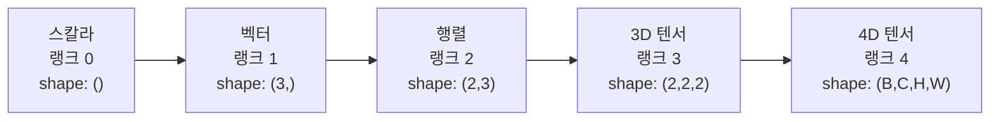
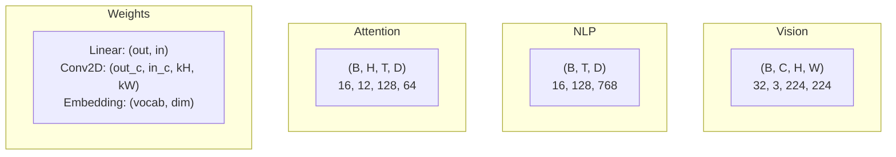
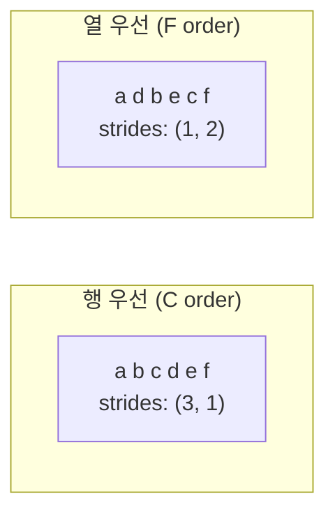
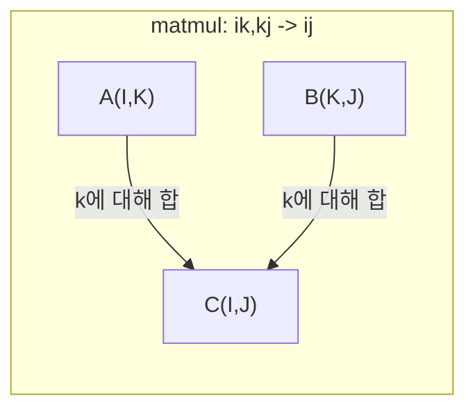

# 텐서 연산 (Tensor Operations)

> 텐서는 데이터와 딥러닝 사이의 공통 언어입니다. 모든 이미지, 모든 문장, 모든 기울기가 텐서를 통과합니다.

**Type:** Build
**Language:** Python
**Prerequisites:** Phase 1, Lessons 01 (Linear Algebra Intuition), 02 (Vectors, Matrices & Operations)
**Time:** ~90 minutes

## 학습 목표 (Learning Objectives)

- shape, strides, reshape, transpose, 원소별 연산을 갖춘 텐서 클래스를 처음부터 구현합니다
- 데이터 복사 없이 서로 다른 모양의 텐서에 브로드캐스팅 규칙을 적용합니다
- 내적, 행렬곱, 외적, 배치 연산을 위한 einsum 식을 작성합니다
- 멀티헤드 어텐션의 매 단계에서 정확한 텐서 모양을 추적합니다

## 문제 상황 (The Problem)

트랜스포머를 만듭니다. 순전파는 깔끔해 보입니다. 실행하면 `RuntimeError: mat1 and mat2 shapes cannot be multiplied (32x768 and 512x768)`가 납니다. 모양을 응시합니다. transpose를 시도합니다. 이제 `Expected 4D input (got 3D input)`입니다. unsqueeze를 넣습니다. 다른 곳이 깨집니다.

모양 오류는 딥러닝 코드에서 가장 흔한 버그입니다. 개념적으로 어렵지 않습니다. 각 연산에 모양 계약이 있지만, 빠르게 쌓입니다. 트랜스포머에는 reshape, transpose, broadcast가 수십 개 연쇄됩니다. 축 하나 틀리면 오류가 연쇄됩니다. 더 나쁜 것은, 어떤 모양 실수는 오류조차 안 내고 잘못된 차원으로 브로드캐스트하거나 잘못된 축을 합산해 조용히 쓰레기를 만듭니다.

행렬은 두 집합 사이의 쌍관계를 다룹니다. 실제 데이터는 2차원에 들어가지 않습니다. 224x224 RGB 이미지 배치 32개는 4D 텐서 `(32, 3, 224, 224)`입니다. 헤드 12개 셀프어텐션도 4D `(batch, heads, seq_len, head_dim)`입니다. 임의 차원으로 일반화되고, 모든 차원에서 깔끔히 합성되는 연산이 있는 자료구조가 필요합니다. 그것이 텐서입니다. 연산을 숙달하면 모양 오류는 쉽게 디버깅됩니다.

## 핵심 개념 (The Concept)

### 텐서란 무엇인가

텐서는 균일한 데이터 타입을 가진 다차원 숫자 배열입니다. 차원 수를 **랭크**(또는 **차수**)라 합니다. 각 차원은 **축**입니다. **shape**는 각 축의 크기를 나열한 튜플입니다.



총 원소 수 = 모든 크기의 곱. shape `(2, 3, 4)`는 `2 * 3 * 4 = 24`개 원소를 가집니다.

### 딥러닝의 텐서 모양

데이터 유형별로 관례적인 텐서 모양이 있습니다.



PyTorch는 NCHW(채널 먼저)를 씁니다. TensorFlow는 기본적으로 NHWC(채널 나중)입니다. 레이아웃이 어긋나면 조용한 속도 저하나 오류가 납니다.

### 메모리 레이아웃이 동작하는 방식

메모리의 2D 배열은 1D 바이트 시퀀스입니다. **strides**는 각 축을 따라 한 칸 이동할 때 건너뛸 원소 수를 알려 줍니다.



Transpose는 데이터를 옮기지 않습니다. strides를 바꿔 텐서를 **비연속(non-contiguous)**으로 만듭니다. 한 행의 원소가 메모리에서 더 이상 인접하지 않습니다.

### 브로드캐스팅 규칙

브로드캐스팅은 데이터 복사 없이 다른 모양의 텐서를 연산하게 합니다. 오른쪽부터 모양을 맞춥니다. 두 차원은 같거나 하나가 1이면 호환됩니다. 차원이 더 적은 쪽은 왼쪽에 1을 패딩합니다.

```
Tensor A:     (8, 1, 6, 1)
Tensor B:        (7, 1, 5)
Padded B:     (1, 7, 1, 5)
Result:       (8, 7, 6, 5)
```

### Einsum: 만능 텐서 연산

아인슈타인 합은 각 축에 글자를 붙입니다. 입력에는 있지만 출력에는 없는 축은 합산됩니다. 양쪽에 있으면 유지됩니다.



핵심 패턴: `i,i->` (내적), `i,j->ij` (외적), `ii->` (대각합), `ij->ji` (전치), `bij,bjk->bik` (배치 행렬곱), `bhtd,bhsd->bhts` (어텐션 점수).

```figure
tensor-broadcast
```

## 구현하기 (Build It)

코드는 `code/tensors.py`에 있습니다. 각 단계는 그 구현을 참조합니다.

### Step 1: 텐서 저장과 strides

텐서는 평탄한 숫자 리스트와 shape 메타데이터를 저장합니다. strides는 다차원 인덱스를 평탄 위치로 매핑하는 방법을 인덱싱 로직에 알려 줍니다.

```python
class Tensor:
    def __init__(self, data, shape=None):
        if isinstance(data, (list, tuple)):
            self._data, self._shape = self._flatten_nested(data)
        elif isinstance(data, np.ndarray):
            self._data = data.flatten().tolist()
            self._shape = tuple(data.shape)
        else:
            self._data = [data]
            self._shape = ()

        if shape is not None:
            total = reduce(lambda a, b: a * b, shape, 1)
            if total != len(self._data):
                raise ValueError(
                    f"Cannot reshape {len(self._data)} elements into shape {shape}"
                )
            self._shape = tuple(shape)

        self._strides = self._compute_strides(self._shape)

    @staticmethod
    def _compute_strides(shape):
        if len(shape) == 0:
            return ()
        strides = [1] * len(shape)
        for i in range(len(shape) - 2, -1, -1):
            strides[i] = strides[i + 1] * shape[i + 1]
        return tuple(strides)
```

shape `(3, 4)`의 strides는 `(4, 1)`입니다. 한 행 전진에 4개, 한 열 전진에 1개를 건너뜁니다.

### Step 2: Reshape, squeeze, unsqueeze

Reshape는 원소 순서를 바꾸지 않고 shape만 바꿉니다. 총 원소 수는 같아야 합니다. 한 차원에 `-1`을 쓰면 크기를 추론합니다.

```python
t = Tensor(list(range(12)), shape=(2, 6))
r = t.reshape((3, 4))
r = t.reshape((-1, 3))
```

Squeeze는 크기 1인 축을 제거합니다. Unsqueeze는 하나를 삽입합니다. Unsqueeze는 브로드캐스팅에 중요합니다. 편향 벡터 `(D,)`를 배치 `(B, T, D)`에 더하려면 `(1, 1, D)`로 unsqueeze해야 합니다.

```python
t = Tensor(list(range(6)), shape=(1, 3, 1, 2))
s = t.squeeze()
v = Tensor([1, 2, 3])
u = v.unsqueeze(0)
```

### Step 3: Transpose와 permute

Transpose는 두 축을 바꿉니다. Permute는 모든 축을 재정렬합니다. NCHW와 NHWC 변환이 이렇게 됩니다.

```python
mat = Tensor(list(range(6)), shape=(2, 3))
tr = mat.transpose(0, 1)

t4d = Tensor(list(range(24)), shape=(1, 2, 3, 4))
perm = t4d.permute((0, 2, 3, 1))
```

transpose나 permute 후 텐서는 메모리에서 비연속입니다. PyTorch에서 `view`는 비연속 텐서에서 실패합니다. `reshape`를 쓰거나 먼저 `.contiguous()`를 호출하세요.

### Step 4: 원소별 연산과 축소

원소별 연산(add, multiply, subtract)은 각 원소에 독립적으로 적용되고 shape를 유지합니다. 축소(sum, mean, max)는 하나 이상의 축을 접습니다.

```python
a = Tensor([[1, 2], [3, 4]])
b = Tensor([[10, 20], [30, 40]])
c = a + b
d = a * 2
s = a.sum(axis=0)
```

CNN의 전역 평균 풀링: `(B, C, H, W).mean(axis=[2, 3])` → `(B, C)`. NLP의 시퀀스 평균 풀링: `(B, T, D).mean(axis=1)` → `(B, D)`.

### Step 5: NumPy로 브로드캐스팅

`tensors.py`의 `demo_broadcasting_numpy()`가 핵심 패턴을 보여 줍니다.

```python
activations = np.random.randn(4, 3)
bias = np.array([0.1, 0.2, 0.3])
result = activations + bias

images = np.random.randn(2, 3, 4, 4)
scale = np.array([0.5, 1.0, 1.5]).reshape(1, 3, 1, 1)
result = images * scale

a = np.array([1, 2, 3]).reshape(-1, 1)
b = np.array([10, 20, 30, 40]).reshape(1, -1)
outer = a * b
```

브로드캐스팅으로 쌍별 거리: `(M, 2)`를 `(M, 1, 2)`로, `(N, 2)`를 `(1, N, 2)`로 reshape한 뒤 빼고 제곱하고 마지막 축으로 합한 뒤 제곱근. 결과: `(M, N)`.

### Step 6: Einsum 연산

`demo_einsum()`과 `demo_einsum_gallery()`가 흔한 패턴을 모두 다룹니다.

```python
a = np.array([1.0, 2.0, 3.0])
b = np.array([4.0, 5.0, 6.0])
dot = np.einsum("i,i->", a, b)

A = np.array([[1, 2], [3, 4], [5, 6]], dtype=float)
B = np.array([[7, 8, 9], [10, 11, 12]], dtype=float)
matmul = np.einsum("ik,kj->ij", A, B)

batch_A = np.random.randn(4, 3, 5)
batch_B = np.random.randn(4, 5, 2)
batch_mm = np.einsum("bij,bjk->bik", batch_A, batch_B)
```

수축의 계산 비용은 (유지·합산) 모든 인덱스 크기의 곱입니다. `bij,bjk->bik`에서 B=32, I=128, J=64, K=128이면 `32 * 128 * 64 * 128 = 33,554,432` 곱셈-덧셈입니다.

### Step 7: einsum으로 어텐션 메커니즘

`demo_attention_einsum()`이 멀티헤드 어텐션을 처음부터 끝까지 구현합니다.

```python
B, H, T, D = 2, 4, 8, 16
E = H * D

X = np.random.randn(B, T, E)
W_q = np.random.randn(E, E) * 0.02

Q = np.einsum("bte,ek->btk", X, W_q)
Q = Q.reshape(B, T, H, D).transpose(0, 2, 1, 3)

scores = np.einsum("bhtd,bhsd->bhts", Q, K) / np.sqrt(D)
weights = softmax(scores, axis=-1)
attn_output = np.einsum("bhts,bhsd->bhtd", weights, V)

concat = attn_output.transpose(0, 2, 1, 3).reshape(B, T, E)
output = np.einsum("bte,ek->btk", concat, W_o)
```

매 단계가 텐서 연산입니다: 투영(einsum 행렬곱), 헤드 분할(reshape + transpose), 어텐션 점수(einsum 배치 행렬곱), 가중합(einsum 배치 행렬곱), 헤드 병합(transpose + reshape), 출력 투영(einsum 행렬곱).

## 실용 활용 (Use It)

### Scratch vs NumPy

| Operation | Scratch (Tensor class) | NumPy |
|---|---|---|
| Create | `Tensor([[1,2],[3,4]])` | `np.array([[1,2],[3,4]])` |
| Reshape | `t.reshape((3,4))` | `a.reshape(3,4)` |
| Transpose | `t.transpose(0,1)` | `a.T` or `a.transpose(0,1)` |
| Squeeze | `t.squeeze(0)` | `np.squeeze(a, 0)` |
| Sum | `t.sum(axis=0)` | `a.sum(axis=0)` |
| Einsum | N/A | `np.einsum("ij,jk->ik", a, b)` |

### Scratch vs PyTorch

```python
import torch

t = torch.tensor([[1, 2, 3], [4, 5, 6]], dtype=torch.float32)
t.shape
t.stride()
t.is_contiguous()

t.reshape(3, 2)
t.unsqueeze(0)
t.transpose(0, 1)
t.transpose(0, 1).contiguous()

torch.einsum("ik,kj->ij", A, B)
```

PyTorch는 autograd, GPU, 최적화된 BLAS 커널을 추가합니다. 모양 의미론은 동일합니다. scratch 버전을 이해하면 PyTorch 모양 오류가 읽힙니다.

### 모든 신경망 층을 텐서 연산으로

| Operation | Tensor Form | Einsum |
|---|---|---|
| Linear layer | `Y = X @ W.T + b` | `"bd,od->bo"` + bias |
| Attention QKV | `Q = X @ W_q` | `"btd,dh->bth"` |
| Attention scores | `Q @ K.T / sqrt(d)` | `"bhtd,bhsd->bhts"` |
| Attention output | `softmax(scores) @ V` | `"bhts,bhsd->bhtd"` |
| Batch norm | `(X - mu) / sigma * gamma` | element-wise + broadcast |
| Softmax | `exp(x) / sum(exp(x))` | element-wise + reduction |

## 배포할 산출물 (Ship It)

이 레슨은 재사용 가능한 프롬프트 두 개를 만듭니다.

1. **`outputs/prompt-tensor-shapes.md`** — 텐서 모양 불일치를 디버깅하는 체계적 프롬프트. 흔한 연산(matmul, broadcast, cat, Linear, Conv2d, BatchNorm, softmax)의 결정 표와 수정 조회 표를 포함합니다.

2. **`outputs/prompt-tensor-debugger.md`** — 모양 오류로 막혔을 때 AI 어시스턴트에 붙여 넣는 단계별 디버깅 프롬프트. 오류 메시지와 텐서 모양을 주면 정확한 수정을 돌려줍니다.

## 연습 문제 (Exercises)

1. **Easy -- Reshape 왕복.** shape `(2, 3, 4)` 텐서를 `(6, 4)`, 그다음 `(24,)`, 다시 `(2, 3, 4)`로 reshape하세요. 각 단계에서 평탄 데이터를 출력해 원소 순서가 유지되는지 확인합니다.

2. **Medium -- 브로드캐스팅 구현.** `Tensor` 클래스에 크기 1 차원을 목표 shape에 맞게 확장하는 `broadcast_to(shape)`를 추가하고, `_elementwise_op`가 연산 전에 자동 브로드캐스트하도록 수정하세요. `(3, 1)`과 `(1, 4)`로 `(3, 4)`를 만들어 테스트합니다.

3. **Hard -- einsum을 처음부터.** 최소한 내적(`i,i->`), 행렬곱(`ij,jk->ik`), 외적(`i,j->ij`), 전치(`ij->ji`)를 다루는 기본 `einsum(subscripts, *tensors)`를 구현하세요. 첨자 문자열을 파싱하고 수축 인덱스를 식별한 뒤 모든 인덱스 조합을 순회합니다. `np.einsum`과 비교하세요.

4. **Hard -- 어텐션 모양 추적기.** `batch_size`, `seq_len`, `embed_dim`, `num_heads`를 받아 멀티헤드 어텐션의 매 단계(입력, Q/K/V 투영, 헤드 분할, 어텐션 점수, softmax 가중치, 가중합, 헤드 병합, 출력 투영)의 정확한 shape를 출력하는 함수를 작성하세요. `demo_attention_einsum()` 출력과 대조합니다.

## 핵심 용어 (Key Terms)

| Term | What people say | What it actually means |
|---|---|---|
| Tensor | "차원이 더 많은 행렬" | 균일 타입과 정의된 shape, strides, 연산을 가진 다차원 배열 |
| Rank | "차원의 개수" | 축의 개수. 행렬의 랭크는 2이며, 행렬 랭크와 같지 않음 |
| Shape | "텐서의 크기" | 각 축 크기를 나열한 튜플. `(2, 3)`은 2행 3열 |
| Stride | "메모리가 어떻게 배치되는지" | 각 축을 따라 한 칸 전진할 때 건너뛸 원소 수 |
| Broadcasting | "모양이 달라도 그냥 된다" | 엄격한 규칙: 오른쪽부터 맞추고, 차원이 같거나 하나가 1이어야 함 |
| Contiguous | "텐서가 정상이다" | 논리적 레이아웃과 맞춰 메모리에 순차 저장되고 빈틈·재배열이 없음 |
| Einsum | "행렬곱을  fancy하게 쓰는 법" | 임의의 텐서 수축, 외적, 대각합, 전치를 한 줄로 표현하는 일반 표기 |
| View | "reshape와 같다" | 같은 메모리 버퍼를 공유하되 shape/stride 메타데이터만 다른 텐서. 비연속 데이터에서 실패 |
| Contraction | "인덱스에 대해 합산" | 텐서 간 공유 인덱스를 곱하고 합해 더 낮은 랭크 결과를 만드는 일반 연산 |
| NCHW / NHWC | "PyTorch vs TensorFlow 포맷" | 이미지 텐서 메모리 레이아웃. NCHW는 채널을 공간 차원 앞, NHWC는 뒤에 둠 |

## 더 읽을거리 (Further Reading)

- [NumPy Broadcasting](https://numpy.org/doc/stable/user/basics.broadcasting.html) — 시각 예제가 있는 표준 규칙
- [PyTorch Tensor Views](https://pytorch.org/docs/stable/tensor_view.html) — 뷰가 될 때와 복사될 때
- [einops](https://github.com/arogozhnikov/einops) — 텐서 reshape를 읽기 쉽고 안전하게 만드는 라이브러리
- [The Illustrated Transformer](https://jalammar.github.io/illustrated-transformer/) — 어텐션을 흐르는 텐서 모양을 시각화
- [Einstein Summation in NumPy](https://numpy.org/doc/stable/reference/generated/numpy.einsum.html) — 예제가 있는 전체 einsum 문서
