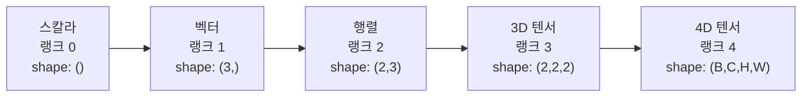
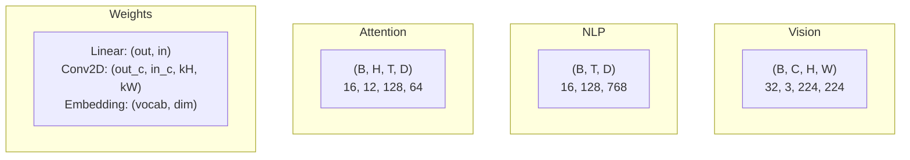
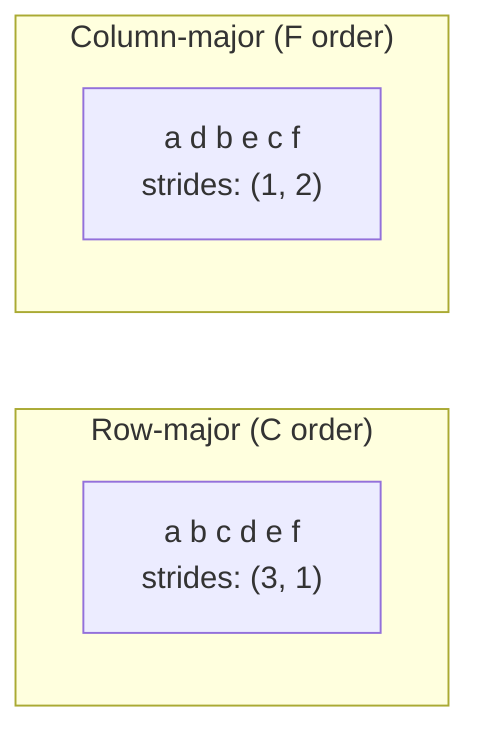
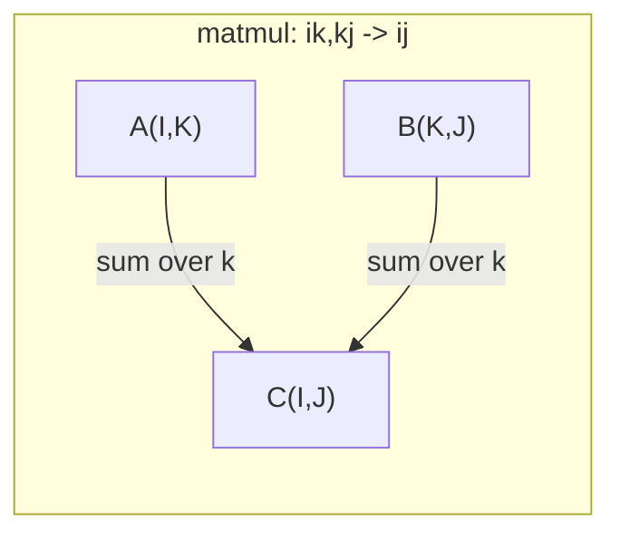

# 텐서 연산

> 텐서는 데이터와 딥러닝 사이의 공통 언어입니다. 모든 이미지, 모든 문장, 모든 기울기가 텐서를 통해 흐릅니다.

**유형:** Build
**언어:** Python
**선수 요건:** 1단계, 01강 (선형 대수 직관), 02강 (벡터, 행렬 및 연산)
**시간:** 약 90분

## 학습 목표

- 형상(shape), 스트라이드(strides), 리셰이프(reshape), 전치(transpose), 요소별 연산을 처음부터 구현하여 텐서 클래스를 만들어 보세요
- 데이터를 복사하지 않고 서로 다른 형상의 텐서에 연산을 적용하기 위해 브로드캐스팅 규칙을 적용해 보세요
- 내적, 행렬 곱, 외적, 배치 연산을 위해 einsum 표현식을 작성해 보세요
- 멀티 헤드 어텐션의 모든 단계에서 텐서 형상을 정확히 추적해 보세요

## 문제점

트랜스포머를 구축합니다. 순방향 패스는 깔끔해 보입니다. 실행하면 `RuntimeError: mat1 and mat2 shapes cannot be multiplied (32x768 and 512x768)`이 발생합니다. 형상을 살펴보고 전치를 시도합니다. 이제 `Expected 4D input (got 3D input)`이 표시됩니다. unsqueeze를 추가하면 다른 부분이 깨집니다.

형상 오류는 딥러닝 코드에서 가장 흔한 버그입니다. 개념적으로 어렵지는 않습니다. 각 연산에는 형상 계약이 있지만, 오류가 빠르게 증폭됩니다. 트랜스포머에는 수십 개의 리셰이프, 전치, 브로드캐스트가 연결되어 있습니다. 하나의 축이 잘못되면 오류가 연쇄적으로 발생합니다. 더 나쁜 것은, 일부 형상 오류는 아예 예외를 발생시키지 않는다는 점입니다. 잘못된 차원에서 브로드캐스팅하거나 잘못된 축에서 합산하여 조용히 쓰레기 데이터를 생성합니다.

행렬은 두 집합 간의 쌍대 관계를 처리합니다. 실제 데이터는 2차원에 맞지 않습니다. 224x224 크기의 RGB 이미지 32개 배치는 4차원 텐서입니다: `(32, 3, 224, 224)`. 12개의 헤드를 가진 셀프 어텐션도 4차원입니다: `(batch, heads, seq_len, head_dim)`. 모든 차원에서 연산이 깔끔하게 조합되며 임의의 차원 수로 일반화되는 데이터 구조가 필요합니다. 그 구조가 바로 텐서입니다. 텐서 연산을 숙달하면 형상 오류는 쉽게 디버깅할 수 있습니다.

## 개념

### 텐서의 정의

텐서는 균일한 데이터 타입을 가진 다차원 숫자 배열입니다. 차원 수는 **랭크**(또는 **차수**)입니다. 각 차원은 **축**입니다. **형상**은 각 축의 크기를 나열한 튜플입니다.



총 요소 수 = 모든 크기의 곱. shape `(2, 3, 4)`는 `2 * 3 * 4 = 24`개의 요소를 포함합니다.

### 딥러닝에서의 텐서 shape

데이터 타입은 관례에 따라 특정 텐서 shape에 매핑됩니다.



PyTorch는 NCHW (채널 우선)를 사용합니다. TensorFlow는 NHWC (채널 마지막)를 기본값으로 사용합니다. 레이아웃이 일치하지 않으면 조용한 속도 저하 또는 오류가 발생합니다.

### 메모리 레이아웃 작동 방식

메모리에서 2D 배열은 1D 바이트 시퀀스입니다. **Strides**는 각 축을 따라 한 단계 이동할 때 건너뛰어야 하는 요소 수를 알려줍니다.



전치(transpose)는 데이터를 이동하지 않습니다. strides를 교환하여 텐서를 **비연속(non-contiguous)**으로 만듭니다. 즉, 행의 요소들이 메모리에서 더 이상 인접하지 않게 됩니다.

### 브로드캐스팅 규칙

브로드캐스팅을 사용하면 데이터를 복사하지 않고 서로 다른 shape의 텐서에 연산을 수행할 수 있습니다. shape를 오른쪽부터 정렬하세요. 두 차원이 같거나 하나가 1일 때 호환됩니다. 차원이 적으면 왼쪽에 1로 패딩됩니다.

```
Tensor A:     (8, 1, 6, 1)
Tensor B:        (7, 1, 5)
Padded B:     (1, 7, 1, 5)
Result:       (8, 7, 6, 5)
```

### Einsum: 범용 텐서 연산

아인슈타인 합은 각 축에 문자를 할당합니다. 입력에 있지만 출력에 없는 축은 합쳐집니다. 입력과 출력 모두에 있는 축은 유지됩니다.



주요 패턴: `i,i->` (내적), `i,j->ij` (외적), `ii->` (대각합), `ij->ji` (전치), `bij,bjk->bik` (배치 행렬 곱), `bhtd,bhsd->bhts` (어텐션 점수).

```figure
tensor-broadcast
```

## 구현하기

코드는 `code/tensors.py`에 있습니다. 각 단계는 그곳의 구현을 참조합니다.

### 1단계: 텐서 저장 및 strides

텐서는 평면 숫자 목록과 형상 메타데이터를 저장합니다. 스트라이드는 다차원 인덱스를 평면 위치로 매핑하는 방법을 인덱싱 로직에 알려줍니다.

```python
class Tensor:
    def __init__(self, data, shape=None):
        if isinstance(data, (list, tuple)):
            self._data, self._shape = self._flatten_nested(data)
        elif isinstance(data, np.ndarray):
            self._data = data.flatten().tolist()
            self._shape = tuple(data.shape)
        else:
            self._data = [data]
            self._shape = ()

        if shape is not None:
            total = reduce(lambda a, b: a * b, shape, 1)
            if total != len(self._data):
                raise ValueError(
                    f"Cannot reshape {len(self._data)} elements into shape {shape}"
                )
            self._shape = tuple(shape)

        self._strides = self._compute_strides(self._shape)

    @staticmethod
    def _compute_strides(shape):
        if len(shape) == 0:
            return ()
        strides = [1] * len(shape)
        for i in range(len(shape) - 2, -1, -1):
            strides[i] = strides[i + 1] * shape[i + 1]
        return tuple(strides)
```

형상 `(3, 4)`의 경우, 스트라이드는 `(4, 1)`입니다. 한 행을 진행하려면 4개 요소를 건너뛰고, 한 열을 진행하려면 1개 요소를 건너뛰세요.

### 2단계: Reshape, squeeze, unsqueeze

Reshape는 요소 순서를 변경하지 않고 형상을 변경합니다. 총 요소 수는 동일해야 합니다. `-1`을 사용하여 한 차원의 크기를 추론해 보세요.

```python
t = Tensor(list(range(12)), shape=(2, 6))
r = t.reshape((3, 4))
r = t.reshape((-1, 3))
```

Squeeze는 크기가 1인 축을 제거합니다. Unsqueeze는 하나를 삽입합니다. Unsqueeze는 브로드캐스팅에 매우 중요합니다. 배치 `(B, T, D)`에 추가되는 편향 벡터 `(D,)`는 `(1, 1, D)`로 unsqueeze해야 합니다.

```python
t = Tensor(list(range(6)), shape=(1, 3, 1, 2))
s = t.squeeze()
v = Tensor([1, 2, 3])
u = v.unsqueeze(0)
```

### 3단계: Transpose와 permute

Transpose는 두 축을 교환합니다. Permute는 모든 축의 순서를 재배열합니다. NCHW와 NHWC를 변환하는 방법입니다.

```python
mat = Tensor(list(range(6)), shape=(2, 3))
tr = mat.transpose(0, 1)

t4d = Tensor(list(range(24)), shape=(1, 2, 3, 4))
perm = t4d.permute((0, 2, 3, 1))
```

Transpose 또는 permute 후, 텐서는 메모리에서 비연속(non-contiguous) 상태가 됩니다. PyTorch에서는 `view`이 비연속 텐서에서 실패합니다. `reshape`을 사용하거나 먼저 `.contiguous()`을 호출하세요.

### 4단계: 요소별 연산과 축소

요소별 연산(add, multiply, subtract)은 각 요소에 독립적으로 적용되며 형상을 유지합니다. 축소(sum, mean, max)는 하나 이상의 축을 축약합니다.

```python
a = Tensor([[1, 2], [3, 4]])
b = Tensor([[10, 20], [30, 40]])
c = a + b
d = a * 2
s = a.sum(axis=0)
```

CNN에서의 전역 평균 풀링: `(B, C, H, W).mean(axis=[2, 3])`은 `(B, C)`을 생성합니다. NLP에서의 시퀀스 평균 풀링: `(B, T, D).mean(axis=1)`은 `(B, D)`을 생성합니다.

### 5단계: NumPy를 이용한 브로드캐스팅

`tensors.py`의 `demo_broadcasting_numpy()` 함수는 핵심 패턴을 보여줍니다.

```python
activations = np.random.randn(4, 3)
bias = np.array([0.1, 0.2, 0.3])
result = activations + bias

images = np.random.randn(2, 3, 4, 4)
scale = np.array([0.5, 1.0, 1.5]).reshape(1, 3, 1, 1)
result = images * scale

a = np.array([1, 2, 3]).reshape(-1, 1)
b = np.array([10, 20, 30, 40]).reshape(1, -1)
outer = a * b
```

브로드캐스팅을 이용한 쌍별 거리: `(M, 2)`을 `(M, 1, 2)`로, `(N, 2)`을 `(1, N, 2)`로 reshape하고, 빼고, 제곱하고, 마지막 축을 따라 합산하고, 제곱근을 취합니다. 결과: `(M, N)`.

### 6단계: Einsum 연산

`demo_einsum()` 및 `demo_einsum_gallery()` 함수는 모든 공통 패턴을 순차적으로 다룹니다.

```python
a = np.array([1.0, 2.0, 3.0])
b = np.array([4.0, 5.0, 6.0])
dot = np.einsum("i,i->", a, b)

A = np.array([[1, 2], [3, 4], [5, 6]], dtype=float)
B = np.array([[7, 8, 9], [10, 11, 12]], dtype=float)
matmul = np.einsum("ik,kj->ij", A, B)

batch_A = np.random.randn(4, 3, 5)
batch_B = np.random.randn(4, 5, 2)
batch_mm = np.einsum("bij,bjk->bik", batch_A, batch_B)
```

축약 연산의 계산 비용은 모든 인덱스 크기(유지 및 합산)의 곱입니다. B=32, I=128, J=64, K=128인 `bij,bjk->bik`의 경우: `32 * 128 * 64 * 128 = 33,554,432`번의 곱셈-더하기 연산이 필요합니다.

### 7단계: Einsum을 통한 어텐션 메커니즘

`demo_attention_einsum()` 함수는 멀티헤드 어텐션을 처음부터 끝까지 구현합니다.

```python
B, H, T, D = 2, 4, 8, 16
E = H * D

X = np.random.randn(B, T, E)
W_q = np.random.randn(E, E) * 0.02

Q = np.einsum("bte,ek->btk", X, W_q)
Q = Q.reshape(B, T, H, D).transpose(0, 2, 1, 3)

scores = np.einsum("bhtd,bhsd->bhts", Q, K) / np.sqrt(D)
weights = softmax(scores, axis=-1)
attn_output = np.einsum("bhts,bhsd->bhtd", weights, V)

concat = attn_output.transpose(0, 2, 1, 3).reshape(B, T, E)
output = np.einsum("bte,ek->btk", concat, W_o)
```

모든 단계는 텐서 연산입니다: 투영 (einsum을 통한 matmul), 헤드 분할 (reshape + transpose), 어텐션 점수 (einsum을 통한 batch matmul), 가중 합 (einsum을 통한 batch matmul), 헤드 병합 (transpose + reshape), 출력 투영 (einsum을 통한 matmul).

## 사용하기

### Scratch vs NumPy

| 연산 | Scratch (Tensor 클래스) | NumPy |
|---|---|---|
| 생성 | `Tensor([[1,2],[3,4]])` | `np.array([[1,2],[3,4]])` |
| 재형상화 | `t.reshape((3,4))` | `a.reshape(3,4)` |
| 전치 | `t.transpose(0,1)` | `a.T` 또는 `a.transpose(0,1)` |
| 압축 | `t.squeeze(0)` | `np.squeeze(a, 0)` |
| 합 | `t.sum(axis=0)` | `a.sum(axis=0)` |
| Einsum | N/A | `np.einsum("ij,jk->ik", a, b)` |

### Scratch vs PyTorch

```python
import torch

t = torch.tensor([[1, 2, 3], [4, 5, 6]], dtype=torch.float32)
t.shape
t.stride()
t.is_contiguous()

t.reshape(3, 2)
t.unsqueeze(0)
t.transpose(0, 1)
t.transpose(0, 1).contiguous()

torch.einsum("ik,kj->ij", A, B)
```

PyTorch는 오토그라드(Autograd), GPU 지원, 최적화된 BLAS 커널을 추가합니다. 형상 의미론은 동일합니다. Scratch 버전을 이해하면 PyTorch 형상 오류가 읽기 쉬워집니다.

### 모든 신경망 계층을 텐서 연산으로 보기

| 연산 | 텐서 형식 | Einsum |
|---|---|---|
| 선형 계층 | `Y = X @ W.T + b` | `"bd,od->bo"` + 편향 |
| 어텐션 QKV | `Q = X @ W_q` | `"btd,dh->bth"` |
| 어텐션 점수 | `Q @ K.T / sqrt(d)` | `"bhtd,bhsd->bhts"` |
| 어텐션 출력 | `softmax(scores) @ V` | `"bhts,bhsd->bhtd"` |
| 배치 정규화 | `(X - mu) / sigma * gamma` | 요소별 연산 + 브로드캐스트 |
| 소프트맥스 | `exp(x) / sum(exp(x))` | 요소별 연산 + 축소 |

## 출시하기

이 강의는 두 개의 재사용 가능한 프롬프트를 생성합니다:

1. **`outputs/prompt-tensor-shapes.md`** -- 텐서 형상 불일치를 디버깅하기 위한 체계적인 프롬프트입니다. 모든 일반적인 연산 (matmul, 브로드캐스트, cat, Linear, Conv2d, BatchNorm, softmax)에 대한 결정 테이블과 수정 조회 테이블이 포함되어 있습니다.

2. **`outputs/prompt-tensor-debugger.md`** -- 형상 오류가 작업을 방해할 때 AI 어시스턴트에 붙여넣는 단계별 디버깅 프롬프트입니다. 오류 메시지와 텐서 형상을 입력하면 정확한 수정 방법을 반환합니다.

## 연습 문제

1. **쉬움 -- 재형상화 왕복.** 형상이 `(2, 3, 4)`인 텐서를 가져오세요. `(6, 4)`로 재형상화한 후 `(24,)`로, 다시 `(2, 3, 4)`로 되돌리세요. 각 단계에서 평탄화된 데이터를 출력하여 요소 순서가 보존되는지 확인하세요.

2. **중간 -- 브로드캐스팅 구현하기.** `Tensor` 클래스에 `broadcast_to(shape)` 메서드를 추가하여 크기가 1인 차원을 대상 모양(target shape)에 맞춰 확장하세요. 이후 `_elementwise_op`를 수정하여 연산 전에 자동으로 브로드캐스팅되도록 하세요. `(3, 1)`과 `(1, 4)` 모양으로 테스트하여 `(3, 4)`이 생성되는지 확인하세요.

3. **어려움 -- einsum을 처음부터 구축하기.** 최소한 점곱(dot product)(`i,i->`), 행렬 곱(matrix multiply)(`ij,jk->ik`), 외적(outer product)(`i,j->ij`), 전치(transpose)(`ij->ji`)를 처리하는 기본 `einsum(subscripts, *tensors)` 함수를 구현하세요. 첨자(subscript) 문자열을 파싱하고, 축약된 인덱스를 식별하며, 모든 인덱스 조합을 반복하세요. 결과를 `np.einsum`과 비교하세요.

4. **어려움 -- 어텐션 모양 추적기.** `batch_size`, `seq_len`, `embed_dim`, `num_heads`를 입력으로 받아 다중 헤드 어텐션의 모든 단계에서 정확한 모양을 출력하는 함수를 작성하세요: 입력, Q/K/V 투사, 헤드 분할, 어텐션 점수, 소프트맥스 가중치, 가중 합, 헤드 병합, 출력 투사. `demo_attention_einsum()` 출력과 비교하여 검증하세요.

## 핵심 용어

| 용어 | 사람들이 말하는 것 | 실제 의미 |
|---|---|---|
| 텐서(Tensor) | "차원이 더 많은 행렬" | 균일한 타입과 정의된 모양, 스트라이드, 연산을 가진 다차원 배열 |
| 랭크(Rank) | "차원의 수" | 축의 수. 행렬은 랭크가 2이며, 행렬 랭크(matrix rank)와 같지 않습니다 |
| 모양(Shape) | "텐서의 크기" | 각 축의 크기를 나열한 튜플. `(2, 3)`은 2행, 3열을 의미합니다 |
| 스트라이드(Stride) | "메모리가 배치되는 방식" | 각 축을 따라 한 위치를 전진하기 위해 건너뛰어야 하는 요소의 수 |
| 브로드캐스팅(Broadcasting) | "모양이 다를 때 그냥 작동한다" | 엄격한 규칙 집합: 오른쪽에서 정렬하며, 차원은 같거나 하나가 1이어야 합니다 |
| 연속성(Contiguous) | "텐서가 정상이다" | 논리적 배치로부터 간격이나 재배열 없이 메모리에 순차적으로 저장된 요소 |
| 아인슈타인 표기법(Einsum) | "행렬 곱을 작성하는 멋진 방법" | 모든 텐서 축약, 외적, 대각합(trace), 전치를 한 줄로 표현하는 일반적인 표기법 |
| 뷰(View) | "리셰이프와 같다" | 동일한 메모리 버퍼를 공유하지만 모양/스트라이드 메타데이터가 다른 텐서. 비연속(non-contiguous) 데이터에서는 실패합니다 |
| 축약 | "인덱스 합산" | 텐서 간 공유 인덱스를 곱하고 합산하여 더 낮은 랭크의 결과를 생성하는 일반적인 연산 |
| NCHW / NHWC | "PyTorch vs TensorFlow 형식" | 이미지 텐서의 메모리 레이아웃 규약. NCHW는 채널을 공간 차원 앞에 배치하고, NHWC는 그 뒤에 배치합니다 |

## 추가 읽기

- [NumPy Broadcasting](https://numpy.org/doc/stable/user/basics.broadcasting.html) -- 시각적 예시와 함께한 표준 규칙
- [PyTorch Tensor Views](https://pytorch.org/docs/stable/tensor_view.html) -- 뷰가 작동하는 경우와 복사하는 경우
- [einops](https://github.com/arogozhnikov/einops) -- 텐서 재구성을 가독성 있고 안전하게 만드는 라이브러리
- [The Illustrated Transformer](https://jalammar.github.io/illustrated-transformer/) -- 어텐션을 통과하는 텐서 형상을 시각화합니다
- [Einstein Summation in NumPy](https://numpy.org/doc/stable/reference/generated/numpy.einsum.html) -- 예시와 함께한 전체 einsum 문서
