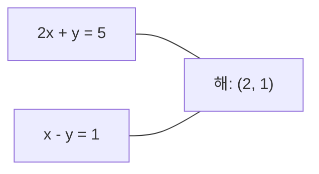
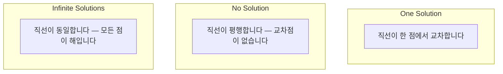

# 선형 시스템

> Ax = b를 푸는 것은 수학에서 가장 오래된 문제이며, 오늘날에도 신경망을 구동하는 핵심 연산입니다.

**유형:** Build
**언어:** Python
**선수 요건:** 1단계, 01강 (선형대수 직관), 02강 (벡터와 행렬), 03강 (행렬 변환)
**시간:** 약 120분

## 학습 목표

- 부분 피벗팅과 후대입을 포함한 가우스 소거법을 사용하여 Ax = b를 풀어 보세요
- LU, QR, Cholesky 분해로 행렬을 분해하고 각각이 적합한 상황을 설명해 보세요
- 최소 제곱을 위한 정규 방정식을 유도하고, 이를 선형 및 릿지 회귀와 연결해 보세요
- 조건 수(condition number)를 사용하여 병태 조건(ill-conditioned) 시스템을 진단하고, 정규화를 적용하여 안정화해 보세요

## 문제점

선형 회귀를 훈련할 때마다 선형 시스템을 풀게 됩니다. 최소 제곱 적합을 계산할 때마다 선형 시스템을 풀게 됩니다. 신경망 레이어가 `y = Wx + b`를 계산할 때마다 선형 시스템의 한쪽을 평가하는 것입니다. 정규화를 추가하면 시스템을 수정하게 됩니다. 가우시안 프로세스를 사용하면 행렬을 분해합니다. 마할라노비스 거리를 위해 공분산 행렬의 역을 구할 때 선형 시스템을 풀게 됩니다.

Ax = b라는 방정식은 모든 곳에 등장합니다. A는 알려진 계수로 구성된 행렬이고, b는 알려진 출력 벡터이며, x는 구해야 하는 미지수 벡터입니다. 선형 회귀에서는 A가 데이터 행렬, b가 타겟 벡터, x가 가중치 벡터가 됩니다. 전체 모델은 Ax가 b에 최대한 가까운 x를 찾는 문제로 귀결됩니다.

이 강의에서는 해당 방정식을 풀기 위한 모든 주요 방법을 처음부터 구축합니다. 어떤 방법은 빠르고 어떤 방법은 안정적인지, 어떤 방법은 정방 시스템에만 적용되고 어떤 방법은 과결정 시스템도 처리하는지, 그리고 행렬의 조건 수가 답의 의미를 결정하는 이유를 이해하게 될 것입니다.

## 개념

### Ax = b의 기하학적 의미

선형 방정식 시스템은 기하학적 해석을 가집니다. 각 방정식은 초평면을 정의합니다. 해는 모든 초평면이 교차하는 점(또는 점들의 집합)입니다.

```
2x + y = 5          Two lines in 2D.
x - y  = 1          They intersect at x=2, y=1.
```



세 가지 상황이 발생할 수 있습니다:



행렬 형태로 보면, "하나의 해"는 A가 가역적임을 의미합니다. "해 없음"은 시스템이 모순됨을 의미합니다. "무한한 해"는 A가 영공간(null space)을 가짐을 의미합니다. 대부분의 ML 문제는 미지수(매개변수)보다 방정식(데이터 포인트)이 더 많기 때문에 "정확한 해 없음" 범주에 속합니다. 여기서 최소 제곱법이 등장합니다.

### 열 그림 vs 행 그림

Ax = b를 읽는 두 가지 방법이 있습니다.

**행 그림.** A의 각 행은 하나의 방정식을 정의합니다. 각 방정식은 초평면입니다. 해는 이들이 모두 교차하는 지점입니다.

**열 그림.** A의 각 열은 벡터입니다. 질문은 다음과 같습니다: A의 열들의 어떤 선형 결합이 b를 만들어내는가?

```
A = | 2  1 |    b = | 5 |
    | 1 -1 |        | 1 |

Row picture: solve 2x + y = 5 and x - y = 1 simultaneously.

Column picture: find x1, x2 such that:
  x1 * [2, 1] + x2 * [1, -1] = [5, 1]
  2 * [2, 1] + 1 * [1, -1] = [4+1, 2-1] = [5, 1]   check.
```

열 그림이 더 근본적입니다. b가 A의 열 공간에 속하면 시스템은 해를 가집니다. b가 속하지 않으면, 열 공간에서 가장 가까운 점을 찾습니다. 그 가장 가까운 점이 최소 제곱 해입니다.

### 가우스 소거법

가우스 소거법은 Ax = b를 후대입으로 풀 수 있는 상삼각 시스템 Ux = c로 변환합니다. 가장 직접적인 방법입니다.

알고리즘:

```
1. For each column k (the pivot column):
   a. Find the largest entry in column k at or below row k (partial pivoting).
   b. Swap that row with row k.
   c. For each row i below k:
      - Compute multiplier m = A[i][k] / A[k][k]
      - Subtract m times row k from row i.
2. Back substitute: solve from the last equation upward.
```

예시:

```
Original:
| 2  1  1 | 8 |       R2 = R2 - (2)R1     | 2  1   1 |  8 |
| 4  3  3 |20 |  -->  R3 = R3 - (1)R1 --> | 0  1   1 |  4 |
| 2  3  1 |12 |                            | 0  2   0 |  4 |

                       R3 = R3 - (2)R2     | 2  1   1 |  8 |
                                       --> | 0  1   1 |  4 |
                                           | 0  0  -2 | -4 |

Back substitute:
  -2 * x3 = -4    -->  x3 = 2
  x2 + 2  = 4     -->  x2 = 2
  2*x1 + 2 + 2 = 8 --> x1 = 2
```

가우스 소거법은 O(n^3) 연산이 필요합니다. 1000x1000 시스템의 경우 약 10억 개의 부동 소수점 연산입니다. 빠르지만, 동일한 A로 여러 시스템을 풀어야 한다면 더 나은 방법이 있습니다.

### 부분 피벗팅: 왜 중요한가

피벗팅 없이 가우스 소거법은 실패하거나 엉뚱한 결과를 낳을 수 있습니다. 피벗 요소가 0이면 0으로 나누게 됩니다. 작으면 반올림 오차가 증폭됩니다.

```
Bad pivot:                       With partial pivoting:
| 0.001  1 | 1.001 |            Swap rows first:
| 1      1 | 2     |            | 1      1 | 2     |
                                 | 0.001  1 | 1.001 |
m = 1/0.001 = 1000              m = 0.001/1 = 0.001
R2 = R2 - 1000*R1               R2 = R2 - 0.001*R1
| 0.001  1     | 1.001   |      | 1      1     | 2     |
| 0     -999   | -999.0  |      | 0      0.999 | 0.999 |

x2 = 1.000 (correct)            x2 = 1.000 (correct)
x1 = (1.001 - 1)/0.001          x1 = (2 - 1)/1 = 1.000 (correct)
   = 0.001/0.001 = 1.000        Stable because the multiplier is small.
```

제한된 정밀도의 부동 소수점 연산에서는 피벗팅 없는 버전이 중요한 유효 숫자를 잃을 수 있습니다. 부분 피벗팅은 오차 증폭을 최소화하기 위해 항상 사용 가능한 가장 큰 피벗을 선택합니다.

### LU 분해

LU 분해는 A를 하삼각 행렬 L과 상삼각 행렬 U로 분해합니다: A = LU. L 행렬은 가우스 소거법에서 사용된 곱셈 계수를 저장합니다. U 행렬은 소거의 결과입니다.

```
A = L @ U

| 2  1  1 |   | 1  0  0 |   | 2  1   1 |
| 4  3  3 | = | 2  1  0 | @ | 0  1   1 |
| 2  3  1 |   | 1  2  1 |   | 0  0  -2 |
```

왜 단순히 소거하지 않고 분해할까요? L과 U를 확보하면 새로운 b에 대해 Ax = b를 푸는 비용이 O(n^2)이기 때문입니다:

```
Ax = b
LUx = b
Let y = Ux:
  Ly = b    (forward substitution, O(n^2))
  Ux = y    (back substitution, O(n^2))
```

O(n^3) 비용은 분해 과정에서 한 번만 발생합니다. 이후의 모든 풀이 과정은 O(n^2)입니다. 동일한 A를 사용하되 b 벡터가 다른 1000개의 시스템을 풀어야 한다면, LU 분해는 총 작업량에서 1000/3배의 절감을 가져옵니다.

부분 피벗팅(partial pivoting)을 적용하면 P가 행 교환을 기록하는 순열 행렬(permutation matrix)인 PA = LU를 얻습니다.

### QR 분해

QR 분해는 A를 직교 행렬 Q와 상삼각 행렬 R로 분해합니다: A = QR.

직교 행렬은 Q^T Q = I라는 성질을 가집니다. 열(column)은 정규 직교 벡터(orthonormal vectors)입니다. Q를 곱하면 길이와 각도가 보존됩니다.

```
A = Q @ R

Q has orthonormal columns: Q^T Q = I
R is upper triangular

To solve Ax = b:
  QRx = b
  Rx = Q^T b    (just multiply by Q^T, no inversion needed)
  Back substitute to get x.
```

QR은 최소 제곱 문제(least-squares problems)를 풀 때 LU보다 수치적으로 더 안정적입니다. 그람-슈미트 과정(Gram-Schmidt process)은 Q를 열별로 구축합니다:

```
Given columns a1, a2, ... of A:

q1 = a1 / ||a1||

q2 = a2 - (a2 . q1) * q1        (subtract projection onto q1)
q2 = q2 / ||q2||                (normalize)

q3 = a3 - (a3 . q1) * q1 - (a3 . q2) * q2
q3 = q3 / ||q3||

R[i][j] = qi . aj    for i <= j
```

각 단계에서 이전 q 벡터 방향의 성분을 제거하여 새로운 직교 방향만 남깁니다.

### 코레스키 분해

A가 대칭(A = A^T)이고 양정치(positive definite, 모든 고유값이 양수)인 경우, A를 하삼각 행렬 L을 사용하여 A = L L^T로 분해할 수 있습니다. 이것이 코레스키 분해(Cholesky decomposition)입니다.

```
A = L @ L^T

| 4  2 |   | 2  0 |   | 2  1 |
| 2  5 | = | 1  2 | @ | 0  2 |

L[i][i] = sqrt(A[i][i] - sum(L[i][k]^2 for k < i))
L[i][j] = (A[i][j] - sum(L[i][k]*L[j][k] for k < j)) / L[j][j]    for i > j
```

코레스키 분해는 LU보다 두 배 빠르고 저장 공간이 절반으로 줄어듭니다. 대칭 양정치 행렬에만 적용되지만, 이런 행렬은 다음과 같이 자주 등장합니다:

- 공분산 행렬(covariance matrices)은 대칭 양반정치(positive semi-definite, 정규화(regularization)를 통해 양정치)입니다.
- 가우시안 프로세스(Gaussian processes)의 커널 행렬(kernel matrix)은 대칭 양정치입니다.
- 볼록 함수(convex function)의 최솟값에서의 헤시안(Hessian)은 대칭 양정치입니다.
- A^T A는 항상 대칭 양반정치입니다.

가우시안 프로세스에서는 커널 행렬 K를 코레스키 분해한 후 K alpha = y를 풀어 예측 평균(predictive mean)을 구합니다. 코레스키 분해는 주변 우도(marginal likelihood)의 로그 행렬식(log-determinant)도 제공합니다: log det(K) = 2 * sum(log(diag(L))).

### 최소 제곱: Ax = b가 정확한 해를 가지지 않을 때

A가 m x n이고 m > n (미지수보다 방정식이 더 많은 경우)이면, 시스템은 과잉 결정됩니다. 정확한 해는 존재하지 않습니다. 대신, 제곱 오차를 최소화합니다:

```
minimize ||Ax - b||^2

This is the sum of squared residuals:
  sum((A[i,:] @ x - b[i])^2 for i in range(m))
```

최소화 값은 정규 방정식을 만족합니다:

```
A^T A x = A^T b
```

유도: ||Ax - b||^2 = (Ax - b)^T (Ax - b) = x^T A^T A x - 2 x^T A^T b + b^T b를 전개합니다. x에 대한 기울기를 취하고 0으로 설정합니다: 2 A^T A x - 2 A^T b = 0.

```
Original system (overdetermined, 4 equations, 2 unknowns):
| 1  1 |         | 3 |
| 1  2 | x     = | 5 |       No exact x satisfies all 4 equations.
| 1  3 |         | 6 |
| 1  4 |         | 8 |

Normal equations:
A^T A = | 4  10 |    A^T b = | 22 |
        | 10 30 |            | 63 |

Solve: x = [1.5, 1.7]

This is linear regression. x[0] is the intercept, x[1] is the slope.
```

### 정규 방정식 = 선형 회귀

이 연결은 정확합니다. 선형 회귀에서 데이터 행렬 X는 샘플당 한 행, 특징(feature)당 한 열을 가집니다. 목표 벡터 y는 샘플당 한 항목을 가집니다. 가중치 벡터 w는 다음을 만족합니다:

```
X^T X w = X^T y
w = (X^T X)^(-1) X^T y
```

이것은 선형 회귀의 폐형(closed-form) 해입니다. `sklearn.linear_model.LinearRegression.fit()`의 모든 호출은 이를 계산합니다 (또는 QR 또는 SVD를 통해 동등한 방식으로 계산합니다).

행렬에 정규화 항 lambda * I를 추가하면 릿지 회귀(ridge regression)를 얻습니다:

```
(X^T X + lambda * I) w = X^T y
w = (X^T X + lambda * I)^(-1) X^T y
```

정규화는 행렬의 조건 수(condition number)를 개선하여(더 정확하게 역행렬을 구하기 쉽게) 가중치를 0으로 수축시켜 과적합을 방지합니다. lambda > 0일 때 행렬 X^T X + lambda * I는 항상 대칭 양정치 행렬이므로, 이를 풀기 위해 코레스키(Cholesky) 분해를 사용할 수 있습니다.

### 유사역행렬 (Moore-Penrose)

유사역행렬 A+는 행렬 역행렬을 비정방 및 특이 행렬로 일반화합니다. 임의의 행렬 A에 대해:

```
x = A+ b

where A+ = V Sigma+ U^T    (computed via SVD)
```

Sigma+는 각 비영(nonzero) 특이값의 역수를 취하고 결과를 전치(transpose)하여 형성됩니다. A = U Sigma V^T라면, A+ = V Sigma+ U^T입니다.

```
A = U Sigma V^T        (SVD)

Sigma = | 5  0 |       Sigma+ = | 1/5  0  0 |
        | 0  2 |                | 0  1/2  0 |
        | 0  0 |

A+ = V Sigma+ U^T
```

유사역행렬은 최소 노름(norm) 최소 제곱 해를 제공합니다. 시스템이 다음을 가진 경우:
- 해가 하나: A+ b가 그 해를 제공합니다.
- 해가 없음: A+ b가 최소 제곱 해를 제공합니다.
- 무한한 해: A+ b가 ||x||가 가장 작은 해를 제공합니다.

NumPy의 `np.linalg.lstsq`과 `np.linalg.pinv`은 모두 내부적으로 SVD를 사용합니다.

### 조건 수

조건 수는 입력의 작은 변화에 대해 해가 얼마나 민감한지를 측정합니다. 행렬 A에 대해 조건 수는 다음과 같습니다:

```
kappa(A) = ||A|| * ||A^(-1)|| = sigma_max / sigma_min
```

여기서 sigma_max와 sigma_min은 각각 가장 큰 특이값과 가장 작은 특이값입니다.

```
Well-conditioned (kappa ~ 1):        Ill-conditioned (kappa ~ 10^15):
Small change in b -->                Small change in b -->
small change in x                    huge change in x

| 2  0 |   kappa = 2/1 = 2          | 1   1          |   kappa ~ 10^15
| 0  1 |   safe to solve            | 1   1+10^(-15) |   solution is garbage
```

경험칙:
- kappa < 100: 안전하며, 해는 정확합니다.
- kappa ~ 10^k: 부동소수점 연산에서 약 k자리의 정밀도를 잃게 됩니다.
- kappa ~ 10^16 (float64의 경우): 해가 무의미합니다. 행렬은 사실상 특이 행렬입니다.

ML에서는 피처가 거의 공선적(collinear)일 때 조건이 나쁜 상태(ill-conditioning)가 발생합니다. 정규화(lambda * I를 추가)는 조건 수를 sigma_max / sigma_min에서 (sigma_max + lambda) / (sigma_min + lambda)로 개선합니다.

### 반복적 방법: 공액 기울기(conjugate gradient)

매우 큰 희소 시스템(수백만 개의 미지수)의 경우, LU나 Cholesky 같은 직접 방법은 비용이 너무 높습니다. 반복적 방법은 많은 반복을 통해 초기 추정값을 개선하여 해를 근사합니다.

공액 기울기(CG)는 A가 대칭 양정치 행렬일 때 Ax = b를 풀 수 있습니다. 정확한 산술에서는 최대 n번의 반복으로 정확한 해를 찾지만, A의 고유값이 군집화(clustered)되어 있으면 일반적으로 훨씬 더 빠르게 수렴합니다.

```
Algorithm sketch:
  x0 = initial guess (often zero)
  r0 = b - A x0           (residual)
  p0 = r0                 (search direction)

  For k = 0, 1, 2, ...:
    alpha = (rk . rk) / (pk . A pk)
    x_{k+1} = xk + alpha * pk
    r_{k+1} = rk - alpha * A pk
    beta = (r_{k+1} . r_{k+1}) / (rk . rk)
    p_{k+1} = r_{k+1} + beta * pk
    if ||r_{k+1}|| < tolerance: stop
```

CG는 다음에 사용됩니다:
- 대규모 최적화 (Newton-CG 방법)
- PDE 이산화 풀이
- 커널 행렬이 너무 커서 분해할 수 없는 커널 방법
- 다른 반복적 솔버를 위한 전처리(preconditioning)

수렴 속도는 조건 수에 따라 달라집니다. 조건이 더 좋은 시스템은 더 빠르게 수렴하며, 이는 정규화가 도움이 되는 또 다른 이유입니다.

### 전체적인 그림: 어떤 메소드를 언제 사용해야 하는가

| 메소드 | 요구 사항 | 비용 | 사용 사례 |
|--------|-------------|------|----------|
| 가우시안 소거법 | 정방 행렬, 비특이 A | O(n^3) | 정방 시스템의 일회성 풀이 |
| LU 분해 | 정방 행렬, 비특이 A | O(n^3) 분해 + O(n^2) 풀이 | 동일한 A로 여러 번 풀이 |
| QR 분해 | 임의의 A (m >= n) | O(mn^2) | 최소 제곱, 수치적으로 안정적 |
| Cholesky | 대칭 양정치 A | O(n^3/3) | 공분산 행렬, 가우시안 프로세스, 릿지 회귀 |
| 정규 방정식 | 과잉 결정(m > n) | O(mn^2 + n^3) | 선형 회귀 (작은 n) |
| SVD / 유사역행렬 | 임의의 A | O(mn^2) | 계수 결손 시스템, 최소 노름 해 |
| 공액 기울기 | 대칭 양정치, 희소 A | O(n * k * nnz) | 큰 희소 시스템, k = 반복 횟수 |

### ML과의 연결

이 강의의 모든 방법은 실제 프로덕션 ML 환경에서 사용됩니다:

**선형 회귀.** 폐쇄형 해는 정규 방정식 X^T X w = X^T y를 풀며, 이는 n이 작으면 Cholesky 분해, 수치적 안정성이 중요하면 QR 분해, 행렬의 랭크가 결손될 가능성이 있으면 SVD를 통해 수행됩니다.

**리지 회귀.** X^T X에 lambda * I를 더합니다. 정규화된 시스템 (X^T X + lambda * I) w = X^T y는 lambda > 0일 때 X^T X + lambda * I가 대칭 양정치 행렬이므로 Cholesky 분해로 항상 풀 수 있습니다.

**가우시안 프로세스.** 예측 평균은 K alpha = y를 풀어야 하며, 여기서 K는 커널 행렬입니다. K의 Cholesky 분해가 표준적인 접근법입니다. 로그 주변 가우시안 확률(log marginal likelihood)은 log det(K) = 2 sum(log(diag(L)))를 사용합니다.

**신경망 초기화.** 직교 초기화(Orthogonal initialization)는 QR 분해를 사용하여 열이 정규 직교인 가중치 행렬을 만듭니다. 이는 깊은 신경망에서 신호 붕괴(signal collapse)를 방지합니다.

**전처리(Preconditioning).** 대규모 옵티마이저는 공액 기울기(conjugate gradient) 솔버를 위해 불완전 Cholesky 또는 불완전 LU를 전처리기(preconditioner)로 사용합니다.

**피처 엔지니어링.** X^T X의 조건수(condition number)는 피처가 공선(collinear)인지 알려줍니다. kappa가 크다면 피처를 제거하거나 정규화를 추가하세요.

```figure
linear-system-conditioning
```

## 구현하기

### 1단계: 부분 피벗팅(partial pivoting)을 사용한 가우시안 소거법

```python
import numpy as np

def gaussian_elimination(A, b):
    n = len(b)
    Ab = np.hstack([A.astype(float), b.reshape(-1, 1).astype(float)])

    for k in range(n):
        max_row = k + np.argmax(np.abs(Ab[k:, k]))
        Ab[[k, max_row]] = Ab[[max_row, k]]

        if abs(Ab[k, k]) < 1e-12:
            raise ValueError(f"Matrix is singular or nearly singular at pivot {k}")

        for i in range(k + 1, n):
            m = Ab[i, k] / Ab[k, k]
            Ab[i, k:] -= m * Ab[k, k:]

    x = np.zeros(n)
    for i in range(n - 1, -1, -1):
        x[i] = (Ab[i, -1] - Ab[i, i+1:n] @ x[i+1:n]) / Ab[i, i]

    return x
```

### 2단계: LU 분해

```python
def lu_decompose(A):
    n = A.shape[0]
    L = np.eye(n)
    U = A.astype(float).copy()
    P = np.eye(n)

    for k in range(n):
        max_row = k + np.argmax(np.abs(U[k:, k]))
        if max_row != k:
            U[[k, max_row]] = U[[max_row, k]]
            P[[k, max_row]] = P[[max_row, k]]
            if k > 0:
                L[[k, max_row], :k] = L[[max_row, k], :k]

        for i in range(k + 1, n):
            L[i, k] = U[i, k] / U[k, k]
            U[i, k:] -= L[i, k] * U[k, k:]

    return P, L, U

def lu_solve(P, L, U, b):
    n = len(b)
    Pb = P @ b.astype(float)

    y = np.zeros(n)
    for i in range(n):
        y[i] = Pb[i] - L[i, :i] @ y[:i]

    x = np.zeros(n)
    for i in range(n - 1, -1, -1):
        x[i] = (y[i] - U[i, i+1:] @ x[i+1:]) / U[i, i]

    return x
```

### 3단계: Cholesky 분해

```python
def cholesky(A):
    n = A.shape[0]
    L = np.zeros_like(A, dtype=float)

    for i in range(n):
        for j in range(i + 1):
            s = A[i, j] - L[i, :j] @ L[j, :j]
            if i == j:
                if s <= 0:
                    raise ValueError("Matrix is not positive definite")
                L[i, j] = np.sqrt(s)
            else:
                L[i, j] = s / L[j, j]

    return L
```

### 4단계: 정규 방정식을 통한 최소 제곱법

```python
def least_squares_normal(A, b):
    AtA = A.T @ A
    Atb = A.T @ b
    return gaussian_elimination(AtA, Atb)

def ridge_regression(A, b, lam):
    n = A.shape[1]
    AtA = A.T @ A + lam * np.eye(n)
    Atb = A.T @ b
    L = cholesky(AtA)
    y = np.zeros(n)
    for i in range(n):
        y[i] = (Atb[i] - L[i, :i] @ y[:i]) / L[i, i]
    x = np.zeros(n)
    for i in range(n - 1, -1, -1):
        x[i] = (y[i] - L.T[i, i+1:] @ x[i+1:]) / L.T[i, i]
    return x
```

### 5단계: 조건수

```python
def condition_number(A):
    U, S, Vt = np.linalg.svd(A)
    return S[0] / S[-1]
```

## 사용하기

실제 데이터에 선형 회귀와 리지 회귀를 적용하기 위해 각 요소를 조합합니다:

```python
np.random.seed(42)
X_raw = np.random.randn(100, 3)
w_true = np.array([2.0, -1.0, 0.5])
y = X_raw @ w_true + np.random.randn(100) * 0.1

X = np.column_stack([np.ones(100), X_raw])

w_ols = least_squares_normal(X, y)
print(f"OLS weights (ours):    {w_ols}")

w_np = np.linalg.lstsq(X, y, rcond=None)[0]
print(f"OLS weights (numpy):   {w_np}")
print(f"Max difference: {np.max(np.abs(w_ols - w_np)):.2e}")

w_ridge = ridge_regression(X, y, lam=1.0)
print(f"Ridge weights (ours):  {w_ridge}")

from sklearn.linear_model import Ridge
ridge_sk = Ridge(alpha=1.0, fit_intercept=False)
ridge_sk.fit(X, y)
print(f"Ridge weights (sklearn): {ridge_sk.coef_}")
```

## 출시하기

이 강의는 다음을 생성합니다:
- `code/linear_systems.py` 가우시안 소거법, LU 분해, Cholesky 분해, 최소 제곱법, 리지 회귀를 처음부터 구현한 코드를 포함합니다
- 정규 방정식과 sklearn의 LinearRegression이 동일한 가중치를 산출함을 보여주는 작동하는 데모

## 연습 문제

1. `[[1,2,3],[4,5,6],[7,8,10]] x = [6, 15, 27]` 시스템을 직접 작성한 가우시안 소거법, LU 솔버, `np.linalg.solve`을 사용하여 풀어 보세요. 세 방법 모두 부동 소수점 허용 오차 범위 내에서 동일한 답을 산출하는지 검증하세요.

2. 50x5 랜덤 행렬 X와 타겟 y = X @ w_true + noise를 생성하세요. `np.linalg.qr`을 통해 QR, `np.linalg.svd`을 통해 SVD, `np.linalg.lstsq`을 통해 정규 방정식(normal equations)으로 w를 구하고, 네 가지 해를 모두 비교하세요. X^T X의 조건수(condition number)를 측정하고, 이 값이 어떤 방법을 신뢰할지 결정하는 데 어떻게 영향을 미치는지 설명하세요.

3. 두 열이 거의 동일하도록 (예: column 2 = column 1 + 1e-10 * noise) 거의 특이(nearly singular)인 행렬을 만드세요. 조건수를 계산하세요. 정규화(regularization, 0.01 * I 추가)를 적용한 경우와 적용하지 않은 경우로 Ax = b를 풀고, 해와 잔차를 비교하세요. 정규화가 도움이 되는 이유를 설명하세요.

4. 100x100 랜덤 대칭 양정치(symmetric positive definite) 행렬에 대해 공액 기울기(conjugate gradient) 알고리즘을 구현하세요. 허용 오차(tolerance) 1e-8에 수렴하는 데 몇 번의 반복이 필요한지 세어 보세요. 이론적 최대 반복 횟수인 n과 비교하세요.

5. 크기가 10, 50, 200, 500인 대칭 양정치 행렬에 대해 Cholesky 솔버, LU 솔버, `np.linalg.solve`의 실행 시간을 측정하세요. 결과를 플롯하세요. Cholesky가 LU보다 대략 2배 빠름을 확인하세요.

## 핵심 용어

| 용어 | 사람들이 말하는 표현 | 실제 의미 |
|------|----------------|----------------------|
| 선형 시스템 | "x에 대해 풀기" | 선형 방정식 Ax = b의 집합. x를 찾는다는 것은 변환 A 아래에서 출력 b를 생성하는 입력을 찾는 것을 의미합니다. |
| 가우시안 소거법 | "행 축소(Row reduce)" | 행 연산을 사용하여 대각선 아래 항목을 체계적으로 0으로 만들어, 후대입(back substitution)으로 풀 수 있는 상삼각 시스템을 생성합니다. O(n^3). |
| 부분 피벗팅(Partial pivoting) | "안정성을 위해 행 교환" | k번째 열에서 소거하기 전에, 해당 열에서 절대값이 가장 큰 행을 피벗 위치로 교환합니다. 작은 수로 나누는 것을 방지합니다. |
| LU 분해 | "삼각형으로 분해" | A = LU로 작성하며, 여기서 L은 하삼각 행렬(승수를 저장)이고 U는 상삼각 행렬(소거된 행렬)입니다. O(n^3) 비용을 여러 번의 풀이에 걸쳐 상각(amortize)합니다. |
| QR 분해 | "직교 분해" | A = QR로 작성하며, 여기서 Q는 정규 직교 열을 가지고 R은 상삼각 행렬입니다. 최소 제곱 문제에서 LU보다 더 안정적입니다. |
| Cholesky 분해 | "행렬의 제곱근" | 대칭 양정치 A에 대해 A = LL^T로 작성합니다. LU의 절반 비용이 듭니다. 공분산 행렬, 커널 행렬, 리지 회귀(ridge regression)에 사용됩니다. |
| 최소 제곱 | "정확한 해가 불가능할 때의 최적 적합" | 방정식의 개수가 미지수보다 많은 과잉 결정 시스템에서 ||Ax - b||^2의 합을 최소화합니다. |
| 정규 방정식 | "미적분적 지름길" | A^T A x = A^T b. ||Ax - b||^2의 기울기를 0으로 설정합니다. 이는 선형 회귀의 폐형(closed-form) 해입니다. |
| 유사역행렬 | "비정방 행렬의 역행렬" | SVD를 통해 A+ = V Sigma+ U^T를 구합니다. 정방 행렬이든 직사각형 행렬이든, 특이 행렬이든 상관없이 모든 행렬에 대해 최소 노름 최소 제곱 해를 제공합니다. |
| 조건수 | "이 해가 얼마나 신뢰할 수 있는가" | kappa = sigma_max / sigma_min. 입력 섭동(perturbation)에 대한 민감도를 측정합니다. log10(kappa) 자릿수만큼 정밀도를 잃습니다. |
| 릿지 회귀 | "정규화된 최소 제곱" | (X^T X + lambda I) w = X^T y를 풀이합니다. lambda I를 추가하면 조건수(conditioning)가 개선되고 가중치가 0으로 수축합니다. 과적합을 방지합니다. |
| 켤레 기울기 | "큰 행렬을 위한 반복적 Ax=b" | 대칭 양정치 시스템에 대한 반복적 풀이법입니다. 최대 n 단계에서 수렴합니다. 분해(factorization)가 너무 비싼 대규모 희소 시스템에 실용적입니다. |
| 과잉 결정 시스템 | "매개변수보다 많은 데이터" | m-by-n 시스템에서 m > n입니다. 정확한 해가 존재하지 않습니다. 최소 제곱은 최적의 근사해를 찾습니다. 이는 모든 회귀 문제입니다. |
| 후방 대입 | "아래에서 위로 풀기" | 상삼각 시스템을 주어지면 마지막 방정식부터 풀고, 뒤로 대입합니다. O(n^2). |
| 전방 대입 | "위에서 아래로 풀기" | 하삼각 시스템을 주어지면 첫 번째 방정식부터 풀고, 앞으로 대입합니다. O(n^2). LU 풀이의 L 단계에서 사용됩니다. |

## 추가 읽기

- [MIT 18.06: Linear Algebra](https://ocw.mit.edu/courses/18-06-linear-algebra-spring-2010/) (Gilbert Strang) -- 선형 시스템 및 행렬 분해에 대한 결정적인 강의
- [Numerical Linear Algebra](https://people.maths.ox.ac.uk/trefethen/text.html) (Trefethen & Bau) -- 수치적 안정성, 조건수, 알고리즘이 실패하는 이유를 이해하기 위한 표준 참고서
- [Matrix Computations](https://www.press.jhu.edu/books/title/10678/matrix-computations) (Golub & Van Loan) -- 모든 행렬 알고리즘에 대한 백과사전식 참고서
- [3Blue1Brown: Inverse Matrices](https://www.3blue1brown.com/lessons/inverse-matrices) -- Ax = b를 풀이하는 것이 기하학적으로 무엇을 의미하는지에 대한 시각적 직관
