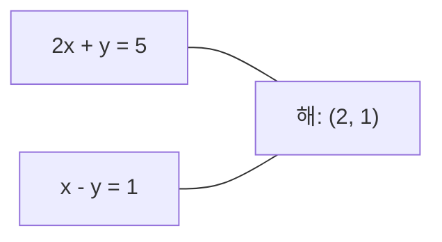
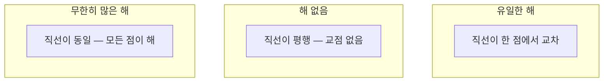

# 선형 시스템 (Linear Systems)

> Ax = b를 푸는 것은 수학에서 가장 오래된 문제이면서, 지금도 신경망을 돌리는 연산입니다.

**Type:** Build
**Language:** Python
**Prerequisites:** Phase 1, Lessons 01 (Linear Algebra Intuition), 02 (Vectors & Matrices), 03 (Matrix Transformations)
**Time:** ~120 minutes

## 학습 목표 (Learning Objectives)

- 부분 피벗팅과 후진 대입을 사용한 가우스 소거법으로 Ax = b를 풉니다
- LU, QR, 촐레스키 분해로 행렬을 인수분해하고 각 방법이 적절한 상황을 설명합니다
- 최소제곱의 정규방정식을 유도하고 선형·릿지 회귀와 연결합니다
- 조건수를 이용해 불량조건 시스템을 진단하고 정규화로 안정화합니다

## 문제 상황 (The Problem)

선형 회귀를 학습할 때마다 선형 시스템을 풉니다. 최소제곱 적합을 계산할 때마다 선형 시스템을 풉니다. 신경망 층이 `y = Wx + b`를 계산할 때마다 선형 시스템의 한쪽을 평가합니다. 정규화를 더하면 시스템을 수정합니다. 가우시안 프로세스를 쓰면 행렬을 인수분해합니다. 마할라노비스 거리를 위해 공분산 행렬을 역변환할 때도 선형 시스템을 풉니다.

방정식 Ax = b는 어디에나 나타납니다. A는 알려진 계수 행렬입니다. b는 알려진 출력 벡터입니다. x는 찾고자 하는 미지수 벡터입니다. 선형 회귀에서 A는 데이터 행렬, b는 타깃 벡터, x는 가중치 벡터입니다. 모델 전체가 이렇게 줄어듭니다: Ax가 b에 가능한 한 가깝도록 x를 찾아라.

이 레슨은 그 방정식을 푸는 주요 방법을 처음부터 구현합니다. 어떤 방법이 빠르고 어떤 방법이 안정적인지, 왜 어떤 방법은 정사각 시스템에서만 동작하고 다른 방법은 과결정 시스템을 다루하는지, 왜 행렬의 조건수가 답이 의미 있는지를 결정하는지 이해하게 됩니다.

## 핵심 개념 (The Concept)

### Ax = b의 기하학적 의미

연립일차방정식에는 기하학적 해석이 있습니다. 각 방정식은 초평면을 정의합니다. 해는 모든 초평면이 교차하는 점(또는 점의 집합)입니다.

```
2x + y = 5          2D에서의 두 직선.
x - y  = 1          이들이 x=2, y=1에서 교차합니다.
```



세 가지 경우가 가능합니다:



행렬 형태로, "유일한 해"는 A가 가역임을 뜻합니다. "해 없음"은 시스템이 비일관적임을 뜻합니다. "무한히 많은 해"는 A가 영공간을 가짐을 뜻합니다. 대부분의 ML 문제는 "정확한 해가 없는" 범주에 속합니다. 미지수(파라미터)보다 방정식(데이터 점)이 더 많기 때문입니다. 여기서 최소제곱이 등장합니다.

### 행 그림 vs 열 그림

Ax = b를 읽는 두 가지 방식이 있습니다.

**행 그림.** A의 각 행이 하나의 방정식을 정의합니다. 각 방정식은 초평면입니다. 해는 이들이 모두 교차하는 곳입니다.

**열 그림.** A의 각 열이 벡터입니다. 질문은 이렇게 바뀝니다: A의 열들의 어떤 선형결합이 b를 만드는가?

```
A = | 2  1 |    b = | 5 |
    | 1 -1 |        | 1 |

행 그림: 2x + y = 5와 x - y = 1을 동시에 풉니다.

열 그림: 다음을 만족하는 x1, x2를 찾습니다:
  x1 * [2, 1] + x2 * [1, -1] = [5, 1]
  2 * [2, 1] + 1 * [1, -1] = [4+1, 2-1] = [5, 1]   확인.
```

열 그림이 더 근본적입니다. b가 A의 열공간에 있으면 시스템에 해가 있습니다. 없으면 열공간에서 가장 가까운 점을 찾습니다. 그 가장 가까운 점이 최소제곱 해입니다.

### 가우스 소거법

가우스 소거법은 Ax = b를 후진 대입으로 푸는 상삼각 시스템 Ux = c로 변환합니다. 가장 직접적인 방법입니다.

알고리즘:

```
1. For each column k (the pivot column):
   a. Find the largest entry in column k at or below row k (partial pivoting).
   b. Swap that row with row k.
   c. For each row i below k:
      - Compute multiplier m = A[i][k] / A[k][k]
      - Subtract m times row k from row i.
2. Back substitute: solve from the last equation upward.
```

예시:

```
Original:
| 2  1  1 | 8 |       R2 = R2 - (2)R1     | 2  1   1 |  8 |
| 4  3  3 |20 |  -->  R3 = R3 - (1)R1 --> | 0  1   1 |  4 |
| 2  3  1 |12 |                            | 0  2   0 |  4 |

                       R3 = R3 - (2)R2     | 2  1   1 |  8 |
                                       --> | 0  1   1 |  4 |
                                           | 0  0  -2 | -4 |

Back substitute:
  -2 * x3 = -4    -->  x3 = 2
  x2 + 2  = 4     -->  x2 = 2
  2*x1 + 2 + 2 = 8 --> x1 = 2
```

가우스 소거법은 O(n^3) 연산이 필요합니다. 1000x1000 시스템이면 약 10억 번의 부동 연산입니다. 빠르지만, 같은 A로 여러 시스템을 풀어야 한다면 더 나은 방법이 있습니다.

### 부분 피벗팅: 왜 중요한가

피벗팅 없이 가우스 소거법은 실패하거나 쓰레기를 만들 수 있습니다. 피벗 원소가 0이면 0으로 나눕니다. 작으면 반올림 오차를 증폭합니다.

```
Bad pivot:                       With partial pivoting:
| 0.001  1 | 1.001 |            Swap rows first:
| 1      1 | 2     |            | 1      1 | 2     |
                                 | 0.001  1 | 1.001 |
m = 1/0.001 = 1000              m = 0.001/1 = 0.001
R2 = R2 - 1000*R1               R2 = R2 - 0.001*R1
| 0.001  1     | 1.001   |      | 1      1     | 2     |
| 0     -999   | -999.0  |      | 0      0.999 | 0.999 |

x2 = 1.000 (correct)            x2 = 1.000 (correct)
x1 = (1.001 - 1)/0.001          x1 = (2 - 1)/1 = 1.000 (correct)
   = 0.001/0.001 = 1.000        Stable because the multiplier is small.
```

정밀도가 제한된 부동소수점 연산에서는 피벗팅 없는 버전이 유효 자릿수를 잃을 수 있습니다. 부분 피벗팅은 항상 가장 큰 가용 피벗을 선택해 오차 증폭을 최소화합니다.

### LU 분해

LU 분해는 A를 하삼각 행렬 L과 상삼각 행렬 U로 인수분해합니다: A = LU. L 행렬은 가우스 소거법의 승수를 저장합니다. U 행렬은 소거의 결과입니다.

```
A = L @ U

| 2  1  1 |   | 1  0  0 |   | 2  1   1 |
| 4  3  3 | = | 2  1  0 | @ | 0  1   1 |
| 2  3  1 |   | 1  2  1 |   | 0  0  -2 |
```

왜 그냥 소거하지 않고 인수분해할까요? L과 U가 있으면, 새로운 b에 대해 Ax = b를 푸는 비용이 O(n^2)뿐이기 때문입니다:

```
Ax = b
LUx = b
Let y = Ux:
  Ly = b    (forward substitution, O(n^2))
  Ux = y    (back substitution, O(n^2))
```

O(n^3) 비용은 인수분해 때 한 번만 지불합니다. 이후 각 풀이는 O(n^2)입니다. 같은 A와 서로 다른 b로 1000개의 시스템을 풀어야 한다면, LU는 총 작업을 약 1000/3배 절약합니다.

부분 피벗팅을 쓰면 PA = LU가 됩니다. P는 행 교환을 기록하는 순열 행렬입니다.

### QR 분해

QR 분해는 A를 직교 행렬 Q와 상삼각 행렬 R로 인수분해합니다: A = QR.

직교 행렬은 Q^T Q = I 성질을 가집니다. 열이 정규직교 벡터입니다. Q를 곱하면 길이와 각도가 보존됩니다.

```
A = Q @ R

Q has orthonormal columns: Q^T Q = I
R is upper triangular

To solve Ax = b:
  QRx = b
  Rx = Q^T b    (just multiply by Q^T, no inversion needed)
  Back substitute to get x.
```

QR은 최소제곱 문제를 푸는 데 LU보다 수치적으로 더 안정적입니다. 그람-슈미트 과정은 Q를 열 단위로 만듭니다:

```
Given columns a1, a2, ... of A:

q1 = a1 / ||a1||

q2 = a2 - (a2 . q1) * q1        (subtract projection onto q1)
q2 = q2 / ||q2||                (normalize)

q3 = a3 - (a3 . q1) * q1 - (a3 . q2) * q2
q3 = q3 / ||q3||

R[i][j] = qi . aj    for i <= j
```

각 단계는 이전 q 벡터 방향의 성분을 제거해, 새로운 직교 방향만 남깁니다.

### 촐레스키 분해

A가 대칭(A = A^T)이고 양의 정부호(모든 고유값이 양수)일 때, A = L L^T로 인수분해할 수 있습니다. L은 하삼각입니다. 이것이 촐레스키 분해입니다.

```
A = L @ L^T

| 4  2 |   | 2  0 |   | 2  1 |
| 2  5 | = | 1  2 | @ | 0  2 |

L[i][i] = sqrt(A[i][i] - sum(L[i][k]^2 for k < i))
L[i][j] = (A[i][j] - sum(L[i][k]*L[j][k] for k < j)) / L[j][j]    for i > j
```

촐레스키는 LU보다 두 배 빠르고 저장 공간도 절반입니다. 대칭 양의 정부호 행렬에서만 동작하지만, 그런 행렬은 끊임없이 나타납니다:

- 공분산 행렬은 대칭 양의 준정부호입니다(정규화하면 양의 정부호).
- 가우시안 프로세스의 커널 행렬은 대칭 양의 정부호입니다.
- 볼록 함수의 최솟값에서 헤세 행렬은 대칭 양의 정부호입니다.
- A^T A는 항상 대칭 양의 준정부호입니다.

가우시안 프로세스에서는 커널 행렬 K를 촐레스키로 인수분해한 뒤 K alpha = y를 풀어 예측 평균을 얻습니다. 촐레스키 인수는 주변 가능도의 로그 행렬식도 줍니다: log det(K) = 2 * sum(log(diag(L))).

### 최소제곱: Ax = b에 정확한 해가 없을 때

A가 m x n이고 m > n(미지수보다 방정식이 많음)이면 시스템은 과결정입니다. 정확한 해가 없습니다. 대신 제곱 오차를 최소화합니다:

```
minimize ||Ax - b||^2

This is the sum of squared residuals:
  sum((A[i,:] @ x - b[i])^2 for i in range(m))
```

최소화하는 x는 정규방정식을 만족합니다:

```
A^T A x = A^T b
```

유도: ||Ax - b||^2 = (Ax - b)^T (Ax - b) = x^T A^T A x - 2 x^T A^T b + b^T b를 전개합니다. x에 대한 기울기를 취해 0으로 두면: 2 A^T A x - 2 A^T b = 0.

```
Original system (overdetermined, 4 equations, 2 unknowns):
| 1  1 |         | 3 |
| 1  2 | x     = | 5 |       No exact x satisfies all 4 equations.
| 1  3 |         | 6 |
| 1  4 |         | 8 |

Normal equations:
A^T A = | 4  10 |    A^T b = | 22 |
        | 10 30 |            | 63 |

Solve: x = [1.5, 1.7]

This is linear regression. x[0] is the intercept, x[1] is the slope.
```

### 정규방정식 = 선형 회귀

연결은 정확합니다. 선형 회귀에서 데이터 행렬 X는 샘플당 한 행, 특성당 한 열을 가집니다. 타깃 벡터 y는 샘플당 한 항목입니다. 가중치 벡터 w는 다음을 만족합니다:

```
X^T X w = X^T y
w = (X^T X)^(-1) X^T y
```

이것이 선형 회귀의 닫힌형 해입니다. `sklearn.linear_model.LinearRegression.fit()`의 모든 호출이 이를 계산합니다(또는 QR/SVD로 동등한 계산).

행렬에 정규화 항 lambda * I를 더하면 릿지 회귀가 됩니다:

```
(X^T X + lambda * I) w = X^T y
w = (X^T X + lambda * I)^(-1) X^T y
```

정규화는 행렬의 조건수를 개선하고(정확하게 역변환하기 쉬워짐) 가중치를 0 쪽으로 축소해 과적합을 막습니다. X^T X + lambda * I는 lambda > 0일 때 항상 대칭 양의 정부호이므로 촐레스키로 풀 수 있습니다.

### 의사역행렬 (Moore-Penrose)

의사역행렬 A+는 행렬 역변환을 비정사각·특이 행렬로 일반화합니다. 임의의 행렬 A에 대해:

```
x = A+ b

where A+ = V Sigma+ U^T    (computed via SVD)
```

Sigma+는 0이 아닌 각 특이값의 역수를 취하고 전치해 만듭니다. A = U Sigma V^T이면 A+ = V Sigma+ U^T입니다.

```
A = U Sigma V^T        (SVD)

Sigma = | 5  0 |       Sigma+ = | 1/5  0  0 |
        | 0  2 |                | 0  1/2  0 |
        | 0  0 |

A+ = V Sigma+ U^T
```

의사역행렬은 최소 노름 최소제곱 해를 줍니다. 시스템에:
- 유일한 해가 있으면: A+ b가 그 해입니다.
- 해가 없으면: A+ b가 최소제곱 해입니다.
- 무한히 많은 해가 있으면: A+ b가 ||x||가 가장 작은 해입니다.

NumPy의 `np.linalg.lstsq`와 `np.linalg.pinv`는 모두 내부적으로 SVD를 사용합니다.

### 조건수

조건수는 해가 입력의 작은 변화에 얼마나 민감한지를 측정합니다. 행렬 A의 조건수는:

```
kappa(A) = ||A|| * ||A^(-1)|| = sigma_max / sigma_min
```

여기서 sigma_max와 sigma_min은 가장 큰·가장 작은 특이값입니다.

```
Well-conditioned (kappa ~ 1):        Ill-conditioned (kappa ~ 10^15):
Small change in b -->                Small change in b -->
small change in x                    huge change in x

| 2  0 |   kappa = 2/1 = 2          | 1   1          |   kappa ~ 10^15
| 0  1 |   safe to solve            | 1   1+10^(-15) |   solution is garbage
```

경험 규칙:
- kappa < 100: 안전, 해가 정확합니다.
- kappa ~ 10^k: 부동소수점 산술에서 약 k자리의 정밀도를 잃습니다.
- kappa ~ 10^16 (float64): 해는 무의미합니다. 행렬이 사실상 특이입니다.

ML에서 불량조건은 특성이 거의 공선형일 때 생깁니다. 정규화(lambda * I 추가)는 조건수를 sigma_max / sigma_min에서 (sigma_max + lambda) / (sigma_min + lambda)로 개선합니다.

### 반복법: 공액 기울기법

매우 큰 희소 시스템(수백만 미지수)에서는 LU나 촐레스키 같은 직접법이 너무 비쌉니다. 반복법은 여러 반복에 걸쳐 추측을 개선해 해를 근사합니다.

공액 기울기법(CG)은 A가 대칭 양의 정부호일 때 Ax = b를 풉니다. 정확한 산술에서는 최대 n번 반복으로 정확한 해를 찾지만, A의 고유값이 군집해 있으면 보통 훨씬 빨리 수렴합니다.

```
Algorithm sketch:
  x0 = initial guess (often zero)
  r0 = b - A x0           (residual)
  p0 = r0                 (search direction)

  For k = 0, 1, 2, ...:
    alpha = (rk . rk) / (pk . A pk)
    x_{k+1} = xk + alpha * pk
    r_{k+1} = rk - alpha * A pk
    beta = (r_{k+1} . r_{k+1}) / (rk . rk)
    p_{k+1} = r_{k+1} + beta * pk
    if ||r_{k+1}|| < tolerance: stop
```

CG가 쓰이는 곳:
- 대규모 최적화 (Newton-CG 방법)
- PDE 이산화 풀이
- 커널 행렬이 너무 커서 인수분해할 수 없는 커널 방법
- 다른 반복 해법의 전처리

수렴 속도는 조건수에 의존합니다. 조건이 좋은 시스템이 더 빨리 수렴합니다. 정규화가 도움이 되는 또 다른 이유입니다.

### 전체 그림: 언제 어떤 방법

| Method | Requirements | Cost | Use case |
|--------|-------------|------|----------|
| Gaussian elimination | Square, nonsingular A | O(n^3) | One-off solve of a square system |
| LU decomposition | Square, nonsingular A | O(n^3) factor + O(n^2) solve | Multiple solves with the same A |
| QR decomposition | Any A (m >= n) | O(mn^2) | Least squares, numerically stable |
| Cholesky | Symmetric positive definite A | O(n^3/3) | Covariance matrices, Gaussian processes, ridge regression |
| Normal equations | Overdetermined (m > n) | O(mn^2 + n^3) | Linear regression (small n) |
| SVD / pseudoinverse | Any A | O(mn^2) | Rank-deficient systems, minimum-norm solutions |
| Conjugate gradient | Symmetric positive definite, sparse A | O(n * k * nnz) | Large sparse systems, k = iterations |

### ML과의 연결

이 레슨의 모든 방법은 프로덕션 ML에 나타납니다:

**선형 회귀.** 닫힌형 해는 정규방정식 X^T X w = X^T y를 풉니다. n이 작으면 촐레스키, 수치 안정성이 중요하면 QR, 행렬이 랭크 부족일 수 있으면 SVD로 합니다.

**릿지 회귀.** X^T X에 lambda * I를 더합니다. 정규화된 시스템 (X^T X + lambda * I) w = X^T y는 lambda > 0일 때 X^T X + lambda * I가 대칭 양의 정부호이므로 항상 촐레스키로 풀 수 있습니다.

**가우시안 프로세스.** 예측 평균은 커널 행렬 K에 대해 K alpha = y를 푸는 것이 필요합니다. K의 촐레스키 인수분해가 표준 접근입니다. 로그 주변 가능도는 log det(K) = 2 sum(log(diag(L)))를 사용합니다.

**신경망 초기화.** 직교 초기화는 QR 분해로 열이 정규직교인 가중치 행렬을 만듭니다. 깊은 네트워크에서 신호 붕괴를 막습니다.

**전처리.** 대규모 최적화기는 공액 기울기 해법의 전처리기로 불완전 촐레스키나 불완전 LU를 사용합니다.

**특성 공학.** X^T X의 조건수는 특성이 공선형인지 알려 줍니다. kappa가 크면 특성을 제거하거나 정규화를 추가합니다.

```figure
linear-system-conditioning
```

## 구현하기 (Build It)

### Step 1: 부분 피벗팅을 포함한 가우스 소거법

```python
import numpy as np

def gaussian_elimination(A, b):
    n = len(b)
    Ab = np.hstack([A.astype(float), b.reshape(-1, 1).astype(float)])

    for k in range(n):
        max_row = k + np.argmax(np.abs(Ab[k:, k]))
        Ab[[k, max_row]] = Ab[[max_row, k]]

        if abs(Ab[k, k]) < 1e-12:
            raise ValueError(f"Matrix is singular or nearly singular at pivot {k}")

        for i in range(k + 1, n):
            m = Ab[i, k] / Ab[k, k]
            Ab[i, k:] -= m * Ab[k, k:]

    x = np.zeros(n)
    for i in range(n - 1, -1, -1):
        x[i] = (Ab[i, -1] - Ab[i, i+1:n] @ x[i+1:n]) / Ab[i, i]

    return x
```

### Step 2: LU 분해

```python
def lu_decompose(A):
    n = A.shape[0]
    L = np.eye(n)
    U = A.astype(float).copy()
    P = np.eye(n)

    for k in range(n):
        max_row = k + np.argmax(np.abs(U[k:, k]))
        if max_row != k:
            U[[k, max_row]] = U[[max_row, k]]
            P[[k, max_row]] = P[[max_row, k]]
            if k > 0:
                L[[k, max_row], :k] = L[[max_row, k], :k]

        for i in range(k + 1, n):
            L[i, k] = U[i, k] / U[k, k]
            U[i, k:] -= L[i, k] * U[k, k:]

    return P, L, U

def lu_solve(P, L, U, b):
    n = len(b)
    Pb = P @ b.astype(float)

    y = np.zeros(n)
    for i in range(n):
        y[i] = Pb[i] - L[i, :i] @ y[:i]

    x = np.zeros(n)
    for i in range(n - 1, -1, -1):
        x[i] = (y[i] - U[i, i+1:] @ x[i+1:]) / U[i, i]

    return x
```

### Step 3: 촐레스키 분해

```python
def cholesky(A):
    n = A.shape[0]
    L = np.zeros_like(A, dtype=float)

    for i in range(n):
        for j in range(i + 1):
            s = A[i, j] - L[i, :j] @ L[j, :j]
            if i == j:
                if s <= 0:
                    raise ValueError("Matrix is not positive definite")
                L[i, j] = np.sqrt(s)
            else:
                L[i, j] = s / L[j, j]

    return L
```

### Step 4: 정규방정식을 통한 최소제곱

```python
def least_squares_normal(A, b):
    AtA = A.T @ A
    Atb = A.T @ b
    return gaussian_elimination(AtA, Atb)

def ridge_regression(A, b, lam):
    n = A.shape[1]
    AtA = A.T @ A + lam * np.eye(n)
    Atb = A.T @ b
    L = cholesky(AtA)
    y = np.zeros(n)
    for i in range(n):
        y[i] = (Atb[i] - L[i, :i] @ y[:i]) / L[i, i]
    x = np.zeros(n)
    for i in range(n - 1, -1, -1):
        x[i] = (y[i] - L.T[i, i+1:] @ x[i+1:]) / L.T[i, i]
    return x
```

### Step 5: 조건수

```python
def condition_number(A):
    U, S, Vt = np.linalg.svd(A)
    return S[0] / S[-1]
```

## 실용 활용 (Use It)

실제 데이터에서 선형 회귀와 릿지 회귀를 위해 조각을 합칩니다:

```python
np.random.seed(42)
X_raw = np.random.randn(100, 3)
w_true = np.array([2.0, -1.0, 0.5])
y = X_raw @ w_true + np.random.randn(100) * 0.1

X = np.column_stack([np.ones(100), X_raw])

w_ols = least_squares_normal(X, y)
print(f"OLS weights (ours):    {w_ols}")

w_np = np.linalg.lstsq(X, y, rcond=None)[0]
print(f"OLS weights (numpy):   {w_np}")
print(f"Max difference: {np.max(np.abs(w_ols - w_np)):.2e}")

w_ridge = ridge_regression(X, y, lam=1.0)
print(f"Ridge weights (ours):  {w_ridge}")

from sklearn.linear_model import Ridge
ridge_sk = Ridge(alpha=1.0, fit_intercept=False)
ridge_sk.fit(X, y)
print(f"Ridge weights (sklearn): {ridge_sk.coef_}")
```

## 배포할 산출물 (Ship It)

이 레슨이 만드는 것:
- 가우스 소거법, LU 분해, 촐레스키 분해, 최소제곱, 릿지 회귀의 처음부터 구현이 담긴 `code/linear_systems.py`
- 정규방정식과 sklearn의 LinearRegression이 같은 가중치를 만든다는 동작하는 데모

## 연습 문제 (Exercises)

1. 시스템 `[[1,2,3],[4,5,6],[7,8,10]] x = [6, 15, 27]`을 가우스 소거법, LU 해법, `np.linalg.solve`로 풉니다. 세 결과가 부동소수점 허용 오차 내에서 같은지 확인합니다.

2. 50x5 난수 행렬 X와 타깃 y = X @ w_true + noise를 생성합니다. 정규방정식, QR(`np.linalg.qr`), SVD(`np.linalg.svd`), `np.linalg.lstsq`로 w를 풉니다. 네 해를 비교합니다. X^T X의 조건수를 측정하고, 어떤 방법을 신뢰할지에 어떻게 영향을 주는지 설명합니다.

3. 두 열을 거의 같게 만들어(예: column 2 = column 1 + 1e-10 * noise) 거의 특이인 행렬을 만듭니다. 조건수를 계산합니다. 정규화 없이·있이(0.01 * I 추가) Ax = b를 풉니다. 해와 잔차를 비교합니다. 왜 정규화가 도움이 되는지 설명합니다.

4. 100x100 난수 대칭 양의 정부호 행렬에 대해 공액 기울기 알고리즘을 구현합니다. 허용 오차 1e-8에 수렴할 때까지 몇 번 반복하는지 셉니다. 이론적 최대인 n번 반복과 비교합니다.

5. 크기 10, 50, 200, 500의 대칭 양의 정부호 행렬에서 촐레스키 해법 vs LU 해법 vs `np.linalg.solve`의 시간을 측정합니다. 결과를 플롯합니다. 촐레스키가 LU보다 대략 2배 빠른지 확인합니다.

## 핵심 용어 (Key Terms)

| Term | What people say | What it actually means |
|------|----------------|----------------------|
| Linear system | "x를 풀어라" | 연립일차방정식 Ax = b. x를 찾는다는 것은 변환 A 아래에서 출력 b를 만드는 입력을 찾는다는 뜻입니다. |
| Gaussian elimination | "행 축소" | 행 연산으로 대각 아래 항목을 체계적으로 0으로 만들어, 후진 대입으로 풀 수 있는 상삼각 시스템을 만듭니다. O(n^3). |
| Partial pivoting | "안정성을 위해 행을 교환" | 열 k에서 소거하기 전에, 그 열에서 절대값이 가장 큰 행을 피벗 위치로 교환합니다. 작은 수로 나누는 것을 막습니다. |
| LU decomposition | "삼각형으로 인수분해" | A = LU로 씁니다. L은 하삼각(승수 저장), U는 상삼각(소거된 행렬). O(n^3) 비용을 여러 풀이에 걸쳐 상각합니다. |
| QR decomposition | "직교 인수분해" | A = QR로 씁니다. Q는 정규직교 열, R은 상삼각. 최소제곱에서 LU보다 안정적입니다. |
| Cholesky decomposition | "행렬의 제곱근" | 대칭 양의 정부호 A에 대해 A = LL^T. LU의 절반 비용. 공분산·커널 행렬·릿지 회귀에 사용. |
| Least squares | "정확해가 불가능할 때 최선의 적합" | 시스템이 과결정(미지수보다 방정식이 많음)일 때 잔차 제곱합 ||Ax - b||^2를 최소화합니다. |
| Normal equations | "미적분 지름길" | A^T A x = A^T b. ||Ax - b||^2의 기울기를 0으로 둔 것. 이것이 선형 회귀의 닫힌형 해입니다. |
| Pseudoinverse | "비정사각 행렬용 역변환" | SVD를 통한 A+ = V Sigma+ U^T. 정사각이든 직사각이든, 특이든 아니든 최소 노름 최소제곱 해를 줍니다. |
| Condition number | "이 답을 얼마나 믿을 수 있는가" | kappa = sigma_max / sigma_min. 입력 섭동에 대한 민감도. 약 log10(kappa)자리의 정밀도를 잃습니다. |
| Ridge regression | "정규화된 최소제곱" | (X^T X + lambda I) w = X^T y를 풉니다. lambda I를 더하면 조건이 좋아지고 가중치가 0으로 축소됩니다. 과적합을 막습니다. |
| Conjugate gradient | "큰 행렬용 반복 Ax=b" | 대칭 양의 정부호 시스템의 반복 해법. 최대 n단계에 수렴. 인수분해가 너무 비싼 대형 희소 시스템에 실용적. |
| Overdetermined system | "파라미터보다 데이터가 많음" | m-by-n 시스템에서 m > n. 정확한 해가 없습니다. 최소제곱이 최선의 근사를 찾습니다. 모든 회귀 문제가 이에 해당합니다. |
| Back substitution | "아래에서 위로 풀기" | 상삼각 시스템이 주어지면 마지막 방정식부터 풀어 뒤로 대입합니다. O(n^2). |
| Forward substitution | "위에서 아래로 풀기" | 하삼각 시스템이 주어지면 첫 방정식부터 풀어 앞으로 대입합니다. O(n^2). LU 풀이의 L 단계에서 사용. |

## 참고 자료 (Further Reading)

- [MIT 18.06: Linear Algebra](https://ocw.mit.edu/courses/18-06-linear-algebra-spring-2010/) (Gilbert Strang) -- 선형 시스템과 행렬 인수분해의 결정적 강의
- [Numerical Linear Algebra](https://people.maths.ox.ac.uk/trefethen/text.html) (Trefethen & Bau) -- 수치 안정성, 조건, 왜 알고리즘이 실패하는지 이해하기 위한 표준 참고서
- [Matrix Computations](https://www.cs.cornell.edu/cv/GolubVanLoan4/golubandvanloan.htm) (Golub & Van Loan) -- 모든 행렬 알고리즘의 백과사전적 참고서
- [3Blue1Brown: Inverse Matrices](https://www.3blue1brown.com/lessons/inverse-matrices) -- Ax = b를 푸는 것의 기하학적 의미에 대한 시각적 직관
