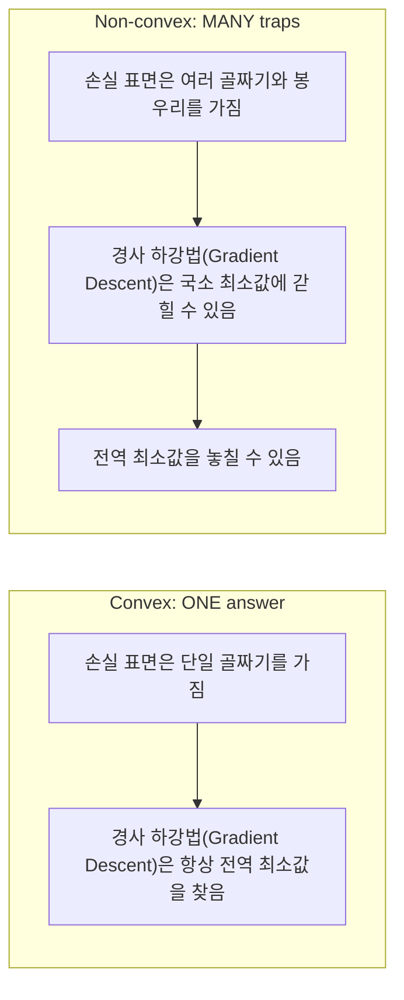
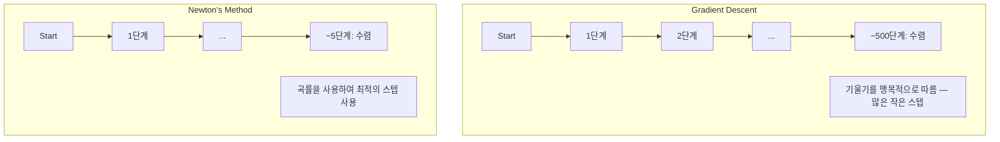
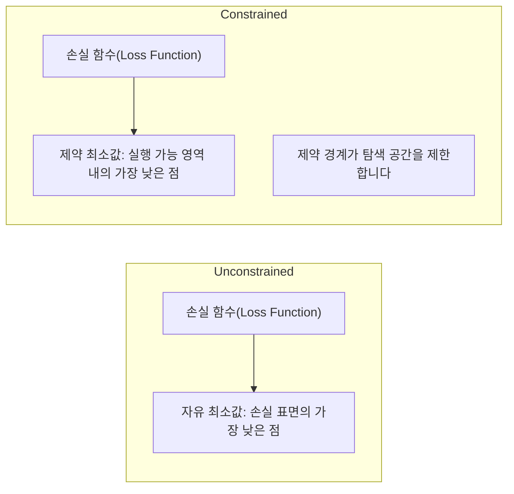
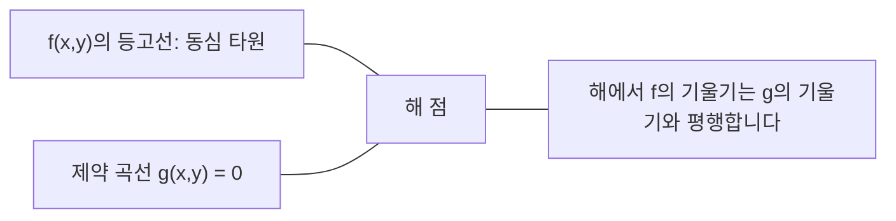

# 볼록 최적화

> 볼록 문제는 하나의 골짜기를 가집니다. 신경망은 수백만 개의 골짜기를 가집니다. 이 차이를 아는 것이 중요합니다.

**유형:** Build
**언어:** Python
**선수 요건:** 1단계, 04강 (ML을 위한 미적분학), 08강 (최적화)
**시간:** 약 90분

## 학습 목표

- 정의, 2차 도함수, 헤시안 기준을 사용하여 함수가 볼록한지 테스트해 보세요
- 뉴턴 방법을 구현하고 그 2차 수렴성을 경사 하강법과 비교해 보세요
- 라그랑주 승수를 사용하여 제약 최적화 문제를 해결하고 KKT 조건을 해석해 보세요
- 신경망 손실 지형이 비볼록함에도 SGD가 좋은 해를 찾는 이유를 설명해 보세요

## 문제점

08강에서는 경사 하강법, 모멘텀, Adam을 배웠습니다. 이 옵티마이저들은 어떤 표면에서도 내려가도록 동작합니다. 하지만 보장된 것은 없습니다. 비볼록 지형에서의 경사 하강법은 나쁜 지역 최소값에 떨어지거나, 안장점에 갇히거나, 영원히 진동할 수 있습니다. 신경망은 비볼록하고 대안이 없기 때문에 어쨌든 사용했습니다.

하지만 머신러닝의 많은 문제는 볼록합니다. 선형 회귀, 로지스틱 회귀, SVM, LASSO, 릿지 회귀. 이러한 문제에는 더 강력한 것이 존재합니다: 수학적 보장이 있는 최적화. 볼록 문제는 정확히 하나의 골짜기를 가집니다. 내려가는 모든 알고리즘은 전역 최소값에 도달합니다. 재시작이 필요 없습니다. 학습률 스케줄이 필요 없습니다. 기도할 필요가 없습니다.

볼록성을 이해하면 세 가지를 할 수 있습니다. 첫째, 문제가 쉬운지(볼록) 어려운지(비볼록) 알려줍니다. 둘째, 볼록 문제에 대해 뉴턴 방법과 같은 더 빠른 도구를 제공합니다. 셋째, ML 전반에 나타나는 개념을 설명합니다: 제약으로서의 정규화, SVM에서의 쌍대성, 그리고 볼록성이 제공하는 모든 좋은 특성을 위반함에도 딥러닝이 작동하는 이유.

## 개념

### 볼록 집합

집합 S가 볼록하다는 것은 S 내의 임의의 두 점에 대해, 두 점을 잇는 선분도 완전히 S 안에 포함되는 것을 의미합니다.

| 볼록 집합 | 비볼록 |
|---|---|
| **직사각형**: 내부의 임의의 두 점을 연결하는 선분은 항상 내부에 위치합니다 | **별/초승달 모양**: 내부의 두 점을 연결하는 선이 집합 밖으로 나가는 경우가 있습니다 |
| **삼각형**: 모든 내부 점에 대해 동일한 성질이 성립합니다 | **도넛/고리 모양**: 구멍 때문에 일부 선분이 집합 밖으로 나갑니다 |
| 임의의 두 점을 연결하는 선분은 집합 내부에 위치합니다 | 일부 점 쌍을 연결하는 선분은 집합 밖으로 나갑니다 |

공식적인 테스트: S에 있는 임의의 점 x, y와 [0, 1]에 있는 임의의 t에 대해, 점 tx + (1-t)y도 S에 포함됩니다.

볼록 집합의 예:
- 직선, 평면, 전체 R^n
- 공 (원, 구, 초구)
- 반공간: {x : a^T x <= b}
- 임의의 개수의 볼록 집합의 교집합

비볼록 집합의 예:
- 도넛 (고리 모양)
- 서로 겹치지 않는 두 원의 합집합
- "오목"이나 "구멍"이 있는 모든 집합

### 볼록 함수

함수 f가 볼록 함수가 되려면, 정의역이 볼록 집합이어야 하며, 정의역 내의 임의의 두 점 x, y와 [0, 1]에 있는 임의의 t에 대해 다음이 성립해야 합니다:

```
f(tx + (1-t)y) <= t*f(x) + (1-t)*f(y)
```

기하학적으로: 그래프 위의 임의의 두 점을 연결하는 선분은 그래프 위에 위치하거나 그래프와 일치합니다.

| 성질 | 볼록 함수 | 비볼록 함수 |
|---|---|---|
| **선분 테스트** | 그래프 위의 임의의 두 점을 연결하는 선은 곡선 **위에 위치하거나 일치**합니다 | 그래프 위의 일부 점을 연결하는 선이 곡선 **아래로** 내려갑니다 |
| **모양** | 위로 오목한 단일 그릇/계곡 모양 | 여러 개의 봉우리와 계곡이 있으며 곡률이 혼합되어 있습니다 |
| **국소 최소값** | 모든 국소 최소값은 전역 최소값입니다 | 서로 다른 높이에 여러 개의 국소 최소값이 존재할 수 있습니다 |

일반적인 볼록 함수:
- f(x) = x^2 (포물선)
- f(x) = |x| (절대값)
- f(x) = e^x (지수 함수)
- f(x) = max(0, x) (ReLU, 조각별 선형)
- f(x) = -log(x) for x > 0 (음의 로그)
- 임의의 선형 함수 f(x) = a^T x + b (볼록이며 동시에 오목)

### 볼록성 테스트

가장 쉬운 것부터 가장 엄격한 것까지 세 가지 실용적인 테스트가 있습니다.

**테스트 1: 2차 도함수 테스트 (1D).** 모든 x에 대해 f''(x) >= 0이면, f는 볼록 함수입니다.

- f(x) = x^2: f''(x) = 2 >= 0. 볼록 함수입니다.
- f(x) = x^3: f''(x) = 6x. x < 0인 경우 음수입니다. 볼록 함수가 아닙니다.
- f(x) = e^x: f''(x) = e^x > 0. 볼록 함수입니다.

**테스트 2: 헤시안 테스트 (다변량).** 모든 x에 대해 헤시안 행렬 H(x)가 양반준 definiteness(positive semidefinite)이면, f는 볼록 함수입니다. 헤시안은 2차 편미분으로 구성된 행렬입니다.

**테스트 3: 정의 테스트.** 부등식 f(tx + (1-t)y) <= t*f(x) + (1-t)*f(y)를 직접 확인합니다. 도함수 계산이 어려운 함수에 유용합니다.

### 볼록성이 중요한 이유

볼록 최적화의 중심 정리:

**볼록 함수의 경우, 모든 국소 최소값은 전역 최소값입니다.**

이는 경사 하강법(Gradient Descent)이 갇힐 수 없음을 의미합니다. 모든 하강 경로는 동일한 답으로 이어집니다. 알고리즘은 최적 해로 수렴함이 보장됩니다.



결과:
- 무작위 재시작이 필요 없음
- 정교한 학습률 스케줄(Learning Rate Schedule)이 필요 없음
- 수렴 증명 가능 (속도는 함수 특성에 의존)
- 해는 유일함 (평탄한 영역 제외)

### ML에서의 볼록 vs 비볼록

| 문제 | 볼록 여부 | 이유 |
|---------|---------|-----|
| 선형 회귀 (MSE) | 예 | 손실이 가중치에 대해 2차 함수 |
| 로지스틱 회귀 | 예 | 로그 손실이 가중치에 대해 볼록 |
| SVM (힌지 손실) | 예 | 선형 함수들의 최대값 |
| LASSO (L1 회귀) | 예 | 볼록 함수들의 합은 볼록 |
| 릿지 회귀 (L2) | 예 | 2차 함수 + 2차 함수 = 볼록 |
| 신경망 (임의의 손실) | 아니오 | 비선형 활성화 함수가 비볼록 지형을 만듦 |
| k-평균 클러스터링 | 아니오 | 이산 할당 단계 |
| 행렬 분해 | 아니오 | 미지수의 곱 |

볼록 손실 함수를 사용하는 선형 모델은 볼록입니다. 비선형 활성화 함수를 가진 은닉층을 추가하는 순간 볼록성이 깨집니다.

### 헤시안 행렬

함수 f: R^n -> R의 헤시안 H는 n x n 크기의 2계 편미분 행렬입니다.

```
H[i][j] = d^2 f / (dx_i dx_j)
```

f(x, y) = x^2 + 3xy + y^2인 경우:

```
df/dx = 2x + 3y       d^2f/dx^2 = 2      d^2f/dxdy = 3
df/dy = 3x + 2y       d^2f/dydx = 3      d^2f/dy^2 = 2

H = [ 2  3 ]
    [ 3  2 ]
```

헤시안은 곡률에 대한 정보를 알려줍니다:
- 고유값이 모두 양수인 경우: 모든 방향에서 함수가 위로 곡선화됨 (해당 지점에서 볼록)
- 고유값이 모두 음수인 경우: 모든 방향에서 함수가 아래로 곡선화됨 (오목, 지역 최대값)
- 부호가 혼합된 경우: 안장점 (일부 방향에서는 위로, 다른 방향에서는 아래로 곡선화됨)
- 고유값이 0인 경우: 해당 방향에서 평평함 (퇴화)

볼록성을 보장하려면 헤시안이 모든 지점에서 양의 준반정치 행렬(모든 고유값 >= 0)이어야 하며, 한 지점에서만 성립하면 안 됩니다.

### 뉴턴 방법

경사 하강법은 1차 정보(기울기)를 사용합니다. 뉴턴 방법은 2차 정보(헤시안)를 사용합니다. 현재 지점에서 2차 근사를 적용하고, 그 2차 함수의 최소값으로 직접 점프합니다.

```
Update rule:
  x_new = x - H^(-1) * gradient

Compare to gradient descent:
  x_new = x - lr * gradient
```

뉴턴 방법은 스칼라 학습률을 헤시안의 역행렬로 대체합니다. 이는 지역 곡률에 기반하여 스텝 크기와 방향을 자동으로 조정합니다.



장점:
- 최소값 근처에서 2차 수렴 (각 스텝마다 오차가 제곱됨)
- 튜닝해야 할 학습률이 없음
- 스케일 불변 (문제를 어떻게 매개변수화하든 작동)

단점:
- 헤시안 계산은 O(n^2) 메모리와 역행렬 계산에 O(n^3) 비용이 필요
- 100만 개의 가중치를 가진 신경망의 경우, 10^12개의 항목과 10^18번의 연산이 필요
- 딥러닝에는 실용적이지 않음

### 제약 최적화

무제약 최적화: 모든 x에 대해 f(x)를 최소화합니다.
제약 최적화: 제약 조건을 만족하면서 f(x)를 최소화합니다.

실제 문제에는 제약 조건이 있습니다. 비용을 최소화하고 싶지만 예산이 제한되어 있습니다. 오차를 최소화하고 싶지만 모델 복잡도가 제한되어 있습니다.



### 라그랑주 승수(Lagrange multipliers)

라그랑주 승수 방법은 제약 문제를 무제약 문제로 변환합니다.

문제: g(x) = 0을 만족하면서 f(x)를 최소화합니다.

해결: 새로운 변수(라그랑주 승수 lambda)를 도입하고 무제약 문제를 해결합니다:

```
L(x, lambda) = f(x) + lambda * g(x)
```

해에서 L의 기울기는 0입니다:

```
dL/dx = df/dx + lambda * dg/dx = 0
dL/dlambda = g(x) = 0
```

기하학적 직관: 제약 최소값에서 f의 기울기는 제약 g의 기울기와 평행해야 합니다. 만약 평행하지 않다면, 제약 표면을 따라 이동하여 f를 더 줄일 수 있습니다.



예제: x + y = 1을 만족하면서 f(x,y) = x^2 + y^2를 최소화합니다.

```
L = x^2 + y^2 + lambda(x + y - 1)

dL/dx = 2x + lambda = 0  =>  x = -lambda/2
dL/dy = 2y + lambda = 0  =>  y = -lambda/2
dL/dlambda = x + y - 1 = 0

From first two: x = y
Substituting: 2x = 1, so x = y = 0.5, lambda = -1
```

직선 x + y = 1에서 원점에 가장 가까운 점은 (0.5, 0.5)입니다.

### KKT 조건(KKT conditions)

Karush-Kuhn-Tucker 조건은 라그랑주 승수를 부등식 제약 조건으로 확장합니다.

문제: i = 1, ..., m에 대해 g_i(x) <= 0을 만족하면서 f(x)를 최소화합니다.

KKT 조건 (최적성을 위한 필요 조건):

```
1. Stationarity:    df/dx + sum(lambda_i * dg_i/dx) = 0
2. Primal feasibility:  g_i(x) <= 0  for all i
3. Dual feasibility:    lambda_i >= 0  for all i
4. Complementary slackness:  lambda_i * g_i(x) = 0  for all i
```

보완적 여유(Complementary slackness)가 핵심 통찰입니다: 제약 조건이 활성 상태(g_i = 0, 해가 경계에 위치)이거나 승수가 0인 경우(제약 조건이 중요하지 않음)입니다. 해에 영향을 미치지 않는 제약 조건은 lambda = 0입니다.

KKT 조건은 SVM의 핵심입니다. 서포트 벡터는 제약 조건이 활성 상태(lambda > 0)인 데이터 포인트입니다. 다른 모든 데이터 포인트는 lambda = 0이며 결정 경계에 영향을 미치지 않습니다.

### 제약 최적화로서의 정규화

L1 및 L2 정규화는 임의의 트릭이 아닙니다. 이들은 제약 최적화 문제를 변형한 형태입니다.

**L2 정규화 (Ridge):**

```
minimize  Loss(w)  subject to  ||w||^2 <= t

Equivalent unconstrained form:
minimize  Loss(w) + lambda * ||w||^2
```

제약 조건 ||w||^2 <= t는 공(ball)을 정의합니다 (2D에서는 원, 3D에서는 구). 해는 손실 등고선이 이 공에 처음으로 접하는 지점입니다.

**L1 정규화 (LASSO):**

```
minimize  Loss(w)  subject to  ||w||_1 <= t

Equivalent unconstrained form:
minimize  Loss(w) + lambda * ||w||_1
```

제약 조건 ||w||_1 <= t는 다이아몬드 (2D에서는 회전된 정사각형)를 정의합니다.

| 속성 | L2 제약 (원) | L1 제약 (다이아몬드) |
|---|---|---|
| **제약 형상** | 원 (고차원에서는 구) | 다이아몬드 (2D에서는 회전된 정사각형) |
| **손실 등고선이 접하는 위치** | 매끄러운 경계 — 원 위의 임의의 점 | 모서리 — 축과 정렬됨 |
| **해의 거동** | 가중치가 작지만 0이 아님 | 일부 가중치가 정확히 0 (희소) |
| **결과** | 가중치 축소 | 특징 선택 |

이것이 L1이 희소 모델(특징 선택)을 생성하는 반면 L2는 가중치만 축소하는 이유를 설명합니다. 다이아몬드의 모서리는 축과 정렬되어 있습니다. 손실 등고선이 모서리에 접할 가능성이 더 높으며, 이는 하나 이상의 가중치를 정확히 0으로 설정합니다.

### 쌍대성

모든 제약 최적화 문제(원 문제)는 동반 문제(쌍대 문제)를 가집니다. 볼록 문제의 경우, 원 문제와 쌍대 문제는 동일한 최적 값을 가집니다. 이를 강한 쌍대성이라고 합니다.

라그랑주 쌍대 함수:

```
Primal: minimize f(x) subject to g(x) <= 0
Lagrangian: L(x, lambda) = f(x) + lambda * g(x)
Dual function: d(lambda) = min_x L(x, lambda)
Dual problem: maximize d(lambda) subject to lambda >= 0
```

쌍대성이 중요한 이유:
- 쌍대 문제는 원 문제보다 풀기 쉬운 경우가 있습니다
- SVM은 쌍대 형태로 풀리며, 이때 문제는 데이터 포인트 간의 내적에 의존합니다 (커널 트릭을 가능하게 함)
- 쌍대 문제는 원 문제의 최적값에 대한 하한을 제공하며, 해의 품질을 확인하는 데 유용합니다

SVM의 경우 특히:

```
Primal: find w, b that maximize the margin 2/||w|| subject to
        y_i(w^T x_i + b) >= 1 for all i

Dual:   maximize sum(alpha_i) - 0.5 * sum_ij(alpha_i * alpha_j * y_i * y_j * x_i^T x_j)
        subject to alpha_i >= 0 and sum(alpha_i * y_i) = 0

The dual only involves dot products x_i^T x_j.
Replace x_i^T x_j with K(x_i, x_j) to get the kernel trick.
```

### 비볼록성에도 딥러닝이 작동하는 이유

신경망 손실 함수는 극도로 비볼록합니다. 모든 고전적 척도에 따르면, 이를 최적화하는 것은 실패해야 합니다. 그러나 확률적 경사 하강법(SGD)은 신뢰할 수 있게 좋은 해를 찾습니다. 몇 가지 요인이 이를 설명합니다.

**대부분의 지역 최소값은 충분히 좋습니다.** 고차원 공간에서는 랜덤 임계점(기울기가 0인 지점)이 지역 최소값이 아니라 압도적으로 안장점(saddle point)입니다. 존재하는 몇 안 되는 지역 최소값들은 전역 최소값에 가까운 손실 값을 가지는 경향이 있습니다. 매개변수 공간이 수백만 차원일 때, 나쁜 지역 최소값에 갇히는 것은 극히 드뭅니다.

**지역 최소값이 아닌 안장점이 진정한 장애물입니다.** n개의 매개변수를 가진 함수에서 안장점은 양의 곡률 방향과 음의 곡률 방향이 섞여 있습니다. 고차원에서의 랜덤 임계점의 경우, 모든 n개의 고유값이 양수(지역 최소값)일 확률은 대략 2^(-n)입니다. 거의 모든 임계점은 안장점입니다. SGD의 잡음은 안장점을 벗어나는 데 도움을 줍니다.

**과매개변수화(Overparameterization)는 손실 지형을 매끄럽게 만듭니다.** 학습 예제보다 매개변수가 많은 네트워크는 더 매끄럽고 연결된 손실 표면을 가집니다. 더 넓은 네트워크는 나쁜 지역 최소값이 적습니다. 이는 직관적이지 않지만 경험적으로 일관됩니다.

**손실 지형 구조:**

| 속성 | 저차원 공간 | 고차원 공간 |
|---|---|---|
| **지형** | 많은 고립된 봉우리와 골짜기 | 매끄럽게 연결된 골짜기 |
| **최소값** | 많은 고립된 지역 최소값 | 나쁜 지역 최소값이 적음; 대부분 준최적 |
| **탐색** | 전역 최소값 찾기 어려움 | 많은 경로가 좋은 해로 이어짐 |
| **임계점** | 지역 최소값과 안장점의 혼합 | 압도적으로 안장점, 지역 최소값 아님 |

**확률적 잡음은 암시적 정규화(implicit regularization)로 작용합니다.** 미니배치 SGD는 날카로운 최소값(sharp minima)에 정착하는 것을 방지하는 잡음을 추가합니다. 날카로운 최소값은 과적합되고, 평평한 최소값(flat minima)은 일반화됩니다. 잡음은 손실 지형의 평평한 영역으로 최적화를 편향시킵니다.

### 실제에서의 2차 방법

순수 뉴턴 방법(Pure Newton's method)은 대규모 모델에 대해 실용적이지 않습니다. 몇 가지 근사법이 2차 정보를 사용 가능하게 만듭니다.

**L-BFGS (Limited-memory BFGS):** 마지막 m개의 기울기 차이를 사용하여 역 헤시안(inverse Hessian)을 근사합니다. O(n^2) 대신 O(mn) 메모리가 필요합니다. 최대 약 10,000개의 매개변수를 가진 문제에 잘 작동합니다. 고전 ML(로지스틱 회귀, CRF)에서 사용되지만 딥러닝에서는 사용되지 않습니다.

**자연 기울기:** 표준 헤시안 대신 피셔 정보 행렬(로그 우도의 기대 헤시안)을 사용합니다. 이는 확률 분포의 기하학적 구조를 고려합니다. K-FAC (Kronecker-Factored Approximate Curvature)은 피셔 행렬을 크로네커 곱으로 근사하여 신경망에 실용적으로 적용할 수 있게 합니다.

**헤시안 없는 최적화:** Hx = g를 풀기 위해 H를 형성하지 않고 켤레 기울기법을 사용합니다. 헤시안-벡터 곱만 필요하며, 이는 자동 미분을 통해 O(n) 시간에 계산할 수 있습니다.

**대각선 근사:** Adam의 2차 모멘트는 헤시안의 대각선에 대한 대각선 근사입니다. AdaHessian은 Hutchinson 추정기를 사용하여 실제 헤시안 대각선 요소를 활용함으로써 이를 확장합니다.

| 방법 | 메모리 | 단계별 비용 | 사용 시점 |
|--------|--------|--------------|-------------|
| 경사 하강법 | O(n) | O(n) | 기본, 대규모 모델 |
| 뉴턴 방법 | O(n^2) | O(n^3) | 작은 볼록 문제 |
| L-BFGS | O(mn) | O(mn) | 중간 크기의 볼록 문제 |
| Adam | O(n) | O(n) | 딥러닝 기본값 |
| K-FAC | O(n) | 레이어당 O(n) | 연구, 대규모 배치 학습 |

```figure
convex-vs-nonconvex
```

## 구현하기

### 1단계: 볼록성 검사기

점을 샘플링하고 정의를 확인하여 볼록성을 경험적으로 테스트하는 함수를 만들어 보세요.

```python
import random
import math

def check_convexity(f, dim, bounds=(-5, 5), samples=1000):
    violations = 0
    for _ in range(samples):
        x = [random.uniform(*bounds) for _ in range(dim)]
        y = [random.uniform(*bounds) for _ in range(dim)]
        t = random.uniform(0, 1)
        mid = [t * xi + (1 - t) * yi for xi, yi in zip(x, y)]
        lhs = f(mid)
        rhs = t * f(x) + (1 - t) * f(y)
        if lhs > rhs + 1e-10:
            violations += 1
    return violations == 0, violations
```

### 2단계: 2D 뉴턴 방법

명시적인 헤시안을 사용하여 뉴턴 방법을 구현해 보세요. 경사 하강법과의 수렴 속도를 비교해 보세요.

```python
def newtons_method(f, grad_f, hessian_f, x0, steps=50, tol=1e-12):
    x = list(x0)
    history = [x[:]]
    for _ in range(steps):
        g = grad_f(x)
        H = hessian_f(x)
        det = H[0][0] * H[1][1] - H[0][1] * H[1][0]
        if abs(det) < 1e-15:
            break
        H_inv = [
            [H[1][1] / det, -H[0][1] / det],
            [-H[1][0] / det, H[0][0] / det],
        ]
        dx = [
            H_inv[0][0] * g[0] + H_inv[0][1] * g[1],
            H_inv[1][0] * g[0] + H_inv[1][1] * g[1],
        ]
        x = [x[0] - dx[0], x[1] - dx[1]]
        history.append(x[:])
        if sum(gi ** 2 for gi in g) < tol:
            break
    return history
```

### 3단계: 라그랑주 승수 솔버

라그랑주 함수에 대한 경사 하강법을 사용하여 제약 조건이 있는 최적화를 풀어 보세요.

```python
def lagrange_solve(f_grad, g_val, g_grad, x0, lr=0.01,
                   lr_lambda=0.01, steps=5000):
    x = list(x0)
    lam = 0.0
    history = []
    for _ in range(steps):
        fg = f_grad(x)
        gv = g_val(x)
        gg = g_grad(x)
        x = [
            xi - lr * (fgi + lam * ggi)
            for xi, fgi, ggi in zip(x, fg, gg)
        ]
        lam = lam + lr_lambda * gv
        history.append((x[:], lam, gv))
    return history
```

### 4단계: 1차 vs 2차 비교

동일한 2차 함수에 대해 경사 하강법과 뉴턴 방법을 실행해 보세요. 수렴까지의 단계 수를 세어 보세요.

```python
def quadratic(x):
    return 5 * x[0] ** 2 + x[1] ** 2

def quadratic_grad(x):
    return [10 * x[0], 2 * x[1]]

def quadratic_hessian(x):
    return [[10, 0], [0, 2]]
```

뉴턴 방법은 1단계로 수렴합니다 (2차 함수에 대해서는 정확합니다). 헤시안의 고유값이 5배 차이로 인해 길게 늘어진 골짜기가 생성되므로, 경사 하강법은 수백 단계가 필요합니다.

## 사용하기

볼록성 분석은 ML 모델과 솔버를 선택할 때 직접 적용됩니다.

볼록 문제 (로지스틱 회귀, SVM, LASSO)의 경우:
- 전용 솔버(liblinear, CVXPY, method='L-BFGS-B'를 사용한 scipy.optimize.minimize)를 사용하세요
- 독일(global)한 전역 해가 존재할 것으로 기대하세요
- 2차 방법은 실용적이고 빠릅니다

비볼록 문제(신경 네트워크)의 경우:
- 1차 방법(SGD, Adam)을 사용하세요
- 해가 초기화와 랜덤성에 의존한다는 점을 받아들이세요
- 과매개변수화, 잡음, 학습률 스케줄을 암시적 정규화로 사용하세요
- 전역 최소값을 찾는 데 시간을 낭비하지 마세요. 좋은 지역 최소값이면 충분합니다.

```python
from scipy.optimize import minimize

result = minimize(
    fun=lambda w: sum((y - X @ w) ** 2) + 0.1 * sum(w ** 2),
    x0=np.zeros(d),
    method='L-BFGS-B',
    jac=lambda w: -2 * X.T @ (y - X @ w) + 0.2 * w,
)
```

SVM의 경우, 쌍대(dual) 공식화를 통해 커널 트릭을 사용할 수 있습니다:

```python
from sklearn.svm import SVC

svm = SVC(kernel='rbf', C=1.0)
svm.fit(X_train, y_train)
print(f"Support vectors: {svm.n_support_}")
```

## 연습 문제

1. **볼록성 갤러리.** 체커를 사용하여 다음 함수들의 볼록성을 테스트하세요: f(x) = x^4, f(x) = sin(x), f(x,y) = x^2 + y^2, f(x,y) = x*y, f(x) = max(x, 0). 각 결과가 왜 합리적인지 설명하세요.

2. **뉴턴 대 경사 하강법 경쟁.** 시작점 (10, 10)에서 f(x,y) = 50*x^2 + y^2에 대해 두 방법을 모두 실행하세요. 손실 < 1e-10에 도달하는 데 각각 몇 단계가 필요합니까? 조건수(Hessian 고유값 중 최대값과 최소값의 비율)가 증가할 때 경사 하강법에는 어떤 일이 일어나합니까?

3. **라그랑주 승수 기하학.** x + 2y = 4라는 제약 조건 하에서 f(x,y) = (x-3)^2 + (y-3)^2를 최소화하세요. 해에서 f의 기울기가 g의 기울기와 평행함을 확인하여 해를 검증하세요.

4. **정규화 제약.** L1 제약 최적화를 구현하세요: |x| + |y| <= 1이라는 제약 조건 하에서 (x-3)^2 + (y-2)^2를 최소화하세요. 해가 하나의 좌표가 0인 것을 보여주세요(다이아몬드 제약에서 오는 희소성).

5. **Hessian 고유값 분석.** Rosenbrock 함수의 Hessian을 (1,1)과 (-1,1)에서 계산하세요. 두 점 모두에서 고유값을 계산하세요. 고유값은 최소값에서의 곡률과 그로부터 멀리 떨어진 곳에서의 곡률에 대해 무엇을 알려줍니까?

## 핵심 용어

| 용어 | 의미 |
|------|---------------|
| 볼록 집합 | 집합 내의 임의의 두 점을 연결한 선분 전체가 집합 내부에 포함되는 집합 |
| 볼록 함수 | 그래프 상의 임의의 두 점을 연결한 선이 그래프 위에 있거나 그래프와 일치하는 함수. 즉, Hessian이 모든 곳에서 양의 준반 definiteness를 가짐 |
| 국소 최소값 | 주변 모든 점보다 낮은 점. 볼록 함수의 경우 모든 국소 최소값은 전역 최소값입니다 |
| 전역 최소값 | 함수의 전체 정의역에서 가장 낮은 점입니다 |
| 헤시안 행렬 | 모든 2계 편미분으로 구성된 행렬입니다. 곡률 정보를 인코딩합니다 |
| 양의 준반정치 | 모든 고유값이 음수가 아닌 행렬입니다. "2계 도함수 >= 0"의 다차원 유사체입니다 |
| 조건수 | 헤시안의 가장 큰 고유값과 가장 작은 고유값의 비율입니다. 조건수가 높다는 것은 길게 늘어진 골짜기와 느린 경사 하강법을 의미합니다 |
| 뉴턴 방법 | 역 헤시안을 사용하여 스텝 방향과 크기를 결정하는 2차 옵티마이저입니다. 최소값 근처에서 2차 수렴합니다 |
| 라그랑주 승수 | 제약 조건이 있는 최적화 문제를 제약 조건이 없는 문제로 변환하기 위해 도입한 변수입니다 |
| KKT 조건 | 부등식 제약 조건이 있는 최적성의 필요 조건입니다. 라그랑주 승수를 일반화합니다 |
| 보완 슬랙성 | 해에서 제약 조건이 활성 상태이거나 그 승수가 0입니다. 둘 다 0이 아닌 값이 될 수는 없습니다 |
| 쌍대성 | 모든 제약 조건이 있는 문제에는 쌍대 문제가 존재합니다. 볼록 문제의 경우 두 문제 모두 동일한 최적값을 가집니다 |
| 강한 쌍대성 | 원 문제와 쌍대 문제의 최적값이 동일합니다. 슬레이터 조건을 만족하는 볼록 문제에서 성립합니다 |
| L-BFGS | 전체 헤시안 대신 마지막 m개의 기울기 차이를 저장하는 근사 2차 방법입니다 |
| 안장점 | 기울기가 0이지만 일부 방향에서는 최소값이고 다른 방향에서는 최대값인 점입니다 |
| 과매개변수화 | 학습 예제보다 더 많은 매개변수를 사용하는 것입니다. 손실 지형을 부드럽게 만들고 나쁜 국소 최소값을 줄입니다 |

## 추가 읽기

- [Boyd & Vandenberghe: Convex Optimization](https://web.stanford.edu/~boyd/cvxbook/) - 표준 교과서로, 온라인에서 무료로 이용 가능합니다
- [Bottou, Curtis, Nocedal: Optimization Methods for Large-Scale Machine Learning (2018)](https://arxiv.org/abs/1606.04838) - 볼록 최적화 이론과 딥러닝 실무의 연결고리
- [Choromanska et al.: The Loss Surfaces of Multilayer Networks (2015)](https://arxiv.org/abs/1412.0233) - 비볼록 신경망 지형이 보이는 것만큼 나쁘지 않은 이유
- [Nocedal & Wright: Numerical Optimization](https://link.springer.com/book/10.1007/978-0-387-40065-5) - 뉴턴 방법, L-BFGS 및 제약 최적화에 대한 종합적인 참고 자료
