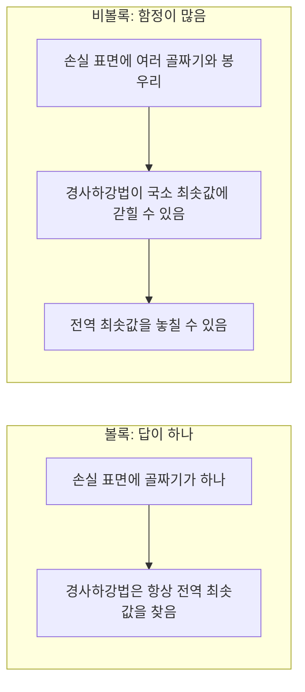
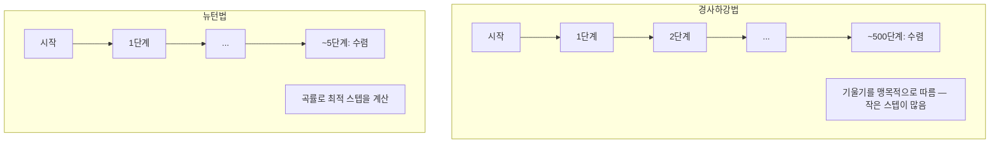
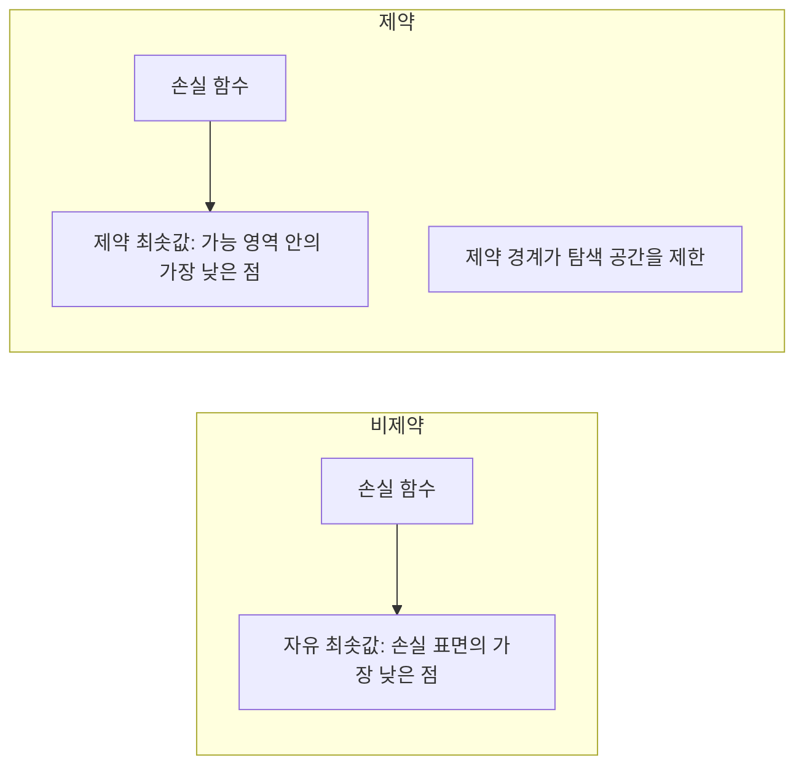
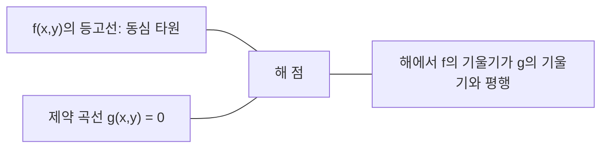

# 볼록 최적화 (Convex Optimization)

> 볼록 문제는 골짜기가 하나뿐입니다. 신경망은 수백만 개입니다. 그 차이를 아는 것이 중요합니다.

**Type:** Build
**Language:** Python
**Prerequisites:** Phase 1, Lessons 04 (Calculus for ML), 08 (Optimization)
**Time:** ~90 minutes

## 학습 목표 (Learning Objectives)

- 정의, 2차 도함수, 헤세 기준을 사용해 함수가 볼록인지 판정합니다
- 뉴턴법을 구현하고 이차 수렴을 경사하강법과 비교합니다
- 라그랑주 승수로 제약 최적화 문제를 풀고 KKT 조건을 해석합니다
- 신경망 손실 지형이 비볼록인데도 SGD가 좋은 해를 찾는 이유를 설명합니다

## 문제 상황 (The Problem)

레슨 08에서 경사하강법, 모멘텀, Adam을 배웠습니다. 그 최적화기들은 어떤 표면에서도 내리막을 걷습니다. 하지만 보장은 없습니다. 비볼록 지형에서 경사하강법은 나쁜 국소 최솟값에 머물거나, 안장점에 갇히거나, 영원히 진동할 수 있습니다. 신경망이 비볼록이고 대안이 없어서 그래도 씁니다.

하지만 머신러닝의 많은 문제는 볼록합니다. 선형 회귀, 로지스틱 회귀, SVM, LASSO, 릿지 회귀. 이들에겐 더 강한 것이 있습니다: 수학적 보장이 있는 최적화. 볼록 문제는 골짜기가 정확히 하나입니다. 내리막을 걷는 어떤 알고리즘도 전역 최솟값에 도달합니다. 재시작이 필요 없습니다. 학습률 스케줄도 없습니다. 기도도 필요 없습니다.

볼록성을 이해하면 세 가지가 됩니다. 첫째, 문제가 쉬운지(볼록) 어려운지(비볼록) 알려 줍니다. 둘째, 볼록 문제에 뉴턴법 같은 더 빠른 도구를 줍니다. 셋째, ML 전반에 나타나는 개념을 설명합니다: 제약으로서의 정규화, SVM의 쌍대성, 그리고 볼록성이 주는 모든 좋은 성질을 깨뜨리는데도 딥러닝이 동작하는 이유.

## 핵심 개념 (The Concept)

### 볼록 집합

집합 S는 S의 임의의 두 점에 대해, 그 사이의 선분이 S 안에 완전히 들어가면 볼록입니다.

| Convex sets | Not convex |
|---|---|
| **Rectangle**: 내부 임의의 두 점을 선분으로 이어도 집합 안에 머뭅니다 | **Star/crescent shape**: 두 내부 점 사이의 선분이 집합 밖으로 나갈 수 있습니다 |
| **Triangle**: 모든 내부 점에 같은 성질이 성립합니다 | **Donut/annulus**: 구멍 때문에 일부 선분이 집합을 떠납니다 |
| 임의의 두 점 사이 선분이 집합 안에 머뭅니다 | 일부 점 쌍의 선분이 집합을 벗어납니다 |

형식적 판정: S의 임의의 점 x, y와 [0, 1]의 임의의 t에 대해, 점 tx + (1-t)y도 S에 있습니다.

볼록 집합의 예:
- 직선, 평면, 전체 R^n
- 공 (원, 구, 초구)
- 반공간: {x : a^T x <= b}
- 임의의 개수의 볼록 집합의 교집합

비볼록 집합의 예:
- 도넛 (환형)
- 서로 겹치지 않는 두 원의 합집합
- "움푹한 곳"이나 "구멍"이 있는 임의의 집합

### 볼록 함수

함수 f는 정의역이 볼록 집합이고, 정의역의 임의의 두 점 x, y와 [0, 1]의 임의의 t에 대해 다음이 성립하면 볼록입니다:

```
f(tx + (1-t)y) <= t*f(x) + (1-t)*f(y)
```

기하학적으로: 그래프 위의 임의의 두 점 사이 선분이 그래프 위 또는 위에 놓입니다.

| Property | Convex function | Non-convex function |
|---|---|---|
| **Line segment test** | 그래프 위의 임의의 두 점 사이 선분이 곡선 **위 또는 위**에 놓입니다 | 일부 점 사이 선분이 곡선 **아래**로 내려갑니다 |
| **Shape** | 위로 휘는 단일 그릇/골짜기 | 혼합 곡률의 여러 봉우리와 골짜기 |
| **Local minima** | 모든 국소 최솟값이 전역 최솟값 | 서로 다른 높이의 여러 국소 최솟값이 있을 수 있음 |

흔한 볼록 함수:
- f(x) = x^2 (포물선)
- f(x) = |x| (절댓값)
- f(x) = e^x (지수)
- f(x) = max(0, x) (ReLU, 조각별 선형)
- f(x) = -log(x) for x > 0 (음의 로그)
- 임의의 선형 함수 f(x) = a^T x + b (볼록이면서 오목)

### 볼록성 판정

세 가지 실용적 검사, 쉬운 것부터 엄밀한 것까지.

**검사 1: 2차 도함수 검사 (1D).** 모든 x에 대해 f''(x) >= 0이면 f는 볼록입니다.

- f(x) = x^2: f''(x) = 2 >= 0. 볼록.
- f(x) = x^3: f''(x) = 6x. x < 0에서 음수. 비볼록.
- f(x) = e^x: f''(x) = e^x > 0. 볼록.

**검사 2: 헤세 검사 (다변수).** 모든 x에서 헤세 행렬 H(x)가 양의 준정부호이면 f는 볼록입니다. 헤세는 2차 편도함수의 행렬입니다.

**검사 3: 정의 검사.** 부등식 f(tx + (1-t)y) <= t*f(x) + (1-t)*f(y)를 직접 확인합니다. 도함수 계산이 어려운 함수에 유용합니다.

### 왜 볼록성이 중요한가

볼록 최적화의 중심 정리:

**볼록 함수에서 모든 국소 최솟값은 전역 최솟값이다.**

즉 경사하강법이 갇힐 수 없습니다. 어떤 내리막 길도 같은 답으로 이어집니다. 알고리즘은 최적해로 수렴함이 보장됩니다.



결과:
- 무작위 재시작이 필요 없음
- 정교한 학습률 스케줄이 필요 없음
- 수렴 증명이 가능함 (속도는 함수 성질에 의존)
- 해가 유일함 (평평한 구간 제외)

### ML에서의 볼록 vs 비볼록

| Problem | Convex? | Why |
|---------|---------|-----|
| Linear regression (MSE) | Yes | 손실이 가중치에 대해 이차 |
| Logistic regression | Yes | 로그 손실이 가중치에 대해 볼록 |
| SVM (hinge loss) | Yes | 선형 함수들의 최댓값 |
| LASSO (L1 regression) | Yes | 볼록 함수의 합은 볼록 |
| Ridge regression (L2) | Yes | 이차 + 이차 = 볼록 |
| Neural network (any loss) | No | 비선형 활성화가 비볼록 지형을 만듦 |
| k-means clustering | No | 이산 할당 단계 |
| Matrix factorization | No | 미지수의 곱 |

볼록 손실을 가진 선형 모델은 볼록입니다. 비선형 활성화가 있는 은닉층을 더하는 순간 볼록성이 깨집니다.

### 헤세 행렬

함수 f: R^n -> R의 헤세 H는 n x n의 2차 편도함수 행렬입니다.

```
H[i][j] = d^2 f / (dx_i dx_j)
```

f(x, y) = x^2 + 3xy + y^2에 대해:

```
df/dx = 2x + 3y       d^2f/dx^2 = 2      d^2f/dxdy = 3
df/dy = 3x + 2y       d^2f/dydx = 3      d^2f/dy^2 = 2

H = [ 2  3 ]
    [ 3  2 ]
```

헤세는 곡률을 알려 줍니다:
- 고유값이 모두 양수: 모든 방향에서 위로 휨 (그 점에서 볼록)
- 고유값이 모두 음수: 모든 방향에서 아래로 휨 (오목, 국소 최댓값)
- 부호가 섞임: 안장점 (어떤 방향은 위, 어떤 방향은 아래)
- 고유값 0: 그 방향에서 평평 (퇴화)

볼록성이려면 헤세가 한 점이 아니라 모든 곳에서 양의 준정부호(모든 고유값 >= 0)여야 합니다.

### 뉴턴법

경사하강법은 1차 정보(기울기)를 사용합니다. 뉴턴법은 2차 정보(헤세)를 사용합니다. 현재 점에서 이차 근사를 맞추고 그 이차의 최솟값으로 바로 점프합니다.

```
Update rule:
  x_new = x - H^(-1) * gradient

Compare to gradient descent:
  x_new = x - lr * gradient
```

뉴턴법은 스칼라 학습률을 역헤세로 바꿉니다. 국소 곡률에 따라 스텝 크기와 방향을 자동으로 조정합니다.



장점:
- 최솟값 근처에서 이차 수렴 (매 단계 오차가 제곱)
- 튜닝할 학습률이 없음
- 스케일 불변 (파라미터화 방식과 무관하게 동작)

단점:
- 헤세 계산에 O(n^2) 메모리와 역변환에 O(n^3)
- 가중치 100만 개인 신경망이면 10^12개 항목과 10^18 연산
- 딥러닝에는 비실용적

### 제약 최적화

비제약 최적화: 모든 x에 대해 f(x)를 최소화.
제약 최적화: 제약 하에서 f(x)를 최소화.

실제 문제에는 제약이 있습니다. 비용을 최소화하고 싶지만 예산이 한정됩니다. 오차를 최소화하고 싶지만 모델 복잡도가 제한됩니다.



### 라그랑주 승수

라그랑주 승수법은 제약 문제를 비제약 문제로 바꿉니다.

문제: g(x) = 0 하에서 f(x)를 최소화.

해: 새 변수(라그랑주 승수 lambda)를 도입하고 비제약 문제를 풉니다:

```
L(x, lambda) = f(x) + lambda * g(x)
```

해에서 L의 기울기는 0입니다:

```
dL/dx = df/dx + lambda * dg/dx = 0
dL/dlambda = g(x) = 0
```

기하학적 직관: 제약 최솟값에서 f의 기울기는 제약 g의 기울기와 평행해야 합니다. 평행하지 않으면 제약 표면을 따라 움직여 f를 더 줄일 수 있습니다.



예: x + y = 1 하에서 f(x,y) = x^2 + y^2를 최소화.

```
L = x^2 + y^2 + lambda(x + y - 1)

dL/dx = 2x + lambda = 0  =>  x = -lambda/2
dL/dy = 2y + lambda = 0  =>  y = -lambda/2
dL/dlambda = x + y - 1 = 0

From first two: x = y
Substituting: 2x = 1, so x = y = 0.5, lambda = -1
```

원점에서 직선 x + y = 1까지 가장 가까운 점은 (0.5, 0.5)입니다.

### KKT 조건

Karush-Kuhn-Tucker 조건은 라그랑주 승수를 부등식 제약으로 확장합니다.

문제: i = 1, ..., m에 대해 g_i(x) <= 0 하에서 f(x)를 최소화.

KKT 조건 (최적성의 필요조건):

```
1. Stationarity:    df/dx + sum(lambda_i * dg_i/dx) = 0
2. Primal feasibility:  g_i(x) <= 0  for all i
3. Dual feasibility:    lambda_i >= 0  for all i
4. Complementary slackness:  lambda_i * g_i(x) = 0  for all i
```

상보 여유성이 핵심 통찰입니다: 제약이 활성(g_i = 0, 해가 경계에 있음)이거나 승수가 0(제약이 중요하지 않음)입니다. 해에 영향을 주지 않는 제약은 lambda = 0입니다.

KKT 조건은 SVM의 중심입니다. 서포트 벡터는 제약이 활성인(lambda > 0) 데이터 점입니다. 다른 모든 데이터 점은 lambda = 0이고 결정 경계에 영향을 주지 않습니다.

### 제약 최적화로서의 정규화

L1과 L2 정규화는 임의 트릭이 아닙니다. 위장된 제약 최적화 문제입니다.

**L2 정규화 (Ridge):**

```
minimize  Loss(w)  subject to  ||w||^2 <= t

Equivalent unconstrained form:
minimize  Loss(w) + lambda * ||w||^2
```

제약 ||w||^2 <= t는 공(2D에서 원, 3D에서 구)을 정의합니다. 해는 손실 등고선이 이 공에 처음 닿는 곳입니다.

**L1 정규화 (LASSO):**

```
minimize  Loss(w)  subject to  ||w||_1 <= t

Equivalent unconstrained form:
minimize  Loss(w) + lambda * ||w||_1
```

제약 ||w||_1 <= t는 다이아몬드(2D에서 회전한 정사각형)를 정의합니다.

| Property | L2 constraint (circle) | L1 constraint (diamond) |
|---|---|---|
| **Constraint shape** | 원 (고차원에서 구) | 다이아몬드 (2D에서 회전한 정사각형) |
| **Where loss contour touches** | 매끄러운 경계 — 원 위의 임의 점 | 모서리 — 축에 정렬 |
| **Solution behavior** | 가중치가 작지만 0이 아님 | 일부 가중치가 정확히 0 (희소) |
| **Result** | 가중치 축소 | 특성 선택 |

이것이 L1이 희소 모델(특성 선택)을 만들고 L2는 가중치만 축소하는 이유입니다. 다이아몬드는 축에 정렬된 모서리를 가집니다. 손실 등고선이 모서리에 닿을 가능성이 더 높아, 하나 이상의 가중치를 정확히 0으로 둡니다.

### 쌍대성

모든 제약 최적화 문제(원문제)에는 동반 문제(쌍대문제)가 있습니다. 볼록 문제에서 원문제와 쌍대문제는 같은 최적값을 가집니다. 이것이 강한 쌍대성입니다.

라그랑주 쌍대 함수:

```
Primal: minimize f(x) subject to g(x) <= 0
Lagrangian: L(x, lambda) = f(x) + lambda * g(x)
Dual function: d(lambda) = min_x L(x, lambda)
Dual problem: maximize d(lambda) subject to lambda >= 0
```

왜 쌍대성이 중요한가:
- 쌍대문제가 원문제보다 풀기 쉬울 때가 있습니다
- SVM은 쌍대 형태로 풀리며, 데이터 점 사이 내적에만 의존합니다(커널 트릭을 가능하게 함)
- 쌍대는 원문제 최적값의 하한을 제공해 해의 품질을 확인하는 데 유용합니다

SVM의 경우 구체적으로:

```
Primal: find w, b that maximize the margin 2/||w|| subject to
        y_i(w^T x_i + b) >= 1 for all i

Dual:   maximize sum(alpha_i) - 0.5 * sum_ij(alpha_i * alpha_j * y_i * y_j * x_i^T x_j)
        subject to alpha_i >= 0 and sum(alpha_i * y_i) = 0

The dual only involves dot products x_i^T x_j.
Replace x_i^T x_j with K(x_i, x_j) to get the kernel trick.
```

### 비볼록성에도 딥러닝이 동작하는 이유

신경망 손실 함수는 극도로 비볼록입니다. 고전적 기준으로는 최적화가 실패해야 합니다. 그런데 확률적 경사하강법은 좋은 해를 안정적으로 찾습니다. 여러 요인이 이를 설명합니다.

**대부분의 국소 최솟값은 충분히 좋습니다.** 고차원 공간에서 무작위 임계점(기울기가 0)은 국소 최솟값이 아니라 압도적으로 안장점입니다. 존재하는 소수의 국소 최솟값은 손실값이 전역 최솟값에 가까운 경향이 있습니다. 파라미터 공간이 수백만 차원일 때 끔찍한 국소 최솟값에 갇힐 가능성은 극히 낮습니다.

**진짜 장애물은 국소 최솟값이 아니라 안장점입니다.** n개 파라미터 함수에서 안장점은 양의·음의 곡률 방향이 섞여 있습니다. 고차원의 무작위 임계점에서 모든 n개 고유값이 양수일(국소 최솟값) 확률은 대략 2^(-n)입니다. 거의 모든 임계점이 안장점입니다. SGD의 노이즈가 탈출을 돕습니다.

**과파라미터가 지형을 매끄럽게 만듭니다.** 학습 예보다 파라미터가 많은 네트워크는 손실 표면이 더 매끄럽고 연결되어 있습니다. 더 넓은 네트워크는 나쁜 국소 최솟값이 적습니다. 직관에 반하지만 경험적으로 일관됩니다.

**손실 지형 구조:**

| Property | Low-dimensional space | High-dimensional space |
|---|---|---|
| **Landscape** | 많은 고립된 봉우리와 골짜기 | 매끄럽게 연결된 골짜기 |
| **Minima** | 많은 고립된 국소 최솟값 | 나쁜 국소 최솟값이 적고, 대부분이 준최적 |
| **Navigation** | 전역 최솟값을 찾기 어려움 | 많은 길이 좋은 해로 이어짐 |
| **Critical points** | 국소 최솟값과 안장점이 섞임 | 압도적으로 안장점, 국소 최솟값 아님 |

**확률적 노이즈가 암묵적 정규화로 작용합니다.** 미니배치 SGD가 더하는 노이즈는 날카로운 최솟값에 정착하는 것을 막습니다. 날카로운 최솟값은 과적합하고, 평평한 최솟값은 일반화합니다. 노이즈는 최적화를 손실 지형의 평평한 영역으로 편향합니다.

### 실무의 2차 방법

순수 뉴턴법은 대형 모델에 비실용적입니다. 여러 근사가 2차 정보를 쓸 수 있게 만듭니다.

**L-BFGS (Limited-memory BFGS):** 최근 m개의 기울기 차이로 역헤세를 근사합니다. O(n^2) 대신 O(mn) 메모리가 필요합니다. ~10,000 파라미터까지 문제에 잘 동작합니다. 고전 ML(로지스틱 회귀, CRF)에 쓰이지만 딥러닝에는 아닙니다.

**자연 기울기:** 표준 헤세 대신 피셔 정보 행렬(로그 가능도의 기댓값 헤세)을 사용합니다. 확률 분포의 기하를 반영합니다. K-FAC(Kronecker-Factored Approximate Curvature)는 피셔 행렬을 크로네커 곱으로 근사해 신경망에 실용적으로 만듭니다.

**헤세 프리 최적화:** 공액 기울기로 Hx = g를 풀어 H를 결코 구성하지 않습니다. 자동미분으로 O(n)에 계산할 수 있는 헤세-벡터 곱만 필요합니다.

**대각 근사:** Adam의 2차 모멘트는 헤세 대각의 대각 근사입니다. AdaHessian은 Hutchinson 추정기로 실제 헤세 대각 원소를 사용해 이를 확장합니다.

| Method | Memory | Per-step cost | When to use |
|--------|--------|--------------|-------------|
| Gradient descent | O(n) | O(n) | 기준선, 대형 모델 |
| Newton's method | O(n^2) | O(n^3) | 작은 볼록 문제 |
| L-BFGS | O(mn) | O(mn) | 중간 볼록 문제 |
| Adam | O(n) | O(n) | 딥러닝 기본 |
| K-FAC | O(n) | 층당 O(n) | 연구, 대형 배치 학습 |

```figure
convex-vs-nonconvex
```

## 구현하기 (Build It)

### Step 1: 볼록성 검사기

점을 샘플링하고 정의를 확인해 볼록성을 경험적으로 검사하는 함수를 만듭니다.

```python
import random
import math

def check_convexity(f, dim, bounds=(-5, 5), samples=1000):
    violations = 0
    for _ in range(samples):
        x = [random.uniform(*bounds) for _ in range(dim)]
        y = [random.uniform(*bounds) for _ in range(dim)]
        t = random.uniform(0, 1)
        mid = [t * xi + (1 - t) * yi for xi, yi in zip(x, y)]
        lhs = f(mid)
        rhs = t * f(x) + (1 - t) * f(y)
        if lhs > rhs + 1e-10:
            violations += 1
    return violations == 0, violations
```

### Step 2: 2D 뉴턴법

명시적 헤세를 사용해 뉴턴법을 구현합니다. 수렴 속도를 경사하강법과 비교합니다.

```python
def newtons_method(f, grad_f, hessian_f, x0, steps=50, tol=1e-12):
    x = list(x0)
    history = [x[:]]
    for _ in range(steps):
        g = grad_f(x)
        H = hessian_f(x)
        det = H[0][0] * H[1][1] - H[0][1] * H[1][0]
        if abs(det) < 1e-15:
            break
        H_inv = [
            [H[1][1] / det, -H[0][1] / det],
            [-H[1][0] / det, H[0][0] / det],
        ]
        dx = [
            H_inv[0][0] * g[0] + H_inv[0][1] * g[1],
            H_inv[1][0] * g[0] + H_inv[1][1] * g[1],
        ]
        x = [x[0] - dx[0], x[1] - dx[1]]
        history.append(x[:])
        if sum(gi ** 2 for gi in g) < tol:
            break
    return history
```

### Step 3: 라그랑주 승수 해법

라그랑주에 대한 경사하강법으로 제약 최적화를 풉니다.

```python
def lagrange_solve(f_grad, g_val, g_grad, x0, lr=0.01,
                   lr_lambda=0.01, steps=5000):
    x = list(x0)
    lam = 0.0
    history = []
    for _ in range(steps):
        fg = f_grad(x)
        gv = g_val(x)
        gg = g_grad(x)
        x = [
            xi - lr * (fgi + lam * ggi)
            for xi, fgi, ggi in zip(x, fg, gg)
        ]
        lam = lam + lr_lambda * gv
        history.append((x[:], lam, gv))
    return history
```

### Step 4: 1차 vs 2차 비교

같은 이차 함수에서 경사하강법과 뉴턴법을 실행합니다. 수렴까지의 단계를 셉니다.

```python
def quadratic(x):
    return 5 * x[0] ** 2 + x[1] ** 2

def quadratic_grad(x):
    return [10 * x[0], 2 * x[1]]

def quadratic_hessian(x):
    return [[10, 0], [0, 2]]
```

뉴턴법은 1단계에 수렴합니다(이차에 대해 정확). 경사하강법은 헤세 고유값이 5배 달라 길쭉한 골짜기가 생겨 수백 단계가 걸립니다.

## 실용 활용 (Use It)

볼록성 분석은 ML 모델과 해법을 고를 때 바로 적용됩니다.

볼록 문제(로지스틱 회귀, SVM, LASSO)에 대해:
- 전용 해법을 쓰세요 (liblinear, CVXPY, scipy.optimize.minimize with method='L-BFGS-B')
- 유일한 전역 해를 기대하세요
- 2차 방법이 실용적이고 빠릅니다

비볼록 문제(신경망)에 대해:
- 1차 방법을 쓰세요 (SGD, Adam)
- 해가 초기화와 무작위성에 의존함을 받아들이세요
- 과파라미터, 노이즈, 학습률 스케줄을 암묵적 정규화로 쓰세요
- 전역 최솟값을 찾는 데 시간을 낭비하지 마세요. 좋은 국소 최솟값이면 충분합니다.

```python
from scipy.optimize import minimize

result = minimize(
    fun=lambda w: sum((y - X @ w) ** 2) + 0.1 * sum(w ** 2),
    x0=np.zeros(d),
    method='L-BFGS-B',
    jac=lambda w: -2 * X.T @ (y - X @ w) + 0.2 * w,
)
```

SVM에서는 쌍대 형식이 커널 트릭을 가능하게 합니다:

```python
from sklearn.svm import SVC

svm = SVC(kernel='rbf', C=1.0)
svm.fit(X_train, y_train)
print(f"Support vectors: {svm.n_support_}")
```

## 연습 문제 (Exercises)

1. **볼록성 갤러리.** 검사기로 다음 함수의 볼록성을 판정하세요: f(x) = x^4, f(x) = sin(x), f(x,y) = x^2 + y^2, f(x,y) = x*y, f(x) = max(x, 0). 각 결과가 왜 말이 되는지 설명하세요.

2. **뉴턴 vs 경사하강법 레이스.** 시작점 (10, 10)에서 f(x,y) = 50*x^2 + y^2에 두 방법을 실행하세요. 손실 < 1e-10에 도달하려면 각각 몇 단계가 필요한가요? 조건수(헤세 최대/최소 고유값 비)가 커지면 경사하강법에 무슨 일이 생기나요?

3. **라그랑주 승수 기하.** x + 2y = 4 하에서 f(x,y) = (x-3)^2 + (y-3)^2를 최소화하세요. 해에서 f의 기울기가 g의 기울기와 평행한지 확인해 해를 검증하세요.

4. **정규화 제약.** L1-제약 최적화를 구현하세요: |x| + |y| <= 1 하에서 (x-3)^2 + (y-2)^2를 최소화. 해의 한 좌표가 0임을 보이세요(다이아몬드 제약의 희소성).

5. **헤세 고유값 분석.** Rosenbrock 함수의 헤세를 (1,1)과 (-1,1)에서 계산하세요. 두 점의 고유값을 계산하세요. 최솟값에서의 곡률과 멀리에서의 곡률에 대해 고유값이 무엇을 말하나요?

## 핵심 용어 (Key Terms)

| Term | What it means |
|------|---------------|
| Convex set | 집합 안의 임의의 두 점 사이 선분이 집합 안에 머무는 집합 |
| Convex function | 그래프 위의 임의의 두 점 사이 선분이 그래프 위 또는 위에 놓이는 함수. 동등하게, 헤세가 모든 곳에서 양의 준정부호 |
| Local minimum | 근처의 모든 점보다 낮은 점. 볼록 함수에서는 모든 국소 최솟값이 전역 최솟값 |
| Global minimum | 전체 정의역에서 함수의 가장 낮은 점 |
| Hessian matrix | 모든 2차 편도함수의 행렬. 곡률 정보를 인코딩 |
| Positive semidefinite | 고유값이 모두 비음수인 행렬. "2차 도함수 >= 0"의 다차원 대응 |
| Condition number | 헤세의 최대/최소 고유값 비. 조건수가 크면 길쭉한 골짜기와 느린 경사하강법 |
| Newton's method | 역헤세로 스텝 방향과 크기를 정하는 2차 최적화기. 최솟값 근처에서 이차 수렴 |
| Lagrange multiplier | 제약 최적화 문제를 비제약으로 바꾸기 위해 도입하는 변수 |
| KKT conditions | 부등식 제약에서 최적성의 필요조건. 라그랑주 승수를 일반화 |
| Complementary slackness | 해에서 제약이 활성이거나 그 승수가 0. 둘 다 0이 아닌 경우는 없음 |
| Duality | 모든 제약 문제에 동반 쌍대문제가 있음. 볼록 문제에서는 둘 다 같은 최적값 |
| Strong duality | 원문제와 쌍대문제 최적값이 같음. Slater 조건을 만족하는 볼록 문제에서 성립 |
| L-BFGS | 전체 헤세 대신 최근 m개 기울기 차이를 저장하는 근사 2차 방법 |
| Saddle point | 기울기는 0이지만 어떤 방향에서는 최솟값, 어떤 방향에서는 최댓값인 점 |
| Overparameterization | 학습 예보다 많은 파라미터를 사용. 손실 지형을 매끄럽게 하고 나쁜 국소 최솟값을 줄임 |

## 참고 자료 (Further Reading)

- [Boyd & Vandenberghe: Convex Optimization](https://web.stanford.edu/~boyd/cvxbook/) - 표준 교재, 온라인 무료
- [Bottou, Curtis, Nocedal: Optimization Methods for Large-Scale Machine Learning (2018)](https://arxiv.org/abs/1606.04838) - 볼록 최적화 이론과 딥러닝 실무를 잇는 다리
- [Choromanska et al.: The Loss Surfaces of Multilayer Networks (2015)](https://arxiv.org/abs/1412.0233) - 비볼록 신경망 지형이 생각보다 나쁘지 않은 이유
- [Nocedal & Wright: Numerical Optimization](https://link.springer.com/book/10.1007/978-0-387-40065-5) - 뉴턴법, L-BFGS, 제약 최적화의 포괄적 참고서
