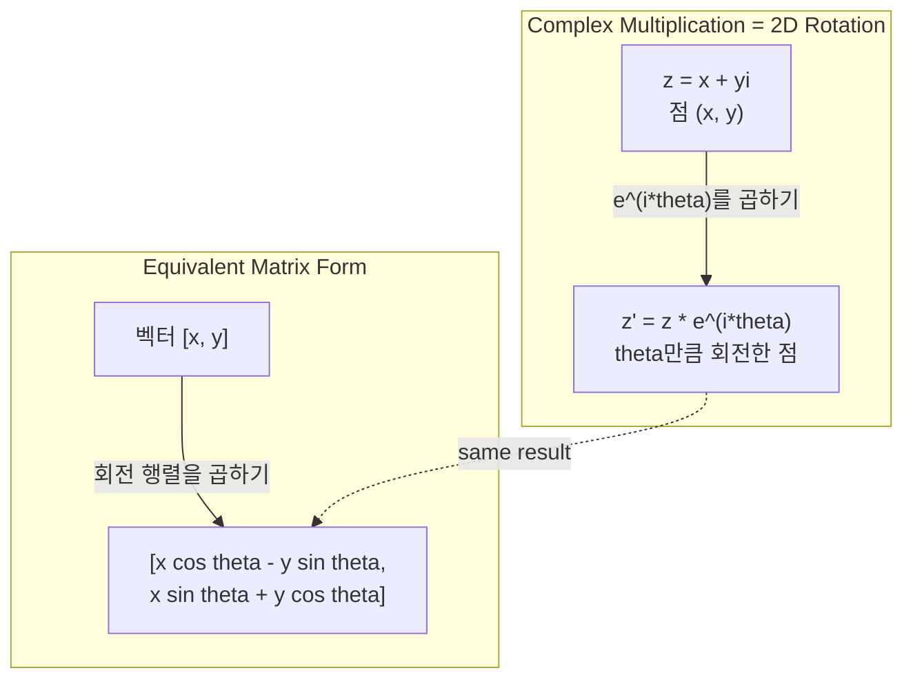
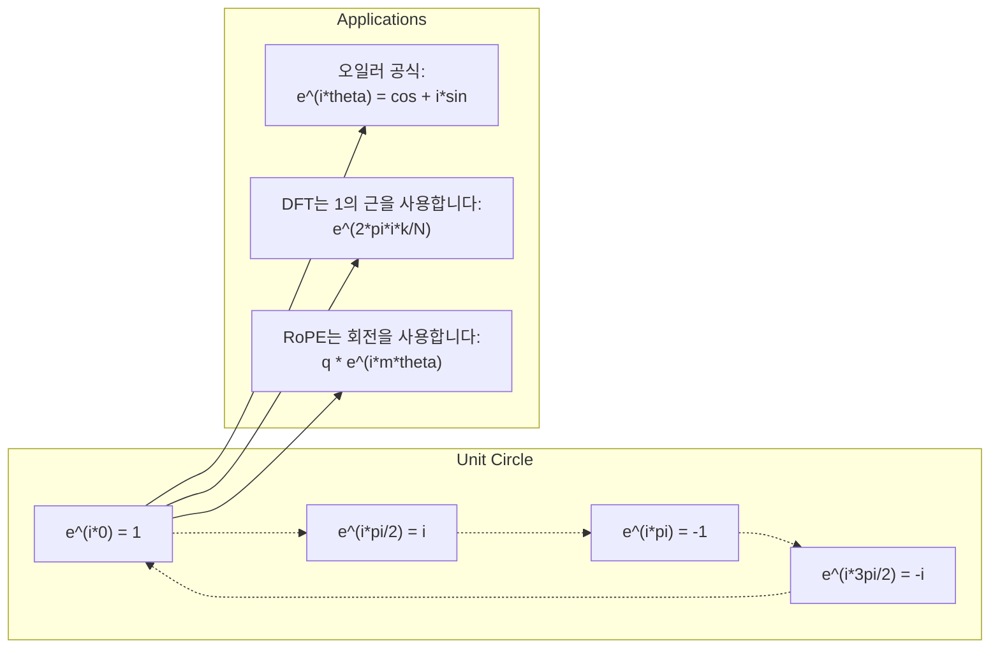

# AI를 위한 복소수

> -1의 제곱근은 허상이 아닙니다. 이는 회전, 주파수, 그리고 신호 처리의 절반을 이해하는 핵심입니다.

**유형:** Learn
**언어:** Python
**선수 요건:** 1단계, 01-04강 (선형 대수, 미적분)
**시간:** 약 60분

## 학습 목표

- 직교 좌표 형식과 극 좌표 형식 모두에서 복소수 연산(더하기, 곱하기, 나누기, 켤레)을 수행해 보세요
- 오일러 공식을 적용하여 복소 지수 함수와 삼각 함수를 서로 변환해 보세요
- 복소 단위근을 사용하여 이산 푸리에 변환(DFT)을 구현해 보세요
- 복소수 회전이 트랜스포머의 RoPE 및 사인 위치 인코딩의 기초가 되는 방식을 설명해 보세요

## 문제점

푸리에 변환에 관한 논문을 열면 `i`이 Everywhere에 있습니다. 트랜스포머 위치 인코딩을 보면 서로 다른 주파수에서 `sin`과 `cos`을 볼 수 있습니다. 이는 복소 지수 함수의 실수부와 허수부입니다. 양자 컴퓨팅에 대해 읽으면 모든 것이 복소 벡터 공간으로 표현되어 있는 것을 발견하게 됩니다.

복소수는 추상적으로 보입니다. -1의 제곱근으로 구축된 수 체계는 수학적인 속임수처럼 느껴집니다. 하지만 이는 속임수가 아닙니다. 이는 회전과 진동의 자연스러운 언어입니다. 무언가가 회전하거나, 진동하거나, 진자 운동할 때마다 복소수가 올바른 도구입니다.

복소수를 이해하지 못하면 이산 푸리에 변환(DFT)을 이해할 수 없습니다. FFT를 이해할 수 없습니다. 최신 언어 모델에서 RoPE (회전 위치 임베딩)가 작동하는 방식을 이해할 수 없습니다. 원본 트랜스포머 논문의 사인 위치 인코딩이 왜 그 주파수를 사용하는지 이해할 수 없습니다.

이 강의는 기초부터 복소수 연산을 구축하고, 이를 기하학과 연결하며, 기계 학습에서 복소수가 정확히 어디에 나타나는지 보여줍니다.

## 개념

### 복소수란 무엇일까요?

복소수는 두 부분으로 구성됩니다: 실수부와 허수부입니다.

```
z = a + bi

where:
  a is the real part
  b is the imaginary part
  i is the imaginary unit, defined by i^2 = -1
```

이것이 전부입니다. 수직선을 평면으로 확장하는 것입니다. 실수는 한 축에 위치합니다. 허수는 다른 축에 위치합니다. 모든 복소수는 이 평면 위의 한 점입니다.

### 복소수 연산

**덧셈.** 실수 부분을 더하고, 허수 부분을 더합니다.

```
(a + bi) + (c + di) = (a + c) + (b + d)i

Example: (3 + 2i) + (1 + 4i) = 4 + 6i
```

**곱셈.** 분배 법칙을 사용하며 i^2 = -1임을 기억하세요.

```
(a + bi)(c + di) = ac + adi + bci + bdi^2
                 = ac + adi + bci - bd
                 = (ac - bd) + (ad + bc)i

Example: (3 + 2i)(1 + 4i) = 3 + 12i + 2i + 8i^2
                            = 3 + 14i - 8
                            = -5 + 14i
```

**켤레 복소수.** 허수 부분의 부호를 반전시킵니다.

```
conjugate of (a + bi) = a - bi
```

복소수와 그 켤레 복소수의 곱은 항상 실수입니다:

```
(a + bi)(a - bi) = a^2 + b^2
```

**나눗셈.** 분자와 분모에 분모의 켤레 복소수를 곱합니다.

```
(a + bi) / (c + di) = (a + bi)(c - di) / (c^2 + d^2)
```

이렇게 하면 분모의 허수 부분이 사라져 깔끔한 복소수를 얻을 수 있습니다.

### 복소 평면

복소 평면은 모든 복소수를 2D 점으로 매핑합니다. 가로축은 실수축, 세로축은 허수축입니다.

```
z = 3 + 2i  corresponds to the point (3, 2)
z = -1 + 0i corresponds to the point (-1, 0) on the real axis
z = 0 + 4i  corresponds to the point (0, 4) on the imaginary axis
```

복소수는 원점에서의 점이자 벡터로 동시에 해석됩니다. 이러한 이중 해석이 복소수를 기하학에 유용하게 만듭니다.

### 극좌표 형식

평면의 모든 점은 원점으로부터의 거리와 양의 실수축으로부터의 각도로 표현할 수 있습니다.

```
z = r * (cos(theta) + i*sin(theta))

where:
  r = |z| = sqrt(a^2 + b^2)     (magnitude, or modulus)
  theta = atan2(b, a)             (phase, or argument)
```

직사각형 형식(a + bi)은 덧셈에 적합합니다. 극좌표 형식(r, theta)은 곱셈에 적합합니다.

**극좌표 형식의 곱셈.** 크기를 곱하고, 각도를 더합니다.

```
z1 = r1 * e^(i*theta1)
z2 = r2 * e^(i*theta2)

z1 * z2 = (r1 * r2) * e^(i*(theta1 + theta2))
```

이것이 복소수가 회전 연산에 완벽한 이유입니다. 크기가 1인 복소수를 곱하는 것은 순수한 회전입니다.

### 오일러 공식

복소 지수와 삼각함수를 연결하는 다리입니다:

```
e^(i*theta) = cos(theta) + i*sin(theta)
```

이 공식은 이 강의에서 가장 중요합니다. theta = pi일 때:

```
e^(i*pi) = cos(pi) + i*sin(pi) = -1 + 0i = -1

Therefore: e^(i*pi) + 1 = 0
```

5개의 기본 상수(e, i, pi, 1, 0)가 하나의 방정식으로 연결됩니다.

### ML에서 오일러 공식이 중요한 이유

오일러 공식에 따르면 `e^(i*theta)`는 theta가 변함에 따라 단위 원을 그립니다. theta = 0일 때 (1, 0)에 위치합니다. theta = pi/2일 때 (0, 1)에 위치합니다. theta = pi일 때 (-1, 0)에 위치합니다. theta = 3*pi/2일 때 (0, -1)에 위치합니다. 완전한 회전은 theta = 2*pi입니다.

이는 복소 지수가 곧 회전임을 의미합니다. 그리고 회전은 신호 처리와 ML 전반에 걸쳐 존재합니다.

### 2D 회전과의 연결

복소수 (x + yi)에 e^(i*theta)를 곱하면 점 (x, y)가 원점을 중심으로 각도 theta만큼 회전합니다.

```
Rotation via complex multiplication:
  (x + yi) * (cos(theta) + i*sin(theta))
  = (x*cos(theta) - y*sin(theta)) + (x*sin(theta) + y*cos(theta))i

Rotation via matrix multiplication:
  [cos(theta)  -sin(theta)] [x]   [x*cos(theta) - y*sin(theta)]
  [sin(theta)   cos(theta)] [y] = [x*sin(theta) + y*cos(theta)]
```

이들은 동일한 결과를 산출합니다. 복소수 곱셈은 곧 2D 회전입니다. 회전 행렬은 단지 행렬 표기로 작성된 복소수 곱셈일 뿐입니다.



### 페이저와 회전 신호

복소 지수 e^(i*omega*t)는 각 주파수 omega로 단위 원을 따라 회전하는 점입니다. t가 증가하면 이 점은 원을 따라 이동합니다.

이 회전하는 점의 실수 부분은 cos(omega*t)입니다. 허수 부분은 sin(omega*t)입니다. 사인파 신호는 회전하는 복소수의 그림자입니다.

```
e^(i*omega*t) = cos(omega*t) + i*sin(omega*t)

Real part:      cos(omega*t)    -- a cosine wave
Imaginary part: sin(omega*t)    -- a sine wave
```

이것이 페이저 표현입니다. 흔들리는 사인파를 추적하는 대신, 매끄럽게 회전하는 화살표를 추적합니다. 위상 변화는 각도 오프셋이 되고, 진폭 변화는 크기 변화가 됩니다. 신호의 합은 벡터 합이 됩니다.

### 1의 근

N차 1의 근은 단위 원 위에 균등하게 간격이 배치된 N개의 점입니다:

```
w_k = e^(2*pi*i*k/N)    for k = 0, 1, 2, ..., N-1
```

N = 4일 때, 근은 1, i, -1, -i (나침반의 네 방향)입니다.
N = 8일 때, 나침반의 네 방향과 네 대각선 방향을 얻습니다.

1의 근은 이산 푸리에 변환(DFT)의 기초입니다. DFT는 신호를 이 N개의 균등 간격 주파수 성분으로 분해합니다.

### DFT와의 연결

신호 x[0], x[1], ..., x[N-1]의 이산 푸리에 변환은 다음과 같습니다:

```
X[k] = sum_{n=0}^{N-1} x[n] * e^(-2*pi*i*k*n/N)
```

각 X[k]는 신호가 k번째 1의 근(주파수 k의 복소 사인파)과 얼마나 상관되는지를 측정합니다. DFT는 신호를 N개의 회전하는 페이저로 분해하고, 각각의 진폭과 위상을 알려줍니다.

### i가 허수인 이유

"imaginary"라는 단어는 역사적 우연입니다. 데카르트는 이를 경멸적으로 사용했습니다. 하지만 i는 사람들이 처음에 거부했던 음수보다 더 상상적인 것이 아닙니다. 음수는 "3에서 무엇을 빼면 5가 되는가?"에 대한 답입니다. 허수 단위 i는 "무엇을 제곱하면 -1이 되는가?"에 대한 답입니다.

더 유용하게는: i는 90도 회전 연산자입니다. 실수에 i를 한 번 곱하면 허수 축으로 90도 회전합니다. i를 다시 곱하면 (i^2), 90도를 더 회전합니다 -- 이제 음의 실수 방향을 가리키게 됩니다. 이것이 i^2 = -1인 이유입니다. 이는 신비롭지 않습니다. 두 번의 90도 회전으로 이루어진 180도 회전일 뿐입니다.

이것이 공학에서 복소수가 널리 쓰이는 이유입니다. 회전하는 모든 것 -- 전자기파, 양자 상태, 신호 진동, 위치 인코딩 -- 은 복소수로 자연스럽게 설명됩니다.

### 복소 지수 함수 vs 삼각 함수

오일러의 공식 이전에는 엔지니어들이 신호를 A*cos(omega*t + phi)로 표현했습니다 -- 진폭 A, 주파수 omega, 위상 phi. 이는 작동하지만 연산이 번거롭습니다. 서로 다른 위상을 가진 두 코사인을 더하려면 삼각 항등식이 필요합니다.

복소 지수를 사용하면 같은 신호는 A*e^(i*(omega*t + phi))가 됩니다. 두 신호를 더하는 것은 단순히 두 복소수를 더하는 것입니다. 곱하기(변조)는 크기를 곱하고 각도를 더하는 것뿐입니다. 위상 변화는 각도 더기가 됩니다. 주파수 변화는 페이저(phaser) 곱셈이 됩니다.

수학이 더 깔끔하기 때문에 신호 처리 분야 전체가 복소 지수 표기법으로 전환했습니다. "실 신호"는 항상 복소 표현의 실수 부분일 뿐입니다. 허수 부분은 장부 기록처럼 함께 유지되어 모든 대수 연산이 자연스럽게 성립하도록 합니다.

### 트랜스포머와의 연결

**사인 위치 인코딩**(원래 트랜스포머 논문):

```
PE(pos, 2i) = sin(pos / 10000^(2i/d))
PE(pos, 2i+1) = cos(pos / 10000^(2i/d))
```

sin과 cos 쌍은 서로 다른 주파수의 복소 지수의 실수 부분과 허수 부분입니다. 각 주파수는 위치를 인코딩하기 위한 서로 다른 "해상도"를 제공합니다. 낮은 주파수는 천천히 변합니다(거친 위치). 높은 주파수는 빠르게 변합니다(세밀한 위치). 이 둘이 합쳐져 각 위치에 고유한 주파수 지문을 부여합니다.

**RoPE (회전 위치 임베딩)(RoPE (Rotary Position Embedding))**는 이를 한 단계 더 발전시킵니다. 쿼리 및 키 벡터에 복소 회전 행렬을 명시적으로 곱합니다. 두 토큰 간의 상대적 위치는 회전 각도가 됩니다. 회전된 벡터를 사용하여 어텐션을 계산하므로, 모델은 복소 곱셈을 통해 상대적 위치에 민감해집니다.

| 연산 | 대수적 형태 | 기하학적 의미 |
|-----------|---------------|-------------------|
| 덧셈 | (a+c) + (b+d)i | 평면에서의 벡터 덧셈 |
| 곱셈 | (ac-bd) + (ad+bc)i | 회전 및 스케일링 |
| 켤레 | a - bi | 실수 축에 대한 반사 |
| 크기 | sqrt(a^2 + b^2) | 원점으로부터의 거리 |
| 위상 | atan2(b, a) | 양의 실수 축으로부터의 각도 |
| 나눗셈 | 켤레를 곱하기 | 회전 역전 및 재스케일링 |
| 거듭제곱 | r^n * e^(i*n*theta) | n번 회전, r^n 스케일링 |



```figure
roots-of-unity
```

## 구현하기

### 1단계: Complex 클래스

산술 연산, 크기, 위상, 직교 좌표와 극 좌표 간의 변환을 지원하는 Complex 숫자 클래스를 만들어 보세요.

```python
import math

class Complex:
    def __init__(self, real, imag=0.0):
        self.real = real
        self.imag = imag

    def __add__(self, other):
        return Complex(self.real + other.real, self.imag + other.imag)

    def __mul__(self, other):
        r = self.real * other.real - self.imag * other.imag
        i = self.real * other.imag + self.imag * other.real
        return Complex(r, i)

    def __truediv__(self, other):
        denom = other.real ** 2 + other.imag ** 2
        r = (self.real * other.real + self.imag * other.imag) / denom
        i = (self.imag * other.real - self.real * other.imag) / denom
        return Complex(r, i)

    def magnitude(self):
        return math.sqrt(self.real ** 2 + self.imag ** 2)

    def phase(self):
        return math.atan2(self.imag, self.real)

    def conjugate(self):
        return Complex(self.real, -self.imag)
```

### 2단계: 극 좌표 변환 및 오일러 공식

```python
def to_polar(z):
    return z.magnitude(), z.phase()

def from_polar(r, theta):
    return Complex(r * math.cos(theta), r * math.sin(theta))

def euler(theta):
    return Complex(math.cos(theta), math.sin(theta))
```

검증: `euler(theta).magnitude()`는 항상 1.0이어야 합니다. `euler(0)`는 (1, 0)을 반환해야 합니다. `euler(pi)`는 (-1, 0)을 반환해야 합니다.

### 3단계: 회전

점 (x, y)를 각도 theta로 회전하는 것은 하나의 복소 곱셈입니다:

```python
point = Complex(3, 4)
rotated = point * euler(math.pi / 4)
```

크기는 그대로 유지됩니다. 각도만 변합니다.

### 4단계: 복소 산술을 통한 DFT

```python
def dft(signal):
    N = len(signal)
    result = []
    for k in range(N):
        total = Complex(0, 0)
        for n in range(N):
            angle = -2 * math.pi * k * n / N
            total = total + Complex(signal[n], 0) * euler(angle)
        result.append(total)
    return result
```

이것은 O(N^2) DFT입니다. 각 출력 X[k]는 신호 샘플에 1의 근을 곱한 값들의 합입니다.

### 5단계: 역 DFT

역 DFT는 스펙트럼으로부터 원본 신호를 재구성합니다. 순방향 DFT와의 차이점은 지수의 부호를 뒤집고 N으로 나누는 것뿐입니다.

```python
def idft(spectrum):
    N = len(spectrum)
    result = []
    for n in range(N):
        total = Complex(0, 0)
        for k in range(N):
            angle = 2 * math.pi * k * n / N
            total = total + spectrum[k] * euler(angle)
        result.append(Complex(total.real / N, total.imag / N))
    return result
```

이로써 완벽한 재구성(reconstruction)이 가능합니다. DFT를 적용한 후 IDFT를 적용하면 기계 정밀도(machine precision)로 원본 신호를 복원할 수 있습니다. 정보는 손실되지 않습니다.

### 6단계: 단위근(roots of unity)

```python
def roots_of_unity(N):
    return [euler(2 * math.pi * k / N) for k in range(N)]
```

두 가지 속성을 검증해 보세요:
- 모든 단위근의 크기는 정확히 1입니다.
- N개의 모든 단위근의 합은 0입니다 (대칭에 의해 상쇄됩니다).

이러한 속성들이 DFT를 가역(invertible)하게 만듭니다. 단위근은 주파수 영역에서 직교 기저(orthogonal basis)를 형성합니다.

## 사용하기

Python은 내장된 복소수(complex number) 지원 기능을 갖추고 있습니다. 리터럴 `j`는 허수 단위(imaginary unit)를 나타냅니다.

```python
z = 3 + 2j
w = 1 + 4j

print(z + w)
print(z * w)
print(abs(z))

import cmath
print(cmath.phase(z))
print(cmath.exp(1j * cmath.pi))
```

배열의 경우, numpy는 복소수를 네이티브로 처리합니다:

```python
import numpy as np

z = np.array([1+2j, 3+4j, 5+6j])
print(np.abs(z))
print(np.angle(z))
print(np.conj(z))
print(np.real(z))
print(np.imag(z))

signal = np.sin(2 * np.pi * 5 * np.linspace(0, 1, 128))
spectrum = np.fft.fft(signal)
freqs = np.fft.fftfreq(128, d=1/128)
```

## 출시하기

`code/complex_numbers.py`를 실행하여 `outputs/skill-complex-arithmetic.md`를 생성하세요.

## 연습 문제

1. **손으로 계산하는 복소수 연산.** (2 + 3i) * (4 - i)를 계산하고 코드로 검증하세요. 그 다음 (5 + 2i) / (1 - 3i)를 계산하세요. 두 결과를 복소 평면(complex plane)에 그려서 곱셈이 첫 번째 숫자를 회전하고 스케일링(scale)했는지 확인하세요.

2. **회전 순서.** 점 (1, 0)에서 시작하세요. e^(i*pi/6)를 12번 곱하세요. 12번의 곱셈 후 (1, 0)으로 돌아오는지 검증하세요. 각 단계의 좌표를 출력하고, 이것이 정규 12각형(regular 12-gon)을 그리는지 확인하세요.

3. **알려진 신호의 DFT.** 32개 지점에서 샘플링된 sin(2*pi*3*t)와 0.5*sin(2*pi*7*t)의 합인 신호를 만드세요. DFT를 실행하세요. 진폭 스펙트럼(magnitude spectrum)이 주파수 03강 7에서 피크(peaks)를 가지며, 주파수 7의 피크 높이가 주파수 3의 피크 높이의 절반인지 검증하세요.

4. **단위근 시각화.** 8차 단위근을 계산하세요. 그 합이 0임을 검증하세요. 임의의 단위근에 원시 단위근(primitive root) e^(2*pi*i/8)을 곱하면 다음 단위근이 나오는지 검증하세요.

5. **회전 행렬 등가성.** 10개의 랜덤 각도와 10개의 랜덤 점에 대해, 복소수 곱셈이 2x2 회전 행렬(matrix)과 벡터의 곱과 동일한 결과를 주는지 검증하세요. 최대 수치적 차이(maximum numerical difference)를 출력하세요.

## 핵심 용어

| 용어 | 의미 |
|------|---------------|
| 복소수 | a + bi 형태의 수로, a는 실수 부분(real part), b는 허수 부분(imaginary part)이며, i^2 = -1 |
| 허수 단위 | i^2 = -1로 정의되는 수 i. 철학적 의미의 '허상'이 아니라 회전 연산자입니다 |
| 복소 평면 | x축이 실수이고 y축이 허수인 2D 평면. 아르강 평면(Argand plane)이라고도 합니다 |
| 크기 (절대값) | 원점으로부터의 거리: sqrt(a^2 + b^2). \|z\|로 표기합니다 |
| 위상 (인수) | 양의 실수 축으로부터의 각도: atan2(b, a). arg(z)로 표기합니다 |
| 켤레 | 실수 축에 대한 거울상: a + bi의 켤레는 a - bi입니다 |
| 극좌표 형식 | z를 a + bi 대신 r * e^(i*theta)로 표현합니다. 곱셈이 쉬워집니다 |
| 오일러 공식 | e^(i*theta) = cos(theta) + i*sin(theta). 지수 함수와 삼각 함수를 연결합니다 |
| 페이저 | 정현파 신호를 나타내는 회전하는 복소수 e^(i*omega*t)입니다 |
| 1의 근 | k = 0부터 N-1까지의 N개의 복소수 e^(2*pi*i*k/N). 단위 원 위에 N개의 균등 간격 점들입니다 |
| DFT | 이산 푸리에 변환. 1의 근을 사용하여 신호를 복소 정현파 성분으로 분해합니다 |
| RoPE | 회전 위치 임베딩(Rotary Position Embedding). 트랜스포머 어텐션에서 상대적 위치를 인코딩하기 위해 복소수 곱셈을 사용합니다 |

## 추가 읽기

- [Visual Introduction to Euler's Formula](https://betterexplained.com/articles/intuitive-understanding-of-eulers-formula/) - 무거운 표기법 없이 기하학적 직관을 쌓습니다
- [Su et al.: RoFormer (2021)](https://arxiv.org/abs/2104.09864) - 복소 회전을 사용하여 회전 위치 임베딩을 도입한 논문
- [Vaswani et al.: Attention Is All You Need (2017)](https://arxiv.org/abs/1706.03762) - 정현파 위치 인코딩을 사용한 원조 트랜스포머 논문
- [3Blue1Brown: Euler's formula with introductory group theory](https://www.youtube.com/watch?v=mvmuCPvRoWQ) - e^(i*pi) = -1인 이유를 시각적으로 설명합니다
- [Needham: Visual Complex Analysis](https://global.oup.com/academic/product/visual-complex-analysis-9780198534464) - 기하학적 통찰로 가득한 복소수에 대한 최고의 시각적 설명
- [Strang: Introduction to Linear Algebra, Ch. 10](https://math.mit.edu/~gs/linearalgebra/) - 선형 대수와 고유값의 맥락에서의 복소수
