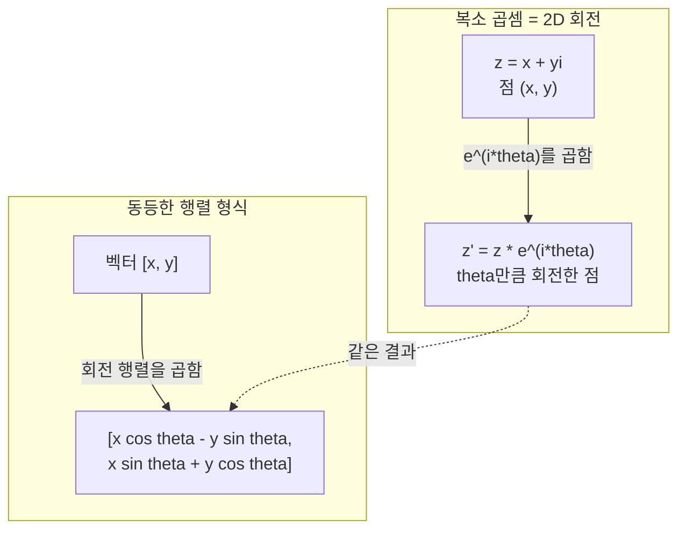
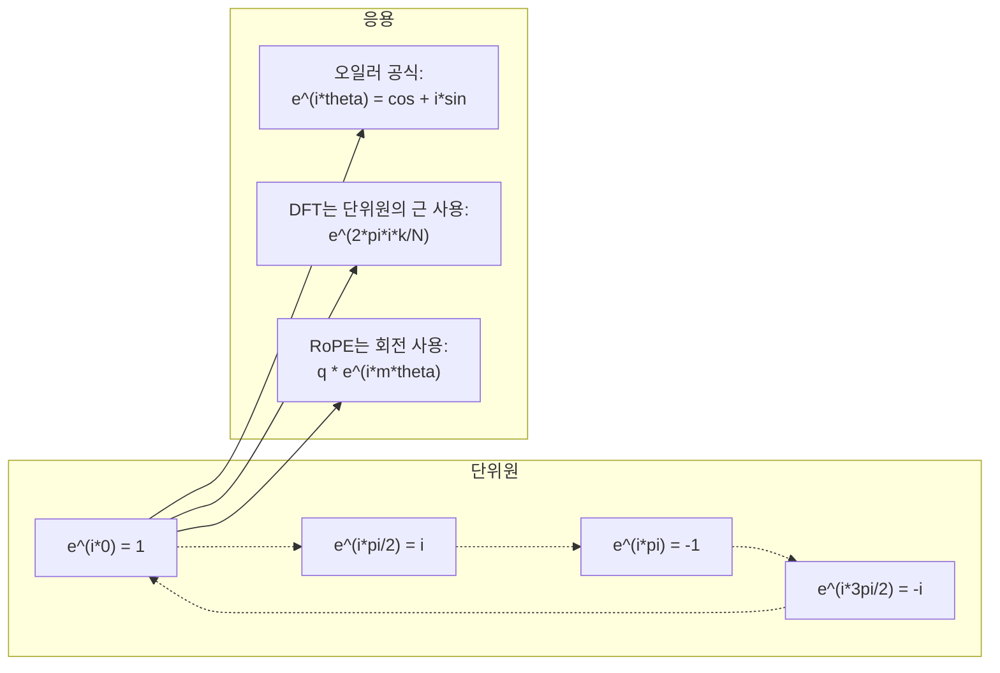

# AI를 위한 복소수 (Complex Numbers for AI)

> -1의 제곱근은 상상이 아닙니다. 회전, 주파수, 신호 처리의 절반을 여는 열쇠입니다.

**Type:** Learn
**Language:** Python
**Prerequisites:** Phase 1, Lessons 01-04 (linear algebra, calculus)
**Time:** ~60 minutes

## 학습 목표 (Learning Objectives)

- 직사각·극 형식에서 복소 연산(덧셈, 곱셈, 나눗셈, 켤레)을 수행합니다
- 오일러 공식을 적용해 복소 지수와 삼각함수를 변환합니다
- 복소 단위원의 근을 사용해 이산 푸리에 변환을 구현합니다
- 복소 회전이 트랜스포머의 RoPE와 사인 위치 인코딩의 기반임을 설명합니다

## 문제 상황 (The Problem)

푸리에 변환 논문을 열면 `i`가 어디에나 있습니다. 트랜스포머 위치 인코딩을 보면 서로 다른 주파수의 `sin`과 `cos`가 보입니다 — 복소 지수의 실수부와 허수부입니다. 양자 컴퓨팅을 읽으면 모든 것이 복소 벡터 공간으로 표현됩니다.

복소수는 추상적으로 느껴집니다. -1의 제곱근 위에 세운 수 체계는 수학 트릭처럼 보입니다. 하지만 트릭이 아닙니다. 회전과 진동의 자연어입니다. 무언가가 돌거나, 진동하거나, 오실레이션할 때마다 복소수가 올바른 도구입니다.

복소수를 이해하지 못하면 이산 푸리에 변환을 이해할 수 없습니다. FFT를 이해할 수 없습니다. 현대 언어 모델의 RoPE(Rotary Position Embedding)가 어떻게 동작하는지 이해할 수 없습니다. 원본 Transformer 논문의 사인 위치 인코딩이 그 주파수를 쓰는 이유를 이해할 수 없습니다.

이 레슨은 복소 연산을 처음부터 만들고, 기하와 연결하며, 머신러닝에서 복소수가 정확히 어디에 나타나는지 보여 줍니다.

## 핵심 개념 (The Concept)

### 복소수란?

복소수는 두 부분으로 이루어집니다: 실수부와 허수부.

```
z = a + bi

where:
  a is the real part
  b is the imaginary part
  i is the imaginary unit, defined by i^2 = -1
```

그게 전부입니다. 수 직선을 평면으로 확장합니다. 실수는 한 축에 앉습니다. 허수는 다른 축에 앉습니다. 모든 복소수는 이 평면의 한 점입니다.

### 복소 연산

**덧셈.** 실수부끼리 더하고, 허수부끼리 더합니다.

```
(a + bi) + (c + di) = (a + c) + (b + d)i

Example: (3 + 2i) + (1 + 4i) = 4 + 6i
```

**곱셈.** 분배법칙를 쓰고 i^2 = -1을 기억합니다.

```
(a + bi)(c + di) = ac + adi + bci + bdi^2
                 = ac + adi + bci - bd
                 = (ac - bd) + (ad + bc)i

Example: (3 + 2i)(1 + 4i) = 3 + 12i + 2i + 8i^2
                            = 3 + 14i - 8
                            = -5 + 14i
```

**켤레.** 허수부의 부호를 뒤집습니다.

```
conjugate of (a + bi) = a - bi
```

복소수와 그 켤레의 곱은 항상 실수입니다:

```
(a + bi)(a - bi) = a^2 + b^2
```

**나눗셈.** 분자와 분모에 분모의 켤레를 곱합니다.

```
(a + bi) / (c + di) = (a + bi)(c - di) / (c^2 + d^2)
```

이렇게 하면 분모에서 허수부가 사라져 깔끔한 복소수가 됩니다.

### 복소평면

복소평면은 모든 복소수를 2D 점으로 대응합니다. 가로축은 실수축, 세로축은 허수축입니다.

```
z = 3 + 2i  corresponds to the point (3, 2)
z = -1 + 0i corresponds to the point (-1, 0) on the real axis
z = 0 + 4i  corresponds to the point (0, 4) on the imaginary axis
```

복소수는 점이면서 동시에 원점에서 나가는 벡터입니다. 이 이중 해석이 복소수를 기하에 유용하게 만듭니다.

### 극 형식

평면의 임의의 점은 원점으로부터의 거리와 양의 실수축으로부터의 각도로 기술할 수 있습니다.

```
z = r * (cos(theta) + i*sin(theta))

where:
  r = |z| = sqrt(a^2 + b^2)     (magnitude, or modulus)
  theta = atan2(b, a)             (phase, or argument)
```

직사각 형식 (a + bi)는 덧셈에 좋습니다. 극 형식 (r, theta)는 곱셈에 좋습니다.

**극 형식에서의 곱셈.** 크기를 곱하고, 각도를 더합니다.

```
z1 = r1 * e^(i*theta1)
z2 = r2 * e^(i*theta2)

z1 * z2 = (r1 * r2) * e^(i*(theta1 + theta2))
```

이것이 복소수가 회전에 완벽한 이유입니다. 크기가 1인 복소수를 곱하는 것은 순수 회전입니다.

### 오일러 공식

복소 지수와 삼각법 사이의 다리:

```
e^(i*theta) = cos(theta) + i*sin(theta)
```

이 레슨에서 가장 중요한 공식입니다. theta = pi일 때:

```
e^(i*pi) = cos(pi) + i*sin(pi) = -1 + 0i = -1

Therefore: e^(i*pi) + 1 = 0
```

다섯 기본 상수(e, i, pi, 1, 0)가 한 방정식에 연결됩니다.

### 왜 오일러 공식이 ML에 중요한가

오일러 공식은 `e^(i*theta)`가 theta가 변함에 따라 단위원을 그린다고 말합니다. theta = 0에서 (1, 0). theta = pi/2에서 (0, 1). theta = pi에서 (-1, 0). theta = 3*pi/2에서 (0, -1). 한 바퀴 회전은 theta = 2*pi입니다.

즉 복소 지수는 회전입니다. 그리고 회전은 신호 처리와 ML 어디에나 있습니다.

### 2D 회전과의 연결

복소수 (x + yi)에 e^(i*theta)를 곱하면 점 (x, y)가 원점 주위로 각도 theta만큼 회전합니다.

```
Rotation via complex multiplication:
  (x + yi) * (cos(theta) + i*sin(theta))
  = (x*cos(theta) - y*sin(theta)) + (x*sin(theta) + y*cos(theta))i

Rotation via matrix multiplication:
  [cos(theta)  -sin(theta)] [x]   [x*cos(theta) - y*sin(theta)]
  [sin(theta)   cos(theta)] [y] = [x*sin(theta) + y*cos(theta)]
```

결과가 동일합니다. 복소 곱셈은 2D 회전입니다. 회전 행렬은 복소 곱셈을 행렬 표기로 쓴 것입니다.



### 페이저와 회전 신호

복소 지수 e^(i*omega*t)는 각주파수 omega로 단위원을 도는 점입니다. t가 증가하면 점이 원을 그립니다.

이 회전점의 실수부는 cos(omega*t)입니다. 허수부는 sin(omega*t)입니다. 사인파 신호는 회전하는 복소수의 그림자입니다.

```
e^(i*omega*t) = cos(omega*t) + i*sin(omega*t)

Real part:      cos(omega*t)    -- a cosine wave
Imaginary part: sin(omega*t)    -- a sine wave
```

이것이 페이저 표현입니다. 구불구불한 사인파를 추적하는 대신, 매끄럽게 도는 화살표를 추적합니다. 위상 이동은 각도 오프셋이 됩니다. 진폭 변화는 크기 변화가 됩니다. 신호의 덧셈은 벡터 덧셈이 됩니다.

### 단위원의 근

N차 단위원의 근은 단위원 위에 등간격으로 놓인 N개 점입니다:

```
w_k = e^(2*pi*i*k/N)    for k = 0, 1, 2, ..., N-1
```

N = 4일 때 근은: 1, i, -1, -i (네 방위).
N = 8이면 네 방위에 네 대각선이 더해집니다.

단위원의 근은 이산 푸리에 변환의 기초입니다. DFT는 신호를 이 N개 등간격 주파수의 성분으로 분해합니다.

### DFT와의 연결

신호 x[0], x[1], ..., x[N-1]의 이산 푸리에 변환은:

```
X[k] = sum_{n=0}^{N-1} x[n] * e^(-2*pi*i*k*n/N)
```

각 X[k]는 신호가 k번째 단위원의 근 — 주파수 k의 복소 정현파 — 과 얼마나 상관되는지 측정합니다. DFT는 신호를 N개 회전 페이저로 분해하고 각각의 진폭과 위상을 알려 줍니다.

### 왜 i는 상상이 아닌가

"허수"라는 말은 역사적 우연입니다. 데카르트가 경멸적으로 썼습니다. 하지만 i는 사람들이 처음 거부했던 음수보다 더 상상적이지 않습니다. 음수는 "3에서 5를 빼면 무엇이 되는가?"에 답합니다. 허수 단위는 "-1을 만들려면 무엇을 제곱하는가?"에 답합니다.

더 유용하게: i는 90도 회전 연산자입니다. 실수에 i를 한 번 곱하면 허수축으로 90도 회전합니다. 다시 곱하면(i^2) 또 90도 회전 — 이제 음의 실수 방향을 가리킵니다. 그래서 i^2 = -1입니다. 신비가 아닙니다. 두 번의 1/4 회전으로 만든 반 회전입니다.

이것이 공학에 복소수가 어디에나 있는 이유입니다. 회전하는 모든 것 — 전자기파, 양자 상태, 신호 오실레이션, 위치 인코딩 — 은 복소수로 자연스럽게 기술됩니다.

### 복소 지수 vs 삼각함수

오일러 공식 이전에 엔지니어는 신호를 A*cos(omega*t + phi) — 진폭 A, 주파수 omega, 위상 phi — 로 썼습니다. 동작하지만 연산이 고통스럽습니다. 위상이 다른 두 코사인을 더하려면 삼각 항등식이 필요합니다.

복소 지수로 같은 신호는 A*e^(i*(omega*t + phi))입니다. 두 신호를 더하는 것은 두 복소수를 더하는 것입니다. 곱셈(변조)은 크기를 곱하고 각도를 더하는 것입니다. 위상 이동은 각도 덧셈이 됩니다. 주파수 이동은 페이저 곱셈이 됩니다.

신호 처리 전체 분야가 복소 지수 표기로 전환한 이유는 수학이 더 깔끔하기 때문입니다. "실수 신호"는 항상 복소 표현의 실수부일 뿐입니다. 허수부는 대수가 자연스럽게 돌아가도록 함께 운반되는 부기입니다.

### 트랜스포머와의 연결

**사인 위치 인코딩** (원본 Transformer 논문):

```
PE(pos, 2i) = sin(pos / 10000^(2i/d))
PE(pos, 2i+1) = cos(pos / 10000^(2i/d))
```

sin과 cos 쌍은 서로 다른 주파수의 복소 지수의 실수부와 허수부입니다. 각 주파수는 위치를 인코딩하는 다른 "해상도"를 제공합니다. 저주파는 느리게 변합니다(거친 위치). 고주파는 빠르게 변합니다(세밀한 위치). 함께하면 각 위치에 고유한 주파수 지문이 생깁니다.

**RoPE (Rotary Position Embedding)**는 이를 한 단계 더 가져갑니다. 쿼리와 키 벡터에 복소 회전 행렬을 명시적으로 곱합니다. 두 토큰 사이의 상대 위치가 회전 각도가 됩니다. 이 회전된 벡터로 어텐션을 계산해, 복소 곱셈을 통해 모델이 상대 위치에 민감해집니다.

| Operation | Algebraic Form | Geometric Meaning |
|-----------|---------------|-------------------|
| Addition | (a+c) + (b+d)i | 평면에서 벡터 덧셈 |
| Multiplication | (ac-bd) + (ad+bc)i | 회전과 스케일 |
| Conjugate | a - bi | 실수축에 대한 반사 |
| Magnitude | sqrt(a^2 + b^2) | 원점으로부터의 거리 |
| Phase | atan2(b, a) | 양의 실수축으로부터의 각도 |
| Division | multiply by conjugate | 회전 역전 및 재스케일 |
| Power | r^n * e^(i*n*theta) | n번 회전, r^n으로 스케일 |



```figure
roots-of-unity
```

## 구현하기 (Build It)

### Step 1: Complex 클래스

산술, 크기, 위상, 직사각·극 형식 변환을 지원하는 Complex 수 클래스를 만듭니다.

```python
import math

class Complex:
    def __init__(self, real, imag=0.0):
        self.real = real
        self.imag = imag

    def __add__(self, other):
        return Complex(self.real + other.real, self.imag + other.imag)

    def __mul__(self, other):
        r = self.real * other.real - self.imag * other.imag
        i = self.real * other.imag + self.imag * other.real
        return Complex(r, i)

    def __truediv__(self, other):
        denom = other.real ** 2 + other.imag ** 2
        r = (self.real * other.real + self.imag * other.imag) / denom
        i = (self.imag * other.real - self.real * other.imag) / denom
        return Complex(r, i)

    def magnitude(self):
        return math.sqrt(self.real ** 2 + self.imag ** 2)

    def phase(self):
        return math.atan2(self.imag, self.real)

    def conjugate(self):
        return Complex(self.real, -self.imag)
```

### Step 2: 극 변환과 오일러 공식

```python
def to_polar(z):
    return z.magnitude(), z.phase()

def from_polar(r, theta):
    return Complex(r * math.cos(theta), r * math.sin(theta))

def euler(theta):
    return Complex(math.cos(theta), math.sin(theta))
```

검증: `euler(theta).magnitude()`는 항상 1.0이어야 합니다. `euler(0)`은 (1, 0)을 줘야 합니다. `euler(pi)`는 (-1, 0)을 줘야 합니다.

### Step 3: 회전

점 (x, y)를 각도 theta만큼 회전하는 것은 복소 곱셈 한 번입니다:

```python
point = Complex(3, 4)
rotated = point * euler(math.pi / 4)
```

크기는 그대로입니다. 각도만 바뀝니다.

### Step 4: 복소 연산으로 DFT

```python
def dft(signal):
    N = len(signal)
    result = []
    for k in range(N):
        total = Complex(0, 0)
        for n in range(N):
            angle = -2 * math.pi * k * n / N
            total = total + Complex(signal[n], 0) * euler(angle)
        result.append(total)
    return result
```

이것이 O(N^2) DFT입니다. 각 출력 X[k]는 신호 샘플에 단위원의 근을 곱한 합입니다.

### Step 5: 역 DFT

역 DFT는 스펙트럼에서 원본 신호를 재구성합니다. 순방향 DFT와의 유일한 차이: 지수의 부호를 뒤집고 N으로 나눕니다.

```python
def idft(spectrum):
    N = len(spectrum)
    result = []
    for n in range(N):
        total = Complex(0, 0)
        for k in range(N):
            angle = 2 * math.pi * k * n / N
            total = total + spectrum[k] * euler(angle)
        result.append(Complex(total.real / N, total.imag / N))
    return result
```

완벽한 재구성이 됩니다. DFT를 적용한 뒤 IDFT하면 기계 정밀도까지 원본 신호가 돌아옵니다. 정보는 손실되지 않습니다.

### Step 6: 단위원의 근

```python
def roots_of_unity(N):
    return [euler(2 * math.pi * k / N) for k in range(N)]
```

두 성질을 검증하세요:
- 모든 근의 크기가 정확히 1입니다.
- N개 근의 합은 0입니다(대칭으로 상쇄됩니다).

이 성질들이 DFT를 가역으로 만듭니다. 단위원의 근은 주파수 영역의 직교 기저를 형성합니다.

## 실용 활용 (Use It)

Python에는 내장 복소수 지원이 있습니다. 리터럴 `j`가 허수 단위를 나타냅니다.

```python
z = 3 + 2j
w = 1 + 4j

print(z + w)
print(z * w)
print(abs(z))

import cmath
print(cmath.phase(z))
print(cmath.exp(1j * cmath.pi))
```

배열에서는 numpy가 복소수를 네이티브로 다룹니다:

```python
import numpy as np

z = np.array([1+2j, 3+4j, 5+6j])
print(np.abs(z))
print(np.angle(z))
print(np.conj(z))
print(np.real(z))
print(np.imag(z))

signal = np.sin(2 * np.pi * 5 * np.linspace(0, 1, 128))
spectrum = np.fft.fft(signal)
freqs = np.fft.fftfreq(128, d=1/128)
```

## 배포할 산출물 (Ship It)

`code/complex_numbers.py`를 실행하면 `outputs/skill-complex-arithmetic.md`가 생성됩니다.

## 연습 문제 (Exercises)

1. **손으로 복소 연산.** (2 + 3i) * (4 - i)를 계산하고 코드로 검증하세요. 이어서 (5 + 2i) / (1 - 3i)를 계산하세요. 복소평면에 두 결과를 그리고, 곱셈이 첫 번째 수를 회전·스케일했는지 확인하세요.

2. **회전 시퀀스.** 점 (1, 0)에서 시작합니다. e^(i*pi/6)을 열두 번 곱하세요. 12번 곱셈 후 (1, 0)으로 돌아오는지 검증하세요. 각 단계의 좌표를 출력하고 정12각형을 그리는지 확인하세요.

3. **알려진 신호의 DFT.** 32점에서 샘플링한 sin(2*pi*3*t)와 0.5*sin(2*pi*7*t)의 합인 신호를 만드세요. DFT를 실행하세요. 크기 스펙트럼이 주파수 3과 7에서 피크를 가지며, 7의 피크가 3의 절반 높이인지 검증하세요.

4. **단위원의 근 시각화.** 8차 단위원의 근을 계산하세요. 합이 0인지 검증하세요. 임의의 근에 원시 근 e^(2*pi*i/8)을 곱하면 다음 근이 되는지 검증하세요.

5. **회전 행렬 동등성.** 10개 무작위 각도와 10개 무작위 점에 대해, 복소 곱셈이 2x2 회전 행렬과의 행렬-벡터 곱과 같은 결과를 주는지 검증하세요. 최대 수치 차이를 출력하세요.

## 핵심 용어 (Key Terms)

| Term | What it means |
|------|---------------|
| Complex number | a + bi 형태의 수. a는 실수부, b는 허수부, i^2 = -1 |
| Imaginary unit | i^2 = -1로 정의된 수 i. 철학적 의미의 상상이 아니라 회전 연산자 |
| Complex plane | x축이 실수, y축이 허수인 2D 평면. 아르강 평면이라고도 함 |
| Magnitude (modulus) | 원점으로부터의 거리: sqrt(a^2 + b^2). \|z\|로 표기 |
| Phase (argument) | 양의 실수축으로부터의 각도: atan2(b, a). arg(z)로 표기 |
| Conjugate | 실수축에 대한 거울상: a + bi의 켤레는 a - bi |
| Polar form | z를 a + bi 대신 r * e^(i*theta)로 표현. 곱셈이 쉬워짐 |
| Euler's formula | e^(i*theta) = cos(theta) + i*sin(theta). 지수와 삼각법을 연결 |
| Phasor | 사인파 신호를 나타내는 회전 복소수 e^(i*omega*t) |
| Roots of unity | k = 0부터 N-1까지 e^(2*pi*i*k/N)인 N개 복소수. 단위원 위의 등간격 N점 |
| DFT | Discrete Fourier Transform. 단위원의 근을 사용해 신호를 복소 정현 성분으로 분해 |
| RoPE | Rotary Position Embedding. 복소 곱셈으로 트랜스포머 어텐션에 상대 위치를 인코딩 |

## 참고 자료 (Further Reading)

- [Visual Introduction to Euler's Formula](https://betterexplained.com/articles/intuitive-understanding-of-eulers-formula/) - 무거운 표기 없이 기하적 직관 구축
- [Su et al.: RoFormer (2021)](https://arxiv.org/abs/2104.09864) - 복소 회전을 쓰는 Rotary Position Embedding 소개 논문
- [Vaswani et al.: Attention Is All You Need (2017)](https://arxiv.org/abs/1706.03762) - 사인 위치 인코딩이 있는 원본 Transformer 논문
- [3Blue1Brown: Euler's formula with introductory group theory](https://www.youtube.com/watch?v=mvmuCPvRoWQ) - e^(i*pi) = -1인 이유의 시각적 설명
- [Needham: Visual Complex Analysis](https://global.oup.com/academic/product/visual-complex-analysis-9780198534464) - 복소수의 최고의 시각적 다루, 기하적 통찰이 가득
- [Strang: Introduction to Linear Algebra, Ch. 10](https://math.mit.edu/~gs/linearalgebra/) - 선형대수와 고유값 맥락의 복소수
