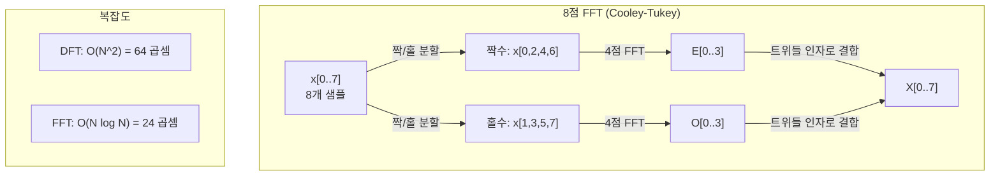
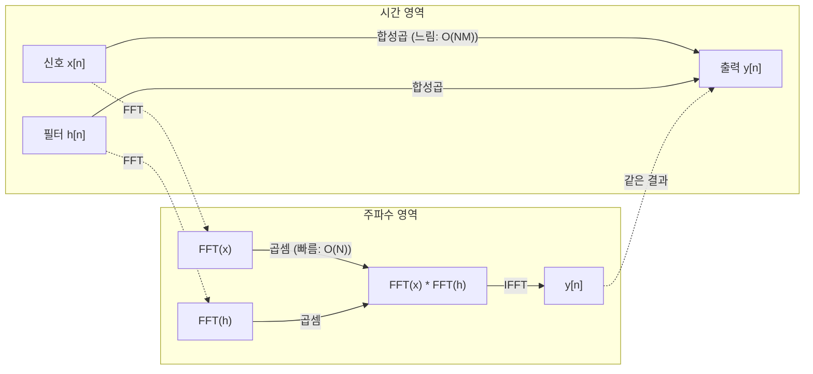

# 푸리에 변환 (The Fourier Transform)

> 모든 신호는 사인파의 합입니다. 푸리에 변환은 어떤 사인파인지 알려 줍니다.

**Type:** Build
**Language:** Python
**Prerequisites:** Phase 1, Lessons 01-04, 19 (complex numbers)
**Time:** ~90 minutes

## 학습 목표 (Learning Objectives)

- DFT를 처음부터 구현하고 O(N log N) Cooley-Tukey FFT와 대조해 검증합니다
- 주파수 계수를 해석합니다: 신호에서 진폭, 위상, 파워 스펙트럼을 추출합니다
- 합성곱 정리를 적용해 FFT 곱셈으로 합성곱을 수행합니다
- 푸리에 주파수 분해를 트랜스포머 위치 인코딩과 CNN 합성곱 층에 연결합니다

## 문제 상황 (The Problem)

오디오 녹음은 시간에 따른 압력 측정값의 시퀀스입니다. 주가는 날짜에 따른 값의 시퀀스입니다. 이미지는 공간에 따른 픽셀 강도 격자입니다. 이 모두는 시간 영역(또는 공간 영역)의 데이터입니다. 어떤 인덱스를 따라 값이 변하는 것을 봅니다.

하지만 많은 패턴은 시간 영역에서 보이지 않습니다. 이 오디오 신호가 순수 톤인가 화음인가? 이 주가에 주간 주기가 있는가? 이 이미지에 반복 텍스처가 있는가? 이런 질문은 주파수 내용에 관한 것이고, 시간 영역은 그것을 숨깁니다.

푸리에 변환은 데이터를 시간 영역에서 주파수 영역으로 바꿉니다. 신호를 받아 서로 다른 주파수의 사인파로 분해합니다. 각 사인파는 진폭(얼마나 강한지)과 위상(어디서 시작하는지)을 가집니다. 푸리에 변환이 둘 다 알려 줍니다.

ML에서 중요한 이유는 주파수 영역 사고가 어디에나 나타나기 때문입니다. 합성곱 신경망은 합성곱을 수행하며, 이는 주파수 영역의 곱셈입니다. 트랜스포머 위치 인코딩은 주파수 분해로 위치를 표현합니다. 오디오 모델(음성 인식, 음악 생성)은 스펙트로그램 — 소리의 주파수 표현 — 위에서 동작합니다. 시계열 모델은 주기적 패턴을 찾습니다. 푸리에 변환을 이해하면 이 모든 것과 일할 어휘를 얻습니다.

## 핵심 개념 (The Concept)

### DFT 정의

N개 샘플 x[0], x[1], ..., x[N-1]이 주어지면, 이산 푸리에 변환은 N개 주파수 계수 X[0], X[1], ..., X[N-1]을 만듭니다:

```
X[k] = sum_{n=0}^{N-1} x[n] * e^(-2*pi*i*k*n/N)

for k = 0, 1, ..., N-1
```

각 X[k]는 복소수입니다. 크기 |X[k]|는 주파수 k의 진폭을 알려 줍니다. 위상 angle(X[k])는 그 주파수의 위상 오프셋을 알려 줍니다.

핵심 통찰: `e^(-2*pi*i*k*n/N)`은 주파수 k의 회전 페이저입니다. DFT는 신호와 N개 등간격 주파수 각각의 상관을 계산합니다. 신호에 주파수 k의 에너지가 있으면 상관이 큽니다. 없으면 거의 0입니다.

### 각 계수의 의미

**X[0]: DC 성분.** 모든 샘플의 합 — 평균에 비례합니다. 신호의 상수(영주파수) 오프셋을 나타냅니다.

```
X[0] = sum_{n=0}^{N-1} x[n] * e^0 = sum of all samples
```

**1 <= k <= N/2인 X[k]: 양의 주파수.** X[k]는 N개 샘플당 k 사이클 주파수를 나타냅니다. k가 클수록 주파수가 높습니다(더 빠른 오실레이션).

**X[N/2]: 나이퀴스트 주파수.** N개 샘플로 표현할 수 있는 최고 주파수입니다. 이보다 위에서는 앨리어싱 — 고주파가 저주파로 위장 — 이 생깁니다.

**N/2 < k < N인 X[k]: 음의 주파수.** 실수값 신호에서 X[N-k] = conj(X[k])입니다. 음의 주파수는 양의 주파수의 거울상입니다. 그래서 유용한 정보는 처음 N/2 + 1개 계수에 있습니다.

### 역 DFT

역 DFT는 주파수 계수에서 원본 신호를 재구성합니다:

```
x[n] = (1/N) * sum_{k=0}^{N-1} X[k] * e^(2*pi*i*k*n/N)

for n = 0, 1, ..., N-1
```

순방향 DFT와의 유일한 차이: 지수의 부호가 양수(음수가 아님)이고, 1/N 정규화 인자가 있습니다.

역 DFT는 완벽한 재구성입니다. 정보는 손실되지 않습니다. 시간 영역에서 주파수 영역으로 갔다가 오차 없이 돌아올 수 있습니다. DFT는 기저 변환입니다 — 같은 정보를 다른 좌표계로 다시 표현합니다.

### FFT: 빠르게 만들기

위 정의의 DFT는 O(N^2)입니다: N개 출력 계수 각각에 대해 N개 입력 샘플을 합합니다. N = 100만이면 10^12 연산입니다.

고속 푸리에 변환(FFT)은 같은 결과를 O(N log N)에 계산합니다. N = 100만이면 1조 대신 약 2천만 연산입니다. 이것이 주파수 분석을 실용적으로 만듭니다.

Cooley-Tukey 알고리즘(가장 흔한 FFT)은 분할 정복으로 동작합니다:

1. 신호를 짝수 인덱스와 홀수 인덱스 샘플로 나눕니다.
2. 각 절반의 DFT를 재귀적으로 계산합니다.
3. "트위들 인자" e^(-2*pi*i*k/N)로 두 절반 크기 DFT를 결합합니다.

```
X[k] = E[k] + e^(-2*pi*i*k/N) * O[k]          for k = 0, ..., N/2 - 1
X[k + N/2] = E[k] - e^(-2*pi*i*k/N) * O[k]    for k = 0, ..., N/2 - 1

where E = DFT of even-indexed samples
      O = DFT of odd-indexed samples
```

대칭 때문에 재귀의 각 레벨은 O(N) 작업을 하고, log2(N) 레벨이 있습니다. 합계: O(N log N).



FFT는 신호 길이가 2의 거듭제곱이어야 합니다. 실무에서는 신호를 다음 2의 거듭제곱까지 제로 패딩합니다.

### 스펙트럼 분석

**파워 스펙트럼**은 |X[k]|^2 — 각 주파수 계수의 제곱 크기입니다. 각 주파수에 얼마나 에너지가 있는지 보여 줍니다.

**위상 스펙트럼**은 angle(X[k]) — 각 주파수의 위상 오프셋입니다. 대부분의 분석 작업에서는 파워 스펙트럼을 보고 위상은 무시합니다.

```
Power at frequency k:  P[k] = |X[k]|^2 = X[k].real^2 + X[k].imag^2
Phase at frequency k:  phi[k] = atan2(X[k].imag, X[k].real)
```

### 주파수 해상도

DFT의 주파수 해상도는 샘플 수 N과 샘플링 레이트 fs에 의존합니다.

```
Frequency of bin k:      f_k = k * fs / N
Frequency resolution:    delta_f = fs / N
Maximum frequency:       f_max = fs / 2  (Nyquist)
```

가까운 두 주파수를 분해하려면 더 많은 샘플이 필요합니다. 고주파를 포착하려면 더 높은 샘플링 레이트가 필요합니다.

### 합성곱 정리

신호 처리에서 가장 중요한 결과 중 하나이며 CNN에 직접 관련됩니다.

**시간 영역의 합성곱은 주파수 영역의 점별 곱셈과 같습니다.**

```
x * h = IFFT(FFT(x) . FFT(h))

where * is convolution and . is element-wise multiplication
```

왜 중요한가:

- 길이 N과 M인 두 신호의 직접 합성곱은 O(N*M) 연산입니다.
- FFT 기반 합성곱은 O(N log N)입니다: 둘 다 변환, 곱하고, 다시 변환.
- 큰 커널에서는 FFT 합성곱이 극적으로 빠릅니다.
- 큰 수용 필드를 가진 합성곱 층에서 정확히 일어나는 일입니다.

참고: DFT는 원형 합성곱(신호가 감김)을 계산합니다. 선형 합성곱(감김 없음)을 위해서는 계산 전에 두 신호를 길이 N + M - 1까지 제로 패딩하세요.



### 윈도잉

DFT는 신호가 주기적이라고 가정합니다 — N개 샘플을 무한히 반복되는 신호의 한 주기로 취급합니다. 신호가 같은 값에서 시작하고 끝나지 않으면 경계에 불연속이 생겨, 가짜 고주파 내용으로 나타납니다. 이를 스펙트럼 누설이라고 합니다.

윈도잉은 DFT 전에 신호 양 끝을 0으로 테이퍼링해 누설을 줄입니다.

흔한 윈도우:

| Window | Shape | Main lobe width | Side lobe level | Use case |
|--------|-------|----------------|-----------------|----------|
| Rectangular | Flat (no window) | Narrowest | Highest (-13 dB) | 신호가 N 샘플에서 정확히 주기적일 때 |
| Hann | Raised cosine | Moderate | Low (-31 dB) | 범용 스펙트럼 분석 |
| Hamming | Modified cosine | Moderate | Lower (-42 dB) | 오디오 처리, 음성 분석 |
| Blackman | Triple cosine | Wide | Very low (-58 dB) | 사이드 로브 억제가 중요할 때 |

```
Hann window:    w[n] = 0.5 * (1 - cos(2*pi*n / (N-1)))
Hamming window: w[n] = 0.54 - 0.46 * cos(2*pi*n / (N-1))
```

DFT 전에 윈도우를 신호와 요소별 곱합니다: `X = DFT(x * w)`.

### DFT 성질

| Property | Time Domain | Frequency Domain |
|----------|-------------|-----------------|
| Linearity | a*x + b*y | a*X + b*Y |
| Time shift | x[n - k] | X[f] * e^(-2*pi*i*f*k/N) |
| Frequency shift | x[n] * e^(2*pi*i*f0*n/N) | X[f - f0] |
| Convolution | x * h | X * H (pointwise) |
| Multiplication | x * h (pointwise) | X * H (circular convolution, scaled by 1/N) |
| Parseval's theorem | sum \|x[n]\|^2 | (1/N) * sum \|X[k]\|^2 |
| Conjugate symmetry (real input) | x[n] real | X[k] = conj(X[N-k]) |

Parseval 정리는 총 에너지가 두 영역에서 같다고 말합니다. 변환을 통해 에너지가 보존됩니다.

### 위치 인코딩과의 연결

원본 Transformer는 사인 위치 인코딩을 사용합니다:

```
PE(pos, 2i)   = sin(pos / 10000^(2i/d_model))
PE(pos, 2i+1) = cos(pos / 10000^(2i/d_model))
```

각 차원 쌍 (2i, 2i+1)은 다른 주파수로 오실레이션합니다. 주파수는 고(차원 0,1)에서 저(마지막 차원)로 기하적으로 간격이 잡혀 있습니다. 각 위치에 모든 주파수 대역에 걸친 고유한 패턴을 줍니다 — 푸리에 계수가 신호를 고유하게 식별하는 것과 비슷합니다.

이것이 제공하는 핵심 성질:

- **고유성:** 두 위치가 같은 인코딩을 가지지 않습니다.
- **유계 값:** sin과 cos는 항상 [-1, 1]에 있습니다.
- **상대 위치:** 위치 p+k의 인코딩은 위치 p의 인코딩의 선형 함수로 표현할 수 있습니다. 모델이 상대 위치에 어텐드하는 법을 학습할 수 있습니다.

### CNN과의 연결

합성곱 층은 학습된 필터(커널)를 신호나 이미지에 슬라이딩해 적용합니다. 수학적으로 이것이 합성곱 연산입니다.

합성곱 정리에 의해, 이것은 다음과 동등합니다:
1. 입력을 FFT
2. 커널을 FFT
3. 주파수 영역에서 곱하기
4. 결과를 IFFT

표준 CNN 구현은 직접 합성곱을 사용합니다(작은 3x3 커널에 더 빠름). 하지만 큰 커널이나 전역 합성곱에서는 FFT 기반 접근이 훨씬 빠릅니다. 일부 아키텍처(FNet 등)는 어텐션을 전부 FFT로 바꿔 O(N^2) 대신 O(N log N) 복잡도로 경쟁력 있는 정확도를 달성합니다.

### 스펙트로그램과 단시간 푸리에 변환

단일 FFT는 전체 신호의 주파수 내용을 주지만, 그 주파수가 언제 발생하는지는 알려 주지 않습니다. 첩(시간이 지나며 주파수가 증가하는 신호)과 화음(모든 주파수가 동시에 존재)은 같은 크기 스펙트럼을 가질 수 있습니다.

단시간 푸리에 변환(STFT)은 신호의 겹치는 윈도우에서 FFT를 계산해 이를 해결합니다. 결과는 스펙트로그램입니다: 한 축에 시간, 다른 축에 주파수가 있는 2D 표현. 각 점의 강도는 그 시간 그 주파수의 에너지를 보여 줍니다.

```
STFT procedure:
1. Choose a window size (e.g., 1024 samples)
2. Choose a hop size (e.g., 256 samples -- 75% overlap)
3. For each window position:
   a. Extract the windowed segment
   b. Apply a Hann/Hamming window
   c. Compute FFT
   d. Store the magnitude spectrum as one column of the spectrogram
```

스펙트로그램은 오디오 ML 모델의 표준 입력 표현입니다. 음성 인식 모델(Whisper, DeepSpeech)은 멜 스펙트로그램 — 주파수를 인간 피치 지각에 더 잘 맞는 멜 스케일로 매핑한 스펙트로그램 — 위에서 동작합니다.

### 앨리어싱

신호에 fs/2(나이퀴스트 주파수) 이상의 주파수가 있으면, 레이트 fs로 샘플링하면 앨리어싱된 복제가 생깁니다. 100 Hz로 샘플링한 90 Hz 신호는 10 Hz 신호와 동일하게 보입니다. 샘플만으로는 구별할 방법이 없습니다.

```
Example:
  True signal: 90 Hz sine wave
  Sampling rate: 100 Hz
  Apparent frequency: 100 - 90 = 10 Hz

  The samples from the 90 Hz signal at 100 Hz sampling rate
  are identical to the samples from a 10 Hz signal.
  No amount of math can recover the original 90 Hz.
```

이것이 아날로그-디지털 변환기가 샘플링 전에 나이퀴스트 위 주파수를 제거하는 안티앨리어싱 필터를 포함하는 이유입니다. ML에서 앨리어싱은 적절한 저역 통과 필터링 없이 특성 맵을 다운샘플링할 때 나타납니다 — 일부 아키텍처는 안티앨리어싱 풀링 층으로 이를 다룹니다.

### 제로 패딩은 해상도를 높이지 않음

흔한 오해: FFT 전 신호를 제로 패딩하면 주파수 해상도가 개선됩니다. 그렇지 않습니다. 제로 패딩은 기존 주파수 빈 사이를 보간해 더 매끄럽게 보이는 스펙트럼을 줍니다. 하지만 원본 샘플에 없던 주파수 세부를 드러낼 수 없습니다.

진짜 주파수 해상도는 관측 시간 T = N / fs에만 의존합니다. delta_f만큼 떨어진 두 주파수를 분해하려면 최소 T = 1 / delta_f초의 데이터가 필요합니다. 제로 패딩은 이 근본 한계를 바꾸지 않습니다.

```figure
fourier-synthesis
```

## 구현하기 (Build It)

### Step 1: 처음부터 DFT

O(N^2) DFT는 정의에서 바로 따라옵니다.

```python
import math

class Complex:
    ...

def dft(x):
    N = len(x)
    result = []
    for k in range(N):
        total = Complex(0, 0)
        for n in range(N):
            angle = -2 * math.pi * k * n / N
            w = Complex(math.cos(angle), math.sin(angle))
            xn = x[n] if isinstance(x[n], Complex) else Complex(x[n])
            total = total + xn * w
        result.append(total)
    return result
```

### Step 2: 역 DFT

같은 구조, 양의 지수, N으로 나눔.

```python
def idft(X):
    N = len(X)
    result = []
    for n in range(N):
        total = Complex(0, 0)
        for k in range(N):
            angle = 2 * math.pi * k * n / N
            w = Complex(math.cos(angle), math.sin(angle))
            total = total + X[k] * w
        result.append(Complex(total.real / N, total.imag / N))
    return result
```

### Step 3: FFT (Cooley-Tukey)

재귀 FFT는 2의 거듭제곱 길이가 필요합니다. 짝수와 홀수로 나누고, 재귀하고, 트위들 인자로 결합합니다.

```python
def fft(x):
    N = len(x)
    if N <= 1:
        return [x[0] if isinstance(x[0], Complex) else Complex(x[0])]
    if N % 2 != 0:
        return dft(x)

    even = fft([x[i] for i in range(0, N, 2)])
    odd = fft([x[i] for i in range(1, N, 2)])

    result = [Complex(0)] * N
    for k in range(N // 2):
        angle = -2 * math.pi * k / N
        twiddle = Complex(math.cos(angle), math.sin(angle))
        t = twiddle * odd[k]
        result[k] = even[k] + t
        result[k + N // 2] = even[k] - t
    return result
```

### Step 4: 스펙트럼 분석 헬퍼

```python
def power_spectrum(X):
    return [xk.real ** 2 + xk.imag ** 2 for xk in X]

def convolve_fft(x, h):
    N = len(x) + len(h) - 1
    padded_N = 1
    while padded_N < N:
        padded_N *= 2

    x_padded = x + [0.0] * (padded_N - len(x))
    h_padded = h + [0.0] * (padded_N - len(h))

    X = fft(x_padded)
    H = fft(h_padded)

    Y = [xk * hk for xk, hk in zip(X, H)]

    y = idft(Y)
    return [y[n].real for n in range(N)]
```

## 실용 활용 (Use It)

실제 작업에서는 고도로 최적화된 C 라이브러리로 뒷받침된 numpy의 FFT를 쓰세요.

```python
import numpy as np

signal = np.sin(2 * np.pi * 5 * np.arange(256) / 256)
spectrum = np.fft.fft(signal)
freqs = np.fft.fftfreq(256, d=1/256)

power = np.abs(spectrum) ** 2

positive_freqs = freqs[:len(freqs)//2]
positive_power = power[:len(power)//2]
```

윈도잉과 더 고급 스펙트럼 분석을 위해:

```python
from scipy.signal import windows, stft

window = windows.hann(256)
windowed = signal * window
spectrum = np.fft.fft(windowed)
```

합성곱을 위해:

```python
from scipy.signal import fftconvolve

result = fftconvolve(signal, kernel, mode='full')
```

스펙트로그램을 위해:

```python
from scipy.signal import stft

frequencies, times, Zxx = stft(signal, fs=sample_rate, nperseg=256)
spectrogram = np.abs(Zxx) ** 2
```

스펙트로그램 행렬의 shape는 (n_frequencies, n_time_frames)입니다. 각 열은 한 시간 윈도우의 파워 스펙트럼입니다. 오디오 ML 모델이 입력으로 소비하는 것입니다.

## 배포할 산출물 (Ship It)

`code/fourier.py`를 실행하면 `outputs/prompt-spectral-analyzer.md`가 생성됩니다.

## 연습 문제 (Exercises)

1. **순수 톤 식별.** 알 수 없는 주파수(1–50 Hz)의 단일 사인파를 128 Hz로 1초 샘플링한 신호를 만드세요. DFT로 주파수를 식별하세요. 답이 일치하는지 검증하세요. 표준편차 0.5의 가우시안 노이즈를 더하고 반복하세요. 노이즈가 스펙트럼에 어떤 영향을 주나요?

2. **FFT vs DFT 검증.** 길이 64의 무작위 신호를 생성하세요. DFT(O(N^2))와 FFT를 모두 계산하세요. 모든 계수가 1e-10 이내로 일치하는지 검증하세요. 길이 256, 512, 1024, 2048 신호에서 두 함수의 시간을 측정하세요. DFT 시간 대 FFT 시간 비를 플롯하세요.

3. **합성곱 정리 예시 증명.** 신호 x = [1, 2, 3, 4, 0, 0, 0, 0]와 필터 h = [1, 1, 1, 0, 0, 0, 0, 0]을 만드세요. 원형 합성곱을 직접(중첩 루프) 계산하세요. 이어서 FFT로(변환, 곱, 역변환) 계산하세요. 결과가 일치하는지 검증하세요. 이제 적절히 제로 패딩해 선형 합성곱을 하세요.

4. **윈도잉 효과.** 10 Hz와 12 Hz(매우 가까움)의 두 사인파 합인 신호를 만드세요. 128 Hz로 1초 샘플링하세요. 윈도우 없음, Hann, Hamming으로 파워 스펙트럼을 계산하세요. 어떤 윈도우가 두 피크를 구별하기 가장 쉬운가요? 왜?

5. **위치 인코딩 분석.** d_model = 128, max_pos = 512인 사인 위치 인코딩을 생성하세요. 각 위치 쌍 (p1, p2)에 대해 인코딩의 내적을 계산하세요. 내적이 |p1 - p2|에만 의존하고 절대 위치에는 의존하지 않음을 보이세요. 거리가 커지면 내적에 무슨 일이 생기나요?

## 핵심 용어 (Key Terms)

| Term | What it means |
|------|---------------|
| DFT (Discrete Fourier Transform) | N개 시간 영역 샘플을 N개 주파수 영역 계수로 변환. 각 계수는 그 주파수의 복소 정현파와의 상관 |
| FFT (Fast Fourier Transform) | DFT를 계산하는 O(N log N) 알고리즘. Cooley-Tukey는 짝/홀 인덱스를 재귀적으로 분할 |
| Inverse DFT | 주파수 계수에서 시간 영역 신호를 재구성. 지수 부호를 뒤집고 1/N 스케일한 DFT와 같은 공식 |
| Frequency bin | DFT 출력의 각 인덱스 k는 주파수 k*fs/N Hz를 나타냄. "빈"은 이산 주파수 슬롯 |
| DC component | X[0], 영주파수 계수. 신호 평균에 비례 |
| Nyquist frequency | fs/2, 샘플링 레이트 fs에서 표현 가능한 최대 주파수. 이보다 위는 앨리어싱 |
| Power spectrum | \|X[k]\|^2, 각 주파수 계수의 제곱 크기. 주파수에 걸친 에너지 분포를 보여 줌 |
| Phase spectrum | angle(X[k]), 각 주파수 성분의 위상 오프셋. 분석에서 종종 무시 |
| Spectral leakage | 비주기 신호를 주기적으로 취급해 생기는 가짜 주파수 내용. 윈도잉으로 감소 |
| Window function | DFT 전 스펙트럼 누설을 줄이기 위해 적용하는 테이퍼링 함수 (Hann, Hamming, Blackman) |
| Twiddle factor | FFT 버터플라이에서 부분 DFT를 결합하는 복소 지수 e^(-2*pi*i*k/N) |
| Convolution theorem | 시간 영역 합성곱 = 주파수 영역 점별 곱셈. 신호 처리와 CNN의 기초 |
| Circular convolution | 신호가 감기는 합성곱. DFT가 자연스럽게 계산하는 것 |
| Linear convolution | 감김 없는 표준 합성곱. DFT 전 제로 패딩으로 달성 |
| Parseval's theorem | 푸리에 변환을 통해 총 에너지가 보존됨. sum \|x[n]\|^2 = (1/N) sum \|X[k]\|^2 |
| Aliasing | 불충분한 샘플링 레이트로 나이퀴스트 위 주파수가 더 낮은 주파수로 나타나는 현상 |

## 참고 자료 (Further Reading)

- [Cooley & Tukey: An Algorithm for the Machine Calculation of Complex Fourier Series (1965)](https://www.ams.org/journals/mcom/1965-19-090/S0025-5718-1965-0178586-1/) - 컴퓨팅을 바꾼 원본 FFT 논문
- [3Blue1Brown: But what is the Fourier Transform?](https://www.youtube.com/watch?v=spUNpyF58BY) - 푸리에 변환의 최고의 시각적 소개
- [Lee-Thorp et al.: FNet: Mixing Tokens with Fourier Transforms (2021)](https://arxiv.org/abs/2105.03824) - 트랜스포머에서 셀프 어텐션을 FFT로 대체
- [Smith: The Scientist and Engineer's Guide to Digital Signal Processing](http://www.dspguide.com/) - FFT, 윈도잉, 스펙트럼 분석을 깊이 다루는 무료 온라인 교재
- [Vaswani et al.: Attention Is All You Need (2017)](https://arxiv.org/abs/1706.03762) - 푸리에 주파수 분해에서 유도된 사인 위치 인코딩
- [Radford et al.: Whisper (2022)](https://arxiv.org/abs/2212.04356) - 멜 스펙트로그램을 입력 표현으로 쓰는 음성 인식
