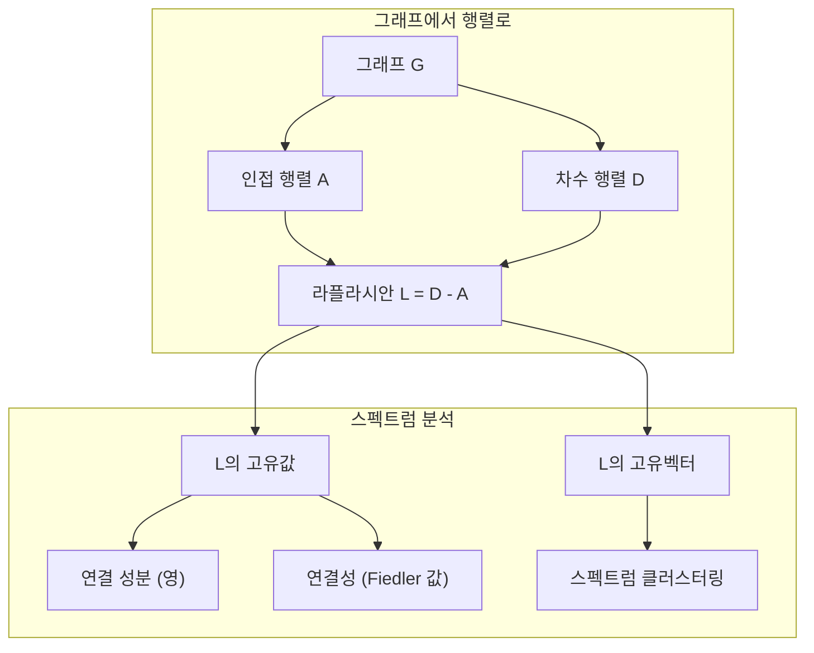
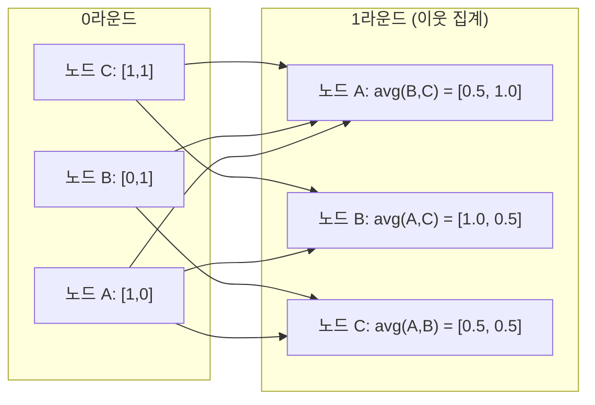

# 머신러닝을 위한 그래프 이론 (Graph Theory for Machine Learning)

> 그래프는 관계의 데이터 구조입니다. 데이터에 연결이 있으면 그래프 이론이 필요합니다.

**Type:** Build
**Language:** Python
**Prerequisites:** Phase 1, Lessons 01-03 (linear algebra, matrices)
**Time:** ~90 minutes

## 학습 목표 (Learning Objectives)

- 인접 행렬/리스트 표현으로 그래프 클래스를 만들고 BFS·DFS 순회를 구현합니다
- 그래프 라플라시안을 계산하고 고유값으로 연결 성분과 노드 클러스터를 탐지합니다
- 정규화된 인접 행렬 곱셈으로 GNN 스타일 메시지 패싱 한 라운드를 구현합니다
- Fiedler 벡터를 사용해 스펙트럼 클러스터링으로 그래프를 분할합니다

## 문제 상황 (The Problem)

소셜 네트워크, 분자, 지식 베이스, 인용 네트워크, 도로 지도 — 모두 그래프입니다. 전통 ML은 데이터를 평평한 표로 취급합니다. 각 행은 독립입니다. 각 특성은 열입니다. 하지만 연결의 구조가 중요하면 표는 실패합니다.

소셜 네트워크를 생각해 보세요. 사용자가 어떤 제품을 살지 예측하고 싶습니다. 구매 이력이 중요합니다. 하지만 친구의 구매 이력이 더 중요합니다. 연결이 신호를 운반합니다.

또는 분자를 생각해 보세요. 단백질에 결합하는지 예측하고 싶습니다. 원자도 중요하지만, 정말 중요한 것은 원자가 어떻게 결합되어 있는가입니다. 구조가 데이터입니다.

그래프 신경망(GNN)은 딥러닝에서 가장 빠르게 성장하는 영역입니다. 신약 발견, 소셜 추천, 사기 탐지, 지식 그래프 추론을 구동합니다. 모든 GNN은 같은 기초 위에 세워집니다: 기본 그래프 이론.

네 가지가 필요합니다:
1. 그래프를 행렬로 표현하는 방법 (곱할 수 있도록)
2. 그래프 구조를 탐색하는 순회 알고리즘
3. 라플라시안 — 스펙트럼 그래프 이론에서 가장 중요한 단일 행렬
4. 메시지 패싱 — GNN을 동작하게 만드는 연산

## 핵심 개념 (The Concept)

### 그래프: 노드와 간선

그래프 G = (V, E)는 정점(노드) V와 간선 E로 구성됩니다. 각 간선은 두 노드를 연결합니다.

**유향 vs 무향.** 무향 그래프에서 간선 (u, v)는 u가 v에 연결되고 v도 u에 연결됨을 뜻합니다. 유향 그래프(다이그래프)에서 간선 (u, v)는 u가 v를 가리킴을 뜻하며, 역방향은 필수가 아닙니다.

**가중 vs 비가중.** 비가중 그래프에서 간선은 존재하거나 존재하지 않습니다. 가중 그래프에서 각 간선은 수치 가중치 — 거리, 비용, 강도 — 를 가집니다.

| Graph type | Example |
|-----------|---------|
| Undirected, unweighted | Facebook 친구 네트워크 |
| Directed, unweighted | Twitter 팔로우 네트워크 |
| Undirected, weighted | 도로 지도 (거리) |
| Directed, weighted | 웹페이지 링크 (PageRank 점수) |

### 인접 행렬

인접 행렬 A는 핵심 표현입니다. n개 노드 그래프에 대해:

```
A[i][j] = 1    if there is an edge from node i to node j
A[i][j] = 0    otherwise
```

무향 그래프에서 A는 대칭입니다: A[i][j] = A[j][i]. 가중 그래프에서 A[i][j] = 간선 (i, j)의 가중치입니다.

**예 — 삼각형:**

```
Nodes: 0, 1, 2
Edges: (0,1), (1,2), (0,2)

A = [[0, 1, 1],
     [1, 0, 1],
     [1, 1, 0]]
```

인접 행렬은 모든 GNN의 입력입니다. A에 대한 행렬 연산은 그래프에 대한 연산에 대응합니다.

### 차수

노드의 차수는 연결된 간선 수입니다. 유향 그래프에서는 진입 차수(들어오는 간선)와 진출 차수(나가는 간선)가 있습니다.

차수 행렬 D는 대각입니다:

```
D[i][i] = degree of node i
D[i][j] = 0    for i != j
```

삼각형 예에서: D = diag(2, 2, 2) — 모든 노드가 다른 둘에 연결되기 때문입니다.

차수는 노드 중요성을 알려 줍니다. 고차수 = 허브 노드. 네트워크의 차수 분포는 구조를 드러냅니다. 소셜 네트워크는 멱법칙(소수의 허브, 많은 잎 노드)을 따릅니다. 무작위 그래프는 푸아송 분포 차수를 가집니다.

### BFS와 DFS

두 가지 근본적인 그래프 순회 알고리즘입니다. 둘 다 필요합니다.

**너비 우선 탐색 (BFS):** 이웃을 먼저 모두 탐색한 뒤, 이웃의 이웃을 탐색합니다. 큐(FIFO)를 사용합니다.

```
BFS from node 0:
  Visit 0
  Queue: [1, 2]        (neighbors of 0)
  Visit 1
  Queue: [2, 3]        (add neighbors of 1)
  Visit 2
  Queue: [3]           (neighbors of 2 already visited)
  Visit 3
  Queue: []            (done)
```

BFS는 비가중 그래프에서 최단 경로를 찾습니다. 시작점부터 임의의 노드까지 거리는 그 노드가 처음 발견되는 BFS 레벨과 같습니다. 소셜 네트워크에서 홉 거리로 BFS가 쓰이는 이유입니다.

**깊이 우선 탐색 (DFS):** 최대한 깊이 간 뒤 백트래킹합니다. 스택(LIFO) 또는 재귀를 사용합니다.

```
DFS from node 0:
  Visit 0
  Stack: [1, 2]        (neighbors of 0)
  Visit 2               (pop from stack)
  Stack: [1, 3]         (add neighbors of 2)
  Visit 3               (pop from stack)
  Stack: [1]
  Visit 1               (pop from stack)
  Stack: []             (done)
```

DFS가 유용한 곳:
- 연결 성분 찾기 (미방문 노드에서 DFS 실행)
- 사이클 탐지 (DFS 트리의 백 간선)
- 위상 정렬 (DFS 종료 순서의 역)

| Algorithm | Data structure | Finds | Use case |
|-----------|---------------|-------|----------|
| BFS | Queue | Shortest paths | 소셜 네트워크 거리, 지식 그래프 순회 |
| DFS | Stack | Components, cycles | 연결성, 위상 정렬 |

### 그래프 라플라시안

L = D - A. 스펙트럼 그래프 이론에서 가장 중요한 행렬입니다.

삼각형에 대해:

```
D = [[2, 0, 0],    A = [[0, 1, 1],    L = [[2, -1, -1],
     [0, 2, 0],         [1, 0, 1],         [-1, 2, -1],
     [0, 0, 2]]         [1, 1, 0]]         [-1, -1,  2]]
```

라플라시안은 놀라운 성질을 가집니다:

1. **L은 양의 준정부호입니다.** 모든 고유값 >= 0.

2. **영 고유값의 개수는 연결 성분 수와 같습니다.** 연결된 그래프는 영 고유값이 정확히 하나입니다. 연결되지 않은 성분 3개면 영 고유값이 세 개입니다.

3. **가장 작은 비영 고유값(Fiedler 값)이 연결성을 측정합니다.** Fiedler 값이 크면 그래프가 잘 연결되어 있습니다. 작으면 약한 지점 — 병목 — 이 있습니다.

4. **Fiedler 값의 고유벡터(Fiedler 벡터)가 최선의 분할을 드러냅니다.** 양수 값 노드는 한 그룹, 음수 값 노드는 다른 그룹입니다. 이것이 스펙트럼 클러스터링입니다.



### 스펙트럼 성질

인접 행렬과 라플라시안의 고유값은 순회 없이 구조적 성질을 드러냅니다.

**스펙트럼 클러스터링**은 이렇게 동작합니다:
1. 라플라시안 L을 계산
2. L의 가장 작은 k개 고유벡터를 찾음 (연결된 그래프의 첫 번째 all-ones는 건너뜀)
3. 그 고유벡터를 각 노드의 새 좌표로 사용
4. 그 좌표에서 k-means 실행

왜 동작하나요? L의 고유벡터는 그래프에서 "가장 매끄러운" 함수를 인코딩합니다. 잘 연결된 노드는 비슷한 고유벡터 값을 얻습니다. 병목으로 분리된 노드는 다른 값을 얻습니다. 고유벡터가 자연스럽게 클러스터를 분리합니다.

**랜덤 워크 연결.** 정규화 라플라시안은 그래프 위의 랜덤 워크와 관련됩니다. 랜덤 워크의 정상 분포는 노드 차수에 비례합니다. 혼합 시간(워크가 얼마나 빨리 수렴하는지)은 스펙트럼 갭에 의존합니다.

### 메시지 패싱

그래프 신경망의 핵심 연산입니다. 각 노드가 이웃의 메시지를 모아 집계하고 자신의 상태를 갱신합니다.

```
h_v^(k+1) = UPDATE(h_v^(k), AGGREGATE({h_u^(k) : u in neighbors(v)}))
```

가장 단순한 형태에서 AGGREGATE = mean, UPDATE = 선형 변환 + 활성화:

```
h_v^(k+1) = sigma(W * mean({h_u^(k) : u in neighbors(v)}))
```

이것은 위장된 행렬 곱셈입니다. H가 모든 노드 특성의 행렬이고 A가 인접 행렬이면:

```
H^(k+1) = sigma(A_norm * H^(k) * W)
```

여기서 A_norm은 정규화 인접 행렬입니다(각 행의 합이 1).

메시지 패싱 한 라운드로 각 노드가 직접 이웃을 "봅니다". 두 라운드면 이웃의 이웃을 봅니다. K 라운드면 각 노드가 K-홉 이웃의 정보를 갖습니다.



### 개념과 ML 응용

| Concept | ML Application |
|---------|---------------|
| Adjacency matrix | GNN 입력 표현 |
| Graph Laplacian | 스펙트럼 클러스터링, 커뮤니티 탐지 |
| BFS/DFS | 지식 그래프 순회, 경로 탐색 |
| Degree distribution | 노드 중요성, 특성 공학 |
| Message passing | GNN 층 (GCN, GAT, GraphSAGE) |
| Eigenvalues of L | 커뮤니티 탐지, 그래프 분할 |
| Spectral clustering | 비지도 노드 그룹화 |
| PageRank | 노드 중요성, 웹 검색 |

```figure
graph-degree-distribution
```

## 구현하기 (Build It)

### Step 1: 처음부터 그래프 클래스

```python
class Graph:
    def __init__(self, n_nodes, directed=False):
        self.n = n_nodes
        self.directed = directed
        self.adj = {i: {} for i in range(n_nodes)}

    def add_edge(self, u, v, weight=1.0):
        self.adj[u][v] = weight
        if not self.directed:
            self.adj[v][u] = weight

    def neighbors(self, node):
        return list(self.adj[node].keys())

    def degree(self, node):
        return len(self.adj[node])

    def adjacency_matrix(self):
        import numpy as np
        A = np.zeros((self.n, self.n))
        for u in range(self.n):
            for v, w in self.adj[u].items():
                A[u][v] = w
        return A

    def degree_matrix(self):
        import numpy as np
        D = np.zeros((self.n, self.n))
        for i in range(self.n):
            D[i][i] = self.degree(i)
        return D

    def laplacian(self):
        return self.degree_matrix() - self.adjacency_matrix()
```

인접 리스트(`self.adj`)는 이웃을 효율적으로 저장합니다. 인접 행렬 변환은 스펙트럼 연산이 필요하므로 numpy를 사용합니다.

### Step 2: BFS와 DFS

```python
from collections import deque

def bfs(graph, start):
    visited = set()
    order = []
    distances = {}
    queue = deque([(start, 0)])
    visited.add(start)
    while queue:
        node, dist = queue.popleft()
        order.append(node)
        distances[node] = dist
        for neighbor in graph.neighbors(node):
            if neighbor not in visited:
                visited.add(neighbor)
                queue.append((neighbor, dist + 1))
    return order, distances


def dfs(graph, start):
    visited = set()
    order = []
    stack = [start]
    while stack:
        node = stack.pop()
        if node in visited:
            continue
        visited.add(node)
        order.append(node)
        for neighbor in reversed(graph.neighbors(node)):
            if neighbor not in visited:
                stack.append(neighbor)
    return order
```

BFS는 O(1) popleft를 위해 deque를 사용합니다. DFS는 리스트를 스택으로 사용합니다. 둘 다 모든 노드를 정확히 한 번 방문합니다 — O(V + E) 시간.

### Step 3: 연결 성분과 라플라시안 고유값

```python
def connected_components(graph):
    visited = set()
    components = []
    for node in range(graph.n):
        if node not in visited:
            order, _ = bfs(graph, node)
            visited.update(order)
            components.append(order)
    return components


def laplacian_eigenvalues(graph):
    import numpy as np
    L = graph.laplacian()
    eigenvalues = np.linalg.eigvalsh(L)
    return eigenvalues
```

`eigvalsh`는 대칭 행렬용입니다 — 무향 그래프에서 라플라시안은 항상 대칭입니다. 고유값을 오름차순으로 반환합니다. 영의 개수를 세어 연결 성분 수를 찾습니다.

### Step 4: 스펙트럼 클러스터링

```python
def spectral_clustering(graph, k=2):
    import numpy as np
    L = graph.laplacian()
    eigenvalues, eigenvectors = np.linalg.eigh(L)
    features = eigenvectors[:, 1:k+1]

    labels = np.zeros(graph.n, dtype=int)
    for i in range(graph.n):
        if features[i, 0] >= 0:
            labels[i] = 0
        else:
            labels[i] = 1
    return labels
```

k=2일 때 Fiedler 벡터의 부호가 그래프를 두 클러스터로 나눕니다. k>2이면 첫 k개 고유벡터(자명한 all-ones 제외)에서 k-means를 실행합니다.

### Step 5: 메시지 패싱

```python
def message_passing(graph, features, weight_matrix):
    import numpy as np
    A = graph.adjacency_matrix()
    row_sums = A.sum(axis=1, keepdims=True)
    row_sums[row_sums == 0] = 1
    A_norm = A / row_sums
    aggregated = A_norm @ features
    output = aggregated @ weight_matrix
    return output
```

이것이 GNN 메시지 패싱 한 라운드입니다. 각 노드의 새 특성은 이웃 특성의 가중 평균을 가중치 행렬로 변환한 것입니다. 여러 라운드를 쌓아 정보를 더 멀리 전파합니다.

## 실용 활용 (Use It)

networkx와 numpy로 같은 연산이 한 줄입니다:

```python
import networkx as nx
import numpy as np

G = nx.karate_club_graph()

A = nx.adjacency_matrix(G).toarray()
L = nx.laplacian_matrix(G).toarray()

eigenvalues = np.linalg.eigvalsh(L.astype(float))
print(f"Smallest eigenvalues: {eigenvalues[:5]}")
print(f"Connected components: {nx.number_connected_components(G)}")

communities = nx.community.greedy_modularity_communities(G)
print(f"Communities found: {len(communities)}")

pr = nx.pagerank(G)
top_nodes = sorted(pr.items(), key=lambda x: x[1], reverse=True)[:5]
print(f"Top 5 PageRank nodes: {top_nodes}")
```

networkx는 최적화된 C 백엔드로 임의 크기 그래프를 다룹니다. 프로덕션에서는 그것을 쓰세요. 처음부터 구현은 무엇을 하는지 이해하는 데 쓰세요.

### numpy 스펙트럼 분석

```python
import numpy as np

A = np.array([
    [0, 1, 1, 0, 0],
    [1, 0, 1, 0, 0],
    [1, 1, 0, 1, 0],
    [0, 0, 1, 0, 1],
    [0, 0, 0, 1, 0]
])

D = np.diag(A.sum(axis=1))
L = D - A

eigenvalues, eigenvectors = np.linalg.eigh(L)
print(f"Eigenvalues: {np.round(eigenvalues, 4)}")
print(f"Fiedler value: {eigenvalues[1]:.4f}")
print(f"Fiedler vector: {np.round(eigenvectors[:, 1], 4)}")

fiedler = eigenvectors[:, 1]
group_a = np.where(fiedler >= 0)[0]
group_b = np.where(fiedler < 0)[0]
print(f"Cluster A: {group_a}")
print(f"Cluster B: {group_b}")
```

Fiedler 벡터가 무거운 일을 합니다. 양수 항목은 한 클러스터, 음수는 다른 클러스터. 반복 최적화가 필요 없습니다 — 고유분해 한 번이면 됩니다.

## 배포할 산출물 (Ship It)

이 레슨이 만드는 것:
- `outputs/skill-graph-analysis.md` -- 그래프 구조 데이터 분석을 위한 스킬 참고

## 연결 (Connections)

| Concept | Where it shows up |
|---------|------------------|
| Adjacency matrix | GCN, GAT, GraphSAGE 입력 |
| Laplacian | 스펙트럼 클러스터링, ChebNet 필터 |
| BFS | 지식 그래프 순회, 최단 경로 질의 |
| Message passing | 모든 GNN 층, 신경망 메시지 패싱 |
| Spectral gap | 그래프 연결성, 랜덤 워크 혼합 시간 |
| Degree distribution | 멱법칙 네트워크, 노드 특성 공학 |
| Connected components | 전처리, 비연결 그래프 처리 |
| PageRank | 노드 중요도 순위, 어텐션 초기화 |

GNN은 특별히 언급할 가치가 있습니다. GCN(Kipf & Welling, 2017)의 그래프 합성곱은 자기 루프가 추가된 인접 행렬 A_hat = A + I를 사용합니다:

```text
H^(l+1) = sigma(D_hat^(-1/2) * A_hat * D_hat^(-1/2) * H^(l) * W^(l))
```

여기서 A_hat = A + I(인접 + 자기 루프)이고 D_hat은 A_hat의 차수 행렬입니다. 자기 루프는 집계 시 각 노드가 자신의 특성을 포함하도록 보장합니다. 이것은 대칭 정규화를 가진 메시지 패싱과 정확히 같습니다. D_hat^(-1/2) * A_hat * D_hat^(-1/2)는 정규화 인접 행렬입니다. 이 정규화가 L_sym = I - D^(-1/2) * A * D^(-1/2)와 관련되기 때문에 라플라시안이 등장합니다. 라플라시안을 이해한다는 것은 GCN이 왜 동작하는지 이해한다는 뜻입니다.

## 연습 문제 (Exercises)

1. **처음부터 PageRank 구현.** 균등 점수로 시작합니다. 각 단계: score(v) = (1-d)/n + d * sum(score(u)/out_degree(u)) for all u pointing to v. d=0.85 사용. 수렴할 때까지(변화 < 1e-6) 실행. 작은 웹 그래프에서 테스트.

2. **스펙트럼 클러스터링으로 커뮤니티 찾기.** 명확히 분리된 두 클러스터가 있는 그래프를 만드세요(예: 단일 간선으로 연결된 두 클리크). 스펙트럼 클러스터링을 실행하고 올바른 분할을 찾는지 검증하세요. 교차 클러스터 간선을 더하면 어떻게 되나요?

3. **가중 그래프 최단 경로를 위해 다익스트라 알고리즘을 구현하세요.** 균등 가중치의 같은 그래프에서 BFS 결과와 비교하세요.

4. **2층 메시지 패싱 네트워크를 만드세요.** 서로 다른 가중치 행렬로 메시지 패싱을 두 번 적용하세요. 2라운드 후 각 노드가 2-홉 이웃의 정보를 가짐을 보이세요.

5. **실세계 그래프를 분석하세요.** Karate Club 그래프(34 노드, 78 간선)를 사용하세요. 차수 분포, 라플라시안 고유값, 스펙트럼 클러스터링을 계산하세요. 스펙트럼 클러스터링 결과를 알려진 정답 분할과 비교하세요.

## 핵심 용어 (Key Terms)

| Term | What people say | What it actually means |
|------|----------------|----------------------|
| Graph | "노드와 간선" | 쌍별 관계를 인코딩하는 수학 구조 G=(V,E) |
| Adjacency matrix | "연결 표" | A[i][j] = 1이면 노드 i와 j가 연결된 n x n 행렬 |
| Degree | "노드가 얼마나 연결되었는가" | 노드에 닿는 간선 수 |
| Laplacian | "D 빼기 A" | L = D - A, 고유값이 그래프 구조를 드러내는 행렬 |
| Fiedler value | "대수적 연결성" | L의 가장 작은 비영 고유값, 그래프가 얼마나 잘 연결되었는지 측정 |
| BFS | "레벨별 탐색" | 더 깊이 가기 전 모든 이웃을 방문하는 순회, 최단 경로를 찾음 |
| DFS | "먼저 깊게" | 백트래킹 전 한 경로를 끝까지 따르는 순회 |
| Message passing | "노드가 이웃과 대화" | 각 노드가 이웃의 정보를 집계, GNN의 핵심 |
| Spectral clustering | "고유벡터로 클러스터" | 라플라시안 고유벡터로 그래프를 분할 |
| Connected component | "분리된 조각" | 모든 노드가 서로 도달 가능한 최대 부분그래프 |

## 참고 자료 (Further Reading)

- **Kipf & Welling (2017)** -- "Semi-Supervised Classification with Graph Convolutional Networks." 현대 GNN을 연 논문. 스펙트럼 그래프 합성곱이 메시지 패싱으로 단순화됨을 보임.
- **Spielman (2012)** -- "Spectral Graph Theory" 강의 노트. 라플라시안, 스펙트럼 갭, 그래프 분할의 결정적 소개.
- **Hamilton (2020)** -- "Graph Representation Learning." 기초부터 응용까지 GNN을 다루는 책.
- **Bronstein et al. (2021)** -- "Geometric Deep Learning: Grids, Groups, Graphs, Geodesics, and Gauges." 통합 프레임워크 논문.
- **Veličković et al. (2018)** -- "Graph Attention Networks." 어텐션 메커니즘으로 메시지 패싱을 확장.
