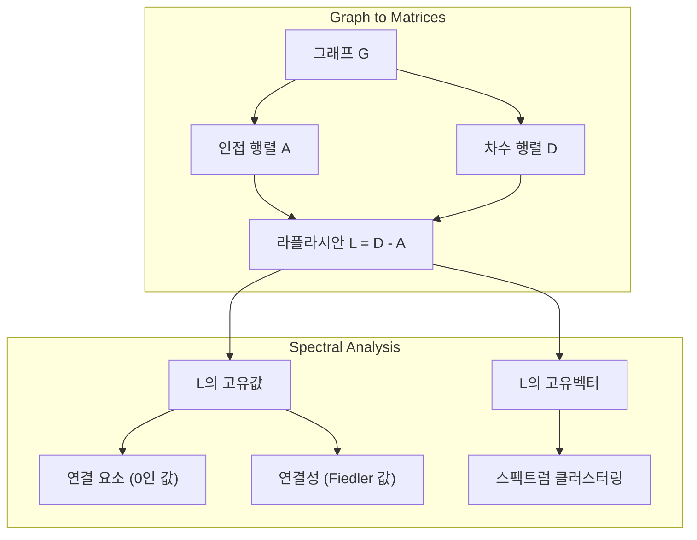
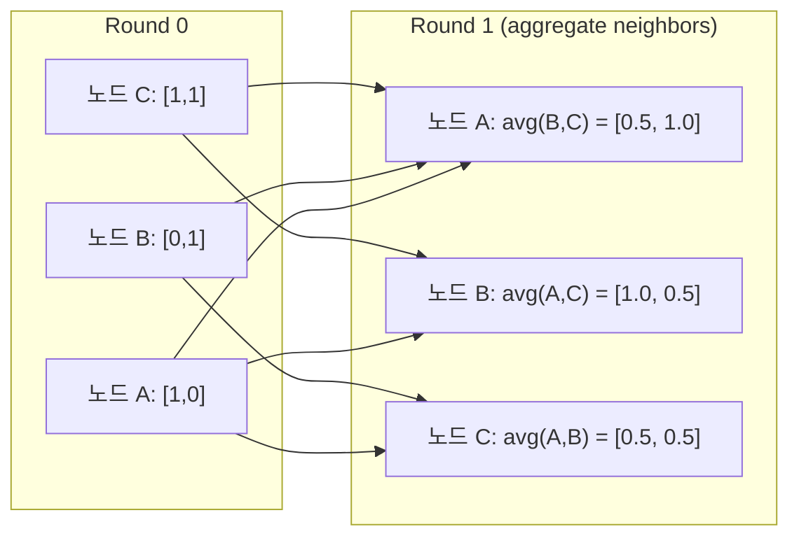

# 머신러닝을 위한 그래프 이론

> 그래프는 관계의 데이터 구조입니다. 데이터에 연결이 있다면 그래프 이론이 필요합니다.

**유형:** Build
**언어:** Python
**선수 요건:** 1단계, 01-03강 (선형대수, 행렬)
**시간:** 약 90분

## 학습 목표

- 인접 행렬/리스트 표현을 가진 그래프 클래스를 구축하고 BFS 및 DFS 순회를 구현해 보세요
- 그래프 라플라시안(Graph Laplacian)을 계산하고 그 고유값(Eigenvalue)을 사용하여 연결된 구성 요소를 감지하고 노드를 클러스터링해 보세요
- 정규화된 인접 행렬 곱셈으로 GNN 스타일 메시지 패싱(Message Passing) 한 라운드를 구현해 보세요
- Fiedler 벡터를 사용하여 그래프를 분할하기 위해 스펙트럴 클러스터링(Spectral Clustering)을 적용해 보세요

## 문제점

소셜 네트워크, 분자, 지식 베이스, 인용 네트워크, 도로 지도 -- 모두 그래프입니다. 전통적인 ML은 데이터를 평평한 테이블로 취급합니다. 각 행은 독립적입니다. 각 특징(Feature)은 열입니다. 하지만 연결의 구조가 중요할 때, 테이블은 실패합니다.

소셜 네트워크를 고려해 보세요. 사용자가 어떤 제품을 구매할지 예측하고 싶다고 가정합니다. 사용자의 구매 이력이 중요합니다. 하지만 친구들의 구매 이력이 더 중요합니다. 연결은 신호를 전달합니다.

또는 분자를 고려해 보세요. 단백질에 결합하는지 예측하고 싶다고 가정합니다. 원자 자체가 중요하지만, 원자들이 서로 어떻게 결합되어 있는지가 정말 중요합니다. 구조가 데이터입니다.

그래프 신경망(GNN, Graph Neural Networks)은 딥러닝에서 가장 빠르게 성장하는 분야입니다. 약물 발견, 소셜 추천, 사기 탐지, 지식 그래프 추론을 뒷받침합니다. 모든 GNN은 동일한 기반 위에 구축됩니다: 기본 그래프 이론입니다.

네 가지가 필요합니다:
1. 그래프를 행렬로 표현하는 방법 (곱셈을 수행할 수 있도록)
2. 그래프 구조를 탐색하기 위한 순회 알고리즘
3. 라플라시안(Laplacian) -- 스펙트럴 그래프 이론에서 가장 중요한 단일 행렬
4. 메시지 패싱(Message Passing) -- GNN을 작동하게 만드는 연산

## 개념

### 그래프: 노드와 엣지

그래프 G = (V, E)는 정점(노드) V와 엣지 E로 구성됩니다. 각 엣지는 두 노드를 연결합니다.

**방향 그래프 vs 무방향 그래프.** 무방향 그래프에서 간선 (u, v)는 u가 v와 연결되고 v도 u와 연결됨을 의미합니다. 방향 그래프(digraph)에서는 간선 (u, v)가 u가 v를 가리키며, 그 역은 반드시 성립하지 않음을 의미합니다.

**가중 그래프 vs 비가중 그래프.** 비가중 그래프에서는 간선이 존재하거나 존재하지 않습니다. 가중 그래프에서는 각 간선이 수치 가중치를 가집니다. 이는 거리, 비용, 강도 등을 나타냅니다.

| 그래프 유형 | 예시 |
|-----------|---------|
| 무방향, 비가중 | Facebook 친구 네트워크 |
| 방향, 비가중 | Twitter 팔로우 네트워크 |
| 무방향, 가중 | 도로 지도 (거리) |
| 방향, 가중 | 웹 페이지 링크 (PageRank 점수) |

### 인접 행렬

인접 행렬 A는 핵심 표현입니다. n개의 노드를 가진 그래프의 경우:

```
A[i][j] = 1    if there is an edge from node i to node j
A[i][j] = 0    otherwise
```

무방향 그래프에서는 A가 대칭입니다. 즉, A[i][j] = A[j][i]입니다. 가중 그래프에서는 A[i][j]가 간선 (i, j)의 가중치입니다.

**예시 -- 삼각형:**

```
Nodes: 0, 1, 2
Edges: (0,1), (1,2), (0,2)

A = [[0, 1, 1],
     [1, 0, 1],
     [1, 1, 0]]
```

인접 행렬은 모든 GNN의 입력입니다. A에 대한 행렬 연산은 그래프에 대한 연산에 대응됩니다.

### 차수

노드의 차수는 그 노드에 연결된 간선의 수입니다. 방향 그래프에서는 진입 차수(들어오는 간선)와 나가는 차수(나가는 간선)가 있습니다.

차수 행렬 D는 대각 행렬입니다:

```
D[i][i] = degree of node i
D[i][j] = 0    for i != j
```

삼각형 예시에서는 모든 노드가 다른 두 노드와 연결되므로 D = diag(2, 2, 2)입니다.

차수는 노드의 중요성을 알려줍니다. 높은 차수 = 허브 노드. 네트워크의 차수 분포는 그 구조를 드러냅니다. 소셜 네트워크는 멱법칙을 따릅니다(허브는 적고, 리프 노드는 많습니다). 랜덤 그래프는 포아송 분포를 따르는 차수를 가집니다.

### BFS와 DFS

두 가지 기본 그래프 순회 알고리즘입니다. 둘 다 필요합니다.

**너비 우선 탐색 (BFS):** 먼저 모든 이웃을 탐색한 후, 이웃의 이웃을 탐색합니다. 큐(FIFO)를 사용합니다.

```
BFS from node 0:
  Visit 0
  Queue: [1, 2]        (neighbors of 0)
  Visit 1
  Queue: [2, 3]        (add neighbors of 1)
  Visit 2
  Queue: [3]           (neighbors of 2 already visited)
  Visit 3
  Queue: []            (done)
```

BFS는 비가중 그래프에서 최단 경로를 찾습니다. 시작점부터 임의의 노드까지의 거리는 해당 노드가 처음 발견된 BFS 레벨과 같습니다. 이 때문에 BFS는 소셜 네트워크에서 홉 수 거리를 계산하는 데 사용됩니다.

**깊이 우선 탐색 (DFS):** 되돌아 가기 전에 가능한 한 깊게 들어갑니다. 스택 (LIFO) 또는 재귀를 사용합니다.

```
DFS from node 0:
  Visit 0
  Stack: [1, 2]        (neighbors of 0)
  Visit 2               (pop from stack)
  Stack: [1, 3]         (add neighbors of 2)
  Visit 3               (pop from stack)
  Stack: [1]
  Visit 1               (pop from stack)
  Stack: []             (done)
```

DFS는 다음에 유용합니다:
- 연결 요소 찾기 (방문하지 않은 노드에서 DFS 실행)
- 사이클 감지 (DFS 트리의 백 엣지)
- 위상 정렬 (DFS 종료 순서의 역순)

| 알고리즘 | 데이터 구조 | 찾는 것 | 사용 사례 |
|-----------|---------------|-------|----------|
| BFS | 큐 | 최단 경로 | 소셜 네트워크 거리, 지식 그래프 순회 |
| DFS | 스택 | 연결 요소, 사이클 | 연결성, 위상 정렬 |

### 그래프 라플라시안

L = D - A. 스펙트럼 그래프 이론에서 가장 중요한 행렬입니다.

삼각형의 경우:

```
D = [[2, 0, 0],    A = [[0, 1, 1],    L = [[2, -1, -1],
     [0, 2, 0],         [1, 0, 1],         [-1, 2, -1],
     [0, 0, 2]]         [1, 1, 0]]         [-1, -1,  2]]
```

라플라시안은 주목할 만한 특성을 가집니다:

1. **L은 양의 준반 definite입니다.** 모든 고유값은 >= 0입니다.

2. **0인 고유값의 개수는 연결 요소의 개수와 같습니다.** 연결된 그래프는 정확히 하나의 0 고유값을 가집니다. 3개의 분리된 연결 요소를 가진 그래프는 세 개의 0 고유값을 가집니다.

3. **가장 작은 0이 아닌 고유값 (Fiedler 값)은 연결성을 측정합니다.** 큰 Fiedler 값은 그래프가 잘 연결되어 있음을 의미합니다. 작은 Fiedler 값은 그래프에 약한 지점, 즉 병목 현상이 있음을 의미합니다.

4. **Fiedler 값의 고유벡터 (Fiedler 벡터)는 최선의 분할을 드러냅니다.** 양의 값을 가진 노드는 한 그룹으로, 음의 값을 가진 노드는 다른 그룹으로 갑니다. 이것이 스펙트럼 클러스터링입니다.



### 스펙트럼 특성

인접 행렬과 라플라시안의 고유값은 순회 없이 구조적 특성을 드러냅니다.

**스펙트럼 클러스터링**은 다음과 같이 작동합니다:
1. 라플라시안 L 계산
2. L의 가장 작은 k개 고유벡터 찾기 (연결된 그래프의 경우 전체가 1인 첫 번째 벡터는 건너뜁니다)
3. 각 노드의 새로운 좌표로 그 고유벡터를 사용하세요
4. 그 좌표에 k-means를 실행하세요

왜 이것이 작동할까요? L의 고유벡터는 그래프에서 "가장 매끄러운" 함수를 인코딩합니다. 잘 연결된 노드는 유사한 고유벡터 값을 얻습니다. 병목 현상에 의해 분리된 노드는 서로 다른 값을 얻습니다. 고유벡터는 자연스럽게 클러스터를 분리합니다.

**랜덤 워크 연결.** 정규화된 라플라시안은 그래프의 랜덤 워크와 관련이 있습니다. 랜덤 워크의 정상 분포는 노드 차수에 비례합니다. 혼합 시간(워크가 수렴하는 속도)은 스펙트럼 갭에 의존합니다.

### 메시지 패싱

그래프 신경망(Graph Neural Networks)의 핵심 연산입니다. 각 노드는 이웃으로부터 메시지를 수집하고, 이를 집계(aggregation)하며, 자신의 상태를 업데이트합니다.

```
h_v^(k+1) = UPDATE(h_v^(k), AGGREGATE({h_u^(k) : u in neighbors(v)}))
```

가장 단순한 형태에서는 AGGREGATE는 평균이고, UPDATE는 선형 변환 + 활성화 함수입니다:

```
h_v^(k+1) = sigma(W * mean({h_u^(k) : u in neighbors(v)}))
```

이것은 변장한 행렬 곱셈입니다. H가 모든 노드 특징의 행렬이고 A가 인접 행렬이라면:

```
H^(k+1) = sigma(A_norm * H^(k) * W)
```

여기서 A_norm은 정규화된 인접 행렬(각 행의 합이 1)입니다.

메시지 패싱 한 라운드는 각 노드가 즉각적인 이웃을 "볼" 수 있게 합니다. 두 라운드는 이웃의 이웃을 볼 수 있게 합니다. K 라운드는 각 노드에 K-hop 이웃의 정보를 제공합니다.



### 개념 및 ML 응용

| 개념 | ML 응용 |
|---------|---------------|
| 인접 행렬 | GNN 입력 표현 |
| 그래프 라플라시안 | 스펙트럼 클러스터링, 커뮤니티 탐지 |
| BFS/DFS | 지식 그래프 순회, 경로 찾기 |
| 차수 분포 | 노드 중요도, 특징 엔지니어링 |
| 메시지 패싱 | GNN 레이어 (GCN, GAT, GraphSAGE) |
| L의 고유값 | 커뮤니티 탐지, 그래프 분할 |
| 스펙트럼 클러스터링 | 비지도 노드 그룹화 |
| PageRank | 노드 중요도, 웹 검색 |

```figure
graph-degree-distribution
```

## 구현하기

### 1단계: 처음부터 Graph 클래스 구현하기

```python
class Graph:
    def __init__(self, n_nodes, directed=False):
        self.n = n_nodes
        self.directed = directed
        self.adj = {i: {} for i in range(n_nodes)}

    def add_edge(self, u, v, weight=1.0):
        self.adj[u][v] = weight
        if not self.directed:
            self.adj[v][u] = weight

    def neighbors(self, node):
        return list(self.adj[node].keys())

    def degree(self, node):
        return len(self.adj[node])

    def adjacency_matrix(self):
        import numpy as np
        A = np.zeros((self.n, self.n))
        for u in range(self.n):
            for v, w in self.adj[u].items():
                A[u][v] = w
        return A

    def degree_matrix(self):
        import numpy as np
        D = np.zeros((self.n, self.n))
        for i in range(self.n):
            D[i][i] = self.degree(i)
        return D

    def laplacian(self):
        return self.degree_matrix() - self.adjacency_matrix()
```

인접 리스트(`self.adj`)는 이웃 노드를 효율적으로 저장합니다. 스펙트럼 연산은 모두 numpy가 필요하므로, 인접 행렬 변환에는 numpy를 사용합니다.

### 2단계: BFS와 DFS

```python
from collections import deque

def bfs(graph, start):
    visited = set()
    order = []
    distances = {}
    queue = deque([(start, 0)])
    visited.add(start)
    while queue:
        node, dist = queue.popleft()
        order.append(node)
        distances[node] = dist
        for neighbor in graph.neighbors(node):
            if neighbor not in visited:
                visited.add(neighbor)
                queue.append((neighbor, dist + 1))
    return order, distances


def dfs(graph, start):
    visited = set()
    order = []
    stack = [start]
    while stack:
        node = stack.pop()
        if node in visited:
            continue
        visited.add(node)
        order.append(node)
        for neighbor in reversed(graph.neighbors(node)):
            if neighbor not in visited:
                stack.append(neighbor)
    return order
```

BFS는 O(1)의 popleft를 위해 deque(양방향 큐)를 사용합니다. DFS는 리스트를 스택으로 사용합니다. 둘 다 모든 노드를 정확히 한 번 방문하며, 시간 복잡도는 O(V + E)입니다.

### 3단계: 연결 요소와 라플라시안 고유값

```python
def connected_components(graph):
    visited = set()
    components = []
    for node in range(graph.n):
        if node not in visited:
            order, _ = bfs(graph, node)
            visited.update(order)
            components.append(order)
    return components


def laplacian_eigenvalues(graph):
    import numpy as np
    L = graph.laplacian()
    eigenvalues = np.linalg.eigvalsh(L)
    return eigenvalues
```

`eigvalsh`는 대칭 행렬용입니다. 무방향 그래프의 라플라시안은 항상 대칭입니다. 고유값을 오름차순으로 반환합니다. 0의 개수를 세어 연결 요소의 수를 찾습니다.

### 4단계: 스펙트럼 클러스터링

```python
def spectral_clustering(graph, k=2):
    import numpy as np
    L = graph.laplacian()
    eigenvalues, eigenvectors = np.linalg.eigh(L)
    features = eigenvectors[:, 1:k+1]

    labels = np.zeros(graph.n, dtype=int)
    for i in range(graph.n):
        if features[i, 0] >= 0:
            labels[i] = 0
        else:
            labels[i] = 1
    return labels
```

k=2인 경우, Fiedler 벡터의 부호로 그래프를 두 개의 클러스터로 나눕니다. k>2인 경우, 자명(trivial)한 전체 1 고유벡터를 제외하고 첫 k개의 고유벡터에 대해 k-means를 실행합니다.

### 5단계: 메시지 패싱

```python
def message_passing(graph, features, weight_matrix):
    import numpy as np
    A = graph.adjacency_matrix()
    row_sums = A.sum(axis=1, keepdims=True)
    row_sums[row_sums == 0] = 1
    A_norm = A / row_sums
    aggregated = A_norm @ features
    output = aggregated @ weight_matrix
    return output
```

이것은 GNN 메시지 패싱의 한 라운드입니다. 각 노드의 새로운 특징은 이웃 노드의 특징을 가중 평균한 후 가중치 행렬로 변환한 것입니다. 여러 라운드를 쌓아 정보를 더 멀리 전파합니다.

## 사용하기

networkx와 numpy를 사용하면 같은 연산이 한 줄 코드가 됩니다:

```python
import networkx as nx
import numpy as np

G = nx.karate_club_graph()

A = nx.adjacency_matrix(G).toarray()
L = nx.laplacian_matrix(G).toarray()

eigenvalues = np.linalg.eigvalsh(L.astype(float))
print(f"Smallest eigenvalues: {eigenvalues[:5]}")
print(f"Connected components: {nx.number_connected_components(G)}")

communities = nx.community.greedy_modularity_communities(G)
print(f"Communities found: {len(communities)}")

pr = nx.pagerank(G)
top_nodes = sorted(pr.items(), key=lambda x: x[1], reverse=True)[:5]
print(f"Top 5 PageRank nodes: {top_nodes}")
```

networkx는 최적화된 C 백엔드로 모든 크기의 그래프를 처리합니다. 프로덕션에서는 networkx를 사용하세요. 처음부터 구현한 코드로 networkx가 하는 일을 이해해 보세요.

### numpy 스펙트럼 분석

```python
import numpy as np

A = np.array([
    [0, 1, 1, 0, 0],
    [1, 0, 1, 0, 0],
    [1, 1, 0, 1, 0],
    [0, 0, 1, 0, 1],
    [0, 0, 0, 1, 0]
])

D = np.diag(A.sum(axis=1))
L = D - A

eigenvalues, eigenvectors = np.linalg.eigh(L)
print(f"Eigenvalues: {np.round(eigenvalues, 4)}")
print(f"Fiedler value: {eigenvalues[1]:.4f}")
print(f"Fiedler vector: {np.round(eigenvectors[:, 1], 4)}")

fiedler = eigenvectors[:, 1]
group_a = np.where(fiedler >= 0)[0]
group_b = np.where(fiedler < 0)[0]
print(f"Cluster A: {group_a}")
print(f"Cluster B: {group_b}")
```

Fiedler 벡터가 핵심적인 역할을 합니다. 한 클러스터에는 양수 값, 다른 클러스터에는 음수 값이 들어갑니다. 반복적인 최적화가 필요 없으며, 고유분해 한 번으로 충분합니다.

## 출시하기

이 강의에서 생성되는 결과물:
- `outputs/skill-graph-analysis.md` -- 그래프 구조 데이터를 분석하기 위한 스킬 참조

## 연결 관계

| 개념 | 나타나는 위치 |
|---------|------------------|
| 인접 행렬 | GCN, GAT, GraphSAGE 입력 |
| 라플라시안 | 스펙트럼 클러스터링, ChebNet 필터 |
| BFS | 지식 그래프 순회, 최단 경로 쿼리 |
| 메시지 패싱 | 모든 GNN 레이어, 신경 메시지 패싱 |
| 스펙트럼 간격 | 그래프 연결성, 랜덤 워크의 혼합 시간 |
| 차수 분포 | 멱법칙 네트워크, 노드 특징 엔지니어링 |
| 연결 요소 | 전처리, 연결되지 않은 그래프 처리 |
| PageRank | 노드 중요도 순위 매기기, 어텐션 초기화 |

GNN은 특별히 언급할 가치가 있습니다. GCN(Kipf & Welling, 2017)의 그래프 컨볼루션 연산은 자기 루프가 추가된 인접 행렬 A_hat = A + I를 사용합니다:

```text
H^(l+1) = sigma(D_hat^(-1/2) * A_hat * D_hat^(-1/2) * H^(l) * W^(l))
```

여기서 A_hat = A + I (인접 행렬에 자기 루프를 더한 것)이며 D_hat는 A_hat의 차수 행렬입니다. 자기 루프는 각 노드가 집계 과정에서 자신의 특징을 포함하도록 보장합니다. 이는 대칭 정규화(message passing)와 정확히 동일합니다. D_hat^(-1/2) * A_hat * D_hat^(-1/2)는 정규화된 인접 행렬입니다. 이 정규화는 L_sym = I - D^(-1/2) * A * D^(-1/2)와 관련되어 있기 때문에 라플라시안이 등장합니다. 라플라시안을 이해한다는 것은 GCN이 작동하는 이유를 이해하는 것을 의미합니다.

## 연습 문제

1. **PageRank를 처음부터 구현해 보세요.** 균일한 점수로 시작합니다. 각 단계에서: score(v) = (1-d)/n + d * sum(score(u)/out_degree(u))를 v를 가리키는 모든 u에 대해 계산합니다. d=0.85를 사용하세요. 수렴할 때까지(변화 < 1e-6) 실행하세요. 작은 웹 그래프에서 테스트해 보세요.

2. **스펙트럴 클러스터링을 사용하여 커뮤니티를 찾아보세요.** 두 개의 명확하게 분리된 클러스터(예: 단일 엣지로 연결된 두 개의 클리크)를 가진 그래프를 만드세요. 스펙트럴 클러스터링을 실행하고 올바른 분할을 찾는지 확인하세요. 클러스터 간 엣지를 추가하면 어떻게 되나요?

3. **가중 그래프에서 최단 경로를 찾기 위해 다익스트라 알고리즘을 구현해 보세요.** 동일한 그래프에 균일한 가중치를 적용한 BFS 결과와 비교하세요.

4. **2층 메시지 패싱 네트워크를 구축해 보세요.** 서로 다른 가중치 행렬로 메시지 패싱을 두 번 적용하세요. 2라운드 후 각 노드가 2-hop 이웃의 정보를 갖게 됨을 보여주세요.

5. **실제 그래프를 분석해 보세요.** 카라테 클럽 그래프(34개 노드, 78개 엣지)를 사용하세요. 차수 분포, 라플라시안 고유값 및 스펙트럴 클러스터링을 계산하세요. 스펙트럴 클러스터링 결과를 알려진 정답 분할과 비교하세요.

## 핵심 용어

| 용어 | 사람들이 말하는 것 | 실제 의미 |
|------|----------------|----------------------|
| 그래프 | "노드와 엣지" | 쌍대 관계를 인코딩하는 수학 구조 G=(V,E) |
| 인접 행렬 | "연결 테이블" | 노드 i와 j가 연결되어 있으면 A[i][j] = 1인 n x n 행렬 |
| 차수 | "노드의 연결 정도" | 노드에 접한 간선의 수 |
| 라플라시안 | "D에서 A를 뺀 값" | L = D - A, 고유값이 그래프 구조를 드러내는 행렬 |
| 피들러 값 | "대수적 연결성" | L의 가장 작은 비영 고유값으로, 그래프가 얼마나 잘 연결되어 있는지를 측정 |
| BFS | "레벨 단위 탐색" | 더 깊이 들어가기 전에 모든 이웃을 방문하는 순회로, 최단 경로를 찾음 |
| DFS | "먼저 깊이 들어가기" | 한 경로를 끝까지 따라간 후 백트래킹하는 순회 |
| 메시지 패싱 | "노드가 이웃과 대화" | 각 노드가 이웃으로부터 정보를 집계하는 방식으로, GNN의 핵심 |
| 스펙트럴 클러스터링 | "고유벡터로 클러스터링" | 라플라시안의 고유벡터를 사용하여 그래프를 분할 |
| 연결 요소 | "독립적인 조각" | 모든 노드가 서로 도달할 수 있는 최대 부분 그래프 |

## 추가 읽기

- **Kipf & Welling (2017)** -- "Semi-Supervised Classification with Graph Convolutional Networks." 현대 GNN을 시작한 논문. 스펙트럴 그래프 컨볼루션이 메시지 패싱으로 단순화됨을 보여줍니다.
- **Spielman (2012)** -- "Spectral Graph Theory" 강의 노트. 라플라시안, 스펙트럴 갭, 그래프 분할에 대한 결정적인 소개.
- **Hamilton (2020)** -- "Graph Representation Learning." 기초부터 응용까지 GNN을 다루는 책.
- **Bronstein et al. (2021)** -- "Geometric Deep Learning: Grids, Groups, Graphs, Geodesics, and Gauges." 통합 프레임워크 논문.
- **Veličković et al. (2018)** -- "Graph Attention Networks." 어텐션 메커니즘으로 메시지 패싱을 확장.
