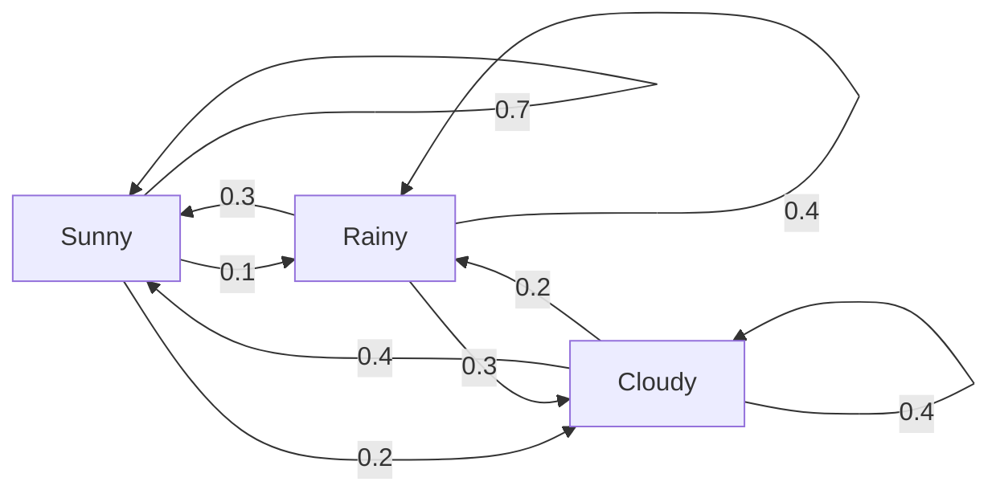
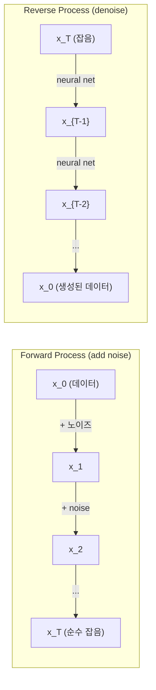

# 확률 과정

> 구조가 있는 무작위성. 랜덤 워크, 마르코프 체인, 확산 모델背后的 수학입니다.

**유형:** Learn
**언어:** Python
**선수 요건:** 1단계, 06-07강 (확률, 베이즈)
**시간:** 약 75분

## 학습 목표

- 1D 및 2D 랜덤 워크를 시뮬레이션하고 변위의 sqrt(n) 스케일링을 검증해 보세요
- 마르코프 체인 시뮬레이터를 구축하고 고유분해를 통해 정상 분포를 계산해 보세요
- 목표 분포에서 샘플링하기 위해 Metropolis-Hastings MCMC와 Langevin 동역학을 구현해 보세요
- 순방향 확산 과정을 브라운 운동과 연결하고, 역방향 과정이 데이터를 생성하는 방식을 설명해 보세요

## 문제점

많은 AI 시스템은 시간에 따라 진화하는 무작위성을 포함합니다. 정적인 무작위성이 아니라, 각 단계가 이전 단계에 의존하는 구조적이고 순차적인 무작위성입니다.

언어 모델은 토큰을 하나씩 생성합니다. 각 토큰은 이전 컨텍스트에 의존합니다. 모델은 확률 분포를 출력하고, 이를 샘플링하며, 다음 단계로 이동합니다. 이것이 확률 과정입니다.

확산 모델은 이미지가 순수한 정적 노이즈가 될 때까지 단계별로 노이즈를 추가합니다. 그런 다음 과정을 역전하여, 단계별로 노이즈를 제거하여 새로운 이미지가 나타나게 합니다. 순방향 과정은 마르코프 체인입니다. 역방향 과정은 역으로 실행되는 학습된 마르코프 체인입니다.

강화 학습 에이전트는 환경에서 행동을 취합니다. 각 행동은 확률에 따라 새로운 상태로 이어집니다. 에이전트는 무작위 세계에서 무작위 정책을 따릅니다. 전체가 마르코프 의사결정 과정입니다.

MCMC 샘플링 -- 베이지안 추론의 핵심 -- 은 샘플링하려는 사후 분포가 정상 분포인 마르코프 체인을 구성합니다.

이 모든 것은 네 가지 기본 아이디어에 기반합니다:
1. 랜덤 워크 -- 가장 단순한 확률 과정
2. 마르코프 체인 -- 전이 행렬을 가진 구조화된 무작위성
3. Langevin 동역학 -- 노이즈가 있는 경사 하강법
4. Metropolis-Hastings -- 임의의 분포에서 샘플링

## 개념

### 랜덤 워크

0번 위치에서 시작합니다. 각 단계마다 공정한 동전을 던집니다. 앞면: 오른쪽으로 이동 (+1). 뒷면: 왼쪽으로 이동 (-1).

n단계 후, 위치는 n개의 랜덤 +/-1 값의 합입니다. 기대 위치는 0입니다 (워킹은 편향되지 않았습니다). 하지만 원점으로부터의 기대 거리는 sqrt(n)만큼 증가합니다.

이는 직관적이지 않습니다. 워킹은 공정합니다 -- 어느 방향으로도 드리프트가 없습니다. 하지만 시간이 지남에 따라, 시작 위치에서 점점 더 멀리 떠돌아다닙니다. n단계 후의 표준 편차는 sqrt(n)입니다.

```
Step 0:  Position = 0
Step 1:  Position = +1 or -1
Step 2:  Position = +2, 0, or -2
...
Step 100: Expected distance from origin ~ 10 (sqrt(100))
Step 10000: Expected distance from origin ~ 100 (sqrt(10000))
```

**2D에서는**, 워킹이 위, 아래, 왼쪽, 오른쪽으로 동일한 확률로 이동합니다. 원점으로부터의 거리에도 동일한 sqrt(n) 스케일링이 적용됩니다. 경로는 프랙탈과 유사한 패턴을 그립니다.

**왜 sqrt(n)일까요?** 각 단계는 동일한 확률로 +1 또는 -1입니다. n단계 후, 위치 S_n = X_1 + X_2 + ... + X_n이며, 각 X_i는 +/-1입니다. 각 단계의 분산은 1이고, 단계들은 독립적이므로 Var(S_n) = n입니다. 표준 편차 = sqrt(n). 중심 극한 정리에 의해, S_n / sqrt(n)은 표준 정규 분포로 수렴합니다.

이 sqrt(n) 스케일링은 ML 전반에 나타납니다. SGD 노이즈는 1/sqrt(batch_size)로 스케일링됩니다. 임베딩 차원은 sqrt(d)로 스케일링됩니다. 제곱근은 독립적인 랜덤 추가의 시그니처입니다.

**브라운 운동과의 연결.** 단계 크기가 1/sqrt(n)이고 단위 시간당 n단계인 랜덤 워킹을 취합니다. n이 무한대로 갈수록, 워킹은 브라운 운동 B(t)로 수렴합니다 -- B(t)가 평균 0, 분산 t인 정규 분포를 따르는 연속 시간 프로세스입니다.

브라운 운동은 확산(diffusion)의 수학적 기초입니다. 유체 내 입자의 랜덤한 흔들림, 주가 변동, 그리고 -- 결정적으로 -- 확산 모델의 노이즈 프로세스를 모델링합니다.

**도박자의 파산.** 위치 k에서 시작하고, 00강 N에 흡수 장벽이 있는 랜덤 워커입니다. 0에 도달하기 전에 N에 도달할 확률은 무엇일까요? 공정한 워킹의 경우: P(N 도달) = k/N. 이는 놀라울 정도로 단순하고 우아합니다. 이는 마팅게일 이론과 연결됩니다 -- 공정한 랜덤 워킹은 마팅게일입니다 (기대 미래 값 = 현재 값).

### 마르코프 체인

마르코프 체인은 고정된 확률에 따라 상태 간에 전환하는 시스템입니다. 핵심 속성: 다음 상태는 현재 상태에만 의존하며, 역사에는 의존하지 않습니다.

```
P(X_{t+1} = j | X_t = i, X_{t-1} = ...) = P(X_{t+1} = j | X_t = i)
```

이것이 마르코프 성질입니다. 이는 전이 행렬 P로 전체 동역학을 표현할 수 있음을 의미합니다:

```
P[i][j] = probability of going from state i to state j
```

P의 각 행의 합은 1입니다 (어딘가로 이동해야 합니다).

**예시 -- 날씨:**

```
States: Sunny (0), Rainy (1), Cloudy (2)

P = [[0.7, 0.1, 0.2],    (if sunny: 70% sunny, 10% rainy, 20% cloudy)
     [0.3, 0.4, 0.3],    (if rainy: 30% sunny, 40% rainy, 30% cloudy)
     [0.4, 0.2, 0.4]]    (if cloudy: 40% sunny, 20% rainy, 40% cloudy)
```

임의의 상태에서 시작하세요. 많은 전이 후, 상태의 분포는 정적 분포 pi로 수렴합니다. 여기서 pi * P = pi가 성립합니다. 이는 고유값이 1인 P의 좌 고유벡터입니다.

날씨 체인의 경우, 정적 분포는 [0.55, 0.18, 0.27]입니다. 즉, 장기적으로 시작 상태와 무관하게 55%의 시간 동안 맑은 날씨입니다.



**정적 분포 계산.** 두 가지 접근법이 있습니다:

1. **멱법(Power method)**: 임의의 초기 분포에 P를 반복적으로 곱합니다. 충분히 반복하면 수렴합니다.
2. **고유값 방법(Eigenvalue method)**: 고유값이 1인 P의 좌 고유벡터를 찾습니다. 이는 P^T의 고유값이 1인 고유벡터입니다.

두 접근법 모두 체인이 수렴 조건을 만족해야 합니다.

**수렴 조건.** 마르코프 체인이 유일한 정적 분포로 수렴하려면 다음 조건을 만족해야 합니다:
- **기약(Irreducible)**: 모든 상태가 다른 모든 상태에서 도달 가능해야 합니다
- **비주기적(Aperiodic)**: 체인이 고정된 주기로 순환하지 않아야 합니다

ML에서 마주치는 대부분의 체인은 두 조건을 모두 만족합니다.

**흡수 상태.** 한 번 진입하면 절대 나가지 않는 상태(P[i][i] = 1)를 흡수 상태라고 합니다. 흡수 마르코프 체인은 종단 상태가 있는 프로세스를 모델링합니다. 예를 들어, 종료되는 게임, 이탈하는 고객, 텍스트 끝 토큰에 도달하는 토큰 시퀀스 등이 있습니다.

**혼합 시간(Mixing time).** 체인이 정적 분포에 "가깝게" 되려면 몇 단계가 필요할까요? 형식적으로는 정적 상태로부터의 총 변형 거리(total variation distance)가 특정 임계값 아래로 떨어질 때까지의 단계 수입니다. 빠른 혼합 = 적은 단계가 필요합니다. P의 스펙트럼 갭(1에서 두 번째로 큰 고유값을 뺀 값)이 혼합 시간을 제어합니다. 갭이 클수록 혼합이 빠릅니다.

### 언어 모델과의 연결

언어 모델에서의 토큰 생성은 대략적인 마르코프 프로세스입니다. 현재 컨텍스트가 주어지면, 모델은 다음 토큰에 대한 분포를 출력합니다. 온도가 날카로움을 제어합니다:

```
P(token_i) = exp(logit_i / temperature) / sum(exp(logit_j / temperature))
```

- 온도 = 1.0: 표준 분포
- 온도(Temperature) < 1.0: 더 날카로움(더 결정론적)
- 온도(Temperature) > 1.0: 더 평평함(더 랜덤)
- 온도(Temperature) -> 0: argmax (greedy)

Top-k 샘플링은 확률이 가장 높은 k개의 토큰으로 잘라냅니다. Top-p (핵 샘플링)은 누적 확률이 p를 초과하는 가장 작은 토큰 집합으로 잘라냅니다. 두 방법 모두 마르코프 전이 확률을 수정합니다.

### 브라운 운동

랜덤 워크의 연속 시간 극한입니다. 위치 B(t)는 세 가지 특성을 가집니다:
1. B(0) = 0
2. B(t) - B(s)는 평균 0, 분산 t - s인 정규 분포를 따릅니다 (t > s인 경우)
3. 중복되지 않는 구간의 증분은 독립적입니다

브라운 운동은 연속적이지만 어디에서도 미분 불가능합니다 -- 모든 스케일에서 흔들립니다. 경로는 평면에서 프랙탈 차원 2를 가집니다.

이산 시뮬레이션에서는 브라운 운동을 다음과 같이 근사합니다:

```
B(t + dt) = B(t) + sqrt(dt) * z,    where z ~ N(0, 1)
```

sqrt(dt) 스케일링이 중요합니다. 이는 랜덤 워크에 적용된 중심 극한 정리에서 유래합니다.

### 랑주뱅 동역학

경사 하강법은 함수의 최솟값을 찾습니다. 랑주뱅 동역학은 exp(-U(x)/T)에 비례하는 확률 분포를 찾습니다. 여기서 U는 에너지 함수이고 T는 온도(Temperature)입니다.

```
x_{t+1} = x_t - dt * gradient(U(x_t)) + sqrt(2 * T * dt) * z_t
```

두 가지 힘이 입자에 작용합니다:
1. **경사 힘** (-dt * gradient(U)): 낮은 에너지 쪽으로 밀어냅니다 (경사 하강법과 유사)
2. **랜덤 힘** (sqrt(2*T*dt) * z): 랜덤한 방향으로 밀어냅니다 (탐색)

온도(Temperature) T = 0에서는 순수한 경사 하강법입니다. 높은 온도에서는 거의 랜덤 워크입니다. 적절한 온도에서는 입자가 에너지 지형을 탐색하며 낮은 에너지 영역에 더 많은 시간을 보냅니다.

**확산 모델과의 연결.** 확산 모델의 순방향 과정은 다음과 같습니다:

```
x_t = sqrt(alpha_t) * x_{t-1} + sqrt(1 - alpha_t) * noise
```

이는 데이터를 점진적으로 노이즈와 혼합하는 마르코프 체인입니다. 충분한 단계 후, x_T는 순수한 가우시안 노이즈가 됩니다.

역방향 과정 -- 노이즈에서 데이터로 돌아가는 과정 -- 역시 마르코프 체인이지만, 그 전이 확률은 신경망에 의해 학습됩니다. 네트워크는 각 단계에서 추가된 노이즈를 예측한 후 이를 빼내는 것을 학습합니다.



### MCMC: 마르코프 체인 몬테 카를로

상수까지 평가할 수 있지만 직접 샘플링할 수 없는 분포 p(x)에서 샘플링해야 할 때가 있습니다. 베이지안 사후 분포가 대표적인 예입니다. 우도와 사전 확률의 곱은 알지만, 정규화 상수(normalizing constant)는 계산이 불가능합니다.

**메트로폴리스-헤이스팅스(Metropolis-Hastings)**는 정상 분포(stationary distribution)가 p(x)인 마르코프 체인을 구성합니다:

1. 어떤 위치 x에서 시작합니다
2. 제안 분포 Q(x'|x)에서 새로운 위치 x'를 제안합니다
3. 수락 비율을 계산합니다: a = p(x') * Q(x|x') / (p(x) * Q(x'|x))
4. 확률 min(1, a)로 x'를 수락합니다. 그렇지 않으면 x에 머무릅니다.
5. 반복합니다.

Q가 대칭인 경우(예: Q(x'|x) = Q(x|x') = N(x, sigma^2)), 비율은 a = p(x') / p(x)로 단순화됩니다. 확률의 비율만 필요하며, 정규화 상수는 상쇄됩니다.

가벼운 조건 하에서 체인은 p(x)로 수렴함이 보장됩니다. 하지만 제안이 너무 작으면(랜덤 워크) 수렴이 느려지고, 너무 크면(높은 기각률) 수렴이 느려집니다. 제안 분포를 조정하는 것이 MCMC의 핵심 기술입니다.

**작동 원리.** 수락 비율은 상세 균형(detailed balance)을 보장합니다. 즉, x에 있고 x'로 이동할 확률은 x'에 있고 x로 이동할 확률과 같습니다. 상세 균형은 p(x)가 체인의 정상 분포임을 의미합니다. 따라서 충분한 단계가 지나면 샘플은 p(x)에서 나옵니다.

**실용적 고려 사항:**
- **번인(Burn-in)**: 처음 N개의 샘플은 버립니다. 체인은 시작점에서 정상 분포에 도달할 시간이 필요합니다.
- **신징(Thinning)**: 자기상관(autocorrelation)을 줄이기 위해 k번째 샘플마다 하나만 유지합니다.
- **다중 체인**: 서로 다른 시작점에서 여러 체인을 실행합니다. 같은 분포로 수렴하면 수렴의 증거가 됩니다.
- **수락률**: d차원 가우시안 제안에 대해, 최적의 수락률은 약 23%입니다 (Roberts & Rosenthal, 2001). 너무 높으면 체인이 거의 움직이지 않습니다. 너무 낮으면 모든 것을 거부합니다.

### AI에서의 확률 과정

| 과정 | AI 응용 |
|---------|---------------|
| 랜덤 워크 | RL에서의 탐색, Node2Vec 임베딩 |
| 마르코프 체인 | 텍스트 생성, MCMC 샘플링 |
| 브라운 운동 | 확산 모델 (순방향 과정) |
| 란제뱅 동역학 | 점수 기반 생성 모델, SGLD |
| 마르코프 결정 과정 | 강화 학습 |
| 메트로폴리스-헤이스팅스 | 베이지안 추론, 사후 분포 샘플링 |

```figure
random-walk-diffusion
```

## 구현하기

### 1단계: 랜덤 워크 시뮬레이터

```python
import numpy as np

def random_walk_1d(n_steps, seed=None):
    rng = np.random.RandomState(seed)
    steps = rng.choice([-1, 1], size=n_steps)
    positions = np.concatenate([[0], np.cumsum(steps)])
    return positions


def random_walk_2d(n_steps, seed=None):
    rng = np.random.RandomState(seed)
    directions = rng.choice(4, size=n_steps)
    dx = np.zeros(n_steps)
    dy = np.zeros(n_steps)
    dx[directions == 0] = 1   # 오른쪽
    dx[directions == 1] = -1  # 왼쪽
    dy[directions == 2] = 1   # 위
    dy[directions == 3] = -1  # 아래
    x = np.concatenate([[0], np.cumsum(dx)])
    y = np.concatenate([[0], np.cumsum(dy)])
    return x, y
```

1D 랜덤 워크는 누적 합을 저장합니다. 각 단계는 +1 또는 -1입니다. n단계 후, 위치는 합입니다. 분산은 n에 따라 선형적으로 증가하므로, 표준 편차는 sqrt(n)으로 증가합니다.

### 2단계: 마르코프 체인

```python
class MarkovChain:
    def __init__(self, transition_matrix, state_names=None):
        self.P = np.array(transition_matrix, dtype=float)
        self.n_states = len(self.P)
        self.state_names = state_names or [str(i) for i in range(self.n_states)]

    def step(self, current_state, rng=None):
        if rng is None:
            rng = np.random.RandomState()
        probs = self.P[current_state]
        return rng.choice(self.n_states, p=probs)

    def simulate(self, start_state, n_steps, seed=None):
        rng = np.random.RandomState(seed)
        states = [start_state]
        current = start_state
        for _ in range(n_steps):
            current = self.step(current, rng)
            states.append(current)
        return states

    def stationary_distribution(self):
        eigenvalues, eigenvectors = np.linalg.eig(self.P.T)
        idx = np.argmin(np.abs(eigenvalues - 1.0))
        stationary = np.real(eigenvectors[:, idx])
        stationary = stationary / stationary.sum()
        return np.abs(stationary)
```

정적 분포는 고유값이 1인 P의 좌 고유벡터입니다. P^T의 고유벡터를 계산하여 이를 찾습니다 (전치하면 좌 고유벡터가 우 고유벡터가 됩니다).

### 3단계: 란제뱅 동역학

```python
def langevin_dynamics(grad_U, x0, dt, temperature, n_steps, seed=None):
    rng = np.random.RandomState(seed)
    x = np.array(x0, dtype=float)
    trajectory = [x.copy()]
    for _ in range(n_steps):
        noise = rng.randn(*x.shape)
        x = x - dt * grad_U(x) + np.sqrt(2 * temperature * dt) * noise
        trajectory.append(x.copy())
    return np.array(trajectory)
```

기울기는 x를 낮은 에너지 쪽으로 밀어냅니다. 잡음은 x가 갇히는 것을 방지합니다. 평형 상태에서 샘플의 분포는 exp(-U(x)/temperature)에 비례합니다.

### 4단계: 메트로폴리스-헤이스팅스

```python
def metropolis_hastings(target_log_prob, proposal_std, x0, n_samples, seed=None):
    rng = np.random.RandomState(seed)
    x = np.array(x0, dtype=float)
    samples = [x.copy()]
    accepted = 0
    for _ in range(n_samples - 1):
        x_proposed = x + rng.randn(*x.shape) * proposal_std
        log_ratio = target_log_prob(x_proposed) - target_log_prob(x)
        if np.log(rng.rand()) < log_ratio:
            x = x_proposed
            accepted += 1
        samples.append(x.copy())
    acceptance_rate = accepted / (n_samples - 1)
    return np.array(samples), acceptance_rate
```

알고리즘은 새로운 점을 제안하고, 더 높은 확률을 가지는지 확인하며 (또는 비율에 비례하는 확률로 수락), 이를 반복합니다. 좋은 혼합을 위해 수락률은 약 23-50%여야 합니다.

## 사용하기

실제로는 이러한 알고리즘을 위해 확립된 라이브러리를 사용합니다. 그러나 메커니즘을 이해하는 것은 디버깅과 튜닝에 중요합니다.

```python
import numpy as np

rng = np.random.RandomState(42)
walk = np.cumsum(rng.choice([-1, 1], size=10000))
print(f"Final position: {walk[-1]}")
print(f"Expected distance: {np.sqrt(10000):.1f}")
print(f"Actual distance: {abs(walk[-1])}")
```

### 전이 행렬을 위한 numpy

```python
import numpy as np

P = np.array([[0.7, 0.1, 0.2],
              [0.3, 0.4, 0.3],
              [0.4, 0.2, 0.4]])

distribution = np.array([1.0, 0.0, 0.0])
for _ in range(100):
    distribution = distribution @ P

print(f"Stationary distribution: {np.round(distribution, 4)}")
```

초기 분포에 P를 반복적으로 곱합니다. 충분한 반복 후, 시작 위치와 관계없이 정적 분포로 수렴합니다. 이는 지배적인 좌 고유벡터를 찾기 위한 멱법입니다.

### 실제 프레임워크와의 연결

- **PyTorch 확산 모델:** Hugging Face `diffusers`의 `DDPMScheduler`는 순방향 및 역방향 마르코프 체인을 구현합니다
- **NumPyro / PyMC:** 베이지안 추론을 위해 MCMC (Metropolis-Hastings를 개선한 NUTS 샘플러)를 사용합니다
- **Gymnasium (RL):** 환경의 step 함수는 마르코프 결정 과정을 정의합니다

### 마르코프 체인 수렴 검증

```python
import numpy as np

P = np.array([[0.9, 0.1], [0.3, 0.7]])

eigenvalues = np.linalg.eigvals(P)
spectral_gap = 1 - sorted(np.abs(eigenvalues))[-2]
print(f"Eigenvalues: {eigenvalues}")
print(f"Spectral gap: {spectral_gap:.4f}")
print(f"Approximate mixing time: {1/spectral_gap:.1f} steps")
```

스펙트럼 갭은 체인이 초기 상태를 얼마나 빠르게 잊는지 알려줍니다. 갭이 0.2이면 혼합까지 약 5단계가 필요합니다. 갭이 0.01이면 약 100단계가 필요합니다. 긴 시뮬레이션을 실행하기 전에 항상 이를 확인하세요. 느리게 혼합되는 체인은 연산 자원을 낭비합니다.

## 출시하기

이 강의는 다음을 생성합니다:
- `outputs/prompt-stochastic-process-advisor.md` -- 주어진 문제에 어떤 확률 과정 프레임워크가 적용되는지 식별하는 데 도움이 되는 프롬프트

## 연결

| 개념 | 나타나는 위치 |
|---------|------------------|
| 랜덤 워크 | Node2Vec 그래프 임베딩, RL에서의 탐색 |
| 마르코프 체인 | LLM의 토큰 생성, MCMC 샘플링 |
| 브라운 운동 | DDPM의 순방향 확산 과정, SDE 기반 모델 |
| 란제뱅 동역학 | 점수 기반 생성 모델, 확률적 경사 란제뱅 동역학 (SGLD) |
| 정상 분포 | MCMC 수렴 목표, PageRank |
| Metropolis-Hastings | 베이지안 사후 분포 샘플링, 시뮬레이션 어닐링 |
| 온도 | LLM 샘플링, RL의 볼츠만 탐색, 시뮬레이션 어닐링 |
| 혼합 시간 | MCMC 수렴 속도, 스펙트럼 갭 분석 |
| 흡수 상태 | 시퀀스 종료 토큰, RL의 종단 상태 |
| 상세 균형 | MCMC 샘플러의 정확성 보장 |

확산 모델은 특별한 주의가 필요합니다. DDPM (Ho et al., 2020)은 순방향 마르코프 체인을 정의합니다:

```
q(x_t | x_{t-1}) = N(x_t; sqrt(1-beta_t) * x_{t-1}, beta_t * I)
```

여기서 beta_t는 노이즈 스케줄입니다. T단계 후, x_T는 대략 N(0, I)가 됩니다. 역방향 과정은 노이즈를 예측하는 신경망으로 매개변수화됩니다:

```
p_theta(x_{t-1} | x_t) = N(x_{t-1}; mu_theta(x_t, t), sigma_t^2 * I)
```

생성의 모든 단계는 학습된 마르코프 체인의 한 단계입니다. 마르코프 체인을 이해한다는 것은 확산 모델이 데이터를 어떻게, 왜 생성하는지 이해하는 것을 의미합니다.

SGLD (확률적 경사 랑주뱅 동역학)(Stochastic Gradient Langevin Dynamics)는 미니배치 경사 하강법과 랑주뱅 노이즈를 결합합니다. 전체 기울기를 계산하는 대신 확률적 추정치를 사용하고 보정된 노이즈를 추가합니다. 학습률이 감소함에 따라 SGLD는 최적화에서 샘플링으로 전환되며, 근사적인 베이지안 사후 샘플을 무료로 얻을 수 있습니다. 이는 신경망에서 불확실성 추정치를 얻는 가장 간단한 방법 중 하나입니다.

이 모든 연결 고리에서 핵심 통찰은 확률적 과정이 단순한 이론적 도구가 아니라는 점입니다. 이들은 현대 AI 시스템 내부의 계산 메커니즘입니다. LLM의 온도를 조절할 때, 마르코프 체인을 조정하고 있습니다. 확산 모델을 학습할 때, 브라운 운동과 유사한 과정을 역전하는 것을 학습하고 있습니다. 베이지안 추론을 실행할 때, 사후 분포로 수렴하는 체인을 구성하고 있습니다.

## 연습 문제

1. **10000단계의 랜덤 워크 1000개를 시뮬레이션하세요.** 최종 위치의 분포를 플롯하세요. 평균이 0이고 표준 편차가 sqrt(10000) = 100인 가우시안 분포에 근사함을 확인하세요.

2. **마르코프 체인을 사용하여 텍스트 생성기를 구축하세요.** 작은 코퍼스로 학습하세요: 각 단어에 대해 다음 단어로의 전이를 세세요. 전이 행렬을 구축하세요. 체인에서 샘플링하여 새로운 문장을 생성하세요.

3. **메트로폴리스-헤이스팅스를 사용하여 시뮬레이티드 어닐링을 구현하세요.** 높은 온도(거의 모든 것을 수용)에서 시작하여 점진적으로 냉각하세요(개선만 수용). 많은 지역 최소값을 가진 함수의 최소값을 찾는 데 사용하세요.

4. **다른 온도에서 랑주뱅 동역학을 비교하세요.** 이중 우물 퍼텐셜 U(x) = (x^2 - 1)^2에서 샘플링하세요. 낮은 온도에서는 샘플이 하나의 우물에 클러스터링됩니다. 높은 온도에서는 두 우물 전체로 퍼집니다. 체인이 우물 사이에서 혼합되는 임계 온도를 찾으세요.

5. **순방향 확산 과정을 구현하세요.** 1D 신호(예: 사인 파)로 시작하세요. 선형 노이즈 스케줄을 사용하여 100단계에 걸쳐 점진적으로 노이즈를 추가하세요. 신호가 순수한 노이즈로 저하되는 과정을 보여주세요. 그런 다음 과정을 역전하는 간단한 디노이저(추정된 노이즈를 단순히 빼는 단순한 것이라도)를 구현하세요.

## 핵심 용어

| 용어 | 사람들이 말하는 것 | 실제 의미 |
|------|----------------|----------------------|
| 랜덤 워크 | "동전 던지기 이동" | 각 단계에서 위치가 랜덤한 증분에 의해 변경되는 과정 |
| 마르코프 성질 | "메모리리스" | 미래는 오직 현재 상태에만 의존하며, 과거 이력에는 의존하지 않습니다 |
| 전이 행렬 | "확률 표" | P[i][j] = 상태 i에서 상태 j로 이동할 확률 |
| 정상 분포 | "장기 평균" | pi*P = pi를 만족하는 분포 pi로, 체인의 평형 상태입니다 |
| 브라운 운동 | "무작위 흔들림" | 랜덤 워크의 연속 시간 극한으로, B(t) ~ N(0, t)입니다 |
| 란제뱅 동역학 | "노이즈가 있는 경사 하강법" | 결정론적 기울기와 무작위 섭동을 결합한 업데이트 규칙 |
| MCMC | "목표로 걸어가기" | 정상 분포가 원하는 분포가 되도록 마르코프 체인을 구성하는 방법 |
| 메트로폴리스-헤이스팅스 | "제안하고 수용/거절하기" | 수렴을 보장하기 위해 수용 비율을 사용하는 MCMC 알고리즘 |
| 온도 | "무작위성 조절 나사" | 탐색과 활용 사이의 균형(tradeoff)을 조절하는 매개변수 |
| 확산 과정 | "노이즈 넣고, 노이즈 빼기" | 순방향: 점진적으로 노이즈를 추가합니다. 역방향: 점진적으로 제거합니다. 데이터를 생성합니다. |

## 추가 읽기

- **Ho, Jain, Abbeel (2020)** -- "Denoising Diffusion Probabilistic Models." 확산 모델 혁명을 시작한 DDPM 논문입니다. 순방향 및 역방향 마르코프 체인의 명확한 유도를 다루고 있습니다.
- **Song & Ermon (2019)** -- "Generative Modeling by Estimating Gradients of the Data Distribution." 란제뱅 동역학을 사용하여 샘플링하는 점수 기반 접근법입니다.
- **Roberts & Rosenthal (2004)** -- "General state space Markov chains and MCMC algorithms." MCMC가 언제, 왜 작동하는지에 대한 이론을 다루고 있습니다.
- **Norris (1997)** -- "Markov Chains." 표준 교과서입니다. 수렴, 정상 분포, 도달 시간(hitting times)을 다루고 있습니다.
- **Welling & Teh (2011)** -- "Bayesian Learning via Stochastic Gradient Langevin Dynamics." 확장 가능한 베이지안 추론을 위해 SGD와 란제뱅 동역학을 결합합니다.
