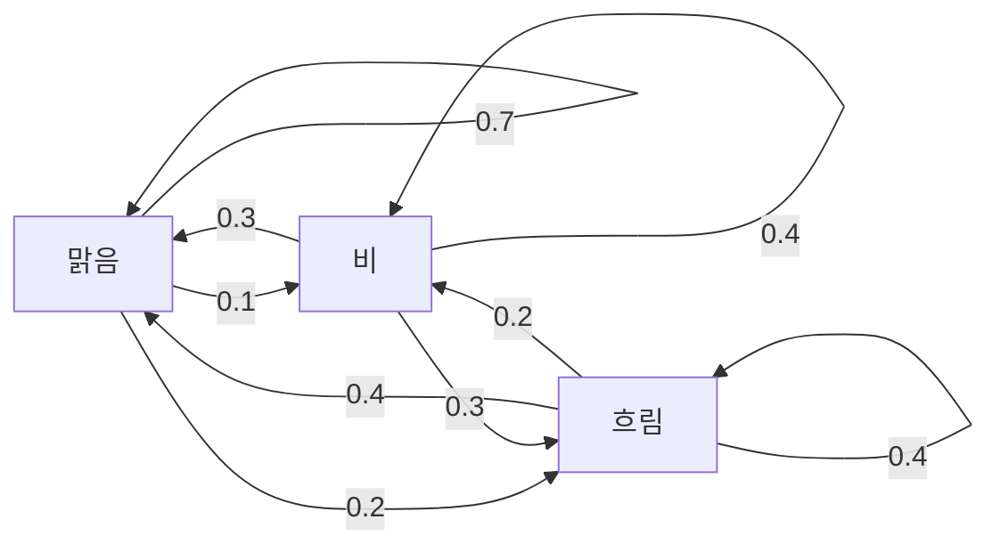
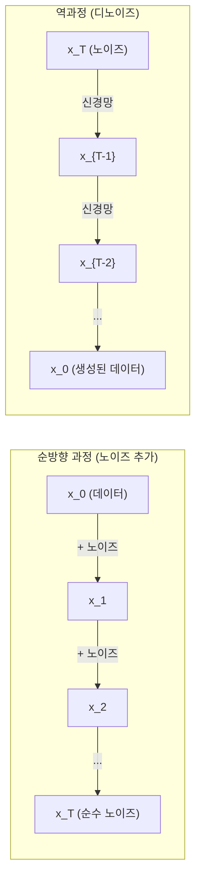

# 확률 과정 (Stochastic Processes)

> 구조가 있는 무작위성. 랜덤 워크, 마르코프 연쇄, 확산 모델 뒤의 수학입니다.

**Type:** Learn
**Language:** Python
**Prerequisites:** Phase 1, Lessons 06-07 (probability, Bayes)
**Time:** ~75 minutes

## 학습 목표 (Learning Objectives)

- 1D·2D 랜덤 워크를 시뮬레이션하고 변위의 sqrt(n) 스케일링을 검증합니다
- 마르코프 연쇄 시뮬레이터를 만들고 고유분해로 정상 분포를 계산합니다
- 목표 분포에서 샘플링하기 위해 Metropolis-Hastings MCMC와 Langevin 동역학을 구현합니다
- 순방향 확산 과정을 브라운 운동에 연결하고 역과정이 데이터를 생성하는 방식을 설명합니다

## 문제 상황 (The Problem)

많은 AI 시스템은 시간에 따라 진화하는 무작위성을 포함합니다. 정적 무작위성 말고 — 각 단계가 이전에 온 것에 의존하는 구조적·순차적 무작위성입니다.

언어 모델은 토큰을 하나씩 생성합니다. 각 토큰은 이전 컨텍스트에 의존합니다. 모델이 확률 분포를 출력하고, 샘플링하고, 다음으로 넘어갑니다. 그것이 확률 과정입니다.

확산 모델은 이미지가 순수 정적 노이즈가 될 때까지 단계별로 노이즈를 더합니다. 그다음 과정을 역전시켜, 새 이미지가 나올 때까지 단계별로 디노이징합니다. 순방향 과정은 마르코프 연쇄입니다. 역과정은 뒤로 도는 학습된 마르코프 연쇄입니다.

강화 학습 에이전트는 환경에서 행동을 취합니다. 각 행동은 어떤 확률로 새 상태로 이어집니다. 에이전트는 무작위 세계에서 무작위 정책을 따릅니다. 전체가 마르코프 결정 과정입니다.

MCMC 샘플링 — 베이지안 추론의 뼈대 — 은 샘플링하려는 사후가 정상 분포인 마르코프 연쇄를 구성합니다.

이 모두는 네 가지 기초 아이디어 위에 세워집니다:
1. 랜덤 워크 — 가장 단순한 확률 과정
2. 마르코프 연쇄 — 전이 행렬이 있는 구조적 무작위성
3. Langevin 동역학 — 노이즈가 있는 경사하강법
4. Metropolis-Hastings — 임의의 분포에서 샘플링

## 핵심 개념 (The Concept)

### 랜덤 워크

위치 0에서 시작합니다. 각 단계에서 공정한 동전을 던집니다. 앞면: 오른쪽(+1). 뒷면: 왼쪽(-1).

n단계 후 위치는 n개의 무작위 +/-1 값의 합입니다. 기대 위치는 0입니다(편향 없는 워크). 하지만 원점으로부터의 기대 거리는 sqrt(n)으로 자랍니다.

직관에 반합니다. 워크는 공정합니다 — 어느 방향으로도 드리프트가 없습니다. 하지만 시간이 지나면 시작점에서 점점 더 멀리 헤매니다. n단계 후 표준편차는 sqrt(n)입니다.

```
Step 0:  Position = 0
Step 1:  Position = +1 or -1
Step 2:  Position = +2, 0, or -2
...
Step 100: Expected distance from origin ~ 10 (sqrt(100))
Step 10000: Expected distance from origin ~ 100 (sqrt(10000))
```

**2D에서는** 워크가 상·하·좌·우로 같은 확률로 움직입니다. 원점으로부터의 거리에 같은 sqrt(n) 스케일링이 적용됩니다. 경로는 프랙탈 같은 패턴을 그립니다.

**왜 sqrt(n)인가?** 각 단계는 같은 확률로 +1 또는 -1입니다. n단계 후 위치 S_n = X_1 + X_2 + ... + X_n이고 각 X_i는 +/-1입니다. 각 단계의 분산은 1이고 단계는 독립이므로 Var(S_n) = n입니다. 표준편차 = sqrt(n). 중심극한정리에 의해 S_n / sqrt(n)은 표준정규분포로 수렴합니다.

이 sqrt(n) 스케일링은 ML 어디에나 나타납니다. SGD 노이즈는 1/sqrt(batch_size)로 스케일합니다. 임베딩 차원은 sqrt(d)로 스케일합니다. 제곱근은 독립 무작위 덧셈의 서명입니다.

**브라운 운동과의 연결.** 스텝 크기 1/sqrt(n)과 단위 시간당 n단계인 랜덤 워크를 취합니다. n이 무한대로 가면 워크는 브라운 운동 B(t) — B(t)가 평균 0, 분산 t인 정규분포인 연속 시간 과정 — 으로 수렴합니다.

브라운 운동은 확산의 수학적 기초입니다. 유체 속 입자의 무작위 흔들림, 주가 변동, 그리고 — 결정적으로 — 확산 모델의 노이즈 과정을 모델링합니다.

**도박꾼의 파산.** 위치 k에서 시작해 0과 N에 흡수 장벽이 있는 랜덤 워커. 0보다 먼저 N에 도달할 확률은? 공정한 워크에서: P(reach N) = k/N. 놀랍도록 단순하고 우아합니다. 마팅게일 이론과 연결됩니다 — 공정한 랜덤 워크는 마팅게일입니다(기대 미래 값 = 현재 값).

### 마르코프 연쇄

마르코프 연쇄는 고정 확률에 따라 상태 사이를 전이하는 시스템입니다. 핵심 성질: 다음 상태는 현재 상태에만 의존하고, 이력에는 의존하지 않습니다.

```
P(X_{t+1} = j | X_t = i, X_{t-1} = ...) = P(X_{t+1} = j | X_t = i)
```

이것이 마르코프 성질입니다. 전이 행렬 P로 전체 동역학을 기술할 수 있음을 뜻합니다:

```
P[i][j] = probability of going from state i to state j
```

P의 각 행의 합은 1입니다(어딘가로 가야 함).

**예 — 날씨:**

```
States: Sunny (0), Rainy (1), Cloudy (2)

P = [[0.7, 0.1, 0.2],    (if sunny: 70% sunny, 10% rainy, 20% cloudy)
     [0.3, 0.4, 0.3],    (if rainy: 30% sunny, 40% rainy, 30% cloudy)
     [0.4, 0.2, 0.4]]    (if cloudy: 40% sunny, 20% rainy, 40% cloudy)
```

어떤 상태에서든 시작합니다. 많은 전이 후 상태 분포는 정상 분포 pi로 수렴합니다. pi * P = pi입니다. 이것은 고유값 1을 가진 P의 좌고유벡터입니다.

날씨 연쇄에서 정상 분포는 [0.55, 0.18, 0.27]입니다 — 장기적으로 시작 상태와 무관하게 55%의 시간 동안 맑습니다.



**정상 분포 계산.** 두 가지 접근이 있습니다:

1. **거듭제곱법**: 임의의 초기 분포에 P를 반복 곱합니다. 충분한 반복 후 수렴합니다.
2. **고유값법**: 고유값 1을 가진 P의 좌고유벡터를 찾습니다. 이는 고유값 1을 가진 P^T의 고유벡터입니다.

두 접근 모두 연쇄가 수렴 조건을 만족해야 합니다.

**수렴 조건.** 마르코프 연쇄가 유일한 정상 분포로 수렴하려면:
- **기약**: 모든 상태가 다른 모든 상태에서 도달 가능
- **비주기**: 고정 주기로 순환하지 않음

ML에서 만나는 대부분의 연쇄는 두 조건을 만족합니다.

**흡수 상태.** 한 번 들어가면 절대 나오지 않는 상태입니다(P[i][i] = 1). 흡수 마르코프 연쇄는 종료 상태가 있는 과정을 모델링합니다 — 끝나는 게임, 이탈하는 고객, end-of-text 토큰에 도달하는 토큰 시퀀스.

**혼합 시간.** 연쇄가 정상 분포에 "가까워질" 때까지 몇 단계인가? 형식적으로, 정상으로부터의 총변동 거리가 어떤 임계값 아래로 떨어질 때까지의 단계 수입니다. 빠른 혼합 = 필요한 단계가 적음. P의 스펙트럼 갭(1에서 두 번째로 큰 고유값을 뺀 값)이 혼합 시간을 제어합니다. 갭이 클수록 혼합이 빠릅니다.

### 언어 모델과의 연결

언어 모델의 토큰 생성은 대략 마르코프 과정입니다. 현재 컨텍스트가 주어지면 모델이 다음 토큰에 대한 분포를 출력합니다. 온도가 날카로움을 제어합니다:

```
P(token_i) = exp(logit_i / temperature) / sum(exp(logit_j / temperature))
```

- Temperature = 1.0: 표준 분포
- Temperature < 1.0: 더 날카로움 (더 결정적)
- Temperature > 1.0: 더 평평함 (더 무작위)
- Temperature -> 0: argmax (탐욕)

Top-k 샘플링은 확률이 가장 높은 k개 토큰으로 자릅니다. Top-p(nucleus) 샘플링은 누적 확률이 p를 넘는 최소 토큰 집합으로 자릅니다. 둘 다 마르코프 전이 확률을 수정합니다.

### 브라운 운동

랜덤 워크의 연속 시간 극한입니다. 위치 B(t)는 세 성질을 가집니다:
1. B(0) = 0
2. B(t) - B(s)는 평균 0, 분산 t - s인 정규분포 (t > s)
3. 겹치지 않는 구간의 증분은 독립

브라운 운동은 연속이지만 어디서도 미분 불가능합니다 — 모든 스케일에서 흔들립니다. 평면에서 경로의 프랙탈 차원은 2입니다.

이산 시뮬레이션에서는 다음으로 브라운 운동을 근사합니다:

```
B(t + dt) = B(t) + sqrt(dt) * z,    where z ~ N(0, 1)
```

sqrt(dt) 스케일링이 중요합니다. 랜덤 워크에 적용된 중심극한정리에서 옵니다.

### Langevin 동역학

경사하강법은 함수의 최솟값을 찾습니다. Langevin 동역학은 exp(-U(x)/T)에 비례하는 확률 분포를 찾습니다. U는 에너지 함수, T는 온도입니다.

```
x_{t+1} = x_t - dt * gradient(U(x_t)) + sqrt(2 * T * dt) * z_t
```

입자에 두 힘이 작용합니다:
1. **기울기 힘** (-dt * gradient(U)): 낮은 에너지로 밀어냄 (경사하강법처럼)
2. **무작위 힘** (sqrt(2*T*dt) * z): 무작위 방향으로 밀어냄 (탐색)

온도 T = 0이면 순수 경사하강법입니다. 고온에서는 거의 랜덤 워크입니다. 적절한 온도에서 입자가 에너지 지형을 탐색하고 저에너지 영역에 더 많은 시간을 보냅니다.

**확산 모델과의 연결.** 확산 모델의 순방향 과정은:

```
x_t = sqrt(alpha_t) * x_{t-1} + sqrt(1 - alpha_t) * noise
```

이것은 데이터를 노이즈와 점진적으로 섞는 마르코프 연쇄입니다. 충분한 단계 후 x_T는 순수 가우시안 노이즈입니다.

역과정 — 노이즈에서 데이터로 돌아가기 — 도 마르코프 연쇄이지만, 전이 확률은 신경망이 학습합니다. 네트워크는 각 단계에서 더해진 노이즈를 예측하는 법을 학습한 뒤 뺍니다.



### MCMC: 마르코프 연쇄 몬테카를로

직접 샘플링할 수는 없지만 (상수까지) 평가할 수 있는 분포 p(x)에서 샘플링해야 할 때가 있습니다. 베이지안 사후가 고전적 예입니다 — 가능도 곱하기 사전은 알지만 정규화 상수는 다루기 힘듭니다.

**Metropolis-Hastings**는 정상 분포가 p(x)인 마르코프 연쇄를 구성합니다:

1. 어떤 위치 x에서 시작
2. 제안 분포 Q(x'|x)에서 새 위치 x' 제안
3. 수락비 계산: a = p(x') * Q(x|x') / (p(x) * Q(x'|x))
4. 확률 min(1, a)로 x' 수락. 아니면 x에 머무름.
5. 반복.

Q가 대칭이면(예: Q(x'|x) = Q(x|x') = N(x, sigma^2)), 비가 a = p(x') / p(x)로 단순화됩니다. 확률의 비만 필요합니다 — 정규화 상수가 상쇄됩니다.

온화한 조건에서 연쇄가 p(x)로 수렴함이 보장됩니다. 하지만 제안이 너무 작으면(랜덤 워크) 또는 너무 크면(높은 거절) 수렴이 느릴 수 있습니다. 제안을 튜닝하는 것이 MCMC의 예술입니다.

**왜 동작하는가.** 수락비가 상세 균형을 보장합니다: x에 있고 x'로 움직일 확률 = x'에 있고 x로 움직일 확률. 상세 균형은 p(x)가 연쇄의 정상 분포임을 함의합니다. 그래서 충분한 단계 후 샘플이 p(x)에서 옵니다.

**실용적 고려:**
- **Burn-in**: 처음 N개 샘플을 버립니다. 연쇄가 시작점에서 정상 분포에 도달할 시간이 필요합니다.
- **Thinning**: 자기상관을 줄이기 위해 k번째 샘플마다 유지합니다.
- **다중 연쇄**: 서로 다른 시작점에서 여러 연쇄를 돌립니다. 같은 분포로 수렴하면 수렴의 증거가 됩니다.
- **수락률**: d차원 가우시안 제안에서 최적 수락률은 약 23%입니다(Roberts & Rosenthal, 2001). 너무 높으면 연쇄가 거의 움직이지 않습니다. 너무 낮으면 모든 것을 거절합니다.

### AI의 확률 과정

| Process | AI Application |
|---------|---------------|
| Random walk | RL의 탐색, Node2Vec 임베딩 |
| Markov chain | 텍스트 생성, MCMC 샘플링 |
| Brownian motion | 확산 모델 (순방향 과정) |
| Langevin dynamics | 스코어 기반 생성 모델, SGLD |
| Markov decision process | 강화 학습 |
| Metropolis-Hastings | 베이지안 추론, 사후 샘플링 |

```figure
random-walk-diffusion
```

## 구현하기 (Build It)

### Step 1: 랜덤 워크 시뮬레이터

```python
import numpy as np

def random_walk_1d(n_steps, seed=None):
    rng = np.random.RandomState(seed)
    steps = rng.choice([-1, 1], size=n_steps)
    positions = np.concatenate([[0], np.cumsum(steps)])
    return positions


def random_walk_2d(n_steps, seed=None):
    rng = np.random.RandomState(seed)
    directions = rng.choice(4, size=n_steps)
    dx = np.zeros(n_steps)
    dy = np.zeros(n_steps)
    dx[directions == 0] = 1   # right
    dx[directions == 1] = -1  # left
    dy[directions == 2] = 1   # up
    dy[directions == 3] = -1  # down
    x = np.concatenate([[0], np.cumsum(dx)])
    y = np.concatenate([[0], np.cumsum(dy)])
    return x, y
```

1D 워크는 누적합을 저장합니다. 각 단계는 +1 또는 -1입니다. n단계 후 위치는 합입니다. 분산은 n에 선형으로 자라므로 표준편차는 sqrt(n)으로 자랍니다.

### Step 2: 마르코프 연쇄

```python
class MarkovChain:
    def __init__(self, transition_matrix, state_names=None):
        self.P = np.array(transition_matrix, dtype=float)
        self.n_states = len(self.P)
        self.state_names = state_names or [str(i) for i in range(self.n_states)]

    def step(self, current_state, rng=None):
        if rng is None:
            rng = np.random.RandomState()
        probs = self.P[current_state]
        return rng.choice(self.n_states, p=probs)

    def simulate(self, start_state, n_steps, seed=None):
        rng = np.random.RandomState(seed)
        states = [start_state]
        current = start_state
        for _ in range(n_steps):
            current = self.step(current, rng)
            states.append(current)
        return states

    def stationary_distribution(self):
        eigenvalues, eigenvectors = np.linalg.eig(self.P.T)
        idx = np.argmin(np.abs(eigenvalues - 1.0))
        stationary = np.real(eigenvectors[:, idx])
        stationary = stationary / stationary.sum()
        return np.abs(stationary)
```

정상 분포는 고유값 1을 가진 P의 좌고유벡터입니다. P^T의 고유벡터를 계산해 찾습니다(전치하면 좌고유벡터가 우고유벡터가 됩니다).

### Step 3: Langevin 동역학

```python
def langevin_dynamics(grad_U, x0, dt, temperature, n_steps, seed=None):
    rng = np.random.RandomState(seed)
    x = np.array(x0, dtype=float)
    trajectory = [x.copy()]
    for _ in range(n_steps):
        noise = rng.randn(*x.shape)
        x = x - dt * grad_U(x) + np.sqrt(2 * temperature * dt) * noise
        trajectory.append(x.copy())
    return np.array(trajectory)
```

기울기가 x를 낮은 에너지로 밀어냅니다. 노이즈가 갇히는 것을 막습니다. 평형에서 샘플 분포는 exp(-U(x)/temperature)에 비례합니다.

### Step 4: Metropolis-Hastings

```python
def metropolis_hastings(target_log_prob, proposal_std, x0, n_samples, seed=None):
    rng = np.random.RandomState(seed)
    x = np.array(x0, dtype=float)
    samples = [x.copy()]
    accepted = 0
    for _ in range(n_samples - 1):
        x_proposed = x + rng.randn(*x.shape) * proposal_std
        log_ratio = target_log_prob(x_proposed) - target_log_prob(x)
        if np.log(rng.rand()) < log_ratio:
            x = x_proposed
            accepted += 1
        samples.append(x.copy())
    acceptance_rate = accepted / (n_samples - 1)
    return np.array(samples), acceptance_rate
```

알고리즘은 새 점을 제안하고, 확률이 더 높은지 확인하거나(또는 비에 비례하는 확률로 수락하고) 반복합니다. 좋은 혼합을 위해 수락률은 약 23-50%여야 합니다.

## 실용 활용 (Use It)

실무에서는 이 알고리즘에 확립된 라이브러리를 씁니다. 하지만 메커니즘을 이해하는 것은 디버깅과 튜닝에 중요합니다.

```python
import numpy as np

rng = np.random.RandomState(42)
walk = np.cumsum(rng.choice([-1, 1], size=10000))
print(f"Final position: {walk[-1]}")
print(f"Expected distance: {np.sqrt(10000):.1f}")
print(f"Actual distance: {abs(walk[-1])}")
```

### 전이 행렬을 위한 numpy

```python
import numpy as np

P = np.array([[0.7, 0.1, 0.2],
              [0.3, 0.4, 0.3],
              [0.4, 0.2, 0.4]])

distribution = np.array([1.0, 0.0, 0.0])
for _ in range(100):
    distribution = distribution @ P

print(f"Stationary distribution: {np.round(distribution, 4)}")
```

초기 분포에 P를 반복 곱합니다. 충분한 반복 후, 어디서 시작했든 정상 분포로 수렴합니다. 이것이 지배 좌고유벡터를 찾는 거듭제곱법입니다.

### 실제 프레임워크와의 연결

- **PyTorch 확산:** Hugging Face `diffusers`의 `DDPMScheduler`가 순방향·역방향 마르코프 연쇄를 구현합니다
- **NumPyro / PyMC:** 베이지안 추론에 MCMC(Metropolis-Hastings를 개선한 NUTS 샘플러)를 사용합니다
- **Gymnasium (RL):** 환경 step 함수가 마르코프 결정 과정을 정의합니다

### 마르코프 연쇄 수렴 검증

```python
import numpy as np

P = np.array([[0.9, 0.1], [0.3, 0.7]])

eigenvalues = np.linalg.eigvals(P)
spectral_gap = 1 - sorted(np.abs(eigenvalues))[-2]
print(f"Eigenvalues: {eigenvalues}")
print(f"Spectral gap: {spectral_gap:.4f}")
print(f"Approximate mixing time: {1/spectral_gap:.1f} steps")
```

스펙트럼 갭은 연쇄가 초기 상태를 얼마나 빨리 잊는지 알려 줍니다. 갭 0.2는 대략 5단계 혼합을 뜻합니다. 갭 0.01은 대략 100단계입니다. 긴 시뮬레이션 전에 항상 확인하세요 — 느리게 혼합되는 연쇄는 연산을 낭비합니다.

## 배포할 산출물 (Ship It)

이 레슨이 만드는 것:
- `outputs/prompt-stochastic-process-advisor.md` -- 주어진 문제에 어떤 확률 과정 프레임워크가 적용되는지 식별하도록 돕는 프롬프트

## 연결 (Connections)

| Concept | Where it shows up |
|---------|------------------|
| Random walk | Node2Vec 그래프 임베딩, RL의 탐색 |
| Markov chain | LLM의 토큰 생성, MCMC 샘플링 |
| Brownian motion | DDPM의 순방향 확산 과정, SDE 기반 모델 |
| Langevin dynamics | 스코어 기반 생성 모델, stochastic gradient Langevin dynamics (SGLD) |
| Stationary distribution | MCMC 수렴 목표, PageRank |
| Metropolis-Hastings | 베이지안 사후 샘플링, 시뮬레이티드 어닐링 |
| Temperature | LLM 샘플링, RL의 Boltzmann 탐색, 시뮬레이티드 어닐링 |
| Mixing time | MCMC 수렴 속도, 스펙트럼 갭 분석 |
| Absorbing state | End-of-sequence 토큰, RL의 종료 상태 |
| Detailed balance | MCMC 샘플러의 정확성 보장 |

확산 모델은 특별히 주목할 가치가 있습니다. DDPM(Ho et al., 2020)은 순방향 마르코프 연쇄를 정의합니다:

```
q(x_t | x_{t-1}) = N(x_t; sqrt(1-beta_t) * x_{t-1}, beta_t * I)
```

여기서 beta_t는 노이즈 스케줄입니다. T단계 후 x_T는 대략 N(0, I)입니다. 역과정은 노이즈를 예측하는 신경망으로 파라미터화됩니다:

```
p_theta(x_{t-1} | x_t) = N(x_{t-1}; mu_theta(x_t, t), sigma_t^2 * I)
```

생성의 매 단계는 학습된 마르코프 연쇄의 한 단계입니다. 마르코프 연쇄를 이해한다는 것은 확산 모델이 어떻게·왜 데이터를 생성하는지 이해한다는 뜻입니다.

SGLD(Stochastic Gradient Langevin Dynamics)는 미니배치 경사하강법과 Langevin 노이즈를 결합합니다. 전체 기울기 대신 확률적 추정치를 쓰고 보정된 노이즈를 더합니다. 학습률이 감소하면 SGLD는 최적화에서 샘플링으로 전환합니다 — 근사 베이지안 사후 샘플을 공짜로 얻습니다. 신경망에서 불확실성 추정을 얻는 가장 단순한 방법 중 하나입니다.

이 모든 연결에 걸친 핵심 통찰: 확률 과정은 이론 도구만이 아닙니다. 현대 AI 시스템 내부의 계산 메커니즘입니다. LLM의 온도를 튜닝할 때 마르코프 연쇄를 조정하는 것입니다. 확산 모델을 학습할 때 브라운 운동 같은 과정을 역전하는 법을 배우는 것입니다. 베이지안 추론을 돌릴 때 사후로 수렴하는 연쇄를 구성하는 것입니다.

## 연습 문제 (Exercises)

1. **10000단계 랜덤 워크 1000개를 시뮬레이션하세요.** 최종 위치의 분포를 플롯하세요. 평균 0, 표준편차 sqrt(10000) = 100인 대략 가우시안인지 검증하세요.

2. **마르코프 연쇄로 텍스트 생성기를 만드세요.** 작은 말뭉치로 학습: 각 단어에 대해 다음 단어로의 전이를 셉니다. 전이 행렬을 만듭니다. 연쇄에서 샘플링해 새 문장을 생성합니다.

3. **Metropolis-Hastings로 시뮬레이티드 어닐링을 구현하세요.** 고온에서 시작해(거의 모든 것을 수락) 점차 냉각합니다(개선만 수락). 국소 최솟값이 많은 함수의 최솟값을 찾는 데 사용하세요.

4. **서로 다른 온도에서 Langevin 동역학을 비교하세요.** 이중 우물 포텐셜 U(x) = (x^2 - 1)^2에서 샘플링하세요. 저온에서는 샘플이 한 우물에 모입니다. 고온에서는 둘에 걸쳐 퍼집니다. 연쇄가 우물 사이를 혼합하는 임계 온도를 찾으세요.

5. **순방향 확산 과정을 구현하세요.** 1D 신호(예: 사인파)에서 시작합니다. 선형 노이즈 스케줄로 100단계에 걸쳐 점진적으로 노이즈를 더합니다. 신호가 순수 노이즈로 어떻게 열화되는지 보이세요. 그다음 과정을 역전하는 단순 디노이저를 구현하세요(추정 노이즈를 빼는 나이브한 것이라도).

## 핵심 용어 (Key Terms)

| Term | What people say | What it actually means |
|------|----------------|----------------------|
| Random walk | "동전 던지기 이동" | 각 단계에서 위치가 무작위 증분으로 바뀌는 과정 |
| Markov property | "무기억" | 미래가 현재 상태에만 의존하고 이력에는 의존하지 않음 |
| Transition matrix | "확률 표" | P[i][j] = 상태 i에서 상태 j로 이동할 확률 |
| Stationary distribution | "장기 평균" | pi*P = pi인 분포 pi — 연쇄의 평형 |
| Brownian motion | "무작위 흔들림" | 랜덤 워크의 연속 시간 극한, B(t) ~ N(0, t) |
| Langevin dynamics | "노이즈 있는 경사하강법" | 결정적 기울기와 무작위 섭동을 결합한 갱신 규칙 |
| MCMC | "목표를 향해 걷기" | 원하는 분포가 정상 분포인 마르코프 연쇄를 구성 |
| Metropolis-Hastings | "제안하고 수락/거절" | 수락비로 수렴을 보장하는 MCMC 알고리즘 |
| Temperature | "무작위성 노브" | 탐색과 활용 사이 절충을 제어하는 파라미터 |
| Diffusion process | "노이즈 들어가고, 노이즈 나옴" | 순방향: 점진적으로 노이즈 추가. 역방향: 점진적으로 제거. 데이터 생성. |

## 참고 자료 (Further Reading)

- **Ho, Jain, Abbeel (2020)** -- "Denoising Diffusion Probabilistic Models." 확산 모델 혁명을 연 DDPM 논문. 순방향·역방향 마르코프 연쇄의 명확한 유도.
- **Song & Ermon (2019)** -- "Generative Modeling by Estimating Gradients of the Data Distribution." 샘플링에 Langevin 동역학을 쓰는 스코어 기반 접근.
- **Roberts & Rosenthal (2004)** -- "General state space Markov chains and MCMC algorithms." MCMC가 언제·왜 동작하는지에 대한 이론.
- **Norris (1997)** -- "Markov Chains." 표준 교재. 수렴, 정상 분포, hitting time을 다룸.
- **Welling & Teh (2011)** -- "Bayesian Learning via Stochastic Gradient Langevin Dynamics." 확장 가능한 베이지안 추론을 위해 SGD와 Langevin 동역학을 결합.
