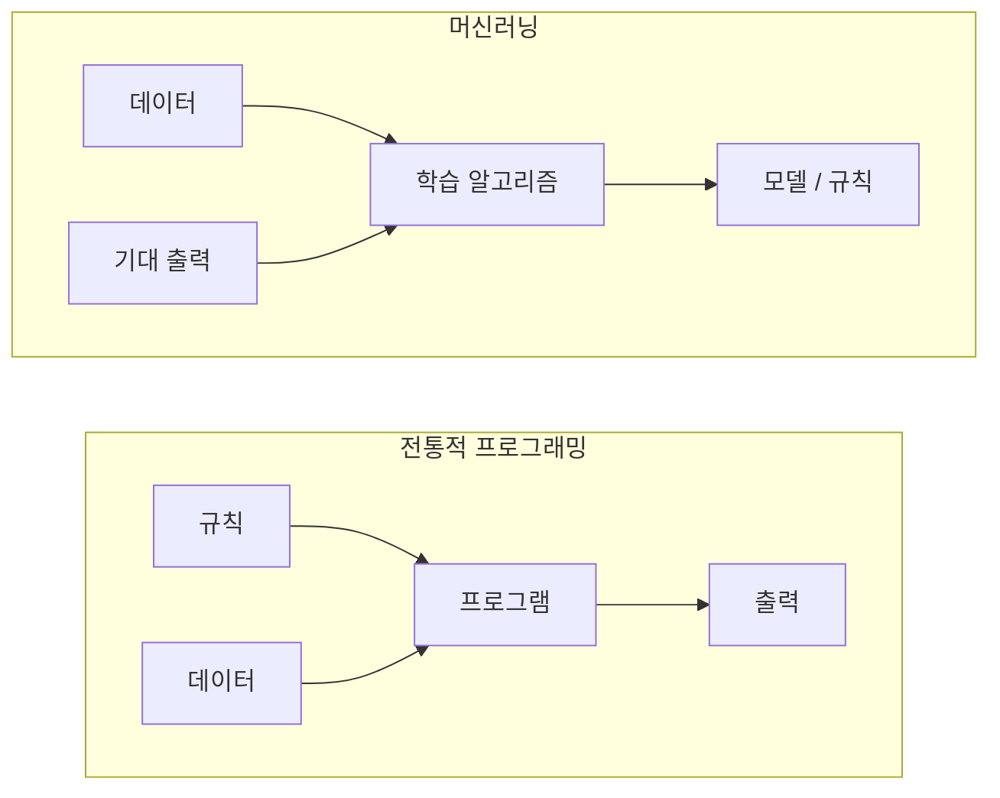
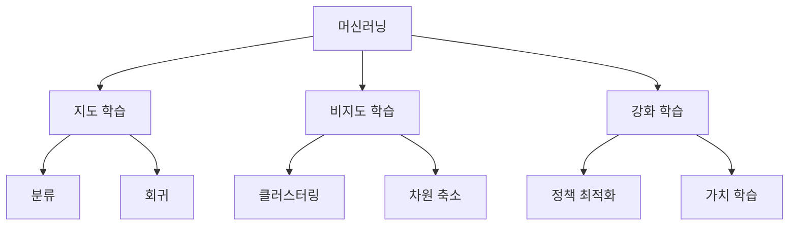
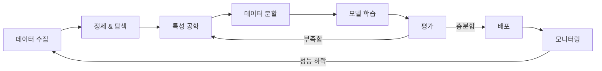
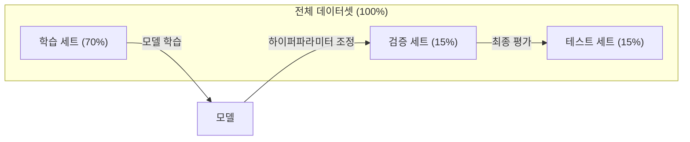
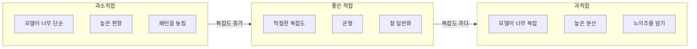
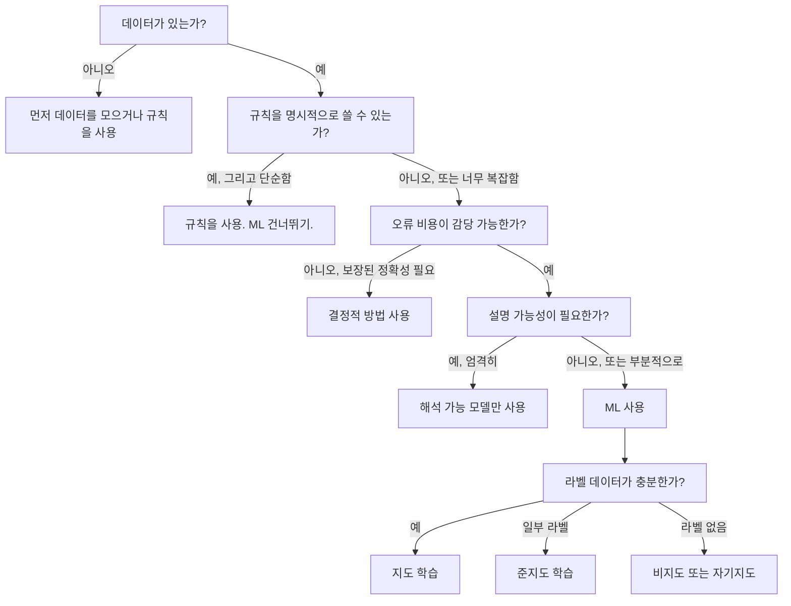

# 머신러닝이란 (What Is Machine Learning)

> 머신러닝은 규칙을 손으로 쓰는 대신, 컴퓨터가 데이터에서 패턴을 찾도록 가르치는 것입니다.

**Type:** Learn
**Languages:** Python
**Prerequisites:** Phase 1 (Math Foundations)
**Time:** ~45 minutes

## 학습 목표 (Learning Objectives)

- 지도·비지도·강화학습의 차이를 설명하고, 주어진 문제에 어떤 유형이 맞는지 식별합니다
- 최근접 중심(nearest centroid) 분류기를 처음부터 구현하고 무작위 베이스라인과 비교해 평가합니다
- 분류와 회귀 작업을 구분하고, 각각에 맞는 손실 함수를 선택합니다
- 주어진 비즈니스 문제가 ML에 적합한지, 아니면 결정적 규칙으로 푸는 편이 나은지 판단합니다

## 문제 상황 (The Problem)

스팸 필터를 만들고 싶다고 해 봅시다. 전통적 접근: 앉아서 규칙을 수백 개 씁니다. "이메일에 'FREE MONEY'가 있으면 스팸. 느낌표가 3개 넘으면 스팸." 규칙을 쓰느라 몇 주를 보냅니다. 그러면 스패머가 표현을 바꿉니다. 규칙이 깨집니다. 규칙을 더 씁니다. 이 사이클은 끝나지 않습니다.

머신러닝은 이 방향을 뒤집습니다. 규칙을 쓰는 대신, 라벨이 붙은 이메일 수천 통("스팸" 또는 "비스팸")을 컴퓨터에 주고 규칙 자체를 스스로 찾게 합니다. 컴퓨터는 당신이 생각도 못 한 패턴을 찾아냅니다. 스패머가 전술을 바꾸면 코드를 다시 쓰는 대신 새 데이터로 재학습합니다.

"규칙을 프로그래밍하는 것"에서 "데이터로부터 학습하는 것"으로의 전환이 머신러닝의 핵심입니다. 추천 엔진, 음성 비서, 자율주행차, 언어 모델은 모두 이런 방식으로 동작합니다.

## 핵심 개념 (The Concept)

### 규칙이 아니라 데이터로부터 학습

전통적 프로그래밍과 머신러닝은 문제를 반대 방향으로 풉니다.



전통적 프로그래밍: 당신이 규칙을 씁니다. 프로그램이 그 규칙을 데이터에 적용해 출력을 만듭니다.

머신러닝: 데이터와 기대 출력을 제공합니다. 알고리즘이 규칙을 발견합니다.

학습에서 나온 "모델"이 곧 규칙이며, 숫자(가중치, 파라미터)로 인코딩됩니다. 본 적 있는 예제에서 일반화해, 한 번도 본 적 없는 데이터에 대해 예측합니다.

### 머신러닝의 세 가지 유형



**지도 학습 (Supervised Learning)**: 입력-출력 쌍이 있습니다. 모델은 입력을 출력에 매핑하는 법을 배웁니다.
- "고양이/개로 라벨된 사진 10,000장이 있다. 구별하는 법을 배워라."
- "주택 특징과 가격이 있다. 가격을 예측하는 법을 배워라."

**비지도 학습 (Unsupervised Learning)**: 입력만 있습니다. 라벨이 없습니다. 모델이 스스로 구조를 찾습니다.
- "고객 구매 이력 10,000건이 있다. 자연스러운 그룹을 찾아라."
- "1,000차원 데이터 포인트가 있다. 구조를 유지하며 2차원으로 줄여라."

**강화 학습 (Reinforcement Learning)**: 에이전트가 환경에서 행동을 취하고 보상 또는 페널티를 받습니다. 총 보상을 최대화하는 전략(정책)을 학습합니다.
- "이 게임을 해라. 이기면 +1, 지면 -1. 전략을 찾아내라."
- "이 로봇 팔을 제어해라. 물체를 집으면 +1, 낭비한 초마다 -0.01."

실무에서 만드는 것의 대부분은 지도 학습을 씁니다. 비지도 학습은 전처리와 탐색에 흔합니다. 강화 학습은 게임 AI, 로봇공학, 언어 모델의 RLHF를 구동합니다.

### 빅 쓰리 너머

위 세 범주는 깔끔하지만, 실제 ML은 경계를 자주 흐립니다.

**준지도 학습 (Semi-supervised learning)**은 소량의 라벨 데이터와 대량의 비라벨 데이터를 씁니다. 라벨된 의료 영상 100장과 라벨 없는 100,000장이 있을 수 있습니다. 기법에는 다음이 있습니다:

- **라벨 전파 (Label propagation):** 비슷한 데이터 포인트를 연결한 그래프를 만듭니다. 라벨이 라벨된 노드에서 이웃 비라벨 노드로 퍼집니다.
- **의사 라벨링 (Pseudo-labeling):** 라벨 데이터로 모델을 학습하고, 비라벨 데이터에 라벨을 예측한 뒤 전부로 재학습합니다. 모델이 자신의 학습 집합을 부트스트랩합니다.
- **일관성 정규화 (Consistency regularization):** 입력과 살짝 perturbed한 입력에 대해 같은 예측을 내야 합니다. 라벨 없이도 동작합니다.

**자기지도 학습 (Self-supervised learning)**은 데이터 자체에서 감독 신호를 만듭니다. 사람 라벨이 전혀 필요 없습니다. 모델이 데이터 구조에서 자체 예측 과제를 만듭니다.

- **마스크 언어 모델링 (BERT):** 문장에서 단어의 15%를 가리고, 빠진 단어를 예측하도록 학습합니다. "라벨"은 원문에서 옵니다.
- **대조 학습 (SimCLR):** 이미지를 취해 두 개의 증강 버전을 만듭니다. 같은 이미지에서 왔음을 인식하고, 다른 이미지의 증강과 구분하도록 학습합니다.
- **다음 토큰 예측 (GPT):** 이전 단어 전부가 주어졌을 때 다음 단어를 예측합니다. 모든 텍스트 문서가 학습 예제가 됩니다.

이것들은 빅 쓰리와 별도 범주가 아닙니다. 지도·비지도 아이디어를 결합한 전략입니다. 자기지도 학습은 기술적으로는 지도 학습이지만(모델이 무언가를 예측), 라벨은 사람이 아니라 자동으로 생성됩니다.

### 분류 vs 회귀

지도 학습의 두 가지 주요 작업입니다.

| Aspect | Classification (분류) | Regression (회귀) |
|--------|---------------|------------|
| Output | 이산 범주 | 연속 숫자 |
| Example | "이 이메일이 스팸인가?" | "집값은 얼마가 될까?" |
| Output space | {고양이, 개, 새} | 임의의 실수 |
| Loss function | Cross-entropy, accuracy | Mean squared error, MAE |
| Decision | 클래스 사이 경계 | 데이터에 맞는 곡선 |

분류는 "어느 범주?"에 답합니다. 회귀는 "얼마?"에 답합니다.

어떤 문제는 어느 쪽으로도 잡을 수 있습니다. 주가가 오를지 내릴지 예측은 분류입니다. 정확한 가격 예측은 회귀입니다.

### ML 워크플로

알고리즘과 무관하게, 모든 머신러닝 프로젝트는 같은 파이프라인을 따릅니다.



**데이터 수집 (Collect Data)**: 원시 데이터를 모읍니다. 데이터가 많을수록 거의 항상 낫지만, 양보다 질이 더 중요합니다.

**정제 & 탐색 (Clean & Explore)**: 결측값을 처리하고, 중복을 제거하고, 분포를 시각화하고, 이상치를 찾습니다. 이 단계가 전체 프로젝트 시간의 60-80%를 차지하는 경우가 많습니다.

**특성 공학 (Feature Engineering)**: 원시 데이터를 모델이 쓸 수 있는 특성으로 바꿉니다. 날짜를 요일로. 수치 열을 정규화. 범주형 변수를 인코딩. 좋은 특성이 화려한 알고리즘보다 중요합니다.

**데이터 분할 (Split Data)**: 학습·검증·테스트 세트로 나눕니다. 모델은 학습 데이터로 학습하고, 하이퍼파라미터는 검증 데이터로 조정하며, 최종 성능은 테스트 데이터로 보고합니다.

**모델 학습 (Train Model)**: 학습 데이터를 알고리즘에 넣습니다. 알고리즘이 손실 함수를 최소화하도록 내부 파라미터를 조정합니다.

**평가 (Evaluate)**: 검증/테스트 데이터에서 성능을 측정합니다. 성능이 부족하면 특성·알고리즘·하이퍼파라미터를 바꿔 다시 시도합니다.

**배포 (Deploy)**: 새 데이터에 예측을 내는 프로덕션에 모델을 올립니다.

**모니터링 (Monitor)**: 시간에 따른 성능을 추적합니다. 데이터 분포가 바뀌고(데이터 드리프트), 모델은 저하됩니다. 성능이 떨어지면 재학습합니다.

### 학습·검증·테스트 분할

초보자가 가장 자주 틀리는 개념입니다. 학습 중 한 번도 보지 않은 데이터로 모델을 평가해야 합니다. 그렇지 않으면 학습이 아니라 암기를 측정하는 것입니다.



| Split | Purpose | When used | Typical size |
|-------|---------|-----------|-------------|
| Training | 모델이 이 데이터로부터 학습 | 학습 중 | 60-80% |
| Validation | 하이퍼파라미터 조정, 모델 비교 | 각 학습 실행 후 | 10-20% |
| Test | 최종 편향 없는 성능 추정 | 맨 끝에 한 번 | 10-20% |

테스트 세트는 신성합니다. 정확히 한 번만 봅니다. 테스트 성능에 맞춰 모델을 계속 조정하면, 사실상 테스트 세트로 학습하는 것이고 보고된 숫자는 의미가 없습니다.

작은 데이터셋에는 k-겹 교차검증을 씁니다: 데이터를 k부분으로 나누고, k-1부분으로 학습하고, 남은 부분으로 검증하고, 회전하며 결과를 평균합니다.

### 과적합 vs 과소적합



**과소적합 (Underfitting)**: 모델이 너무 단순해 데이터의 패턴을 잡지 못합니다. 곡선 관계를 직선으로 맞추려는 것. 학습 오차도 높고 테스트 오차도 높습니다.

**과적합 (Overfitting)**: 모델이 너무 복잡해서 학습 데이터(노이즈 포함)를 암기합니다. 모든 학습 점을 지나가는 요철 곡선이지만 새 데이터에서는 실패합니다. 학습 오차는 낮고 테스트 오차는 높습니다.

**좋은 적합 (Good fit)**: 모델이 노이즈를 암기하지 않고 실제 패턴을 잡습니다. 학습 오차와 테스트 오차가 둘 다 적당히 낮습니다.

과적합의 징후:
- 학습 정확도가 검증 정확도보다 훨씬 높음
- 학습 데이터에서는 잘하지만 새 데이터에서는 나쁨
- 학습 데이터를 더 넣으면 성능이 좋아짐(암기였지 학습이 아니었음)

과적합 해결:
- 학습 데이터를 더 모음
- 모델 복잡도 감소(파라미터 수 줄이기, 더 단순한 아키텍처)
- 정규화(큰 가중치에 페널티 추가)
- 드롭아웃(학습 중 뉴런을 무작위로 0으로)
- 조기 종료(검증 오차가 오르기 시작하면 학습 중단)

과소적합 해결:
- 더 복잡한 모델 사용
- 특성 추가
- 정규화 줄이기
- 더 오래 학습

### 편향-분산 트레이드오프

과적합·과소적합 뒤의 수학적 프레임워크입니다.

**편향 (Bias)**: 모델의 잘못된 가정에서 오는 오차. 진짜 관계가 비선형인데 선형 모델을 쓰면 편향이 높습니다. 높은 편향은 과소적합으로 이어집니다.

**분산 (Variance)**: 학습 데이터의 작은 변동에 대한 민감도에서 오는 오차. 분산이 높은 모델은 다른 부분 집합으로 학습하면 예측이 크게 달라집니다. 높은 분산은 과적합으로 이어집니다.

| Model complexity | Bias | Variance | Result |
|-----------------|------|----------|--------|
| 너무 낮음 (곡선 데이터에 선형 모델) | High | Low | 과소적합 |
| 딱 맞음 | Medium | Medium | 좋은 일반화 |
| 너무 높음 (점 10개에 20차 다항식) | Low | High | 과적합 |

총 오차 = Bias^2 + Variance + 줄일 수 없는 노이즈

줄일 수 없는 노이즈는 줄일 수 없습니다(데이터 자체의 무작위성). bias^2 + variance가 최소인 스위트 스팟을 찾는 것이 목표입니다.

### No Free Lunch 정리

모든 문제에 최적인 단일 알고리즘은 없습니다. 한 부류의 문제에서 잘 하는 알고리즘은 다른 부류에서 나쁩니다. 그래서 데이터 과학자는 여러 알고리즘을 시도하고 결과를 비교합니다.

실무에서 선택은 다음에 달립니다:
- 데이터가 얼마나 있는가
- 특성이 몇 개인가
- 관계가 선형인가 비선형인가
- 해석 가능성이 필요한가
- 감당할 수 있는 연산량은 얼마인가

### 머신러닝을 쓰지 말아야 할 때

ML은 강력하지만 항상 맞는 도구는 아닙니다. 모델에 손대기 전에, 정말 필요한지 물어보세요.

**ML을 쓰지 마세요:**

- **규칙이 단순하고 잘 정의되어 있을 때.** 세금 계산, 정렬 알고리즘, 단위 변환. if문 몇 개로 논리를 쓸 수 있다면, 모델은 이득 없이 복잡도만 더합니다.
- **데이터가 없거나 매우 적을 때.** ML은 학습할 예제가 필요합니다. 데이터 포인트 10개로는 의미 있는 학습이 불가능합니다. 먼저 데이터를 모으세요.
- **틀리는 비용이 치명적이고 보장된 정확성이 필요할 때.** 의료 용량 계산, 원자로 제어, 암호 검증. ML 모델은 확률적입니다. 가끔 틀립니다. "가끔 틀림"이 허용되지 않으면 결정적 방법을 쓰세요.
- **룩업 테이블이나 휴리스틱으로 풀릴 때.** 단순 임계값이나 표가 사례의 99%를 커버한다면, ML은 의미 있는 개선 없이 유지보수 비용만 올립니다.
- **결정을 설명할 수 없고 설명 가능성이 요구될 때.** 규제 산업(대출, 보험, 형사 사법)은 모든 결정을 완전히 설명해야 할 때가 있습니다. 일부 ML 모델은 해석 가능합니다(선형 회귀, 작은 결정 트리). 대부분은 아닙니다.
- **문제가 재학습보다 빨리 바뀔 때.** 규칙이 매일 바뀌고 재학습에 일주일이 걸리면, 모델은 항상 낡아 있습니다.

이 결정 플로차트를 쓰세요:



```figure
f3-learning-boundary
```

## 직접 만들기 (Build It)

`code/ml_intro.py`의 코드는 가장 단순한 ML 알고리즘인 최근접 중심 분류기를 처음부터 구현합니다. 핵심 아이디어를 보여 줍니다: 데이터로부터 학습한 뒤, 새 데이터에 예측합니다.

### 1단계: 최근접 중심 분류기 처음부터 구현

최근접 중심 분류기는 학습 데이터에서 각 클래스의 중심(평균)을 계산합니다. 예측 시, 새 점을 중심이 가장 가까운 클래스에 할당합니다.

```python
class NearestCentroid:
    def fit(self, X, y):
        self.classes = np.unique(y)
        self.centroids = np.array([
            X[y == c].mean(axis=0) for c in self.classes
        ])

    def predict(self, X):
        distances = np.array([
            np.sqrt(((X - c) ** 2).sum(axis=1))
            for c in self.centroids
        ])
        return self.classes[distances.argmin(axis=0)]
```

그게 전체 알고리즘입니다. Fit은 평균 두 개를 계산합니다. Predict는 거리를 계산합니다. 경사하강법도, 반복도, 하이퍼파라미터도 없습니다.

### 2단계: 합성 데이터로 학습

약간 겹치는 두 클래스가 있는 2D 분류 데이터셋을 생성합니다. 중심 분류기는 클래스 중심 사이에 선형 결정 경계를 그립니다.

```python
rng = np.random.RandomState(42)
X_class0 = rng.randn(100, 2) + np.array([1.0, 1.0])
X_class1 = rng.randn(100, 2) + np.array([-1.0, -1.0])
X = np.vstack([X_class0, X_class1])
y = np.array([0] * 100 + [1] * 100)
```

### 3단계: 베이스라인과 비교

모든 ML 모델은 사소한 베이스라인과 비교해야 합니다. 여기서 베이스라인은 무작위 클래스를 예측합니다. ML 모델이 무작위 추측을 이기지 못하면 무언가 잘못된 것입니다.

```python
baseline_preds = rng.choice([0, 1], size=len(y_test))
baseline_acc = np.mean(baseline_preds == y_test)
```

중심 분류기는 이 깨끗한 데이터셋에서 약 90%+ 정확도를 내야 합니다. 무작위 베이스라인은 약 50%입니다.

### 왜 중요한가

최근접 중심 분류기는 터무니없이 단순합니다. 하이퍼파라미터도, 반복도, 경사하강법도 없습니다. 그래도 ML의 근본 패턴을 담습니다:

1. **학습** — 학습 데이터에서 표현을 배움(중심)
2. **예측** — 그 표현으로 새 데이터에 예측(최근접 거리)
3. **평가** — 베이스라인과 비교(무작위 추측)

로지스틱 회귀부터 트랜스포머까지, 모든 ML 알고리즘은 이 같은 세 단계 패턴을 따릅니다. 표현은 더 복잡해지지만 워크플로는 그대로입니다.

### 4단계: 중심 분류기가 못 하는 것

최근접 중심 분류기는 각 클래스가 단일 덩어리라고 가정합니다. 선형 결정 경계를 그립니다. 다음 경우에 실패합니다:

- 클래스에 여러 클러스터가 있을 때(예: 숫자 "1"은 여러 방식으로 쓸 수 있음)
- 결정 경계가 비선형일 때(예: 한 클래스가 다른 클래스를 감쌈)
- 특성 스케일이 크게 다를 때(거리가 가장 큰 스케일 특성에 지배됨)

이 한계가 앞으로 배울 모든 다른 알고리즘의 동기가 됩니다. K-최근접 이웃은 다중 클러스터를 다룹니다. 결정 트리는 비선형 경계를 다룹니다. 특성 스케일링은 스케일 문제를 고칩니다. 각 레슨은 이전 것의 한계 위에 쌓입니다.

## 활용하기 (Use It)

sklearn은 `NearestCentroid`와 합성 데이터 생성기를 제공합니다:

```python
from sklearn.neighbors import NearestCentroid
from sklearn.datasets import make_classification
from sklearn.model_selection import train_test_split

X, y = make_classification(
    n_samples=500, n_features=2, n_redundant=0,
    n_clusters_per_class=1, random_state=42
)
X_train, X_test, y_train, y_test = train_test_split(X, y, test_size=0.3)

clf = NearestCentroid()
clf.fit(X_train, y_train)
print(f"Accuracy: {clf.score(X_test, y_test):.3f}")
```

## 산출물 (Ship It)

이 레슨은 `outputs/prompt-ml-problem-framer.md`를 만듭니다 — 모호한 비즈니스 문제를 구체적인 ML 과제로 바꾸는 프롬프트입니다. 문제 설명("이탈을 줄이고 싶다" 또는 "다음 분기 수요를 예측")을 주면, 학습 유형을 식별하고, 예측 타깃을 정의하고, 후보 특성을 나열하고, 성공 지표를 고르고, 베이스라인을 잡고, 데이터 누수나 클래스 불균형 같은 함정을 표시합니다. 잘못된 것을 만들지 않으려면 어떤 ML 프로젝트든 시작할 때 쓰세요.

## 핵심 용어 (Key Terms)

| Term | What people say | What it actually means |
|------|----------------|----------------------|
| Model | "그 AI" | 학습 가능한 파라미터가 있는, 입력을 출력에 매핑하는 수학 함수 |
| Training | "AI를 가르침" | 예측이 알려진 출력과 맞도록 모델 파라미터를 조정하는 최적화 알고리즘 실행 |
| Feature | "입력 열" | 모델이 예측에 쓰는 데이터의 측정 가능한 속성 |
| Label | "정답" | 학습 예제의 알려진 출력. 오차 신호를 계산하는 데 사용 |
| Hyperparameter | "만지는 설정" | 학습 전에 정해 학습 과정을 제어하는 파라미터(학습률, 층 수) |
| Loss function | "모델이 얼마나 틀렸는지" | 예측과 실제 출력 사이의 간극을 재는 함수. 학습이 최소화하려 함 |
| Overfitting | "테스트를 암기함" | 일반 패턴 대신 학습 특유의 노이즈를 배워 새 데이터에서 실패 |
| Underfitting | "아무것도 배우지 않음" | 모델이 너무 단순해 데이터의 실제 패턴을 잡지 못함 |
| Generalization | "새 데이터에서 동작" | 학습하지 않은 데이터에 대해 정확한 예측을 내는 능력 |
| Cross-validation | "다른 덩어리로 테스트" | 데이터를 학습/테스트 폴드로 반복 분할하고 결과를 평균해 더 견고한 성능 추정 |
| Regularization | "가중치를 작게 유지" | 과도하게 복잡한 모델을 억제하는 페널티 항을 손실 함수에 추가 |
| Data drift | "세상이 바뀜" | 들어오는 데이터의 통계 분포가 시간에 따라 바뀌어 모델 성능이 저하 |

## 연습 문제 (Exercises)

1. 아무 데이터셋(예: Iris, Titanic)을 취해 70/15/15로 학습/검증/테스트로 나눕니다. 왜 테스트 세트에서 하이퍼파라미터를 조정하면 안 되는지 설명하세요.
2. 실제 문제 세 가지를 나열하세요. 각각이 분류·회귀·클러스터링인지, 지도인지 비지도인지 식별하세요.
3. 모델이 학습 데이터에서 99% 정확도, 테스트 데이터에서 60%를 냅니다. 문제를 진단하고, 고치기 위해 시도할 세 가지를 나열하세요.

## 더 읽을거리 (Further Reading)

- [An Introduction to Statistical Learning](https://www.statlearning.com/) — 고전 ML 방법을 실용 예제와 함께 다루는 무료 교과서
- [Google's Machine Learning Crash Course](https://developers.google.com/machine-learning/crash-course) — ML 개념에 대한 간결한 시각적 입문
- [Scikit-learn User Guide](https://scikit-learn.org/stable/user_guide.html) — Python에서 ML을 구현할 때의 실무 참고서
